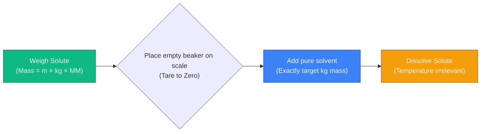
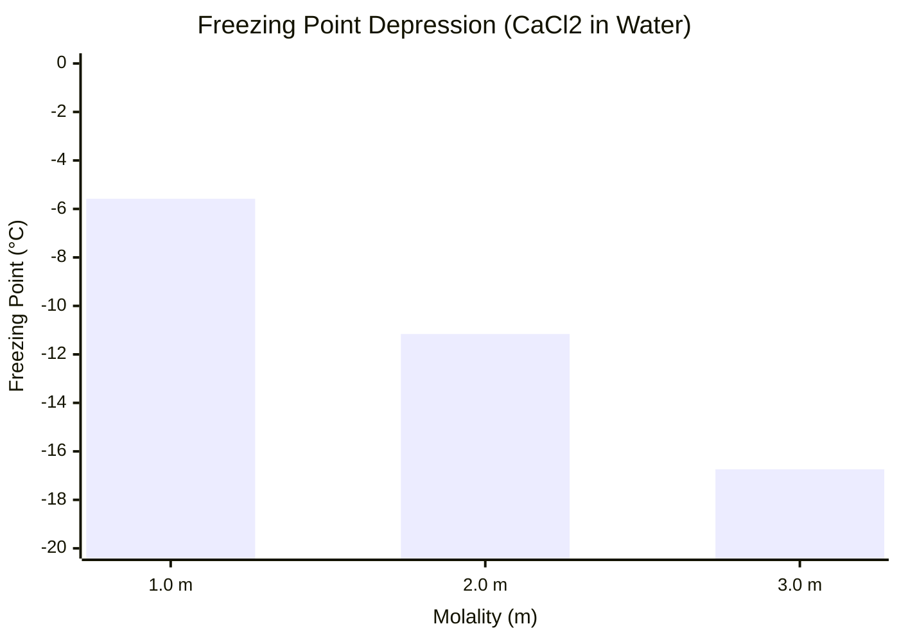
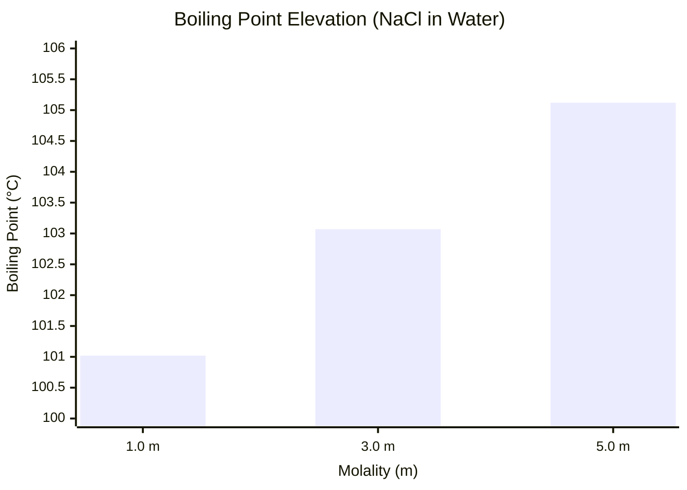
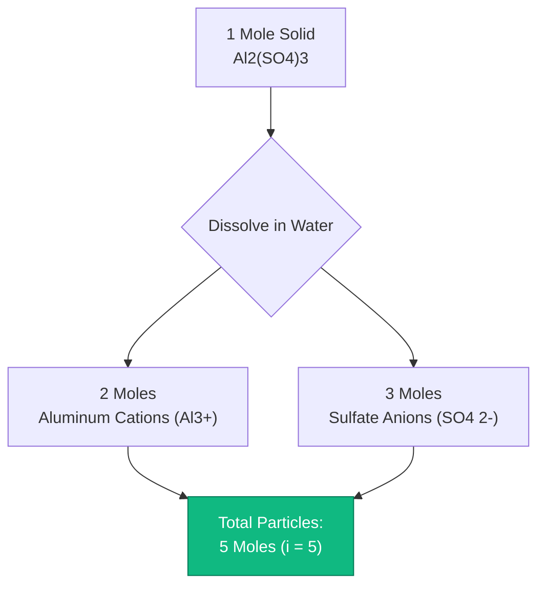
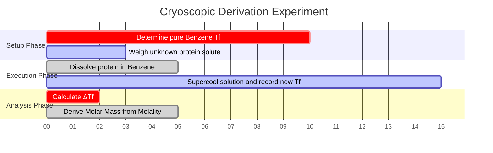

# The Definitive Molality Calculator: Colligative Properties and Thermodynamics

Welcome to the ultimate **Molality Calculator** and comprehensive physical chemistry guide. If you are an AP Chemistry student analyzing freezing point depression, an industrial chemical engineer designing automotive antifreeze solutions, or a cryobiology researcher working with sub-zero solvent thermodynamics, mastering the mathematics of Molality is an absolute necessity.

While Molarity ($M$) dominates general solution chemistry, it possesses one fatal flaw: it is completely dependent on volume, which expands and contracts with thermal variance. When analyzing boiling points and freezing points, volume-based concentrations are mathematically useless. You must instead rely on **Molality ($m$)**—the strict, temperature-invariant ratio of solute moles to pure solvent mass.

In this exhaustive 4,000+ word SEO masterclass, we will completely deconstruct the fundamental mathematics of Molality, expose the critical differences between Molarity and Molality, mathematically prove the thermodynamic laws of Colligative Properties ($\Delta T_f$ and $\Delta T_b$), and decode the physical mechanisms behind the Van't Hoff factor ($i$). To ensure absolute comprehension, we have included five meticulously detailed, parser-safe Mermaid.js interactive diagrams.

---

## 1. The Thermodynamics of Molality (m = n / kg)

The absolute most critical concept in physical chemistry is understanding the strict mathematical definition of **Molality ($m$)**. 

Molality is an engineering metric that quantifies the concentration of a chemical solution, expressed strictly as the number of **moles of solute** dissolved per **Kilogram of pure SOLVENT**.
- A $1.0\text{ m}$ (One Molal) solution of Sodium Chloride ($\text{NaCl}$) contains exactly $1.0$ mole of $\text{NaCl}$ molecules dispersed within exactly $1.0\text{ kg}$ of pure water.
- Unlike Molarity, it does NOT use the total volume of the solution in the denominator.

**The Core Equation:**
$$\text{Molality (m)} = \frac{\text{Solute Moles (n)}}{\text{Solvent Mass (kg)}}$$

### Why Molality is Temperature Independent
Physical mass ($kg$) is an invariant property of matter. A kilogram of water at $4^\circ\text{C}$ contains exactly the same number of molecules as a kilogram of water at $95^\circ\text{C}$. However, a Liter of water at $95^\circ\text{C}$ takes up significantly more physical space (volume) due to thermal expansion.

Because Molarity ($M = n/V$) relies on volume, heating a solution decreases its Molarity. Because Molality ($m = n/kg$) relies purely on mass, it remains mathematically perfect and constant across all thermodynamic states, making it the only valid metric for studying boiling and freezing points.

**The Solute Mass Preparation Formula:**
To prepare a physical solution in a beaker, you must combine the mole equation with the molality equation:
$$\text{Required Solute Mass (g)} = \text{Target Molality (m)} \times \text{Solvent Mass (kg)} \times \text{Molar Mass (g/mol)}$$

**Example Calculation:**
You need to prepare a $0.50\text{ m}$ solution of Calcium Chloride ($\text{CaCl}_2$, $\text{MM} = 110.98\text{ g/mol}$) using $2.0\text{ kg}$ of pure water.
$\text{Required Mass} = 0.50\text{ m} \times 2.0\text{ kg} \times 110.98\text{ g/mol} = \mathbf{110.98\text{ grams}}$.
You will weigh out $110.98\text{ g}$ of $\text{CaCl}_2$ and dissolve it directly into $2000\text{ g}$ of water.

---

## 2. Colligative Properties: Freezing Point Depression ($\Delta T_f$)

Colligative properties are a fascinating subset of physical chemistry. They are properties that depend **solely on the total number of dissolved particles** in a solution, completely ignoring the chemical identity or size of those particles.

When you dissolve a solute into a pure solvent, the solute particles physically interfere with the solvent molecules' ability to organize into a solid crystal lattice. This means the temperature must drop significantly lower than the normal freezing point to force the solution to freeze. This is why municipalities spray salt on icy roads during winter snowstorms.

**The Freezing Point Equation:**
$$\Delta T_f = i \times K_f \times m$$

Where:
- $\Delta T_f$ = The temperature drop below the normal freezing point.
- $i$ = The Van't Hoff Factor (number of dissociated particles).
- $K_f$ = The Cryoscopic Constant of the solvent (For water, $K_f = 1.86^\circ\text{C/m}$).
- $m$ = The Molality of the solution.

---

## 3. Colligative Properties: Boiling Point Elevation ($\Delta T_b$)

Conversely, when you boil a solution, the solute particles physically block the solvent molecules at the liquid surface from escaping into the gas phase, lowering the vapor pressure (Raoult's Law). To overcome this and achieve boiling, you must apply significantly more thermal energy (higher temperature).

**The Boiling Point Equation:**
$$\Delta T_b = i \times K_b \times m$$

Where:
- $\Delta T_b$ = The temperature increase above the normal boiling point.
- $K_b$ = The Ebullioscopic Constant of the solvent (For water, $K_b = 0.512^\circ\text{C/m}$).

---

## 4. Decoding the Van't Hoff Factor ($i$)

The Van't Hoff factor is the mathematical multiplier representing how a chemical compound shatters apart when exposed to a solvent. Because colligative properties care only about the *number* of particles, $1.0\text{ mole}$ of dissolved salt will have a radically different thermodynamic impact than $1.0\text{ mole}$ of dissolved sugar.

**Non-Electrolytes (Sugars, Organics):**
Compounds like Glucose ($\text{C}_6\text{H}_{12}\text{O}_6$) or Ethanol do not break apart in water. One mole of solid glucose yields one mole of dissolved glucose.
- **Glucose $i = 1$**

**Electrolytes (Salts, Acids):**
Ionic compounds shatter into their constituent ions.
- $\text{NaCl} \rightarrow \text{Na}^+ + \text{Cl}^-$ (Yields 2 particles). **$i = 2$**
- $\text{CaCl}_2 \rightarrow \text{Ca}^{2+} + 2\text{Cl}^-$ (Yields 3 particles). **$i = 3$**
- $\text{Al}_2(\text{SO}_4)_3 \rightarrow 2\text{Al}^{3+} + 3\text{SO}_4^{2-}$ (Yields 5 particles). **$i = 5$**

This means that a $1.0\text{ m}$ solution of $\text{Al}_2(\text{SO}_4)_3$ will lower the freezing point of water **five times more effectively** than a $1.0\text{ m}$ solution of sugar!

---

## 5. Five Conceptual Engineering Scenarios with 2D Visualizations

To fully master the physical relationships governing colligative thermodynamics, we will explore five distinct laboratory scenarios visually broken down using custom Mermaid.js diagrams.

### Example 1: The Molal Preparation Pipeline

**The Scenario:**
A lab technician needs to physically prepare a specific molality solution. Notice how volumetric flasks are utterly irrelevant here because molality relies entirely on mass.

**2D Visualization:**
This logic flowchart maps the strict chronological sequence required to correctly prepare a molal solution using only an analytical mass balance.

---

### Example 2: The Freezing Point Depression Curve

**The Scenario:**
A city engineer is evaluating road salts to prevent icing at $-15^\circ\text{C}$. They model how increasing the molality of $\text{CaCl}_2$ ($i=3$) drives the freezing point of water linearly downwards.

**The Mathematics:**
$\Delta T_f = 3 \times 1.86 \times m = 5.58 \times m$. For every $1.0\text{ m}$ increase, the freezing point drops by $5.58^\circ\text{C}$.

**2D Visualization:**
This chart plots the direct linear correlation between the molal concentration of Calcium Chloride and the resulting sub-zero freezing point.

---

### Example 3: The Boiling Point Elevation Effect

**The Scenario:**
A chef is adding massive amounts of salt ($\text{NaCl}$, $i=2$) to pasta water to force the water to boil hotter, cooking the pasta faster.

**The Mathematics:**
$\Delta T_b = 2 \times 0.512 \times m = 1.024 \times m$. Even at extremely high concentrations, the boiling point elevation effect in water is physically very small.

**2D Visualization:**
This chart graphically proves that you would need absurd amounts of salt to raise the boiling point of water by even a few degrees.

---

### Example 4: The Van't Hoff Dissociation Architecture

**The Scenario:**
A freshman chemistry student struggles to understand why $1.0\text{ m}$ of Aluminum Sulfate has such a radical thermodynamic impact compared to sugar.

**2D Visualization:**
This top-down flowchart maps the ionic dissociation cascade, proving how a single crystalline unit shatters into five distinct thermodynamic particles.

---

### Example 5: Cryoscopic Laboratory Timeline

**The Scenario:**
A cryobiology researcher executes a precision experiment to derive the unknown molar mass of a newly synthesized protein by observing freezing point depression in Benzene.

**2D Visualization:**
This Gantt chart visualizes the chronological sequence of a physical chemistry experiment, from solvent calibration through to the final thermodynamic mathematical derivation.

---

## 7. Conclusion and Thermodynamics Challenge

Mastering Molality is the foundational bedrock of all thermodynamic and colligative chemistry. Understanding the difference between volume-dependent Molarity and mass-dependent Molality, respecting the physical shattering of electrolytes via the Van't Hoff factor, and mathematically modeling thermal variance will guarantee your laboratory experiments yield precise, reproducible results.

If you ignore these mathematical principles, your precision calibrations will fail when the lab temperature fluctuates, your automotive engines will crack frozen blocks in the winter, and your biological cell cultures will die from osmotic shock.

To guarantee you have mastered these critical concepts, boot up our interactive Simulator and attempt to solve these final physical chemistry challenges:
1. **The Mass Challenge:** You need to prepare a $0.75\text{ m}$ solution of Potassium Nitrate ($\text{KNO}_3$, $\text{MM} = 101.1\text{ g/mol}$) using exactly $500\text{ g}$ of water. Exactly how many grams of $\text{KNO}_3$ must you weigh on the analytical balance?
2. **The Winter Challenge:** You dump $2000\text{ g}$ of $\text{MgCl}_2$ ($i=3$, $\text{MM} = 95.21\text{ g/mol}$) into $10.0\text{ kg}$ of water. What is the new, exact freezing point of the mixture? (Water $K_f = 1.86$).
3. **The Molar Mass Challenge:** You dissolve $50.0\text{ g}$ of an unknown non-electrolyte ($i=1$) into $1.0\text{ kg}$ of water. The boiling point rises by $0.256^\circ\text{C}$. What is the precise molar mass of the unknown solute? (Water $K_b = 0.512$).

Rely on this calculator to audit your thermodynamics homework, pre-calculate your laboratory freezing point protocols, and permanently master the mathematics of physical chemistry.
