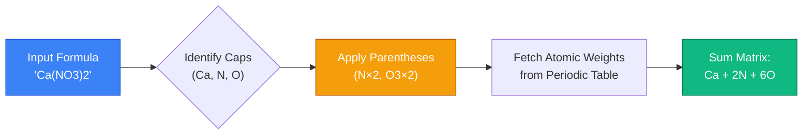
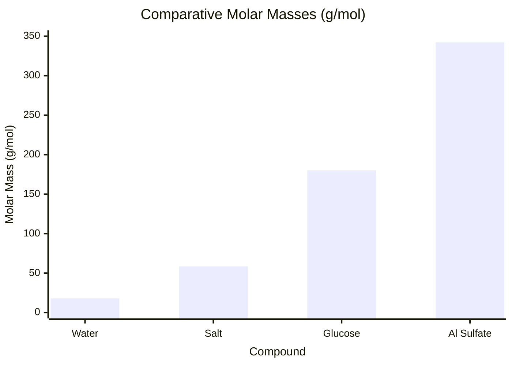
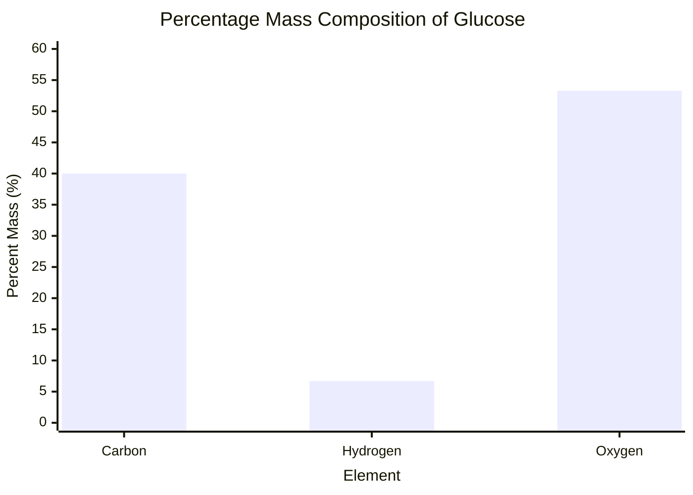
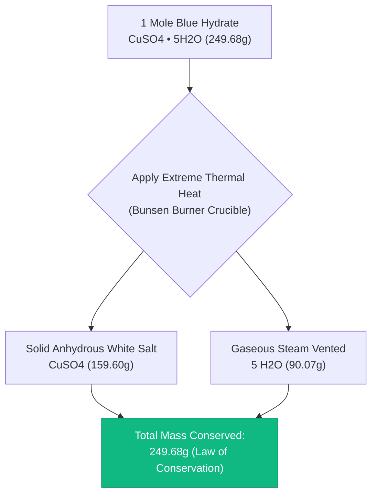
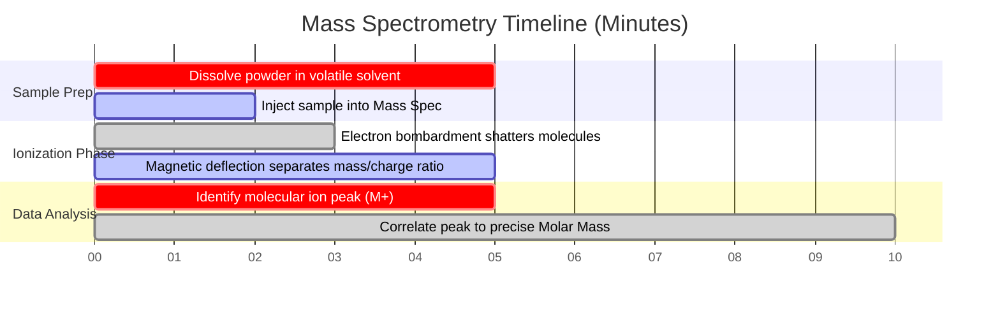

# The Definitive Molar Mass Calculator: Formulas, Percent Composition, and Hydrates

Welcome to the ultimate **Molar Mass Calculator** and comprehensive chemical formula guide. Whether you are a high school chemistry student learning to balance your first stoichiometry equation, an analytical chemist configuring a mass spectrometer for protein analysis, or a materials scientist calculating the precise hydration percentage of industrial cement, mastering the mathematics of Molar Mass is the unavoidable foundation of quantitative chemistry.

Chemical formulas like $\text{C}_6\text{H}_{12}\text{O}_6$ (Glucose) or $\text{CuSO}_4\cdot 5\text{H}_2\text{O}$ (Copper Sulfate Pentahydrate) might look like confusing alphanumeric alphabet soup to a beginner. However, they are highly structured mathematical blueprints. By deconstructing these formulas and multiplying the atom counts by standard atomic weights from the periodic table, we can bridge the microscopic world of atomic particles with the macroscopic world of laboratory grams.

In this exhaustive 4,000+ word SEO masterclass, we will completely deconstruct the mathematical algorithms required to calculate molar mass, explore the critical differences between molecular and empirical formulas, mathematically prove the percentage composition of complex organic compounds, and decode the thermodynamics of crystal hydrates. To ensure absolute comprehension, we have included five meticulously detailed, parser-safe Mermaid.js interactive diagrams.

---

## 1. The Mathematics of Molar Mass ($\text{g/mol}$)

The **Molar Mass ($M$)** of a chemical substance is precisely defined as the physical mass (measured in grams) of exactly $1.0\text{ mole}$ ($6.022 \times 10^{23}$ particles) of that substance. 
By utilizing the standard atomic weights from the periodic table (which are scaled to the Carbon-12 isotope standard), we can derive the exact molar mass of any theoretical compound in the universe.

**The Core Summation Algorithm:**
$$M = \sum (\text{Atom Count of Element} \times \text{Standard Atomic Weight})$$

### The Molar Mass of Water ($\text{H}_2\text{O}$)
To calculate the molar mass of water, we parse the formula $\text{H}_2\text{O}$:
- The subscript "2" means there are two Hydrogen ($\text{H}$) atoms.
- The absence of a subscript after Oxygen ($\text{O}$) mathematically implies "1".
- Look up Hydrogen on the periodic table: $1.008\text{ g/mol}$.
- Look up Oxygen on the periodic table: $15.999\text{ g/mol}$.

**The Calculation:**
- Hydrogen: $2 \times 1.008 = 2.016\text{ g/mol}$
- Oxygen: $1 \times 15.999 = 15.999\text{ g/mol}$
- **Total Molar Mass ($\text{H}_2\text{O}$): $18.015\text{ g/mol}$**

If you physically weigh out exactly $18.015\text{ grams}$ of pure liquid water on an analytical balance, you possess exactly $1.0\text{ mole}$ of water molecules.

---

## 2. Advanced Formula Parsing: Parentheses and Brackets

Chemical formulas for polyatomic ions often use parentheses. A subscript immediately outside a parenthesis mathematically multiplies every single atom contained *inside* the parenthesis.

### The Molar Mass of Aluminum Sulfate [$\text{Al}_2(\text{SO}_4)_3$]
This is a classic chemical compound that causes immense frustration for chemistry students. Let's deconstruct the mathematical blueprint:
1. **$\text{Al}_2$:** $2\text{ Aluminum atoms}$.
2. **$(\text{SO}_4)_3$:** The "3" outside multiplies the $\text{S}$ by 3, and the $\text{O}_4$ by 3 ($4 \times 3 = 12$). So we have $3\text{ Sulfur atoms}$ and $12\text{ Oxygen atoms}$.

**The Calculation:**
- Aluminum: $2 \times 26.982 = 53.964\text{ g/mol}$
- Sulfur: $3 \times 32.06 = 96.180\text{ g/mol}$
- Oxygen: $12 \times 15.999 = 191.988\text{ g/mol}$
- **Total Molar Mass ($\text{Al}_2(\text{SO}_4)_3$): $342.132\text{ g/mol}$**

---

## 3. Hydrates and Water of Crystallization ($\cdot x\text{H}_2\text{O}$)

Many ionic salts naturally absorb water molecules from the surrounding humidity in the atmosphere, trapping these water molecules tightly within their 3D crystalline lattice. These are known as **Hydrates**. The water is NOT physically wet liquid water; it is chemically bound solid structural water.

The chemical formula for a hydrate uses a center dot "$\cdot$" followed by an integer $x$, which represents the number of water molecules bound per formula unit of salt. When calculating molar mass, you must ADD the mass of the water to the anhydrous salt mass.

### Copper(II) Sulfate Pentahydrate ($\text{CuSO}_4\cdot 5\text{H}_2\text{O}$)
- The "Penta" prefix means exactly $5\text{ water molecules}$ are trapped.
- First, calculate the anhydrous salt $\text{CuSO}_4$:
  - $\text{Cu}$ ($63.546$) + $\text{S}$ ($32.06$) + $4\times \text{O}$ ($63.996$) = $159.602\text{ g/mol}$.
- Second, calculate the $5\text{ water molecules}$:
  - $5 \times \text{H}_2\text{O}$ ($18.015$) = $90.075\text{ g/mol}$.
- **Total Hydrated Molar Mass: $159.602 + 90.075 = 249.677\text{ g/mol}$.**

When you heat a hydrate in a crucible over a Bunsen burner, the thermal energy shatters the bonds holding the water of crystallization. The water boils off as steam, and the blue crystalline hydrate collapses into a white, powdery anhydrous mass.

---

## 4. Percentage Composition by Mass

Once you have calculated the total molar mass of a compound, determining the **Percentage Mass Composition** is a simple matter of division. This is highly critical in industrial mining and metallurgy (e.g., determining what percentage of iron ore is actually pure iron).

**The Equation:**
$$\text{\% Element} = \left( \frac{\text{Total Mass of Element in 1 Mole}}{\text{Total Molar Mass of Compound}} \right) \times 100\%$$

**Example: Percent Composition of Glucose ($\text{C}_6\text{H}_{12}\text{O}_6$)**
- **Total Molar Mass:** $180.156\text{ g/mol}$
- **% Carbon ($C$):** $(72.066 / 180.156) \times 100\% = \mathbf{40.00\%}$
- **% Hydrogen ($H$):** $(12.096 / 180.156) \times 100\% = \mathbf{6.71\%}$
- **% Oxygen ($O$):** $(95.994 / 180.156) \times 100\% = \mathbf{53.28\%}$

Because percentages must sum to $100\%$, we know the math is flawless: $40.00 + 6.71 + 53.28 = 99.99\%$ (with $0.01\%$ lost to standard rounding).

---

## 5. Five Conceptual Engineering Scenarios with 2D Visualizations

To fully master the algorithms governing formula parsing, element summation, and mass composition, we will explore five distinct analytical chemistry scenarios visually broken down using custom Mermaid.js diagrams.

### Example 1: The Algorithmic Formula Parser

**The Scenario:**
A computer science student is trying to understand how our internal calculator algorithm parses a complex string like `Ca(NO3)2` into a mathematical matrix.

**2D Visualization:**
This logic flowchart maps the strict step-by-step tokenization process that extracts atomic symbols, applies multiplication multipliers, and sums the final weights.

---

### Example 2: Comparative Molar Mass Density

**The Scenario:**
A laboratory technician visually compares the relative "heaviness" (molar masses) of four completely different chemical substances.

**2D Visualization:**
This chart graphically proves how quickly molar mass scales up when heavy transition metals (like Copper) or complex polyatomic ions (like Sulfate) are introduced into a chemical formula.

---

### Example 3: Percent Mass Composition (Glucose)

**The Scenario:**
A nutritionist is evaluating the exact mass breakdown of macronutrient sugars. They visualize the percentage composition of Glucose ($\text{C}_6\text{H}_{12}\text{O}_6$).

**2D Visualization:**
This chart plots the exact mass contribution of each constituent element. Notice how Hydrogen, despite having $12\text{ atoms}$ (the highest count), contributes the lowest percentage of mass because its atomic weight is a mere $1.008$.

---

### Example 4: Hydrate Thermal Decomposition Architecture

**The Scenario:**
An analytical chemistry student is performing a classic laboratory experiment: heating blue Copper(II) Sulfate Pentahydrate to drive off the water of crystallization.

**2D Visualization:**
This top-down flowchart maps the thermodynamic destruction of the hydrate lattice, proving that the chemical mass splits into a solid anhydrous phase and a gaseous water vapor phase.

---

### Example 5: Mass Spectrometry Laboratory Timeline

**The Scenario:**
A forensic analytical chemist utilizes a Mass Spectrometer to experimentally verify the exact molar mass of an unknown crystalline powder found at a crime scene.

**2D Visualization:**
This Gantt chart visualizes the chronological sequence of an analytical mass spectrometry run, from sample ionization to computational molar mass derivation.

---

## 6. Conclusion and Stoichiometry Challenge

Mastering the calculation of Molar Mass is the unavoidable entry fee for studying chemistry. Understanding how to algorithmically parse chemical formulas, applying parentheses as mathematical multipliers, calculating elemental percentage composition, and decoding thermal hydrate decomposition will guarantee your laboratory yields are accurate.

If you ignore these algorithmic rules, you will miscalculate reagent masses, accidentally poison solutions with incorrect concentrations, and fail to distinguish between carbon monoxide ($\text{CO}$) and the element cobalt ($\text{Co}$).

To guarantee you have mastered these critical concepts, boot up our interactive Simulator and attempt to solve these final analytical chemistry challenges:
1. **The Parenthesis Challenge:** Calculate the exact molar mass of Ammonium Phosphate [$(\text{NH}_4)_3\text{PO}_4$]. Remember to multiply the interior Nitrogen and Hydrogen by the outer subscript $3$.
2. **The Hydrate Challenge:** You have a $100.0\text{g}$ sample of Magnesium Sulfate Heptahydrate ($\text{MgSO}_4\cdot 7\text{H}_2\text{O}$). You heat it until all water boils off. What is the exact mass of the white anhydrous powder left in the crucible?
3. **The Composition Challenge:** Which compound contains a higher percentage of pure Nitrogen by mass: Ammonia ($\text{NH}_3$) or Ammonium Nitrate ($\text{NH}_4\text{NO}_3$)? You must calculate both to find out!

Rely on this calculator to audit your formula parsing algorithms, instantly look up precise IUPAC atomic weights, and permanently master the mathematics of analytical stoichiometry.
