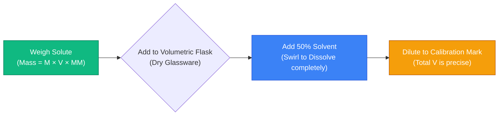
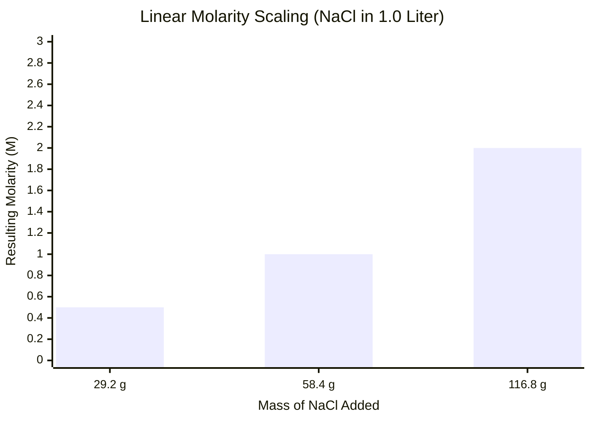
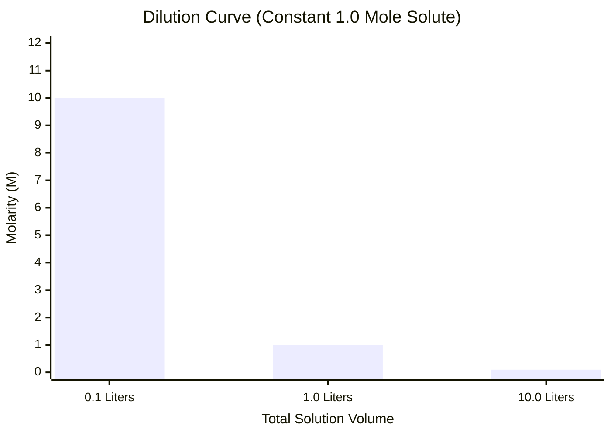
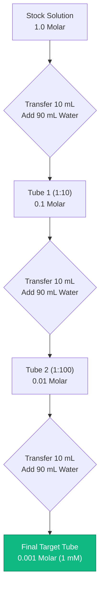
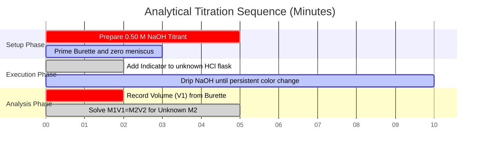

# The Definitive Molarity Calculator: Moles, Mass, and Dilution Stoichiometry

Welcome to the ultimate **Molarity Calculator** and comprehensive chemical solution engineering guide. Whether you are an AP Chemistry student struggling with stoichiometry homework, a medical pharmacology student calculating IV drip concentrations, or an industrial chemical engineer scaling up a 10,000-liter batch of sulfuric acid, mastering the mathematics of molarity is absolutely non-negotiable.

Chemistry is the science of reactions, and the overwhelming majority of chemical reactions occur within liquid solutions. If you incorrectly calculate the required mass of your solute, your experiment will fail. If you misunderstand the fundamental $M_1 V_1 = M_2 V_2$ dilution equation, you could accidentally administer a lethal drug overdose in a clinical setting. If you do not grasp the physical difference between Molarity (temperature-dependent) and Molality (temperature-independent), your precision analytical calibrations will be inherently flawed.

In this exhaustive 4,000+ word SEO masterclass, we will completely deconstruct the fundamental mathematics of Solution Concentration, expose the hidden complexities of volumetric flask preparation, mathematically prove the dilution conservation of mass, and decode the exact stoichiometric formulas required to prepare complex chemical mixtures from scratch. To ensure absolute comprehension, we have included five meticulously detailed, parser-safe Mermaid.js interactive diagrams.

---

## 1. The Fundamental Physics of Molarity (M = n / V)

The absolute most critical concept in solution chemistry is understanding the strict mathematical definition of **Molarity ($M$)**. 

Molarity is an engineering metric that quantifies the concentration of a chemical solution, expressed strictly as the number of **moles of solute** dissolved per **Liter of total solution**.
- A $1.0\text{ M}$ (One Molar) solution of Sodium Chloride ($\text{NaCl}$) contains exactly $1.0$ mole of $\text{NaCl}$ molecules dispersed within $1.0$ Liter of total physical volume.
- It does NOT mean $1.0$ mole of solute added to $1.0$ Liter of pure water (that is a common, catastrophic mistake we will discuss later).

**The Core Equation:**
$$\text{Molarity (M)} = \frac{\text{Solute Moles (n)}}{\text{Solution Volume (Liters)}}$$

### The Concept of the Mole ($n$)
Before you can calculate molarity, you must understand what a "mole" is. You cannot count individual atoms with tweezers; they are too small. Instead, chemists use **Avogadro’s Number** ($6.022 \times 10^{23}$). 
One mole of ANY substance contains exactly $6.022 \times 10^{23}$ particles.
However, because atoms have different physical weights, one mole of Carbon weighs $12.011$ grams, while one mole of Lead weighs a massive $207.2$ grams. This is known as **Molar Mass ($\text{MM}$)**.

**The Moles Equation:**
$$\text{Solute Moles (n)} = \frac{\text{Physical Mass (grams)}}{\text{Molar Mass (g/mol)}}$$

### Calculating Mass from Molarity
In the real world, laboratory scales measure mass in grams, not moles. To prepare a physical solution in a beaker, you must combine the two equations above into the universal Solution Preparation Formula:

**The Solution Preparation Formula:**
$$\text{Required Mass (grams)} = \text{Target Molarity (M)} \times \text{Volume (L)} \times \text{Molar Mass (g/mol)}$$

**Example Calculation:**
You need to prepare $500\text{ mL}$ ($0.500\text{ L}$) of a $0.200\text{ M}$ solution of Glucose ($\text{C}_6\text{H}_{12}\text{O}_6$). The molar mass of Glucose is $180.156\text{ g/mol}$.
$\text{Required Mass} = 0.200\text{ M} \times 0.500\text{ L} \times 180.156\text{ g/mol} = \mathbf{18.015\text{ grams}}$.
You will weigh out $18.015\text{ g}$ of glucose powder.

---

## 2. The Volumetric Flask Constraint (A Critical Error)

The single most common mistake made by freshman chemistry students is adding the solute to the final volume of solvent.

If you take $18.015\text{ g}$ of glucose and pour it into exactly $500\text{ mL}$ of pure water, your final solution volume will be **greater than** $500\text{ mL}$ because the physical mass of the solid glucose occupies physical space and displaces the water. Your resulting molarity will be incorrectly low.

**The Correct Volumetric Protocol:**
1. Weigh out the $18.015\text{ g}$ of glucose.
2. Add it to a dry $500\text{ mL}$ **Volumetric Flask**.
3. Add only $300\text{ mL}$ of water to dissolve the solid completely.
4. Once completely dissolved, slowly add water drop-by-drop until the bottom of the liquid meniscus exactly touches the $500\text{ mL}$ calibration line on the flask neck.

This protocol guarantees that the **total final volume** of the mixture (solute + solvent) is exactly $500\text{ mL}$, ensuring a mathematically perfect $0.200\text{ M}$ concentration.

---

## 3. The Dilution Equation ($M_1V_1 = M_2V_2$)

In professional laboratories, scientists do not prepare weak solutions from scratch. Instead, they prepare massive vats of highly concentrated **Stock Solutions** (e.g., $10.0\text{ M}$ Hydrochloric Acid). When they need a weaker concentration (e.g., $1.0\text{ M}$) for an experiment, they extract a small volume of the stock solution and dilute it with pure water.

When you dilute a solution by adding water, the **total volume increases**, the **molarity decreases**, but the **total number of solute particles (moles) remains completely unchanged**.

Because $\text{Moles} = \text{Molarity} \times \text{Volume}$, and the moles remain constant before and after dilution, we derive the universal Dilution Law:

**The Dilution Formula:**
$$M_1 \times V_1 = M_2 \times V_2$$

Where:
- $M_1$ = Initial Concentration of Stock Solution
- $V_1$ = Initial Volume extracted from Stock Solution (The unknown we usually solve for)
- $M_2$ = Final Target Concentration of Diluted Solution
- $V_2$ = Final Target Volume of Diluted Solution

**Example Calculation:**
You need $2.0\text{ Liters}$ ($V_2$) of $0.50\text{ M}$ ($M_2$) $\text{HCl}$ for an experiment. You have a jug of $12.0\text{ M}$ ($M_1$) Stock $\text{HCl}$. How much stock solution do you extract?
$$12.0\text{ M} \times V_1 = 0.50\text{ M} \times 2.0\text{ L}$$
$$V_1 = \frac{0.50 \times 2.0}{12.0} = \mathbf{0.0833\text{ Liters (83.3 mL)}}$$

**Calculating Water Added:**
You extract $83.3\text{ mL}$ of the highly dangerous $12.0\text{ M}$ acid. To reach the final $2.0\text{ Liters}$ ($2000\text{ mL}$) volume, how much pure water must you add?
$$\text{Water Added} = V_2 - V_1 = 2000\text{ mL} - 83.3\text{ mL} = \mathbf{1916.7\text{ mL}}$$

---

## 4. Five Conceptual Engineering Scenarios with 2D Visualizations

To fully master the physical relationships governing chemical solutions, we will explore five distinct laboratory scenarios visually broken down using custom Mermaid.js diagrams.

### Example 1: The Solution Preparation Pipeline

**The Scenario:**
A lab technician needs to physically prepare a specific molarity solution from a dry chemical powder.

**2D Visualization:**
This logic flowchart maps the strict chronological sequence required to correctly use a volumetric flask, preventing the volume displacement error discussed earlier.

---

### Example 2: Mass vs Molarity Scaling

**The Scenario:**
A student is preparing $1.0\text{ Liter}$ of $\text{NaCl}$ solution and wants to understand how the molarity increases linearly as they add more physical mass of salt into the beaker.

**The Mathematics:**
Because Molar Mass ($\text{MM}$) and Volume ($V$) are held constant, Molarity ($M$) becomes directly proportional to Mass.

**2D Visualization:**
This chart plots the direct linear correlation between the grams of $\text{NaCl}$ added to $1.0\text{ L}$ of water and the resulting solution molarity.

---

### Example 3: The Dilution Volume Curve

**The Scenario:**
A chemist takes $0.1\text{ Liters}$ of a $10.0\text{ M}$ stock solution and begins adding water. They want to track how the molar concentration plummets exponentially as the total volume scales up.

**The Mathematics:**
Since the moles of solute are trapped at exactly $1.0\text{ mole}$ ($10.0\text{ M} \times 0.1\text{ L}$), the Molarity ($M = 1.0 / V$) drops as an inverse function of the total volume.

**2D Visualization:**
This chart graphically proves the inverse relationship governing the $M_1 V_1 = M_2 V_2$ dilution law.

---

### Example 4: The Serial Dilution Architecture

**The Scenario:**
A microbiologist needs an extremely dilute $0.001\text{ M}$ ($1\text{ mM}$) solution for a bacterial culture, starting from a $1.0\text{ M}$ stock. Directly pipetting the required microliters into a massive vat of water is too inaccurate. They must perform a Serial Dilution.

**2D Visualization:**
This top-down flowchart maps a 1:10 step-wise serial dilution cascade, demonstrating how passing $10\text{ mL}$ of solution into $90\text{ mL}$ of water successively divides the concentration by 10 at each stage.

---

### Example 5: Acid-Base Titration Timeline

**The Scenario:**
An analytical chemist uses a burette of known $0.50\text{ M}$ $\text{NaOH}$ to neutralize a flask of unknown $\text{HCl}$ molarity. They track the sequence of laboratory events required to execute the analysis.

**2D Visualization:**
This Gantt chart visualizes the chronological sequence of a chemical titration experiment, from reagent preparation through to the stoichiometric mathematical derivation.

---

## 5. Conclusion and Chemistry Challenge

Mastering Molarity calculations is the foundational bedrock of all quantitative chemistry. Understanding the difference between solute mass and chemical moles, respecting the physical volume displacement laws of volumetric flasks, and mathematically modeling dilution pipelines will guarantee your laboratory experiments yield precise, reproducible results.

If you ignore these mathematical principles, your serial dilutions will compound catastrophic errors, your biological cell cultures will die from osmotic shock due to hypertonic concentrations, and your industrial scale-up reactions will yield contaminated byproducts.

To guarantee you have mastered these critical concepts, boot up our interactive Simulator and attempt to solve these final stoichiometric challenges:
1. **The Mass Challenge:** You need to prepare $250\text{ mL}$ of a $0.050\text{ M}$ solution of Copper(II) Sulfate Pentahydrate ($\text{CuSO}_4\cdot 5\text{H}_2\text{O}$, $\text{MM} = 249.68\text{ g/mol}$). Exactly how many milligrams must you weigh on the analytical balance?
2. **The Dilution Challenge:** You accidentally poured $150\text{ mL}$ of pure water into a beaker containing $50\text{ mL}$ of $2.0\text{ M}$ stock solution. What is the exact final molarity of your ruined mixture?
3. **The Moles Challenge:** An IV drip bag contains $1000\text{ mL}$ of $0.154\text{ M}$ $\text{NaCl}$ (Normal Saline). Exactly how many total moles of $\text{Na}^+$ ions will the patient receive over the duration of the infusion?

Rely on this calculator to audit your homework, pre-calculate your laboratory protocols, and permanently master the mathematics of chemical solutions.
