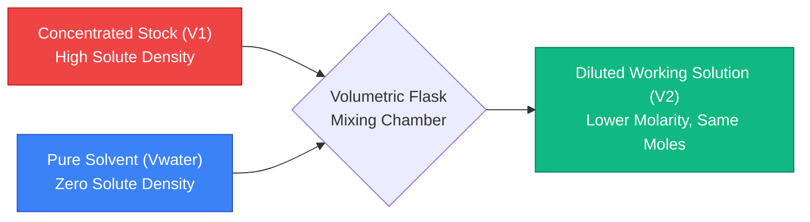
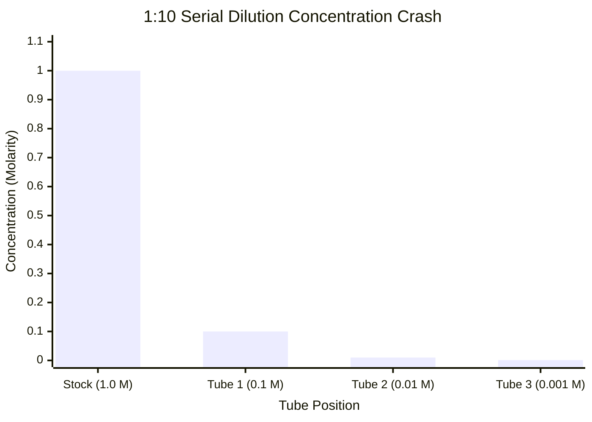
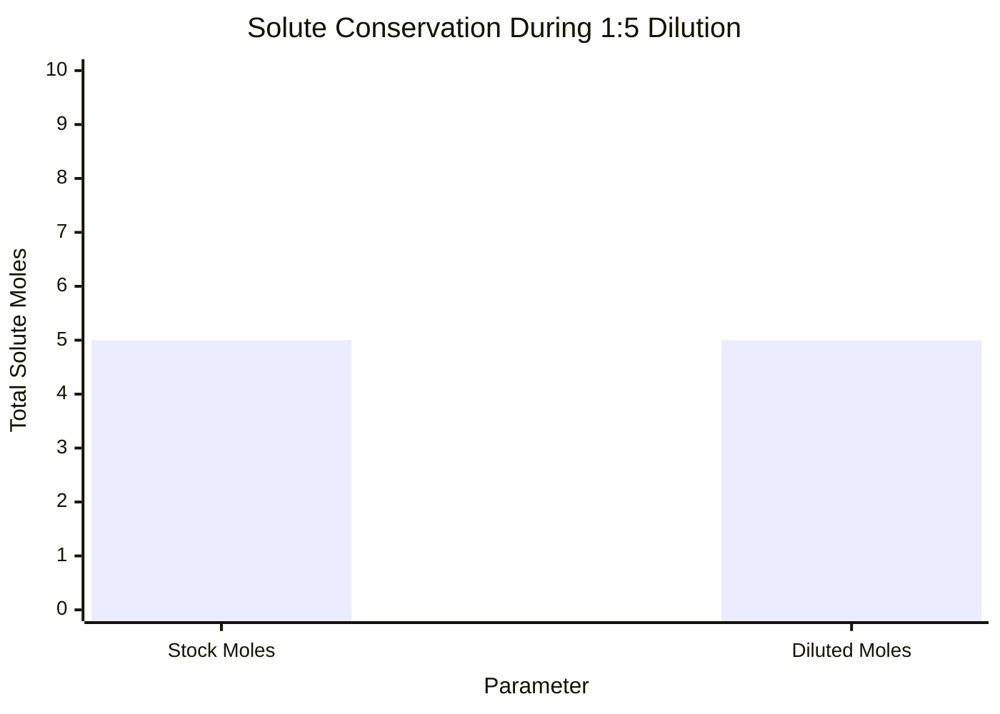
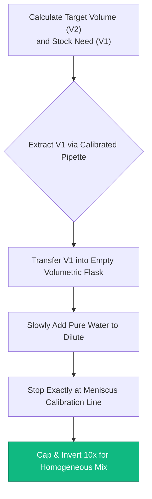
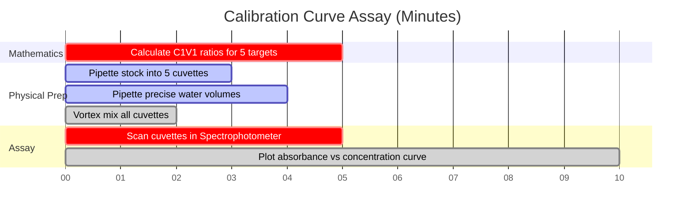

# The Definitive Molarity Dilution Calculator: $C_1 V_1 = C_2 V_2$ and Solution Prep

Welcome to the ultimate **Molarity Dilution Calculator** and comprehensive laboratory solution preparation guide. Whether you are a high school chemistry student learning the fundamental $C_1 V_1 = C_2 V_2$ equation, a biochemist preparing complex buffer solutions for protein extraction, or a microbiologist executing precise serial dilutions to calculate bacterial colony-forming units, mastering solution dilution is the unavoidable mechanical foundation of experimental science.

Purchasing pre-mixed chemical solutions at exact concentrations is prohibitively expensive and wildly inefficient. Instead, modern laboratories purchase highly concentrated **Stock Solutions**. By pipetting precise micro-volumes of these dense stocks and diluting them with pure solvent (typically de-ionized water), chemists can instantly manufacture endless volumes of customized working solutions on demand.

In this exhaustive 4,000+ word SEO masterclass, we will completely deconstruct the thermodynamics of solute conservation, mathematically prove the $C_1 V_1 = C_2 V_2$ dilution algorithm, decode the exponential decay mechanics of serial dilutions, and expose the most common laboratory errors that destroy solution accuracy. To ensure absolute comprehension, we have included five meticulously detailed, parser-safe Mermaid.js interactive diagrams.

---

## 1. The Core Physics of Dilution: Solute Conservation

Before memorizing any mathematical equations, you must grasp the fundamental physics of a dilution event. 

When you dilute a concentrated stock solution, you are *only* adding pure solvent (water). Pure solvent contains absolute zero solute particles. Therefore, the total number of solute molecules floating in your beaker remains strictly, mathematically constant.

**The Golden Rule of Dilution:**
$$(\text{Total Moles of Solute Before}) = (\text{Total Moles of Solute After})$$

Because Molarity ($M$) is defined as Moles per Liter ($\text{mol}/V$), we can rearrange the definition to prove that $\text{Moles} = M \times V$. 
If moles never change during dilution, then:
$$M_{\text{initial}} \times V_{\text{initial}} = M_{\text{final}} \times V_{\text{final}}$$

This yields the world-famous dilution equation, universally taught to every chemistry student on Earth:
$$C_1 V_1 = C_2 V_2$$

*(Note: $C$ stands for Concentration and $V$ stands for Volume. $M_1 V_1 = M_2 V_2$ is the exact same equation, specifically restricting concentration to Molarity).*

---

## 2. Solving the $C_1 V_1 = C_2 V_2$ Matrix

The dilution equation contains four variables. If a laboratory protocol provides any three variables, you can effortlessly calculate the fourth using basic algebra.

### Scenario A: Finding the Required Stock Volume ($V_1$)
A laboratory protocol requires you to prepare $500\text{ mL}$ of a $0.5\text{ M}$ Hydrochloric Acid ($\text{HCl}$) working solution. Your chemical storage cabinet contains a highly concentrated $12.0\text{ M}$ $\text{HCl}$ stock solution. How much stock solution do you need to pipette?

**Given:**
- $C_1 = 12.0\text{ M}$ (Stock)
- $C_2 = 0.5\text{ M}$ (Target)
- $V_2 = 500\text{ mL}$ (Target)

**Calculation:**
$$V_1 = \frac{C_2 \times V_2}{C_1} = \frac{0.5 \times 500}{12.0} = \mathbf{20.83\text{ mL}}$$

You must carefully extract $20.83\text{ mL}$ of the dangerous $12.0\text{ M}$ stock solution.

### Scenario B: Calculating Solvent Volume Added ($V_{\text{water}}$)
In Scenario A, you pipetted $20.83\text{ mL}$ of stock. Your final target volume is $500\text{ mL}$. How much pure deionized water must you add?
$$V_{\text{water}} = V_2 - V_1 = 500\text{ mL} - 20.83\text{ mL} = \mathbf{479.17\text{ mL of Water}}$$

---

## 3. The Power of Serial Dilutions

When a scientist needs a concentration that is exponentially smaller than the stock solution (e.g., diluting a $1.0\text{ M}$ stock down to $0.000001\text{ M}$), executing a single dilution step is physically impossible. The required stock volume ($V_1$) would be far smaller than a microscopic droplet, exceeding the precision limits of modern laboratory pipettes.

The solution is a **Serial Dilution**: a sequence of identical stepwise dilutions that trigger rapid exponential concentration decay.

### The 1:10 Serial Dilution Sequence
A 1:10 dilution means $1\text{ part stock}$ is mixed with $9\text{ parts solvent}$, producing $10\text{ parts total volume}$. This perfectly divides the concentration by $10$ (a Dilution Factor of 10).

1. **Tube 1 ($10^{-1}$):** Mix $1\text{ mL}$ Stock ($1.0\text{ M}$) + $9\text{ mL}$ Water $\rightarrow$ New Concentration = $0.100\text{ M}$.
2. **Tube 2 ($10^{-2}$):** Mix $1\text{ mL}$ from Tube 1 + $9\text{ mL}$ Water $\rightarrow$ New Concentration = $0.010\text{ M}$.
3. **Tube 3 ($10^{-3}$):** Mix $1\text{ mL}$ from Tube 2 + $9\text{ mL}$ Water $\rightarrow$ New Concentration = $0.001\text{ M}$.

By sequentially transferring the previously diluted solution, scientists can achieve extreme nano-molar concentrations with massive statistical accuracy.

---

## 4. Laboratory Best Practices and Lethal Safety Traps

Executing dilutions on paper is clean and flawless; executing dilutions in a physical laboratory introduces chaos, human error, and extreme safety hazards.

**1. The Exothermic Acid Trap (Always Add Acid to Water):**
When concentrated sulfuric acid ($\text{H}_2\text{SO}_4$) is diluted with water, the hydration thermodynamics violently release heat. If you pour water *into* a beaker of concentrated acid, the water instantly boils, exploding boiling acid into your face. You must *always* slowly pour acid *into* a large volume of water to safely dissipate the thermal energy.

**2. The Meniscus Reading Error:**
When preparing a solution in a volumetric flask, the liquid surface curves downward, forming a 'U' shape called a meniscus. You must align your eye perfectly horizontal with the glass calibration line, ensuring the absolute *bottom* of the meniscus touches the line. Viewing from a high or low angle induces a parallax error, ruining your final volume ($V_2$).

**3. The Volumetric Contraction Paradox:**
If you mix $50\text{ mL}$ of water and $50\text{ mL}$ of pure ethanol, the final volume is NOT $100\text{ mL}$; it is roughly $96\text{ mL}$. Different molecules pack together differently (like pouring sand into a bucket of golf balls). Therefore, you must never measure solvent volumes separately. Always transfer your stock volume ($V_1$) to a volumetric flask first, and then simply fill the flask *up to* the total volume line ($V_2$).

---

## 5. Five Conceptual Engineering Scenarios with 2D Visualizations

To fully master the mechanical algorithms governing concentration reduction, solute conservation, and sequential serial assays, we will explore five distinct analytical chemistry scenarios visually broken down using custom Mermaid.js diagrams.

### Example 1: The Dilution Mechanism Architecture

**The Scenario:**
A freshman biology student is trying to map the mechanical mass flow of a single-step stock dilution protocol.

**2D Visualization:**
This flowchart visually maps how concentrated stock and pure solvent collide inside a volumetric flask to spawn a stable, homogenous, diluted working solution.

---

### Example 2: Serial Dilution Concentration Decay

**The Scenario:**
A microbiologist executes a 3-step 1:10 serial dilution to reduce the lethality of an antibiotic compound before testing it on live bacterial cells.

**2D Visualization:**
This chart graphically tracks the massive exponential crash in molar concentration as the dilution protocol progresses down the rack of test tubes.

---

### Example 3: The Solute Conservation Proof

**The Scenario:**
A chemistry teacher is trying to prove to her students that adding gallons of water to a salt solution does not magically create or destroy salt molecules.

**2D Visualization:**
This comparative chart visually proves that while Concentration ($M$) and Volume ($V$) fluctuate wildly during dilution, the total mass of the solute particles is mathematically locked.

---

### Example 4: Volumetric Flask Preparation Protocol

**The Scenario:**
A laboratory technician maps the rigid standard operating procedure (SOP) required to legally certify a standard analytical solution for industrial food testing.

**2D Visualization:**
This top-down flowchart acts as a strict chemical recipe, enforcing the absolute sequence of actions required to prevent volume contraction errors and thermal hazards.

---

### Example 5: Spectrophotometry Assay Timeline

**The Scenario:**
An analytical chemist must prepare a perfectly spaced gradient of diluted dye solutions to calibrate a spectrophotometer's absorbance laser.

**2D Visualization:**
This Gantt chart visualizes the chronological sequence of a multi-step calibration assay, from mathematics and physical dilution to ultimate laser calibration.

---

## 6. Conclusion and Stoichiometry Challenge

Mastering the $C_1 V_1 = C_2 V_2$ dilution algorithm is the non-negotiable entry requirement for entering any biological, chemical, or medical laboratory on Earth. Understanding the mathematical rigidity of solute conservation, the necessity of volumetric glassware to defeat volume contraction, and the exponential power of serial dilutions will guarantee your working solutions perform exactly as intended.

If you fail to master these algorithms, your buffers will instantly kill cultured cells, your mass spectrometers will flatline, and your experimental data will be utterly corrupted by human error.

To guarantee you have mastered these critical concepts, boot up our interactive Simulator and attempt to solve these final analytical chemistry challenges:
1. **The Acid Challenge:** You need $250\text{ mL}$ of $2.5\text{ M}$ $\text{H}_2\text{SO}_4$. Your stock is $18.0\text{ M}$. Exactly how many mL of stock must you carefully pipette? 
2. **The Evaporation Challenge (Reverse Dilution):** You have $500\text{ mL}$ of a $1.0\text{ M}$ salt solution. You boil the beaker until exactly $200\text{ mL}$ of water evaporates away. What is the newly concentrated Molarity of the surviving solution? (Hint: Use $C_1 V_1 = C_2 V_2$, but your $V_2$ is $500 - 200 = 300\text{ mL}$).
3. **The Serial Challenge:** You execute a 1:5 dilution. Then you take that tube and execute a 1:10 dilution. Then you take *that* tube and execute a 1:2 dilution. What is the total cumulative Dilution Factor?

Rely on this calculator to audit your laboratory protocols, visually verify your particle conservation, and permanently master the thermodynamics of solution dilution.
