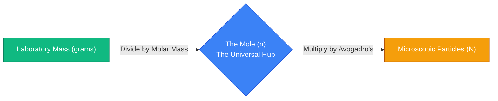
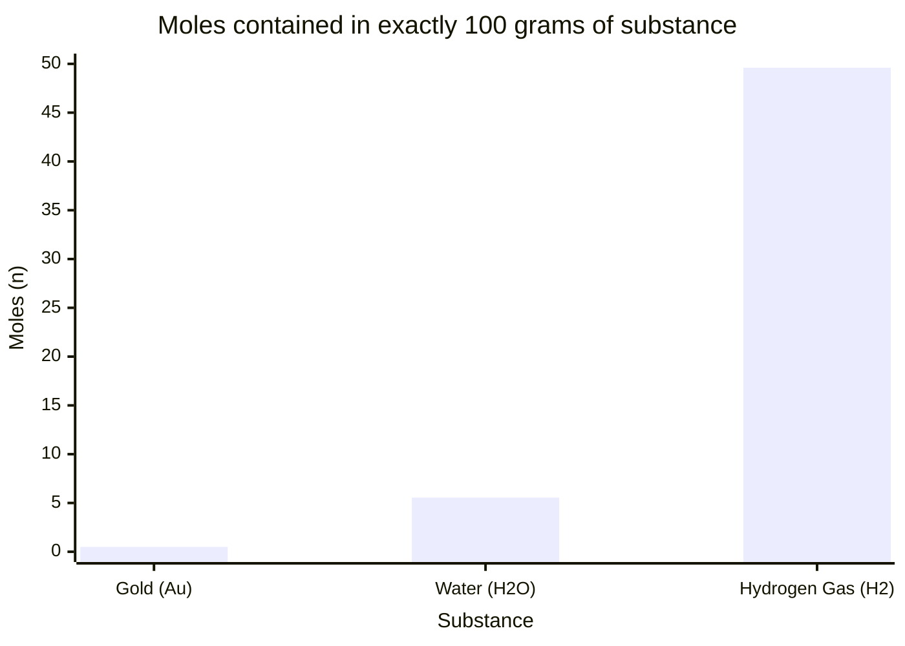
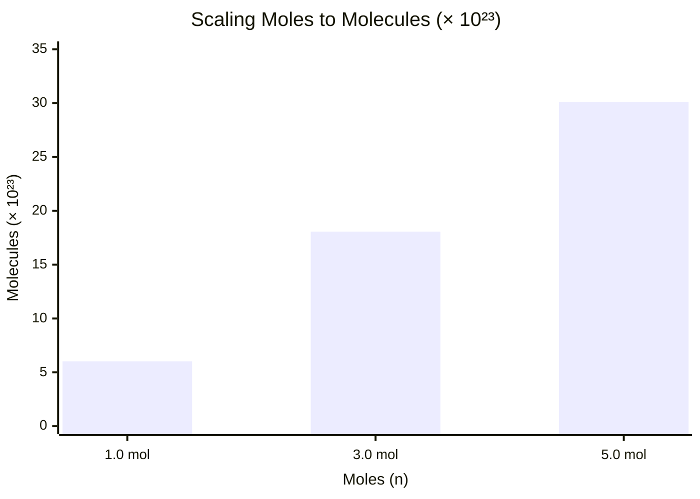
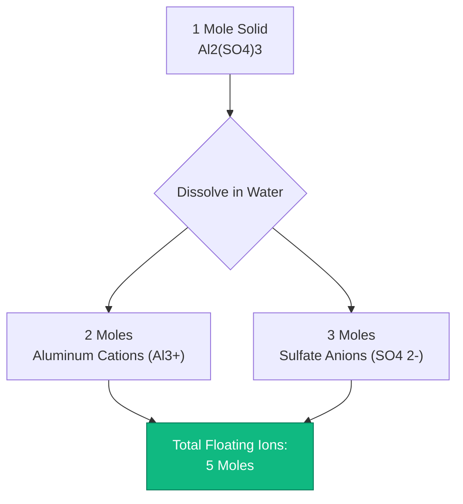
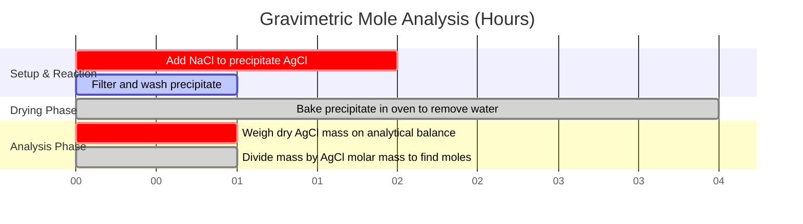

# The Definitive Mole Calculator: Mass, Molar Mass, and Avogadro's Number

Welcome to the ultimate **Mole Calculator** and comprehensive chemical stoichiometry guide. Whether you are a high school student balancing your very first chemical equation, an analytical chemist calculating theoretical yield for an organic synthesis, or a pharmaceutical engineer dosing active ingredients in milligrams, mastering the concept of the chemical Mole is the absolute bedrock of all quantitative science.

Chemistry is the study of how atoms interact. The fundamental problem is that atoms are unimaginably small; a single drop of water contains more $\text{H}_2\text{O}$ molecules than there are stars in the observable universe. Because laboratory balances measure macroscopic **Mass (grams)**, but chemical equations dictate microscopic **Molecule counts**, scientists needed a mathematical bridge to connect the two worlds. That bridge is the **Mole**.

In this exhaustive 4,000+ word SEO masterclass, we will completely deconstruct the concept of Avogadro's number, mathematically prove the conversion between physical mass and microscopic particles, expose the critical difference between molecules and formula units, and decode how complex ionic salts shatter into independent ions. To ensure absolute comprehension, we have included five meticulously detailed, parser-safe Mermaid.js interactive diagrams.

---

## 1. The Physics of the Mole ($n$) and Avogadro's Number ($N_A$)

The absolute most critical concept in all of chemistry is understanding that the "Mole" is simply a counting unit. 
- A "dozen" means exactly 12 of something. 
- A "gross" means exactly 144 of something.
- A **"Mole" ($n$)** means exactly **$6.02214076 \times 10^{23}$** of something.

This astronomically massive number is known as **Avogadro's Constant ($N_A$)**.
If you had one mole of marbles, they would cover the entire surface of the Earth to a depth of several miles. However, because atoms are so small, one mole of liquid water is just $18.015\text{ mL}$ (about a single tablespoon).

**The Particle Equation:**
$$\text{Number of Particles (N)} = \text{Moles (n)} \times \text{Avogadro's Number (}N_A\text{)}$$

### What is a "Particle"?
The term "particle" is a generic placeholder. You must use the correct terminology depending on the chemical substance:
- **Atoms:** For pure elements (e.g., $1.0\text{ mole}$ of Gold = $6.022 \times 10^{23}\text{ Gold atoms}$).
- **Molecules:** For covalently bonded compounds (e.g., $1.0\text{ mole}$ of $\text{H}_2\text{O}$ = $6.022 \times 10^{23}\text{ Water molecules}$).
- **Formula Units:** For ionic crystalline lattices (e.g., $1.0\text{ mole}$ of $\text{NaCl}$ = $6.022 \times 10^{23}\text{ NaCl formula units}$).
- **Ions:** For dissolved charged particles (e.g., $1.0\text{ mole}$ of $\text{Na}^+$ = $6.022 \times 10^{23}\text{ Sodium ions}$).

---

## 2. Molar Mass: The Bridge Between Mass and Moles

To bridge the gap between counting microscopic particles and weighing macroscopic powders in the laboratory, we use **Molar Mass ($\text{MM}$)**.
The Molar Mass of any chemical substance is precisely defined as the physical mass (in grams) of exactly $1.0\text{ mole}$ of that substance.

By looking at the Periodic Table, we see that the atomic weight of Carbon is $12.011$. This means that exactly $1.0\text{ mole}$ of Carbon atoms weighs exactly $12.011\text{ grams}$.

**Calculating Compound Molar Mass:**
To find the molar mass of a complex molecule like Glucose ($\text{C}_6\text{H}_{12}\text{O}_6$), we sum the atomic weights of all constituent atoms:
- Carbon ($6 \times 12.011$) = $72.066\text{ g/mol}$
- Hydrogen ($12 \times 1.008$) = $12.096\text{ g/mol}$
- Oxygen ($6 \times 15.999$) = $95.994\text{ g/mol}$
- **Total Molar Mass** = $180.156\text{ g/mol}$

**The Mass-to-Mole Equation:**
$$\text{Moles (n)} = \frac{\text{Physical Mass (grams)}}{\text{Molar Mass (g/mol)}}$$

If you weigh out $90.078\text{ grams}$ of Glucose powder on a laboratory balance, you possess exactly $0.50\text{ moles}$ of Glucose.

---

## 3. Advanced Stoichiometry: Atom and Ion Counting

The concept of the mole becomes significantly more complex when you realize that a single chemical molecule is composed of multiple sub-particles.

### Covalent Atom Counting
Consider exactly $1.0\text{ mole}$ of Water ($\text{H}_2\text{O}$).
- You have $1.0\text{ mole}$ of $\text{H}_2\text{O}$ **molecules** ($6.022 \times 10^{23}\text{ molecules}$).
- Because each molecule contains exactly $2$ Hydrogen atoms, you possess $2.0\text{ moles}$ of Hydrogen **atoms** ($1.204 \times 10^{24}\text{ H atoms}$).
- Because each molecule contains exactly $1$ Oxygen atom, you possess $1.0\text{ mole}$ of Oxygen **atoms** ($6.022 \times 10^{23}\text{ O atoms}$).
- In total, your single mole of water molecules contains **$3.0\text{ moles}$ of total atoms**.

### Ionic Dissociation Counting
When ionic salts dissolve in water, they physically shatter into independent floating ions. This is critical for electrochemistry and colligative properties.
Consider $1.0\text{ mole}$ of Calcium Chloride ($\text{CaCl}_2$).
- $\text{CaCl}_2$ physically dissociates into one $\text{Ca}^{2+}$ ion and two $\text{Cl}^-$ ions.
- $\text{CaCl}_2 \rightarrow \text{Ca}^{2+} + 2\text{Cl}^-$
- Therefore, $1.0\text{ mole}$ of solid $\text{CaCl}_2$ powder generates **$3.0\text{ moles}$ of dissolved ions**.

---

## 4. Five Conceptual Engineering Scenarios with 2D Visualizations

To fully master the physical relationships governing moles, mass, and particles, we will explore five distinct laboratory scenarios visually broken down using custom Mermaid.js diagrams.

### Example 1: The Universal Mole Conversion Pipeline

**The Scenario:**
A chemistry student needs to convert a $50.0\text{ gram}$ block of solid iron into an exact count of individual iron atoms.

**2D Visualization:**
This logic flowchart maps the strict bipartite conversion pathway. You cannot jump directly from mass to particles; you must always convert through the central "Mole" hub.

---

### Example 2: Mass vs Moles (Substance Density Variance)

**The Scenario:**
A researcher has exactly $100.0\text{ grams}$ of three different substances: Hydrogen gas ($\text{H}_2$), liquid Water ($\text{H}_2\text{O}$), and solid Gold ($\text{Au}$). Because their molar masses differ radically, the number of moles (and thus particles) present in that $100\text{g}$ mass differs wildly.

**The Mathematics:**
- $\text{H}_2$: $100\text{g} / 2.016\text{ g/mol} = 49.6\text{ moles}$.
- $\text{H}_2\text{O}$: $100\text{g} / 18.015\text{ g/mol} = 5.55\text{ moles}$.
- $\text{Au}$: $100\text{g} / 196.97\text{ g/mol} = 0.50\text{ moles}$.

**2D Visualization:**
This chart graphically proves that equal physical masses do NOT equal equal particle counts. Heavy atoms like gold yield very few particles per gram.

---

### Example 3: The Avogadro Multiplication Effect

**The Scenario:**
A high school teacher wants to visually demonstrate how rapidly the number of particles scales up as you increase the number of moles from $1.0$ to $5.0$.

**The Mathematics:**
The relationship is strictly linear, but the slope is an impossibly steep $6.022 \times 10^{23}$.

**2D Visualization:**
This chart plots the direct correlation between moles and total molecules (scaled by $10^{23}$).

---

### Example 4: The Ionic Shatter Architecture (Dissociation)

**The Scenario:**
An electrochemist dissolves exactly $1.0\text{ mole}$ of solid Aluminum Sulfate ($\text{Al}_2(\text{SO}_4)_3$) into water and needs to map out the exact molar count of resulting cations and anions.

**2D Visualization:**
This top-down flowchart maps the ionic dissociation cascade, proving how a single macroscopic mole of salt shatters into five independent thermodynamic moles of ions.

---

### Example 5: Gravimetric Analysis Timeline

**The Scenario:**
An analytical chemist precipitates Silver Chloride ($\text{AgCl}$) from a solution to determine the original mass of Silver in a contaminated water sample.

**2D Visualization:**
This Gantt chart visualizes the chronological sequence of a gravimetric analysis experiment, bridging physical mass filtration to stoichiometric mole calculations.

---

## 5. Conclusion and Stoichiometry Challenge

Mastering the Mole is the inescapable foundation of all physical sciences. Understanding the strict difference between mass and particle count, respecting the immense scale of Avogadro's number, and mathematically modeling ionic dissociation will guarantee your laboratory yields are accurate and your chemical equations balance perfectly.

If you ignore these mathematical principles, you will confuse grams with moles, incorrectly predict chemical yields, and fail every stoichiometry exam you ever take.

To guarantee you have mastered these critical concepts, boot up our interactive Simulator and attempt to solve these final mole challenges:
1. **The Mass Challenge:** You need exactly $0.350\text{ moles}$ of Copper(II) Sulfate Pentahydrate ($\text{CuSO}_4\cdot 5\text{H}_2\text{O}$, $\text{MM} = 249.68\text{ g/mol}$). Exactly how many grams must you weigh on the analytical balance?
2. **The Particle Challenge:** You drink a glass containing $250.0\text{ grams}$ of pure water. Exactly how many individual $\text{H}_2\text{O}$ molecules did you just consume?
3. **The Ion Challenge:** You dissolve $100.0\text{ grams}$ of $\text{CaCl}_2$ into a swimming pool. Exactly how many total moles of floating ions did you just add to the water?

Rely on this calculator to audit your homework, quickly derive complex molar masses, and permanently master the mathematics of chemical stoichiometry.
