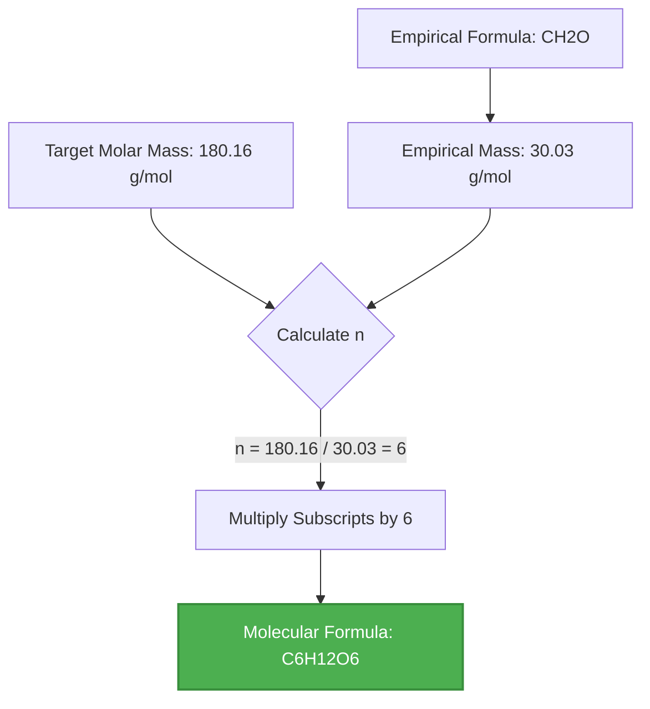

# Laboratory & Analytical Chemistry Guide to Molecular Formulas & Multiplier Math

In analytical chemistry and mass spectrometry, determining a compound's **Molecular Formula** requires linking its **Empirical Formula** with its experimental **Molecular Molar Mass**:

$$\text{Molecular Formula} = (\text{Empirical Formula})_n \quad \text{where} \quad n = \frac{\text{Molecular Molar Mass}}{\text{Empirical Formula Mass}}$$

---

## 1. Empirical to Molecular Conversion Matrix

| Compound Name | Empirical Formula | Empirical Mass ($M_{\text{emp}}$) | Molar Mass ($M$) | Multiplier ($n$) | Molecular Formula |
| :--- | :--- | :--- | :--- | :--- | :--- |
| **Formaldehyde** | $\text{CH}_2\text{O}$ | $30.026\text{ g/mol}$ | $30.026\text{ g/mol}$ | $n = 1$ | $\text{CH}_2\text{O}$ |
| **Acetic Acid** | $\text{CH}_2\text{O}$ | $30.026\text{ g/mol}$ | $60.052\text{ g/mol}$ | $n = 2$ | $\text{C}_2\text{H}_4\text{O}_2$ |
| **Glucose** | $\text{CH}_2\text{O}$ | $30.026\text{ g/mol}$ | $180.156\text{ g/mol}$ | $n = 6$ | $\text{C}_6\text{H}_{12}\text{O}_6$ |
| **Benzene** | $\text{CH}$ | $13.019\text{ g/mol}$ | $78.114\text{ g/mol}$ | $n = 6$ | $\text{C}_6\text{H}_6$ |
| **Dinitrogen Tetroxide** | $\text{NO}_2$ | $46.005\text{ g/mol}$ | $92.011\text{ g/mol}$ | $n = 2$ | $\text{N}_2\text{O}_4$ |

---

## 2. Standard Molecular Formula Calculation Protocol

```
   Step 1: Determine the empirical formula of the compound.
   Step 2: Calculate the Empirical Formula Mass (sum of atomic masses of empirical subscripts).
   Step 3: Obtain the experimental Molecular Molar Mass (e.g. from Mass Spectrometry).
   Step 4: Calculate the integer multiplier n = Molecular Molar Mass / Empirical Mass.
   Step 5: Multiply each empirical subscript by n to obtain the final Molecular Formula.
   Step 6: Verify that the calculated molecular molar mass matches the target molar mass.
```

---

## 3. Educational & Laboratory Safety Disclaimer
*This molecular formula calculator provides preliminary formula derivations for educational, AP chemistry, and research planning. Experimental molar mass data should be confirmed using high-resolution mass spectrometry (HRMS) or gas chromatography-mass spectrometry (GC-MS).*

## 4. The Comprehensive Guide to Molecular Formulas

Welcome to the definitive guide on understanding, calculating, and applying molecular formulas in chemistry. Whether you are a high school student tackling stoichiometry for the first time, an AP Chemistry scholar preparing for exams, or a laboratory technician analyzing mass spectrometry data, this comprehensive resource is designed to illuminate the fascinating world of chemical formulas. 

At its core, chemistry is the study of matter and its transformations. To understand these transformations, we must have a precise language to describe the composition of matter. That language is written in chemical formulas. While empirical formulas give us the simplest ratio of elements in a compound, they do not tell the whole story. The **molecular formula** is the true identity of a molecule, revealing the exact number of every type of atom present.

In this exhaustive guide, we will explore the deep mechanics of molecular formulas, how they relate to their empirical counterparts, and the mathematical multiplier ($n$) that bridges the gap between them. We will also delve into real-world applications, step-by-step usage of our Molecular Formula Calculator, and five deeply detailed examples complete with mathematical derivations and 2D visualizations.

### 4.1 What is a Molecular Formula?

A molecular formula is a chemical formula that indicates the exact number of atoms of each element in a single molecule of a substance. It is the chemical "blueprint" of a molecule. For example, the molecular formula for water is $\text{H}_2\text{O}$, meaning each molecule consists of precisely two hydrogen atoms and one oxygen atom. The molecular formula for glucose is $\text{C}_6\text{H}_{12}\text{O}_6$, which tells us that a single sugar molecule contains 6 carbon atoms, 12 hydrogen atoms, and 6 oxygen atoms.

In contrast, an **empirical formula** only provides the simplest integer ratio of atoms. For glucose, dividing the subscripts by their greatest common divisor (6) gives the empirical formula $\text{CH}_2\text{O}$. Notice how multiple compounds can share the exact same empirical formula. Formaldehyde ($\text{CH}_2\text{O}$), acetic acid ($\text{C}_2\text{H}_4\text{O}_2$), and glucose all share the $\text{CH}_2\text{O}$ empirical formula. The molecular formula is what distinguishes the toxic preservative (formaldehyde) from the sour component of vinegar (acetic acid) and the essential energy source for cellular respiration (glucose).

### 4.2 The Role of Molar Mass

If the empirical formula gives the ratio and the molecular formula gives the exact count, how do we get from one to the other? The missing link is the **molar mass** (or molecular weight). 

When a chemist synthesizes a new compound, they might use elemental analysis to find the mass percentages of each element, which easily converts to an empirical formula. However, to find the true molecular formula, they must determine the compound's molar mass using techniques like mass spectrometry or freezing-point depression. 

By comparing the theoretical mass of the empirical formula (the empirical mass) to the actual molar mass of the compound, we can determine how many empirical "units" fit into one real molecule.

### 4.3 The Mathematical Relationship

The relationship between the empirical and molecular formula is elegantly simple. The molecular formula is always an integer multiple of the empirical formula. We denote this integer multiplier as $n$.

$$ \text{Molecular Formula} = (\text{Empirical Formula}) \times n $$

To find this multiplier, we use the ratio of the molar masses:

$$ n = \frac{\text{Actual Molar Mass of Compound}}{\text{Empirical Formula Mass}} $$

Because you cannot have a fraction of an atom in a standard molecule, $n$ must be a whole number (1, 2, 3, etc.). In real experimental data, slight measurement errors might yield a value like 5.98 or 6.03, which we confidently round to 6. However, if the calculation yields a value like 4.5, it is a strong indicator that either the empirical formula was calculated incorrectly or the molar mass data is flawed.

For more information on the foundational principles of chemistry, you can explore the [IUPAC Gold Book](https://goldbook.iupac.org/) or [NASA's chemistry resources](https://www.nasa.gov/).

---

## 5. Usage Guide: Mastering the Molecular Formula Calculator

Our Molecular Formula Calculator is engineered to be an intuitive yet profoundly powerful tool for students and professionals alike. Follow this step-by-step guide to unlock its full potential.

### 5.1 Selecting the Calculation Mode

The calculator features multiple modes to accommodate the diverse ways chemical data is presented in problems and laboratories. 

1. **Empirical Formula + Molar Mass:** The most common mode. You input the empirical formula and the experimentally determined molar mass. The calculator finds the multiplier $n$ and outputs the molecular formula.
2. **Relative Mass (Mr) Mode:** Similar to the above, but utilizes Relative Molecular Mass, which is dimensionless but numerically equivalent to molar mass.
3. **Percent Composition:** Allows you to input the elemental mass percentages directly, bypassing the need to calculate the empirical formula yourself.
4. **Formula Mass Analyzer:** A utility mode that rapidly calculates the exact molar mass of any complex molecular formula inputted.
5. **Subscript Reduction:** A tool that takes a large molecular formula and automatically reduces it to its empirical form using Greatest Common Divisor (GCD) math.

### 5.2 Inputting Chemical Formulas

When inputting chemical formulas, our parser is designed to be highly forgiving and intelligent, but following standard chemical notation ensures the best results.

*   **Capitalization:** Always capitalize the first letter of an element symbol. Use lowercase for the second letter (e.g., use `Na` for Sodium, not `NA` or `na`).
*   **Subscripts:** Enter numbers directly after the element symbol without spaces (e.g., `H2O`, `C6H12O6`). The calculator will automatically format them as subscripts in the output display.
*   **Parentheses:** You can use parentheses for polyatomic ions or repeated groups (e.g., `Ca(OH)2` or `(NH4)2SO4`). The parser understands how to distribute the outer subscript to the inner elements.

### 5.3 Analyzing the Results Output

Once you execute the calculation, the "Interactive Cockpit" will display a wealth of information:

*   **Empirical Formula Mass:** The exact mass of the empirical unit, calculated using high-precision atomic weights.
*   **Target Molar Mass:** A restatement of your input for verification.
*   **The Multiplier ($n$):** The core of the calculation. The interface will show the exact division (e.g., 180.16 / 30.03 = 6.00) and validate that it is an integer. If $n$ is not close to a whole number, a warning will appear.
*   **Final Molecular Formula:** The result, beautifully formatted. By default, carbon-containing compounds are ordered using the **Organic Hill System** (Carbon first, Hydrogen second, then alphabetical).

### 5.4 Using the Visualizations

The calculator includes a Recharts Donut Chart that visually breaks down the mass contribution of each element in the final molecule. This is exceptionally useful for verifying percent composition problems visually. You can hover over the segments to see precise data points.

---

## 6. Five Real-World Concept Examples

To truly master molecular formulas, one must see the math applied to real scenarios. Below are five deeply detailed examples ranging from introductory stoichiometry to advanced biochemical analysis.

### Example 1: The Building Block of Life (Glucose)

**Scenario:** 
A biochemist isolates a pure crystalline substance from plant sap. Elemental analysis reveals it consists of 40.00% Carbon, 6.71% Hydrogen, and 53.29% Oxygen by mass. This yields an empirical formula of $\text{CH}_2\text{O}$. Subsequent mass spectrometry determines the molar mass of the compound to be approximately $180.16\text{ g/mol}$. What is the molecular formula?

**Mathematical Derivation:**

1.  **Identify Empirical Formula:** $\text{CH}_2\text{O}$
2.  **Calculate Empirical Mass ($M_{\text{emp}}$):**
    *   C: $1 \times 12.011\text{ g/mol} = 12.011$
    *   H: $2 \times 1.008\text{ g/mol} = 2.016$
    *   O: $1 \times 15.999\text{ g/mol} = 15.999$
    *   $M_{\text{emp}} = 12.011 + 2.016 + 15.999 = 30.026\text{ g/mol}$
3.  **Determine Multiplier ($n$):**
    $$ n = \frac{\text{Molar Mass}}{M_{\text{emp}}} = \frac{180.16}{30.026} \approx 6 $$
4.  **Calculate Molecular Formula:**
    $$ (\text{CH}_2\text{O}) \times 6 = \text{C}_6\text{H}_{12}\text{O}_6 $$

**Visualization: Calculation Flowchart**



*This flowchart illustrates the straightforward linear progression from empirical data to the final molecular blueprint of glucose, the primary energy source for cellular life.*

### Example 2: The Rocket Propellant (Hydrazine)

**Scenario:**
Aerospace engineers at NASA are testing a highly reactive nitrogen-hydrogen compound used as monopropellant in satellite thrusters. The empirical formula is determined to be $\text{NH}_2$. Experimental data shows the vapor has a density that corresponds to a molar mass of $32.05\text{ g/mol}$. Find the molecular formula.

**Mathematical Derivation:**

1.  **Identify Empirical Formula:** $\text{NH}_2$
2.  **Calculate Empirical Mass ($M_{\text{emp}}$):**
    *   N: $1 \times 14.007 = 14.007$
    *   H: $2 \times 1.008 = 2.016$
    *   $M_{\text{emp}} = 14.007 + 2.016 = 16.023\text{ g/mol}$
3.  **Determine Multiplier ($n$):**
    $$ n = \frac{32.05}{16.023} = 1.999 \approx 2 $$
4.  **Calculate Molecular Formula:**
    $$ (\text{NH}_2) \times 2 = \text{N}_2\text{H}_4 $$

**Visualization: Mass Comparison Table**

| Component | Formula | Mass (g/mol) | Nitrogen % | Hydrogen % |
| :--- | :--- | :--- | :--- | :--- |
| **Empirical Base** | $\text{NH}_2$ | 16.023 | 87.4% | 12.6% |
| **Actual Molecule** | $\text{N}_2\text{H}_4$ | 32.046 | 87.4% | 12.6% |

*Notice how the mass percentage of the elements remains absolutely identical between the empirical and molecular formulas, even though the total mass doubles.*

### Example 3: The Pain Reliever (Ibuprofen)

**Scenario:**
A pharmaceutical laboratory synthesizes a batch of ibuprofen. The empirical formula is found to be $\text{C}_{13}\text{H}_{18}\text{O}_2$. The laboratory's mass spectrometer measures the molecular ion peak at $m/z = 206.29$, indicating a molar mass of $206.29\text{ g/mol}$. What is the true molecular formula of ibuprofen?

**Mathematical Derivation:**

1.  **Identify Empirical Formula:** $\text{C}_{13}\text{H}_{18}\text{O}_2$
2.  **Calculate Empirical Mass ($M_{\text{emp}}$):**
    *   C: $13 \times 12.011 = 156.143$
    *   H: $18 \times 1.008 = 18.144$
    *   O: $2 \times 15.999 = 31.998$
    *   $M_{\text{emp}} = 156.143 + 18.144 + 31.998 = 206.285\text{ g/mol}$
3.  **Determine Multiplier ($n$):**
    $$ n = \frac{206.29}{206.285} \approx 1 $$
4.  **Calculate Molecular Formula:**
    $$ (\text{C}_{13}\text{H}_{18}\text{O}_2) \times 1 = \text{C}_{13}\text{H}_{18}\text{O}_2 $$

**Visualization: The "n = 1" Scenario Timeline**

```mermaid
gantt
    title Laboratory Workflow: Identifying Ibuprofen
    dateFormat  HH:mm:ss
    axisFormat  %H:%M
    section Synthesis
    Batch Preparation       :active, 00:00:00, 00:02:00
    section Analysis
    Elemental Analysis (Empirical) :crit, active, 00:02:00, 00:04:00
    Mass Spectrometry (Molar Mass) :active, 00:04:00, 00:06:00
    section Conclusion
    Calculate Multiplier (n=1) :done, 00:06:00, 00:07:00
    Formula Confirmed Identical :milestone, 00:07:00, 00:07:00
```



*This Gantt chart represents a typical laboratory timeline. Because $n = 1$, the empirical formula and the molecular formula are identical. This is common in many complex organic pharmaceuticals where the structure cannot be symmetrically divided.*

### Example 4: The Aromatic Hydrocarbon (Benzene)

**Scenario:**
An organic chemist is studying a highly flammable, sweet-smelling liquid. The empirical formula is simply $\text{CH}$, indicating a 1:1 ratio of carbon to hydrogen. The molar mass is determined via freezing-point depression to be $78.11\text{ g/mol}$. 

**Mathematical Derivation:**

1.  **Identify Empirical Formula:** $\text{CH}$
2.  **Calculate Empirical Mass ($M_{\text{emp}}$):**
    *   $12.011 + 1.008 = 13.019\text{ g/mol}$
3.  **Determine Multiplier ($n$):**
    $$ n = \frac{78.11}{13.019} \approx 6 $$
4.  **Calculate Molecular Formula:**
    $$ (\text{CH}) \times 6 = \text{C}_6\text{H}_6 $$

**Visualization: Subscript Scaling Process**


*Benzene's ring structure requires 6 carbons. The empirical formula $\text{CH}$ gives no hint of this ring geometry, highlighting why determining the true molecular formula ($\text{C}_6\text{H}_6$) is a critical step in organic chemistry.*

### Example 5: The Mystery Polymer Precursor (Ethylene vs Butene)

**Scenario:**
A petrochemical plant is refining a gas stream. Analysis shows an empirical formula of $\text{CH}_2$. However, depending on the pressure and temperature of the distillation column, the gas could be ethylene ($28.05\text{ g/mol}$) or butene ($56.11\text{ g/mol}$). The current sample has a molar mass of $56.11\text{ g/mol}$.

**Mathematical Derivation:**

1.  **Identify Empirical Formula:** $\text{CH}_2$
2.  **Calculate Empirical Mass ($M_{\text{emp}}$):**
    *   $12.011 + (2 \times 1.008) = 14.027\text{ g/mol}$
3.  **Determine Multiplier ($n$):**
    $$ n = \frac{56.11}{14.027} \approx 4 $$
4.  **Calculate Molecular Formula:**
    $$ (\text{CH}_2) \times 4 = \text{C}_4\text{H}_8 \text{ (Butene)} $$

*If the molar mass had been $28.05\text{ g/mol}$, $n$ would be 2, yielding ethylene ($\text{C}_2\text{H}_4$). This demonstrates how molecular formula calculations are used in industry to differentiate between distinct chemicals that share the same foundational ratios.*

---

## 7. Deep Dive FAQ and Advanced Troubleshooting

As you utilize the Molecular Formula Calculator for more complex AP Chemistry or university-level problems, you may encounter edge cases. This FAQ section addresses the nuances of molecular math.

**Q: What happens if my calculated $n$ is a number like 4.5?**
**A:** In standard molecular formula problems, $n$ must be a whole integer. If you calculate $n = 4.5$, you have likely made an error in determining the empirical formula. For example, if you incorrectly calculated an empirical formula of $\text{CH}_3$ (mass $\approx 15$) for a compound with a molar mass of $\approx 58$, $58 / 15 = 3.86$. This means $\text{CH}_3$ was wrong (the true empirical formula was likely $\text{C}_2\text{H}_5$, mass $\approx 29$, yielding $n=2$ for $\text{C}_4\text{H}_{10}$). 

**Q: Does the calculator use exact isotopic masses?**
**A:** The calculator uses the standard, natural-abundance-weighted average atomic masses (e.g., Carbon = 12.011) sanctioned by IUPAC. For standard chemical synthesis and homework problems, this is highly accurate. If you are doing high-resolution mass spectrometry (HRMS) looking at specific isotopes (like Carbon-13), you will need to account for the exact isotopic mass manually.

**Q: Can a compound have an empirical formula with a multiplier of $n = 100$?**
**A:** Absolutely! In polymer chemistry, molecules can be massive. For instance, polyethylene is essentially a chain of $\text{CH}_2$ units. A single strand of polyethylene might have an empirical formula of $\text{CH}_2$ and a molar mass of $140,000\text{ g/mol}$, resulting in a multiplier of $n = 10,000$.

**Q: Why does the calculator rearrange my output into the Hill System?**
**A:** The Hill System is the internationally recognized standard for writing chemical formulas. It prevents confusion by ensuring formulas are written uniformly across literature. Carbon is listed first, Hydrogen second, and all other elements follow in alphabetical order. For example, instead of writing $\text{ClCH}_3$, the Hill system standardizes it to $\text{CH}_3\text{Cl}$. Our calculator automatically enforces this standard to ensure your answers are professionally formatted.

**Q: How does this relate to the Mole Concept?**
**A:** The molar mass used in these calculations is directly tied to Avogadro's number ($6.022 \times 10^{23}$). The empirical mass is the mass of one mole of empirical units, and the molecular mass is the mass of one mole of actual molecules. The multiplier $n$ tells you how many moles of empirical units are inside one mole of the real substance. For more on moles, check out our [Mole Calculator](/mole-calculator).

By mastering the transition from empirical to molecular formulas, you unlock the ability to identify unknown substances, balance complex stoichiometric equations, and understand the physical geometry of the molecular world. Use this calculator as both a checking tool and an educational guide to streamline your chemical analyses!
