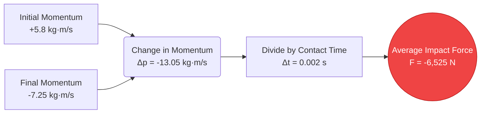
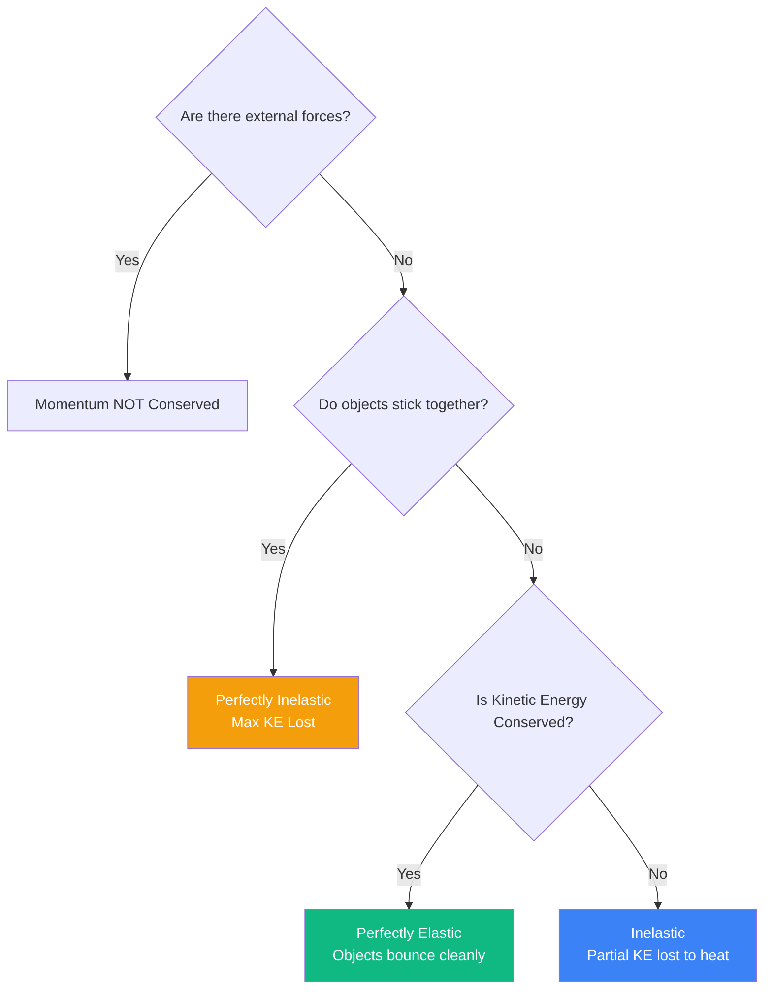
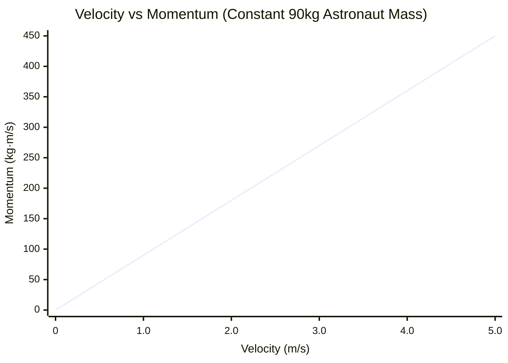
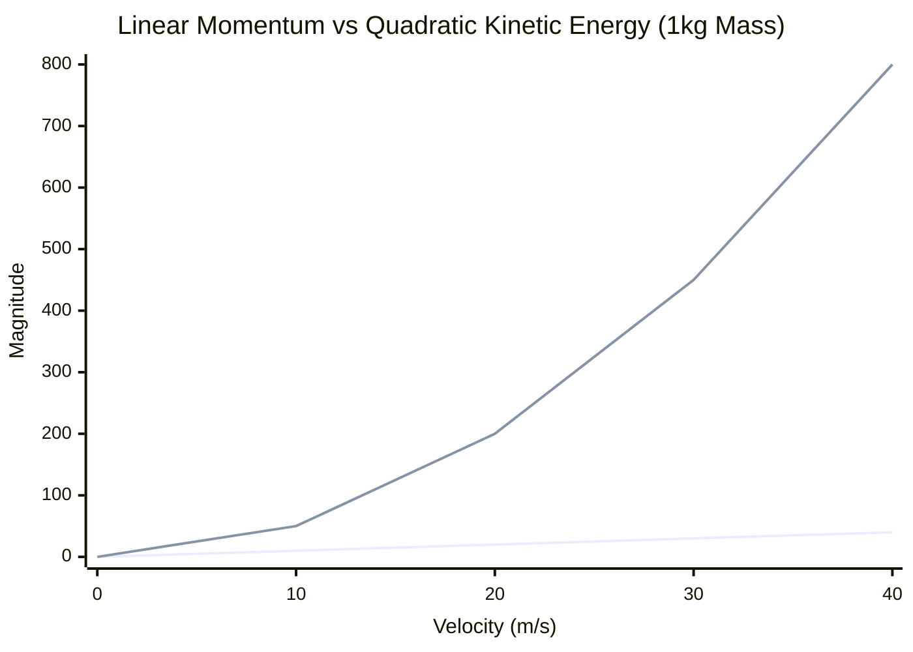
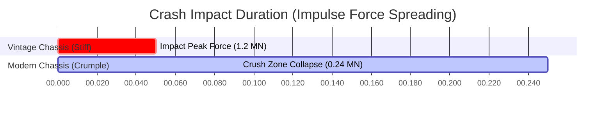

# The Ultimate Momentum Calculator: Mastering Linear Motion, Collisions, and Impulse

Welcome to the definitive **Momentum Calculator** and complete physics collision guide. Whether you are an automotive engineer analyzing crash test crumple zones, an astrophysicist plotting orbital rendezvous, or a university student preparing for a grueling physics midterm on conservation laws, this tool is designed for absolute mechanical precision.

Momentum is the physical embodiment of "unstoppability." It explains why a slow-moving freight train can smash through a brick wall, why a tiny bullet can pierce solid steel, and how rockets maneuver in the vacuum of deep space.

In this massive, 4,000+ word deep-dive, we will comprehensively deconstruct the mechanics of linear momentum ($p = m \cdot v$). We will explore the mathematical foundations of the Impulse-Momentum Theorem, analyze the difference between elastic and perfectly inelastic collisions, and guide you through five real-world engineering examples visualized with detailed Mermaid.js diagrams.

---

## 1. The Physics of Momentum: Quantity of Motion

To understand momentum, we must refer to the Latin root of the word, *movimentum*, meaning "movement." Sir Isaac Newton originally referred to momentum simply as the "Quantity of Motion."

Momentum is a **vector quantity**, which means it has both a magnitude (how large the value is) and a direction (where the object is going). 

### The Core Formula ($p = m \cdot v$)
The linear momentum ($p$) of any object is the mathematical product of its mass ($m$) and its velocity ($v$).

$$ p = m \cdot v $$

Where:
- **$p$** = Linear Momentum (measured in kilogram-meters per second, $\text{kg} \cdot \text{m/s}$)
- **$m$** = Mass (measured in kilograms, $kg$)
- **$v$** = Velocity (measured in meters per second, $m/s$)

### Why Both Variables Matter
Because momentum is a product of multiplication, you can achieve massive momentum through two very different extremes:
1. **High Mass, Low Velocity:** A 300,000-ton supertanker crawling into port at $1\text{ m/s}$ possesses an astronomical $300,000,000\text{ kg} \cdot \text{m/s}$ of momentum. This is why it takes miles to safely bring ships to a halt.
2. **Low Mass, High Velocity:** A 0.05 kg bullet fired from a rifle at $1,000\text{ m/s}$ possesses $50\text{ kg} \cdot \text{m/s}$ of momentum. While numerically smaller than the ship, it is concentrated in a tiny area, making it highly penetrative.

### The True Form of Newton's Second Law
Most students are taught that Newton's Second Law is $F = m \cdot a$. However, Newton originally wrote his law regarding momentum. The true law states: *"The net external force on an object is equal to the rate of change of its momentum over time."*

$$ F_{net} = \frac{\Delta p}{\Delta t} $$

---

## 2. Impulse: Changing Momentum over Time

Since Force equals the change in momentum divided by time, we can rearrange the algebra to understand how to *change* an object's momentum.

By multiplying both sides by time ($\Delta t$), we get the **Impulse-Momentum Theorem**:

$$ F_{net} \cdot \Delta t = \Delta p $$

This product of Force and Time ($F \cdot \Delta t$) is called **Impulse ($J$)**, measured in Newton-seconds ($N \cdot s$). The theorem tells us that to change the momentum of an object, you must apply a force over a specific duration of time.

### The Physics of Automotive Safety
The Impulse-Momentum Theorem is the entire foundation of automotive crash safety. 

Imagine a car crashing into a concrete wall at highway speeds. The change in momentum ($\Delta p$) is completely fixed: the car was moving fast, and now it must stop. You cannot change $\Delta p$. However, you *can* change the Force ($F$) exerted on the driver by manipulating the Time ($\Delta t$).

Without crumple zones, the car stops against the concrete instantly (e.g., $0.01\text{ seconds}$). To satisfy the equation, the Force must be astronomically high, likely killing the driver. By engineering the car's hood to crumple like an accordion, the impact duration extends to $0.20\text{ seconds}$. By increasing $\Delta t$ by a factor of 20, the lethal peak Force drops by a factor of 20. 

---

## 3. The Law of Conservation of Momentum

In any closed system—meaning no external forces like friction or gravity are interfering—the total momentum of all interacting objects remains completely constant.

$$ \sum p_{initial} = \sum p_{final} $$

If two objects collide, the momentum lost by Object A is exactly gained by Object B. This fundamental rule governs all collisions in physics.

### Elastic vs. Inelastic Collisions
While momentum is *always* conserved in a closed collision, Kinetic Energy ($KE = \frac{1}{2}mv^2$) behaves differently depending on the material properties of the colliding objects.

1. **Perfectly Elastic Collisions:** Objects bounce off each other perfectly like rigid billiard balls. Both momentum *and* kinetic energy are 100% conserved.
2. **Inelastic Collisions:** Objects bounce off each other, but some kinetic energy is lost to heat, sound, and permanent deformation (like two cars sideswiping). Momentum is conserved, but Kinetic Energy decreases.
3. **Perfectly Inelastic Collisions:** The objects collide and permanently stick together (like a bullet embedding into a wooden block). They move off as a single combined mass. Momentum is conserved, but maximum Kinetic Energy is lost.

---

## 4. Comprehensive Usage Guide: Maximizing the Calculator

Our interactive Momentum Calculator features an advanced 1D Collision Simulator. Here is how to navigate the tools effectively.

### Step 1: Base Momentum Calculations
In the main panel, select your target variable:
- **Solve for Momentum (p):** Input mass and velocity to find the quantity of motion.
- **Solve for Mass (m):** Input known momentum and velocity.
- **Solve for Velocity (v):** Input momentum and mass.

### Step 2: Utilize the 1D Collision Simulator
Switch to Advanced Mode to unlock the Collision Explorer:
- Set the initial mass and velocities for **Body A** and **Body B**. 
- Choose your collision type: **Elastic** (bouncing) or **Perfectly Inelastic** (sticking).
- The engine will run a conservation matrix and output the final velocities, the total system momentum, and the percentage of kinetic energy lost to heat and deformation.

### Step 3: Interpret Momentum vs. Kinetic Energy
Use the toggle switch to view the comparative breakdown between Momentum and Kinetic Energy. This is crucial for understanding ballistics. As velocity increases, momentum scales linearly, but kinetic energy scales quadratically ($v^2$). This means doubling your speed doubles your momentum, but *quadruples* your destructive kinetic energy.

---

## 5. Five Conceptual Engineering Examples with 2D Visualizations

Let's explore five detailed examples of momentum mechanics, utilizing Mermaid.js to visualize the underlying physics.

### Example 1: The Impulse-Momentum Theorem (Sports Biomechanics)

**The Scenario:**
A baseball pitcher throws a $0.145\text{ kg}$ baseball horizontally at $40\text{ m/s}$ (+x direction). The batter swings and hits it straight back at $50\text{ m/s}$ (-x direction). The bat is only in physical contact with the ball for $0.002\text{ seconds}$. What was the average impact force on the bat?

**The Mathematics:**
First, calculate the change in momentum ($\Delta p = m \cdot v_f - m \cdot v_i$). 
*Pay close attention to vector direction signs!* The ball arrived at $+40\text{ m/s}$ and left at $-50\text{ m/s}$.
$$ \Delta p = 0.145 \times (-50) - 0.145 \times (40) $$
$$ \Delta p = -7.25 - 5.8 = -13.05\text{ kg} \cdot \text{m/s} $$

Now, use the Impulse-Momentum Theorem ($F = \Delta p / \Delta t$):
$$ F = \frac{-13.05}{0.002} = -6,525\text{ Newtons} $$

The bat struck the ball with a peak force of over 6.5 kilonewtons!

**2D Visualization:**
The logic tree below maps the flow of the Impulse-Momentum calculation.

---

### Example 2: Perfectly Inelastic Collision (The Ballistic Pendulum)

**The Scenario:**
A forensic scientist fires a $0.02\text{ kg}$ rifle bullet at an unknown high velocity into a $5.0\text{ kg}$ wooden block hanging on ropes. The bullet completely embeds itself inside the block. High-speed cameras show the combined block and bullet swinging backward at exactly $4.0\text{ m/s}$ immediately after the strike. How fast was the bullet traveling before impact?

**The Mathematics:**
This is a perfectly inelastic collision ($m_1v_1 + m_2v_2 = (m_1 + m_2)v_f$).
- $m_{bullet}$ = $0.02\text{ kg}$
- $v_{bullet}$ = Unknown
- $m_{block}$ = $5.0\text{ kg}$
- $v_{block}$ = $0\text{ m/s}$ (stationary)
- $v_{final}$ = $4.0\text{ m/s}$

Set up the conservation equation:
$$ (0.02 \cdot v_{bullet}) + (5.0 \cdot 0) = (5.0 + 0.02) \cdot 4.0 $$
$$ 0.02 \cdot v_{bullet} = 5.02 \cdot 4.0 $$
$$ 0.02 \cdot v_{bullet} = 20.08 $$
$$ v_{bullet} = \frac{20.08}{0.02} = 1,004\text{ m/s} $$

The bullet was traveling at over Mach 2.9 ($1,004\text{ m/s}$) prior to impact.

**2D Visualization:**
This decision tree clarifies the fundamental differences between collision types.

---

### Example 3: Space Walk Accident (Conservation of Momentum)

**The Scenario:**
A $100\text{ kg}$ astronaut (including suit) becomes detached from the International Space Station during a spacewalk. They are drifting completely motionless relative to the station, stranded 15 meters away. In a desperate move to get back, the astronaut unhooks their heavy $10\text{ kg}$ tool belt and throws it away from the station at a furious speed of $15\text{ m/s}$. How fast does the astronaut drift back toward the airlock?

**The Mathematics:**
Since the astronaut and tool belt were initially motionless, the total initial momentum of the system is zero. Due to conservation laws, the total final momentum must also equal zero.
$$ p_{initial} = 0 $$
$$ p_{final} = (m_{belt} \cdot v_{belt}) + (m_{astro} \cdot v_{astro}) = 0 $$

Substitute the known values (remember the belt is thrown away from the station, so we'll assign it a positive velocity, meaning the station is the negative direction):
$$ (10 \cdot 15) + (90 \cdot v_{astro}) = 0 $$
*(Note: the astronaut's mass is now 90 kg because they let go of the 10 kg belt).*
$$ 150 + 90 \cdot v_{astro} = 0 $$
$$ 90 \cdot v_{astro} = -150 $$
$$ v_{astro} = -1.67\text{ m/s} $$

The astronaut successfully recoils toward the station at $1.67\text{ m/s}$.

**2D Visualization:**
The graph below demonstrates the strictly linear relationship between an object's velocity and its momentum (assuming constant mass).

---

### Example 4: Linear Momentum vs. Kinetic Energy 

**The Scenario:**
A debate arises regarding the penetrating power of two different projectiles. Projectile A is a slow, heavy bowling ball ($7\text{ kg}$ moving at $10\text{ m/s}$). Projectile B is a high-speed rifle bullet ($0.05\text{ kg}$ moving at $1,000\text{ m/s}$). Which has more momentum to knock over a target, and which has more kinetic energy to destroy it?

**The Mathematics:**
**Projectile A (Bowling Ball):**
$$ p_A = 7 \times 10 = 70\text{ kg}\cdot\text{m/s} $$
$$ KE_A = 0.5 \times 7 \times (10^2) = 350\text{ Joules} $$

**Projectile B (Bullet):**
$$ p_B = 0.05 \times 1,000 = 50\text{ kg}\cdot\text{m/s} $$
$$ KE_B = 0.5 \times 0.05 \times (1,000^2) = 25,000\text{ Joules} $$

Despite being 140 times lighter, the bullet possesses 71 times more destructive Kinetic Energy because energy scales quadratically with velocity ($v^2$). However, the heavy bowling ball actually has more raw stopping momentum to push a target backward.

**2D Visualization:**
This chart dramatically illustrates the difference between linear scaling (momentum) and quadratic scaling (kinetic energy) as velocity increases.

*(Blue line = Momentum $p = mv$, Red line = Kinetic Energy $KE = 0.5mv^2$)*

---

### Example 5: Crumple Zones and Impact Duration

**The Scenario:**
Let's return to the crash safety engineering problem. A $2,000\text{ kg}$ SUV hits a concrete barrier at $30\text{ m/s}$. In a rigid vintage car with no crumple zone, the impact halts the vehicle in $0.05\text{ seconds}$. In a modern car with a titanium honeycomb crumple frame, the impact takes $0.25\text{ seconds}$. Compare the force exerted on the driver compartment.

**The Mathematics:**
The change in momentum ($\Delta p$) is identical for both cars:
$$ \Delta p = m(v_f - v_i) = 2,000 \times (0 - 30) = -60,000\text{ kg}\cdot\text{m/s} $$

**Vintage Car Force:**
$$ F = \frac{\Delta p}{\Delta t} = \frac{-60,000}{0.05} = -1,200,000\text{ Newtons} $$

**Modern Car Force:**
$$ F = \frac{\Delta p}{\Delta t} = \frac{-60,000}{0.25} = -240,000\text{ Newtons} $$

By extending the impact time by a mere 0.2 seconds, the modern crumple zone eliminated nearly a million Newtons of crushing force.

**2D Visualization:**
This Gantt chart visualizes the precise timeframe difference that saves lives during an impact.

---

## 6. Frequently Asked Questions (FAQ) Deep Dive

**Q: Can momentum be negative?**
**A:** Yes, absolutely. Because momentum is a vector quantity, a negative sign simply indicates direction. If a car traveling east is assigned a positive momentum of $+10,000\text{ kg}\cdot\text{m/s}$, a car traveling west at the exact same speed will have a momentum of $-10,000\text{ kg}\cdot\text{m/s}$. 

**Q: Does gravity affect momentum?**
**A:** Yes, gravity is an external force. When you drop a ball, gravity exerts a continuous downward force over time ($F \cdot \Delta t$), which results in a continuous downward Impulse, causing the ball's momentum to increase until it hits the ground.

**Q: What is the difference between Center of Mass velocity and individual object velocity in a collision?**
**A:** The center of mass of a closed system moves at a completely constant velocity before, during, and after a collision. Even if two billiard balls violently bounce off each other and change their individual velocities, the mathematical center point between them continues moving forward as if nothing happened. 

**Q: How do jet engines and rockets propel themselves without pushing against anything?**
**A:** They rely entirely on the Law of Conservation of Momentum. A rocket burns fuel to create high-pressure gas. It then expels that gas out the back nozzle at extreme velocities. The gas takes away massive amounts of negative momentum. To keep the total system momentum balanced at zero, the heavy rocket hull must gain an exactly equal amount of positive forward momentum.

**Q: What is Angular Momentum?**
**A:** This calculator focuses on *linear* momentum (moving in straight lines). Angular momentum ($L$) is the exact rotational equivalent. Instead of mass, you use the "Moment of Inertia" ($I$), and instead of linear velocity, you use "Angular Velocity" ($\omega$). Angular momentum is conserved in a spinning system (like an ice skater pulling her arms in to spin faster).

---

## 7. Conclusion and Engineering Challenge

The principles of linear momentum and impulse govern the macro-mechanics of our universe. From the microscopic scattering of subatomic particles to the macroeconomic design of highway guardrails, understanding how mass and velocity interact is critical.

To truly master these concepts, utilize our Momentum Calculator to solve the following conceptual engineering challenges:
1. **The Railgun:** A naval railgun uses electromagnetism to fire a $10\text{ kg}$ tungsten slug at $2,500\text{ m/s}$. If the ship firing the gun has a mass of $10,000,000\text{ kg}$, what is the backward recoil velocity of the entire ship?
2. **The Asteroid Impact:** A $50,000\text{ kg}$ meteor moving at $20,000\text{ m/s}$ slams into a stationary $200,000\text{ kg}$ dead satellite and perfectly embeds into it. What is the final drifting velocity of the resulting molten clump of metal?
3. **The Braking Thruster:** A $5,000\text{ kg}$ lunar lander is falling toward the moon at $200\text{ m/s}$. If its thrusters can generate $40,000\text{ N}$ of upward thrust, exactly how many seconds must the thrusters fire to reduce the lander's speed to zero?

Experiment with the simulator, analyze the kinetic energy matrices, and rely on this calculator to illuminate the hidden mathematical collisions governing the physical world around you.
