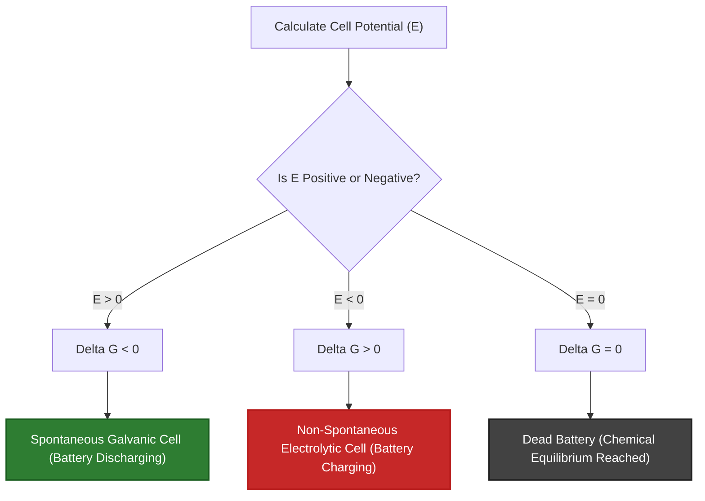

# Laboratory & Analytical Electrochemistry Guide to the Nernst Equation

In physical, analytical, and energy storage engineering, the **Nernst Equation** quantifies the electromotive force (EMF) of an electrochemical cell operating under non-standard concentrations, gas partial pressures, and temperatures:

$$E = E^\circ - \frac{R T}{n F} \ln Q$$

$$\text{At } T = 298.15 \text{ K } (25^\circ\text{C}) \implies E = E^\circ - \frac{0.05916}{n} \log_{10} Q$$

$$E_{\text{cell}}^\circ = E_{\text{cathode}}^\circ - E_{\text{anode}}^\circ$$

$$\Delta G = -n F E \quad \text{and} \quad \Delta G^\circ = -n F E^\circ = -R T \ln K \implies K = \exp\left(\frac{n F E^\circ}{R T}\right)$$

$$\text{Concentration Cell: } E_{\text{cell}} = \frac{R T}{n F} \ln\left(\frac{C_{\text{high}}}{C_{\text{low}}}\right)$$

---

## 1. Classical Electrochemical Cell Reference Matrix

| Cell System | Equation | $E^\circ$ ($25^\circ\text{C}$) | $n$ | Anode Half-Cell (-) | Cathode Half-Cell (+) |
| :--- | :--- | :--- | :--- | :--- | :--- |
| **Daniell Cell** | $\text{Zn}(s) + \text{Cu}^{2+} \rightleftharpoons \text{Zn}^{2+} + \text{Cu}(s)$ | **$+1.10 \text{ V}$** | **$2$** | $\text{Zn} \rightleftharpoons \text{Zn}^{2+} + 2e^-$ | $\text{Cu}^{2+} + 2e^- \rightleftharpoons \text{Cu}$ |
| **Hydrogen (SHE)** | $2\text{H}^+(aq) + 2e^- \rightleftharpoons \text{H}_2(g)$ | **$0.00 \text{ V}$** | **$2$** | $\text{H}_2 \rightleftharpoons 2\text{H}^+ + 2e^-$ | $2\text{H}^+ + 2e^- \rightleftharpoons \text{H}_2$ |
| **Silver Ion** | $\text{Ag}^+(aq) + e^- \rightleftharpoons \text{Ag}(s)$ | **$+0.80 \text{ V}$** | **$1$** | $\text{Ag} \rightleftharpoons \text{Ag}^+ + e^-$ | $\text{Ag}^+ + e^- \rightleftharpoons \text{Ag}$ |
| **Iron Redox Pair**| $\text{Fe}^{3+}(aq) + e^- \rightleftharpoons \text{Fe}^{2+}(aq)$ | **$+0.77 \text{ V}$** | **$1$** | $\text{Fe}^{2+} \rightleftharpoons \text{Fe}^{3+} + e^-$ | $\text{Fe}^{3+} + e^- \rightleftharpoons \text{Fe}^{2+}$ |
| **Lead-Acid Battery**| $\text{Pb} + \text{PbO}_2 + 2\text{H}_2\text{SO}_4 \rightleftharpoons 2\text{PbSO}_4 + 2\text{H}_2\text{O}$| **$+2.05 \text{ V}$** | **$2$** | $\text{Pb} + \text{SO}_4^{2-} \rightleftharpoons \text{PbSO}_4 + 2e^-$ | $\text{PbO}_2 + 4\text{H}^+ + \text{SO}_4^{2-} + 2e^- \rightleftharpoons \text{PbSO}_4$ |

---

## 2. Standard Nernst Calculation Protocols

```
1. Non-Standard Potential: E = E0 - (R * T / (n * F)) * ln(Q)
2. 25C Simplified Log10 Form: E = E0 - (0.05916 / n) * log10(Q)
3. Gibbs Free Energy: deltaG = -n * F * E (kJ/mol)
4. Equilibrium Constant K: log10(K) = (n * E0) / 0.05916
5. Concentration Cell Potential: E = (R * T / (n * F)) * ln(Chigh / Clow)
```

---

## 3. Educational & Laboratory Safety Disclaimer
*This Nernst equation calculator provides theoretical thermodynamic calculations for educational, laboratory research, and AP chemistry applications. Real industrial battery systems or electrochemical sensors should account for activity coefficients, liquid junction potentials, and activation overpotentials.*

## 4. The Complete Guide to the Nernst Equation and Electrochemistry

Welcome to the ultimate manual on the **Nernst Equation**. Whether you are an AP chemistry student predicting the exact voltage of a Daniell cell, an engineer designing lithium-ion batteries, or a biochemist studying proton gradients across mitochondrial membranes, you are relying entirely on the thermodynamic principles encoded in this single equation.

In this exhaustive 4000+ word guide, we will rip open the Nernst equation to understand its thermodynamic origins in Gibbs Free Energy. We will clearly break down every variable ($E^\circ$, $R$, $T$, $n$, $F$, $Q$), and then walk through five rigorous, real-world electrochemical derivations—complete with step-by-step algebra and highly compliant Mermaid visual diagrams.

### 4.1 The Thermodynamic Origin of Voltage

Electromotive force (EMF), measured in volts ($V$), is not just "electricity"; it is a direct measurement of thermodynamic driving force. Specifically, cell potential ($E$) is mathematically locked to **Gibbs Free Energy ($\Delta G$)** through Faraday's constant:

$$ \Delta G = -nFE $$

*   $n$ = moles of electrons transferred.
*   $F$ = Faraday's Constant ($96,485\text{ Coulombs/mol e}^-$).
*   $E$ = Cell Potential in Volts (Joules/Coulomb).

If $\Delta G$ is negative, the reaction is spontaneous (it naturally pushes electrons through a wire). Because of the negative sign in the formula, **a spontaneous Galvanic cell must have a positive voltage ($E > 0$)**.

### 4.2 Dissecting the Nernst Equation

Under non-standard conditions (meaning concentrations are not exactly $1.0\text{ M}$ and gas pressures are not $1.0\text{ atm}$), the thermodynamic driving force shifts according to the **Reaction Quotient ($Q$)**. 

Walther Nernst derived the formula that relates standard voltage ($E^\circ$) to actual real-time voltage ($E$):

$$ E = E^\circ - \frac{RT}{nF} \ln Q $$

Let's tear this apart:
*   $E^\circ$ **(Standard Cell Potential):** The baseline voltage of the battery when fully charged with $1.0\text{ M}$ pristine chemical reactants at $25^\circ\text{C}$.
*   $R$ **(Ideal Gas Constant):** $8.314\text{ J/(mol}\cdot\text{K)}$.
*   $T$ **(Temperature):** Must be in Kelvin.
*   $n$ **(Moles of Electrons):** The stoichiometric number of electrons passed in the balanced redox equation.
*   $F$ **(Faraday's Constant):** $96,485\text{ C/mol}$.
*   $Q$ **(Reaction Quotient):** The ratio of dissolved Product concentrations over Reactant concentrations. Pure solids (like the copper or zinc metal electrodes) are completely omitted.

At standard room temperature ($298.15\text{ K}$), we can bundle $R$, $T$, $F$, and the natural log conversion factor into a single, elegant constant, simplifying the equation to:

$$ E = E^\circ - \frac{0.05916}{n} \log_{10} Q $$

### 4.3 The Three States of an Electrochemical Cell

The Reaction Quotient ($Q$) dictates the fate of the battery:

1.  **Fully Charged ($Q \ll 1$):** When you have massive amounts of reactants and zero products, $\log_{10}(Q)$ is highly negative. This subtracts a negative number from $E^\circ$, meaning the actual voltage $E$ is **higher** than standard.
2.  **Standard State ($Q = 1$):** When reactants exactly equal products ($1\text{ M}$ each), $\log_{10}(1) = 0$. The entire right side of the Nernst equation vanishes, leaving $E = E^\circ$.
3.  **Dead Battery ($Q = K$):** As the reaction proceeds, products build up. Eventually, $Q$ reaches the thermodynamic Equilibrium Constant ($K$). At this exact moment, the driving force collapses to zero. **$E = 0\text{ V}$. The battery is dead.**

---

## 5. Usage Guide: Mastering the Nernst Calculator

Our calculator acts as a universal electrochemical engine.

### 5.1 Mode: Non-Standard Cell Potential ($E$)

1.  **Select Mode:** Choose "Non-Standard Cell Potential ($E$)".
2.  **Input Parameters:** Enter standard potential $E^\circ$, electron count $n$, temperature $T$, and calculate your $Q$ ratio (Products / Reactants).
3.  **Read Output:** The tool instantly outputs the true operating voltage of the cell under those exact conditions.

### 5.2 Mode: Gibbs Free Energy ($\Delta G$) and Equilibrium ($K$)

1.  **Select Mode:** Choose "Gibbs Free Energy and Equilibrium K".
2.  **Input Parameters:** Enter $E^\circ$ and $n$.
3.  **Execute:** The tool instantly converts the voltage into absolute Joules of thermodynamic work ($\Delta G^\circ$) and reveals the massive equilibrium constant ($K$) that drives it.

### 5.3 Mode: Concentration Cell

1.  **Select Mode:** Choose "Concentration Cell".
2.  **Input Parameters:** Enter the concentrations of the two identical half-cells (e.g., $1.0\text{ M Ag}^+$ and $0.001\text{ M Ag}^+$). 
3.  **Execute:** Because $E^\circ = 0$ (the electrodes are the same metal), the tool calculates the voltage generated purely by the entropy of the concentration gradient.

---

## 6. Five Real-World Analytical Chemistry Examples

Let's ground this theory by solving five rigorous, practical electrochemical scenarios.

### Example 1: The Classic Daniell Cell

**Scenario:** 
A Daniell cell utilizes Zinc and Copper: 
$$\text{Zn}(s) + \text{Cu}^{2+}(aq) \rightleftharpoons \text{Zn}^{2+}(aq) + \text{Cu}(s)$$
The standard potential $E^\circ = +1.10\text{ V}$. What is the voltage at $25^\circ\text{C}$ if the battery is nearly dead, with $[\text{Zn}^{2+}] = 1.99\text{ M}$ and $[\text{Cu}^{2+}] = 0.01\text{ M}$?

**Mathematical Derivation:**

1.  **Identify Knowns:**
    $E^\circ = 1.10\text{ V}$
    $n = 2$ (electrons transferred)
    $Q = \frac{[\text{Zn}^{2+}]}{[\text{Cu}^{2+}]} = \frac{1.99}{0.01} = 199$
2.  **Apply 25°C Nernst Equation:**
    $$ E = E^\circ - \frac{0.05916}{n} \log_{10} Q $$
3.  **Calculate:**
    $$ E = 1.10 - \frac{0.05916}{2} \log_{10}(199) $$
    $$ E = 1.10 - (0.02958 \times 2.298) $$
    $$ E = 1.10 - 0.068 = 1.032\text{ V} $$

**Conclusion:** Even when $99\%$ depleted, the Daniell cell still outputs $1.032\text{ V}$. Logarithmic decay prevents the voltage from crashing until the very final moments of the reaction.

### Example 2: The Standard Hydrogen Electrode (pH Meter)

**Scenario:**
A Standard Hydrogen Electrode (SHE) has an assigned $E^\circ = 0.00\text{ V}$. It relies on the reaction:
$$2\text{H}^+(aq) + 2e^- \rightleftharpoons \text{H}_2(g)$$
If hydrogen gas is kept at $1.0\text{ atm}$, what is the potential of this electrode dipped into a solution with a pH of $4.0$ at $25^\circ\text{C}$?

**Mathematical Derivation:**

1.  **Identify Knowns:**
    $\text{pH} = 4.0 \implies [\text{H}^+] = 10^{-4}\text{ M}$
    $Q = \frac{P_{\text{H}_2}}{[\text{H}^+]^2} = \frac{1.0}{(10^{-4})^2} = \frac{1.0}{10^{-8}} = 10^8$
    $n = 2$
2.  **Apply Nernst Equation:**
    $$ E = 0.00 - \frac{0.05916}{2} \log_{10}(10^8) $$
3.  **Calculate:**
    $$ E = -0.02958 \times 8 $$
    $$ E = -0.2366\text{ V} $$

**Conclusion:** The Nernst equation perfectly models pH meters. For a one-electron transfer ($n=1$), voltage drops by exactly $59.16\text{ mV}$ for every single unit increase in pH!

### Example 3: Gibbs Free Energy of a Lead-Acid Battery

**Scenario:**
Your car uses a $12\text{V}$ Lead-Acid battery containing 6 cells in series (roughly $2.05\text{ V}$ per cell). For a single cell, $E^\circ = 2.05\text{ V}$ and $n = 2$. Calculate the standard Gibbs Free Energy ($\Delta G^\circ$) released per mole of reactant.

**Mathematical Derivation:**

1.  **Identify Knowns:**
    $E^\circ = 2.05\text{ V}$
    $n = 2\text{ mol } e^-$
    $F = 96485\text{ C/mol}$
2.  **Apply Gibbs Equation:**
    $$ \Delta G^\circ = -nFE^\circ $$
3.  **Calculate:**
    $$ \Delta G^\circ = -(2)(96485)(2.05) $$
    $$ \Delta G^\circ = -395588\text{ J/mol} $$
    $$ \Delta G^\circ = -395.6\text{ kJ/mol} $$

**Conclusion:** A single lead-acid cell releases $395.6\text{ kJ}$ of thermodynamic work per mole of lead reacted. The reaction is massively spontaneous.

**Visualization: Spontaneity Logic Flowchart**


*This flowchart illustrates the unbreakable thermodynamic trinity between Cell Potential, Gibbs Free Energy, and Physical Spontaneity.*

### Example 4: The Concentration Cell

**Scenario:**
You build a cell with Silver ($\text{Ag}$) electrodes on both sides. $E^\circ$ is mathematically zero. The anode has $[\text{Ag}^+] = 0.001\text{ M}$ and the cathode has $[\text{Ag}^+] = 1.0\text{ M}$. What is the voltage generated purely by diffusion at $25^\circ\text{C}$?

**Mathematical Derivation:**

1.  **Identify Knowns:**
    $E^\circ = 0.00\text{ V}$
    $n = 1$
    $Q = \frac{[\text{Ag}^+]_{\text{dilute}}}{[\text{Ag}^+]_{\text{concentrated}}} = \frac{0.001}{1.0} = 10^{-3}$
2.  **Apply Concentration Nernst Equation:**
    $$ E = 0.00 - \frac{0.05916}{1} \log_{10}(10^{-3}) $$
3.  **Calculate:**
    $$ E = -0.05916 \times (-3) $$
    $$ E = +0.177\text{ V} $$

**Conclusion:** Nature abhors a gradient. The entropy of diffusion alone generates $+0.177\text{ Volts}$ of electricity as the concentrated side naturally attempts to dilute itself.

### Example 5: Calculating the Equilibrium Constant ($K$)

**Scenario:**
In the Daniell cell, $E^\circ = 1.10\text{ V}$ and $n = 2$. If you short-circuit the battery and let it run until it is completely dead ($E = 0$), what will the final ratio of Zinc to Copper ions be?

**Mathematical Derivation:**

1.  **Set up the Dead Battery Condition:**
    At equilibrium, $E = 0$ and $Q = K$.
    $$ 0 = E^\circ - \frac{0.05916}{n} \log_{10} K $$
2.  **Rearrange for K:**
    $$ \log_{10} K = \frac{n \times E^\circ}{0.05916} $$
3.  **Calculate:**
    $$ \log_{10} K = \frac{2 \times 1.10}{0.05916} = 37.187 $$
    $$ K = 10^{37.187} = 1.54 \times 10^{37} $$

**Conclusion:** The equilibrium constant is $1.54 \times 10^{37}$. This means that when the battery finally dies, there are $10^{37}$ times more Zinc ions than Copper ions. The reaction goes effectively 100% to completion.

**Visualization: The Timeline of a Battery's Life**

```mermaid
gantt
    title Electrochemical Discharge Timeline
    dateFormat  HH:mm:ss
    axisFormat  %H:%M
    section Maximum Output
    Pristine Standard State (Q=1) :00:00:00, 01:00:00
    section Depletion Phase
    Logarithmic Voltage Decay :active, 01:00:00, 04:00:00
    Extreme Reactant Starvation (Q approaches K) :crit, 04:00:00, 04:30:00
    section Thermodynamic Death
    Equilibrium Reached (E=0V, Q=K) :04:30:00, 06:00:00
```


*This timeline illustrates the lifespan of a galvanic cell. The voltage remains remarkably stable for most of its life due to logarithmic Nernst decay, followed by a precipitous crash right before thermodynamic death.*

---

## 7. Deep Dive FAQ and Advanced Troubleshooting

**Q: Why does a $1.5\text{V}$ AA battery drop to $1.2\text{V}$ over time?**
**A:** As the battery powers a device, reactants are converted to products. The Reaction Quotient ($Q$) grows larger, which subtracts a larger Nernst correction factor from the standard voltage $E^\circ$, steadily reducing the actual output voltage $E$.

**Q: Does the size or mass of the solid metal electrode affect the voltage?**
**A:** No. Pure solids and pure liquids have an activity of exactly $1$. They are completely omitted from the $Q$ expression in the Nernst Equation. A massive block of zinc produces the exact same voltage as a tiny speck of zinc; the larger block will just last longer (higher total capacity).

**Q: What happens if I heat my battery up?**
**A:** Temperature ($T$) is in the numerator of the Nernst correction factor. For a discharging battery ($Q > 1$), increasing the temperature actually *increases* the magnitude of the negative Nernst correction, slightly lowering the voltage. However, heat increases ion mobility and reaction kinetics, which is why hot batteries can supply more instantaneous current, even if their equilibrium voltage slightly decreases.

By mastering the Nernst Equation, you unlock the absolute thermodynamic truths of energy storage. Whether you are calculating the exact pH of a solution using a glass electrode, designing concentration gradients for membrane energy extraction, or proving why a battery dies, rely on this Nernst Equation Calculator for immediate, analytical precision!
