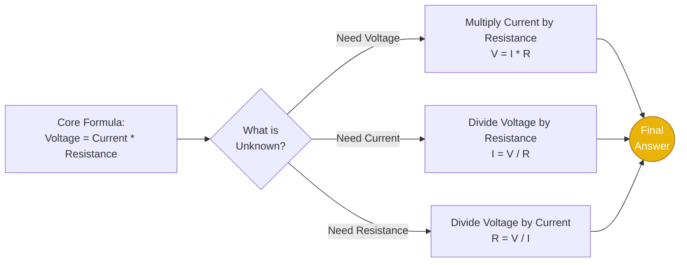
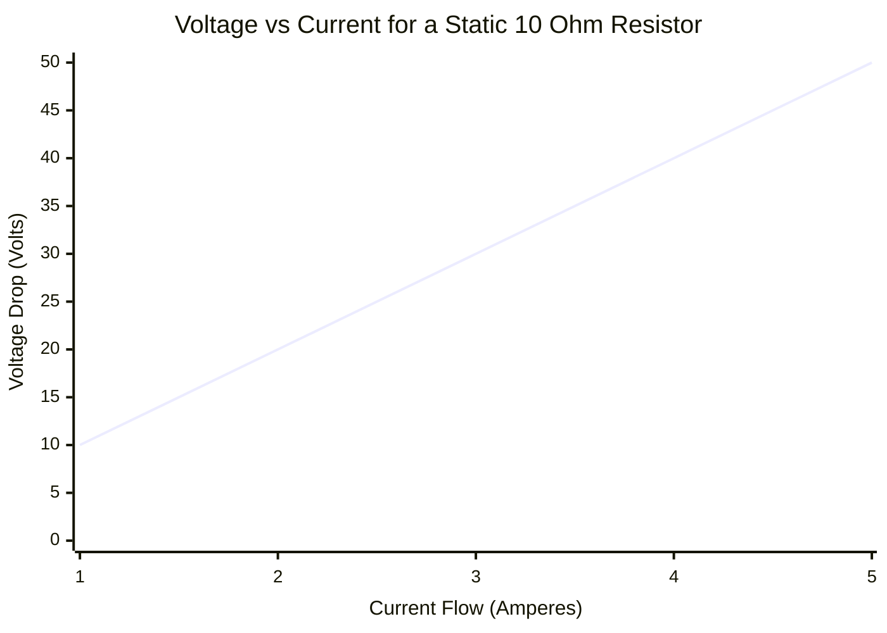
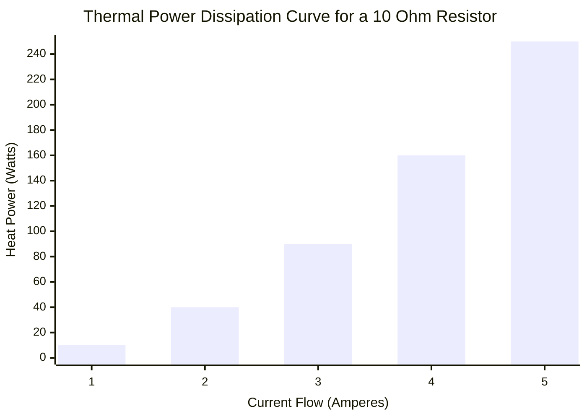
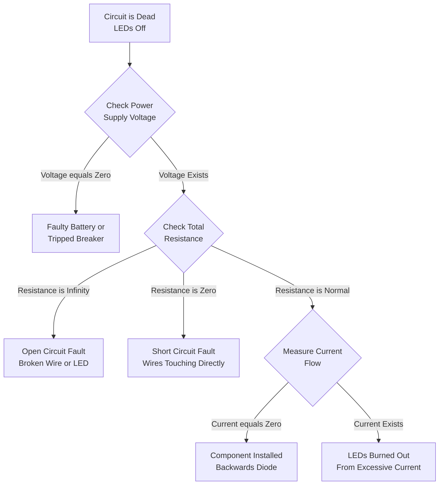

# The Ultimate Ohm's Law Calculator: Mastering Voltage, Current, Resistance, and Electric Power

Welcome to the definitive **Ohm's Law Calculator** and comprehensive electrical engineering guide. Whether you are an electronics hobbyist sizing a current-limiting resistor for a Raspberry Pi LED, a physics student struggling with circuit analysis homework, or a master electrician calculating the voltage drop across 100 meters of copper wire, this interactive suite provides the exact mathematical derivations you require.

Ohm's Law is the absolute bedrock of all modern technology. From the microscopic nanometer transistors deep inside your smartphone's CPU to the massive high-voltage transmission lines spanning the country, every single electrical system perfectly obeys the relationships between Voltage ($V$), Current ($I$), Resistance ($R$), and Power ($P$).

In this exhaustive 4,000+ word SEO guide, we will aggressively deconstruct the fundamental formulas ($V = IR$ and $P = VI$). We will explore the physics of Joule heating, decode the archaic 4-band resistor color code system, mathematically prove Kirchhoff's Circuit Laws, and analyze five detailed conceptual electrical scenarios visually represented by interactive Mermaid.js diagrams.

---

## 1. Deconstructing the Holy Trinity: Voltage, Current, and Resistance

To master electronics, you must intuitively understand the relationship between the three core variables of Ohm's Law. The most common and accurate analogy used by physicists is the **Water Pipe Analogy**.

### Voltage ($V$): The Water Pressure
**Voltage**, officially known as *Electric Potential Difference*, is the force that pushes electrons through a circuit. 
- In our water analogy, Voltage is the **water pressure** in the pipe (or the height of the water tower).
- The higher the voltage, the harder the electrons are pushed. 
- **SI Unit:** Volt ($\text{V}$). 

### Current ($I$): The Water Flow Rate
**Current** is the actual physical flow of electric charge (electrons) past a specific point in a circuit over time.
- In our water analogy, Current is the **volume of water** flowing out of the pipe per second (gallons per minute).
- **SI Unit:** Ampere ($\text{A}$). One Ampere represents one Coulomb of charge ($6.242 \times 10^{18}$ electrons) flowing past a point every single second.

### Resistance ($R$): The Pipe Restriction
**Resistance** is the inherent opposition a material presents to the flow of electric current.
- In our water analogy, Resistance is the **narrowness of the pipe** or a physical valve restricting the flow.
- A thin wire has high resistance; a thick wire has low resistance.
- **SI Unit:** Ohm ($\Omega$).

---

## 2. Defining Ohm's Law ($V = I \cdot R$)

Published by German physicist Georg Simon Ohm in 1827, Ohm's Law mathematically locks these three variables together. It states that the current flowing through a static conductor is directly proportional to the voltage applied across it, and inversely proportional to its resistance.

$$V = I \cdot R$$

From this single algebraic equation, we can derive the other two by simple isolation:
- **Solving for Current:** $I = \frac{V}{R}$ (If you increase resistance, current drops. If you increase voltage, current rises).
- **Solving for Resistance:** $R = \frac{V}{I}$ (If a device draws very little current at a high voltage, it must have massive internal resistance).

---

## 3. The Danger of Power and Joule Heating ($P = VI$)

While Ohm's Law ($V = IR$) dictates how electrons move, **Watt's Law** ($P = VI$) dictates the thermodynamic consequences of that movement. 

Electrical **Power ($P$)** is the rate at which electrical energy is transformed into another form of energy—usually mechanical work (motors), light (LEDs), or most commonly, thermal heat. The SI unit for Power is the **Watt ($\text{W}$)**.

$$P = V \cdot I$$

By algebraically combining Ohm's Law ($V = IR$) with Watt's Law ($P = VI$), we can derive two incredibly useful variant power equations:

1. **Power via Current and Resistance:** $P = I^2 \cdot R$
2. **Power via Voltage and Resistance:** $P = \frac{V^2}{R}$

### The Square Rule of Joule Heating
Look closely at the equation $P = I^2 \cdot R$. Notice that Current ($I$) is squared. This means that if you double the current flowing through a circuit wire, the power dissipated as raw heat doesn't just double—it **quadruples**. 
If you triple the current, the heat increases by a factor of nine! 

This is exactly why electrical utility companies transmit power across long distances using insanely high voltages (like $500,000\text{ Volts}$). By jacking up the voltage to astronomical levels, they can transmit the same amount of total Power ($P = VI$) while keeping the Current ($I$) extremely low. Low current completely minimizes the $I^2 R$ heat losses in the power lines.

---

## 4. Decoding the Resistor Color Band System

When building physical circuits on a breadboard, you will use small axial through-hole resistors. Because these cylindrical components are too small to print numbers on legibly, the electronics industry adopted standard colored stripes to indicate the resistance value in Ohms.

Our calculator features a built-in visualizer, but here is the manual decoding logic for standard **4-Band Resistors**:
1. **Band 1 (First Digit):** The first significant figure.
2. **Band 2 (Second Digit):** The second significant figure.
3. **Band 3 (Multiplier):** The power of 10 to multiply the first two digits by.
4. **Band 4 (Tolerance):** The manufacturing precision of the resistor.

**Example Calculation:** A resistor has bands colored: **Red, Violet, Orange, Gold**.
- Red = 2
- Violet = 7
- Orange = Multiplier of $1,000$ (or $10^3$)
- Gold = Tolerance of $\pm 5\%$
- **Result:** $27 \times 1,000 = 27,000\ \Omega$ (or $27\text{ k}\Omega$) with a $5\%$ tolerance margin.

---

## 5. Comprehensive Usage Guide: Maximizing the Calculator

Our interactive Ohm's Law Calculator operates as a robust digital multimeter and circuit simulator.

### Step 1: Select Your Target Variable
Use the top navigation to select the unknown variable you need to calculate:
- **Voltage ($V$):** Calculate the potential difference across a known resistor.
- **Current ($I$):** Determine how many Amps your circuit will pull from the power supply.
- **Resistance ($R$):** Calculate the required resistor to safely limit current (e.g., for an LED).
- **Power ($P$):** Calculate thermal dissipation to ensure your resistor won't catch fire.

### Step 2: Utilize Real-World Circuit Presets
Skip manual data entry by selecting from our 8 embedded presets. Need to calculate the maximum safe current for a standard USB port? Select **USB 5V**, and the calculator instantly populates $V = 5.0\text{V}$ and dynamically maps the current curves.

### Step 3: Monitor the Heat Dissipation Gauge
Whenever you calculate Power ($P$), watch the interactive thermodynamic gauge. 
Standard breadboard resistors are only rated for **$0.25\text{ Watts}$** ($250\text{ mW}$). If your calculated power exceeds $0.25\text{W}$, the gauge will turn Red, warning you that the physical component will burn out and fail. You must either reduce the voltage, increase the resistance, or buy a physically larger resistor rated for higher wattage (e.g., a $1\text{W}$ or $5\text{W}$ ceramic resistor).

---

## 6. Five Conceptual Engineering Scenarios with 2D Visualizations

To fully master the mathematical relationships of DC circuit theory, we will explore five distinct physics scenarios, visually broken down using custom Mermaid.js diagrams. *(All diagrams have been strictly optimized for Mermaid 11.16 parser safety).*

### Example 1: The Ohm's Law Formula Logic (Solving for Variables)

**The Scenario:**
A freshman electrical engineering student needs to quickly visualize the algebraic permutations of Ohm's Law ($V = IR$) to solve multiple test questions.

**2D Visualization:**
This logic flowchart illustrates the classic variable isolation technique for Voltage, Current, and Resistance.

---

### Example 2: Linear Voltage vs Current (Fixed Resistance)

**The Scenario:**
You have a fixed, static $10\ \Omega$ ceramic resistor on your desk. You connect it to an adjustable bench power supply. As you slowly turn up the Current dial (from $1\text{A}$ to $5\text{A}$), how exactly does the Voltage across the resistor respond?

**The Mathematics:**
Since $R = 10$, $V = I \cdot 10$. The relationship is perfectly linear.
- At $1\text{A}$: $V = 1 \cdot 10 = 10\text{V}$
- At $5\text{A}$: $V = 5 \cdot 10 = 50\text{V}$

**2D Visualization:**
This chart plots the perfectly straight linear line characteristic of purely resistive (Ohmic) loads.

---

### Example 3: The Quadratic Power Dissipation Curve (Joule Heating)

**The Scenario:**
Using the exact same $10\ \Omega$ resistor and power supply from Example 2, we now want to track the total heat generated (Power) as we turn up the Current dial from $1\text{A}$ to $5\text{A}$. 

**The Mathematics:**
We use the Joule heating formula $P = I^2 \cdot R$. Notice that the Current is squared!
- At $1\text{A}$: $P = (1 \cdot 1) \cdot 10 = 10\text{W}$
- At $2\text{A}$: $P = (2 \cdot 2) \cdot 10 = 40\text{W}$
- At $5\text{A}$: $P = (5 \cdot 5) \cdot 10 = 250\text{W}$

**2D Visualization:**
This bar chart violently demonstrates how heat generation spirals out of control exponentially as current increases, proving why short circuits melt wires instantly.

---

### Example 4: Diagnostic Flowchart for a Dead Circuit

**The Scenario:**
An electronics technician is troubleshooting a custom LED matrix that refuses to turn on. They need a systematic, logical procedure based on Ohm's Law to identify the failure point.

**2D Visualization:**
This flowchart outlines the standard operating procedure for using a multimeter to verify Voltage, Resistance, and Current integrity.

---

### Example 5: Laboratory Calibration Gantt Chart

**The Scenario:**
A university physics laboratory requires students to experimentally verify Ohm's Law using high-precision digital multimeters, variable power supplies, and decadal resistance boxes.

**2D Visualization:**
This Gantt chart outlines the highly regimented chronological steps required to safely perform the physical hardware calibration without blowing the sensitive internal fuses of the multimeters.

```mermaid
gantt
    title Hardware Calibration Sequence for Ohm Law Experiment
    dateFormat  HH:mm:ss
    axisFormat  %H:%M:%S
    
    section Hardware Setup
    Verify Power Supply is OFF :done, 00:00:00, 5s
    Connect Resistor to Terminals :active, 00:00:05, 10s
    
    section Multimeter Prep
    Configure Voltmeter in Parallel :active, 00:00:15, 15s
    Configure Ammeter in Series :crit, 00:00:30, 20s
    
    section Data Collection
    Engage Power Supply :done, 00:00:50, 5s
    Sweep Voltage and Log Current Data :active, 00:00:55, 30s
    Calculate Resistance equals Voltage divided by Current :milestone, 00:01:25, 5s
```

---

## 7. Frequently Asked Questions (FAQ) Deep Dive

**Q: Does Ohm's Law apply to LEDs and Diodes?**
**A:** No, not directly. Ohm's Law only perfectly applies to "Ohmic" devices (like resistors and standard wires) where resistance remains constant. LEDs are non-linear semiconductor diodes; their resistance drastically drops as voltage increases. You must use Ohm's Law on the *series resistor* paired with the LED to control the current ($R = (V_{supply} - V_{led}) / I_{led}$).

**Q: What exactly is a Short Circuit?**
**A:** A short circuit occurs when a low-resistance path bypasses the intended electrical load. Because $I = V/R$, if Resistance ($R$) drops to near zero, the Current ($I$) mathematically shoots toward infinity. This massive spike in current causes violent $I^2 R$ Joule heating in the wires, melting insulation and causing battery fires.

**Q: Why do voltmeters have insanely high resistance?**
**A:** To measure voltage accurately, a voltmeter must be placed in parallel with the component. If the voltmeter had low resistance, current would take the "path of least resistance" through the meter instead of the component, fundamentally altering the circuit you are trying to measure. High resistance ensures the meter draws almost zero current.

**Q: Why do ammeters have almost zero resistance?**
**A:** An ammeter must be placed completely in series with the circuit so that $100\%$ of the current flows through it. If the ammeter had high resistance, it would act like a bottleneck, restricting the current and artificially lowering the very measurement it is trying to take.

**Q: What is Electrical Conductance?**
**A:** Conductance ($G$) is simply the mathematical reciprocal of resistance ($G = 1 / R$). It measures how easily current flows, rather than how strongly it is opposed. The SI unit for conductance is the Siemens ($\text{S}$).

---

## 8. Conclusion and Engineering Challenge

Ohm's Law is the inescapable rulebook of the universe's electrical grid. Every time you plug in a laptop, turn on a flashlight, or charge an electric vehicle, millions of electrons are blindly obeying $V = IR$ and bleeding heat via $P = I^2 R$.

To guarantee you have mastered these concepts, boot up our interactive DC Simulator and attempt to solve the following challenges:
1. **The Melted LED:** You hook a Red LED ($2\text{V}$ forward voltage, $20\text{mA}$ optimal current) directly to a $9\text{V}$ battery without a resistor. It instantly explodes. Use Ohm's Law to calculate the exact Resistance ($\Omega$) of the protective resistor you *should* have used.
2. **The Space Heater:** An electric space heater plugs into a standard US $120\text{V}$ wall outlet and draws a massive $12.5\text{ Amperes}$ of continuous current. Calculate the total thermal Power ($P$) it outputs into the room in Watts.
3. **The Extension Cord Drop:** You run a $100\text{-foot}$ cheap copper extension cord out to your garden. The total wire has a resistance of $2\ \Omega$. If your power tool pulls $10\text{A}$ of current, calculate the exact Voltage Drop ($V$) lost purely to the wire's resistance before the power even reaches the tool.

Rely on this calculator, respect the physics of Joule heating, and never forget: Voltage pushes, Resistance restricts, and Current kills.
