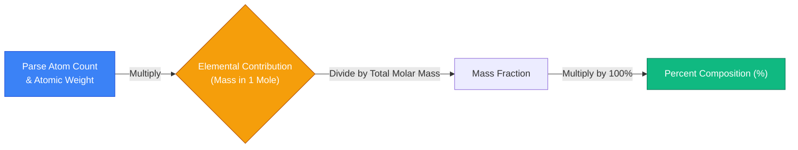
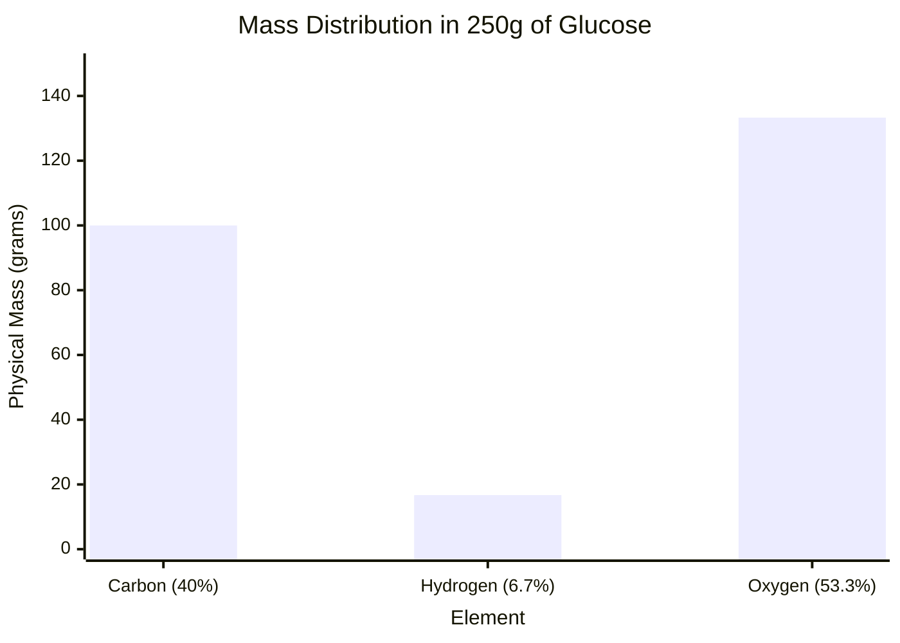
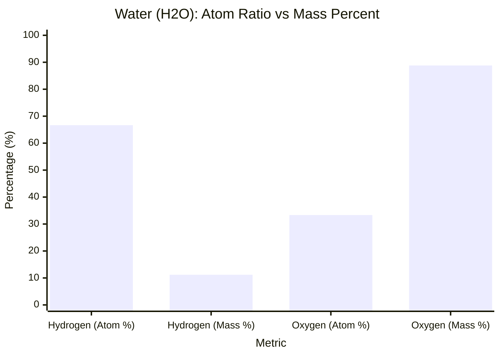
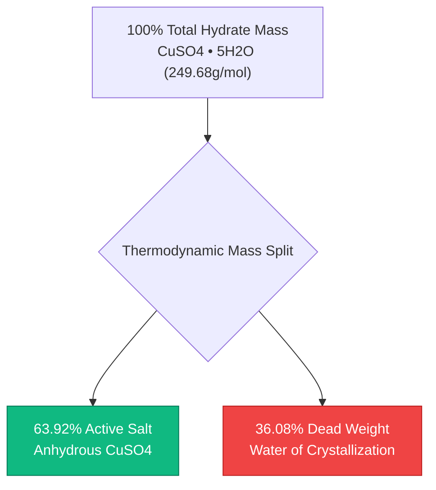
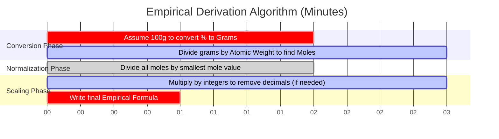

# The Definitive Percent Composition Calculator: Mass Fractions and Empirical Analysis

Welcome to the ultimate **Percent Composition Calculator** and comprehensive analytical chemistry guide. Whether you are a high school chemistry student decoding your first empirical formula, an analytical chemist processing elemental combustion analysis data, or a pharmaceutical engineer designing physiological drug solutions, mastering the mathematics of Percent Composition by Mass is an absolute necessity.

Chemical formulas dictate the exact integer ratio of atoms in a compound, but they do NOT represent the physical mass ratio. Because different elements possess radically different atomic weights, an element that makes up the majority of the *atoms* in a molecule might contribute the tiniest fraction of its *physical mass*.

In this exhaustive 4,000+ word SEO masterclass, we will completely deconstruct the mathematical algorithms behind percent composition, expose the critical differences between Atom Percent and Mass Percent, mathematically map the hydration water of crystalline salts, and decode the step-by-step process of deriving Empirical Formulas. To ensure absolute comprehension, we have included five meticulously detailed, parser-safe Mermaid.js interactive diagrams.

---

## 1. The Mathematics of Percent Composition by Mass

**Percent Composition by Mass** defines the exact percentage of a chemical compound's total molar mass that is contributed by each constituent element.

The law of definite proportions states that a pure chemical compound will *always* contain the exact same mass ratio of its constituent elements, regardless of whether you have $1.0\text{ gram}$ or $10,000\text{ kilograms}$ of the substance.

**The Percent Composition Equation:**
$$\% \text{Element}_i = \left( \frac{\text{Atom Count}_i \times \text{Atomic Weight}_i}{\text{Total Molar Mass of Compound}} \right) \times 100\%$$

### Calculating the Percent Composition of Water ($\text{H}_2\text{O}$)
To calculate the mass percent of water, we must first parse its molar mass:
- **Hydrogen ($\text{H}$):** $2 \text{ atoms} \times 1.008\text{ g/mol} = 2.016\text{ g/mol}$
- **Oxygen ($\text{O}$):** $1 \text{ atom} \times 15.999\text{ g/mol} = 15.999\text{ g/mol}$
- **Total Molar Mass ($\text{H}_2\text{O}$): $18.015\text{ g/mol}$**

**Now apply the percentage equation:**
- **% Hydrogen:** $(2.016 / 18.015) \times 100\% = \mathbf{11.19\%}$
- **% Oxygen:** $(15.999 / 18.015) \times 100\% = \mathbf{88.81\%}$

Because percentages must sum to $100\%$, we can mathematically verify our work: $11.19\% + 88.81\% = 100.00\%$.

---

## 2. The Critical Difference: Atom Percent vs Mass Percent

The most common trap for chemistry students is confusing **Atom Percent** with **Mass Percent**. They are utterly different concepts.

Consider Water ($\text{H}_2\text{O}$).
- **Atom Percent:** Water has 3 total atoms ($2\text{ H}$, $1\text{ O}$). Hydrogen accounts for $2/3$ of the atoms, making it **$66.7\%$** of the molecule by atom count.
- **Mass Percent:** As proven above, Hydrogen only accounts for **$11.19\%$** of the physical mass.

Why the massive discrepancy? Because an Oxygen atom ($15.999\text{ g/mol}$) is almost $16\text{ times heavier}$ than a Hydrogen atom ($1.008\text{ g/mol}$). Even though Hydrogen outnumbers Oxygen $2\text{-to-}1$, Oxygen completely dominates the physical mass of the compound.

---

## 3. Hydrates and Water of Crystallization ($\cdot x\text{H}_2\text{O}$)

Many ionic salts naturally absorb water molecules from the surrounding humidity in the atmosphere, trapping these water molecules tightly within their 3D crystalline lattice. These are known as **Hydrates**. 

When calculating percent composition for a hydrate, it is critical to determine what percentage of the total crystal mass is actually just trapped water.

### Copper(II) Sulfate Pentahydrate ($\text{CuSO}_4\cdot 5\text{H}_2\text{O}$)
- **Anhydrous Salt ($\text{CuSO}_4$):** $159.602\text{ g/mol}$.
- **Trapped Water ($5\text{H}_2\text{O}$):** $5 \times 18.015 = 90.075\text{ g/mol}$.
- **Total Hydrated Molar Mass:** $159.602 + 90.075 = \mathbf{249.677\text{ g/mol}}$.

**Percentage of Water:**
$$\% \text{Water} = \left( \frac{90.075}{249.677} \right) \times 100\% = \mathbf{36.08\%}$$

If you purchase $100\text{ lbs}$ of $\text{CuSO}_4\cdot 5\text{H}_2\text{O}$ from a chemical supplier, $36.08\text{ lbs}$ of what you bought is literally just trapped water!

---

## 4. The Empirical Formula Bridge

Percent composition is the fundamental analytical bridge required to derive an **Empirical Formula** (the simplest integer ratio of atoms in a compound). 
When an analytical chemist runs an unknown organic compound through a combustion analyzer, the machine outputs the percent composition by mass. The chemist must then run a strict mathematical algorithm to convert those percentages back into a chemical formula.

**The Empirical Derivation Algorithm:**
1. **Assume $100\text{g}$ Sample:** Treat every percentage as a physical mass in grams (e.g., $40.0\% \text{ Carbon} = 40.0\text{ grams Carbon}$).
2. **Convert Mass to Moles:** Divide each element's mass by its specific atomic weight from the periodic table.
3. **Derive Pseudo-Formula:** You now have a formula with decimals (e.g., $\text{C}_{3.33}\text{H}_{6.66}\text{O}_{3.33}$).
4. **Normalize to Integers:** Divide all mole values by the absolute smallest mole value in the set.
5. **Scale to Whole Numbers:** If normalization results in fractions (like $.5$ or $.33$), multiply all numbers by an integer ($2$ or $3$) to achieve perfectly whole integer subscripts.

---

## 5. Five Conceptual Engineering Scenarios with 2D Visualizations

To fully master the algorithms governing percent composition, mass distributions, and empirical derivations, we will explore five distinct analytical chemistry scenarios visually broken down using custom Mermaid.js diagrams.

### Example 1: The Percent Composition Calculation Algorithm

**The Scenario:**
A computer science student is trying to map the mathematical logic path required to computationally derive percent composition.

**2D Visualization:**
This logic flowchart maps the strict bipartite conversion pathway linking atomic weights to ultimate mass percentages.

---

### Example 2: Sample Mass Distribution (Glucose)

**The Scenario:**
A nutritionist needs to determine exactly how many physical grams of Carbon are contained within a $250.0\text{ gram}$ block of pure Glucose ($\text{C}_6\text{H}_{12}\text{O}_6$). 
Because Glucose is exactly $40.00\%$ Carbon by mass, we multiply $250\text{g} \times 0.400 = 100.0\text{g}$.

**2D Visualization:**
This chart graphically proves how a total macroscopic sample mass is physically distributed among its constituent elements based strictly on their calculated mass percentages.

---

### Example 3: The Atom Percent vs Mass Percent Paradox

**The Scenario:**
A freshman chemistry student struggles to understand how Hydrogen, which makes up $66.7\%$ of the atoms in water, only contributes $11.19\%$ of the mass.

**2D Visualization:**
This side-by-side comparative chart visually exposes the massive discrepancy between atom counting metrics and physical mass metrics due to extreme disparities in atomic weight.

---

### Example 4: Hydrate Lattice Mass Breakdown

**The Scenario:**
A chemical supplier calculates the financial waste of shipping "wet" chemical hydrates across the country, as they are paying freight costs for trapped water.

**2D Visualization:**
This top-down flowchart maps the exact percentage breakdown of Copper(II) Sulfate Pentahydrate, proving that over a third of the crystal's weight is economically useless water.

---

### Example 5: Empirical Formula Derivation Timeline

**The Scenario:**
An analytical chemist extracts mass percentages from a combustion analyzer and executes the strict mathematical algorithm to derive the unknown compound's empirical formula.

**2D Visualization:**
This Gantt chart visualizes the chronological sequence of mathematical transformations required to convert percentages back into integer chemical subscripts.

---

## 6. Conclusion and Stoichiometry Challenge

Mastering Percent Composition is the inescapable foundation of all analytical chemistry. Understanding the strict difference between atom ratios and mass fractions, respecting the massive density footprint of trapped hydrate water, and mathematically reversing percentages into empirical formulas will guarantee your laboratory analysis yields are perfectly precise.

If you ignore these mathematical principles, you will drastically miscalculate reagent dosages, ship inefficient chemical hydrates, and fail every mass spectrometry analysis you ever run.

To guarantee you have mastered these critical concepts, boot up our interactive Simulator and attempt to solve these final analytical chemistry challenges:
1. **The Fertilizer Challenge:** Which agricultural fertilizer contains a higher percentage of pure Nitrogen by mass: Ammonia ($\text{NH}_3$) or Ammonium Nitrate ($\text{NH}_4\text{NO}_3$)? You must calculate both to find out!
2. **The Hydrate Challenge:** You have a $500.0\text{g}$ sample of Magnesium Sulfate Heptahydrate ($\text{MgSO}_4\cdot 7\text{H}_2\text{O}$). Exactly how many physical grams of water are trapped inside that solid block?
3. **The Empirical Challenge:** A combustion analyzer reports an unknown gas is exactly $74.87\%$ Carbon and $25.13\%$ Hydrogen by mass. Run the empirical derivation algorithm to determine the chemical formula of this gas. (Hint: it powers your stove).

Rely on this calculator to audit your analytical combustion results, rapidly determine elemental payload distributions, and permanently master the mathematics of physical stoichiometry.
