# Laboratory & Analytical Chemistry Guide to pH & Acid-Base Equilibrium

In analytical and physical chemistry, **pH** measures the hydrogen ion activity in aqueous solutions:

$$\text{pH} = -\log_{10}[\text{H}^+] \quad \iff \quad [\text{H}^+] = 10^{-\text{pH}}$$

$$\text{pH} + \text{pOH} = \text{p}K_w \quad \text{where } K_w = [\text{H}^+][\text{OH}^-]$$

---

## 1. Temperature-Dependent $K_w$ & Neutral pH Reference Matrix

| Temperature (°C) | Water Autoionization ($K_w$) | $\text{p}K_w$ | Neutral pH ($\frac{1}{2}\text{p}K_w$) | Physiological / Context Note |
| :--- | :--- | :--- | :--- | :--- |
| **$0^\circ\text{C}$** | $1.14 \times 10^{-15}$ | $14.94$ | **$7.47$** | Freezing water point |
| **$25^\circ\text{C}$** | $1.00 \times 10^{-14}$ | $14.00$ | **$7.00$** | Standard laboratory reference |
| **$37^\circ\text{C}$** | $2.40 \times 10^{-14}$ | $13.62$ | **$6.81$** | Normal human body temperature |
| **$60^\circ\text{C}$** | $9.60 \times 10^{-14}$ | $13.02$ | **$6.51$** | Heated process water |

---

## 2. Standard Acid-Base Calculation Protocols

```
1. Strong Acid (monoprotic): [H+] = C_acid  ===>  pH = -log10[C_acid]
2. Strong Base (monohydroxide): [OH-] = C_base  ===>  pOH = -log10[C_base]  ===>  pH = pKw - pOH
3. Weak Acid (HA <==> H+ + A-): Solve x^2 + Ka*x - Ka*C = 0  ===>  pH = -log10(x)
4. Buffer Solution: pH = pKa + log10([Conjugate Base] / [Weak Acid])
```

---

## 3. Educational & Laboratory Safety Disclaimer
*This pH calculator provides theoretical acid-base equilibrium calculations for educational, laboratory research, and AP chemistry applications. Concentrated non-ideal solutions and precise analytical buffers should account for ionic strength and activity coefficients using calibrated pH meters.*

## 4. The Comprehensive Guide to pH and Acid-Base Chemistry

Welcome to the definitive guide on understanding, calculating, and manipulating pH in chemical solutions. Whether you are a high school student learning about logarithms for the first time, an AP Chemistry scholar preparing for grueling equilibrium problems, or a biochemist modeling human blood buffering systems, mastering pH is essential for navigating the molecular world.

At its core, pH is a measure of how acidic or basic an aqueous (water-based) solution is. It directly dictates how molecules will behave, how enzymes will fold, and how industrial reactions will proceed. A slight shift in the pH of a human bloodstream can be fatal, while a shift in soil pH can determine whether an entire crop yields a harvest or withers away.

In this exhaustive guide, we will explore the deep mechanics of acid-base chemistry, unpack the logarithmic mathematics that govern the pH scale, explain the often-misunderstood temperature dependence of neutrality, and walk through five highly detailed, real-world examples complete with mathematical derivations and 2D visual diagrams.

### 4.1 What Exactly is pH?

The term "pH" stands for "potential of hydrogen" (or "power of hydrogen"). It is a logarithmic scale used to specify the acidity or basicity of an aqueous solution. Mathematically, pH is the negative base-10 logarithm of the molar concentration of hydrogen ions ($\text{H}^+$) in a solution.

Because a bare hydrogen ion (a single proton) does not exist in isolation in water, it attaches to a water molecule to form a hydronium ion ($\text{H}_3\text{O}^+$). For simplicity in calculations, $\text{H}^+$ and $\text{H}_3\text{O}^+$ are used interchangeably.

$$ \text{pH} = -\log_{10}[\text{H}^+] $$

Because the scale is logarithmic, a change of **one pH unit** represents a **tenfold change** in hydrogen ion concentration. A solution with a pH of 3 is ten times more acidic than a solution with a pH of 4, and one hundred times more acidic than a solution with a pH of 5.

### 4.2 The Interplay of pH and pOH

Just as pH measures the concentration of hydrogen ions, **pOH** measures the concentration of hydroxide ions ($\text{OH}^-$). 

$$ \text{pOH} = -\log_{10}[\text{OH}^-] $$

In pure water, water molecules auto-ionize, spontaneously breaking apart into hydrogen and hydroxide ions:
$\text{H}_2\text{O} \rightleftharpoons \text{H}^+ + \text{OH}^-$

The equilibrium constant for this reaction is known as the autoionization constant of water, $K_w$. At standard room temperature (25°C), $K_w$ is exactly $1.0 \times 10^{-14}$. 

This creates a rigid mathematical relationship between pH and pOH. At 25°C:
$$ \text{pH} + \text{pOH} = 14.00 $$

If you know the pH, you immediately know the pOH, and therefore you know the concentration of both critical ions in the solution.

### 4.3 The Temperature Myth: Is Neutral pH Always 7.00?

A common misconception taught in introductory chemistry is that a neutral pH is rigidly fixed at 7.00. **This is fundamentally false.** 

Neutrality simply means that the concentration of hydrogen ions equals the concentration of hydroxide ions ($[\text{H}^+] = [\text{OH}^-]$). Because the autoionization of water is an endothermic process, increasing the temperature drives the reaction forward, creating *more* ions and thus increasing $K_w$.

*   At **0°C** (freezing), $K_w$ drops to $1.14 \times 10^{-15}$. Neutral pH is **7.47**.
*   At **25°C** (room temp), $K_w$ is $1.0 \times 10^{-14}$. Neutral pH is **7.00**.
*   At **37°C** (body temp), $K_w$ rises to $2.4 \times 10^{-14}$. Neutral pH is **6.81**.

Our calculator includes a sophisticated Temperature-Dependent $K_w$ Engine that dynamically adjusts the scale based on your input temperature, ensuring absolute physiological and thermodynamic accuracy.

---

## 5. Usage Guide: Mastering the pH Calculator

Our pH Calculator is engineered with an "Interactive Cockpit" that provides both instantaneous conversions and deep algorithmic solvers for complex equilibria.

### 5.1 Direct Logarithmic Conversions

If you simply need to convert between $[\text{H}^+]$, $[\text{OH}^-]$, pH, and pOH:
1.  **Select the Mode:** Choose "pH from [H+]" or the relevant conversion.
2.  **Input the Value:** You can use decimal notation (`0.001`) or scientific notation (`1e-3`).
3.  **Read the Output:** The calculator will instantly populate all four corners of the acid-base square (pH, pOH, $[\text{H}^+]$, $[\text{OH}^-]$) and classify the solution on the 0-14 spectrum.

### 5.2 Weak Acid and Base Equilibrium

Unlike strong acids that dissociate 100%, weak acids (like acetic acid, vinegar) only partially dissociate. To find their pH, you must solve a quadratic equation based on the Acid Dissociation Constant ($K_a$).
1.  **Select Mode:** Choose "Weak Acid Equilibrium Solver".
2.  **Input Parameters:** Enter the Initial Concentration of the acid ($C$) and its $K_a$ (or $\text{p}K_a$).
3.  **Execute:** The calculator internally solves the quadratic equation $x^2 + K_a x - K_a C = 0$ to find the exact $[\text{H}^+]$.

### 5.3 Buffer Solutions and Henderson-Hasselbalch

Buffers resist changes to pH and are essential in biology. 
1.  **Select Mode:** Choose "Henderson-Hasselbalch Calculator".
2.  **Input Parameters:** Enter the $\text{p}K_a$ of the weak acid, the concentration of the Conjugate Base, and the concentration of the Weak Acid.
3.  **Execute:** The tool applies the formula $\text{pH} = \text{p}K_a + \log([\text{Base}]/[\text{Acid}])$ to find the buffered pH.

---

## 6. Five Real-World Concept Examples

To truly master acid-base chemistry, you must see these principles applied to distinct scenarios. Below are five detailed examples ranging from strong acid dilutions to complex biochemical buffers.

### Example 1: The Strong Acid (Stomach Acid)

**Scenario:** 
Gastric acid in the human stomach contains concentrated hydrochloric acid ($\text{HCl}$), a strong acid that dissociates completely to digest food. If a laboratory sample of simulated gastric fluid has an $\text{HCl}$ concentration of $0.0316\text{ M}$, what is its pH at 25°C?

**Mathematical Derivation:**

1.  **Identify Strong Acid:** $\text{HCl}$ completely dissociates, so $[\text{H}^+] = [\text{HCl}] = 0.0316\text{ M}$.
2.  **Calculate pH:**
    $$ \text{pH} = -\log_{10}(0.0316) $$
    $$ \text{pH} = 1.50 $$
3.  **Calculate pOH and $[\text{OH}^-]$:**
    $$ \text{pOH} = 14.00 - 1.50 = 12.50 $$
    $$ [\text{OH}^-] = 10^{-12.50} = 3.16 \times 10^{-13}\text{ M} $$

**Visualization: Concentration Flow**


*Because it is a strong acid, the calculation is a direct, linear mathematical step. The deep red indicates high acidity.*

### Example 2: The Weak Acid (Vinegar / Acetic Acid)

**Scenario:**
Acetic acid ($\text{CH}_3\text{COOH}$) is the primary component of vinegar. It is a weak acid with a $K_a$ of $1.8 \times 10^{-5}$. If you have a $0.10\text{ M}$ solution of acetic acid, what is the pH?

**Mathematical Derivation:**

1.  **Set up the ICE Table (Initial, Change, Equilibrium):**
    *   Initial: $[\text{HA}] = 0.10$, $[\text{H}^+] = 0$, $[\text{A}^-] = 0$
    *   Change: $-x$, $+x$, $+x$
    *   Equilibrium: $0.10 - x$, $x$, $x$
2.  **Set up the Quadratic Equation:**
    $$ K_a = \frac{x^2}{0.10 - x} = 1.8 \times 10^{-5} $$
    $$ x^2 + (1.8 \times 10^{-5})x - 1.8 \times 10^{-6} = 0 $$
3.  **Solve for $x$ ($[\text{H}^+]$):**
    Using the quadratic formula, $x \approx 0.00133\text{ M}$.
4.  **Calculate pH:**
    $$ \text{pH} = -\log_{10}(0.00133) = 2.88 $$

**Visualization: Approximation vs Exact Quadratic**

| Method | $[\text{H}^+]$ (M) | Calculated pH | % Error |
| :--- | :--- | :--- | :--- |
| **Quadratic Formula (Exact)** | $0.001333$ | $2.875$ | $0.00\%$ |
| **Approximation ($0.10 - x \approx 0.10$)** | $0.001341$ | $2.872$ | $0.10\%$ |

*While the approximation method is often taught in high school, our calculator ALWAYS uses the exact quadratic solver to prevent massive errors when dealing with more dilute solutions.*

### Example 3: The Blood Buffer (Henderson-Hasselbalch)

**Scenario:**
Human blood is heavily buffered by the carbonic acid-bicarbonate system to maintain a strict pH. The $\text{p}K_a$ of carbonic acid ($\text{H}_2\text{CO}_3$) at body temperature is 6.10. In a healthy patient, the concentration of bicarbonate ($\text{HCO}_3^-$) is $24\text{ mM}$ and carbonic acid is $1.2\text{ mM}$. Verify the blood pH.

**Mathematical Derivation:**

1.  **Identify the Formula:** Henderson-Hasselbalch Equation.
    $$ \text{pH} = \text{p}K_a + \log_{10}\left(\frac{[\text{Base}]}{[\text{Acid}]}\right) $$
2.  **Input Values:**
    $$ \text{pH} = 6.10 + \log_{10}\left(\frac{24}{1.2}\right) $$
3.  **Calculate:**
    $$ \text{pH} = 6.10 + \log_{10}(20) $$
    $$ \text{pH} = 6.10 + 1.30 = 7.40 $$

*The result is precisely 7.40, the textbook ideal pH for human arterial blood.*

### Example 4: Temperature Shift of Pure Water

**Scenario:**
An engineer is monitoring the coolant water in a nuclear reactor. The pure, deionized water is operating at $60^\circ\text{C}$. The pH meter reads 6.51. The engineer panics, thinking the water has become dangerously acidic due to a chemical leak. Is the water acidic?

**Mathematical Derivation:**

1.  **Identify $K_w$ at 60°C:** According to thermodynamic tables, $K_w$ at $60^\circ\text{C}$ is $9.60 \times 10^{-14}$.
2.  **Calculate $[\text{H}^+]$ for pure neutral water:**
    $$ [\text{H}^+] = \sqrt{K_w} = \sqrt{9.60 \times 10^{-14}} = 3.098 \times 10^{-7}\text{ M} $$
3.  **Calculate Neutral pH:**
    $$ \text{pH} = -\log_{10}(3.098 \times 10^{-7}) = 6.51 $$

**Conclusion:** The water is **perfectly neutral**. The pH is simply lower because the elevated temperature drove the autoionization forward, creating equal amounts of BOTH $[\text{H}^+]$ and $[\text{OH}^-]$. The engineer does not need to panic.

### Example 5: Acid Dilution (Serial Dilution Timeline)

**Scenario:**
A laboratory technician takes $10\text{ mL}$ of a strong acid with a pH of 3.00 and dilutes it with pure water to a final volume of $1000\text{ mL}$ (a 1:100 dilution). What is the new pH?

**Mathematical Derivation:**

1.  **Find Initial $[\text{H}^+]$:**
    $$ [\text{H}^+]_{\text{initial}} = 10^{-3.00} = 0.001\text{ M} $$
2.  **Calculate Dilution ($M_1V_1 = M_2V_2$):**
    $$ (0.001\text{ M})(10\text{ mL}) = (M_2)(1000\text{ mL}) $$
    $$ M_2 = 0.00001\text{ M} = 10^{-5}\text{ M} $$
3.  **Calculate New pH:**
    $$ \text{pH} = -\log_{10}(10^{-5}) = 5.00 $$

**Visualization: Serial Dilution Laboratory Timeline**

```mermaid
gantt
    title Laboratory Timeline: Serial Dilution Process
    dateFormat  HH:mm:ss
    axisFormat  %H:%M
    section Preparation
    Measure 10mL (pH 3.00) :active, 00:00:00, 00:05:00
    Transfer to Volumetric Flask :active, 00:05:00, 00:07:00
    section Dilution
    Add 990mL Deionized Water :crit, 00:07:00, 00:15:00
    Homogenization / Mixing :active, 00:15:00, 00:20:00
    section Analysis
    Measure New pH (5.00) :milestone, 00:20:00, 00:20:00
```



*This Gantt chart outlines the physical laboratory steps that accompany the mathematical calculation of a serial dilution.*

---

## 7. Deep Dive FAQ and Advanced Troubleshooting

**Q: Can pH be negative?**
**A:** Yes! It is a mathematical myth that the pH scale absolutely stops at 0 and 14. If you have a highly concentrated strong acid, like a $10\text{ M}$ solution of $\text{HCl}$, the pH is $-\log(10) = -1.0$. Conversely, a $10\text{ M}$ solution of $\text{NaOH}$ has a pH of $15.0$.

**Q: Why does the calculator ask for temperature?**
**A:** Because water's autoionization constant ($K_w$) is highly temperature-dependent. If you are calculating the pH of a base from its $[\text{OH}^-]$ concentration, the formula $\text{pH} = \text{p}K_w - \text{pOH}$ requires the exact $\text{p}K_w$ at that specific temperature to be analytically accurate. 

**Q: What is the difference between $K_a$ and $\text{p}K_a$?**
**A:** $K_a$ is the acid dissociation constant, which is often a very small number (like $1.8 \times 10^{-5}$). $\text{p}K_a$ is the negative base-10 logarithm of $K_a$ (in this case, 4.74). It is much easier to talk about $\text{p}K_a$ values. Remember: the smaller the $\text{p}K_a$, the stronger the acid!

**Q: Will diluting an acid forever eventually make it basic?**
**A:** No. As you infinitely dilute an acid with pure neutral water, the pH approaches 7.00 asymptotically but will never cross it into the basic realm (e.g. pH 8). At extremely high dilutions (e.g., $10^{-8}\text{ M HCl}$), the autoionization of the water itself contributes more $[\text{H}^+]$ than the acid does, requiring a complex systematic equilibrium calculation to solve.

**Q: How does this relate to Buffers and Titrations?**
**A:** The fundamental equations underlying pH are used to build titration curves. When you slowly add a strong base to a weak acid, you create a buffer region governed by the Henderson-Hasselbalch equation until you reach the equivalence point. Understanding these basic pH conversions is the first step to mastering titration analysis.

By mastering the mathematical interplay between hydrogen ions, hydroxide ions, and logarithmic scales, you gain profound control over the chemical environment. Ensure you use this pH calculator as both a precision analytical tool and an educational safeguard to check your laboratory calculations!
