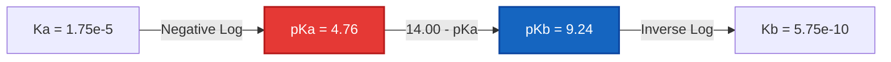

# Laboratory & Analytical Chemistry Guide to pKa & Acid Strength Analysis

In physical organic and quantitative analytical chemistry, **$\text{p}K_a$** quantifies the thermodynamic tendency of an acid to dissociate in aqueous media:

$$\text{p}K_a = -\log_{10}(K_a) \quad \iff \quad K_a = 10^{-\text{p}K_a}$$

$$\text{p}K_a + \text{p}K_b = \text{p}K_w \quad \text{where } K_w = K_a \cdot K_b = 1.00 \times 10^{-14} \text{ at } 25^\circ\text{C}$$

---

## 1. Acid Strength Classification & Reference Matrix

| Acid Name | Formula | $K_a$ ($25^\circ\text{C}$) | $\text{p}K_a$ ($25^\circ\text{C}$) | Conjugate Base ($\text{A}^-$) | Strength Classification |
| :--- | :--- | :--- | :--- | :--- | :--- |
| **Hydrochloric Acid** | $\text{HCl}$ | $\sim 1 \times 10^7$ | **$-7.0$** | $\text{Cl}^-$ | Strong Acid |
| **Nitric Acid** | $\text{HNO}_3$ | $\sim 2.4 \times 10^1$ | **$-1.4$** | $\text{NO}_3^-$ | Strong Acid |
| **Phosphoric Acid ($\text{p}K_{a1}$)** | $\text{H}_3\text{PO}_4$ | $7.1 \times 10^{-3}$ | **$2.15$** | $\text{H}_2\text{PO}_4^-$ | Moderately Strong Acid |
| **Acetic Acid** | $\text{CH}_3\text{COOH}$ | $1.75 \times 10^{-5}$ | **$4.76$** | $\text{CH}_3\text{COO}^-$ | Weak Acid |
| **Carbonic Acid ($\text{p}K_{a1}$)** | $\text{H}_2\text{CO}_3$ | $4.5 \times 10^{-7}$ | **$6.35$** | $\text{HCO}_3^-$ | Weak Acid |
| **Hydrocyanic Acid** | $\text{HCN}$ | $6.2 \times 10^{-10}$ | **$9.21$** | $\text{CN}^-$ | Very Weak Acid |

---

## 2. Standard Acid Dissociation Calculation Protocols

```
1. pKa from Ka: pKa = -log10(Ka)
2. Ka from pKa: Ka = 10^(-pKa)
3. Conjugate Base pKb: pKb = pKw - pKa  ===>  Kb = 10^(-pKb)
4. Weak Acid Equilibrium: Solve x^2 + Ka*x - Ka*C = 0  ===>  [H+] = x, pH = -log10(x)
5. Henderson-Hasselbalch: pH = pKa + log10([Conjugate Base A-] / [Weak Acid HA])
```

---

## 3. Educational & Laboratory Safety Disclaimer
*This pKa calculator provides theoretical acid dissociation calculations for educational, laboratory research, and AP chemistry applications. Non-ideal solutions at high ionic strengths should account for activity coefficients using Debye-Hückel or Pitzer equations.*

## 4. The Comprehensive Guide to pKa and Acid Strength

Welcome to the definitive guide on understanding, calculating, and applying $\text{p}K_a$ in chemical systems. While pH measures the acidity of a *solution* at a given moment, $\text{p}K_a$ measures the intrinsic strength of the *acid itself*. Whether you are a high school student learning about conjugate bases, an analytical chemist determining the half-equivalence point in a titration, or a biochemist modeling the protonation state of amino acids in a protein, mastering $\text{p}K_a$ is non-negotiable.

At its core, $\text{p}K_a$ dictates whether a molecule will hold onto its proton (hydrogen ion) or donate it to the surrounding environment. It governs the absorption of pharmaceuticals in the human stomach, the buffering capacity of ocean water, and the speed of acid-catalyzed industrial synthesis.

In this exhaustive guide, we will explore the thermodynamics of acid dissociation, unpack the logarithmic mathematics that map $K_a$ to $\text{p}K_a$, detail the complex behavior of polyprotic acids (like Phosphoric acid), and walk through five highly detailed, real-world examples complete with mathematical derivations and strictly formatted visual diagrams.

### 4.1 What Exactly is pKa?

When an acid (HA) dissolves in water, it reaches an equilibrium state where a fraction of the acid molecules donate a proton to the water, forming hydronium ions ($\text{H}_3\text{O}^+$) and conjugate base ions ($\text{A}^-$):
$\text{HA} + \text{H}_2\text{O} \rightleftharpoons \text{H}_3\text{O}^+ + \text{A}^-$

The Equilibrium Constant for this specific dissociation is called the Acid Dissociation Constant, $K_a$:
$$ K_a = \frac{[\text{H}^+][\text{A}^-]}{[\text{HA}]} $$

Because $K_a$ values for weak acids are extremely small numbers (e.g., $1.8 \times 10^{-5}$ for acetic acid) with large negative exponents, chemists use a logarithmic scale to make them easier to handle. This is **$\text{p}K_a$**:
$$ \text{p}K_a = -\log_{10}(K_a) $$

**The Golden Rule of pKa:** The smaller (or more negative) the $\text{p}K_a$ value, the **stronger** the acid. 
- A $\text{p}K_a$ of -7 (Hydrochloric acid) means it is a massive, aggressive proton donor. 
- A $\text{p}K_a$ of 4.76 (Acetic acid) means it is a weak proton donor. 
- A $\text{p}K_a$ of 15.7 (Water acting as an acid) means it is an incredibly poor proton donor.

Because the scale is logarithmic, an acid with a $\text{p}K_a$ of 3 is **ten times stronger** than an acid with a $\text{p}K_a$ of 4, and one hundred times stronger than an acid with a $\text{p}K_a$ of 5.

### 4.2 The Conjugate Seesaw: pKa and pKb

Every acid (HA) has a conjugate base ($\text{A}^-$). If the acid is strong (it really wants to give away a proton), its conjugate base must be weak (it really does NOT want to take a proton back). This relationship is mathematically locked by the autoionization constant of water ($K_w$).

$$ K_a \times K_b = K_w $$
$$ \text{p}K_a + \text{p}K_b = 14.00 \quad (\text{at } 25^\circ\text{C}) $$

If you know the $\text{p}K_a$ of an acid, you instantly know the $\text{p}K_b$ of its conjugate base. For example, if Acetic Acid has a $\text{p}K_a$ of 4.76, the Acetate ion ($\text{CH}_3\text{COO}^-$) has a $\text{p}K_b$ of 9.24.

### 4.3 Polyprotic Acids: Multiple Personalities

Some acids possess more than one donatable proton. These are known as **polyprotic acids**. The most famous examples are Sulfuric acid ($\text{H}_2\text{SO}_4$) and Phosphoric acid ($\text{H}_3\text{PO}_4$). 

Polyprotic acids dissociate in discrete steps, and each step has its own $K_a$ and $\text{p}K_a$ value. 
For $\text{H}_3\text{PO}_4$:
1.  **$\text{p}K_{a1} = 2.15$**: $\text{H}_3\text{PO}_4 \rightleftharpoons \text{H}_2\text{PO}_4^- + \text{H}^+$
2.  **$\text{p}K_{a2} = 7.20$**: $\text{H}_2\text{PO}_4^- \rightleftharpoons \text{HPO}_4^{2-} + \text{H}^+$
3.  **$\text{p}K_{a3} = 12.35$**: $\text{HPO}_4^{2-} \rightleftharpoons \text{PO}_4^{3-} + \text{H}^+$

Notice that each successive proton is harder to remove than the last. This is because removing a positively charged proton from an increasingly negatively charged molecule requires significantly more thermodynamic energy. Therefore, **$\text{p}K_{a1} < \text{p}K_{a2} < \text{p}K_{a3}$** is always true.

---

## 5. Usage Guide: Mastering the pKa Calculator

Our pKa Calculator is a professional-grade analytical tool designed for rapid conversions and complex polyprotic equilibrium mapping.

### 5.1 Direct Logarithmic Conversions

If you simply need to interconvert $K_a$, $\text{p}K_a$, $K_b$, and $\text{p}K_b$:
1.  **Select the Mode:** Choose "pKa from Ka" or "Ka from pKa".
2.  **Input the Value:** You can use decimal notation (`0.000018`) or scientific notation (`1.8e-5`).
3.  **Read the Output:** The calculator instantly completes the acid-base profile, providing the conjugate base parameters ($\text{p}K_b$) and classifying the acid's strength.

### 5.2 Titration and Half-Equivalence

The $\text{p}K_a$ is magically revealed during a weak acid/strong base titration.
1.  **Select Mode:** Choose "pKa from Measured pH & Concentration".
2.  **Input Parameters:** Enter the pH of the solution at the **Half-Equivalence Point** (the exact moment when you have neutralized exactly half of the weak acid).
3.  **Execute:** The tool leverages the Henderson-Hasselbalch equation. Because $[\text{A}^-] = [\text{HA}]$ at this exact point, $\log(1) = 0$, and therefore **$\text{pH} = \text{p}K_a$**.

### 5.3 Weak Acid Quadratic Equilibrium

To find the exact pH of a weak acid dissolved in water:
1.  **Select Mode:** Choose "Weak Acid Equilibrium Solver".
2.  **Input Parameters:** Enter the Initial Concentration ($C$) and the $\text{p}K_a$.
3.  **Execute:** The calculator converts $\text{p}K_a$ to $K_a$ and exactly solves the quadratic equation $x^2 + K_a x - K_a C = 0$ to find the true hydronium concentration.

---

## 6. Five Real-World Concept Examples

To master acid strength, we must apply the abstract logarithm to physical chemical systems. Below are five detailed examples covering simple conversions, pharmaceutical buffering, and polyprotic species mapping.

### Example 1: The Classic Conversion (Acetic Acid)

**Scenario:** 
A high school chemistry problem states that the acid dissociation constant ($K_a$) of Acetic Acid is $1.75 \times 10^{-5}$ at $25^\circ\text{C}$. Calculate its $\text{p}K_a$ and the $\text{p}K_b$ of the acetate ion.

**Mathematical Derivation:**

1.  **Calculate $\text{p}K_a$:**
    $$ \text{p}K_a = -\log_{10}(1.75 \times 10^{-5}) $$
    $$ \text{p}K_a = 4.757 \approx 4.76 $$
2.  **Calculate $\text{p}K_b$ (Assuming $25^\circ\text{C}$ where $\text{p}K_w = 14.00$):**
    $$ \text{p}K_b = 14.00 - 4.76 = 9.24 $$
3.  **Calculate $K_b$ of the Acetate ion:**
    $$ K_b = 10^{-9.24} = 5.75 \times 10^{-10} $$

**Visualization: Conjugate Seesaw Flow**



*This simple flowchart demonstrates the rigid thermodynamic relationship between a weak acid and its conjugate base.*

### Example 2: Polyprotic Acid Fraction Mapping (Phosphoric Acid)

**Scenario:**
An agronomist is testing a soil sample buffered by phosphates. Phosphoric acid ($\text{H}_3\text{PO}_4$) has three $\text{p}K_a$ values: 2.15, 7.20, and 12.35. If the soil pH is exactly 7.20, what is the dominant phosphate species?

**Mathematical Derivation:**

1.  **Analyze the pH relative to $\text{p}K_a$ thresholds:**
    - The soil pH is 7.20.
    - This is far above $\text{p}K_{a1}$ (2.15), meaning the first proton is completely gone. The species is no longer $\text{H}_3\text{PO}_4$.
    - This is far below $\text{p}K_{a3}$ (12.35), meaning the third proton is securely attached. The species is not $\text{PO}_4^{3-}$.
2.  **Evaluate the Second Dissociation Step ($\text{p}K_{a2} = 7.20$):**
    This is the equilibrium between $\text{H}_2\text{PO}_4^-$ and $\text{HPO}_4^{2-}$.
3.  **Apply Henderson-Hasselbalch:**
    $$ \text{pH} = \text{p}K_{a2} + \log_{10}\left(\frac{[\text{HPO}_4^{2-}]}{[\text{H}_2\text{PO}_4^-]}\right) $$
    $$ 7.20 = 7.20 + \log_{10}\left(\frac{[\text{HPO}_4^{2-}]}{[\text{H}_2\text{PO}_4^-]}\right) $$
    $$ 0 = \log_{10}\left(\frac{[\text{HPO}_4^{2-}]}{[\text{H}_2\text{PO}_4^-]}\right) $$
    $$ 1 = \frac{[\text{HPO}_4^{2-}]}{[\text{H}_2\text{PO}_4^-]} $$

**Conclusion:** At exactly pH 7.20, the soil contains a perfect 50/50 mix of $\text{H}_2\text{PO}_4^-$ and $\text{HPO}_4^{2-}$. There is no single "dominant" species; they are exactly equal in concentration.

### Example 3: Pharmaceutical Absorption (Aspirin)

**Scenario:**
Aspirin (acetylsalicylic acid) is a weak acid with a $\text{p}K_a$ of 3.5. Drugs are generally absorbed through lipid cell membranes only when they are uncharged (protonated, $\text{HA}$). If the human stomach has a pH of 1.5, what percentage of the aspirin is in the absorbable ($\text{HA}$) form?

**Mathematical Derivation:**

1.  **Apply Henderson-Hasselbalch:**
    $$ \text{pH} = \text{p}K_a + \log_{10}\left(\frac{[\text{A}^-]}{[\text{HA}]}\right) $$
    $$ 1.5 = 3.5 + \log_{10}\left(\frac{[\text{A}^-]}{[\text{HA}]}\right) $$
    $$ -2.0 = \log_{10}\left(\frac{[\text{A}^-]}{[\text{HA}]}\right) $$
2.  **Inverse Logarithm:**
    $$ 10^{-2.0} = \frac{[\text{A}^-]}{[\text{HA}]} = 0.01 $$
3.  **Calculate Percentage:**
    This means for every 1 molecule of $\text{A}^-$, there are 100 molecules of $\text{HA}$.
    $$ \% \text{HA} = \frac{100}{101} \times 100 \approx 99.01\% $$

**Conclusion:** Because the stomach is highly acidic (pH is two full units below the drug's $\text{p}K_a$), 99% of the aspirin remains uncharged and is rapidly absorbed into the bloodstream.

### Example 4: The Laboratory Titration

**Scenario:**
An analytical chemistry student is performing a titration on an unknown weak acid using a $0.100\text{ M NaOH}$ standard solution. They find the equivalence point occurs at exactly $40.0\text{ mL}$ of added base. They check their pH meter readings and find that at exactly $20.0\text{ mL}$ of added base, the pH was 3.85. What is the $K_a$ of the unknown acid?

**Mathematical Derivation:**

1.  **Identify the Half-Equivalence Point:**
    Equivalence point = $40.0\text{ mL}$.
    Half-Equivalence point = $20.0\text{ mL}$.
2.  **Apply the Half-Equivalence Rule:**
    At the half-equivalence point, exactly half of the weak acid has been turned into its conjugate base.
    $[\text{HA}] = [\text{A}^-]$
    Therefore, $\text{pH} = \text{p}K_a$.
3.  **Determine $\text{p}K_a$ and $K_a$:**
    $$ \text{p}K_a = 3.85 $$
    $$ K_a = 10^{-3.85} = 1.41 \times 10^{-4} $$

**Visualization: Titration Laboratory Timeline**

```mermaid
gantt
    title Laboratory Timeline: Weak Acid Titration
    dateFormat  HH:mm:ss
    axisFormat  %H:%M
    section Setup
    Calibrate pH Meter :active, 00:00:00, 00:05:00
    Measure Unknown Acid :active, 00:05:00, 00:10:00
    section Titration
    Add Base to 20mL Half-Eq :crit, 00:10:00, 00:20:00
    Add Base to 40mL Full-Eq :crit, 00:20:00, 00:30:00
    section Analysis
    Extract pKa from Half-Eq pH :milestone, 00:30:00, 00:30:00
```



*This Gantt chart visualizes the strict chronological procedure required to correctly map a titration curve and extract the pKa parameter.*

### Example 5: Finding pH from pKa (Exact Quadratic Solver)

**Scenario:**
A student dissolves $0.050\text{ M}$ of a weak organic acid ($\text{p}K_a = 4.00$) in pure water. What is the exact pH?

**Mathematical Derivation:**

1.  **Convert $\text{p}K_a$ to $K_a$:**
    $$ K_a = 10^{-4.00} = 1.0 \times 10^{-4} $$
2.  **Set up the ICE Table & Quadratic Equation:**
    $$ K_a = \frac{x^2}{0.050 - x} = 1.0 \times 10^{-4} $$
    $$ x^2 + (1.0 \times 10^{-4})x - 5.0 \times 10^{-6} = 0 $$
3.  **Solve for $x$ ($[\text{H}^+]$):**
    Using the quadratic formula:
    $$ x = \frac{-1.0 \times 10^{-4} + \sqrt{(1.0 \times 10^{-4})^2 - 4(1)(-5.0 \times 10^{-6})}}{2} $$
    $$ x \approx 0.002186\text{ M} $$
4.  **Calculate pH:**
    $$ \text{pH} = -\log_{10}(0.002186) = 2.66 $$

**Visualization: Exact vs Approximation**

| Method | $[\text{H}^+]$ (M) | Calculated pH | % Error |
| :--- | :--- | :--- | :--- |
| **Quadratic Formula (Exact)** | $0.002186$ | $2.660$ | $0.00\%$ |
| **Approximation ($0.050 - x \approx 0.050$)** | $0.002236$ | $2.650$ | $0.38\%$ |

*While the approximation gets close, it introduces error. Our calculator always utilizes the exact quadratic algorithm to ensure flawless analytical precision.*

---

## 7. Deep Dive FAQ and Advanced Troubleshooting

**Q: Can a pKa value be negative?**
**A:** Yes, absolutely. A negative $\text{p}K_a$ value indicates a strong acid. Because $\text{p}K_a = -\log_{10}(K_a)$, a $K_a$ greater than 1 (meaning the acid highly favors dissociation) will yield a negative $\text{p}K_a$. For example, Hydrochloric Acid ($\text{HCl}$) has a $\text{p}K_a$ of roughly -7.

**Q: Why is pKa preferred over Ka in organic chemistry?**
**A:** Convenience and linearity. Discussing acid strength using numbers like 4.76 and 9.24 is vastly easier than comparing $1.75 \times 10^{-5}$ and $5.75 \times 10^{-10}$. Furthermore, the Henderson-Hasselbalch equation maps $\text{p}K_a$ linearly to the pH scale, allowing chemists to instantly predict the protonation state of a molecule based on environmental pH.

**Q: Is pKa temperature-dependent like pH and pOH?**
**A:** Yes. Acid dissociation is a thermodynamic equilibrium process governed by $\Delta G^\circ = -RT \ln(K_a)$. Because Temperature ($T$) is in the equation, changing the temperature will alter the equilibrium constant $K_a$, thereby changing the $\text{p}K_a$. However, for many weak organic acids, this shift is relatively small across standard laboratory temperature ranges compared to the massive shift seen in the autoionization of water ($K_w$).

**Q: What is the "Rule of 2" in Buffer Chemistry?**
**A:** A weak acid effectively buffers a solution within a range of **$\text{p}K_a \pm 1$**. For example, acetic acid ($\text{p}K_a = 4.76$) is a good buffer between pH 3.76 and 5.76. Outside this range, the ratio of $[\text{A}^-]$ to $[\text{HA}]$ becomes too extreme (greater than 10:1 or 1:10), and the buffer rapidly loses its capacity to resist changes in pH.

**Q: How does this calculator handle Polyprotic Acids?**
**A:** Our polyprotic fraction engine calculates the alpha values ($\alpha_0, \alpha_1, \alpha_2$, etc.) representing the fraction of the total acid in each protonation state at any given pH. This is critical for predicting the charge of complex molecules like EDTA or amino acids in biochemistry.

By mastering the mathematical elegance of $\text{p}K_a$ and its logarithmic relationship with dissociation, you gain the ability to predict the outcome of titrations, the behavior of buffers, and the absorption of pharmaceuticals. Always rely on this pKa calculator to verify your derivations and guarantee analytical accuracy!
