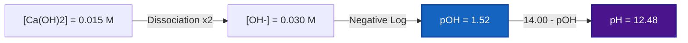

# Laboratory & Analytical Chemistry Guide to pOH & Base Equilibrium

In analytical chemistry and base equilibria, **pOH** measures the hydroxide ion activity in aqueous solutions:

$$\text{pOH} = -\log_{10}[\text{OH}^-] \quad \iff \quad [\text{OH}^-] = 10^{-\text{pOH}}$$

$$\text{pH} + \text{pOH} = \text{p}K_w \quad \text{where } K_w = [\text{H}^+][\text{OH}^-]$$

---

## 1. Temperature-Dependent $K_w$ & Neutral pOH Reference Matrix

| Temperature (°C) | Water Autoionization ($K_w$) | $\text{p}K_w$ | Neutral pOH ($\frac{1}{2}\text{p}K_w$) | Physiological / Context Note |
| :--- | :--- | :--- | :--- | :--- |
| **$0^\circ\text{C}$** | $1.14 \times 10^{-15}$ | $14.94$ | **$7.47$** | Freezing water point |
| **$25^\circ\text{C}$** | $1.00 \times 10^{-14}$ | $14.00$ | **$7.00$** | Standard laboratory reference |
| **$37^\circ\text{C}$** | $2.40 \times 10^{-14}$ | $13.62$ | **$6.81$** | Normal human body temperature |
| **$60^\circ\text{C}$** | $9.60 \times 10^{-14}$ | $13.02$ | **$6.51$** | Heated process water |

---

## 2. Standard Base Equilibrium Calculation Protocols

```
1. Strong Base (monohydroxide): [OH-] = C_base  ===>  pOH = -log10[C_base]
2. Strong Base (dihydroxide e.g. Ca(OH)2): [OH-] = 2 * C_base  ===>  pOH = -log10[2 * C_base]
3. Weak Base (B + H2O <==> BH+ + OH-): Solve x^2 + Kb*x - Kb*C = 0  ===>  pOH = -log10(x)
4. Base Buffer Solution: pOH = pKb + log10([Conjugate Acid BH+] / [Weak Base B])
```

---

## 3. Educational & Laboratory Safety Disclaimer
*This pOH calculator provides theoretical base equilibrium calculations for educational, laboratory research, and AP chemistry applications. Concentrated non-ideal solutions and precise analytical buffers should account for ionic strength and activity coefficients using calibrated laboratory equipment.*

## 4. The Comprehensive Guide to pOH and Base Chemistry

Welcome to the definitive guide on understanding, calculating, and manipulating pOH in chemical solutions. While pH often takes the spotlight in high school chemistry, pOH is its equally vital counterpart, governing the behavior of bases, alkaline solutions, and the fundamental equilibrium of water itself. Whether you are an AP Chemistry student mastering the ionization of weak bases, an industrial chemist formulating cleaning agents, or a biologist studying cellular buffering, mastering pOH is crucial.

At its core, pOH is a measure of the alkalinity or basicity of an aqueous (water-based) solution. It directly quantifies the concentration of hydroxide ions ($\text{OH}^-$), dictating how basic molecules interact, neutralize acids, and drive saponification reactions. 

In this exhaustive guide, we will explore the deep mechanics of base chemistry, unpack the logarithmic mathematics that govern the pOH scale, clarify the critical relationship between pH, pOH, and temperature, and walk through five highly detailed, real-world examples complete with mathematical derivations and visual diagrams.

### 4.1 What Exactly is pOH?

The term "pOH" represents the "potential of hydroxide". It is a logarithmic scale used to specify the concentration of hydroxide ions ($\text{OH}^-$) in an aqueous solution. Mathematically, pOH is the negative base-10 logarithm of the molar concentration of hydroxide ions.

$$ \text{pOH} = -\log_{10}[\text{OH}^-] $$

Because the scale is logarithmic, a change of **one pOH unit** represents a **tenfold change** in hydroxide ion concentration. A solution with a pOH of 3 has ten times more hydroxide ions than a solution with a pOH of 4.

Importantly, the pOH scale is the inverse mirror of the pH scale. A *low* pOH means a *high* concentration of hydroxide ions, which corresponds to a highly **basic (alkaline)** solution. A *high* pOH indicates a low concentration of hydroxide, meaning the solution is acidic.

### 4.2 The Inseparable Bond: pOH, pH, and $K_w$

In pure water, water molecules naturally auto-ionize, spontaneously breaking apart into hydrogen and hydroxide ions:
$\text{H}_2\text{O} \rightleftharpoons \text{H}^+ + \text{OH}^-$

The equilibrium constant for this vital reaction is the autoionization constant of water, $K_w$. At standard room temperature (25°C), $K_w$ is exactly $1.0 \times 10^{-14}$. 

Because $K_w = [\text{H}^+][\text{OH}^-]$, taking the negative logarithm of both sides gives us the most important equation in acid-base chemistry. At 25°C:
$$ \text{pH} + \text{pOH} = 14.00 $$

This rigid mathematical tether means you cannot change the concentration of hydroxide without inversely affecting the concentration of hydrogen. If you calculate the pOH, you instantaneously know the pH.

### 4.3 Temperature Dependence: Breaking the 14.00 Rule

A common trap in chemistry education is assuming that $\text{pH} + \text{pOH}$ always equals 14.00. **This is only true at exactly 25°C.** 

Because the autoionization of water is an endothermic reaction (it absorbs heat), increasing the temperature shifts the equilibrium to the right, generating *more* $\text{H}^+$ and $\text{OH}^-$ ions. This increases $K_w$ and correspondingly *decreases* $\text{p}K_w$.

*   At **0°C** (near freezing), $K_w$ drops to $1.14 \times 10^{-15}$. $\text{pH} + \text{pOH} = \textbf{14.94}$.
*   At **25°C** (standard lab), $K_w$ is $1.0 \times 10^{-14}$. $\text{pH} + \text{pOH} = \textbf{14.00}$.
*   At **37°C** (human body), $K_w$ rises to $2.4 \times 10^{-14}$. $\text{pH} + \text{pOH} = \textbf{13.62}$.

Our advanced pOH Calculator features a dynamic Temperature-Dependent $K_w$ Engine that automatically corrects these constants based on your specified temperature, ensuring flawless precision for non-standard conditions.

---

## 5. Usage Guide: Mastering the pOH Calculator

Our pOH Calculator is built around an "Interactive Cockpit," giving you access to simple logarithmic conversions as well as advanced ICE-table quadratic solvers for weak base equilibrium.

### 5.1 Direct Logarithmic Conversions

If you need to rapidly convert between $[\text{OH}^-]$, $[\text{H}^+]$, pOH, and pH:
1.  **Select the Mode:** Choose "pOH from [OH-]" or the appropriate conversion.
2.  **Input the Value:** Enter your value using standard decimal (`0.005`) or scientific notation (`5e-3`).
3.  **Read the Output:** The calculator instantly populates all parameters and classifies the solution (Basic, Neutral, or Acidic) on the logarithmic spectrum.

### 5.2 Weak Base Equilibrium ($K_b$ Solver)

Unlike strong bases (like $\text{NaOH}$) that dissociate 100%, weak bases (like Ammonia, $\text{NH}_3$) only partially react with water to form hydroxide. You must solve a quadratic equilibrium based on the Base Dissociation Constant ($K_b$).
1.  **Select Mode:** Choose "Weak Base Equilibrium Solver".
2.  **Input Parameters:** Enter the Initial Concentration of the base ($C$) and its $K_b$ (or $\text{p}K_b$).
3.  **Execute:** The calculator internally solves the exact quadratic equation $x^2 + K_b x - K_b C = 0$ to find the true $[\text{OH}^-]$.

### 5.3 Base Buffers and Henderson-Hasselbalch

Basic buffer solutions (such as Ammonia/Ammonium) resist changes to pH/pOH when small amounts of strong acid or base are added. 
1.  **Select Mode:** Choose "Base Buffer pOH Solver".
2.  **Input Parameters:** Enter the $\text{p}K_b$ of the weak base, the concentration of the Conjugate Acid (e.g., $\text{NH}_4^+$), and the Weak Base (e.g., $\text{NH}_3$).
3.  **Execute:** The tool uses the base form of the Henderson-Hasselbalch equation: $\text{pOH} = \text{p}K_b + \log([\text{Acid}]/[\text{Base}])$.

---

## 6. Five Real-World Concept Examples

Understanding the abstract math of pOH requires practical, real-world application. Below are five comprehensive examples covering strong dihydroxide bases, weak base equilibria, buffers, and serial dilutions.

### Example 1: The Strong Dihydroxide Base (Calcium Hydroxide)

**Scenario:** 
Calcium hydroxide, $\text{Ca(OH)}_2$, also known as slaked lime, is a strong base used in water treatment. If a water treatment facility prepares a $0.015\text{ M}$ solution of $\text{Ca(OH)}_2$ at 25°C, what is the pOH and pH?

**Mathematical Derivation:**

1.  **Identify Dihydroxide Dissociation:** $\text{Ca(OH)}_2$ produces **two** hydroxide ions per formula unit.
    $$ [\text{OH}^-] = 2 \times [\text{Ca(OH)}_2] $$
    $$ [\text{OH}^-] = 2 \times 0.015\text{ M} = 0.030\text{ M} $$
2.  **Calculate pOH:**
    $$ \text{pOH} = -\log_{10}(0.030) $$
    $$ \text{pOH} = 1.52 $$
3.  **Calculate pH:**
    $$ \text{pH} = 14.00 - 1.52 = 12.48 $$

**Visualization: Dihydroxide Concentration Flow**



*Notice that because calcium hydroxide provides two moles of hydroxide per mole of base, it yields a highly alkaline solution (pH 12.48) despite the relatively low molarity.*

### Example 2: The Weak Base (Ammonia / Window Cleaner)

**Scenario:**
Ammonia ($\text{NH}_3$) is the active ingredient in many glass cleaners. It is a weak base with a $K_b$ of $1.8 \times 10^{-5}$. If a commercial window cleaner has a $0.25\text{ M}$ concentration of ammonia, what is its pOH?

**Mathematical Derivation:**

1.  **Set up the ICE Table for Base Hydrolysis:**
    $\text{NH}_3 + \text{H}_2\text{O} \rightleftharpoons \text{NH}_4^+ + \text{OH}^-$
    *   Initial: $[\text{NH}_3] = 0.25$, $[\text{NH}_4^+] = 0$, $[\text{OH}^-] = 0$
    *   Change: $-x$, $+x$, $+x$
    *   Equilibrium: $0.25 - x$, $x$, $x$
2.  **Set up the Quadratic Equation:**
    $$ K_b = \frac{x^2}{0.25 - x} = 1.8 \times 10^{-5} $$
    $$ x^2 + (1.8 \times 10^{-5})x - 4.5 \times 10^{-6} = 0 $$
3.  **Solve for $x$ ($[\text{OH}^-]$):**
    Using the quadratic formula, $x \approx 0.00211\text{ M}$.
4.  **Calculate pOH:**
    $$ \text{pOH} = -\log_{10}(0.00211) = 2.68 $$

**Visualization: Quadratic Accuracy**

| Method | $[\text{OH}^-]$ (M) | Calculated pOH | % Error |
| :--- | :--- | :--- | :--- |
| **Quadratic Formula (Exact)** | $0.002112$ | $2.675$ | $0.00\%$ |
| **Approximation ($0.25 - x \approx 0.25$)** | $0.002121$ | $2.673$ | $0.07\%$ |

*Our calculator strictly employs the exact quadratic solver to prevent the compounded errors that arise in more dilute solutions when using the approximation method.*

### Example 3: The Basic Buffer (Ammonia/Ammonium)

**Scenario:**
An analytical chemist needs an alkaline buffer to calibrate an instrument. They prepare a solution containing $0.10\text{ M}$ Ammonia ($\text{NH}_3$, weak base) and $0.05\text{ M}$ Ammonium Chloride ($\text{NH}_4\text{Cl}$, conjugate acid). The $\text{p}K_b$ of Ammonia is 4.74. Find the pOH.

**Mathematical Derivation:**

1.  **Identify the Formula:** Base form of the Henderson-Hasselbalch Equation.
    $$ \text{pOH} = \text{p}K_b + \log_{10}\left(\frac{[\text{Conjugate Acid}]}{[\text{Weak Base}]}\right) $$
2.  **Input Values:**
    $$ \text{pOH} = 4.74 + \log_{10}\left(\frac{0.05}{0.10}\right) $$
3.  **Calculate:**
    $$ \text{pOH} = 4.74 + \log_{10}(0.5) $$
    $$ \text{pOH} = 4.74 - 0.30 = 4.44 $$

*The solution has a pOH of 4.44, meaning it is a basic buffer (pH = 9.56).*

### Example 4: Neutralization Reaction

**Scenario:**
A student accidentally spills $50\text{ mL}$ of $0.20\text{ M NaOH}$ (strong base) on a lab bench. They attempt to neutralize it by pouring $100\text{ mL}$ of $0.05\text{ M HCl}$ (strong acid) over it. Is the resulting puddle safe (neutral)? Find the final pOH.

**Mathematical Derivation:**

1.  **Calculate Initial Moles:**
    Moles of $\text{OH}^- = (0.050\text{ L}) \times (0.20\text{ mol/L}) = 0.010\text{ moles}$
    Moles of $\text{H}^+ = (0.100\text{ L}) \times (0.05\text{ mol/L}) = 0.005\text{ moles}$
2.  **Perform Neutralization (Subtraction):**
    $\text{OH}^-$ is in excess. 
    Remaining $\text{OH}^- = 0.010 - 0.005 = 0.005\text{ moles}$.
3.  **Calculate New Concentration:**
    Total Volume $= 50\text{ mL} + 100\text{ mL} = 150\text{ mL} = 0.150\text{ L}$
    $$ [\text{OH}^-] = \frac{0.005\text{ moles}}{0.150\text{ L}} = 0.0333\text{ M} $$
4.  **Calculate Final pOH:**
    $$ \text{pOH} = -\log_{10}(0.0333) = 1.48 $$

**Conclusion:** The puddle is highly basic (pH = 12.52) and still dangerous! The student did not use enough acid to fully neutralize the spill.

### Example 5: Serial Dilution of a Base

**Scenario:**
A lab technician takes $5\text{ mL}$ of a strong base with a pOH of 2.00 ($[\text{OH}^-] = 0.01\text{ M}$) and dilutes it with pure water to a final volume of $500\text{ mL}$. What is the new pOH?

**Mathematical Derivation:**

1.  **Find Initial $[\text{OH}^-]$:**
    $$ [\text{OH}^-]_{\text{initial}} = 10^{-2.00} = 0.01\text{ M} $$
2.  **Calculate Dilution ($M_1V_1 = M_2V_2$):**
    $$ (0.01\text{ M})(5\text{ mL}) = (M_2)(500\text{ mL}) $$
    $$ M_2 = 0.0001\text{ M} = 10^{-4}\text{ M} $$
3.  **Calculate New pOH:**
    $$ \text{pOH} = -\log_{10}(10^{-4}) = 4.00 $$

**Visualization: Serial Dilution Laboratory Timeline**

```mermaid
gantt
    title Laboratory Timeline: Alkaline Dilution Process
    dateFormat  HH:mm:ss
    axisFormat  %H:%M
    section Preparation
    Measure 5mL (pOH 2.00) :active, 00:00:00, 00:03:00
    Transfer to Volumetric Flask :active, 00:03:00, 00:05:00
    section Dilution
    Add 495mL Deionized Water :crit, 00:05:00, 00:10:00
    Homogenization / Mixing :active, 00:10:00, 00:15:00
    section Analysis
    Measure New pOH (4.00) :milestone, 00:15:00, 00:15:00
```



*Diluting a base increases its pOH, shifting it closer to the neutral point of 7.00.*

---

## 7. Deep Dive FAQ and Advanced Troubleshooting

**Q: Can pOH be negative?**
**A:** Yes! Just like pH, the pOH scale can extend below 0 for extremely concentrated strong bases. A $10\text{ M}$ solution of $\text{NaOH}$ has a pOH of $-\log(10) = -1.0$ (and a pH of 15.0).

**Q: Why does the calculator include Temperature for pOH conversions?**
**A:** If you are converting from pOH to pH, the calculator uses the formula $\text{pH} = \text{p}K_w - \text{pOH}$. Because the autoionization constant of water ($K_w$) changes significantly with temperature, the exact value of $\text{p}K_w$ must be used to ensure analytical precision rather than defaulting to 14.00.

**Q: What is the relationship between $K_a$ and $K_b$?**
**A:** For any conjugate acid-base pair, their dissociation constants are linked by water's autoionization constant: $K_a \times K_b = K_w$. In logarithmic terms, $\text{p}K_a + \text{p}K_b = \text{p}K_w$ (which is 14.00 at 25°C).

**Q: Will diluting a base forever make it acidic?**
**A:** No. As you infinitely dilute a base with pure neutral water, the pOH approaches 7.00 asymptotically but will never cross it into the acidic realm. At extremely high dilutions (e.g., $10^{-9}\text{ M NaOH}$), the autoionization of the water itself contributes more hydroxide than the base does, requiring complex systematic equilibrium calculations.

**Q: Why use pOH instead of pH?**
**A:** For basic solutions, calculating pOH first is mathematically more direct because the primary species present in excess is the hydroxide ion ($\text{OH}^-$). You calculate pOH directly from the hydroxide concentration, and then simply subtract from 14.00 (at 25°C) to find the pH.

By mastering the mathematical interplay of pOH, hydroxide concentrations, and $K_b$ equilibria, you gain a rigorous, quantitative understanding of alkaline chemistry. Always rely on this pOH calculator to verify your manual derivations and safeguard your laboratory procedures!
