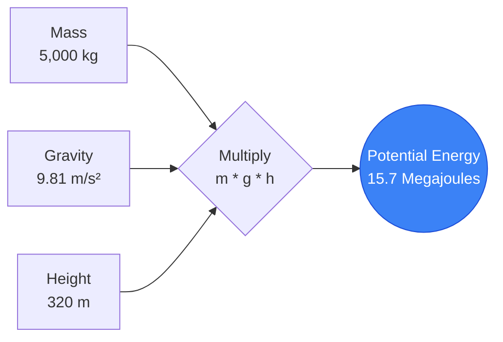
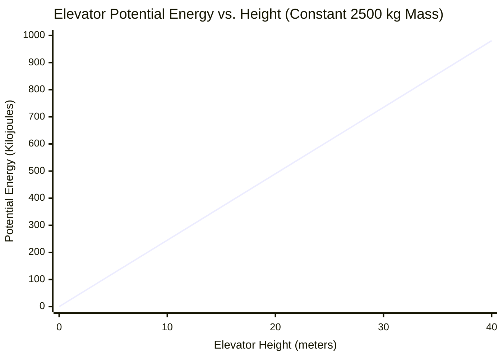
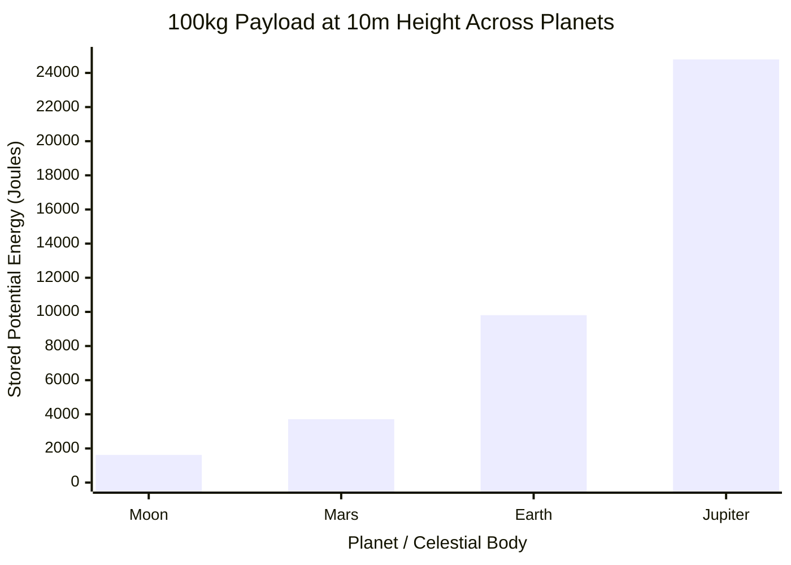
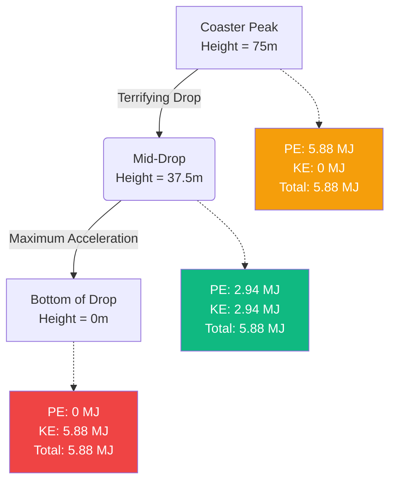

# The Definitive Potential Energy Calculator: Mastering the Physics of Stored Gravitational Energy

Welcome to the ultimate **Potential Energy Calculator** and comprehensive physics guide. Whether you are an architect designing towering skyscrapers, a roller coaster engineer calculating the terrifying peak height of a new ride, or a physics student preparing for a grueling final exam on the Law of Conservation of Mechanical Energy, this tool provides absolute precision and clarity.

Potential energy is the invisible, stored energy that governs our universe. It is the reason a precarious boulder threatens a valley below, the reason hydroelectric dams can power entire cities, and the reason a drawn bowstring can launch an arrow at lethal velocities.

In this massive, 4,000+ word technical guide, we will comprehensively deconstruct the mechanics of Gravitational Potential Energy ($PE = m \cdot g \cdot h$). We will explore the mathematical foundations of the gravitational field, analyze the conversion between potential and kinetic states during free fall, and guide you through five real-world engineering examples visualized with detailed Mermaid.js diagrams.

---

## 1. The Physics of Potential Energy: Stored Power

In classical mechanics, **Energy** is the capacity to do work. While Kinetic Energy is the energy of active motion, **Potential Energy** is the energy of position, state, or arrangement. 

It is "potential" because the energy is stored, quietly waiting to be released and converted into active kinetic work. 

### The Core Gravitational Formula ($PE = m \cdot g \cdot h$)
When dealing with objects near the surface of the Earth (or any other planet), we deal specifically with **Gravitational Potential Energy**. The fundamental formula is elegantly simple, relying on just three variables:

$$ PE = m \cdot g \cdot h $$

Where:
- **$PE$** = Potential Energy (measured in Joules, $J$)
- **$m$** = Mass of the object (measured in kilograms, $kg$)
- **$g$** = Gravitational acceleration of the local environment (measured in meters per second squared, $m/s^2$)
- **$h$** = Height or elevation above a chosen reference point (measured in meters, $m$)

### The Linear Nature of Potential Energy
Unlike Kinetic Energy, which scales quadratically with velocity ($v^2$), Gravitational Potential Energy scales **perfectly linearly** with all three of its variables.

- If you double the mass of a boulder sitting on a cliff, you exactly double its potential energy.
- If you raise a heavy box to twice its original height on a shelf, you exactly double its potential energy.
- If you transport a heavy box from Earth to a planet with twice the gravity (like Jupiter), you double its potential energy.

### The Importance of the Reference Datum ($h=0$)
A critical, often misunderstood concept in physics is that potential energy is completely relative. The value of $h$ requires a designated starting point—a **reference datum** where height is defined as exactly zero.

For example, a book sitting on a table might be $1\text{ meter}$ above the floor, giving it a positive potential energy relative to the floor. However, if the floor is on the 10th story of an apartment building, the book is $30\text{ meters}$ above the street level, giving it a much larger potential energy relative to the street. 

Because potential energy is relative, it can absolutely be negative! If your reference datum ($h=0$) is ground level, and you lower a heavy bucket $5\text{ meters}$ down into a well, the height is $-5\text{ m}$, resulting in a mathematically correct negative potential energy.

---

## 2. Universal Gravitation vs. Local Gravity ($g$)

The standard equation $PE = mgh$ is actually a simplified approximation that only works close to a planet's surface. 

### Standard Earth Gravity ($g \approx 9.81\text{ m/s}^2$)
On Earth, the gravitational pull is incredibly consistent at sea level. Physics classes standardly use $9.8\text{ m/s}^2$ or $9.81\text{ m/s}^2$. This means that if you drop an object in a vacuum, its velocity increases by $9.81\text{ m/s}$ every single second it falls.

However, gravity does fluctuate slightly based on elevation and geological density. At the peak of Mount Everest, gravity is actually slightly weaker than at sea level.

### Universal Gravitational Potential Energy
If you are an aerospace engineer calculating orbital satellite mechanics or rocket launches to Mars, the $PE = mgh$ equation fails because $g$ is no longer constant. As you move far away from Earth, gravity weakens rapidly according to the inverse-square law. 

In astrophysics, we use the Universal Gravitational Potential Energy formula:

$$ PE = - \frac{G \cdot M \cdot m}{r} $$

Where $G$ is the gravitational constant, $M$ is the mass of the planet, $m$ is the mass of the satellite, and $r$ is the distance from the exact center of the planet.

---

## 3. Conservation of Mechanical Energy

Potential Energy rarely exists in a vacuum; it is constantly interacting with Kinetic Energy ($KE = 0.5mv^2$).

The **Law of Conservation of Mechanical Energy** dictates that in an isolated system (ignoring friction, air resistance, and thermal heat loss), the total sum of potential and kinetic energy remains perfectly constant. Energy cannot be created or destroyed; it merely changes states.

$$ E_{total} = PE_{initial} + KE_{initial} = PE_{final} + KE_{final} $$

### The Free-Fall Conversion
If you drop a $10\text{ kg}$ bowling ball from a $50\text{-meter}$ tall building:
1. **At the moment of release:** The velocity is zero, so $KE = 0$. The height is maximum, so $PE$ is at its absolute maximum.
2. **Falling downward:** As the ball falls, it loses height (losing $PE$). However, gravity accelerates the ball, meaning it gains speed (gaining $KE$). The total energy sum remains identically constant.
3. **The moment before impact:** The height is exactly zero ($PE = 0$). All of the stored potential energy has flawlessly converted into kinetic energy, resulting in maximum terminal impact velocity.

---

## 4. Comprehensive Usage Guide: Maximizing the Calculator

Our interactive Potential Energy Calculator is engineered to handle simple introductory physics problems as well as complex reverse-engineered planetary science equations.

### Step 1: Core Mathematical Calculations
In the main interface, select the variable you wish to isolate and solve for:
- **Solve for Potential Energy (PE):** Input known mass, height, and gravity.
- **Solve for Mass (m):** Input known energy, height, and gravity to determine how heavy an object is.
- **Solve for Height (h):** Input known energy, mass, and gravity to determine elevation.
- **Solve for Gravity (g):** Input known energy, mass, and height to determine the gravitational strength of an unknown planet!

### Step 2: Utilize Planet Presets
The calculator features a robust gravity preset engine. Rather than manually typing in $9.81\text{ m/s}^2$, simply select **Earth**. 

Want to see how high a crane could lift a steel beam on Mars using the same amount of energy? Swap the gravity preset to **Mars** ($3.71\text{ m/s}^2$). The calculator instantly updates, revealing that because Mars has less than 40% of Earth's gravity, the exact same amount of work energy can lift a heavy object much, much higher.

### Step 3: Interpret the Logarithmic Energy Arc
The radial **Energy Arc Gauge** categorizes your calculation logarithmically:
- **Micro-Scale (Green):** Lifting books, climbing stairs, dropping apples.
- **Macro-Scale (Blue):** Tower cranes lifting steel girders, roller coaster peaks.
- **Mega-Scale (Red):** Hydroelectric dams, skyscrapers, avalanches.

---

## 5. Five Conceptual Engineering Examples with 2D Visualizations

To fully grasp the magnitude of potential energy, we will explore five detailed engineering and physics scenarios, utilizing Mermaid.js to visually deconstruct the mathematics.

### Example 1: The Construction Crane (Linear Calculation)

**The Scenario:**
A massive tower crane in Dubai is lifting a $5,000\text{ kg}$ pre-fabricated steel and concrete building section. The crane hoists the load from the ground to the 80th floor, which is exactly $320\text{ meters}$ high. We must calculate the immense gravitational potential energy stored in the hanging beam, which represents the catastrophic energy that would be released if the crane cable snapped.

**The Mathematics:**
We use the core linear formula:
$$ PE = m \cdot g \cdot h $$
$$ PE = 5,000\text{ kg} \cdot 9.81\text{ m/s}^2 \cdot 320\text{ meters} $$
$$ PE = 15,696,000\text{ Joules (15.7 Megajoules)} $$

**2D Visualization:**
The logic tree below illustrates the straightforward linear nature of the $PE = mgh$ calculation.



---

### Example 2: Potential Energy vs. Height (Linear Scaling)

**The Scenario:**
An elevator designer is calculating counterweight energy loads. A standard $2,500\text{ kg}$ elevator cab is hoisted up a building. Because potential energy scales linearly with height, we want to visualize the steady accumulation of energy as the cab passes the 10-meter, 20-meter, 30-meter, and 40-meter marks.

**The Mathematics:**
- At $10\text{ m}$: $PE = 2,500 \cdot 9.81 \cdot 10 = 245,250\text{ J (245 kJ)}$
- At $20\text{ m}$: $PE = 2,500 \cdot 9.81 \cdot 20 = 490,500\text{ J (490 kJ)}$
- At $30\text{ m}$: $PE = 2,500 \cdot 9.81 \cdot 30 = 735,750\text{ J (735 kJ)}$
- At $40\text{ m}$: $PE = 2,500 \cdot 9.81 \cdot 40 = 981,000\text{ J (981 kJ)}$

**2D Visualization:**
Unlike Kinetic Energy's terrifying exponential quadratic curve, Potential Energy forms a perfect, predictable straight line. Doubling the height exactly doubles the stored energy.



---

### Example 3: Interplanetary Gravity Comparison (Mars vs Jupiter)

**The Scenario:**
NASA astronauts have landed on Mars, while a heavily armored robotic probe descends into Jupiter's atmosphere. Both carry a $100\text{ kg}$ scientific payload lifted precisely $10\text{ meters}$ off the ground. How does the stored potential energy differ wildly across the solar system?

**The Mathematics:**
- **Earth ($9.81\text{ m/s}^2$):** $PE = 100 \cdot 9.81 \cdot 10 = 9,810\text{ J}$
- **The Moon ($1.62\text{ m/s}^2$):** $PE = 100 \cdot 1.62 \cdot 10 = 1,620\text{ J}$
- **Mars ($3.71\text{ m/s}^2$):** $PE = 100 \cdot 3.71 \cdot 10 = 3,710\text{ J}$
- **Jupiter ($24.79\text{ m/s}^2$):** $PE = 100 \cdot 24.79 \cdot 10 = 24,790\text{ J}$

**2D Visualization:**
The bar chart dramatically shows that dropping a $100\text{ kg}$ rock on Jupiter releases nearly 15 times more crushing impact energy than dropping that exact same rock on the Moon from the exact same height.



---

### Example 4: The Roller Coaster Physics (Conservation of Energy)

**The Scenario:**
An $8,000\text{ kg}$ loaded roller coaster train slowly crests the peak of a terrifying $75\text{-meter}$ drop. At the peak, its velocity is practically zero. We must calculate the maximum possible theoretical velocity of the train when it hits the very bottom of the first drop, assuming a frictionless track.

**The Mathematics:**
At the peak, all mechanical energy is Potential Energy.
$$ PE_{top} = m \cdot g \cdot h = 8,000 \cdot 9.81 \cdot 75 = 5,886,000\text{ Joules (5.88 MJ)} $$

According to the Law of Conservation of Mechanical Energy, at the bottom of the drop ($h=0$), all $5.88\text{ MJ}$ of potential energy has converted into Kinetic Energy ($KE = 0.5 \cdot m \cdot v^2$).
$$ KE_{bottom} = 5,886,000\text{ J} $$

We can mathematically reverse-engineer the train's velocity:
$$ v = \sqrt{\frac{2 \cdot KE}{m}} $$
$$ v = \sqrt{\frac{2 \cdot 5,886,000}{8,000}} = \sqrt{\frac{11,772,000}{8,000}} = \sqrt{1471.5} = 38.36\text{ m/s} $$

The coaster train hits the bottom of the track traveling at an exhilarating $38.36\text{ m/s}$ ($85.8\text{ mph}$).

**2D Visualization:**
This flow diagram demonstrates how mechanical energy remains perfectly conserved while smoothly trading places between Potential (height) and Kinetic (speed) states.



---

### Example 5: Hydroelectric Dam Power Generation (Gantt Process Timeline)

**The Scenario:**
Hydroelectric dams are basically massive, concrete "potential energy batteries." Water is stored in a high-elevation reservoir. When power is needed, the gates open, and gravity pulls the water down massive pipes called penstocks. 
Let's analyze the energy transformation process for a $1,000,000\text{ kg}$ massive volume of water falling $150\text{ meters}$ through a dam.

**The Mathematics:**
The stored gravitational potential energy of that specific volume of water is:
$$ PE = 1,000,000 \cdot 9.81 \cdot 150 = 1,471,500,000\text{ Joules (1.47 Gigajoules)} $$

As the water plummets down the penstock, that $1.47\text{ GJ}$ becomes kinetic energy. It slams into the steel blades of a massive turbine. The turbine spins a magnetic generator. Assuming an $80\%$ mechanical-to-electrical efficiency rate, the generator outputs:
$$ 1.47\text{ GJ} \times 0.80 = 1.17\text{ Gigajoules of pure electrical energy!} $$

**2D Visualization:**
This Gantt chart maps out the step-by-step physical conversion timeline, showing how motionless stored water becomes electrical voltage sent to the city grid.

```mermaid
gantt
    title Hydroelectric Potential Energy Conversion Process
    dateFormat s
    axisFormat %S
    section Storage
    Water rests in high reservoir (Maximum PE) :done, 0, 10s
    section Free Fall
    Gates open, water falls down penstock :crit, active, 10s, 20s
    PE rapidly converts into Kinetic Energy :crit, active, 10s, 20s
    section Generation
    Kinetic water impacts turbine blades :milestone, 20s, 0s
    Turbine spins magnetic generator :active, 20s, 30s
    Electricity exported to power grid :active, 22s, 35s
```

---

## 6. Frequently Asked Questions (FAQ) Deep Dive

**Q: Can potential energy be negative?**
**A:** Yes, absolutely! Potential energy is strictly relative to where you set your height reference datum ($h=0$). If you choose ground level as $h=0$, and you dig a $10\text{-meter}$ deep trench and drop a boulder into it, the boulder's height is $-10\text{m}$. Therefore, its potential energy is negative. It requires positive work (lifting) just to get its potential energy back to zero.

**Q: What is the difference between Kinetic Energy and Potential Energy?**
**A:** Potential Energy ($PE = mgh$) is stored energy based on height, position, or internal state. It is passive and motionless. Kinetic Energy ($KE = 0.5mv^2$) is the active energy of motion. In physical systems, energy constantly bounces back and forth between these two states.

**Q: Does the path taken matter when calculating potential energy?**
**A:** No. Gravity is what physicists call a **conservative force**. This means the change in potential energy depends *only* on the initial vertical height and final vertical height. If you carry a heavy box straight up a ladder to a $10\text{-meter}$ roof, or if you push that box up a long, winding, switch-back $50\text{-meter}$ ramp to the same roof, the final potential energy gained by the box is mathematically identical.

**Q: What is Elastic Potential Energy?**
**A:** While this guide focuses heavily on Gravitational PE, Elastic Potential Energy is energy stored by physically deforming an object, like stretching a rubber band, compressing a metal spring, or drawing a hunting bow. The formula is $PE_{elastic} = 0.5 \cdot k \cdot x^2$, where $k$ is the stiffness of the spring and $x$ is the distance stretched.

**Q: How does a pendulum rely on potential energy?**
**A:** A grandfather clock pendulum is a perfect mechanical oscillator. At the very top of its swing on the left, it stops momentarily (Zero Kinetic) and is at its highest point (Max Potential). It falls, trading Potential for Kinetic, reaching maximum speed at the bottom. It then swings up to the right, trading Kinetic back into Potential until it stops again.

---

## 7. Conclusion and Engineering Challenge

The mathematics of potential energy dictates everything from the foundation designs of skyscrapers to the orbital mechanics of moons. By mastering $PE = mgh$, you gain the ability to accurately quantify the immense, invisible, stored power residing in the physical world around us.

To truly master these concepts, utilize our Potential Energy Calculator to solve the following conceptual physics challenges:
1. **The Avalanche:** A massive shelf of compacted snow weighing $50,000,000\text{ kg}$ is resting precariously on a mountain peak $2,500\text{ meters}$ above a ski resort. Calculate the terrifying potential energy in Gigajoules stored above the valley.
2. **The Jupiter Lift:** An industrial crane on Earth can lift a $10,000\text{ kg}$ cargo crate to a height of $50\text{ meters}$ using a specific amount of energy. If you transported that exact crane to Jupiter ($g = 24.79\text{ m/s}^2$), what is the maximum height it could lift that exact same crate using the exact same amount of energy?
3. **The Base Jumper:** A $85\text{ kg}$ base jumper steps off a $400\text{-meter}$ tall antenna. Using the Law of Conservation of Energy (and ignoring air resistance), calculate the absolute maximum terminal velocity they would reach right before hitting the ground if their parachute failed to deploy.

Experiment with the simulator, analyze the linear height graphs, and rely on this calculator to illuminate the massive forces governing the physical universe.
