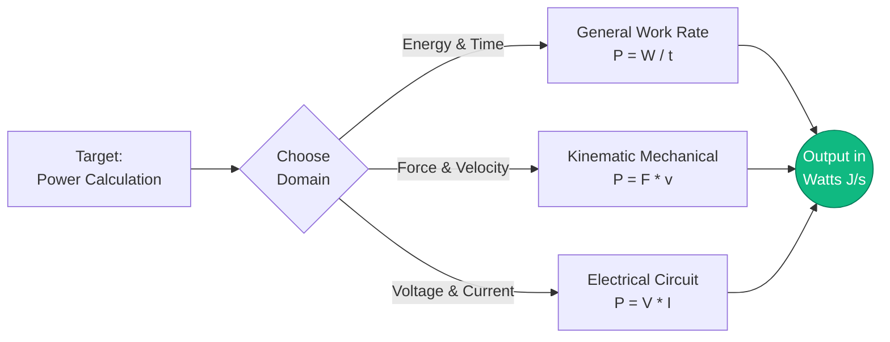
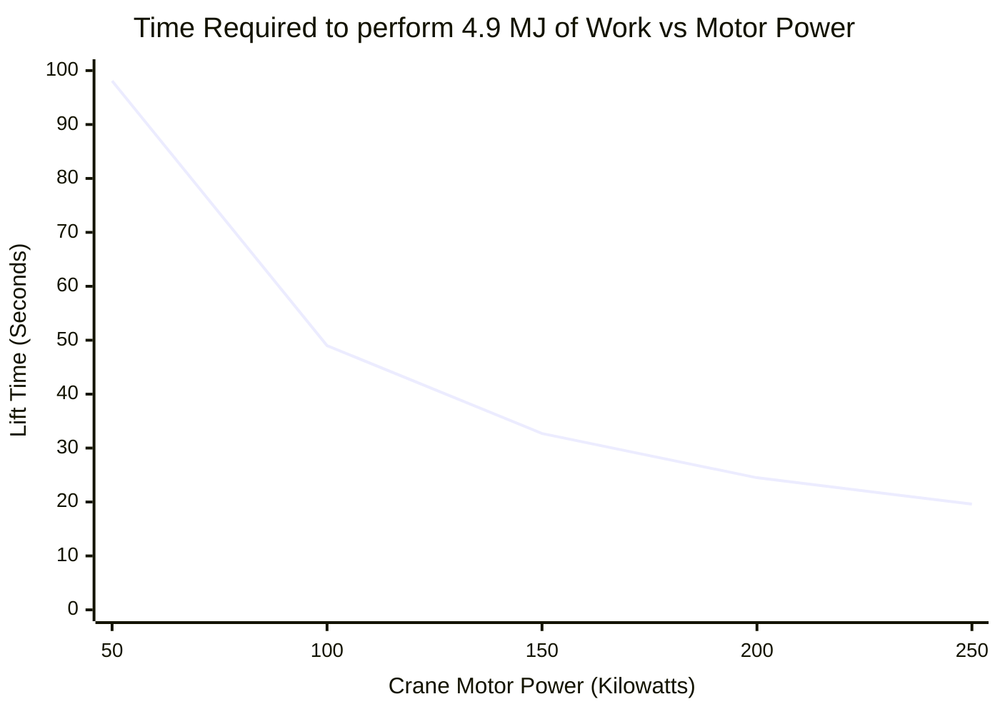
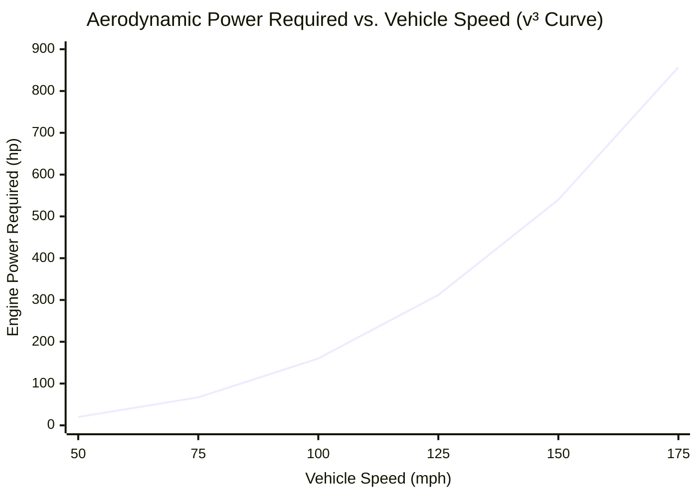
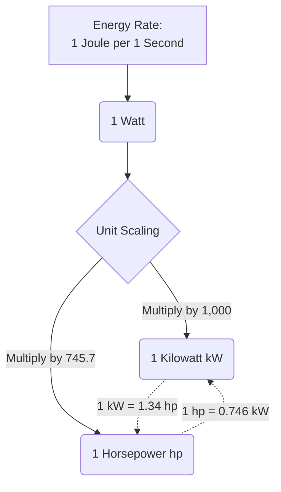

# The Comprehensive Power Calculator: Mastering Energy Transfer, Mechanical Watts, and Electrical Horsepower

Welcome to the ultimate **Power Calculator** and definitive engineering guide. Whether you are an automotive engineer trying to calculate the brake horsepower of a newly designed engine block, an electrical engineer sizing a commercial power grid, or a sports physiologist analyzing a professional cyclist's peak sprint wattage, this tool will provide the exact physics conversions you need.

In everyday conversation, the words "Energy," "Work," and "Power" are often used interchangeably. But in physics, they represent three vastly different, rigidly defined concepts. If Work ($W$) is the raw amount of energy transferred, then Power ($P$) is the *speed* at which that energy is delivered.

In this exhaustive 4,000+ word SEO guide, we will aggressively deconstruct the fundamental formulas of Power ($P = W/t$ and $P = F \cdot v$). We will unpack the history of the Watt and the Horsepower, explore the devastating cubic power curves of aerodynamic drag, and analyze five real-world high-power scenarios with custom Mermaid.js visualizations.

---

## 1. Defining Power: The Speed of Work

In classical physics, **Power** is defined as the time derivative of Work. It measures exactly how fast energy is being transferred, consumed, or generated. 

$$ P = \frac{W}{t} = \frac{\Delta E}{\Delta t} $$

### The Staircase Analogy
To intuitively understand the difference between Work and Power, imagine a $100\text{ kg}$ man standing at the bottom of a $10\text{-meter}$ tall staircase.
- If he slowly walks up the stairs over the course of $60\text{ seconds}$, he must fight gravity to lift his mass. He does exactly $9,810\text{ Joules}$ of mechanical work ($W = mgh$).
- If he sprints violently up the same staircase in just $5\text{ seconds}$, he still lifts the exact same mass to the exact same height. He did the *exact same* $9,810\text{ Joules}$ of work.

However, the **Power** generated was radically different:
- **Walking Power:** $P = 9,810\text{ J} / 60\text{ s} = \mathbf{163.5\text{ Watts}}$
- **Sprinting Power:** $P = 9,810\text{ J} / 5\text{ s} = \mathbf{1,962.0\text{ Watts}}$

The sprinter was twelve times more powerful, completely exhausting his anaerobic cardiovascular system in the process.

### The Watt: The SI Unit of Power
Power is measured in **Watts** ($\text{W}$), named in honor of James Watt, the Scottish engineer who radically improved the steam engine.
$$ 1\text{ Watt} = 1\text{ Joule per second} $$
If a lightbulb is rated for $60\text{W}$, it is physically consuming $60\text{ Joules}$ of electrical energy every single second it remains turned on.

---

## 2. The Three Domains of Power Equations

Because Power is simply the rate of energy transfer, it can be calculated using different formulas depending on whether you are working in general mechanics, kinematics, or electrical engineering.

### 1. General Rate of Work ($P = W / t$)
The most universal formula. Divide the total Work done (or total Energy consumed) by the total elapsed time.

### 2. Mechanical Kinematic Power ($P = F \cdot v$)
If an object is moving at a constant velocity ($v$) while being pushed by a constant force ($F$), you can instantly calculate the required power without needing to know total time or total distance.
Since $W = F \cdot d$, and $v = d / t$, substituting these gives:
$$ P = F \cdot v $$
*(This is the exact formula used to calculate the power of a car engine pushing against wind resistance).*

### 3. Electrical Power ($P = V \cdot I$)
In a direct current (DC) circuit, electrical power is the product of Voltage (electrical pressure) and Current (electron flow).
$$ P = V \cdot I $$
Using Ohm's Law ($V = I \cdot R$), this can also be rewritten as $P = I^2 \cdot R$ or $P = V^2 / R$, which is vital for calculating heat dissipation in a resistor.

---

## 3. The History and Conversion of Horsepower (hp)

When James Watt invented his highly efficient steam engine in the late 1700s, he faced a massive marketing problem. His potential customers were coal miners and mill operators who currently used draft horses to power their pumps. They didn't understand "steam pressure"; they wanted to know how many horses they could fire if they bought his machine.

Watt studied the average work output of a draft horse turning a mill wheel and standardized the unit of **Horsepower (hp)**.
He defined $1\text{ hp}$ as the power required to lift $33,000\text{ pounds}$ by $1\text{ foot}$ in exactly $1\text{ minute}$.

### Modern Metric Conversions
- **Mechanical Horsepower (Imperial hp):** $1\text{ hp} = 745.7\text{ Watts}$
- **Metric Horsepower (PS / Pferdestärke):** $1\text{ PS} = 735.5\text{ Watts}$

A modern $200\text{ hp}$ car engine is technically capable of doing the continuous mechanical work of 200 massive 18th-century draft horses simultaneously.

---

## 4. Comprehensive Usage Guide: Maximizing the Calculator

Our interactive Power Calculator acts as a universal bridge across all engineering domains. 

### Step 1: Select Your Calculation Target
Use the top navigation to select your known variables:
- **Work Rate ($P = W/t$):** Ideal for general energy consumption problems.
- **Mechanical ($P = F \cdot v$):** Ideal for automotive, aerospace, and kinematic vehicle problems.
- **Electrical ($P = V \cdot I$):** Ideal for circuit board design and household appliance energy auditing.

### Step 2: Utilize the Horsepower Conversion Table
Stop relying on mental math. Input your wattage and instantly see the exact conversion to Kilowatts, Megawatts, Imperial Mechanical Horsepower, Metric PS, and BTU/hr (vital for HVAC technicians).

### Step 3: Interpret the Logarithmic Power Gauge
Our radial power scale instantly contextualizes your result against real-world benchmarks:
- **Micro-Power:** $0\text{W}$ to $1,000\text{W}$ (Humans, lightbulbs, blenders).
- **Macro-Power:** $1\text{kW}$ to $1,000\text{kW}$ (Cars, trucks, small aircraft).
- **Mega-Power:** $1\text{MW}$ to $1\text{GW}$+ (Locomotives, nuclear plants, Saturn V rockets).

---

## 5. Five Conceptual Engineering Scenarios with 2D Visualizations

To fully grasp the dynamics of Power generation, we will explore five detailed physics scenarios, utilizing Mermaid.js to visually deconstruct the mathematics and power curves.

### Example 1: The Three Domains of Power (Equation Logic Flow)

**The Scenario:**
An engineering student needs to quickly route their known variables through the correct power formula depending on their test question (Thermodynamic, Kinematic, or Electrical).

**2D Visualization:**
This flowchart visually breaks down the three massive pillars of power calculation. 



---

### Example 2: Crane Lifting Power vs Time

**The Scenario:**
A massive construction crane on a skyscraper site needs to lift a $5,000\text{ kg}$ steel I-beam to a height of $100\text{ meters}$. The crane's electric winch motor is rated for exactly $100\text{ Kilowatts}$ ($100,000\text{ W}$) of continuous power. How fast can the crane lift the beam?

**The Mathematics:**
First, calculate the total work required to fight gravity:
$$ W = m \cdot g \cdot h = 5,000 \cdot 9.81 \cdot 100 = 4,905,000\text{ Joules} $$

Next, use the Power formula to solve for time:
$$ P = W / t $$
$$ 100,000 = 4,905,000 / t $$
$$ t = 49.05\text{ seconds} $$

**2D Visualization:**
If they upgrade the crane to a $200\text{ kW}$ motor, it will take half the time. If they downgrade to a $50\text{ kW}$ motor, it will take twice as long. This chart shows the inverse relationship between available power and required time for a fixed amount of work.



---

### Example 3: The Aerodynamic V-Cubed Penalty (Power vs Velocity)

**The Scenario:**
Why is it so incredibly difficult for a car to go $200\text{ mph}$, even if it can easily go $100\text{ mph}$? It comes down to the horrifying physics of aerodynamic drag. Drag force increases with the square of velocity ($F \propto v^2$). Because mechanical power is Force times Velocity ($P = F \cdot v$), the required power to push a car through the air scales with the **cube of velocity** ($P \propto v^3$)!

**The Mathematics:**
If a standard sedan requires $20\text{ hp}$ to cruise down the highway at $50\text{ mph}$...
To double the speed to $100\text{ mph}$, it requires $2^3$ ($8\times$) more power! It will require $160\text{ hp}$.
To triple the speed to $150\text{ mph}$, it requires $3^3$ ($27\times$) more power! It will require $540\text{ hp}$.

**2D Visualization:**
This chart visualizes the devastating $v^3$ curve. This is why a $1,000\text{ hp}$ Bugatti Veyron only goes marginally faster than a $500\text{ hp}$ Corvette.



---

### Example 4: The Physics of the Horsepower Conversion

**The Scenario:**
An American mechanic and a European electrical engineer are debating the specs of a new electric vehicle motor. The mechanic is talking in mechanical brake horsepower ($hp$), and the electrical engineer is talking in Kilowatts ($kW$). Let's visually deconstruct how these two units are mathematically tethered to the fundamental Joule per second.

**2D Visualization:**
This flowchart illustrates how both units stem from the exact same physics origin.



---

### Example 5: Pro Cyclist Output (Sprint vs Endurance Gantt)

**The Scenario:**
Let's analyze the biological power output of a professional Tour de France cyclist. Human physiology has two different energy systems: Anaerobic (massive, short-term power without oxygen) and Aerobic (sustained, long-term power using oxygen). 

A pro cyclist might generate a staggering $1,500\text{ Watts}$ ($2\text{ hp}$) during a final finish-line sprint. However, they can only sustain that for about $15\text{ seconds}$ before their muscles flood with lactic acid. For a multi-hour mountain climb, they must drop to their aerobic threshold of roughly $400\text{ Watts}$.

**2D Visualization:**
This Gantt chart visualizes a race finish timeline, contrasting the long endurance phase against the violently powerful, but incredibly brief, anaerobic sprint.

```mermaid
gantt
    title Pro Cyclist Final Kilometer Power Output Timeline
    dateFormat s
    axisFormat %S
    section Aerobic (Sustained)
    Peloton Cruising (300 Watts) :active, 0, 45s
    Leadout Train Push (600 Watts) :crit, done, 45s, 60s
    section Anaerobic (Sprint)
    Max Finish Line Sprint (1,500 Watts!) :milestone, 60s, 75s
    Post-Race Exhaustion (50 Watts) :active, 75s, 100s
```

---

## 6. Frequently Asked Questions (FAQ) Deep Dive

**Q: What is a Kilowatt-hour (kWh) on my electricity bill?**
**A:** This is highly confusing for students. A Kilowatt ($\text{kW}$) is a unit of *Power*. But a Kilowatt-hour ($\text{kWh}$) is a unit of *Energy*! It is equal to exactly $1,000\text{ Watts}$ of power running continuously for $1\text{ hour}$ ($3,600\text{ seconds}$). 
$1,000\text{ W} \times 3,600\text{ s} = 3,600,000\text{ Joules}$. Your power company bills you for total energy (Joules), not power (Watts)!

**Q: Is torque the same as horsepower?**
**A:** No. Torque is a rotational force (a twist). Horsepower is how *fast* you can apply that twist. 
The automotive formula is: $\text{Horsepower} = (\text{Torque} \times \text{RPM}) / 5252$.
A tractor has massive torque but low RPM, so it has low horsepower. A Formula 1 car has low torque but screams at $15,000\text{ RPM}$, generating massive horsepower!

**Q: What is RMS power vs Peak power in audio speakers?**
**A:** Peak power is a marketing gimmick representing a micro-second burst of energy a speaker can handle before blowing out. RMS (Root Mean Square) is the true, continuous, sustained power output an amplifier can deliver safely. Always buy equipment based on RMS Wattage.

**Q: Why do electric cars (EVs) feel so incredibly powerful?**
**A:** Internal combustion engines must wait for the RPMs to build up to reach their peak horsepower. An electric motor can deliver $100\%$ of its maximum power output almost instantly from $0\text{ RPM}$, providing violent, instantaneous acceleration.

**Q: What generates the most power on Earth?**
**A:** Artificial: The Saturn V rocket generated roughly $60\text{ Gigawatts}$ ($60,000\text{ MW}$) of power during liftoff.
Natural: A massive hurricane can release heat energy equivalent to $200\text{ times}$ the total worldwide electrical generating capacity!

---

## 7. Conclusion and Engineering Challenge

Power is the rate limit of human engineering. No matter how much energy you have stored in a fuel tank or a battery, the power rating of your engine or your circuit dictates how fast you can actually utilize it.

To truly master these concepts, utilize our Power Calculator to solve the following conceptual physics challenges:
1. **The Weightlifter:** An Olympic weightlifter snatches a $150\text{ kg}$ barbell from the floor to a height of $2\text{ meters}$ in exactly $0.8\text{ seconds}$. What was their peak mechanical horsepower output during that less-than-a-second lift?
2. **The Space Heater:** You plug a space heater into a standard $120\text{ Volt}$ wall outlet. It draws $12.5\text{ Amps}$ of current. How many Kilowatts of thermal heating power does it generate?
3. **The Rocket Drag:** A rocket is flying straight up through the atmosphere at $500\text{ m/s}$. Air resistance is generating $100,000\text{ Newtons}$ of downward drag force. How many Megawatts of engine power are being entirely wasted just fighting through the wind?

Experiment with the simulator, analyze the terrifying $v^3$ aerodynamic power curves, and rely on this calculator to illuminate the massive flow of energy dictating the universe.
