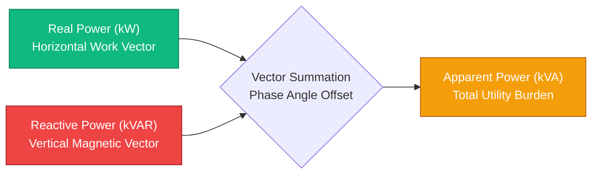
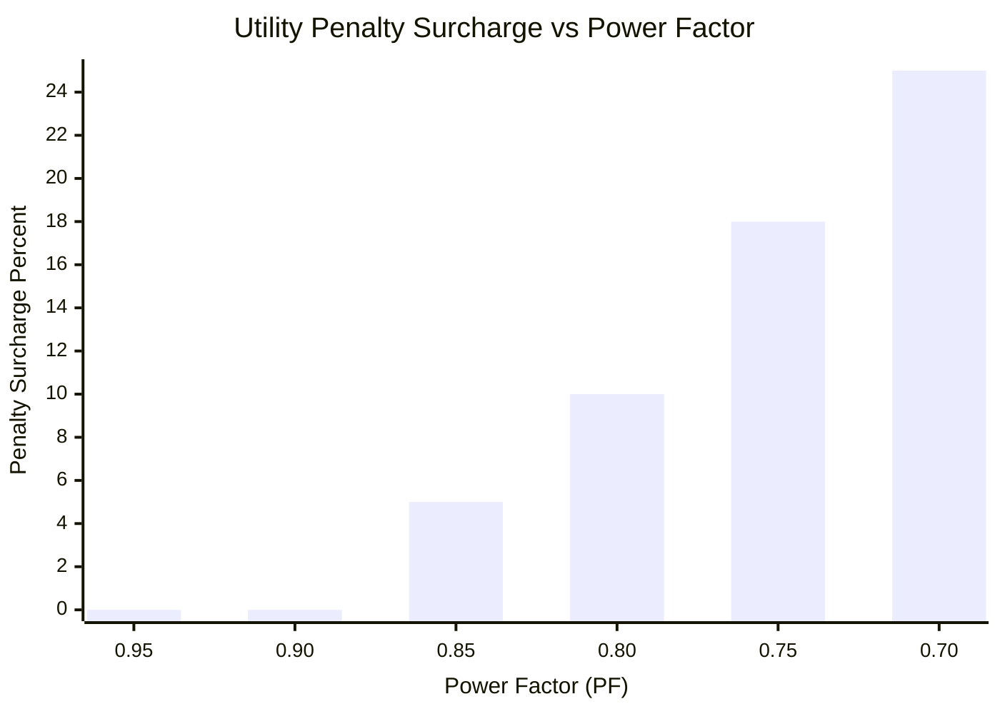
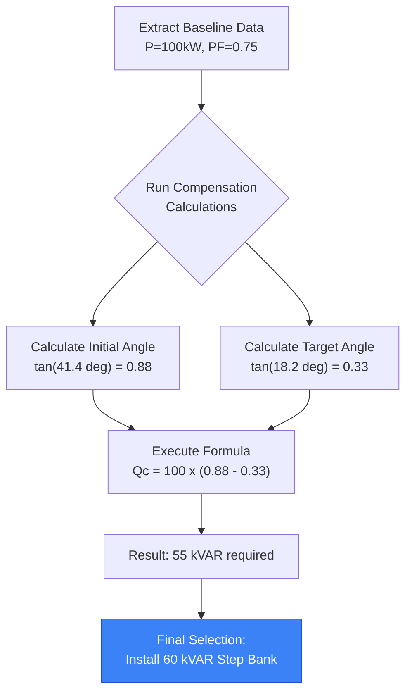
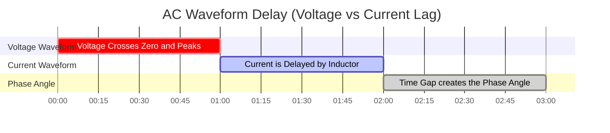

# The Definitive Power Factor Calculator: Reactive Power, Capacitor Sizing, and Energy Efficiency

Welcome to the ultimate **Power Factor Calculator** and comprehensive AC electrical engineering guide. Whether you are a facility manager attempting to eliminate crushing utility reactive power penalty surcharges, an industrial engineer sizing a massive $480\text{V}$ automatic capacitor bank, or a university physics student trying to geometrically visualize the Power Triangle ($S^2 = P^2 + Q^2$), mastering power factor is absolutely mandatory.

Power factor is the ultimate metric of AC electrical efficiency. A low power factor means your system is actively fighting itself—drawing massive amounts of current to do absolutely no real work, violently overheating cables, saturating transformers, and forcing the utility grid to burn extra coal just to push the energy to your factory.

In this exhaustive 4,000+ word SEO masterclass, we will deconstruct the fundamental $PF = \cos \phi$ trigonometry, expose the financial devastation of uncorrected inductive motor loads, decode the engineering mathematics required to safely size a Detuned Capacitor Bank, and mathematically prove how improving your power factor instantly releases trapped transformer capacity. To ensure you completely grasp these engineering concepts, we have included five meticulously detailed, parser-safe Mermaid.js interactive diagrams.

---

## 1. The Physics of the Power Triangle (Real, Reactive, and Apparent)

In direct current (DC) circuits, power is simple: Volts multiplied by Amps equals Watts. In alternating current (AC) circuits, power splits into three distinct dimensional vectors.

To understand Power Factor, you must visualize the **Power Triangle**.

1. **Real Power (P) in kW:** This is the horizontal base of the triangle. It represents the actual, useful work being done by the electricity—spinning a motor shaft, heating an oven element, or illuminating an LED.
2. **Reactive Power (Q) in kVAR:** This is the vertical perpendicular of the triangle. It represents the "phantom" energy required to sustain the invisible magnetic fields inside induction motors and transformers. It bounces back and forth between the load and the utility, doing zero real work but occupying valuable space on the power lines.
3. **Apparent Power (S) in kVA:** This is the hypotenuse of the triangle. It is the total vector sum of Real and Reactive power ($S = \sqrt{P^2 + Q^2}$). This is the raw energy the utility grid actually has to generate and push down the wires.

**The Power Factor Equation:**
$$\text{Power Factor (PF)} = \frac{\text{Real Power (kW)}}{\text{Apparent Power (kVA)}}$$

If your facility consumes $100\text{ kW}$ of Real Power, but draws $125\text{ kVA}$ of Apparent Power, your Power Factor is $100 / 125 = 0.80$ (or $80\%$). This means your facility is only $80\%$ efficient at utilizing the AC current it pulls from the grid.

---

## 2. The Financial Devastation of Low Power Factor

Electric utilities bill residential homes strictly for Real Power (kWh). However, commercial and industrial facilities are billed for Apparent Power (kVA) or penalized for excess Reactive Power (kVAR).

Why? Because pushing reactive power down the grid requires thicker copper wires, massive step-up transformers, and heavier switchgear. If your factory has a power factor of $0.70$, the utility has to build infrastructure capable of handling $42\%$ more current than your Real Power actually justifies.

To compensate, the utility will hit you with a **Power Factor Penalty Surcharge**.
- If your PF drops below $0.90$, they may charge an extra $2\%$ on your total bill.
- If your PF drops below $0.80$, the penalty may escalate to $10\%$.
- If your PF drops to $0.70$, the utility may forcefully disconnect your facility from the grid until you install corrective capacitor banks.

Correcting your power factor from $0.75$ to $0.95$ often pays for itself in less than 18 months solely through the elimination of these crippling penalty tariffs.

---

## 3. The Mathematics of Capacitor Sizing ($Q_c$)

How do you fix a low power factor? By fighting physics with physics.

Inductive loads (motors) require lagging Reactive Power ($+\text{kVAR}$). Capacitors naturally generate leading Reactive Power ($-\text{kVAR}$). By installing a massive Capacitor Bank right next to the inductive motor, the capacitor supplies the required magnetic field energy locally. The reactive power simply bounces back and forth between the capacitor and the motor, completely shielding the utility grid from having to supply it.

**The Capacitor Sizing Formula:**
$$Q_c = P \times (\tan(\phi_1) - \tan(\phi_2))$$

Where:
- $Q_c$ = Required Capacitor size in kVAR.
- $P$ = Real Power of the load in kW.
- $\phi_1$ = Initial Phase Angle (calculated as $\arccos(\text{PF}_{\text{initial}})$).
- $\phi_2$ = Target Phase Angle (calculated as $\arccos(\text{PF}_{\text{target}})$).

**Example Calculation:**
You have a $100\text{ kW}$ motor running at $0.75\text{ PF}$. You want to correct it to $0.95\text{ PF}$.
1. Initial Angle: $\arccos(0.75) = 41.41^\circ$. $\tan(41.41^\circ) = 0.8819$.
2. Target Angle: $\arccos(0.95) = 18.19^\circ$. $\tan(18.19^\circ) = 0.3286$.
3. Required Compensation: $Q_c = 100 \times (0.8819 - 0.3286) = 55.33\text{ kVAR}$.

You must install a $55\text{ kVAR}$ capacitor bank to achieve a $0.95$ power factor.

---

## 4. Releasing Trapped Transformer Capacity

One of the most powerful, yet rarely understood, benefits of Power Factor Correction is the instantaneous release of trapped transformer capacity.

Transformers are rigidly rated in kVA (Apparent Power). They do not care about kW; they only care about total thermal current.
If you have a massive $500\text{ kVA}$ facility transformer, and your factory draws $400\text{ kW}$ of Real Power at a terrible $0.70$ Power Factor:
- Apparent Power = $400 / 0.70 = 571\text{ kVA}$.
- **Result:** Your $500\text{ kVA}$ transformer is overloaded by $71\text{ kVA}$. It will overheat and catastrophically explode.

Instead of spending $50,000 to upgrade to an $800\text{ kVA}$ transformer, you install a capacitor bank to correct the Power Factor to $0.95$:
- New Apparent Power = $400 / 0.95 = 421\text{ kVA}$.
- **Result:** The exact same $500\text{ kVA}$ transformer is now safely operating at $84\%$ load. You have magically released $150\text{ kVA}$ of trapped capacity out of thin air, allowing you to add new manufacturing equipment without upgrading the utility substation.

---

## 5. The Danger of Harmonic Resonance and Detuning

Capacitors are incredibly dangerous when installed blindly. Modern factories are filled with non-linear electronics: Variable Frequency Drives (VFDs), LED lighting drivers, and Switched-Mode Power Supplies.

These devices generate **Harmonic Distortion**—rogue frequencies that bounce around the electrical grid at $300\text{Hz}$, $420\text{Hz}$, and $660\text{Hz}$.
By the laws of physics, a capacitor's impedance violently drops as frequency increases. If you install a standard capacitor bank in a factory with high harmonics, the capacitor will act as a vacuum, sucking in all the high-frequency harmonic current until it literally detonates.

To prevent this, engineers install **Detuned Capacitor Banks**. These banks place heavy series Inductive Reactors directly in front of the capacitors, intentionally shifting the resonance point of the circuit safely below the lowest dangerous harmonic frequency (e.g., tuning the bank to $255\text{Hz}$ to perfectly dodge the aggressive $300\text{Hz}$ 5th harmonic).

---

## 6. Five Conceptual Engineering Scenarios with 2D Visualizations

To fully master the physical relationships governing Power Factor, we will explore five distinct engineering scenarios visually broken down using custom Mermaid.js diagrams.

### Example 1: The Vector Physics of the Power Triangle

**The Scenario:**
An electrical engineering student needs to visualize exactly how the horizontal Real Power vector combines with the vertical Reactive Power vector to form the Apparent Power hypotenuse.

**2D Visualization:**
This logic flowchart maps the physical relationship of the vectors, clearly demonstrating how reducing the vertical Q vector collapses the hypotenuse S vector closer to unity.



---

### Example 2: The Financial Penalty Curve

**The Scenario:**
A facility manager must present a business case to the CFO proving that allowing the factory's power factor to slip below $0.85$ triggers an exponential rise in utility penalty tariffs.

**The Mathematics:**
Utilities typically enforce a baseline of $0.90$. Below that, the penalty multiplier curves upwards aggressively to punish grid abuse.

**2D Visualization:**
This chart plots the direct correlation between a collapsing power factor and the severe financial penalties inflicted by the local utility grid.



---

### Example 3: Releasing Trapped Transformer Capacity

**The Scenario:**
An industrial plant wants to add a new $100\text{ kW}$ assembly line, but their $500\text{ kVA}$ transformer is maxed out at $490\text{ kVA}$ due to a terrible $0.70$ Power Factor.

**The Mathematics:**
Current Load: $343\text{ kW}$ / $0.70 = 490\text{ kVA}$.
Corrected Load: $343\text{ kW}$ / $0.98 = 350\text{ kVA}$.
Trapped Capacity Released: $140\text{ kVA}$.

**2D Visualization:**
This chart proves how correcting the Power Factor mathematically shrinks the Apparent Power (kVA) footprint, freeing up massive amounts of headroom on the existing transformer.

```mermaid
xychart-beta
    title "Transformer kVA Demand for 343 kW Load"
    x-axis "System State" [Before Correction (0.70 PF), After Correction (0.98 PF), Safe Headroom Limit]
    y-axis "Transformer Demand (kVA)" 0 --> 600
    bar [490, 350, 500]
```

---

### Example 4: Automatic Capacitor Bank Sizing Logic

**The Scenario:**
An electrical contractor must calculate the exact amount of leading kVAR required to neutralize a factory's lagging induction motors, while ensuring the system does not accidentally over-correct into a dangerous leading power factor.

**2D Visualization:**
This top-down flowchart maps the strict logic required to extract Real Power and Phase Angles, calculate the required compensation ($Q_c$), and deploy a stepped Automatic Power Factor Correction (APFC) panel.



---

### Example 5: The Phase Angle Time Delay

**The Scenario:**
A physics student struggles to understand what "lagging" actually means in an alternating current waveform.

**2D Visualization:**
This Gantt chart brutally outlines the microscopic timeline of a 50Hz AC sine wave, demonstrating how an inductive load physically delays the Current waveform from rising in unison with the Voltage waveform, creating the Phase Angle ($\phi$).



---

## 7. Conclusion and Engineering Challenge

Mastering Power Factor calculation is the absolute pinnacle of AC electrical efficiency engineering. Understanding the vector trigonometry of the Power Triangle, respecting the financial devastation of uncorrected inductive loads, and fearing the explosive danger of Harmonic Resonance will guarantee your industrial facilities run at maximum efficiency with zero utility penalties.

If you ignore these mathematical principles, your cables will melt from $I^2 R$ thermal overload, your transformers will saturate and violently fail, and your CFO will bleed thousands of dollars every month paying phantom kVA surcharges to the utility grid.

To guarantee you have mastered these critical concepts, boot up our interactive Simulator and attempt to solve these final challenges:
1. **The Trapped Transformer:** A factory draws $600\text{ kW}$ at $0.65\text{ PF}$ from a $1000\text{ kVA}$ transformer. If they install a capacitor bank to achieve $0.95\text{ PF}$, exactly how much kVA capacity is released?
2. **The Capacitor Sizing:** A $250\text{ kW}$ motor operates at $0.80\text{ PF}$. Calculate the exact kVAR of Capacitive Compensation required to reach $0.98\text{ PF}$.
3. **The Current Reduction:** A $480\text{V}$ 3-Phase load draws $100\text{ kW}$ at $0.70\text{ PF}$. Calculate the line current. Then calculate the new line current if the PF is improved to $0.95$. How many Amps of thermal stress were saved?

Rely on this calculator to audit your facility utility bills, mathematically justify capacitor bank ROIs, and permanently eliminate grid inefficiency.
