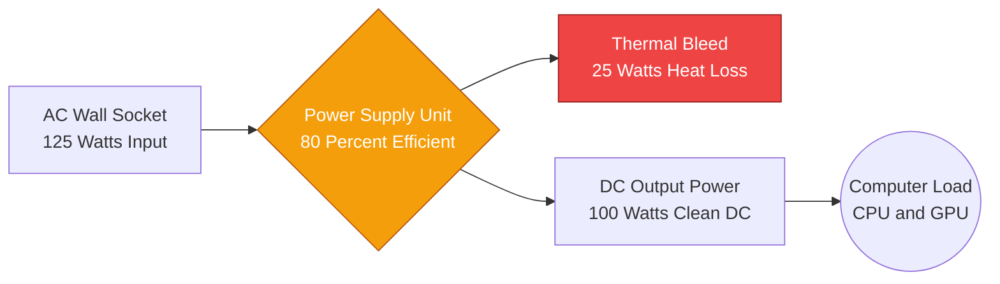
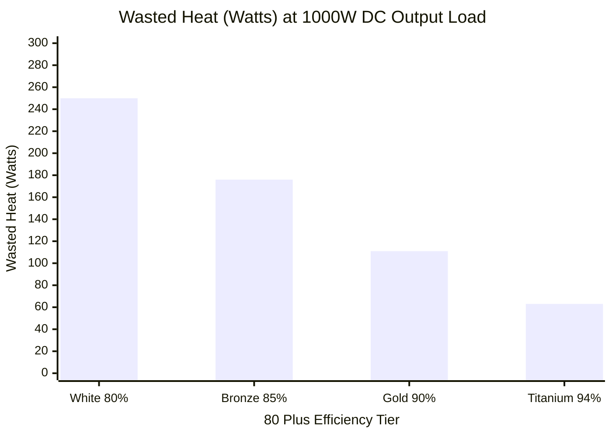
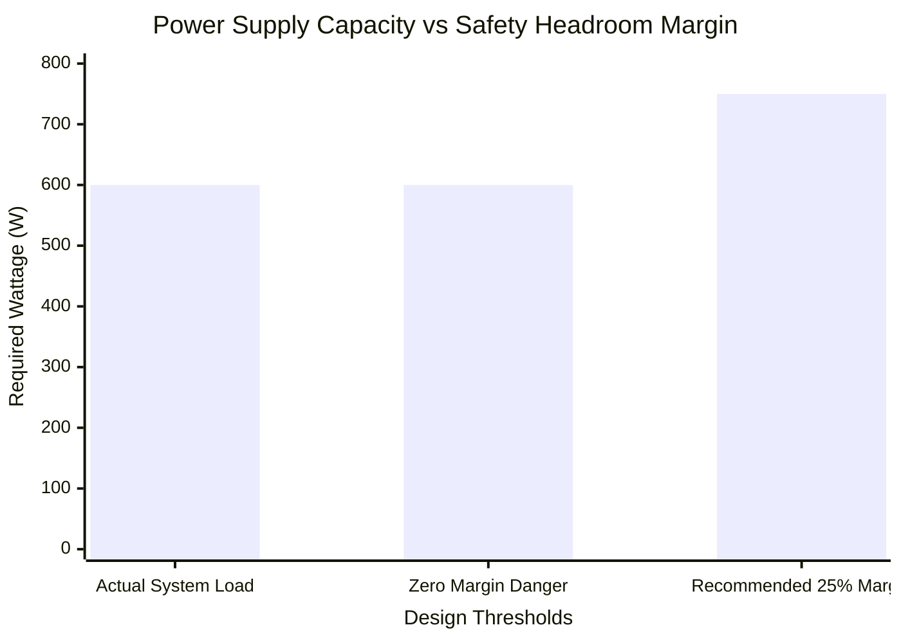
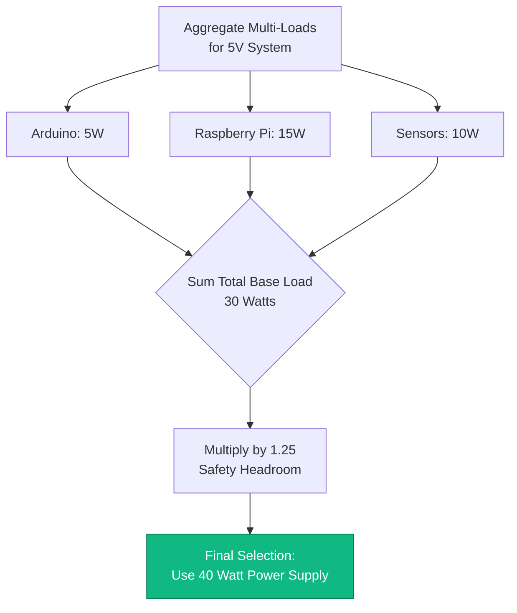
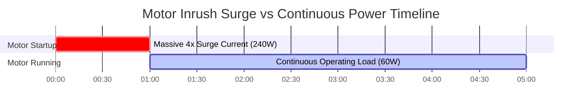

# The Definitive Power Supply Calculator: Wattage, Headroom, and System Efficiency

Welcome to the ultimate **Power Supply Calculator** and comprehensive electrical load management guide. Whether you are an IT systems integrator designing a massive dual-PSU server chassis, a hardcore PC builder trying to mathematically tame the transient power spikes of an RTX 4090, or an industrial automation engineer sizing a $24\text{V}$ DIN-rail supply for an array of hungry DC motors, mastering power supply physics is non-negotiable.

A Power Supply Unit (PSU) is the beating heart of every electronic system. If you under-size it, your equipment will violently crash, brownout, or trigger thermal shutdown. If you ignore its efficiency curve, you will waste thousands of dollars converting AC mains power into useless, damaging heat.

In this exhaustive 4,000+ word SEO masterclass, we will deconstruct the fundamental $P = V \times I$ power equation, expose the critical engineering necessity of the 25% Safety Headroom margin, decode the financial realities of 80 Plus Efficiency standards, and analyze the terrifying physics of motor inrush surge currents. To ensure you completely grasp these engineering concepts, we have included five meticulously detailed, parser-safe Mermaid.js interactive diagrams.

---

## 1. The Physics of the Power Supply Pipeline

A modern Switched-Mode Power Supply (SMPS) performs a violent electrical conversion. It intakes high-voltage Alternating Current (AC) from the wall, rectifies it, chops it into high-frequency pulses, steps it down via a transformer, and filters it into perfectly smooth Direct Current (DC).

**The Base Power Equation:**
$$P_{\text{load}} = V \times I$$
*(Power in Watts = Voltage in Volts $\times$ Current in Amps).*

If you have a $12\text{V}$ CCTV camera that draws $2\text{ Amps}$, it requires exactly $24\text{ Watts}$ of power to function.

But the power supply itself is not perfect. Due to internal electrical resistance, switching losses, and transformer inefficiencies, the power supply must draw **more** power from the wall than it delivers to the camera. This wasted power is dissipated as thermal heat.

---

## 2. The 25% Safety Headroom Rule

The most common mistake amateur engineers make is sizing a power supply exactly to the total load.
If your combined system load is $400\text{ Watts}$, and you buy a $400\text{W}$ power supply, you have engineered a system doomed to fail.

Running a power supply at 100% capacity is identical to driving a car at 100% of its top speed constantly. The internal capacitors will boil, the cooling fan will scream at maximum RPM, and the silicon components will thermally degrade, slashing the lifespan of the unit from 10 years down to 2 years.

**The Recommended Engineering Standard:**
$$P_{\text{recommended}} = P_{\text{total load}} \times 1.25$$

You must *always* add a minimum **25% Safety Headroom Margin**.
If your system load is $400\text{W}$: $400 \times 1.25 = 500\text{W}$. You must purchase a $500\text{W}$ power supply. 

This headroom provides three critical benefits:
1. **Thermal Lifespan:** The PSU operates cooler and quieter.
2. **Transient Spikes:** It provides reserve capacity to absorb the sudden micro-second power spikes generated by modern GPUs and CPUs switching states.
3. **Efficiency Sweet Spot:** Power supplies are mathematically most efficient when operating between 50% and 80% of their total capacity.

---

## 3. The Mathematics of Efficiency (The 80 Plus Standard)

Because power conversion generates heat, the electronics industry created the **80 Plus Certification** to grade power supply efficiency. 

An "80 Plus Bronze" unit guarantees $85\%$ efficiency at $50\%$ load.
An "80 Plus Titanium" unit guarantees $94\%$ efficiency at $50\%$ load.

**The Input Power Equation:**
$$P_{\text{input}} = \frac{P_{\text{load}}}{\text{Efficiency \%}}$$

**Example: A 500W load running on an 80% efficient PSU vs a 94% Titanium PSU.**
- **80% Efficient PSU:** $500 / 0.80 = 625\text{W}$ pulled from the wall. ($125\text{W}$ wasted as heat).
- **94% Efficient PSU:** $500 / 0.94 = 531\text{W}$ pulled from the wall. ($31\text{W}$ wasted as heat).

In a 24/7 server environment, that $94\text{W}$ difference in wasted heat will save the facility hundreds of dollars in both direct electrical costs and indirect air-conditioning costs required to cool the server room.

---

## 4. The Danger of Inrush Current (Surge Multipliers)

Certain electrical components, particularly DC motors, water pumps, and heavy fans, do not obey basic power laws when they first turn on.

When a motor is at a dead stop, it generates zero Back-Electromotive Force (Back-EMF). In the first few milliseconds of startup, the motor acts almost like a dead short circuit, pulling massive amounts of current to break the physical inertia of the rotor.

This is known as **Inrush Current** or Surge Power.
- A $12\text{V}$, $2\text{A}$ ($24\text{W}$) DC motor may pull $8\text{A}$ ($96\text{W}$) for half a second during startup.
- A standard power supply engineered strictly for $24\text{W}$ will instantly trip its Over-Current Protection (OCP) and shut down.

*Engineering Rule:* When sizing a power supply for motors or pumps, you must multiply the continuous load by a surge factor of $3.0\times$ to $4.0\times$ to guarantee the power supply can survive the startup transient.

---

## 5. PC and Server Power Architectures

Modern ATX computer power supplies are highly specialized. While they output $3.3\text{V}$, $5\text{V}$, and $12\text{V}$, the vast majority of modern PC components (the CPU and the GPU) draw their power exclusively from the $12\text{V}$ rail.

When sizing a PC power supply, you must ensure that the specific $12\text{V}$ rail capacity is large enough to handle the combined TDP (Thermal Design Power) of your processors, plus the massive transient spikes (which can hit $2.5\times$ nominal power for a few microseconds).

In enterprise servers, engineers use **N+1 Redundancy**. If a server requires $800\text{W}$ of power, it is equipped with two $800\text{W}$ power supplies. They load-share $400\text{W}$ each. If one PSU explodes, the other instantly ramps up to 100% capacity ($800\text{W}$), preventing the server from crashing.

---

## 6. Five Conceptual Engineering Scenarios with 2D Visualizations

To fully master the physical relationships governing power supply sizing, we will explore five distinct engineering scenarios visually broken down using custom Mermaid.js diagrams.

### Example 1: The Power Supply Conversion Pipeline

**The Scenario:**
An IT student needs to visualize how a power supply takes raw AC energy from the wall, suffers thermal losses, and delivers usable DC energy to the motherboard.

**2D Visualization:**
This logic flowchart maps the physical path of energy flowing through an SMPS, explicitly showing the efficiency bleed where electrical energy is lost as heat.

---

### Example 2: The 80 Plus Efficiency Heat Loss Comparison

**The Scenario:**
A data center manager must decide whether to pay a premium for 80 Plus Titanium power supplies or stick with cheap 80 Plus White units for a massive server array drawing $1000\text{W}$.

**The Mathematics:**
At $1000\text{W}$ of output, an 80% efficient PSU wastes $250\text{W}$ of heat. A 94% efficient PSU wastes only $63\text{W}$ of heat.

**2D Visualization:**
This bar chart aggressively demonstrates the massive thermal penalty inflicted on a server room by utilizing low-tier efficiency power supplies.

---

### Example 3: The 25% Safety Headroom Margin

**The Scenario:**
A custom PC builder has tabulated all components and arrived at a $600\text{W}$ total system load. He needs to visually understand why purchasing a $600\text{W}$ PSU is dangerous.

**The Mathematics:**
$600\text{W} \times 1.25 = 750\text{W}$ Recommended.

**2D Visualization:**
This chart plots the exact total load against the catastrophic Zero Margin threshold, proving the necessity of the $750\text{W}$ Recommended threshold.

---

### Example 4: Multi-Load System Sizing Algorithm

**The Scenario:**
An automation engineer is building a control box containing an Arduino ($5\text{V}$, $1\text{A}$), a Raspberry Pi ($5\text{V}$, $3\text{A}$), and a sensor array ($5\text{V}$, $2\text{A}$). She must size a single $5\text{V}$ DIN-rail power supply.

**2D Visualization:**
This top-down flowchart maps the strict logic required to aggregate independent DC loads and mathematically apply the safety headroom margin to select the final industrial PSU.

---

### Example 5: Motor Inrush Current Surge (The Startup Spike)

**The Scenario:**
A technician connects a $12\text{V}$ $5\text{A}$ ($60\text{W}$) water pump to a $12\text{V}$ $10\text{A}$ ($120\text{W}$) power supply. Despite having a 100% safety margin, the power supply instantly clicks off and resets every time the pump tries to start.

**2D Visualization:**
This Gantt chart brutally outlines the microscopic timeline of Motor Inrush Current, demonstrating how a $60\text{W}$ motor actually draws $240\text{W}$ for the first 500 milliseconds, violently tripping the PSU's Over-Current Protection.

---

## 7. Conclusion and Engineering Challenge

Mastering Power Supply calculation is the foundational bedrock of all stable electronic systems. Understanding the absolute necessity of the 25% Safety Headroom margin, respecting the financial impact of 80 Plus Efficiency thermal losses, and fearing the terrifying physics of motor Inrush Currents will guarantee your systems never crash under pressure.

If you ignore these mathematical principles, your servers will spontaneously reboot under heavy loads, your power supplies will thermally degrade and vent their capacitors, and your industrial control boxes will repeatedly trip their protection circuits.

To guarantee you have mastered these critical concepts, boot up our interactive Simulator and attempt to solve these final challenges:
1. **The Server Upgrade:** A server draws a total load of $550\text{W}$. Calculate the exact Recommended PSU wattage using a strict $25\%$ safety margin.
2. **The Thermal Waste:** You are drawing $400\text{W}$ from an $85\%$ efficient Bronze power supply. Exactly how many Watts are you pulling from the wall, and exactly how many Watts are being wasted as thermal heat?
3. **The Pump Surge:** A $24\text{V}$ DC industrial fan has a continuous running load of $3\text{ Amps}$. To guarantee it survives a $3\times$ startup inrush surge, what is the absolute minimum wattage PSU you must purchase?

Rely on this calculator to audit your PC builds, calculate complex multi-device loads, and always mathematically defend your electronics from power starvation.
