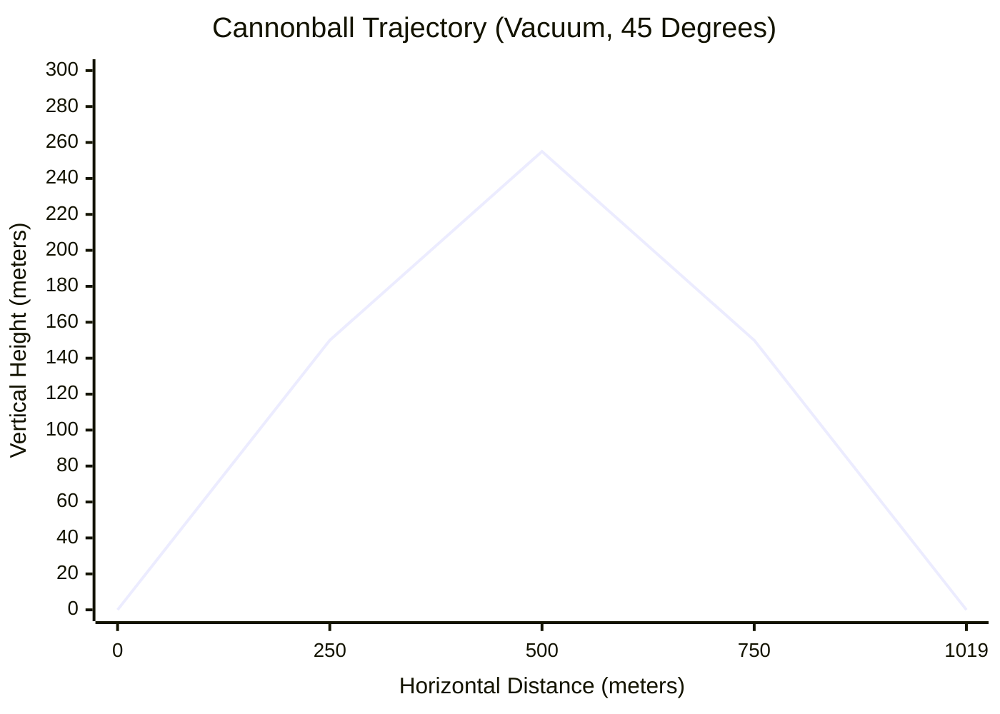
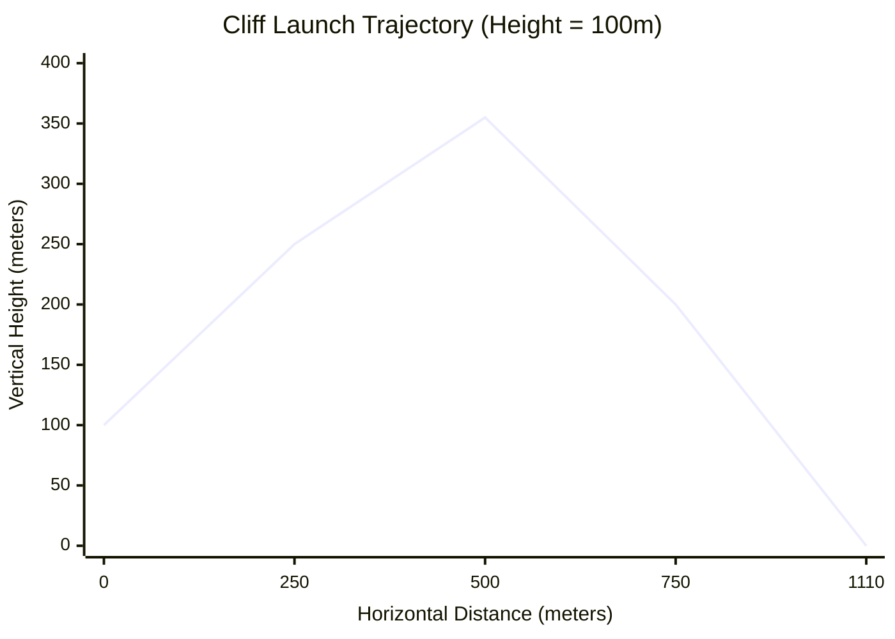
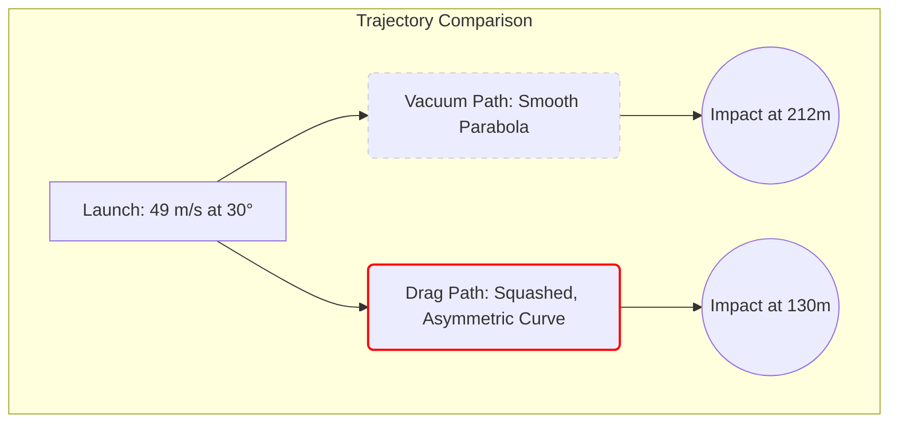
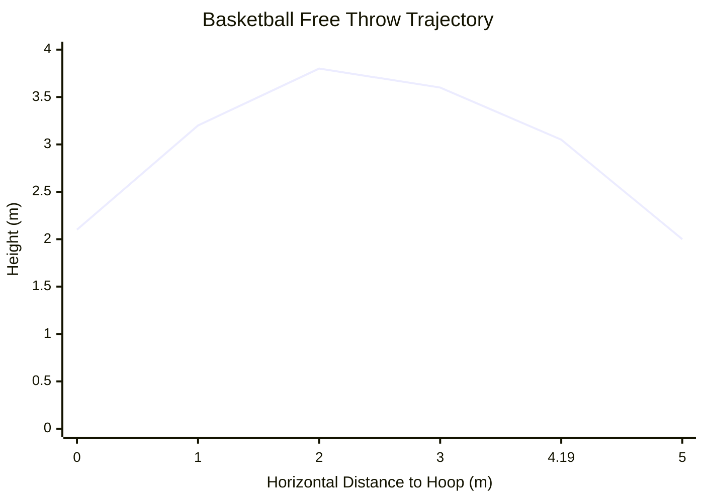
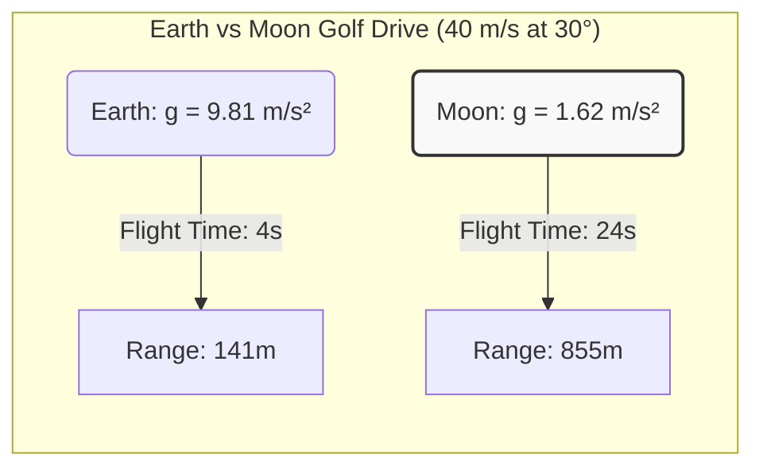

# Projectile Motion Calculator: The Ultimate Guide to Kinematics, Ballistics, and 2D Trajectories

Have you ever thrown a baseball across a field, skipped a stone across a calm pond, or watched a fireworks display light up the night sky and wondered about the invisible mathematical rules governing their flight? Every time an object is launched, thrown, or fired into the air, it becomes a **projectile**. The moment it leaves your hand or the barrel of a cannon, its fate is handed over to the fundamental forces of the universe—primarily, gravity and air resistance.

Understanding how these objects move is not just a mathematical exercise; it is the very foundation of classical mechanics. It is the science that allows engineers to land rovers on Mars, athletes to optimize their three-point shots, and game developers to create realistic physics engines. 

Welcome to the definitive guide on projectile motion. Whether you are a high school physics student grappling with kinematic equations, a mechanical engineer designing a pneumatic launcher, or a curious mind wanting to understand the world, this guide—paired with our advanced **Projectile Motion Calculator**—will give you total mastery over 2D trajectories.

---

## 1. The Human Concept of Projectile Motion: A Deep Explanation

To truly grasp projectile motion, we must first unlearn a common misconception. For centuries, ancient philosophers like Aristotle believed that an object thrown into the air traveled in a straight line until it "ran out of force" (or *impetus*), at which point it would drop straight down to the ground. If you watch a fast-moving object like a bullet, it might superficially look like it travels in a straight line. 

However, in the late 16th and early 17th centuries, **Galileo Galilei** changed the world forever by realizing that the path of a projectile is actually a smooth, symmetrical curve known in mathematics as a **parabola**. 

Galileo's genius was in realizing that projectile motion is not one complex motion, but rather **two simple, completely independent motions happening at the exact same time**.

### The Two Pillars of 2D Kinematics

When a cannonball is fired horizontally off a cliff, it is doing two things simultaneously:
1. **Moving forward** (Horizontal Motion)
2. **Falling downward** (Vertical Motion)

Galileo's principle of **Independence of Motion** states that these two dimensions do not affect each other. The horizontal forward speed does not care that the object is falling, and the vertical falling speed does not care that the object is moving forward. 

#### Horizontal Motion: The Coasting Phase
Imagine sliding a puck across a frictionless sheet of perfect ice. Once you push it, it keeps sliding forward at the exact same speed forever. There is no force pushing it forward anymore, but there is also no force slowing it down. This is Newton's First Law of Motion (Inertia). 

In an ideal physics vacuum (where we pretend air doesn't exist), the horizontal motion of a projectile is exactly like that puck. Once the object is launched, there are zero horizontal forces acting on it. Therefore, its **horizontal velocity remains perfectly constant**, and its horizontal acceleration is zero ($a_x = 0$).

#### Vertical Motion: The Falling Phase
Now, imagine dropping an apple from your hand. It starts at zero speed, but gravity pulls it downward, causing it to accelerate. Every second it falls, it speeds up by approximately $9.81 \text{ m/s}$. 

For a projectile, the exact same thing happens. Regardless of how fast it is moving forward, gravity is relentlessly pulling it down with a constant vertical acceleration ($a_y = -9.81 \text{ m/s}^2$ on Earth). 

When you combine a constant forward coasting speed with an accelerating downward falling speed, the resulting path traced through space is a perfect parabolic arc.

### The Mathematics of the Vacuum

To predict the exact location of a projectile at any given second, we use the standard kinematic equations. 

**1. Breaking Down the Launch (Vector Resolution)**
When you launch a projectile at an initial velocity ($v_0$) and a specific angle ($\theta$) relative to the ground, the very first step is to split that velocity into its horizontal and vertical components using trigonometry.
*   **Initial Horizontal Velocity:** $v_{x0} = v_0 \cdot \cos(\theta)$
*   **Initial Vertical Velocity:** $v_{y0} = v_0 \cdot \sin(\theta)$

**2. Calculating Position Over Time**
Because horizontal velocity never changes (in a vacuum), finding the horizontal distance ($x$) at any time ($t$) is simple multiplication:
*   **Horizontal Position:** $x(t) = v_{x0} \cdot t$

The vertical position ($y$) is slightly more complex because gravity is constantly changing the speed. We must account for the initial height ($h_0$), the initial upward velocity, and the downward pull of gravity ($g$):
*   **Vertical Position:** $y(t) = h_0 + (v_{y0} \cdot t) - \frac{1}{2}g \cdot t^2$

By linking these two equations together through the variable of time ($t$), our calculator can instantly map the exact flight path of any object in the universe.

---

## 2. Comprehensive Usage Guide: Mastering the Simulator

Our **Projectile Motion Calculator** is not just a simple equation solver; it is a full-fledged 2D physics engine. Here is how to unlock its full potential.

### Step 1: Setting Your Initial Parameters
*   **Initial Velocity (Launch Speed):** This is the raw speed at which the object leaves the launcher. You can input this in meters per second (m/s), kilometers per hour (km/h), miles per hour (mph), or feet per second (ft/s). 
*   **Launch Angle:** Enter the angle of elevation. $0^\circ$ means firing perfectly horizontally. $90^\circ$ means firing straight up into the air. $45^\circ$ is traditionally the angle for maximum range in a vacuum.
*   **Initial Height:** If you are throwing a ball from a 50-meter cliff, enter 50 here. If you are kicking a soccer ball off the ground, leave it at 0.

### Step 2: Choosing the Environment
*   **Gravity Presets:** Earth's gravity is the default ($9.81 \text{ m/s}^2$). However, you can use the dropdown menu to simulate launches on the Moon, Mars, Jupiter, or even deep space asteroids. Watch how the trajectory explodes in height when you select the Moon!
*   **Air Resistance (Drag):** This is where the calculator transitions from high school physics to university-level engineering. By toggling "Enable Air Resistance," the simulator switches from simple algebraic equations to a complex **Runge-Kutta 4th Order (RK4)** numerical integration engine. You must provide the object's Mass, Cross-Sectional Area, and Drag Coefficient ($C_d$). We provide presets for common objects like baseballs, golf balls, and bullets.

### Step 3: The Target Hit Simulator
Are you trying to hit a specific window, clear a specific wall, or land in a specific trench? 
*   Enable the **Target Hit Simulator**.
*   Input the X (horizontal distance) and Y (vertical height) coordinates of your target.
*   A crosshair will appear on the interactive graph. You can then adjust your launch angle and speed until your trajectory curve perfectly intersects the target crosshair. 

### Step 4: Analyzing the Output Data
Once you input your parameters, the calculator instantly generates the flight data:
*   **Maximum Height (Apex):** The highest vertical point reached before gravity pulls it back down.
*   **Horizontal Range:** The total distance traveled across the ground before impact.
*   **Flight Time:** The total seconds the object remains airborne.
*   **Impact Velocity:** The exact speed and angle at which the projectile strikes the ground. 

You can hover your mouse over the interactive trajectory graph to see the exact X/Y coordinates and velocity vectors at any fraction of a second during the flight.

---

## 3. Five Concept Examples with 2D Visualizations

To truly master projectile motion, we must move beyond abstract equations and look at concrete, real-world examples. Below are five distinct scenarios that illustrate how changing a single variable drastically alters the flight path.

### Example 1: The Classic Cannonball (Ideal Vacuum, Flat Ground)
**The Scenario:** You are commanding a 17th-century artillery crew on a perfectly flat, endless plain. We will ignore air resistance for this purely mathematical baseline. You fire a cannonball with an initial velocity of $100 \text{ m/s}$ at an angle of $45^\circ$.

**The Physics Breakdown:**
Because we are on flat ground ($h_0 = 0$) in a vacuum, the trajectory will be a perfectly symmetrical parabola. An angle of $45^\circ$ divides the initial velocity perfectly equally between the horizontal and vertical vectors ($v_{x0} = 70.7 \text{ m/s}$, $v_{y0} = 70.7 \text{ m/s}$). 
*   **Time to Peak:** $70.7 / 9.81 = 7.21 \text{ seconds}$.
*   **Total Flight Time:** $7.21 \times 2 = 14.42 \text{ seconds}$ (perfect symmetry).
*   **Horizontal Range:** $70.7 \text{ m/s} \times 14.42 \text{ s} = 1019.5 \text{ meters}$.

**2D Visualization (Trajectory Map):**

*Notice the perfect, mirror-image symmetry of the curve. The ascent takes the exact same amount of time and covers the exact same horizontal distance as the descent.*

---

### Example 2: The Cliff Launch (Initial Height > 0)
**The Scenario:** You are now defending a castle built on the edge of a 100-meter vertical cliff. You fire the same cannonball at $100 \text{ m/s}$, but this time you experiment with the angle. 

**The Physics Breakdown:**
When you launch from a height, $45^\circ$ is **no longer the optimal angle for maximum range**. Why? Because the projectile spends extra time falling from the 100-meter cliff down to the zero-elevation ground. If you use a slightly lower angle (e.g., $40^\circ$), you dedicate more of your initial energy to forward horizontal speed ($v_x$). The extra falling distance provides the necessary flight time for that faster horizontal speed to cover more ground.
*   If fired at $45^\circ$, the range is $1110 \text{ meters}$.
*   If fired at $40^\circ$, the range increases to $1115 \text{ meters}$.

**2D Visualization (The Asymmetry of Elevated Launches):**

*Here, the symmetry is broken. The projectile reaches its peak height relatively early in its horizontal journey, and the right side of the parabola is stretched out as it falls below the launch elevation.*

---

### Example 3: The Baseball Home Run (The Reality of Air Resistance)
**The Scenario:** We leave the theoretical vacuum and enter the real world. A Major League Baseball player hits a ball with an exit velocity of $49 \text{ m/s}$ (about 110 mph) at a launch angle of $30^\circ$. A baseball has a mass of $0.145 \text{ kg}$ and a drag coefficient ($C_d$) of roughly $0.3$. 

**The Physics Breakdown:**
Air resistance changes everything. As the ball pushes through the air, millions of atmospheric molecules crash into it, generating a drag force that opposes its motion. This drag force grows exponentially with speed ($F_d \propto v^2$). 
*   **In a vacuum:** The ball would travel a massive **212 meters** (695 feet)—out of the stadium entirely.
*   **With Air Resistance:** The drag rapidly bleeds off the horizontal velocity. The ball peaks earlier, and falls much more vertically. The actual range is reduced to roughly **130 meters** (426 feet)—a standard home run.

**2D Visualization (Vacuum vs. Drag):**

*When air resistance is factored in, the trajectory is no longer a parabola. It resembles a teardrop shape. The descent angle is much steeper than the launch angle because the forward velocity has been largely scrubbed off by drag.*

---

### Example 4: The Basketball Free Throw (Hitting a Fixed Target)
**The Scenario:** A basketball player is shooting a free throw. The player releases the ball from a height of $2.1 \text{ meters}$. The center of the hoop is exactly $4.19 \text{ meters}$ away horizontally, and exactly $3.05 \text{ meters}$ high. 

**The Physics Breakdown:**
This is an inverse kinematics problem. Instead of asking "Where will it land?", we are demanding that the trajectory intersects a specific coordinate: $(X = 4.19, Y = 3.05)$. 
The player generally shoots at an angle of roughly $50^\circ$ to give the ball a high arc, allowing it to drop cleanly through the rim. Using the trajectory equation, the required initial velocity to perfectly hit the center of the rim at a $50^\circ$ angle from a $2.1\text{m}$ release height is exactly **$7.28 \text{ m/s}$**. If the player shoots at $7.5 \text{ m/s}$, it clanks off the back iron. If they shoot at $7.0 \text{ m/s}$, it is an airball.

**2D Visualization (Target Intersection):**

*The mathematical precision required in sports is staggering. The human brain acts as a real-time ballistics computer, intuitively calculating the necessary $v_0$ and $\theta$ to make the trajectory line intersect the $(4.19, 3.05)$ coordinate.*

---

### Example 5: Golfing on the Moon (Low Gravity Environments)
**The Scenario:** In 1971, Apollo 14 astronaut Alan Shepard famously hit a golf ball on the surface of the Moon with a makeshift 6-iron. Let's assume an amateur swing speed of $40 \text{ m/s}$ and a launch angle of $30^\circ$. 

**The Physics Breakdown:**
The Moon is a radically different physics environment. 
1.  **Zero Air Resistance:** There is no atmosphere, so we use the pure vacuum equations. The golf ball will not slice or hook, and drag will not slow it down.
2.  **Low Gravity:** The gravitational pull is only $1.62 \text{ m/s}^2$ (roughly 1/6th of Earth's gravity).

Because gravity is pulling the ball down 6 times less forcefully, the ball stays in the air 6 times longer. Because it is in the air 6 times longer, its constant horizontal velocity carries it 6 times farther.
*   **Earth Range:** $141 \text{ meters}$
*   **Moon Range:** $855 \text{ meters}$ (Over half a mile!)

**2D Visualization (Gravity Scaling):**

*By changing the fundamental constant of gravity ($g$), the exact same initial energy input results in a vastly expanded kinematic output.*

---

## 4. Advanced Topics and Real-World Engineering

While throwing baseballs and hitting golf balls are excellent pedagogical tools, projectile motion forms the bedrock of advanced engineering and military applications.

### Orbital Mechanics: Newton's Cannonball
Isaac Newton proposed a famous thought experiment: What if you put a cannon on top of a mountain so impossibly high that it cleared the Earth's atmosphere (removing air resistance)? 
If you fire the cannonball at standard speeds, it follows a normal parabola and hits the ground. But if you fire it fast enough (around $7,900 \text{ m/s}$), something miraculous happens. 
The cannonball falls toward the Earth due to gravity, but because the Earth is a sphere, the surface of the planet *curves away* from the cannonball at the exact same rate that the ball falls. The cannonball is in a perpetual state of freefall, constantly missing the ground. 
This is what an **orbit** is. The International Space Station (ISS) is technically just a projectile moving so fast horizontally that its parabolic arc perfectly matches the curvature of the Earth.

### Artillery and The Coriolis Effect
For military snipers and long-range artillery crews, the basic $R = \frac{v_0^2 \sin(2\theta)}{g}$ equation is woefully insufficient. When firing a projectile over kilometers of distance, engineers must account for:
1.  **Variable Air Density:** The air is thinner at the apex of the trajectory than at the launch point, changing the drag coefficient dynamically during the flight.
2.  **The Coriolis Effect:** The Earth is rotating beneath the projectile while it is in the air. If you fire an artillery shell due North in the Northern Hemisphere, the target is moving eastward faster than the launch point. The shell will appear to curve to the right. Ballistics computers must calculate this fictitious force to guarantee accuracy.

### Sports Science: The Magnus Effect
In our simulator, we treat objects as non-rotating point masses. In reality, spheres like tennis balls, soccer balls, and baseballs spin rapidly. 
When a ball spins as it moves through the air, it drags a boundary layer of air along with it. A ball with **backspin** (like a pitched fastball or a driven golf ball) pushes air downward. By Newton's Third Law, the air pushes the ball upward. This generates a lift force known as the **Magnus Effect**. 
This is why a golf ball driven with heavy backspin can actually travel *farther* in the real world than it would in a pure vacuum—the aerodynamic lift keeps it airborne long enough to counteract the drag deceleration.

---

## Conclusion: The Beauty of Predictable Physics

The magic of projectile motion lies in its absolute determinism. Once an object leaves the launcher, its destiny is entirely sealed by the laws of physics. By understanding the initial velocity, the launch angle, and the environmental forces of gravity and drag, we can gaze into the future and predict exactly where and when the object will land.

We highly encourage you to spend time experimenting with the **Projectile Motion Simulator** above. Change the launch angles. Toggle the air resistance. See what happens when you fire a baseball on Jupiter. By playing with the variables, the abstract equations of kinematics will transform into an intuitive, visual understanding of the mechanics that govern our universe.
