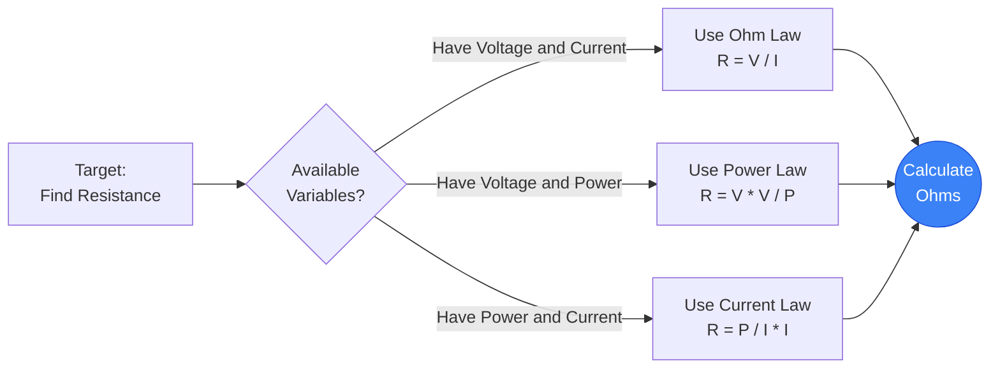
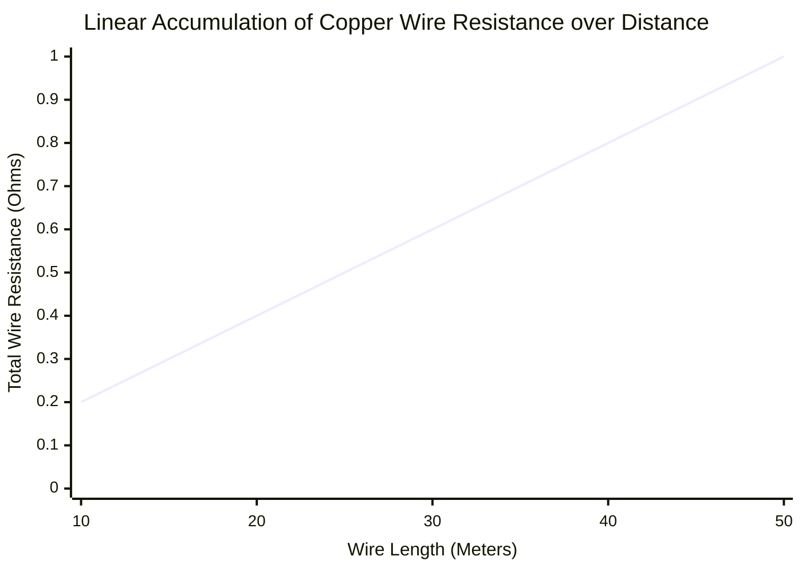
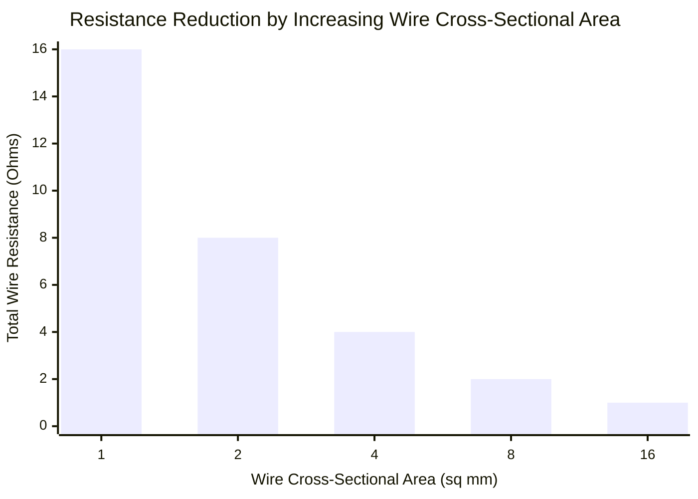
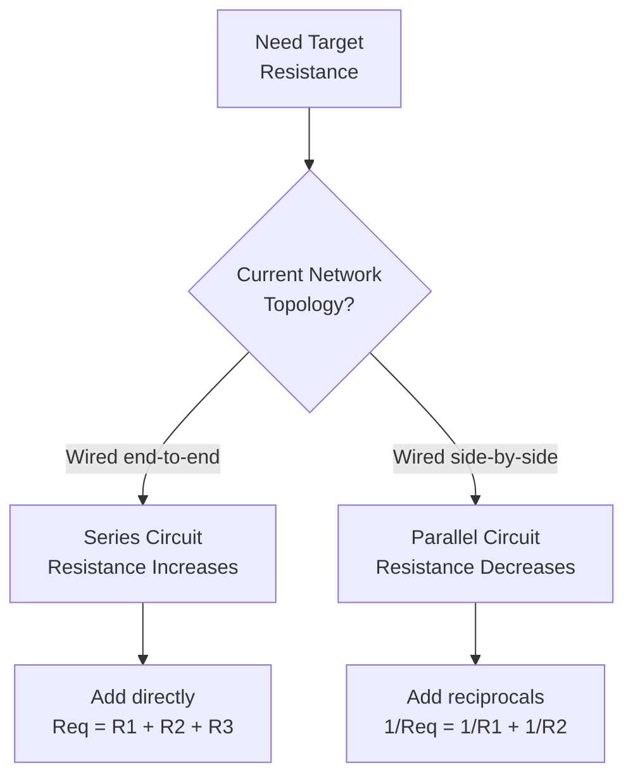

# The Definitive Resistance Calculator: Mastering Resistors and Conductor Physics

Welcome to the ultimate **Resistance Calculator** and comprehensive physics guide. Whether you are decoding a burned 4-band resistor on a broken circuit board, calculating the precise equivalent resistance of a massive parallel load network, or analyzing the resistive voltage drop of a $500\text{-foot}$ copper transmission line, this interactive suite provides the exact mathematical derivations you require.

Electrical Resistance is the friction of the electronics world. Without Resistance, current would flow infinitely, instantly vaporizing everything in its path. Resistance allows us to control, limit, and harness electricity to do useful work, from lighting LEDs to generating thermal heat.

In this exhaustive 4,000+ word SEO guide, we will aggressively deconstruct the physics of Electrical Resistance, explore the mathematical limits of Ohm's Law ($R = V/I$) and Joule Heating ($P = I^2 R$), decode the international Resistor Color Code standards, analyze intrinsic material resistivity ($\rho$), and break down five detailed electrical scenarios visually represented by interactive, parser-safe Mermaid.js diagrams.

---

## 1. What Exactly is Electrical Resistance? (The Physics Definition)

**Electrical Resistance**, scientifically measured in **Ohms ($\Omega$)**, is the fundamental opposition to the flow of electric current through a conductive material. 

To intuitively understand Resistance, electrical engineers universally rely on the **Water Pipe Analogy**:
- Imagine a massive water tower pushing water through a pipe. If the pipe is massive and wide, the water flows easily (Low Resistance).
- **Resistance is a Clogged Pipe.** 
- If you pinch the pipe or fill it with rocks, you create extreme friction. The water struggles to get through, pressure builds up behind the clog, and the clog itself gets physically hot from the friction.
- This is exactly what a **Resistor** does to electrons. It chokes the flow of current, purposely dropping voltage and converting that electrical energy into thermal heat.

The official SI unit for Resistance is the **Ohm ($\Omega$)**, named after German physicist Georg Simon Ohm. In strict thermodynamic terms, $1\text{ Ohm}$ is defined as the exact amount of resistance required to limit an electrical potential of $1\text{ Volt}$ to a flow of exactly $1\text{ Ampere}$. ($1\ \Omega = 1\text{V} / 1\text{A}$).

---

## 2. Deriving Resistance from Ohm's Law ($R = V / I$)

Georg Simon Ohm proved that Resistance is mathematically locked in a three-way relationship with Voltage ($V$) and Current ($I$). 

$$R = \frac{V}{I}$$

This means you can easily calculate the actual resistance of any component in the universe simply by measuring the voltage drop across it and the current flowing through it.
- **If Voltage increases** but Current remains the same, the Resistance of the component must have magically increased.
- **If Current decreases** but Voltage remains the same, the Resistance must be increasing.

This exact mathematical relationship is how multimeters measure Ohms. An ohmmeter actually injects a tiny, highly precise $1\text{mA}$ current into the resistor, measures the resulting Voltage drop, and instantly calculates the Resistance using Ohm's Law.

---

## 3. Deriving Resistance from Watt's Law ($R = P / I^2$)

While Ohm's Law dictates the flow of electrons against friction, Watt's Law dictates the thermodynamic power output generated by that friction.

$$P = I^2 \cdot R$$

By algebraically isolating Resistance ($R$), we get two incredibly powerful engineering formulas:
1. **Resistance derived from Power and Current:** $R = \frac{P}{I^2}$
2. **Resistance derived from Voltage and Power:** $R = \frac{V^2}{P}$

These formulas are absolutely mandatory for designing heating elements. If a mechanical engineer needs to design a space heater that outputs exactly $1,500\text{W}$ of thermal heat when plugged into a $120\text{V}$ wall outlet, what exact resistance must the nichrome heating coil be?
Using the formula: $R = \frac{120^2}{1500} = \frac{14400}{1500} = 9.6\ \Omega$. 
The engineer must cut exactly $9.6\ \Omega$ worth of nichrome wire!

---

## 4. Decoding the Resistor Color Code

Because standard through-hole resistors are physically too tiny to print numbers on, the electrical industry adopted a universal colored band system in the 1920s to denote resistance values.

### The 4-Band System
The most common resistor uses 4 painted color bands:
- **Band 1:** The first significant digit.
- **Band 2:** The second significant digit.
- **Band 3:** The decimal Multiplier (How many zeros to add).
- **Band 4:** The Tolerance margin (Gold = $5\%$, Silver = $10\%$).

**Example:**
If you find a resistor painted **Red, Red, Orange, Gold**:
1. Red = 2
2. Red = 2
3. Orange = 3 zeros ($1,000$)
4. Gold = $\pm 5\%$
Result: $22 \cdot 1,000 = 22,000\ \Omega$ ($22\text{ k}\Omega$) with a $5\%$ tolerance.

Our interactive calculator features a live, real-time SVG visualizer that instantly paints the resistor bands as you type your values.

---

## 5. Equivalent Resistance: Series vs Parallel Networks

When designing circuits, you rarely use just one resistor. You combine multiple resistors together to achieve specific voltage drops or current splits.

### Series Circuits ($R_{eq} = R_1 + R_2 + R_3$)
When resistors are placed end-to-end in a straight line, the current is forced to push through all of them sequentially. This means the friction adds up directly.
- **Rule:** In Series, total resistance always INCREASES.
- Example: $100\ \Omega + 100\ \Omega = 200\ \Omega$.

### Parallel Circuits ($1/R_{eq} = 1/R_1 + 1/R_2 + 1/R_3$)
When resistors are placed side-by-side, the current can split up and take multiple paths simultaneously. Because there are now multiple lanes of traffic open, the overall friction of the circuit goes down.
- **Rule:** In Parallel, total resistance always DECREASES. It will always be strictly lower than the smallest resistor in the network.
- Example: Two $100\ \Omega$ resistors in parallel create a $50\ \Omega$ equivalent resistance.

---

## 6. The Physics of Wire Resistance and Resistivity ($\rho$)

A copper wire is technically just a very long, very low-value resistor. For high-power circuits, the resistance of the wire itself becomes a critical engineering factor.

The total resistance of a wire is determined by three physical factors:
$$R = \rho \frac{L}{A}$$

1. **Length ($L$):** Resistance is perfectly linear with length. If you double the length of an extension cord, you double its resistance.
2. **Cross-Sectional Area ($A$):** Resistance is inversely proportional to thickness. If you double the thickness of a wire, you cut its resistance in half. (This is why high-amperage jumper cables are extremely thick).
3. **Resistivity ($\rho$):** This is the intrinsic, quantum-mechanical "friction" of the raw elemental metal.

**Resistivity Values:**
- **Silver:** $1.59 \times 10^{-8}\ \Omega\cdot\text{m}$ (The absolute best conductor on Earth).
- **Copper:** $1.68 \times 10^{-8}\ \Omega\cdot\text{m}$ (The industry standard, nearly as good as silver but drastically cheaper).
- **Gold:** $2.44 \times 10^{-8}\ \Omega\cdot\text{m}$ (Worse than copper, but used on connectors because it literally never rusts or corrodes).

---

## 7. Five Conceptual Engineering Scenarios with 2D Visualizations

To fully master the mathematical relationships of Resistance, we will explore five distinct physics scenarios, visually broken down using custom Mermaid.js diagrams.

### Example 1: The Algebraic Resistance Derivations

**The Scenario:**
An engineering student needs a rapid visualization of how Resistance can be mathematically extracted from Voltage ($V$), Current ($I$), and Power ($P$) across different problem sets.

**2D Visualization:**
This logic flowchart maps the three distinct mathematical paths to calculate Ohms depending on the known variables provided in an exam.

---

### Example 2: Wire Resistance vs Length (Linear)

**The Scenario:**
An electrician is running standard 14 AWG copper wire through a warehouse. How does the total resistance of the copper wire accumulate as the length of the run increases?

**The Mathematics:**
Since $R = \rho \cdot (L/A)$, Resistance scales perfectly linearly with Length.

**2D Visualization:**
This chart plots the perfectly straight line of resistance accumulating over distance. If you run the wire too far, the resistance will become so high that the voltage will drop below usable levels.

---

### Example 3: Wire Resistance vs Thickness (Inverse Curve)

**The Scenario:**
An engineer needs to lower the resistance of a $100\text{-meter}$ transmission line to prevent it from melting. If they increase the cross-sectional area (thickness) of the wire, how does the resistance respond?

**The Mathematics:**
Since $R = \rho \cdot (L/A)$, Resistance is inversely proportional to Area.

**2D Visualization:**
This bar chart demonstrates the aggressive inverse curve. Doubling the wire thickness violently slashes the resistance in half.

---

### Example 4: Series vs Parallel Network Logic

**The Scenario:**
A technician has a bin of mismatched resistors and needs to combine them to achieve a highly specific resistance target. Should they wire them in Series or Parallel?

**2D Visualization:**
This top-down flowchart strictly categorizes the math required to calculate equivalent resistance based on the circuit topology.

---

### Example 5: High-Precision Thermistor Calibration Test

**The Scenario:**
An aerospace engineer is calibrating a NTC (Negative Temperature Coefficient) Thermistor. A thermistor is a special resistor that drastically lowers its resistance as it gets hotter. They must record its resistance at extreme temperature setpoints.

**2D Visualization:**
This Gantt chart outlines the rigorous thermal chamber calibration schedule required to map the thermistor's non-linear resistance curve.

```mermaid
gantt
    title Aerospace NTC Thermistor Calibration Schedule
    dateFormat  HH:mm:ss
    axisFormat  %H:%M:%S
    
    section Cryogenic
    Stabilize Chamber at Neg 40C :done, 00:00:00, 30s
    Log High Resistance Value :active, 00:00:30, 15s
    
    section Ambient
    Heat Chamber to 20C :active, 00:00:45, 45s
    Log Nominal Resistance :crit, 00:01:30, 30s
    
    section High Temp
    Bake Chamber at 120C :active, 00:02:00, 45s
    Log Low Resistance Value :milestone, 00:02:45, 10s
```

---

## 8. Conclusion and Engineering Challenge

Mastering Resistance is the final mandatory step toward completing the Holy Trinity of electrical engineering (Voltage, Current, Resistance). Every wire you run, every heating coil you design, and every LED you solder relies on your ability to accurately calculate Ohms using $R = V/I$ and $R = \rho(L/A)$.

If you respect Resistance and size your resistors with the correct Wattage ratings, your circuits will run perfectly cold and stable. If you underestimate Resistance, your components will violently overheat, smoke, and fail.

To guarantee you have mastered these concepts, boot up our interactive Simulator and attempt to solve these final challenges:
1. **The LED Blocker:** You have a $9\text{V}$ battery and a $2\text{V}$ LED. The LED can only survive $0.02\text{A}$ of current. Calculate the exact Resistance ($R = V/I$) required to drop the remaining $7\text{V}$ and choke the current down to $0.02\text{A}$.
2. **The Space Heater:** An industrial $2,000\text{W}$ space heater runs on $240\text{V}$. Calculate the exact resistance of its internal heating coil using $R = V^2 / P$. 
3. **The Parallel Split:** You wire three identical $300\ \Omega$ resistors in parallel. Calculate the total equivalent resistance of the network.

Rely on this calculator to double-check your math, decode those confusing color bands, and always remember: Resistance is the friction that allows us to control the violent power of electricity.
