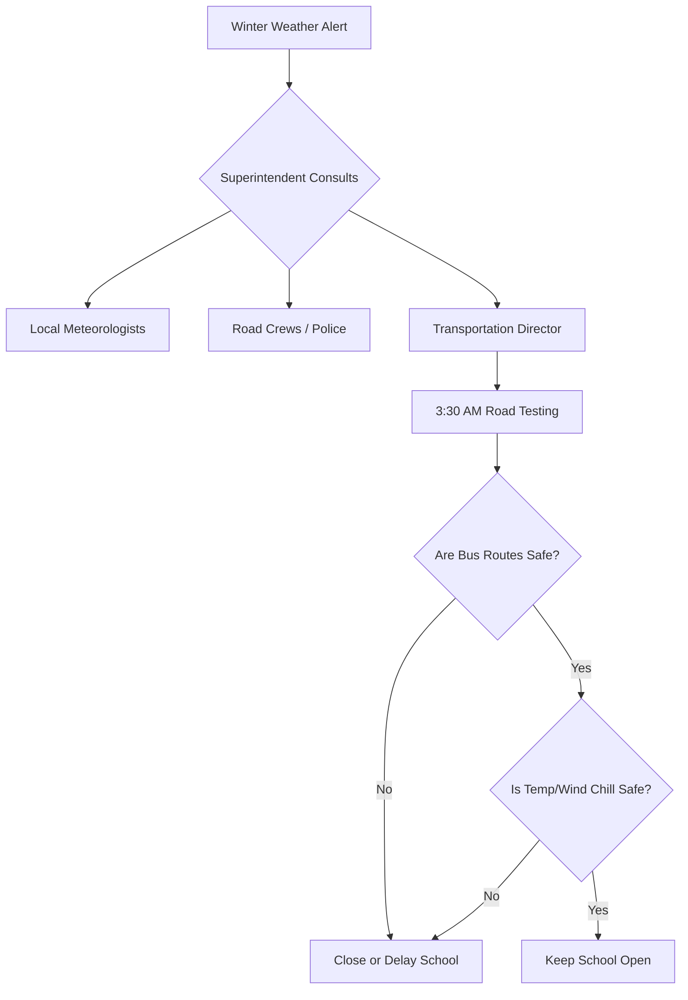

# Complete Guide to School Closures and Snow Day Predictions

Severe winter weather brings excitement for students and logistical challenges for parents and school administrators. Every time a major winter storm threatens a region, millions of people ask the same question: *Will school be closed tomorrow?*

Understanding how school districts make closure decisions requires looking at meteorology, road maintenance physics, pedestrian safety, and school bus mechanics. This guide provides an in-depth look at the factors that determine school closures, how our **Snow Day Calculator** operates, and how to stay safe during winter storms.

---

## How School Districts Make Closure Decisions

The decision to declare a snow day is rarely simple. School superintendents must balance the safety of students and staff against the loss of instructional time and the disruption a closure causes for working parents.



### The morning timeline of a superintendent
For most school districts, the decision-making process begins in the middle of the night:
1. **3:00 AM – 4:00 AM:** The director of transportation and road maintenance crews begin driving key bus routes, particularly secondary rural roads, steep hills, and bridge decks that freeze first.
2. **4:30 AM:** The superintendent consults with local meteorologists to review the latest radar sweeps, snowfall rates, and temperature forecasts.
3. **5:00 AM:** Conference calls occur between neighboring school superintendents. Many districts close in tandem to coordinate shared busing services, special education routes, and regional athletic events.
4. **5:30 AM – 6:00 AM:** The official decision is made. If schools are closing or delaying, automated phone systems, text alerts, and local news stations are notified.

---

## Meteorological Factors in Snow Day Calculations

Our **Snow Day Calculator** uses several meteorological variables to estimate closure probability. Understanding these inputs helps explain the output.

### 1. Snowfall Accumulation
Snow accumulation is the most visible driver of closures. However, the physical height of the snow is only part of the story. 

- **Under 2 Inches (5 cm):** Rarely causes closures in winter-prepared regions, but can cause delays or full closures in southern districts.
- **2 to 6 Inches (5 to 15 cm):** Often results in delays or closures depending on plow speed and temperature.
- **6+ Inches (15+ cm):** Almost always leads to closures in suburban and rural districts.

You can convert these values using our [Conversion Calculator](file:///calculators/conversion-calculator) to check equivalent metrics.

### 2. Temperature and the Freezing Threshold
Air temperature determines whether snow will stick to roads or melt on contact.
- **Above 32°F (0°C):** Snow is wet and slushy. If ground temperatures are warm, road surfaces remain wet rather than icy, lowering closure risk.
- **18°F to 32°F (-8°C to 0°C):** The optimal range for snow accumulation. Snow sticks easily, and ice forms rapidly.
- **Below 15°F (-9°C):** Standard road salt loses its chemical effectiveness, leading to hard-packed snow and ice that plows cannot scrape off.

For rapid conversions between temperature scales, refer to our [Temperature Converter](file:///calculators/temperature-converter).

### 3. Wind Speed and Visibility
High winds cause blowing snow, which reduces visibility and creates snowdrifts. 
- **Drifting:** Winds over 20 mph (32 km/h) blow snow back onto plowed roads.
- **Whiteouts:** Sustained winds over 35 mph (56 km/h) create whiteout conditions where visibility drops to near zero, making school bus transit impossible.

---

## Advanced Winter Weather Hazards

Beyond standard snowfall, winter storms present hazards that complicate transit safety.

### 1. Freezing Rain vs. Sleet
Freezing rain occurs when snow melts in a warm layer of air aloft but freezes instantly upon contacting cold surfaces on the ground, creating a glaze of ice.

| Hazard Type | Physical State | Road Hazard Level | Power Grid Impact |
| :--- | :--- | :--- | :--- |
| **Sleet** | Frozen ice pellets | Moderate (acts like sand) | Low |
| **Freezing Rain** | Liquid rain that freezes on contact | Extreme (creates ice glaze) | High (snaps power lines) |

### 2. Black Ice
Black ice forms when moisture freezes rapidly on road surfaces. Because it is transparent, drivers cannot see it. Bridges, overpasses, and shaded roadway sections are particularly vulnerable.

### 3. Wind Chill Index
Wind chill measures the rate of heat loss from exposed skin. 

\[T_{wc} = 35.74 + 0.6215T - 35.75V^{0.16} + 0.4275TV^{0.16}\]

Where \(T\) is the air temperature in °F and \(V\) is the wind speed in mph. If the wind chill drops below -15°F (-26°C), school districts will close to prevent frostbite. You can verify wind chill values with our dedicated [Wind Chill Calculator](file:///calculators/wind-chill-calculator).

---

## Infrastructure and Regional Sensitivity

A key factor in snow day predictions is regional infrastructure capability.

```
+-------------------------------------------------------------+
|                DISTRICT SENSITIVITY COMPARISON              |
+--------------------------+----------------------------------+
| High Sensitivity         | Closes for 1-2 inches of snow    |
| (Southern US / UK)       | Limited snow removal equipment.  |
+--------------------------+----------------------------------+
| Medium Sensitivity       | Closes for 4-6 inches of snow    |
| (Mid-Atlantic US)        | Average equipment fleets.        |
+--------------------------+----------------------------------+
| Low Sensitivity          | Closes for 8-12+ inches of snow  |
| (Canada / Northern US)   | Heavy plow fleets, winter tires. |
+--------------------------+----------------------------------+
```

1. **Plow Fleet Capacity:** Northern cities maintain large plow fleets and salt storage domes. Southern cities do not invest in this equipment because winter storms are infrequent.
2. **Topography:** Hilly or mountainous terrain makes bus travel dangerous even with light snow. Flat areas are easier to plow and navigate.
3. **Power Grid Reliability:** Heavy wet snow can snap power lines. A school building without electricity or heat cannot host students, forcing a closure regardless of road conditions.

---

## Winter Weather Safety Tips for Commuters

If you must travel during winter weather, follow these safety guidelines:

- **Increase Following Distance:** Tires need up to ten times more distance to stop on ice and snow than on dry pavement.
- **Pack an Emergency Kit:** Keep blankets, water, non-perishable snacks, a flashlight, and jumper cables in your trunk.
- **Clear All Snow:** Clean your car's roof, hood, and windows completely before driving to avoid blinding yourself or drivers behind you with flying snow.
- **Do Not Use Cruise Control:** Cruise control can cause your vehicle to accelerate if it loses traction, leading to a spin-out.

Explore our other calculators like the [Rainfall Calculator](file:///calculators/rainfall-calculator) or [Snowfall Unit Converter](file:///calculators/snowfall-unit-converter) to learn more about precipitation metrics.
