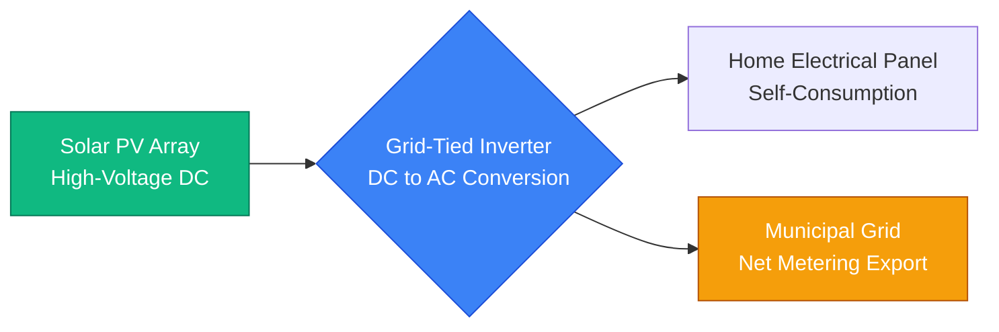
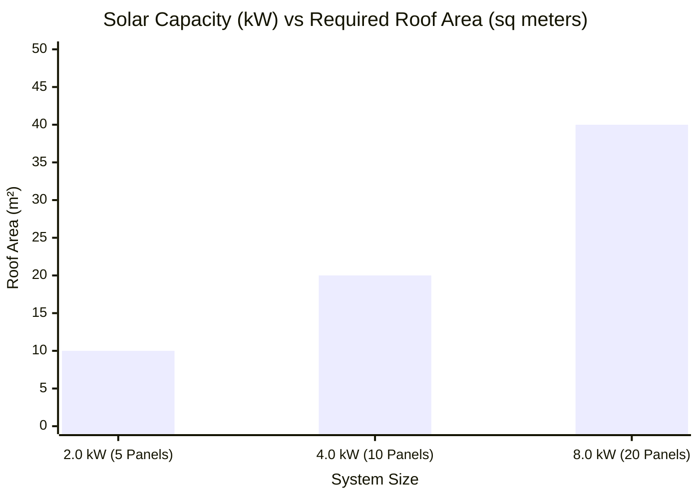
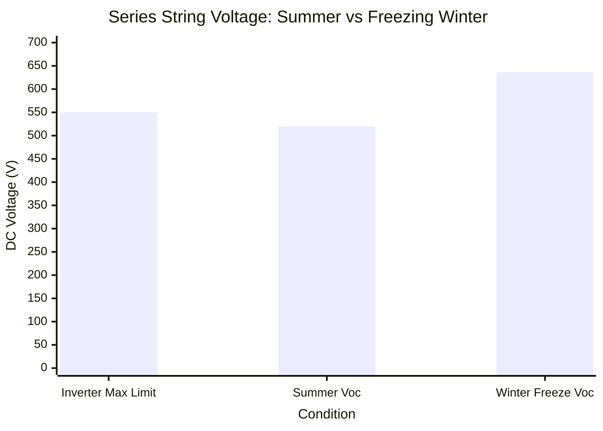
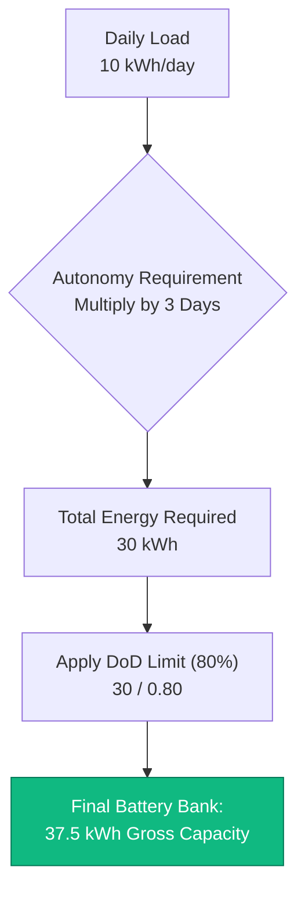
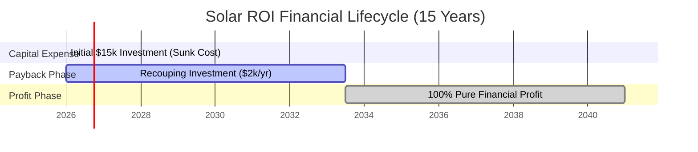

# The Definitive Solar Panel Calculator: Sizing, MPPT Stringing, and Financial ROI

Welcome to the ultimate **Solar Panel Calculator** and comprehensive photovoltaic (PV) engineering guide. Whether you are a homeowner attempting to eliminate a massive monthly electricity bill, an off-grid cabin builder designing an independent power island, or a commercial facility manager calculating the 25-year financial ROI of a $50,000 rooftop solar array, mastering solar physics is absolutely essential.

A solar power system is an incredibly complex matrix of interdependent variables. If you incorrectly calculate your daily kWh load, you will purchase too few panels and continue paying the utility company. If you misunderstand the physics of Open Circuit Voltage (Voc) in freezing weather, you will string too many panels in series and permanently incinerate your expensive MPPT inverter. If you ignore the concept of Peak Sun Hours, you will drastically overestimate your energy production.

In this exhaustive 4,000+ word SEO masterclass, we will deconstruct the fundamental mathematics of Solar Energy Production, expose the hidden dangers of temperature-dependent voltage spikes, mathematically prove how a grid-tied Net Metering system accelerates financial payback, and decode the exact formulas required to size a battery bank for complete off-grid autonomy. To ensure absolute comprehension, we have included five meticulously detailed, parser-safe Mermaid.js interactive diagrams.

---

## 1. The Physics of Solar Sizing (Peak Sun Hours & Efficiency)

The absolute most critical concept in solar engineering is understanding that a 400W solar panel does NOT produce 400W of power all day long. 

Solar production is governed by **Peak Sun Hours (PSH)**. 
- PSH does not mean "how long the sun is in the sky." (Daylight hours).
- PSH is an engineering metric that quantifies the total solar energy received in one day, expressed as hours of full $1000\text{ W/m}^2$ solar irradiance.
- In Arizona, you might get 6.5 Peak Sun Hours. In London, you might get 2.5 Peak Sun Hours in winter.

**The Production Equation:**
$$\text{Daily Energy (kWh)} = \text{Array Size (kWp)} \times \text{Peak Sun Hours} \times \text{System Efficiency}$$

**System Efficiency (Derating Factor):**
Solar panels never operate at $100\%$ efficiency in the real world. A standard grid-tied system operates at roughly $80\%$ to $85\%$ efficiency due to:
- **Temperature Derating ($10\%$ loss):** Solar panels lose power as they heat up under the sun.
- **Inverter Conversion ($4\%$ loss):** DC to AC conversion wastes energy as heat.
- **Wiring Voltage Drop ($2\%$ loss):** Copper cables naturally resist current flow.
- **Dust and Soiling ($4\%$ loss):** Pollen and dirt block sunlight.

**Example Calculation:**
If you install a $5\text{ kWp}$ solar array in a location with $5.0$ Peak Sun Hours, assuming $80\%$ efficiency:
$5\text{ kW} \times 5.0\text{ Hours} \times 0.80 = \mathbf{20\text{ kWh/day}}$ of usable AC electrical energy.

---

## 2. Demystifying MPPT Series Stringing (Voc vs Vmp)

The single most common mistake made by DIY solar installers is blowing up their solar charge controller by exceeding the maximum input voltage.

Solar panels have two critical voltage ratings:
1. **Vmp (Voltage at Maximum Power):** The operating voltage when the panel is producing full power under load (e.g., $40\text{V}$).
2. **Voc (Open Circuit Voltage):** The maximum possible voltage the panel generates when no load is connected (e.g., $50\text{V}$).

When you wire solar panels in **Series** (connecting the positive cable of one panel to the negative cable of the next), the **Voltage Adds Up**, while the current (Amps) remains the same.
- $10$ panels in series with a $50\text{V}$ Voc = $\mathbf{500\text{V} \text{ DC}}$ total string voltage.

**The Freezing Weather Danger:**
Solar panel voltage behaves counter-intuitively: As the physical temperature of the silicon cell drops, the voltage INCREASES. If your inverter has a maximum MPPT input limit of $500\text{V}$, and you design a string that produces exactly $490\text{V}$ in the summer, you will destroy your inverter on the first freezing morning of winter when the cold silicon pushes the Voc up to $530\text{V}$. 

Engineers strictly mandate using the **Temperature Coefficient of Voc** (e.g., $-0.3\%/^\circ\text{C}$) to calculate the absolute maximum worst-case voltage at the lowest recorded historical temperature for the installation site.

---

## 3. Financial ROI, Net Metering, and Payback Period

For grid-tied homeowners, installing a solar array is a financial investment evaluated by its **Payback Period** and **Return on Investment (ROI)**.

**Net Metering (NEM):**
Net Metering is a utility billing agreement where your electrical meter physically spins backward when your solar panels generate more power than your home is consuming. 
- During the day, you generate excess solar power and export it to the grid, earning a credit.
- At night, when the sun is down, you consume power from the grid, using up your credits.
- If your system is sized for $100\%$ Offset, your annual electric bill theoretically drops to $0.

**The Simple Payback Formula:**
$$\text{Payback Period (Years)} = \frac{\text{Net Installed System Cost}}{\text{Annual Electricity Savings}}$$

If a $6\text{ kW}$ system costs $\$15,000$ (after tax rebates) and eliminates a $\$2,000$ annual electricity bill, the system pays for itself in exactly $7.5\text{ years}$. Because high-quality tier-1 solar panels are warrantied for 25 years, the remaining $17.5\text{ years}$ represent pure, untaxed financial profit.

---

## 4. Designing for Off-Grid Battery Autonomy

If you are building an off-grid cabin, you do not have the luxury of using the municipal grid as a giant infinite battery. You must physically store enough energy in deep-cycle batteries to survive cloudy days and dark nights.

**The Autonomy Formula:**
$$\text{Battery Bank (kWh)} = \frac{\text{Daily Load (kWh)} \times \text{Days of Autonomy}}{\text{Depth of Discharge (DoD)} \times \text{Inverter Efficiency}}$$

- **Days of Autonomy:** The number of continuous days the battery bank can run the house with absolutely zero solar input (usually $2$ to $3$ days).
- **Depth of Discharge (DoD):** You can never drain a battery to $0\%$. Lead-Acid batteries should only be drained to $50\%$ DoD. Lithium Iron Phosphate (LiFePO4) batteries can safely be drained to $80\%$ DoD.

If your cabin uses $10\text{ kWh/day}$, and you want $2\text{ days}$ of autonomy using a Lithium battery bank ($80\%$ DoD) and a $90\%$ efficient inverter:
$\text{Required Battery Capacity} = (10 \times 2) / (0.80 \times 0.90) = \mathbf{27.7\text{ kWh}}$.
You will need a massive $48\text{V} \ 600\text{Ah}$ battery bank to survive the winter.

---

## 5. Five Conceptual Engineering Scenarios with 2D Visualizations

To fully master the physical relationships governing solar PV systems, we will explore five distinct engineering scenarios visually broken down using custom Mermaid.js diagrams.

### Example 1: The Grid-Tied Energy Pipeline

**The Scenario:**
A homeowner needs to understand the physical flow of energy from the sun, through the inverter, and out into the municipal utility grid.

**2D Visualization:**
This logic flowchart maps the high-level energy conversion process, demonstrating how the hybrid inverter acts as the intelligent traffic cop directing power to the home first, and the grid second.

---

### Example 2: Array Size vs Roof Area

**The Scenario:**
An architect is allocating roof space for a solar installation and needs to know exactly how much physical area is consumed as the kilowatt capacity of the array scales up.

**The Mathematics:**
A modern $400\text{W}$ solar panel measures roughly $2.0$ square meters. To generate $4\text{ kW}$, you need $10$ panels, requiring $20$ square meters of unshaded, south-facing roof.

**2D Visualization:**
This chart plots the direct linear correlation between desired electrical capacity and the physical real estate required.

---

### Example 3: The MPPT Voltage Overload Danger

**The Scenario:**
A DIY installer wires twelve $50\text{V}$ (Voc) solar panels in series. The inverter has a strict maximum input voltage limit of $550\text{V}$. During the summer, the array operates fine. During a $-10^\circ\text{C}$ winter freeze, the voltage spikes and incinerates the inverter.

**The Mathematics:**
Summer voltage: $12 \times 46\text{V} = 552\text{V}$ (Already dangerously close).
Winter voltage with $-0.3\%$ temperature coefficient: $12 \times 53\text{V} = 636\text{V}$ (Catastrophic failure).

**2D Visualization:**
This chart graphically proves the necessity of engineering solar strings for the coldest possible historical temperature.

---

### Example 4: Off-Grid Battery Sizing Architecture

**The Scenario:**
A solar engineer is calculating the required battery bank capacity to keep an off-grid medical clinic running for 3 days of autonomy during a monsoon.

**2D Visualization:**
This top-down flowchart maps the strict mathematics required to evaluate daily load, multiply by autonomy days, and divide by the Depth of Discharge limit to yield the final battery size.

---

### Example 5: The Financial ROI and Payback Timeline

**The Scenario:**
A homeowner pays $\$15,000$ cash for a solar system that saves $\$2,000$ per year on electricity. They want to visualize the exact moment the system becomes pure profit over a 15-year timeline.

**2D Visualization:**
This Gantt chart visualizes the financial lifecycle of a solar array, plotting the 7.5-year break-even point and the subsequent decades of untaxed utility savings.

---

## 7. Conclusion and Engineering Challenge

Mastering Solar Panel Sizing is the foundational bedrock of all renewable energy engineering. Understanding the difference between Daylight Hours and Peak Sun Hours, respecting the brutal reality of cold-weather voltage spikes, and mathematically modeling financial ROI will guarantee your solar system performs exactly as designed for the next 25 years.

If you ignore these mathematical principles, your array will grossly underproduce in winter, your series strings will exceed inverter voltage limits and void your warranty, and your off-grid cabin will run out of battery power by 8:00 PM every night.

To guarantee you have mastered these critical concepts, boot up our interactive Simulator and attempt to solve these final challenges:
1. **The Area Constraint:** You have exactly $30\text{ m}^2$ of unshaded roof space. Assuming you use $400\text{W}$ panels that measure $2.0\text{ m}^2$ each, what is the absolute maximum kWp capacity you can physically install?
2. **The Voltage Trap:** You are stringing $40\text{V}$ (Voc) panels in series into a charge controller with a $250\text{V}$ absolute maximum limit. Assuming a cold-weather multiplier of $1.15\times$, what is the absolute maximum number of panels you can safely wire in a single string?
3. **The Payback Calculation:** Your system costs $\$24,000$. It produces $10,000\text{ kWh/year}$. Your utility charges $\$0.30\text{ per kWh}$. How many exactly years will it take for the system to pay for itself?

Rely on this calculator to audit your installer's quotes, mathematically justify battery storage upgrades, and permanently eliminate your utility bill.
