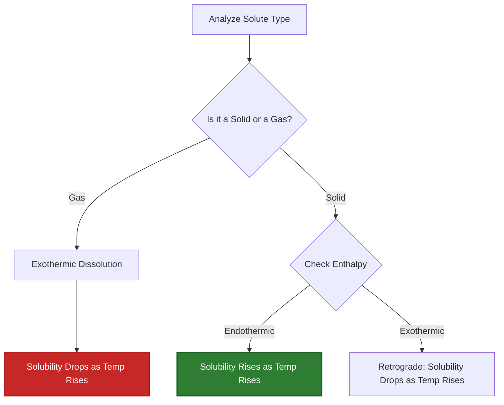

# Laboratory & Analytical Chemistry Guide to Solubility Equilibrium

In analytical, environmental, physical, and pharmaceutical chemistry, **solubility** quantifies the maximum equilibrium concentration of a solute dissolved in a solvent at a given temperature and pressure:

$$\text{Mass Solubility } S_{\text{mass}} \, (\text{g/L}) = S_{\text{molar}} \, (\text{mol/L}) \times M \, (\text{g/mol})$$

$$S_{\text{g/100 mL}} = \frac{S_{\text{g/L}}}{10}$$

$$\text{Maximum Dissolved Mass } m_{\text{max}} = S_{\text{mass}} \, (\text{g/L}) \times V \, (\text{L})$$

$$\text{Saturation Ratio } R_{\text{sat}} = \frac{C_{\text{current}}}{S_{\text{max}}} \quad \begin{cases} R_{\text{sat}} < 1 & \implies \text{Unsaturated (Dissolves completely)} \\ R_{\text{sat}} = 1 & \implies \text{Saturated (Equilibrium)} \\ R_{\text{sat}} > 1 & \implies \text{Supersaturated (Precipitation Favored)} \end{cases}$$

---

## 1. Classical Chemical Compound Solubility Reference Matrix

| Compound | Formula | Molar Mass | $20^\circ\text{C}$ Mass Solubility | $20^\circ\text{C}$ Molar Solubility | Type |
| :--- | :--- | :--- | :--- | :--- | :--- |
| **Potassium Nitrate** | $\text{KNO}_3$ | **101.10 g/mol** | **$316 \text{ g/L}$ ($31.6 \text{ g/100 mL}$)** | **$3.125 \text{ mol/L}$** | Endothermic Solid |
| **Sodium Chloride** | $\text{NaCl}$ | **58.44 g/mol** | **$360 \text{ g/L}$ ($36.0 \text{ g/100 mL}$)** | **$6.160 \text{ mol/L}$** | Flat Solid |
| **Silver Chloride** | $\text{AgCl}$ | **143.32 g/mol** | **$0.00191 \text{ g/L}$** | **$1.33 \cdot 10^{-5} \text{ mol/L}$** | Sparingly Soluble ($K_{sp}$) |
| **Calcium Fluoride** | $\text{CaF}_2$ | **78.07 g/mol** | **$0.0160 \text{ g/L}$** | **$2.05 \cdot 10^{-4} \text{ mol/L}$** | Sparingly Soluble ($K_{sp}$) |
| **Cerium(III) Sulfate**| $\text{Ce}_2(\text{SO}_4)_3$| **568.42 g/mol** | **$101 \text{ g/L}$** | **$0.178 \text{ mol/L}$** | Retrograde Solid |
| **Oxygen Gas** | $\text{O}_2$ | **32.00 g/mol** | **$0.0091 \text{ g/L}$ ($9.1 \text{ mg/L}$)** | **$2.84 \cdot 10^{-4} \text{ mol/L}$** | Gas (Henry's Law) |

---

## 2. Standard Solubility Calculation Protocols

```
1. Convert g/L to mol/L: S_molar = S_mass / MolarMass
2. Convert mol/L to g/L: S_mass = S_molar * MolarMass
3. Convert g/100 mL to g/L: g/L = (g/100 mL) * 10
4. Max Dissolved Mass: m_max = S_mass * SolventVolume (L)
5. Saturation Ratio: R = CurrentConc / MaxSolubility (R > 1 -> Supersaturated)
```

---

## 3. Educational & Laboratory Safety Disclaimer
*This solubility calculator provides theoretical equilibrium calculations for educational, laboratory research, and AP chemistry applications. Experimental solubility depends on temperature, pressure for gases, pH, ionic strength, and solvent composition.*

## 4. The Complete Guide to Chemical Solubility

Welcome to the definitive manual on **Chemical Solubility**. Whether you are attempting to dissolve a massive quantity of Potassium Nitrate ($\text{KNO}_3$) for a pyrotechnics demonstration, calculating the toxic limit of heavy metal runoff in groundwater, or attempting to keep dissolved oxygen in a heated aquarium, solubility governs the absolute limits of physical chemistry.

In this exhaustive 4000+ word guide, we will break down the thermodynamics of why things dissolve. We will explain the vital mathematical distinction between Mass Solubility (how many grams fit in a beaker) and Molar Solubility (the exact molarity of a saturated solution). Furthermore, we will walk through five rigorous real-world chemical derivations, complete with step-by-step algebra and highly compliant Mermaid visual diagrams.

### 4.1 What Actually is Solubility?

**Solubility** is the maximum theoretical amount of a specific solute that can dissolve into a given solvent at a specific temperature. 

When you pour table salt ($\text{NaCl}$) into water, the polar water molecules immediately attack the crystalline lattice, tearing away $\text{Na}^+$ and $\text{Cl}^-$ ions. As more ions enter the water, they begin to inevitably collide and re-crystalize. 

Solubility is reached when the system hits **Dynamic Equilibrium**. The exact rate of dissolution perfectly matches the rate of recrystallization. At this point, the solution is deemed **Saturated**. If you dump more salt in, it will simply fall to the bottom of the beaker; the water cannot physically hold any more dissolved ions.

### 4.2 Mass Solubility vs. Molar Solubility

Because chemistry bridges the macroscopic physical world (things we can weigh) and the microscopic atomic world (moles of molecules), we use two distinct units for solubility:

*   **Mass Solubility ($S_{\text{mass}}$):** Expressed in grams per liter ($\text{g/L}$) or grams per 100 milliliters ($\text{g/100 mL}$). This is what you use when physically weighing out powder on a laboratory balance.
*   **Molar Solubility ($S_{\text{molar}}$):** Expressed in moles per liter ($\text{mol/L}$ or Molarity, M). This is what you use when doing reaction stoichiometry or calculating thermodynamic equilibrium constants like $K_{sp}$.

You must be able to convert between them instantly using the compound's Molar Mass ($M$ in $\text{g/mol}$):

$$ S_{\text{molar}} = \frac{S_{\text{mass}}}{M} \quad \text{and} \quad S_{\text{mass}} = S_{\text{molar}} \times M $$

### 4.3 The Three States of Saturation

By comparing the *current* concentration of a solution to its *maximum theoretical solubility*, we can define three distinct physical states:

1.  **Unsaturated ($R_{\text{sat}} < 1$):** The current concentration is below the maximum solubility. If you add more solid, it will rapidly dissolve.
2.  **Saturated ($R_{\text{sat}} = 1$):** The solution is holding exactly the maximum amount allowed by thermodynamics. Any additional solid added will remain undissolved.
3.  **Supersaturated ($R_{\text{sat}} > 1$):** A highly unstable, temporary state where the solution holds *more* solute than should be physically possible. This is achieved by dissolving a massive amount of solute at boiling temperatures, then cooling the liquid extremely slowly without agitating it. Tapping the glass or dropping in a single "seed crystal" will cause the excess solute to violently and instantly crystallize out of solution.

### 4.4 The Thermodynamics of Temperature and Solubility

How does changing the temperature of the water affect solubility? It depends entirely on the enthalpy ($\Delta H$) of the dissolution process.

*   **Endothermic Solids (Most Salts):** Breaking the crystal lattice requires more energy than is released when water hydrates the ions. Dissolving them absorbs heat. According to Le Chatelier's Principle, raising the temperature pumps heat into the system, driving the equilibrium heavily forward. Thus, **solubility increases as temperature increases** (e.g., $\text{KNO}_3$ or Sugar).
*   **Exothermic Gases:** Gas molecules are already free. Dissolving a gas into water requires trapping it in a liquid cage, which releases heat ($\Delta H < 0$). Raising the temperature drives the equilibrium in reverse, boiling the gas out of the water. Thus, **gas solubility decreases as temperature increases** (which is why warm soda goes flat quickly).

---

## 5. Usage Guide: Mastering the Solubility Calculator

Our calculator acts as a universal conversion and prediction engine.

### 5.1 Mode: Mass/Molar Conversions

1.  **Select Mode:** Choose "Convert Mass to Molar Solubility".
2.  **Input Parameters:** Enter the mass solubility in $\text{g/L}$ and the molar mass of the compound.
3.  **Read Output:** The tool instantly outputs the Molar Solubility ($\text{mol/L}$), making it ready for stoichiometric calculations.

### 5.2 Mode: Maximum Dissolved Mass

1.  **Select Mode:** Choose "Maximum Dissolved Mass".
2.  **Input Parameters:** Enter the known solubility ($\text{g/L}$) and the physical volume of your solvent container (e.g., $2.5\text{ Liters}$).
3.  **Execute:** The tool calculates $m = S \times V$, explicitly telling you exactly how many grams of powder you can pour in before it stops dissolving.

### 5.3 Mode: Saturation Analyzer

1.  **Select Mode:** Choose "Saturation Ratio Analyzer".
2.  **Input Parameters:** Enter the absolute maximum solubility of the compound, and the current concentration of your laboratory solution.
3.  **Execute:** The tool calculates the saturation ratio $R$ and explicitly declares the thermodynamic state (Unsaturated, Saturated, or Supersaturated).

---

## 6. Five Real-World Analytical Chemistry Examples

Let's ground this theory by solving five rigorous, practical solubility scenarios.

### Example 1: Converting Mass to Molar Solubility ($\text{KNO}_3$)

**Scenario:** 
Potassium Nitrate ($\text{KNO}_3$, molar mass $101.10\text{ g/mol}$) is incredibly soluble in water. At $20^\circ\text{C}$, its mass solubility is an astonishing $316\text{ g/L}$. What is the exact molarity of a saturated $\text{KNO}_3$ solution?

**Mathematical Derivation:**

1.  **Identify Knowns:**
    $S_{\text{mass}} = 316\text{ g/L}$
    $M = 101.10\text{ g/mol}$
2.  **Apply Conversion Formula:**
    $$ S_{\text{molar}} = \frac{S_{\text{mass}}}{M} $$
3.  **Calculate:**
    $$ S_{\text{molar}} = \frac{316\text{ g/L}}{101.10\text{ g/mol}} $$
    $$ S_{\text{molar}} = 3.125\text{ mol/L} $$

**Conclusion:** A saturated solution of Potassium Nitrate at room temperature has a molarity of $3.125\text{ M}$.

### Example 2: Determining Maximum Dissolved Mass ($\text{NaCl}$)

**Scenario:**
You are preparing a brine solution in a large $5.00\text{ Liter}$ bucket. The solubility of Sodium Chloride ($\text{NaCl}$) is $360\text{ g/L}$ at room temperature. What is the absolute maximum mass of salt you can dissolve in the bucket before it piles up on the bottom?

**Mathematical Derivation:**

1.  **Identify Knowns:**
    $S_{\text{mass}} = 360\text{ g/L}$
    $V = 5.00\text{ L}$
2.  **Set up the Mass Equation:**
    $$ m_{\text{max}} = S_{\text{mass}} \times V $$
3.  **Calculate:**
    $$ m_{\text{max}} = 360\text{ g/L} \times 5.00\text{ L} $$
    $$ m_{\text{max}} = 1800\text{ g} $$
    $$ m_{\text{max}} = 1.80\text{ kg} $$

**Conclusion:** You can dissolve exactly $1.80\text{ kg}$ of salt into the $5\text{ Liter}$ bucket. Any more than that will remain undissolved solid.

### Example 3: Analyzing Supersaturation ($R_{\text{sat}}$)

**Scenario:**
Sodium Acetate ($\text{NaCH}_3\text{COO}$) is used in reusable hand warmers. Its equilibrium solubility at $20^\circ\text{C}$ is $464\text{ g/L}$. By boiling water, you manage to dissolve $800\text{ g}$ of it into $1\text{ Liter}$ of water, and then carefully cool it back down to $20^\circ\text{C}$ without it crystallizing. Calculate the Saturation Ratio.

**Mathematical Derivation:**

1.  **Identify Knowns:**
    $C_{\text{current}} = 800\text{ g/L}$
    $S_{\text{max}} = 464\text{ g/L}$
2.  **Apply Saturation Ratio Formula:**
    $$ R_{\text{sat}} = \frac{C_{\text{current}}}{S_{\text{max}}} $$
3.  **Calculate:**
    $$ R_{\text{sat}} = \frac{800}{464} = 1.72 $$
4.  **Evaluate:**
    Because $R_{\text{sat}} > 1$, the solution is massively **Supersaturated**.

**Conclusion:** The solution holds 1.72 times the maximum allowed amount of solute. The moment you snap the metal disc inside the hand warmer, $336\text{ g}$ of solid will instantly crystallize, releasing a massive wave of exothermic heat.

**Visualization: The Thermodynamics of Supersaturation**

```mermaid
gantt
    title The Supersaturation and Crystallization Timeline
    dateFormat  HH:mm:ss
    axisFormat  %H:%M
    section Heating Phase
    Dissolve Excess Solute at 100C :00:00:00, 00:20:00
    section Cooling Phase
    Careful Cooling to 20C :00:20:00, 00:40:00
    Metastable Supersaturated State :crit, 00:40:00, 01:00:00
    section Trigger Event
    Seed Crystal Dropped In :01:00:00, 01:01:00
    Violent Exothermic Crystallization :active, 01:01:00, 01:05:00
```


*This timeline illustrates the precarious nature of supersaturation. A solution can remain trapped in a metastable state for hours until a physical trigger forces rapid, violent crystallization.*

### Example 4: Gas Solubility and Henry's Law

**Scenario:**
Aquatic life relies on dissolved Oxygen ($\text{O}_2$). At $20^\circ\text{C}$, the solubility of $\text{O}_2$ in fresh water is roughly $9.1\text{ mg/L}$. Convert this critical environmental metric into Molar Solubility. ($\text{O}_2$ molar mass = $32.00\text{ g/mol}$).

**Mathematical Derivation:**

1.  **Convert mg to grams:**
    $9.1\text{ mg/L} = 0.0091\text{ g/L}$
2.  **Apply Molar Conversion Formula:**
    $$ S_{\text{molar}} = \frac{0.0091\text{ g/L}}{32.00\text{ g/mol}} $$
3.  **Calculate:**
    $$ S_{\text{molar}} = 0.000284\text{ mol/L} $$
    $$ S_{\text{molar}} = 2.84 \times 10^{-4}\text{ M} $$

**Conclusion:** The molarity of dissolved oxygen in a healthy river is incredibly small, only $2.84 \times 10^{-4}\text{ M}$. If the river heats up due to thermal pollution, this exothermic solubility equilibrium shifts backward, driving the $\text{O}_2$ out of the water and suffocating the fish.

### Example 5: Retrograde Solubility (The Exception)

**Scenario:**
Cerium(III) Sulfate ($\text{Ce}_2(\text{SO}_4)_3$) is one of the rare solids that exhibits *retrograde solubility*. Its dissolution is highly exothermic. At $0^\circ\text{C}$, its solubility is $101\text{ g/L}$. If you heat the water to $100^\circ\text{C}$, the solubility drops to $25\text{ g/L}$. If you have a saturated 1-liter solution at $0^\circ\text{C}$ and you boil it, what happens?

**Mathematical Derivation:**

1.  **Determine Initial Mass:**
    At $0^\circ\text{C}$, the beaker contains exactly $101\text{ g}$ of dissolved Cerium Sulfate.
2.  **Determine Final Capacity:**
    At $100^\circ\text{C}$, the water can physically only hold $25\text{ g}$ of dissolved solute.
3.  **Calculate Precipitation:**
    $$ \text{Mass Precipitated} = \text{Initial Mass} - \text{Final Capacity} $$
    $$ \text{Mass Precipitated} = 101\text{ g} - 25\text{ g} = 76\text{ g} $$

**Conclusion:** Unlike sugar or salt which dissolve better in hot water, boiling a solution of Cerium Sulfate causes $76\text{ g}$ of solid rock to suddenly crash out of the clear liquid. 

**Visualization: Predicting Temperature Trends**


*This flowchart allows you to instantly predict how temperature will affect the solubility limit of any chemical substance.*

---

## 7. Deep Dive FAQ and Advanced Troubleshooting

**Q: Can you dissolve two different salts in the same beaker?**
**A:** Yes, but they may interact. If you dissolve $\text{NaCl}$ and $\text{KNO}_3$, they act mostly independently up to a point. However, if they share a common ion (e.g., dissolving $\text{NaCl}$ and $\text{KCl}$), the total chloride concentration spikes, severely reducing the solubility of both salts compared to pure water due to the Common-Ion Effect.

**Q: Why does stirring make sugar dissolve faster, but doesn't increase its maximum solubility?**
**A:** Stirring is a *kinetic* process. It rapidly moves newly dissolved ions away from the crystal surface, exposing fresh solid to clean water, which speeds up the dissolution rate. However, it does not alter the *thermodynamic* equilibrium point. You reach the exact same maximum $g/L$ limit, you just reach it much faster.

**Q: Does pressure affect solubility?**
**A:** For solids and liquids, pressure has virtually zero effect. However, for gases (like $\text{CO}_2$ in a soda can), pressure is the dominant variable. According to Henry's Law ($C = kP$), increasing the pressure of the gas directly above the liquid proportionally increases the gas's solubility in the liquid.

By mastering the mathematical conversion between mass and molar units, understanding the profound impact of temperature on endothermic vs exothermic dissolution, and correctly calculating saturation ratios, you possess the theoretical power to control chemical phase changes. Whether isolating pharmaceutical crystals or engineering aquatic ecosystems, rely on this Solubility Calculator for immediate, analytical precision!
