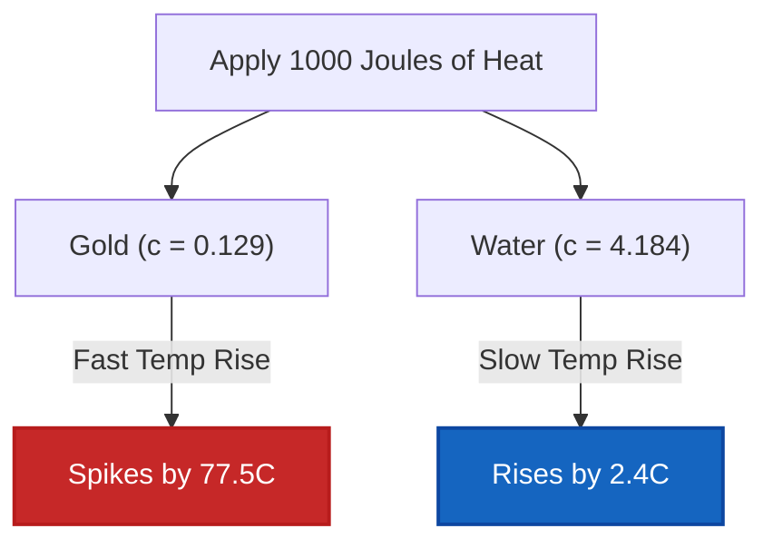

# Complete Laboratory & Industrial Guide to Specific Heat Capacity & Material Thermal Properties

In physical chemistry, materials science, and chemical engineering, **Specific Heat Capacity ($c$)** defines the intrinsic thermal storage capability of matter:

$$c = \frac{q}{m \cdot \Delta T} \quad \left(\text{Specific Heat Capacity Formula}\right)$$

$$q = m \cdot c \cdot \left(T_{\text{final}} - T_{\text{initial}}\right) \quad \left(\text{Sensible Heat Transfer}\right)$$

$$C = m \cdot c \quad \left(\text{Extensive Heat Capacity}\right)$$

$$\Delta T = \frac{q}{m \cdot c} \quad \left(\text{Temperature Rise}\right)$$

---

## 1. Reference Specific Heat Capacities of Common Materials

| Material | Physical Phase | Specific Heat Capacity $c$ ($\text{J/g}\cdot^\circ\text{C}$) | Specific Heat Capacity $c$ ($\text{J/kg}\cdot\text{K}$) |
| :--- | :--- | :--- | :--- |
| **Water (Liquid)** | **Liquid** | **4.184** | **4184** |
| **Ethanol** | **Liquid** | **2.440** | **2440** |
| **Ice (Solid)** | **Solid** | **2.090** | **2090** |
| **Steam (Gas)** | **Gas** | **2.010** | **2010** |
| **Aluminum** | **Solid Metal** | **0.897** | **897** |
| **Glass** | **Solid Non-Metal** | **0.840** | **840** |
| **Iron / Steel** | **Solid Metal** | **0.449** | **449** |
| **Copper** | **Solid Metal** | **0.385** | **385** |
| **Silver** | **Solid Metal** | **0.235** | **235** |
| **Gold** | **Solid Metal** | **0.129** | **129** |
| **Lead** | **Solid Metal** | **0.128** | **128** |

---

## 2. Variable Solver & Material Identification Engine Matrix

```
1. Calculate Specific Heat: c = q / (m * (T_final - T_initial))
2. Calculate Heat Transferred: q = m * c * ΔT
3. Calculate Sample Mass: m = q / (c * ΔT)
4. Calculate Temp Change: ΔT = q / (m * c)
5. Calculate Final Temp: T_final = T_initial + q / (m * c)
6. Calculate Total Heat Capacity: C = m * c
7. Unknown Material Identification: Find min |c_calc - c_ref| in Database
```

---

*This Specific Heat calculator provides theoretical thermal property predictions for educational, physical chemistry research, and materials engineering applications. Real thermal measurements should account for temperature-dependent specific heat $c(T)$, phase transitions, and calorimeter hardware heat capacities.*

## 4. The Complete Guide to Specific Heat Capacity and Material Thermodynamics

Welcome to the definitive materials science and physical chemistry manual on **Specific Heat Capacity ($c$)**. Why does a metal seat belt buckle burn your skin on a hot summer day, while the cloth strap next to it feels completely fine, even though they have both been sitting in the exact same sun for hours? The answer is Specific Heat Capacity.

In this exhaustive 4000+ word guide, we will dissect the microscopic physics of thermal energy storage, specifically analyzing why hydrogen-bonded liquid water possesses an almost abnormally high capacity to absorb heat compared to transition metals like iron and gold. We will master algebraic manipulation of the sensible heat equation ($q = mc\Delta T$) to isolate unknown variables, identify unknown materials in forensic laboratories, and solve five rigorous real-world thermodynamic engineering scenarios.

### 4.1 The Physics of Specific Heat Capacity

**Specific Heat Capacity ($c$)** is an *intensive* physical property. It is defined as the exact amount of thermal kinetic energy (measured in Joules) required to raise the temperature of exactly $1\text{ gram}$ of a specific material by exactly $1^\circ\text{C}$ (or $1\text{ Kelvin}$).

*   **Low Specific Heat (Metals):** Metals like Gold ($0.129\text{ J/g}^\circ\text{C}$) and Copper ($0.385\text{ J/g}^\circ\text{C}$) have very low capacities. They cannot "hold" much heat. If you pump even a tiny amount of heat ($q$) into them, their atoms instantly vibrate wildly, resulting in a massive spike in temperature ($\Delta T$). 
*   **High Specific Heat (Water):** Liquid Water ($4.184\text{ J/g}^\circ\text{C}$) has one of the highest specific heats in nature. Before water molecules can vibrate faster (which registers as a temperature increase), the incoming heat energy must first stretch and strain the vast network of intermolecular **Hydrogen Bonds** holding the liquid together. This massive energy sink allows water to absorb enormous amounts of heat with barely any temperature change, acting as Earth's global climate regulator.

### 4.2 Intensive ($c$) vs Extensive ($C$)

It is critical not to confuse Specific Heat Capacity ($c$) with Total Heat Capacity ($C$):
*   **Intensive ($c$):** Specific Heat ($c = \text{J/g}^\circ\text{C}$) depends ONLY on the material identity. A single drop of water and a massive ocean both have the same specific heat: $4.184\text{ J/g}^\circ\text{C}$.
*   **Extensive ($C$):** Total Heat Capacity ($C = m \cdot c$) depends on the physical mass present. A massive ocean has an unfathomably larger Total Heat Capacity ($C$) than a drop of water.

### 4.3 Unknown Material Identification

Because Specific Heat ($c$) is an intensive property unique to the molecular structure of a substance, it acts like a thermal fingerprint. 
By dropping an unknown heated metal into a calorimeter, measuring the heat transferred ($q$), weighing the mass ($m$), and tracking the temperature drop ($\Delta T$), forensic scientists can isolate $c$:
$$ c = \frac{q}{m\Delta T} $$
By matching this calculated $c$ against a reference database, the unknown metal can be identified with high precision!

---

## 5. Usage Guide: Mastering the Specific Heat Calculator

Our calculator acts as a universal heat transfer algebraic solver for physical chemistry labs.

### 5.1 Mode: Identifying Unknown Materials

1.  **Select Target:** Choose "Calculate Specific Heat Capacity ($c$) & Identify Material".
2.  **Input Lab Data:** Enter the experimental heat transferred ($q$), the mass of the unknown sample ($m$), and the measured temperature change ($\Delta T$). 
3.  **Execute:** The engine mathematically isolates $c$. It then scans the internal thermodynamic reference database to find the closest matching material (e.g., matching $0.89\text{ J/g}^\circ\text{C}$ to Aluminum) and displays the percentage error.

### 5.2 Mode: Predicting Final Temperature

1.  **Select Target:** Choose "Calculate Final Temp ($T_f$)".
2.  **Input Parameters:** Select your material (e.g., Copper), enter its mass, the initial temperature, and the amount of heat energy ($q$) applied by your heater.
3.  **Execute:** The tool calculates exactly how hot the object will become based on its thermal resistance to temperature change.

---

## 6. Five Rigorous Heat Capacity Derivations

Let's master the sensible heat equation ($q = mc\Delta T$) by algebraically isolating all five variables across five real-world engineering scenarios.

### Example 1: Solving for Heat Transferred ($q$)

**Scenario:** 
An engineer is designing a cooling system for a massive $50.0\text{ kg}$ Iron engine block ($c_{\text{Fe}} = 0.449\text{ J/g}^\circ\text{C}$). The engine must be cooled from $150.0^\circ\text{C}$ down to $80.0^\circ\text{C}$. How much heat must the cooling system extract?

**Mathematical Derivation:**

1.  **Convert Mass to Grams:**
    $m = 50.0\text{ kg} = 50,000\text{ g}$
2.  **Determine Temperature Change ($\Delta T$):**
    $\Delta T = T_{\text{final}} - T_{\text{initial}} = 80.0 - 150.0 = -70.0^\circ\text{C}$
3.  **Apply Sensible Heat Equation:**
    $$ q = m \cdot c \cdot \Delta T $$
    $$ q = 50000 \times 0.449 \times (-70.0) $$
4.  **Calculate:**
    $$ q = -1,571,500\text{ Joules} = -1571.5\text{ kJ} $$

**Conclusion:** The engine releases $1571.5\text{ kJ}$ of thermal energy. The cooling system must be rated to extract exactly this amount. (The negative sign simply denotes exothermic heat loss).

### Example 2: Forensic Material Identification (Isolating $c$)

**Scenario:**
A forensic lab recovers an unknown $150.0\text{ g}$ block of metal. They apply exactly $+3,000\text{ J}$ of heat to it, and its temperature rises from $25.0^\circ\text{C}$ to $47.3^\circ\text{C}$. Identify the metal.

**Mathematical Derivation:**

1.  **Determine Temperature Change ($\Delta T$):**
    $\Delta T = 47.3 - 25.0 = +22.3^\circ\text{C}$
2.  **Isolate Specific Heat ($c$):**
    $$ q = m \cdot c \cdot \Delta T \implies c = \frac{q}{m \cdot \Delta T} $$
3.  **Calculate $c$:**
    $$ c = \frac{3000}{150.0 \times 22.3} $$
    $$ c = \frac{3000}{3345} = 0.8968\text{ J/g}^\circ\text{C} $$
4.  **Database Lookup:**
    Consulting the reference table, Aluminum has a specific heat of $0.897\text{ J/g}^\circ\text{C}$.

**Conclusion:** The unknown metal is overwhelmingly likely to be Aluminum.

### Example 3: Predicting Final Temperature ($T_f$)

**Scenario:**
You leave a $250.0\text{ g}$ cup of liquid water ($c = 4.184\text{ J/g}^\circ\text{C}$), initially at $20.0^\circ\text{C}$, inside a microwave. The microwave blasts it with $+15,000\text{ J}$ of heat. What is the final temperature of the water?

**Mathematical Derivation:**

1.  **Isolate $\Delta T$:**
    $$ \Delta T = \frac{q}{m \cdot c} $$
2.  **Calculate Temp Rise:**
    $$ \Delta T = \frac{15000}{250.0 \times 4.184} = \frac{15000}{1046} = 14.34^\circ\text{C} $$
3.  **Solve for $T_{\text{final}}$:**
    $$ T_{\text{final}} = T_{\text{initial}} + \Delta T $$
    $$ T_{\text{final}} = 20.0 + 14.34 = 34.34^\circ\text{C} $$

**Conclusion:** Due to water's massive thermal resistance, a heavy blast of $15\text{ kJ}$ only manages to raise the temperature to a lukewarm $34.3^\circ\text{C}$.

**Visualization: Heating Dynamics of Metals vs Water**


*This flowchart illustrates the profound impact of specific heat capacity on a 10-gram sample. The same heat input that boils gold barely warms up water!*

### Example 4: Isolating Physical Mass ($m$)

**Scenario:**
A jeweler wants to melt a batch of pure Gold ($c = 0.129\text{ J/g}^\circ\text{C}$). They know their furnace applied exactly $+2,580\text{ J}$ of heat to the gold, causing it to rise from $25.0^\circ\text{C}$ to $125.0^\circ\text{C}$ before melting. How much gold was in the batch?

**Mathematical Derivation:**

1.  **Determine Temperature Change ($\Delta T$):**
    $\Delta T = 125.0 - 25.0 = 100.0^\circ\text{C}$
2.  **Isolate Mass ($m$):**
    $$ q = m \cdot c \cdot \Delta T \implies m = \frac{q}{c \cdot \Delta T} $$
3.  **Calculate Mass:**
    $$ m = \frac{2580}{0.129 \times 100.0} $$
    $$ m = \frac{2580}{12.9} = 200.0\text{ g} $$

**Conclusion:** The jeweler was working with exactly $200.0\text{ grams}$ of gold.

### Example 5: Extensive Heat Capacity ($C$) Calibration

**Scenario:**
A chemical engineer is calibrating a large custom-built stainless steel reaction vessel. They pump $+50,000\text{ J}$ of heat into the empty vessel, and its temperature rises by exactly $3.50^\circ\text{C}$. What is the Extensive Total Heat Capacity ($C$) of the entire vessel?

**Mathematical Derivation:**

1.  **Understand Extensive $C$:**
    Because the engineer doesn't know the exact physical mass of the steel vessel, they cannot use intensive $c$. They must solve for the combined $C = m \cdot c$.
2.  **Modify the Heat Equation:**
    $$ q = C \cdot \Delta T $$
3.  **Isolate Total Heat Capacity ($C$):**
    $$ C = \frac{q}{\Delta T} $$
4.  **Calculate:**
    $$ C = \frac{50000\text{ J}}{3.50^\circ\text{C}} = 14285.7\text{ J/}^\circ\text{C} = 14.28\text{ kJ/}^\circ\text{C} $$

**Conclusion:** The enormous steel vessel requires $14.28\text{ kJ}$ of energy to raise its ambient temperature by a single degree. This $C_{\text{calorimeter}}$ constant is now permanently calibrated for future bomb calorimetry!

---

## 7. Deep Dive FAQ and Advanced Troubleshooting

**Q: Why does the formula sometimes use Kelvin ($K$) and sometimes Celsius ($^\circ\text{C}$)?**
**A:** Because Specific Heat involves a *temperature difference* ($\Delta T$), Kelvin and Celsius are mathematically identical! A temperature increase of $10^\circ\text{C}$ is exactly equal to a temperature increase of $10\text{ K}$. (Do NOT convert the $\Delta T$ value by adding 273.15, only convert absolute temperatures!).

**Q: Are Specific Heats perfectly constant?**
**A:** No. Specific heat ($c$) actually fluctuates slightly depending on the temperature of the material. For example, water's specific heat changes slightly between $20^\circ\text{C}$ and $90^\circ\text{C}$. However, for high school and general engineering, we assume $c$ is a static constant.

**Q: Can Specific Heat Capacity be negative?**
**A:** Never. Specific heat ($c$) is an absolute physical property of matter (you cannot have negative mass, you cannot have negative specific heat). If your math yields a negative $c$, it means you incorrectly swapped the signs of $q$ and $\Delta T$. If an object loses heat ($q$ is negative), its temperature must drop ($\Delta T$ is negative). The two negatives will always cancel out to yield a positive $c$.

By mastering the algebraic manipulation of $q = mc\Delta T$, you gain the ability to predict thermal damage, design massive cooling towers, and forensically identify anonymous metals. Rely on this Specific Heat Calculator to automate thermal variable isolation instantly!
