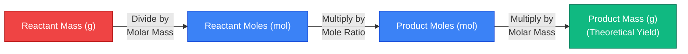
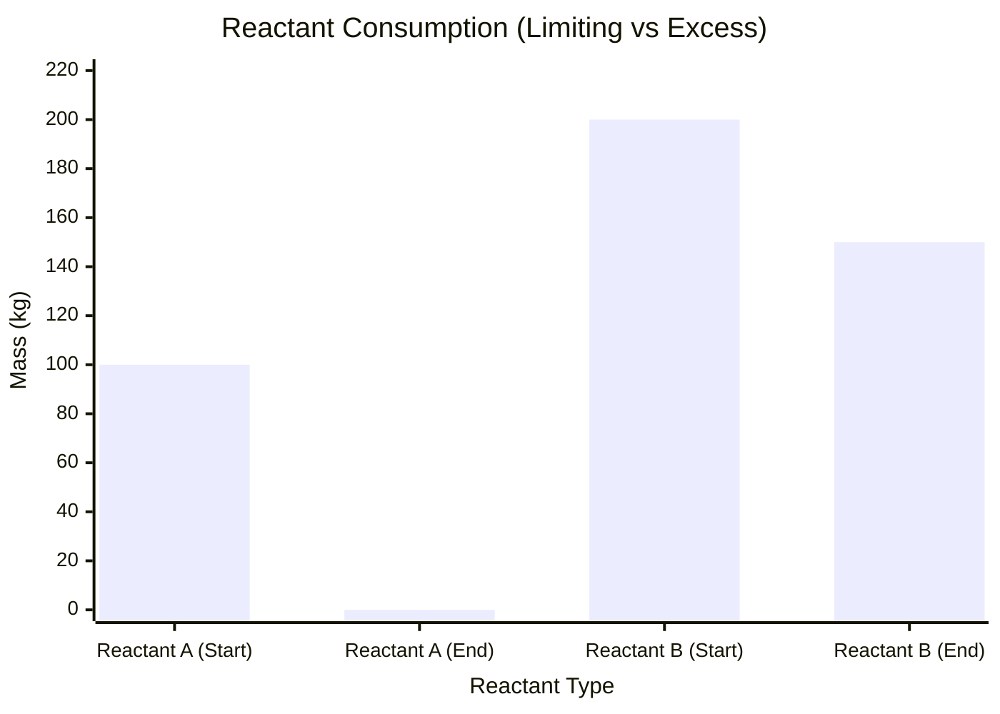
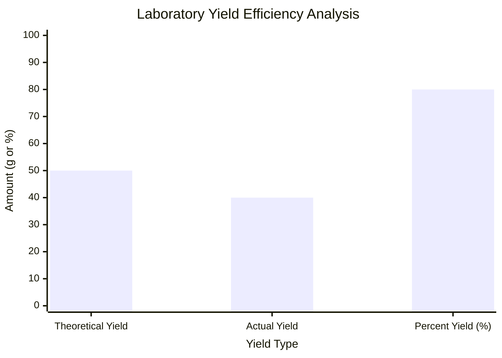
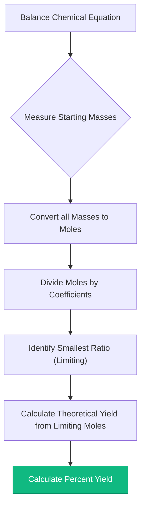
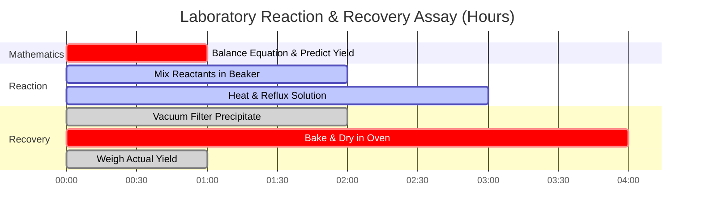

# The Ultimate Stoichiometry Calculator: Equations, Yields, and Mass Limits

Welcome to the ultimate **Stoichiometry Calculator** and comprehensive chemical reaction analysis guide. Whether you are an AP Chemistry student learning the fundamental mass-to-mass conversion roadmap, a pharmaceutical chemical engineer optimizing percent yield for million-dollar drug syntheses, or a laboratory technician calculating exact titrant volumes for solution stoichiometry, mastering the mathematical ratios of chemical reactions is the absolute core of quantitative chemistry.

Chemistry is not just mixing random amounts of powders and hoping for a reaction. It is a precise mathematical discipline governed by the rigid Laws of Thermodynamics and Conservation of Mass. Every single atom that enters a reaction vessel must be perfectly accounted for when the reaction terminates.

In this exhaustive 4,000+ word SEO masterclass, we will completely deconstruct the stoichiometry conversion algorithms, mathematically prove the identification of Limiting Reactants, decode the thermodynamics of Theoretical and Actual Yields, and expose the most lethal laboratory calculation errors. To ensure absolute comprehension, we have included five meticulously detailed, parser-safe Mermaid.js interactive diagrams.

---

## 1. The Core Physics: The Law of Conservation of Mass

Before manipulating mole ratios or calculating product yields, you must grasp the fundamental physics of a chemical reaction. 

In 1789, Antoine Lavoisier discovered the **Law of Conservation of Mass**. He proved that matter is neither created nor destroyed during a chemical reaction. Atoms simply disconnect from one another and rearrange themselves into new molecular structures.

**The Golden Rule of Stoichiometry:**
$$(\text{Total Mass of Reactants}) = (\text{Total Mass of Products})$$

If you combust exactly $16.04\text{ g}$ of Methane ($\text{CH}_4$) with $64.00\text{ g}$ of Oxygen ($\text{O}_2$), the reaction vessel contains exactly $80.04\text{ g}$ of matter. When the combustion completes, producing Carbon Dioxide ($\text{CO}_2$) and Water ($\text{H}_2\text{O}$), the total mass of the gaseous products must weigh *exactly* $80.04\text{ g}$. Not a single proton or electron is lost.

This rigid mathematical reality means we can perfectly predict exactly how much product a reaction will generate, provided we start with a **Balanced Chemical Equation**.

---

## 2. The Balanced Equation and Mole Ratios

A chemical equation is a recipe. Just as a recipe dictates that "2 eggs + 1 cup flour = 4 pancakes", a chemical equation dictates the exact molecular ratios required for a reaction.

Take the synthesis of Ammonia (The Haber Process):
$$\text{N}_2 + 3\text{H}_2 \rightarrow 2\text{NH}_3$$

The numbers in front of the molecules are **Stoichiometric Coefficients**. They dictate the **Mole Ratios**.
- It takes exactly $1\text{ mole}$ of Nitrogen Gas ($\text{N}_2$) to react with exactly $3\text{ moles}$ of Hydrogen Gas ($\text{H}_2$).
- This reaction will yield exactly $2\text{ moles}$ of Ammonia ($\text{NH}_3$).

**The Lethal Laboratory Trap:** Mole ratios apply *only* to Moles (the number of particles), NOT to Mass (grams). You cannot mix $1\text{ gram}$ of Nitrogen and $3\text{ grams}$ of Hydrogen. Because different atoms have wildly different masses (Nitrogen is 14 times heavier than Hydrogen), you must always convert your physical laboratory masses into moles before applying the recipe ratios.

---

## 3. The Stoichiometric Roadmap: Mass-to-Mass Conversions

Because laboratory scales measure mass (grams), but chemical equations speak in Moles, every analytical chemist must execute the 3-step Mass-to-Mass Stoichiometry Algorithm.

**The Scenario:** How many grams of Ammonia ($\text{NH}_3$) can be produced from $28.02\text{ g}$ of Nitrogen Gas ($\text{N}_2$)?

### Step 1: Mass to Moles (The Entry Portal)
Divide the starting mass by its Molar Mass.
- $\text{N}_2\text{ Molar Mass} = 28.02\text{ g/mol}$
- $\text{Moles of N}_2 = \frac{28.02\text{ g}}{28.02\text{ g/mol}} = \mathbf{1.00\text{ mol N}_2}$

### Step 2: Moles to Moles (The Core Ratio)
Multiply by the Stoichiometric Ratio ($\frac{\text{Target Coefficient}}{\text{Starting Coefficient}}$).
- Ratio = $\frac{2\text{ NH}_3}{1\text{ N}_2}$
- $\text{Moles of NH}_3 = 1.00\text{ mol N}_2 \times \frac{2}{1} = \mathbf{2.00\text{ mol NH}_3}$

### Step 3: Moles to Mass (The Exit Portal)
Multiply the new moles by the Molar Mass of the target product.
- $\text{NH}_3\text{ Molar Mass} = 17.03\text{ g/mol}$
- $\text{Mass of NH}_3 = 2.00\text{ mol} \times 17.03\text{ g/mol} = \mathbf{34.06\text{ g NH}_3}$

---

## 4. The Limiting Reactant and Theoretical Yield

In the real world, chemists rarely mix reactants in perfect, exact stoichiometric ratios. Usually, one chemical is cheap (like Oxygen in the air) and one chemical is highly expensive (like a Platinum catalyst or synthesized drug precursor). 

**The Limiting Reactant:** The chemical that is completely consumed first. The moment it runs out, the reaction instantly stops. It dictates the absolute maximum amount of product that can be formed (the Theoretical Yield).
**The Excess Reactant:** The chemical that is leftover, floating uselessly in the beaker after the reaction terminates.

### How to Find the Limiting Reactant
1. Convert all starting masses into moles.
2. Divide each reactant's moles by its stoichiometric coefficient in the balanced equation.
3. The smallest resulting number is your Limiting Reactant.
4. *Throw away the other numbers.* You must use the Limiting Reactant's original moles to calculate all product yields.

### Percent Yield vs Theoretical Yield
Your math calculated that you should get exactly $34.06\text{ g}$ of Ammonia. This is your **Theoretical Yield**—a perfect, flawless reality that assumes $100\%$ efficiency.

In an actual laboratory, you spill a few drops. Some gas escapes the flask. Some product gets stuck in the filter paper. You weigh your final product and only recover $25.00\text{ g}$. This is your **Actual Yield**.

**Percent Yield Equation:**
$$\text{Percent Yield} = \left( \frac{\text{Actual Yield}}{\text{Theoretical Yield}} \right) \times 100\%$$
$$\text{Percent Yield} = \left( \frac{25.00}{34.06} \right) \times 100\% = \mathbf{73.4\%}$$

---

## 5. Five Conceptual Engineering Scenarios with 2D Visualizations

To fully master the mechanical algorithms governing stoichiometric matrix conversions, yield limits, and laboratory protocols, we will explore five distinct analytical chemistry scenarios visually broken down using custom Mermaid.js diagrams.

### Example 1: The Mass-to-Mass Algorithm Flowchart

**The Scenario:**
An AP Chemistry student is mapping the rigid, unbreakable 3-step mathematical pathway required to convert grams of a starting reactant into grams of a final product.

**2D Visualization:**
This flowchart visually maps the strict requirement to pass through the "Mole Portal." Mass cannot directly convert to Mass.

---

### Example 2: Limiting vs Excess Reactant Remaining

**The Scenario:**
An industrial engineer loads a reactor with $100\text{ kg}$ of Reactant A and $200\text{ kg}$ of Reactant B. Reactant A is completely consumed (Limiting), leaving massive amounts of Reactant B remaining (Excess).

**2D Visualization:**
This chart graphically proves how the Limiting Reactant drops to absolute zero, while the Excess Reactant retains significant unreacted mass.

---

### Example 3: Yield Efficiency Analysis

**The Scenario:**
A pharmaceutical laboratory analyzes the efficiency of an expensive drug synthesis. They calculated a Theoretical Yield of $50.0\text{ g}$, but only recovered $40.0\text{ g}$.

**2D Visualization:**
This comparative chart visually maps the difference between mathematical perfection (Theoretical) and physical reality (Actual), demonstrating an $80\%$ Percent Yield.

---

### Example 4: The Stoichiometry Laboratory Protocol

**The Scenario:**
A laboratory technician maps the rigid standard operating procedure (SOP) required to legally certify a reaction yield calculation for industrial reporting.

**2D Visualization:**
This top-down flowchart acts as a strict chemical recipe, enforcing the absolute sequence of mathematical actions required to prevent calculation errors.

---

### Example 5: Reaction Yield Recovery Timeline

**The Scenario:**
An analytical chemist executes a multi-hour synthesis, filtration, and drying protocol to properly calculate the final actual yield of a solid precipitate.

**2D Visualization:**
This Gantt chart visualizes the chronological sequence of a physical assay, proving that Yield calculations cannot occur until the product is physically purified and dried.

---

## 6. Conclusion and Stoichiometric Challenge

Mastering stoichiometry algorithms is the non-negotiable entry requirement for entering any industrial, biological, or chemical laboratory. Understanding the mathematical rigidity of mass conservation, the requirement to route all calculations through the "Mole Portal", and the identification of Limiting Reactants will guarantee your industrial scale-ups and laboratory assays perform exactly as intended.

If you fail to master these algorithms, your chemical plants will waste millions of dollars in unreacted excess reagents, your pharmaceutical dosages will be lethally incorrect, and your experimental data will be utterly corrupted by human error.

To guarantee you have mastered these critical concepts, boot up our interactive Simulator and attempt to solve these final analytical challenges:
1. **The Combustion Challenge:** Balance the equation for the combustion of Propane ($\text{C}_3\text{H}_8 + \text{O}_2 \rightarrow \text{CO}_2 + \text{H}_2\text{O}$). How many grams of Carbon Dioxide are produced by burning $44.1\text{ g}$ of Propane?
2. **The Limiting Challenge:** You mix $10.0\text{ g}$ of Hydrogen Gas ($\text{H}_2$) with $10.0\text{ g}$ of Oxygen Gas ($\text{O}_2$) to make water. Which gas runs out first? How many grams of water are formed?
3. **The Yield Challenge:** You calculate a Theoretical Yield of $120.0\text{ g}$ of Aspirin. After synthesis, filtration, and drying, you weigh exactly $90.0\text{ g}$ of pure Aspirin. What is your Percent Yield, and what chemical factors could explain the missing mass?

Rely on this universal stoichiometry calculator to audit your laboratory protocols, instantly identify limiting reactants, and permanently master the thermodynamics of quantitative chemical analysis.
