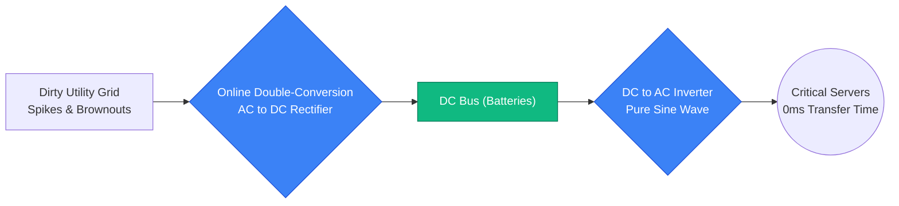
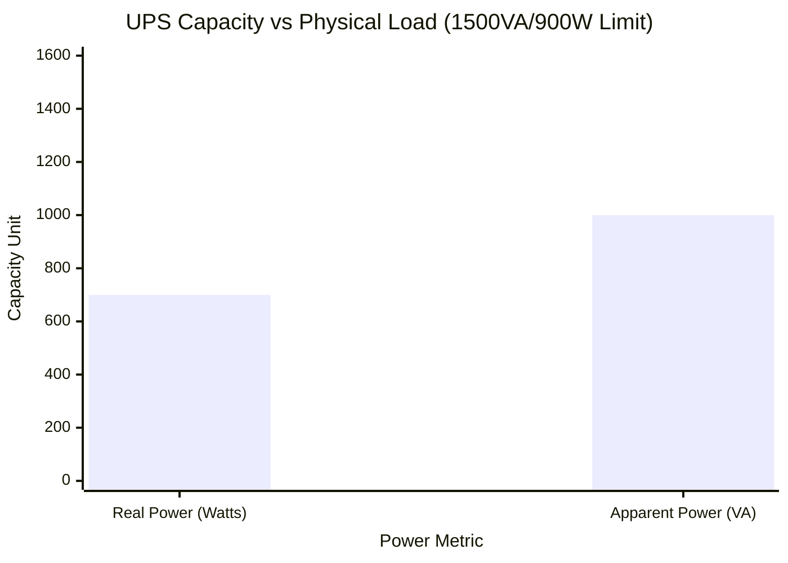
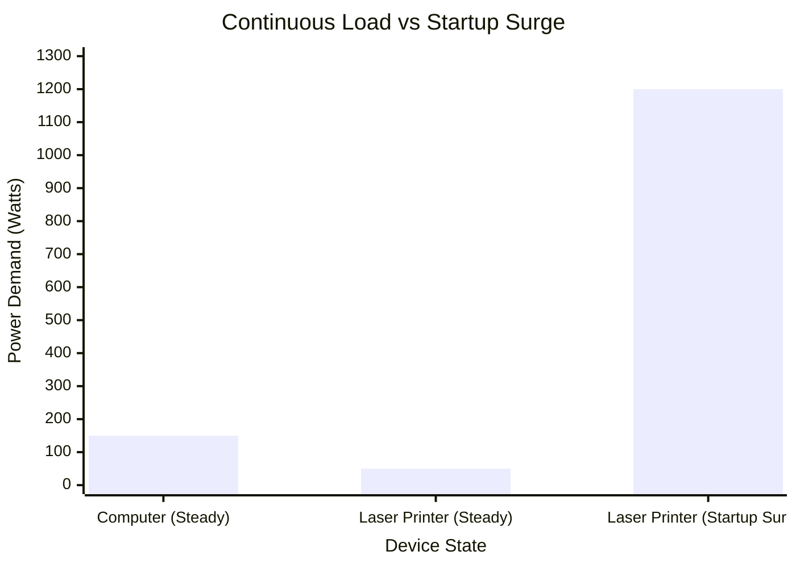
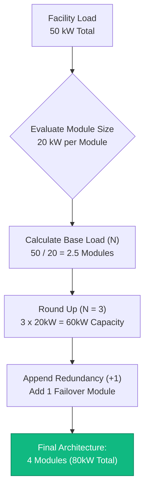
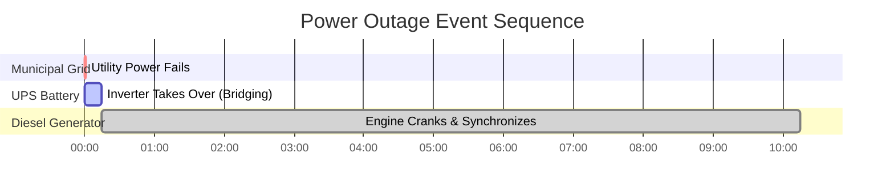

# The Definitive UPS Calculator: Sizing, Runtime, and N+1 Redundancy

Welcome to the ultimate **UPS Calculator** and comprehensive uninterruptible power supply engineering guide. Whether you are an IT administrator sizing a massive $40\text{kVA}$ N+1 modular rack for a data center, an electrician evaluating standby generator compatibility, or a gamer trying to protect a $1000\text{W}$ PC from brownouts, mastering UPS electrical physics is absolutely essential.

A UPS (Uninterruptible Power Supply) is not just a simple battery in a plastic box. It is a highly complex electro-mechanical bridge designed to protect sensitive silicon from violent voltage spikes, harmonic distortion, and total utility grid failure. If you incorrectly calculate the difference between **Real Power (Watts)** and **Apparent Power (VA)**, you will permanently overload the inverter. If you misunderstand the difference between Offline and Online Double-Conversion topologies, your servers will violently reboot during the $4\text{ms}$ transfer delay.

In this exhaustive 4,000+ word SEO masterclass, we will deconstruct the fundamental Watts vs VA trigonometry, expose the dangers of laser printer startup surges, decode the engineering mathematics required to calculate precise battery backup runtimes, and mathematically prove the concept of N+1 Fault Tolerant Redundancy. To ensure you completely grasp these engineering concepts, we have included five meticulously detailed, parser-safe Mermaid.js interactive diagrams.

---

## 1. The Physics of UPS Sizing (Watts vs VA)

The absolute most critical concept in UPS engineering is understanding why electrical loads have two different power ratings: **Watts (W)** and **Volt-Amperes (VA)**.

1. **Real Power (Watts):** This represents the actual, real work being done by the equipment. It generates heat and computation.
2. **Apparent Power (VA):** This represents the total electrical demand placed on the UPS inverter. Due to the physics of alternating current (AC) and **Power Factor (PF)**, inductive and capacitive loads force the UPS to push and pull "phantom" reactive power. 

**The Power Factor Equation:**
$$\text{Power Factor (PF)} = \frac{\text{Real Power (Watts)}}{\text{Apparent Power (VA)}}$$

Therefore:
$$\text{Apparent Power (VA)} = \frac{\text{Watts}}{\text{Power Factor}}$$

**Why Does This Matter?**
A UPS is rigidly rated for BOTH maximum Watts and maximum VA. You cannot exceed either limit. 
For example, a common office UPS is rated for $1500\text{ VA}$ and $900\text{ Watts}$.
- If you plug in a $950\text{W}$ space heater (which has a $1.0\text{ PF}$, so it is $950\text{ VA}$), you have not exceeded the $1500\text{ VA}$ limit, but you HAVE exceeded the $900\text{ W}$ limit. The UPS will scream and shut down.
- If you plug in multiple old fluorescent shop lights drawing $800\text{W}$ with a terrible $0.50\text{ PF}$, the VA is $1600\text{ VA}$ ($800 / 0.50$). You have not exceeded the $900\text{ W}$ limit, but you HAVE exceeded the $1500\text{ VA}$ limit. The UPS will scream and shut down.

*Engineering Note:* Modern computers with "Active PFC" power supplies have an excellent Power Factor of $0.95$ to $0.99$. This means their Watt and VA ratings are nearly identical.

---

## 2. Safety Headroom and Startup Surges

When calculating your total equipment load, you cannot size the UPS exactly to your mathematical total. You must engineer a **Safety Headroom Margin**.

1. **The $20\%$ Rule:** Industry standard dictates that a UPS should not operate at more than $80\%$ of its maximum rated capacity. This provides a $20\%$ headroom buffer to accommodate slight utility voltage fluctuations, battery aging, and the addition of minor USB devices.
2. **Startup Inrush Current:** Electric motors, refrigerator compressors, and heavy power supply capacitors draw massive surges of current the exact millisecond they are turned on. A $200\text{W}$ refrigerator may draw $1000\text{W}$ for half a second. A $500\text{W}$ gaming PC may draw $650\text{W}$ during boot.
3. **The Laser Printer Trap:** Never plug a laser printer into the battery-backup side of a UPS. Laser printers use fuser heating elements that instantly draw $1000\text{W}$ to $1500\text{W}$ when printing starts. This sudden surge will instantly overload and trip $99\%$ of consumer UPS units. Plug laser printers strictly into the "Surge Only" outlets.

---

## 3. Demystifying UPS Topologies: Offline vs Line-Interactive vs Online

Not all UPS units are built the same. The internal circuitry (Topology) dictates how the UPS handles utility power, and how fast it switches to the battery during a blackout.

### 1. Offline / Standby UPS
This is the cheapest and most common home UPS. Under normal conditions, it simply passes the raw utility AC power straight through to your computer. When the grid fails, a mechanical relay clicks over to the battery inverter.
- **Transfer Time:** $4\text{ to }10\text{ milliseconds}$. (Fast enough for a PC, but a sensitive networking switch might reboot).
- **Voltage Regulation:** None. If the wall voltage drops to $105\text{V}$, your computer receives $105\text{V}$.

### 2. Line-Interactive UPS
The mid-tier standard for office servers and gaming PCs. It includes a massive transformer known as an Automatic Voltage Regulator (AVR). If the utility grid voltage sags (a brownout), the AVR mathematically boosts the voltage back to $120\text{V}$ without draining the internal battery.
- **Transfer Time:** $2\text{ to }4\text{ milliseconds}$.
- **Voltage Regulation:** Excellent. Prolongs battery lifespan heavily by avoiding unnecessary discharges during minor brownouts.

### 3. Online Double-Conversion UPS
The gold standard for data centers and hospitals. Incoming AC utility power is aggressively converted into DC power. This DC power charges the battery AND simultaneously feeds the inverter. The inverter converts the DC back into mathematically perfect, surgically clean AC power. Your equipment is physically isolated from the municipal utility grid.
- **Transfer Time:** $0\text{ milliseconds}$. (There is no switch. The inverter is always running).
- **Voltage Regulation:** Perfect.

---

## 4. Calculating Battery Backup Runtime

A UPS is designed to provide enough runtime to safely save your work and shut down gracefully, or bridge the gap until a diesel generator spins up. It is not designed to run a house for 12 hours.

**The Runtime Formula:**
$$\text{Estimated Runtime (Hours)} = \frac{\text{Battery Voltage} \times \text{Battery Ah} \times \text{Depth of Discharge (DoD)}}{\frac{\text{Load Watts}}{\text{Inverter Efficiency}}}$$

Most consumer UPS units contain small Sealed Lead-Acid (SLA) batteries. 
For example, a standard $1500\text{ VA}$ UPS typically contains two $12\text{V}$ $9\text{Ah}$ batteries wired in series ($24\text{V}$). 
- Total Energy = $24\text{V} \times 9\text{Ah} = 216\text{ Watt-hours}$.
- Usable Energy (accounting for high-speed discharge Peukert loss and inverter efficiency) is roughly $130\text{Wh}$.
- A $400\text{W}$ PC load will drain this UPS in roughly $20\text{ minutes}$.

---

## 5. Data Center N+1 Modular Redundancy

In enterprise IT, a single UPS represents a Single Point of Failure (SPOF). If the UPS internal inverter fails, the entire server rack loses power.

To solve this, data centers deploy **N+1 Redundant Modular UPS Arrays**.
- **N** represents the minimum number of independent UPS modules required to carry the full facility load.
- **+1** represents one extra, identical standby module.

If a server rack draws $30\text{ kW}$, and you use $10\text{ kW}$ UPS modules:
- You need $N = 3$ modules to carry the $30\text{ kW}$ load.
- You add $+1$ redundancy module, bringing the total to $4$ modules.
- If ANY single module catches fire, the remaining 3 modules seamlessly absorb the $30\text{ kW}$ load with zero downtime.

---

## 6. Five Conceptual Engineering Scenarios with 2D Visualizations

To fully master the physical relationships governing UPS systems, we will explore five distinct engineering scenarios visually broken down using custom Mermaid.js diagrams.

### Example 1: The Topologies Compared (Offline vs Online)

**The Scenario:**
An IT director needs to justify the massive cost difference between an Offline UPS and an Online Double-Conversion UPS.

**2D Visualization:**
This logic flowchart maps the physical flow of energy, clearly demonstrating how an Online UPS acts as a firewall between the dirty municipal grid and the sensitive servers.

---

### Example 2: The Capacity Bottleneck (Watts vs VA)

**The Scenario:**
A home user cannot figure out why his $1500\text{VA} / 900\text{W}$ UPS screams an overload warning when he connects $1000\text{VA}$ worth of low-power-factor electronics that only draw $700\text{W}$.

**The Mathematics:**
The load ($700\text{W}$, $1000\text{VA}$) is within the $900\text{W}$ limit, but dangerously close to the $1500\text{VA}$ apparent power limit when accounting for a $20\%$ safety margin ($1200\text{VA}$ requirement). 

**2D Visualization:**
This chart graphically plots the dual limits of the UPS against the physical load, proving that Apparent Power (VA) is just as critical as Real Power (Watts).

---

### Example 3: The Danger of the Laser Printer

**The Scenario:**
A receptionist plugs a $1200\text{W}$ laser printer into the battery-backup socket of a $600\text{W}$ office UPS. The UPS instantly trips and kills the adjacent desktop computer.

**The Mathematics:**
Continuous draw of a printer is $50\text{W}$. Fuser startup surge is $1200\text{W}$ for 1 second. The inverter physically cannot push $1200\text{W}$.

**2D Visualization:**
This chart plots the brutal reality of Inrush Surge Current, proving why mechanical motors and heating fusers must bypass the UPS battery inverter.

---

### Example 4: Calculating N+1 Modular Redundancy

**The Scenario:**
A data center architect must deploy enough $20\text{ kW}$ UPS modules to protect a $50\text{ kW}$ server suite while maintaining complete fault tolerance against a catastrophic module failure.

**2D Visualization:**
This top-down flowchart maps the strict mathematics required to evaluate load coverage, define the N requirement, and append the $+1$ failover module.

---

### Example 5: The Blackout Bridging Timeline

**The Scenario:**
An engineer must understand the exact sequence of events when the municipal grid fails, the UPS inverter takes over, and the backup diesel generator attempts to synchronize.

**2D Visualization:**
This Gantt chart brutally outlines the microscopic timeline of an electrical blackout, demonstrating how the UPS acts as the critical bridge spanning the 15-second gap before the diesel generator can provide stable power.

---

## 7. Conclusion and Engineering Challenge

Mastering UPS Sizing is the foundational bedrock of all enterprise IT and facility engineering. Understanding the vector trigonometry separating Watts and VA, respecting the brutal reality of startup surges, and designing fault-tolerant N+1 architectures will guarantee your systems survive any municipal blackout.

If you ignore these mathematical principles, your inverters will overload and shutdown during printer surges, your servers will spontaneously reboot during Line-Interactive transfer delays, and your single-module UPS will become the single point of failure that brings down your entire data center.

To guarantee you have mastered these critical concepts, boot up our interactive Simulator and attempt to solve these final challenges:
1. **The Overload Trap:** You have a $2000\text{VA} / 1200\text{W}$ UPS. You connect ten $150\text{W}$ old AC motors with a $0.60\text{ PF}$. Do you exceed the Watt rating or the VA rating?
2. **The Module Count:** Your server room draws $75\text{ kW}$. You are purchasing $25\text{ kW}$ modular UPS units. Exactly how many total modules must you install to achieve N+1 redundancy?
3. **The Battery Bridge:** A $1000\text{W}$ load is connected to a UPS containing four $12\text{V}$ $7\text{Ah}$ batteries wired in series. Assume an $85\%$ inverter efficiency and a $100\%$ discharge. Calculate the exact maximum theoretical runtime in minutes before total shutdown.

Rely on this calculator to audit your server racks, mathematically justify N+1 infrastructure upgrades, and permanently eliminate downtime.
