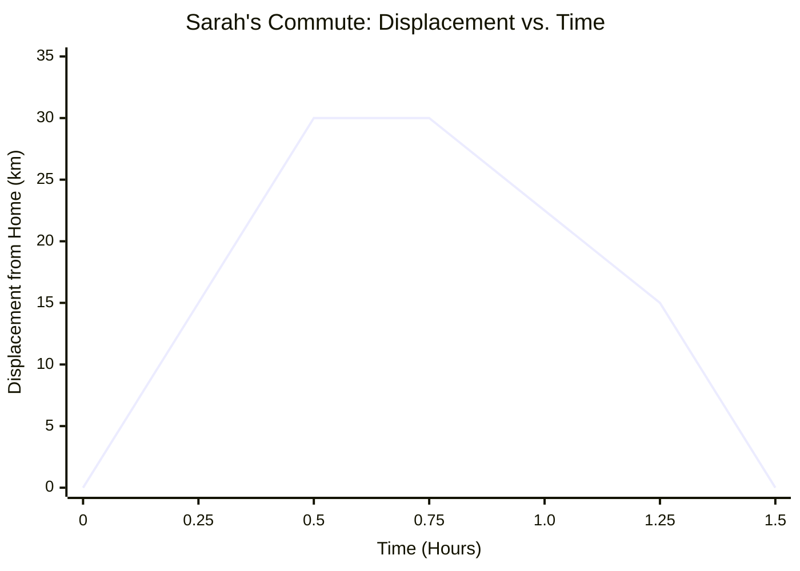
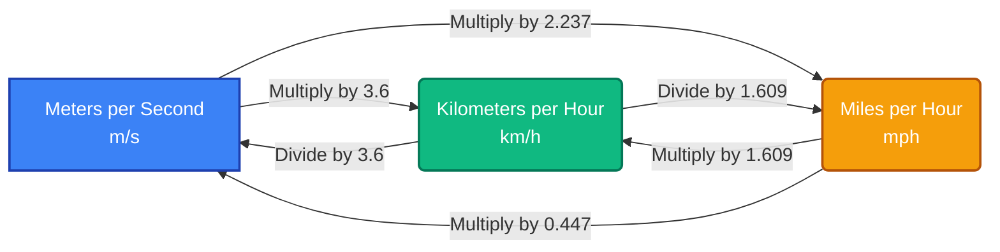
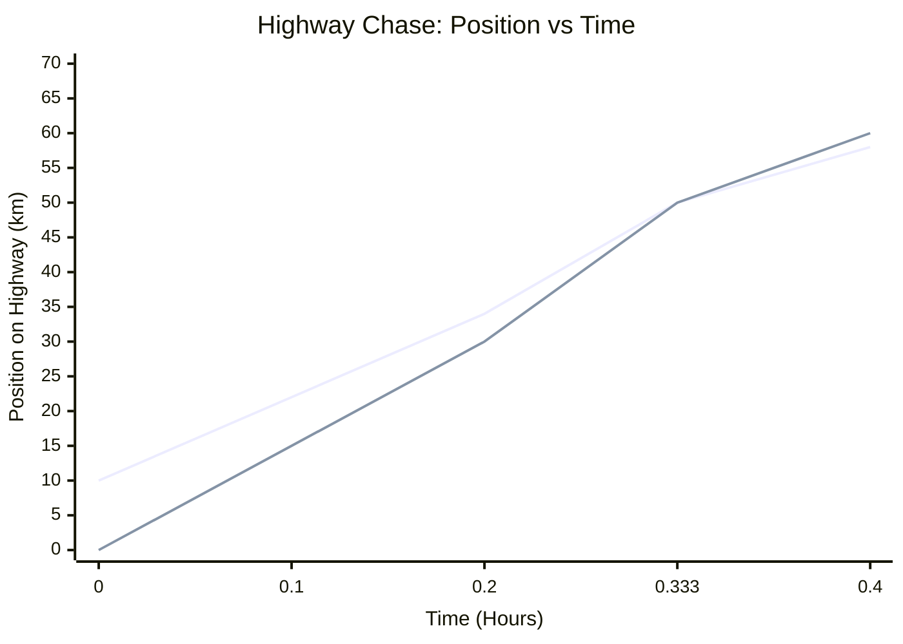
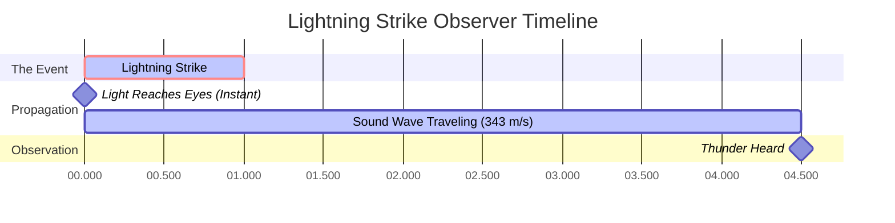
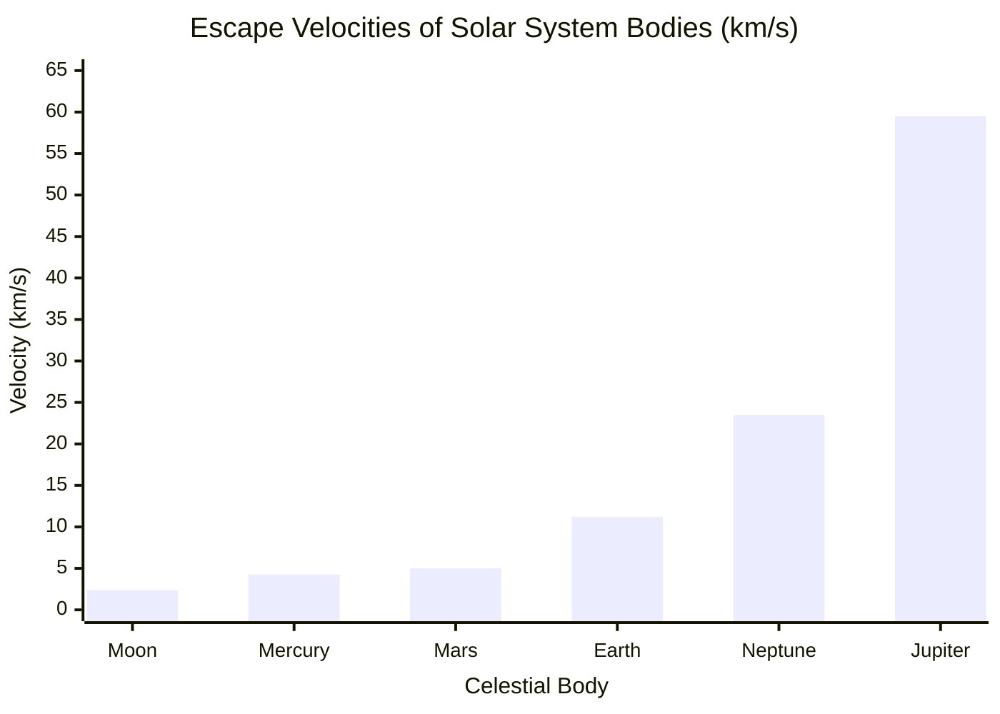

# The Ultimate Velocity Calculator: Mastering Speed, Distance, Time, and 1D Kinematics

Welcome to the most comprehensive, deeply interactive, and mathematically robust **Velocity Calculator** and guide available today. Whether you are a high school physics student tackling your first kinematics problems, an engineer calculating transit flow rates, an athlete optimizing your sprint pacing, or simply a curious mind wondering how to measure the speed of a falling object, this guide is built for you. 

Velocity is the very heartbeat of motion. It dictates how long it takes for light to reach us from the sun, how airplanes navigate atmospheric currents, and how cars brake safely at intersections. In this definitive 4,000+ word guide, we will break down the intricate mathematics of velocity, explore the critical differences between speed and velocity, provide a comprehensive usage guide for our calculator, and walk through five detailed, visualized conceptual examples using 2D diagrams. 

---

## 1. The Human Concept of Velocity: A Deep Explanation

Since the dawn of human civilization, understanding motion has been a matter of survival, exploration, and progress. Ancient hunters needed to estimate the speed of their prey and their projectiles. Early Polynesian navigators calculated average speeds across vast oceans using only the stars and the rhythm of the waves. But it wasn't until the scientific revolution—spearheaded by figures like Galileo Galilei and Sir Isaac Newton—that the concept of velocity was formalized into the strict mathematical framework we use today.

### Speed vs. Velocity: The Great Misunderstanding

In everyday conversation, you might hear people say, "The car's speed is 60 miles per hour," and "The car's velocity is 60 miles per hour," interchangeably. However, in the realm of physics, making this mistake is akin to confusing weight with mass—they are fundamentally different concepts.

**Speed is a Scalar Quantity.**
A scalar quantity is a measurement that only has magnitude (a number and a unit). It tells you "how fast" an object is moving, but it tells you absolutely nothing about where that object is going. If you are blindfolded in a car traveling at 100 km/h, you know your speed, but you do not know your destination. 

**Velocity is a Vector Quantity.**
A vector quantity contains both magnitude *and* direction. It tells you "how fast" AND "which way." If a car is traveling at 100 km/h North, that is its velocity. If the car turns a corner and begins traveling 100 km/h East, its *speed* has remained completely constant, but its *velocity* has fundamentally changed because the direction changed. 

This distinction becomes incredibly important when calculating averages. If you run one lap around a 400-meter circular track in 60 seconds and end up exactly where you started:
- Your **Average Speed** is Distance / Time = 400m / 60s = 6.67 m/s.
- Your **Average Velocity** is Displacement / Time = 0m / 60s = 0 m/s. 

Because your starting position and ending position are exactly the same, your net displacement is zero, and thus your average velocity over the entire trip is zero!

### The Core Equations of Motion

At its most fundamental level, average velocity ($v$) is calculated by dividing the change in position (displacement, $\Delta x$) by the change in time ($\Delta t$).

**The Fundamental Equation:**
$$ v = \frac{\Delta x}{\Delta t} = \frac{x_{final} - x_{initial}}{t_{final} - t_{initial}} $$

From this single, elegant algebraic relationship, we can derive the other two core variables. If you know how fast you are going and how long you travel, you can find the distance:
**Distance Equation:**
$$ d = v \times t $$

If you know how far you need to go and how fast you are traveling, you can find the time it will take:
**Time Equation:**
$$ t = \frac{d}{v} $$

### Instantaneous vs. Average Velocity

If you drive from New York to Boston (roughly 215 miles) in 4 hours, your average velocity is about 53.75 mph Northeast. However, it is highly unlikely you drove exactly 53.75 mph for four straight hours. You stopped at red lights (0 mph), accelerated on the highway (70 mph), and slowed down for traffic. 

The speedometer in your car does not show average velocity; it shows **instantaneous speed**—your speed at that exact, infinitesimally small fraction of a second. In calculus, instantaneous velocity is defined as the derivative of position with respect to time:
$$ v(t) = \lim_{\Delta t \to 0} \frac{\Delta x}{\Delta t} = \frac{dx}{dt} $$

Our velocity calculator is designed to handle average velocities and constant velocity scenarios, providing a solid foundation before advancing into accelerated kinematics.

---

## 2. Comprehensive Usage Guide: How to Use the Velocity Calculator

Our interactive Velocity Calculator is engineered to be as intuitive as a pocket calculator but as powerful as a physics engine. Here is a step-by-step guide to maximizing its features.

### Step 1: Select Your Target Variable
At the top of the calculator dashboard, you will find options to calculate **Velocity**, **Distance**, or **Time**. 
- If you are trying to find out how fast something was going, select **Velocity**. You will be prompted to input Distance and Time.
- If you want to know how far a train will travel given its speed and travel duration, select **Distance**. 
- If you are planning a road trip and need to know how long it will take to arrive at your destination based on your average speed, select **Time**.

### Step 2: Input Your Known Values and Select Units
The calculator features robust, automatic unit conversion. You do not need to convert your inputs manually before using the tool. 
- For **Distance**, you can input values in meters (m), kilometers (km), centimeters (cm), millimeters (mm), miles (mi), yards (yd), feet (ft), inches (in), or even nautical miles (nmi).
- For **Time**, you can input values in seconds (s), milliseconds (ms), minutes (min), hours (h), days, or even years.
- For **Velocity**, the tool accepts meters per second (m/s), kilometers per hour (km/h), miles per hour (mph), feet per second (ft/s), knots, and Mach (speed of sound).

Simply type your numbers into the fields and use the dropdown menus to select your units. The internal engine instantly converts everything to standard SI units (meters and seconds) for calculation, guaranteeing perfect accuracy, and then translates the result back into your desired output format.

### Step 3: Interpret the Results Dashboard
The moment you enter your second variable, the calculator instantly updates the **Results Dashboard**. You won't just get a single number; the dashboard provides:
- The primary calculated result in your requested unit.
- A table of equivalent values (e.g., if you calculate 100 km/h, it will simultaneously show you 62.1 mph, 27.7 m/s, and 91.1 ft/s).
- The kinetic energy of the object (if you switch to the advanced tab and input a mass).

### Step 4: Explore the Interactive Visualizations
Scroll down to the **Motion Timeline**. This interactive chart visually plots the displacement of the object over time. If you calculated velocity, the slope of the line on this graph represents the speed. A steeper slope means a higher velocity. You can use the slider to scrub through the timeline and see exactly where the object was at any given second.

### Step 5: Utilize the Comparison Matrix
Ever wondered how your calculated speed compares to a cheetah, a commercial jet, or the speed of sound? The **Comparison Matrix** at the bottom of the tool takes your result and graphs it on a logarithmic scale against known benchmarks, giving you a tangible, real-world context for the numbers you are crunching.

---

## 3. Five Conceptual Examples with 2D Visualizations

To truly master kinematics, one must move beyond plugging numbers into equations and begin visualizing the motion. Below, we present five detailed conceptual examples. Each example highlights a different aspect of velocity, complete with mathematical breakdowns and Mermaid.js 2D visualizations.

### Example 1: The Commuter's Dilemma (Calculating Average Speed vs. Velocity)

**The Scenario:**
Sarah commutes to work every day. Her office is 30 kilometers due East of her home. In the morning, there is light traffic, and it takes her 0.5 hours (30 minutes) to reach the office. In the evening, rush hour traffic is terrible, and the return trip takes her 1.0 hour (60 minutes). What is her average speed for the entire round trip, and what is her average velocity?

**The Mathematics:**
- **Morning Trip:** Distance = 30 km, Time = 0.5 h. Speed = 30 / 0.5 = 60 km/h.
- **Evening Trip:** Distance = 30 km, Time = 1.0 h. Speed = 30 / 1.0 = 30 km/h.
- **Total Round Trip Distance:** 30 km + 30 km = 60 km.
- **Total Round Trip Time:** 0.5 h + 1.0 h = 1.5 h.
- **Average Speed:** Total Distance / Total Time = 60 km / 1.5 h = 40 km/h.

Notice that the average speed (40 km/h) is NOT simply the average of the two speeds ((60+30)/2 = 45 km/h) because she spent twice as much time traveling at the slower speed!

- **Average Velocity:** Total Displacement / Total Time.
Since she started at home and ended at home, her total displacement is 0 km. 
Average Velocity = 0 km / 1.5 h = 0 km/h.

**2D Visualization:**
The following chart visualizes Sarah's displacement over time. Notice how the slope is steep going to work, and less steep (and negative) returning home.

---

### Example 2: The Athletics Sprint (Converting Units for Context)

**The Scenario:**
In 2009, Usain Bolt set the world record for the 100-meter dash with a time of 9.58 seconds. While 9.58 seconds is incredibly fast, "meters per second" doesn't always translate intuitively to the average person who drives a car measured in mph or km/h. Let's calculate his average velocity and convert it.

**The Mathematics:**
- Distance ($d$) = 100 m
- Time ($t$) = 9.58 s
- **Velocity in m/s:** $v = d / t = 100 / 9.58 = 10.44 \text{ m/s}$.

Now, let's convert this to kilometers per hour (km/h) and miles per hour (mph).
- **To km/h:** Multiply by 3.6. 
  $10.44 \times 3.6 = 37.58 \text{ km/h}$.
- **To mph:** Multiply by 2.237.
  $10.44 \times 2.237 = 23.35 \text{ mph}$.

While his *average* speed was 23.35 mph, his *instantaneous top speed* during the 60-80 meter split actually reached an astonishing 27.78 mph (44.72 km/h)!

**2D Visualization:**
The following flow diagram illustrates the conversion pipeline between common velocity units, acting as a visual reference for our calculator's backend logic.

---

### Example 3: The Highway Chase (Relative Velocity)

**The Scenario:**
A bank robber is fleeing the scene on a straight highway traveling East at a constant speed of 120 km/h. A police cruiser gets on the highway 10 kilometers behind the robber and pursues them traveling East at a constant speed of 150 km/h. How long will it take for the police to catch the robber, and how far will the police have traveled in that time?

**The Mathematics:**
This problem requires the concept of **Relative Velocity**. Because both vehicles are moving in the same direction, the rate at which the police cruiser closes the gap is the difference between their speeds.

- $v_{robber} = 120 \text{ km/h}$
- $v_{police} = 150 \text{ km/h}$
- Initial Separation Distance ($d$) = 10 km
- **Relative Velocity ($v_{rel}$):** $150 \text{ km/h} - 120 \text{ km/h} = 30 \text{ km/h}$.

The police cruiser is closing the distance at a rate of 30 km/h. 
- **Time to catch ($t$):** $t = d / v_{rel} = 10 \text{ km} / 30 \text{ km/h} = 0.333 \text{ hours}$ (which is exactly 20 minutes).

To find out how far the police traveled in those 20 minutes:
- $d_{police} = v_{police} \times t = 150 \text{ km/h} \times 0.333 \text{ h} = 50 \text{ km}$.

The police will catch the robber after traveling 50 kilometers.

**2D Visualization:**
This graph shows the absolute position of both vehicles over time. The point where the two lines intersect is the moment of capture.

*(Note: The first line represents the robber starting at 10km, the second line represents the police starting at 0km. They intersect exactly at 0.333 hours at the 50km mark).*

---

### Example 4: The Thunderstorm (Distance Calculation Using Sound and Light)

**The Scenario:**
You are sitting on your porch and see a flash of lightning. Exactly 4.5 seconds later, you hear the crack of thunder. Assuming the speed of sound in the current air temperature is 343 meters per second, how far away did the lightning strike? 

**The Mathematics:**
Light travels at roughly $300,000 \text{ km/s}$. For distances on Earth, the time it takes light to reach your eyes is so infinitesimally small that we can consider it instantaneous (zero seconds). Therefore, the 4.5 second delay is entirely due to the travel time of the sound waves.

- Speed of Sound ($v$) = 343 m/s
- Time Delay ($t$) = 4.5 s
- **Distance ($d$):** $d = v \times t = 343 \text{ m/s} \times 4.5 \text{ s} = 1543.5 \text{ meters}$.

Converting to kilometers, the lightning struck approximately **1.54 kilometers** away (or slightly less than 1 mile). This is the scientific basis for the old "count the seconds and divide by 3 for kilometers" rule of thumb ($4.5 / 3 = 1.5$).

**2D Visualization:**
This timeline visualization represents the delay between the event (the strike), the arrival of the light, and the propagation of the sound wave.

---

### Example 5: Space Exploration and Escape Velocity

**The Scenario:**
When engineers design rockets to send probes to Mars or the outer solar system, they aren't just calculating standard velocity; they must achieve **Escape Velocity**. This is the exact speed required for an object to overcome a planet's gravitational pull and venture into infinite space without falling back down. If a spacecraft launches from Earth, what speed must it achieve? What if it launched from the Moon?

**The Mathematics:**
The formula for escape velocity ($v_e$) is derived from the conservation of energy, equating kinetic energy to gravitational potential energy:
$$ v_e = \sqrt{\frac{2GM}{R}} $$
Where $G$ is the universal gravitational constant, $M$ is the mass of the planet, and $R$ is the radius of the planet. 

For Earth:
- Mass ($M$) $\approx 5.97 \times 10^{24} \text{ kg}$
- Radius ($R$) $\approx 6.37 \times 10^6 \text{ m}$
- $v_e \approx 11.2 \text{ km/s}$ (about 40,270 km/h or 25,000 mph).

For the Moon:
- Mass ($M$) $\approx 7.34 \times 10^{22} \text{ kg}$
- Radius ($R$) $\approx 1.74 \times 10^6 \text{ m}$
- $v_e \approx 2.38 \text{ km/s}$ (about 8,500 km/h or 5,300 mph).

Because the Moon is significantly less massive, its escape velocity is less than a quarter of Earth's. This is why the Apollo Lunar Module could launch back into space using a relatively tiny ascent engine, whereas the Saturn V rocket required to leave Earth was an absolute behemoth burning thousands of gallons of fuel per second.

**2D Visualization:**
The bar chart below compares the escape velocities of various planetary bodies in the solar system, emphasizing the immense energy required to leave larger bodies like Jupiter.

---

## 4. The Anatomy of Kinematics: Why Does Velocity Matter?

Understanding velocity is not just an academic exercise confined to physics classrooms; it is the fundamental metric that dictates human logistics, safety, and technological advancement. 

### Transportation and Logistics
In the global supply chain, time is money. Logistics companies use advanced velocity calculations to optimize shipping routes across oceans and highways. If a cargo ship travels from Shanghai to Los Angeles (approx 10,400 km), a speed increase from 18 knots to 22 knots shaves nearly four days off the transit time. However, fluid dynamics dictate that water resistance increases with the square of velocity, meaning that 22% increase in speed might require a 50% increase in fuel consumption. Transportation engineering is a constant optimization puzzle balancing velocity against cost.

### Automotive Safety and Kinetic Energy
Why are school zones set strictly to 20 mph (32 km/h), while highways allow 70 mph (112 km/h)? It all comes down to velocity and kinetic energy. The kinetic energy ($E_k$) of a moving object is calculated as:
$$ E_k = \frac{1}{2} m v^2 $$
Notice that velocity ($v$) is squared. If you double your speed in a car, you do not double your kinetic energy—you **quadruple** it. 

If a car traveling at 20 mph takes 40 feet to brake to a complete stop, that same car traveling at 40 mph will take roughly 160 feet to stop, and a car at 80 mph will take an astonishing 640 feet. This non-linear relationship is why speeding is overwhelmingly dangerous; the energy that must be dissipated by your brakes (or by the crumple zones in a crash) scales exponentially with velocity.

### Aviation and the Speed of Sound
Aviation engineers deal with velocity in three dimensions, accounting for airspeed, ground speed, and crosswinds. The most famous velocity barrier in aviation is the **Sound Barrier** (Mach 1). 
As an aircraft accelerates toward the speed of sound (approx 343 m/s at sea level), the air molecules in front of it cannot get out of the way fast enough. They compress, forming a massive shockwave. When Chuck Yeager broke the sound barrier in 1947 in the Bell X-1, it was a triumph of engineering overcoming the extreme drag and turbulence associated with trans-sonic velocities. Today, our velocity calculator includes "Mach" as a unit to let you compare everyday speeds to this historic threshold.

### Relativistic Velocity: The Universal Speed Limit
In classical Newtonian mechanics, velocity simply adds up. If you are on a train moving at 100 km/h and you throw a baseball forward at 50 km/h, an observer on the ground sees the baseball moving at 150 km/h. 

However, as we approach the speed of light ($c = 299,792,458 \text{ m/s}$), this classical addition breaks down. According to Albert Einstein's Theory of Special Relativity, the speed of light is absolute. If you are on a spaceship traveling at 99% the speed of light and turn on a flashlight pointing forward, the light does not travel at 199% the speed of light. It travels exactly at the speed of light. To compensate for this, time itself dilates (slows down) and length contracts for the moving observer. While our calculator sticks to classical kinematics, it's awe-inspiring to know that velocity fundamentally warps the fabric of spacetime.

---

## 5. Frequently Asked Questions (FAQ) Deep Dive

We have compiled the most common questions regarding velocity, speed, and their applications. This section expands upon the brief definitions provided in the calculator's quick-reference area.

**Q: Can you have a negative speed?**
**A:** No. Speed is a scalar quantity, meaning it is an absolute magnitude. You cannot travel at -10 mph. However, you **can** have a negative *velocity*. Because velocity is a vector, a negative sign simply indicates direction relative to a chosen coordinate system. If you define "North" as positive, then traveling "South" at 10 mph would be expressed mathematically as a velocity of -10 mph.

**Q: What is terminal velocity, and why does a falling object stop accelerating?**
**A:** If you drop a penny off a skyscraper in a perfect vacuum, it will accelerate endlessly at 9.81 m/s² until it hits the ground. However, on Earth, the atmosphere pushes back. As an object falls faster, the air resistance (drag) pushing up against it increases. Eventually, the upward force of drag perfectly equals the downward force of gravity. The net force becomes zero, meaning acceleration becomes zero. The object stops speeding up and falls at a constant, maximum speed known as terminal velocity. For a human skydiver falling belly-first, this is about 120 mph (193 km/h). For a compact, heavy object like a bowling ball, terminal velocity is much higher.

**Q: If the Earth is spinning and orbiting the sun, why don't we feel the velocity?**
**A:** Humans cannot feel velocity; we can only feel *acceleration* (changes in velocity). When you are sitting in a commercial airplane cruising smoothly at 500 mph, you can pour a cup of water easily because your body and the airplane are moving at a constant velocity. You only feel pushed into your seat when the plane accelerates down the runway. Similarly, the Earth rotates at roughly 1,000 mph at the equator and orbits the sun at an astonishing 67,000 mph. We don't feel this cosmic speed because it is a near-constant velocity, and we are moving right along with it.

**Q: How do police radar guns measure the velocity of a car?**
**A:** Police radar guns utilize the **Doppler Effect**. The gun fires a microwave radio signal at a specific frequency toward a moving car. The signal bounces off the car and returns to the gun. If the car is moving toward the gun, the returning waves are compressed (higher frequency). If the car is moving away, the waves are stretched (lower frequency). The radar gun's internal computer calculates the exact difference in frequency to instantaneously determine the vehicle's velocity.

**Q: Why do astronomers use "light-years" instead of kilometers?**
**A:** A light-year is actually a measure of *distance*, not time. It is defined by velocity: specifically, the distance that light (traveling at 299,792 km/s) covers in one Earth year. One light-year is approximately 9.46 trillion kilometers. The universe is so unimaginably vast that measuring the distance to other stars in kilometers would result in numbers too large to be practical. The nearest star to our solar system, Proxima Centauri, is 4.24 light-years away. When we look at it through a telescope, we are seeing the light that left it 4.24 years ago; we are quite literally looking back in time, all thanks to the finite velocity of light.

---

## 6. Utilizing the Velocity Calculator for Education

For educators and students, this calculator serves as an interactive sandbox. Here are a few exercises to try:
1. **The Tortoise and the Hare:** Enter a very slow velocity (like 0.05 m/s for a tortoise) and calculate how long it takes to travel 1 kilometer. Then calculate the time for a hare (15 m/s). 
2. **Global Geography:** The circumference of the Earth is roughly 40,075 km. Use the calculator to determine how long it would take to drive around the equator at a constant 100 km/h (assuming a magical bridge existed). 
3. **Sound vs. Light:** Set the distance to 5,000 meters. Calculate the time it takes light to travel that distance (v = 300,000,000 m/s), and then calculate the time for sound (v = 343 m/s). This stark difference vividly illustrates the lightning/thunder delay.

By mastering the relationships between distance, time, and speed, you gain a foundational toolset for deciphering the physical world. Whether you are aiming to pass a physics exam or simply trying to predict your ETA on a road trip, velocity is the key that unlocks the mechanics of our moving universe. Use this calculator frequently, experiment with the conversions, and watch the visual timelines to build an intuitive, lasting understanding of kinematics.
