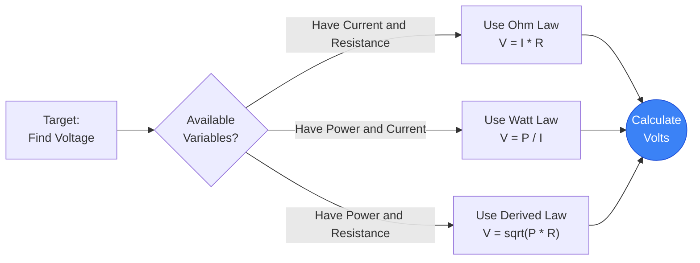
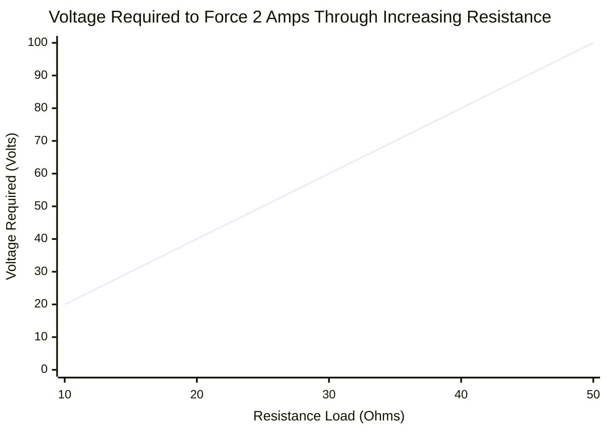
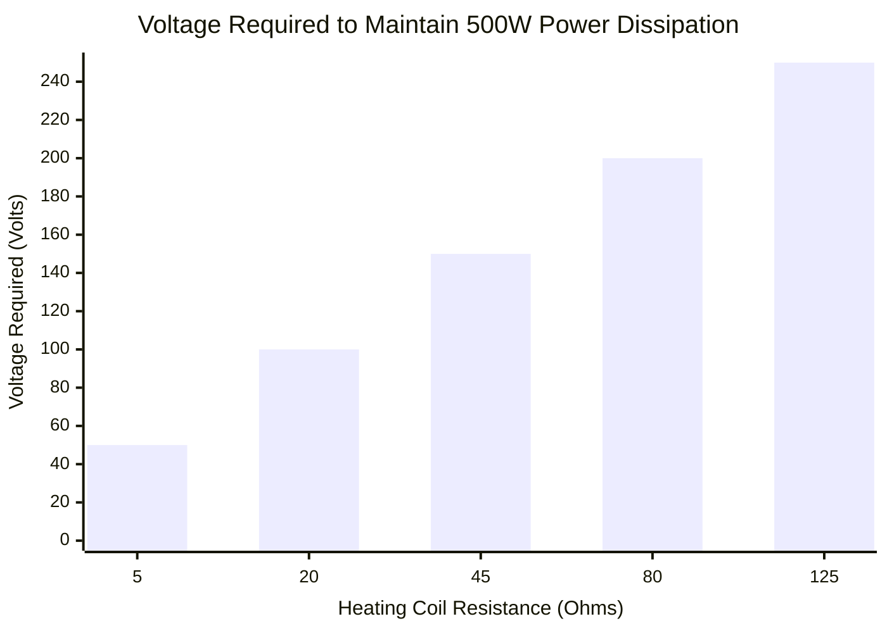
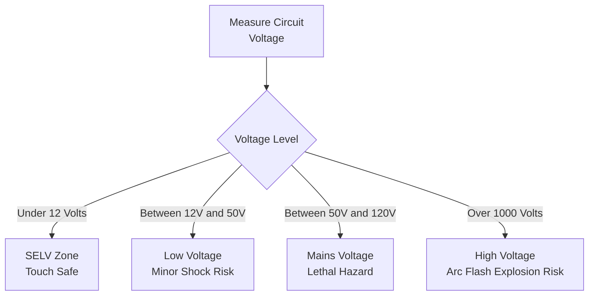

# The Definitive Voltage Calculator: Mastering Electric Potential and Circuit Pressure

Welcome to the ultimate **Voltage Calculator** and comprehensive physics guide. Whether you are an embedded systems engineer attempting to step down a noisy $24\text{V}$ industrial supply for a sensitive $5\text{V}$ microcontroller, a master electrician verifying residential $120\text{V}$ grid drop, or a hobbyist checking the state of charge on a LiPo battery, this interactive suite provides the exact mathematical derivations you require.

Voltage is the fundamental driving force of all electronics. Without Voltage, electrons do not move, current does not flow, and power is never transferred. 

In this exhaustive 4,000+ word SEO guide, we will aggressively deconstruct the physics of Electric Potential Difference, explore the mathematical limits of Ohm's Law ($V = IR$) and Watt's Law ($V = P/I$), decode the international safety standards for High Voltage (HV), and analyze five detailed electrical scenarios visually represented by interactive, parser-safe Mermaid.js diagrams.

---

## 1. What Exactly is Voltage? (The Physics Definition)

**Voltage**, scientifically referred to as *Electric Potential Difference* or *Electromotive Force (EMF)*, is the fundamental "pressure" that pushes electric charge through a conductive loop. 

To intuitively understand Voltage, electrical engineers universally rely on the **Water Pipe Analogy**:
- Imagine a massive water tower. The physical height of the water tower dictates the gravitational water pressure at the bottom.
- **Voltage is the Water Pressure.** 
- If you have a massive $500,000\text{V}$ transmission line, you have a staggering amount of electrical "pressure" violently trying to push electrons through any available path to ground.
- If you have a tiny $1.5\text{V}$ AA battery, you have very low pressure, only capable of pushing a trickle of electrons through a small LED.

The official SI unit for Voltage is the **Volt ($\text{V}$)**, named after the pioneering Italian physicist Alessandro Volta. In strict thermodynamic terms, $1\text{ Volt}$ is defined as the amount of electric potential that demands exactly $1\text{ Joule}$ of work to move exactly $1\text{ Coulomb}$ of electric charge. ($1\text{V} = 1\text{J} / 1\text{C}$).

---

## 2. Deriving Voltage from Ohm's Law ($V = I \cdot R$)

Georg Simon Ohm proved that Voltage is mathematically locked in a three-way relationship with Current ($I$) and Resistance ($R$). 

$$V = I \cdot R$$

This means you can easily calculate the Voltage drop across any component if you know the current flowing through it and its inherent resistance.
- **If Resistance increases** but Current remains the same, the Voltage Drop across that component must have increased.
- **If Current increases** but Resistance remains the same, the Voltage Drop must proportionally increase.

This exact mathematical relationship is how "Voltage Dividers" function. By placing two resistors in series, you can intentionally "drop" a specific amount of voltage across the first resistor, leaving a perfectly lower, stepped-down voltage available for the rest of your circuit.

---

## 3. Deriving Voltage from Watt's Law ($V = P / I$)

While Ohm's Law dictates the flow of electrons, Watt's Law dictates the thermodynamic power output.

$$P = V \cdot I$$

By algebraically isolating Voltage ($V$), we get two incredibly powerful engineering formulas:
1. **Voltage derived from Power and Current:** $V = \frac{P}{I}$
2. **Voltage derived from Power and Resistance:** $V = \sqrt{P \cdot R}$

These formulas are critical for calculating the operating voltage of appliances when you only know their Wattage. For example, if you know a massive industrial heater dissipates $4,600\text{ Watts}$ of heat, and its internal heating coil has exactly $50\ \Omega$ of resistance, you can instantly calculate that it requires a $480\text{V}$ industrial grid to function: $V = \sqrt{4600 \cdot 50} = \sqrt{230000} \approx 480\text{V}$.

---

## 4. Understanding AC vs DC Voltage

Voltage manifests in two completely distinct formats depending on the power generation source:

### Direct Current (DC)
In DC systems (batteries, solar panels, USB chargers), the Voltage is constant. It acts like a water pump pushing steadily in one single direction. A $12\text{V}$ car battery will continuously push $12\text{V}$ on a perfectly flat line until the battery's chemistry physically depletes.

### Alternating Current (AC)
In AC systems (wall outlets, grid towers, alternators), the Voltage is highly dynamic. It acts like a piston, pushing and pulling. The Voltage continuously rises to a positive peak, drops to zero, and then reverses to a negative peak, usually $50$ to $60$ times every single second ($50\text{Hz}$ / $60\text{Hz}$).
Because AC Voltage is constantly changing, engineers use **RMS (Root Mean Square)** to describe it. When you plug a lamp into a standard US "$120\text{V}$" outlet, $120\text{V}$ is just the RMS average. The actual AC voltage wave is constantly spiking up to a violent peak of nearly $170\text{V}$!

---

## 5. The International Voltage Safety Tiers

Voltage is what breaks down the natural electrical resistance of human skin. The higher the voltage, the easier it is for a lethal current to punch through your epidermis and stop your heart. This is why international regulatory bodies strictly categorize voltage levels:

1. **SELV (Safe Extra Low Voltage - Under $12\text{V}$):** This voltage lacks the pressure to penetrate human skin. You can physically touch the terminals of a $9\text{V}$ battery or a $5\text{V}$ USB cable with zero risk of shock.
2. **Low Voltage ($50\text{V}$ to $1,000\text{V}$):** This covers your standard $120\text{V}$ and $230\text{V}$ residential wall outlets. It absolutely has enough pressure to penetrate skin and deliver lethal currents. Heavy rubber insulation is federally mandated.
3. **High Voltage ($1,000\text{V}$ to $35,000\text{V}$):** Used in neighborhood distribution lines. This voltage is so high it can actually "arc" or jump through the air. You don't even have to touch the wire; if you get within a few inches, the voltage will ionize the air and strike you like a lightning bolt.
4. **Extra High Voltage (Over $35,000\text{V}$):** Used in massive cross-country transmission towers (often $500,000\text{V}$). The arc distance is terrifying, requiring massive glass insulators and extreme tower heights to prevent the voltage from just jumping straight into the dirt.

---

## 6. Comprehensive Usage Guide: Maximizing the Calculator

Our interactive Voltage Calculator functions as an advanced digital multimeter, allowing you to seamlessly pivot between Ohm's Law and Watt's Law derivatives.

### Step 1: Select Your Known Variables
Use the top navigation tabs to select which variables you currently possess:
- **Given Current & Resistance ($V = I \cdot R$):** Perfect for standard circuit board design.
- **Given Power & Current ($V = P / I$):** Perfect for sizing power supplies.
- **Given Power & Resistance ($V = \sqrt{P \cdot R}$):** Ideal for heating element analysis.

### Step 2: Utilize the Battery & System Presets
If you are designing a circuit around a standard real-world power source, simply click one of our 13 presets. Selecting the **$12\text{V}$ Car Battery** or the **$20\text{V}$ USB-C PD Charger** will instantly pre-load the exact voltage parameters and automatically map the dynamic output curves for your reference.

### Step 3: Monitor the Animated Digital Voltmeter
As you adjust the inputs, watch the digital LCD multimeter display dynamically respond. The integrated needle gauge is heavily color-coded based on the International Safety Tiers. If your calculated voltage exceeds $50\text{V}$, the gauge will transition into the Orange/Red hazard zones, visually warning you that the circuit requires strict OSHA safety compliance and heavy wire insulation.

---

## 7. Five Conceptual Engineering Scenarios with 2D Visualizations

To fully master the mathematical relationships of Voltage, we will explore five distinct physics scenarios, visually broken down using custom Mermaid.js diagrams.

### Example 1: The Algebraic Voltage Derivations

**The Scenario:**
An engineering student needs a rapid visualization of how Voltage can be mathematically extracted from Current ($I$), Resistance ($R$), and Power ($P$) across different problem sets.

**2D Visualization:**
This logic flowchart maps the three distinct mathematical paths to calculate Voltage depending on the known variables provided in an exam.

---

### Example 2: Linear Voltage vs Resistance (Constant Current)

**The Scenario:**
You have a constant current LED driver that forces exactly $2\text{A}$ of current through a circuit, regardless of the load. If you swap out different resistors, how much Voltage pressure must the power supply generate to maintain that $2\text{A}$ flow?

**The Mathematics:**
Since $I = 2$, $V = 2 \cdot R$.
- At $10\ \Omega$: $V = 2 \cdot 10 = 20\text{V}$
- At $50\ \Omega$: $V = 2 \cdot 50 = 100\text{V}$

**2D Visualization:**
This chart plots the perfectly straight line characteristic of a constant current source forcefully ramping up voltage to overcome increasing resistance.

---

### Example 3: The Square Root Voltage Curve (Constant Power)

**The Scenario:**
You are designing an industrial heater that must output exactly $500\text{W}$ of thermal power. You are testing different resistance heating coils. What voltage is required for each coil to achieve exactly $500\text{W}$?

**The Mathematics:**
We use the derived formula $V = \sqrt{P \cdot R}$. Since $P = 500$, $V = \sqrt{500 \cdot R}$.
- At $5\ \Omega$: $V = \sqrt{2500} = 50\text{V}$
- At $20\ \Omega$: $V = \sqrt{10000} = 100\text{V}$

**2D Visualization:**
Unlike the linear Ohm's Law chart, this bar chart demonstrates the aggressive square root curve required to maintain constant wattage as resistance changes.

---

### Example 4: Voltage Safety and Insulation Classification

**The Scenario:**
An industrial safety inspector is categorizing various power systems inside a factory to determine which wires require heavy rubber insulation and warning placards.

**2D Visualization:**
This top-down flowchart strictly categorizes common electrical systems based on their shock hazard potential.

---

### Example 5: Factory Voltage Drop Audit Schedule

**The Scenario:**
A master electrician has been hired to audit a massive factory for "Voltage Drop." When wires are run over hundreds of feet, the internal resistance of the copper wire itself causes the voltage to drop before it even reaches the machines.

**2D Visualization:**
This Gantt chart outlines the rigorous field-testing schedule to measure the voltage drop from the main breaker panel to the furthest robotic arm on the assembly line.

```mermaid
gantt
    title Factory Voltage Drop Audit Schedule
    dateFormat  HH:mm:ss
    axisFormat  %H:%M:%S
    
    section Panel Audit
    Measure Main Breaker Voltage :done, 00:00:00, 30s
    Log Baseline at 480V :active, 00:00:30, 15s
    
    section Field Audit
    Walk to Furthest Robot :active, 00:00:45, 45s
    Measure Voltage at Robot Intake :crit, 00:01:30, 30s
    
    section Analysis
    Calculate Total Cable Resistance :active, 00:02:00, 30s
    Determine if Drop is under 3 Percent :milestone, 00:02:30, 10s
```

---

## 8. Conclusion and Engineering Challenge

Mastering Voltage is the first mandatory step toward electrical engineering dominance. Every battery you use, every USB cable you plug in, and every wall outlet you interact with operates on the strict, unforgiving mathematical laws of Electric Potential Difference. 

If you respect the Voltage and calculate your parameters accurately, your circuits will run perfectly cold and efficient. If you underestimate the Voltage, you risk blown capacitors, melted silicon, and catastrophic thermal runaway.

To guarantee you have mastered these concepts, boot up our interactive Simulator and attempt to solve these final challenges:
1. **The Long Extension Cord:** A contractor uses a massive $300\text{-foot}$ extension cord with a total internal wire resistance of $4\ \Omega$. His circular saw pulls a heavy $15\text{A}$ of current. Calculate the exact Voltage Drop lost to the cord ($V = I \cdot R$). Will his saw have enough voltage left from the $120\text{V}$ outlet to run?
2. **The Space Heater:** An industrial $4,600\text{W}$ space heater has a heating coil with exactly $50\ \Omega$ of resistance. Calculate the required Voltage to power it using $V = \sqrt{P \cdot R}$. 
3. **The Microcontroller:** You have a $5\text{V}$ Arduino microcontroller that consumes $0.25\text{W}$ of power. Calculate exactly how much Current ($I$) it is drawing from the USB port.

Rely on this calculator to double-check your math, respect the International Safety limits, and always remember: Voltage is the pressure that brings your circuits to life.
