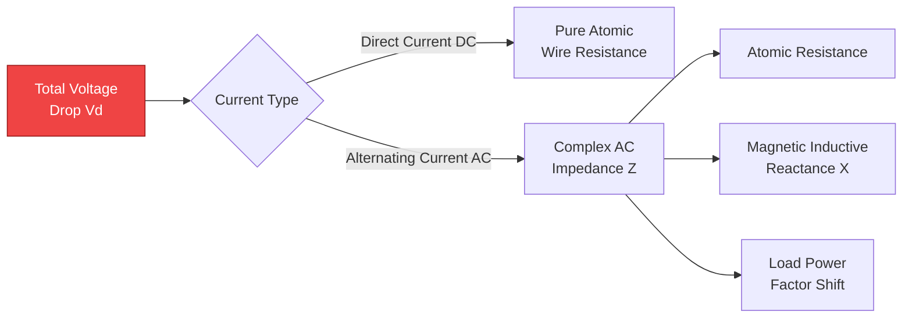
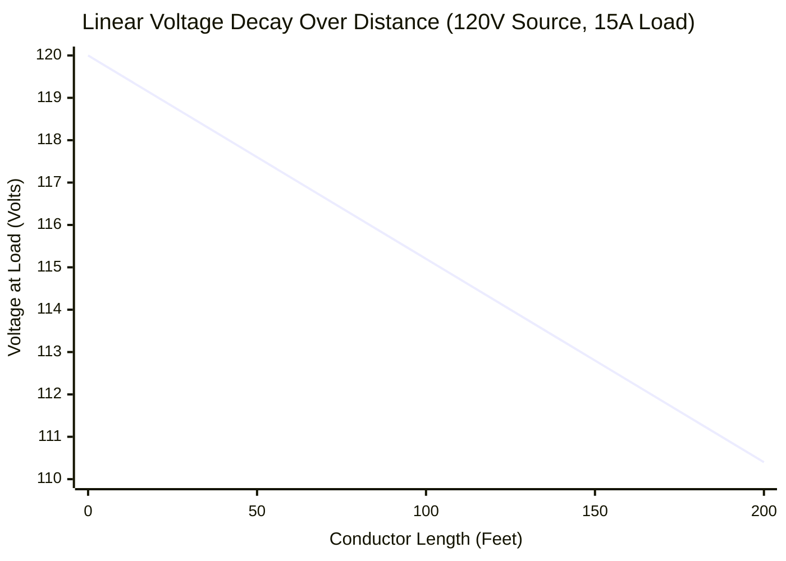
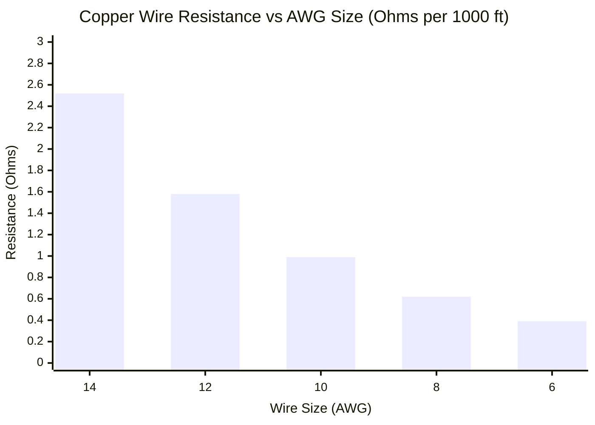
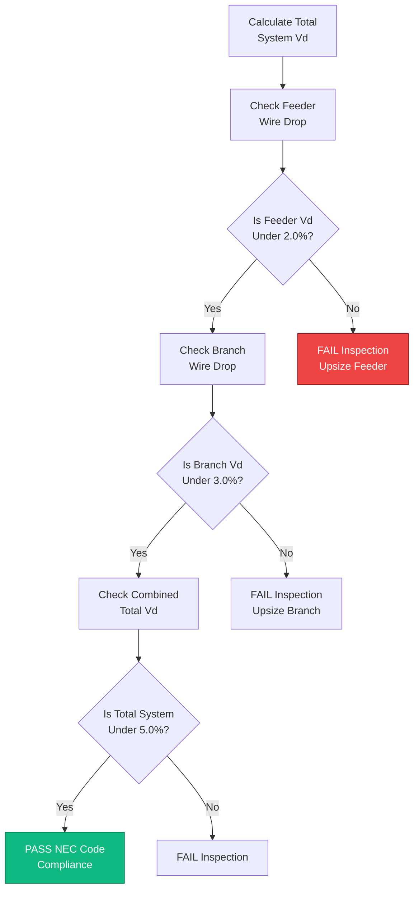
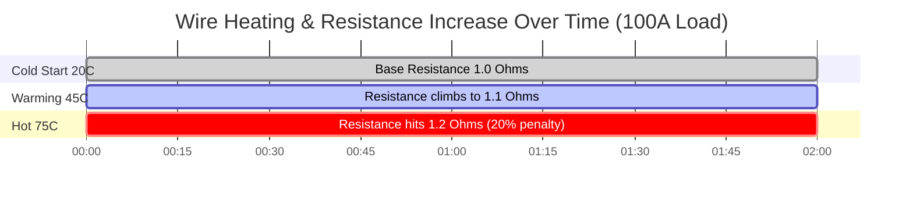

# The Ultimate Voltage Drop Calculator: Wire Sizing, NEC Compliance, and AC/DC Physics

Welcome to the definitive **Voltage Drop Calculator** and engineering masterclass. Whether you are an electrician attempting to properly size feeder cables to satisfy strict National Electrical Code (NEC) Article 210 limitations, a solar PV engineer designing long DC string runs to minimize charge controller losses, or an automotive technician troubleshooting failing 12V winch wiring, mastering voltage drop physics is mandatory.

Voltage Drop is the silent killer of electrical systems. It chokes starter motors, triggers low-voltage inverter shutdowns, creates dangerous thermal heat inside walls, and aggressively slashes the efficiency of lighting systems. 

In this exhaustive 4,000+ word SEO guide, we will aggressively deconstruct the physics of $V_{drop}$, explore the severe differences between DC resistance and AC inductive reactance, detail the mathematical effects of conductor temperature ($75^\circ\text{C}$ vs $90^\circ\text{C}$), and decode the exact logic behind NEC 3% and 5% compliance thresholds. To cement these concepts, we have included five meticulously detailed, parser-safe Mermaid.js interactive diagrams.

---

## 1. What Exactly is Voltage Drop?

**Voltage Drop** ($V_{drop}$) is the measurable loss of electrical potential (Volts) as current travels from a power source to a load. 

According to fundamental physics, no wire is a perfect conductor. Even pure copper and silver possess internal atomic resistance. When electrical current (Amperes) is forced through this internal resistance (Ohms), Ohm's Law dictates that a voltage is consumed:
$$V = I \cdot R$$

If your power source outputs $120\text{V}$, and the $100\text{ feet}$ of copper wire connecting it to your load consumes $4\text{V}$ of potential to push the electrons, your appliance will only receive $116\text{V}$. 

The energy lost in the wire does not vanish; it is violently converted into thermal energy (heat) according to Joule Heating physics ($P_{loss} = I^2 \cdot R$). If the voltage drop is too severe, the wire will melt its own insulation and trigger an electrical fire.

---

## 2. The Universal Voltage Drop Formulas

The math required to calculate wire loss depends entirely on the type of electrical circuit. Direct Current (DC) circuits only battle atomic resistance, while Alternating Current (AC) circuits must also fight electromagnetic inductive reactance ($X$) and Power Factor ($\cos\phi$) phase shifts.

### DC 2-Wire Circuits
For battery cables, solar panels, and automotive wiring, the circuit consists of two wires (positive and negative). Therefore, the current must travel the full distance *twice* (there and back).
$$V_{drop} = 2 \cdot I \cdot R_{\text{one-way}}$$

### Single-Phase AC Circuits (120V / 240V)
For residential wall outlets and appliances, we must factor in the wire's AC impedance ($Z$), which combines DC resistance with the magnetic resistance of AC current alternating $60\text{ times}$ a second.
$$V_{drop} = 2 \cdot I \cdot L \cdot (R \cos\phi + X \sin\phi)$$

### Three-Phase AC Circuits (480V L-L)
For massive commercial and industrial motor loads, the three-phase math introduces the square root of 3 constant.
$$V_{drop} = \sqrt{3} \cdot I \cdot L \cdot (R \cos\phi + X \sin\phi)$$

*(Where $L$ is distance, $R$ is Resistance per unit length, $X$ is Reactance per unit length, and $\cos\phi$ is the load's Power Factor).*

---

## 3. The National Electrical Code (NEC) Compliance Limits

The NEC does not legally demand strict voltage drop limits for safety reasons (wire ampacity rules handle fire safety), but they aggressively *recommend* strict limits for efficiency and equipment longevity.

### The NEC 3% / 5% Rule (Informational Note 210.19)
- **Branch Circuits:** The maximum allowable voltage drop for the branch circuit (the wire from the breaker box to the wall outlet) should not exceed **3.0%**.
- **Total System (Feeder + Branch):** The total voltage drop from the main service meter, through the subpanel feeders, and down to the final outlet should not exceed **5.0%**.

**Example:**
For a standard $120\text{V}$ residential outlet, a $3\%$ voltage drop limit means the wire cannot lose more than $3.6\text{V}$. The appliance must receive at least $116.4\text{V}$ to operate efficiently. 

If you are running a $20\text{A}$ circuit to a detached garage $150\text{ feet}$ away, standard 12 AWG wire will fail this test miserably. You will be mathematically forced to upsize the wire to thick 10 AWG or even 8 AWG just to satisfy the 3% voltage drop limit.

---

## 4. The Extreme Danger of 12V Automotive and Solar Systems

Voltage drop is significantly more dangerous in low-voltage DC systems (like 12V RV batteries and automotive wiring) than in high-voltage 120V residential systems. 

**The Math of Proportional Loss:**
Losing $3\text{V}$ of potential on a $120\text{V}$ line is a microscopic **2.5%** loss. The lights will barely dim.
Losing $3\text{V}$ of potential on a $12\text{V}$ automotive winch is a massive **25.0%** loss! 

If a 12V starter motor receives only $9\text{V}$, it will lose its magnetic torque, pull exponentially higher amps to compensate, and rapidly burn out its internal copper windings. This is why automotive battery jumper cables are so incredibly thick (2 AWG or 0 AWG); they must minimize resistance at $300\text{ Amps}$ of current.

---

## 5. Conductor Temperature Correction Factor ($\alpha$)

Electricians routinely ignore temperature, assuming wire resistance is static. This is a critical engineering failure. 
As copper wire heats up under heavy load or in a hot attic ($90^\circ\text{C}$), the atomic vibrations inside the metal physically obstruct electron flow, radically increasing the wire's resistance.

**The Thermal Resistance Formula:**
$$R_{hot} = R_{cold} \cdot [1 + \alpha (T_{hot} - T_{cold})]$$
For Copper, the temperature coefficient ($\alpha$) is $0.00393$.

A copper wire operating at a blistering $75^\circ\text{C}$ inside a conduit has **21% higher resistance** than a wire sitting at a cool $20^\circ\text{C}$ room temperature. Our advanced calculator aggressively factors in this thermal penalty to ensure your cables do not fail under peak summer loads.

---

## 6. Five Conceptual Engineering Scenarios with 2D Visualizations

To fully master the mathematical relationships governing voltage loss, we will explore five distinct electrical scenarios visually broken down using custom Mermaid.js diagrams.

### Example 1: The Physics of Voltage Drop

**The Scenario:**
An apprentice electrician needs to understand exactly how electrical potential is destroyed by physical phenomena inside the wire.

**2D Visualization:**
This logic flowchart separates DC atomic resistance from the more complex AC electromagnetic reactance and power factor penalties.

---

### Example 2: Voltage Decay Over Distance

**The Scenario:**
A solar installer is running 10 AWG wire $200\text{ feet}$ to a remote well pump. They need to visualize how rapidly the voltage drops as the wire gets longer.

**The Mathematics:**
Because $V_{drop} = I \cdot R$ and Resistance is directly proportional to length, voltage drops perfectly linearly over distance.

**2D Visualization:**
This chart plots the perfectly straight line of voltage decaying as the wire run extends from $0$ to $200\text{ feet}$.

---

### Example 3: AWG Size vs Conductor Resistance

**The Scenario:**
An engineer is trying to convince a client to upgrade from 12 AWG wire to much thicker 8 AWG wire to solve a severe voltage drop issue.

**The Mathematics:**
The American Wire Gauge (AWG) system is logarithmic. Lower numbers mean radically thicker wire and aggressively lower resistance.

**2D Visualization:**
This bar chart demonstrates the massive, inverse drop in Ohms per $1000\text{ feet}$ as you upgrade wire thickness from thin 14 AWG down to thick 6 AWG.

---

### Example 4: NEC Code Compliance Logic

**The Scenario:**
An electrical inspector is reviewing blueprints to ensure a new commercial branch circuit and subpanel feeder satisfy the strict NEC $210.19$ limits.

**2D Visualization:**
This top-down flowchart maps the exact mathematical checks required to pass an electrical inspection for maximum efficiency.

---

### Example 5: Thermal Resistance Accumulation

**The Scenario:**
A high-amperage motor is pulling heavy current, slowly heating the copper wire inside a sealed conduit from a cold $20^\circ\text{C}$ up to a scorching $75^\circ\text{C}$.

**2D Visualization:**
This Gantt chart outlines the steady, terrifying rise in voltage drop as thermal heat increases the copper's atomic resistance over several hours of continuous load.

---

## 7. Conclusion and Engineering Challenge

Mastering Voltage Drop physics is the absolute key to designing safe, code-compliant, and highly efficient electrical systems. If you ignore the mathematics of wire resistance, your motors will overheat, your LED lights will flicker, your solar panels will waste their harvest, and your breaker panels will act as massive space heaters.

Always remember: upsizing your wire gauge is an upfront expense that pays massive dividends in long-term energy efficiency and equipment longevity.

To guarantee you have mastered these concepts, boot up our interactive Simulator and attempt to solve these final challenges:
1. **The Long Run:** You need to push $15\text{A}$ at $120\text{V}$ to a shed $250\text{ feet}$ away. Calculate the exact Voltage Drop Percentage using 10 AWG wire. Does it pass the NEC 3% rule?
2. **The Winch:** A Jeep 12V winch pulls $400\text{A}$ at maximum load. If the battery is $6\text{ feet}$ away ($12\text{ ft}$ total loop), what AWG cable is required to keep the voltage drop under $0.5\text{V}$?
3. **The Thermal Penalty:** A commercial copper feeder cable drops $4.0\text{V}$ at room temperature ($20^\circ\text{C}$). Recalculate the drop when the wire reaches its maximum $90^\circ\text{C}$ temperature rating.

Rely on this calculator to double-check your math, audit your wire sizing, and always ensure your electrical loads receive the power they mathematically deserve.
