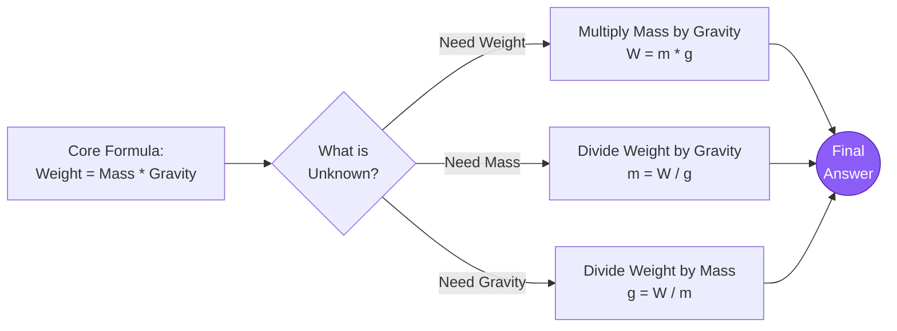
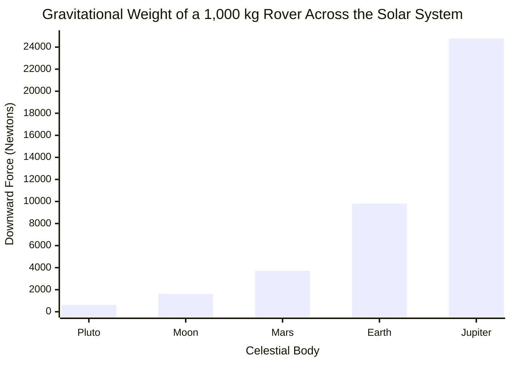
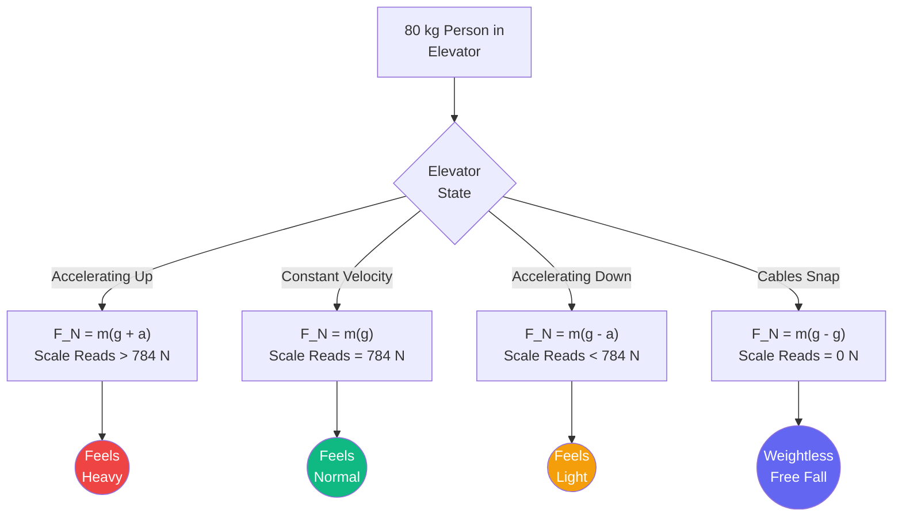
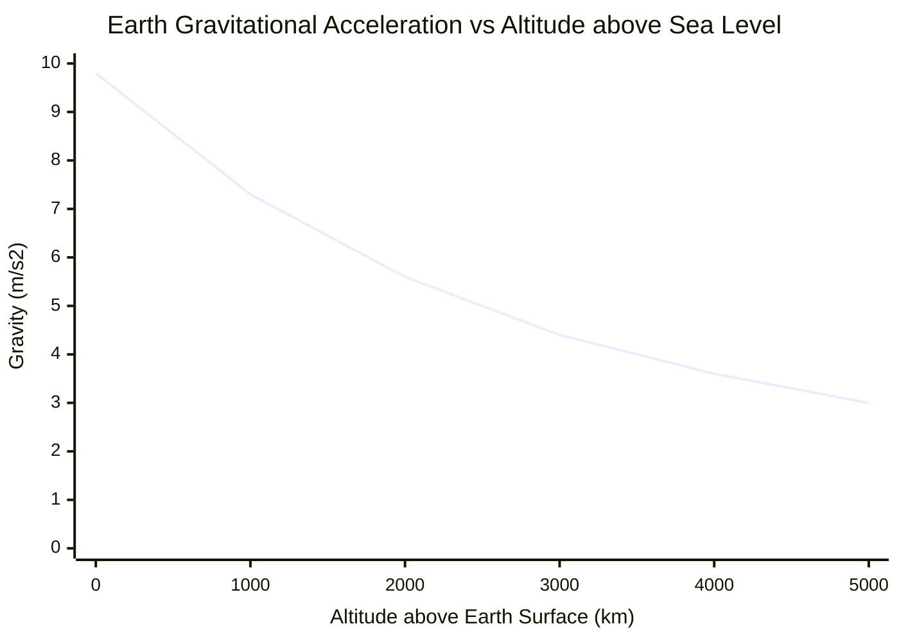

# The Definitive Weight Calculator: Mastering Gravity, Mass, and Planetary Forces

Welcome to the ultimate **Weight Calculator** and comprehensive astrophysics guide. Whether you are a high school physics student trying to understand the fundamental difference between mass and weight, an aerospace engineer calculating payload thrust ratios for a lunar landing, or an astronomy enthusiast wondering how heavy you would feel walking on Jupiter, this tool provides the absolute exact physics conversions you require.

Weight ($W$) is one of the most universally misunderstood concepts in everyday life. When we step on a bathroom scale, we say we are measuring our "weight" in kilograms. But in the rigid, unforgiving realm of classical physics, this is completely wrong. Mass and Weight are two radically different physical properties.

In this exhaustive 4,000+ word SEO guide, we will violently deconstruct the weight formula ($W = mg$). We will explore the invariant nature of mass, unravel Newton's Universal Law of Gravitation, calculate the crushing gravity of Jupiter and the Sun, and analyze five detailed conceptual physics scenarios visually represented by interactive Mermaid.js diagrams.

---

## 1. Defining Weight: The Downward Force of Gravity

In classical Newtonian mechanics, **Weight** ($W$) is strictly defined as the downward vector force exerted on an object's mass by a local gravitational field. 

$$ W = m \cdot g $$

### Mass vs. Weight: The Ultimate Distinction
To intuitively grasp this, you must separate the "amount of stuff" from the "pull on the stuff."
- **Mass ($m$):** An intrinsic scalar property measuring the total amount of matter in an object. It never changes, regardless of where you are in the universe. A $70\text{ kg}$ human is exactly $70\text{ kg}$ on Earth, on Mars, on the Moon, and floating in deep interstellar space.
- **Weight ($W$):** A variable vector force. It entirely depends on the gravitational acceleration ($g$) of the planet you are standing on. Weight changes instantly as you travel between celestial bodies.

### Standard SI Units of Weight
Because Weight is a *force*, its proper standard SI unit is the **Newton** ($\text{N}$), named after Sir Isaac Newton.
$$ 1\text{ Newton} = 1\text{ kg} \cdot 1\text{ m/s}^2 $$

When you stand on a bathroom scale calibrated in Kilograms, the scale is actually measuring the downward force (Newtons) your body applies to its internal springs. It then secretly divides that force by Earth's standard gravity ($9.81\text{ m/s}^2$) to display your mass in Kilograms on the digital screen.
If you took that exact same bathroom scale to the Moon, it would tell you that you "weigh" roughly $11\text{ kg}$—which is physically incorrect. Your mass is still $70\text{ kg}$; the gravitational force pulling you onto the scale is just six times weaker!

---

## 2. Earth Gravity vs Planetary Gravity

Standard gravity on the surface of Earth ($g_0$) is internationally agreed upon as:
$$ g = 9.80665\text{ m/s}^2 $$
For almost all engineering and physics homework applications, this is rounded to **$9.81\text{ m/s}^2$**.

### Calculating Planetary Gravity
Where does this $9.81$ come from? It is derived directly from **Newton's Law of Universal Gravitation**. The gravity on the surface of any spherical celestial body depends entirely on two factors: the Mass of the planet ($M$) and the Radius of the planet ($r$).

$$ g = \frac{G \cdot M}{r^2} $$
*(Where $G = 6.674 \times 10^{-11}\text{ N}\cdot\text{m}^2/\text{kg}^2$)*

Because Jupiter is unimaginably massive, its surface gravity is roughly $24.79\text{ m/s}^2$ ($2.5\times$ Earth's). Because the Moon is small and relatively light, its surface gravity is only $1.62\text{ m/s}^2$ ($1/6$th Earth's).

---

## 3. Apparent Weight and Elevator Physics

Your "True Weight" ($W = mg$) never changes as long as you remain on Earth's surface. However, your **Apparent Weight**—how heavy you *feel*—can change dramatically based on your vertical acceleration.

Apparent weight is simply the *Normal Force* ($F_N$) pushing back up against your feet. 
- **Standing Still:** $F_N = m \cdot g$. You feel normal.
- **Elevator Accelerating Upward:** The floor pushes into your feet harder to accelerate your mass upward. $F_N = m(g + a)$. You temporarily feel heavier.
- **Elevator Accelerating Downward:** The floor drops away from your feet. $F_N = m(g - a)$. You temporarily feel lighter.
- **Free Fall (Snapping Cables):** The elevator falls at $g$. $F_N = m(g - g) = 0$. You experience Zero-G weightlessness, despite gravity still pulling on you!

This is exactly why astronauts on the International Space Station feel weightless. They are not in "zero gravity"—Earth's gravity at that altitude is still $90\%$ as strong as at sea level! They are just moving sideways so fast ($17,500\text{ mph}$) that as they fall toward Earth, the Earth curves away beneath them. They are in a state of perpetual, continuous free fall.

---

## 4. Comprehensive Usage Guide: Maximizing the Calculator

Our interactive Weight Calculator operates as a robust astrophysics simulator.

### Step 1: Select Your Calculation Target
Use the top navigation to select your unknown variable:
- **Weight ($W$):** You know Mass and Gravity. (Standard Newtonian mechanics).
- **Mass ($m$):** You know Weight and Gravity. (Determine mass from a force load).
- **Gravity ($g$):** You know Mass and Weight. (Calculate the gravitational field of an unknown planet).

### Step 2: Utilize the Astronaut Planet Preset Mode
Skip manual gravity entry by selecting from our 10 embedded Solar System presets. Want to know exactly how much a $5,000\text{ kg}$ Mars Rover will weigh when it lands in Jezero Crater? Select 'Mars' from the dropdown, and the calculator instantly populates $g = 3.71\text{ m/s}^2$ to calculate the Martian force.

### Step 3: Interpret the Logarithmic Weight Gauge
Our radial force scale instantly contextualizes your result:
- **Micro-Forces:** $0\text{N}$ to $1,000\text{N}$ (Humans, backpacks, small appliances).
- **Macro-Forces:** $1\text{kN}$ to $1,000\text{kN}$ (Cars, trucks, elephants, small aircraft).
- **Mega-Forces:** $1\text{MN}$ to $100\text{MN}$+ (Skyscrapers, cruise ships, Saturn V rockets).

---

## 5. Five Conceptual Engineering Scenarios with 2D Visualizations

To fully master the relationships between Mass, Force, Gravity, and Kinematics, we will explore five distinct physics scenarios, visually broken down using custom Mermaid.js diagrams.

### Example 1: The W=mg Formula Logic (Solving for Variables)

**The Scenario:**
A freshman physics student needs to quickly visualize the algebraic permutations of the weight formula ($W = mg$) to solve three different test questions.

**2D Visualization:**
This logic flowchart illustrates the classic variable isolation technique.

---

### Example 2: The Interplanetary Weight Spectrum

**The Scenario:**
You are designing a pressurized rover. It has a static invariant mass of $1,000\text{ kg}$. You need to design the suspension springs. How much gravitational force will those springs experience on different planets in our Solar System?

**2D Visualization:**
This bar chart plots the extreme variations in Weight Force across five celestial bodies for the exact same $1,000\text{ kg}$ rover. Notice the crushing weight on Jupiter compared to the feather-light presence on Pluto!

---

### Example 3: Elevator Apparent Weight Physics

**The Scenario:**
An $80\text{ kg}$ person is standing on a scale inside a skyscraper elevator. We need to map out exactly what the scale reads (their Apparent Weight) depending on the acceleration state of the elevator car.

**2D Visualization:**
This flowchart visualizes the vector addition of gravity and elevator acceleration to determine the final Normal Force ($F_N$) felt by the person.

---

### Example 4: Gravitational Falloff Curve (Orbit vs Surface)

**The Scenario:**
Many people wrongly believe there is "no gravity" in space. According to Newton's law ($g \propto 1/r^2$), gravity fades smoothly as you move away from Earth's center; it doesn't just switch off. Let's look at Earth's gravity at the surface ($r = 6,371\text{ km}$) versus altitude.

**The Mathematics:**
- Surface ($0\text{ km}$): $g = 9.81\text{ m/s}^2$
- ISS Orbit ($400\text{ km}$): $g = 8.69\text{ m/s}^2$ (still $89\%$ of surface gravity!)
- High Orbit ($5,000\text{ km}$): $g = 3.08\text{ m/s}^2$

**2D Visualization:**
This chart plots the inverse-square decay of Earth's gravitational acceleration as you gain altitude.

---

### Example 5: Space Rocket Launch Sequence (Thrust vs Weight)

**The Scenario:**
A massive SpaceX rocket sits on the launch pad. It has a mass of $1,000,000\text{ kg}$, giving it a gravitational weight of $9,810,000\text{ Newtons}$. In order to leave the ground, the engines must generate a Thrust force that strictly exceeds this massive weight vector. As fuel burns, mass decreases, causing the Weight vector to shrink, which wildly increases acceleration.

**2D Visualization:**
This Gantt chart outlines the chronological physics timeline of a rocket clearing the launch tower and pushing into Max-Q.

```mermaid
gantt
    title Orbital Rocket Launch Thrust vs Weight Sequence
    dateFormat  HH:mm:ss
    axisFormat  %H:%M:%S
    section Pre-Launch
    Engine Ignition Sequence :active, 00:00:00, 5s
    Thrust Builds but Thrust Less Than Weight :active, 00:00:05, 3s
    section Liftoff
    Thrust Exceeds Weight (T over W Greater Than 1) :crit, done, 00:00:08, 2s
    Tower Clear (Accelerating) :done, 00:00:10, 5s
    section Flight
    Fuel Burning (Weight rapidly decreasing) :active, 00:00:15, 25s
    Maximum Aerodynamic Pressure (Max-Q) :milestone, 00:00:40, 5s
```

---

## 6. Frequently Asked Questions (FAQ) Deep Dive

**Q: Why do things fall at the same speed regardless of weight?**
**A:** This was famously proven by Galileo and later by Apollo 15 astronaut David Scott dropping a hammer and a feather on the Moon. While gravity pulls *harder* on a heavy bowling ball than a light marble, the bowling ball also has vastly more *mass* (inertia), making it harder to accelerate. The exact proportion of Force to Mass always equals $9.81\text{ m/s}^2$. Therefore, in a vacuum without air resistance, all objects fall at the exact same rate!

**Q: How do we weigh the Earth?**
**A:** We don't "weigh" the Earth (because there's nothing for it to sit on), but we can calculate its *mass*. Using the formula $g = GM/r^2$, since we know Earth's gravity ($9.81$), Earth's radius ($6,371\text{ km}$), and the Gravitational Constant ($G$), we can algebraically solve for $M$. Earth's mass is a staggering $5.972 \times 10^{24}\text{ kg}$!

**Q: If Jupiter is entirely made of gas, how does it have gravity?**
**A:** Gravity is generated by *mass*, regardless of whether that mass is solid rock, liquid water, or hydrogen gas. Jupiter contains so much highly compressed hydrogen and helium gas that its total mass is $318$ times greater than Earth's, generating immense gravitational pull.

**Q: Can gravity ever be negative?**
**A:** In standard classical physics, no. Gravity is strictly an attractive force generated by positive mass. However, in modern cosmology, the concept of "Dark Energy" acts as a repulsive force driving the accelerated expansion of the universe, functioning mathematically like anti-gravity on a galactic scale.

**Q: What is a Kilogram-Force (kgf)?**
**A:** It is an outdated, non-SI unit of force. One kilogram-force is defined as the gravitational force exerted by standard Earth gravity on one kilogram of mass. Therefore, $1\text{ kgf} = 9.80665\text{ Newtons}$. Modern engineering strictly uses Newtons to avoid confusing mass and force.

---

## 7. Conclusion and Engineering Challenge

Weight is the invisible tether chaining us to the Earth. It governs the structural design of every building, the engine sizing of every aircraft, and the orbital mechanics of the cosmos.

To truly master these physics concepts, utilize our Weight Calculator to solve the following conceptual challenges:
1. **The Interplanetary Tourist:** You step on a bathroom scale on Earth, and it reads $80\text{ kg}$. You travel to Mars ($g = 3.71\text{ m/s}^2$). What will the exact same scale display when you stand on it in the Martian desert?
2. **The Asteroid Jump:** You land your spacecraft on the asteroid Ceres ($g = 0.28\text{ m/s}^2$). Your spacesuit and body have a combined mass of $150\text{ kg}$. What is your total downward weight force in Newtons on Ceres?
3. **The Falling Elevator:** An empty $500\text{ kg}$ elevator car's cables snap, and it enters free fall. What is the total Normal Force acting between the floor of the elevator and a $10\text{ kg}$ box resting inside it?

Experiment with the simulator, analyze the planetary variations, and rely on this calculator to permanently clarify the crucial distinction between invariant mass and the powerful vector force of weight.
