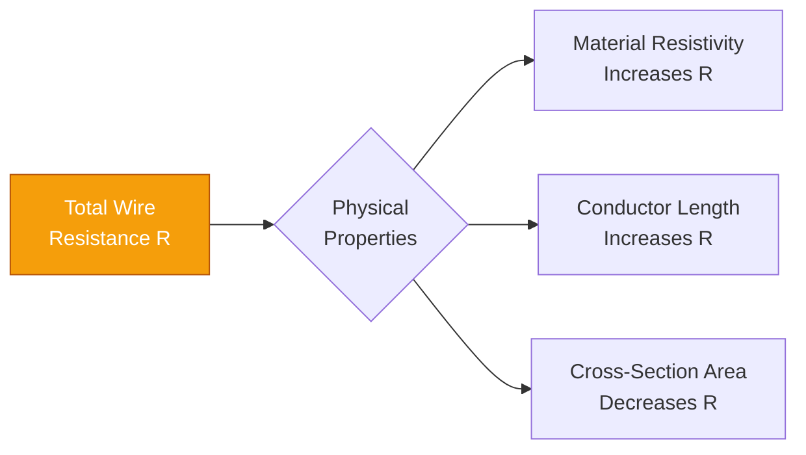
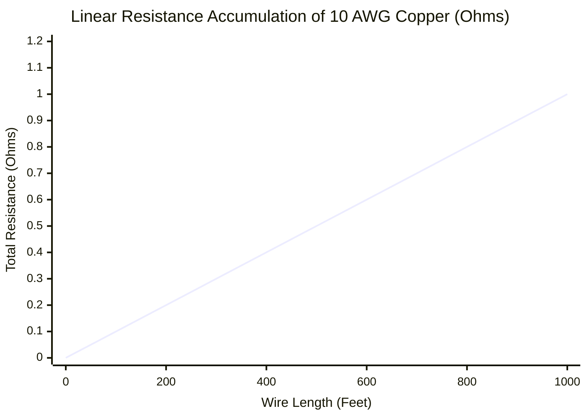
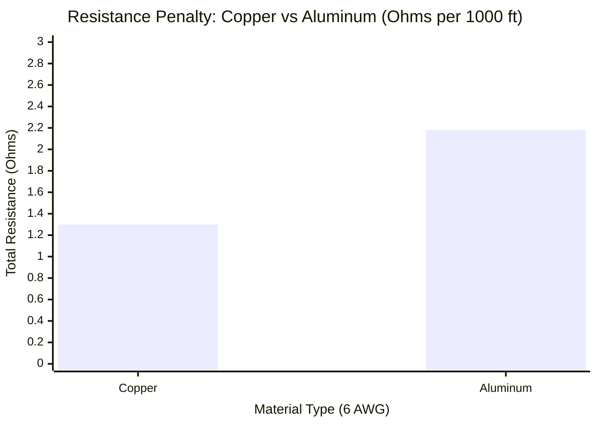
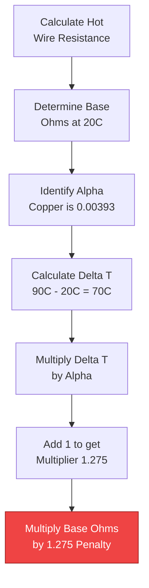
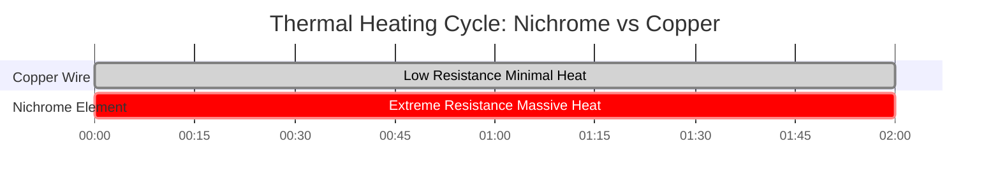

# The Definitive Wire Resistance Calculator: R = ρL/A, AWG Math, and Thermal Penalties

Welcome to the ultimate **Wire Resistance Calculator** and comprehensive physics guide. Whether you are an electrical engineer sizing $4/0$ AWG copper feeders for an industrial motor, a solar technician calculating the devastating DC line losses in long string runs, or a materials science student investigating the thermal breakdown of aluminum conductors, mastering the physics of wire resistance is non-negotiable.

Electrical resistance is not a theoretical concept; it is a physical barrier. It converts your expensive electrical energy into wasted thermal heat ($P = I^2 \cdot R$), destroying system efficiency, causing catastrophic voltage drops, and, if ignored, triggering electrical fires. 

In this exhaustive 4,000+ word SEO masterclass, we will deconstruct the fundamental $R = \rho L/A$ equation, mathematically expose the severe differences between Copper and Aluminum, decode the logarithmic American Wire Gauge (AWG) system, and deeply analyze the terrifying effects of conductor heating (the temperature coefficient $\alpha$). To cement these critical engineering concepts, we have included five meticulously detailed, parser-safe Mermaid.js interactive diagrams.

---

## 1. What Exactly is Wire Resistance?

**Wire Resistance** ($R$, mathematically measured in Ohms $\Omega$) is the strict physical opposition presented by a metal conductor to the flow of electric current (electrons).

Even the most highly conductive metals on Earth—Silver and Copper—are not perfect. As trillions of electrons are forcefully pushed through a copper wire by a voltage source, they violently collide with the vibrating copper atoms in the metallic lattice. Every single collision destroys a tiny fraction of the electron's forward momentum, converting that kinetic energy directly into thermal heat. 

This collective, microscopic friction is what we measure as **Electrical Resistance**. 

---

## 2. The Universal Resistance Equation ($R = \rho L / A$)

The resistance of any physical object is governed by three unchangeable geometric and material factors, perfectly summarized by the foundational equation of electrical physics:

$$R = \frac{\rho \cdot L}{A}$$

### The Three Factors:
1. **Material Resistivity ($\rho$):** The intrinsic, chemical resistance of the metal itself. Silver has the lowest resistivity, making it the best conductor. Copper is second. Aluminum is a distant third, and Iron is terrible. Resistivity is measured in Ohm-meters ($\Omega\cdot m$).
2. **Conductor Length ($L$):** Resistance is strictly proportional to distance. If you double the length of a wire, you force the electrons to navigate twice as many atomic collisions. Therefore, the resistance exactly doubles.
3. **Cross-Sectional Area ($A$):** Resistance is strictly *inversely* proportional to the thickness of the wire. If you double the physical area of the wire, you provide twice as many paths for the electrons to travel through, effectively slashing the resistance in half. 

---

## 3. The Copper vs. Aluminum Engineering Debate

When designing massive electrical grids, engineers are forced to choose between the two primary conductors: **Copper (Cu)** and **Aluminum (Al)**.

### The Physics of Copper
Copper is the gold standard of electrical wiring (ironically, it is actually a better conductor than Gold). Its resistivity ($\rho$) is an incredibly low $1.68 \times 10^{-8} \ \Omega\cdot m$. It is physically strong, highly resistant to oxidation, and bends without snapping.

### The Physics of Aluminum
Aluminum is the king of utility transmission lines. Its resistivity is $2.82 \times 10^{-8} \ \Omega\cdot m$. Because its resistivity is significantly higher, **Aluminum wire has roughly 68% more electrical resistance than a Copper wire of the exact same size.** 

So why does the electrical grid use Aluminum? **Weight and Cost.**
Aluminum is radically cheaper than Copper, and it is exponentially lighter ($2.70 \text{ g/cm}^3$ vs $8.96 \text{ g/cm}^3$). For high-voltage utility towers spanning miles, a copper cable would be so heavy it would physically snap the steel towers holding it up. 

*Engineering Rule of Thumb:* To achieve the exact same electrical resistance as a copper wire, an aluminum wire must be bumped up two AWG sizes thicker (e.g., replace 10 AWG Copper with 8 AWG Aluminum).

---

## 4. The Logarithmic Math of the AWG System

The **American Wire Gauge (AWG)** system is deeply confusing to new engineers because it is mathematically backward and strictly logarithmic.

In the AWG system, a **smaller** number represents a **thicker** wire with **lower** resistance. 
- 14 AWG is thin wire used for low-power $15\text{A}$ lighting circuits.
- 4 AWG is massive, thick cable used for heavy $60\text{A}$ electric vehicle chargers.

Because the system is logarithmic, every time the AWG number drops by 3 (e.g., from 10 AWG down to 7 AWG), the wire's cross-sectional area exactly doubles, and its electrical resistance is strictly cut in half.

---

## 5. The Thermal Temperature Penalty ($\alpha$)

This is where amateur engineers fail. Electrical resistance is **not static**. It changes violently based on the temperature of the wire.

When a copper wire heats up (either from a hot summer sun or from the internal thermal friction of carrying heavy current), the copper atoms vibrate far more aggressively. These aggressive vibrations cause electrons to collide much more frequently, driving the wire's electrical resistance even higher.

### The Thermal Correction Formula:
$$R_{\text{hot}} = R_{\text{cold}} \cdot [1 + \alpha (T_{\text{hot}} - T_{\text{cold}})]$$

Where $\alpha$ is the Temperature Coefficient of Resistance. For Copper, $\alpha = 0.00393 \ /^\circ\text{C}$.

**The Danger:**
If you calculate your wire resistance in a comfortable $20^\circ\text{C}$ air-conditioned room, but install that wire in a blistering $75^\circ\text{C}$ attic, the wire will possess **21% higher resistance** than your blueprints accounted for. This massive penalty will trigger severe voltage drop and unexpected breaker trips.

---

## 6. Five Conceptual Engineering Scenarios with 2D Visualizations

To fully master the physical relationships governing wire resistance, we will explore five distinct engineering scenarios visually broken down using custom Mermaid.js diagrams.

### Example 1: The Physics of Resistance

**The Scenario:**
An engineering student needs to visualize how the three physical properties (Length, Area, Material) mathematically interact to generate total Ohmic resistance.

**2D Visualization:**
This logic flowchart separates the fundamental components of the $R = \rho L / A$ equation, demonstrating which elements increase or decrease total resistance.

---

### Example 2: Resistance vs Wire Length (Linear Accumulation)

**The Scenario:**
A technician is unspooling $1000\text{ feet}$ of 10 AWG copper wire and needs to understand how resistance accumulates over extreme distances.

**The Mathematics:**
Because $R$ is strictly proportional to $L$, every foot of wire adds the exact same microscopic amount of resistance, forming a perfect linear slope.

**2D Visualization:**
This chart plots the perfectly straight line of resistance building up as the 10 AWG copper wire extends from $0$ to $1000\text{ feet}$.

---

### Example 3: Copper vs Aluminum Resistance Penalty

**The Scenario:**
A contractor wants to save money by swapping out 6 AWG Copper feeders for cheaper 6 AWG Aluminum feeders. He needs to see the exact resistance penalty of this decision.

**The Mathematics:**
Aluminum has a resistivity of $2.82 \times 10^{-8} \ \Omega\cdot m$ compared to Copper's $1.68 \times 10^{-8} \ \Omega\cdot m$. This results in a massive 68% resistance spike for the same physical thickness.

**2D Visualization:**
This bar chart aggressively demonstrates the severe resistance penalty of identical AWG sizes when comparing Copper to Aluminum.

---

### Example 4: Thermal Resistance Penalty Logic

**The Scenario:**
A high-amperage industrial motor is operating in a sealed conduit, heating the copper wire from $20^\circ\text{C}$ up to $90^\circ\text{C}$. The inspector must calculate the thermal resistance penalty.

**2D Visualization:**
This top-down flowchart maps the exact mathematical steps required to calculate the severe thermal resistance multiplier using the Temperature Coefficient ($\alpha$).

---

### Example 5: Nichrome vs Copper Heating Cycle

**The Scenario:**
Comparing the deliberate resistance heating of a Nichrome toaster element vs the accidental resistance heating of a Copper extension cord over a 2-hour heavy load cycle.

**2D Visualization:**
This Gantt chart outlines the vastly different thermal behaviors of high-resistivity Nichrome (designed to generate extreme heat) versus low-resistivity Copper.

---

## 7. Conclusion and Engineering Challenge

Mastering the physical parameters of Wire Resistance ($R = \rho L / A$) is the foundation of all electrical engineering. If you respect the resistivity of materials, aggressively upsize your AWG gauge for long runs, and always mathematically calculate your thermal temperature penalties, your circuits will run ice-cold and endlessly efficient.

If you ignore these physics, your wires will violently generate Joule heating ($I^2 \cdot R$), destroying voltage potential and melting insulation.

To guarantee you have mastered these concepts, boot up our interactive Simulator and attempt to solve these final challenges:
1. **The Aluminum Swap:** You have $500\text{ feet}$ of 8 AWG Copper wire. If you swap it for 8 AWG Aluminum wire, what is the exact numerical increase in Ohmic resistance?
2. **The Thermal Meltdown:** A 4 AWG copper wire has a base resistance of $0.815 \ \Omega$ at $20^\circ\text{C}$. Calculate its exact resistance when it heats up to $75^\circ\text{C}$ in an attic.
3. **The Area Math:** If you drop from 12 AWG down to 9 AWG, what exactly happens to the physical cross-sectional area, and what exactly happens to the resistance?

Rely on this calculator to double-check your math, audit your wire sizing, and always ensure your electrical conductors survive their thermal environments.
