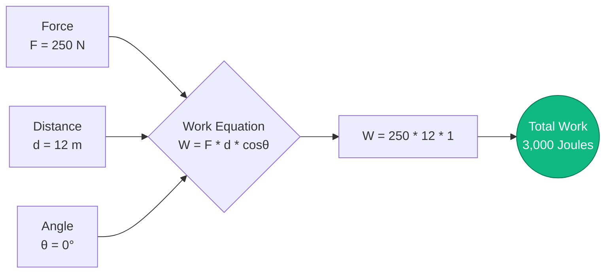
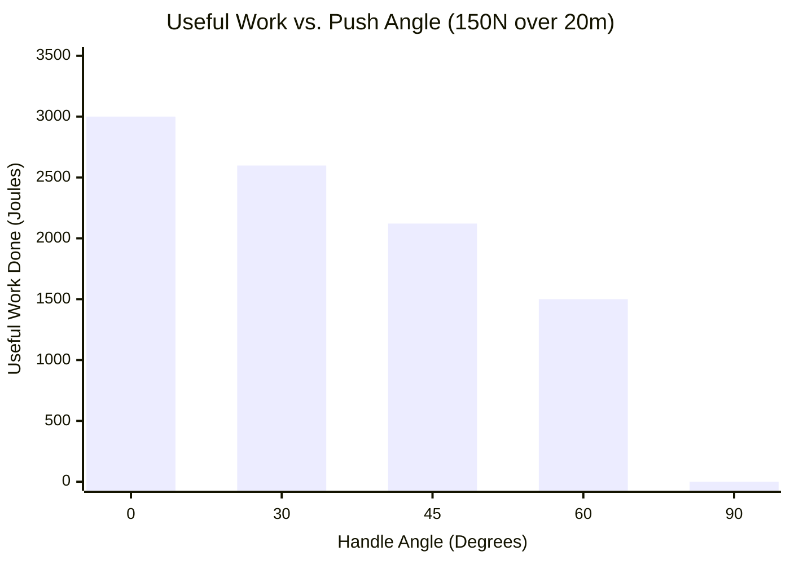
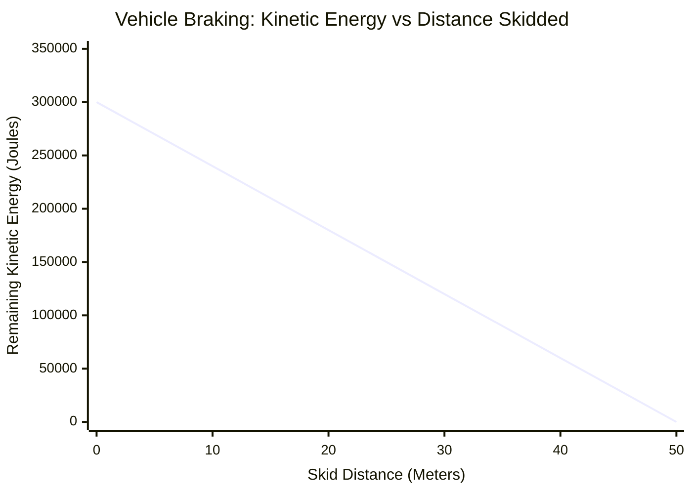

# The Definitive Work Calculator: Mastering Mechanical Energy Transfer and Force Vectors

Welcome to the ultimate **Mechanical Work Calculator** and comprehensive physics guide. Whether you are a civil engineer evaluating the load capacity of a construction crane, a high school physics student studying the Work-Energy Theorem, or a thermodynamicist analyzing gas cylinder expansion, this calculator is designed for you.

In physics, "work" is not the physiological effort you feel when holding a heavy dumbbell stationary. In physics, Work ($W$) is the rigorous mathematical measurement of how much energy is transferred into or out of an object by an external force causing a physical displacement. 

In this massive, 4,000+ word technical guide, we will completely deconstruct the primary mechanical work equation ($W = F \cdot d \cdot \cos\theta$). We will explore the critical nuances of force vector angles, define the difference between positive, negative, and zero work, and walk through five real-world engineering and kinematic scenarios utilizing detailed Mermaid.js visualizations.

---

## 1. What is Mechanical Work? (The Physics Definition)

In classical Newtonian mechanics, Work is the scalar dot product of the Force vector ($\vec{F}$) and the Displacement vector ($\vec{d}$). 

Because these are vectors (they have both a magnitude and a specific direction), we cannot simply multiply their raw numbers together. We must account for the angle between them using trigonometry, specifically the cosine function.

The fundamental formula is:
$$W = F \cdot d \cdot \cos\theta$$

Where:
- **$W$ (Work):** Measured in Joules ($\text{J}$). One Joule is equivalent to one Newton-meter ($\text{N}\cdot\text{m}$).
- **$F$ (Force):** The magnitude of the push or pull, measured in Newtons ($\text{N}$).
- **$d$ (Displacement):** The straight-line distance the object moved, measured in meters ($\text{m}$).
- **$\theta$ (Theta):** The angle between the direction the force is pushing and the direction the object is actually moving.

### The Joule: The SI Unit of Energy
Work is a measure of energy transfer. Therefore, it shares its unit with energy: the Joule ($\text{J}$).
$$ 1\text{ Joule} = 1\text{ Newton} \times 1\text{ meter} = 1\text{ kg} \cdot \text{m}^2/\text{s}^2 $$
If you apply exactly $1\text{ Newton}$ of force (about the weight of a small apple) to push a block precisely $1\text{ meter}$ across a frictionless table, you have done exactly $1\text{ Joule}$ of mechanical work.

---

## 2. The Critical Role of the Cosine Angle ($\cos\theta$)

The angle $\theta$ is the most misunderstood variable in physics 101. To understand work, you must understand how $\cos\theta$ modifies the force vector.

### Positive Work ($0^\circ \le \theta < 90^\circ$)
If you push a grocery cart horizontally forward ($0^\circ$), all of your force is going into the forward motion.
- $\cos(0^\circ) = 1$
- **Result:** $W = F \cdot d$. You did Maximum Positive Work. You added kinetic energy to the cart.

### Zero Work ($\theta = 90^\circ$)
If you lift a heavy $50\text{ kg}$ box and carry it horizontally across a room at a steady speed, your lifting force is pointing straight UP ($90^\circ$ relative to the forward walking motion).
- $\cos(90^\circ) = 0$
- **Result:** $W = 0$. Despite your muscles burning and burning physiological calories (metabolic work), from a strict physics perspective, you did exactly ZERO mechanical work on the box because you did not change its kinetic energy or height.

### Negative Work ($90^\circ < \theta \le 180^\circ$)
If a moving car slams on the brakes, the friction force of the tires is pushing backwards ($180^\circ$) while the car continues to slide forwards. 
- $\cos(180^\circ) = -1$
- **Result:** $W = -F \cdot d$. The road did Maximum Negative Work. Negative work means energy is being *removed* from the object (in this case, kinetic energy is being drained and converted into heat and sound).

---

## 3. The Work-Energy Theorem

The concept of mechanical work is intrinsically tied to the **Work-Energy Theorem**, which states:
*The net work done on an object by all combined forces is precisely equal to the change in its kinetic energy.*

$$ W_{net} = \Delta KE = \frac{1}{2} m v_f^2 - \frac{1}{2} m v_i^2 $$

If you calculate the net work done on an object and the result is $+500\text{ J}$, that means the object gained exactly $500\text{ J}$ of kinetic energy (it sped up). If the net work is $-500\text{ J}$, the object lost $500\text{ J}$ of kinetic energy (it slowed down). If the net work is $0$, the object maintained a constant velocity.

---

## 4. Comprehensive Usage Guide: Maximizing the Calculator

Our interactive Work Calculator allows you to dynamically solve for any missing variable in the mechanical work equation.

### Step 1: Select Your Calculation Target
Use the top navigation tabs to select what you want to solve for:
- **Work ($W$):** Calculate total energy transferred given force, distance, and angle.
- **Force ($F$):** Reverse-engineer the required force to achieve a specific work goal over a distance.
- **Distance ($d$):** Determine how far an object will move given a set energy budget and force limit.
- **Angle ($\theta$):** Calculate the geometric angle of the force vector based on energy output.

### Step 2: Utilize the Force Direction Simulator
When calculating Work, use the interactive angle slider (from $0^\circ$ to $180^\circ$). Watch how the resulting work scales from $100\%$ efficiency at $0^\circ$, down to $0\%$ at $90^\circ$, and plunges into negative territory as you approach $180^\circ$. 

### Step 3: Handle Advanced Unit Conversions
The calculator automatically handles complex metric scaling:
- **Energy:** Joules ($\text{J}$), Kilojoules ($\text{kJ}$), Megajoules ($\text{MJ}$), Watt-hours ($\text{Wh}$), Kilowatt-hours ($\text{kWh}$).
- **Force:** Newtons ($\text{N}$), Kilonewtons ($\text{kN}$).
- **Distance:** Meters ($\text{m}$), Kilometers ($\text{km}$), Feet ($\text{ft}$).

---

## 5. Five Conceptual Engineering Scenarios with 2D Visualizations

To fully grasp the kinematics of mechanical work, we will explore five detailed physics scenarios, utilizing Mermaid.js to visually deconstruct the mathematics and motion curves.

### Example 1: The Basic Physics Equation (Kinematic Logic Flow)

**The Scenario:**
A construction worker pushes a heavy crate across a warehouse floor. They push with a force of $250\text{ N}$ directly forward. They move the crate $12\text{ meters}$. How much mechanical work did they do?

**The Mathematics:**
We use the fundamental equation $W = F \cdot d \cdot \cos\theta$.
Because they are pushing directly forward, $\theta = 0^\circ$, and $\cos(0^\circ) = 1$.
$$ W = 250\text{ N} \cdot 12\text{ m} \cdot 1 $$
$$ W = 3,000\text{ Joules} = 3\text{ kJ} $$

**2D Visualization:**
The logic tree below illustrates the straight-forward multiplication of the three core variables.



---

### Example 2: The Lawn Mower (Angle Efficiency Curve)

**The Scenario:**
A homeowner is pushing a lawn mower across their yard with $150\text{ N}$ of force over a distance of $20\text{ meters}$. However, they are pushing *down* on the handle at an angle. Let's analyze how the angle of the handle affects the actual *useful* horizontal work being done.

**The Mathematics:**
- If the handle was flat ($0^\circ$): $W = 150 \cdot 20 \cdot 1 = 3,000\text{ J}$
- If the handle is at $30^\circ$: $W = 150 \cdot 20 \cdot \cos(30^\circ) = 3,000 \cdot 0.866 = 2,598\text{ J}$
- If the handle is at $45^\circ$: $W = 150 \cdot 20 \cdot \cos(45^\circ) = 3,000 \cdot 0.707 = 2,121\text{ J}$
- If the handle is at $60^\circ$: $W = 150 \cdot 20 \cdot \cos(60^\circ) = 3,000 \cdot 0.500 = 1,500\text{ J}$
- If the handle is straight down ($90^\circ$): $W = 150 \cdot 20 \cdot 0 = 0\text{ J}$ (The mower wouldn't move forward).

**2D Visualization:**
This bar chart visually demonstrates how steep angles dramatically waste applied force, reducing the useful mechanical work transferred to the mower.



---

### Example 3: The Car Brake Test (Work-Energy Theorem)

**The Scenario:**
A $1,500\text{ kg}$ car is driving at $20\text{ m/s}$ ($72\text{ km/h}$). The driver slams on the brakes. The friction from the road exerts a constant backwards force of $-6,000\text{ N}$. How far will the car skid before coming to a complete stop?

**The Mathematics:**
First, we find the car's initial Kinetic Energy:
$$ KE = 0.5 \cdot 1,500\text{ kg} \cdot (20\text{ m/s})^2 = 300,000\text{ Joules} $$

To stop the car ($KE = 0$), the brakes must do exactly $-300,000\text{ J}$ of negative work.
The friction force is exactly opposite the motion, so $\theta = 180^\circ$ ($\cos180^\circ = -1$).
$$ W = F \cdot d \cdot \cos\theta $$
$$ -300,000 = 6,000 \cdot d \cdot (-1) $$
$$ -300,000 = -6,000 \cdot d $$
$$ d = 50\text{ meters} $$

The car will skid exactly $50\text{ meters}$ before stopping.

**2D Visualization:**
This chart shows the linear relationship between the negative work done by the brakes and the remaining kinetic energy of the vehicle over distance.



---

### Example 4: The Work-Energy Theorem (Logical Breakdown)

**The Scenario:**
The Work-Energy theorem is paramount in mechanical engineering. Let's visualize the logical flow of how Work connects to Velocity. If a net force does work on an object, that object's kinetic energy changes, which mathematically forces its velocity to change.

**2D Visualization:**
This top-down flowchart deconstructs the conceptual chain linking applied force all the way to final velocity.

```mermaid
flowchart TD
    A[Apply Net Force F over Distance d] --> B(Calculate Net Work: W = F * d)
    B --> C{Work-Energy Theorem}
    C -->|W = ΔKE| D(Change in Kinetic Energy)
    D --> E[Final KE = Initial KE + W]
    E --> F[Extract Velocity: v_f = sqrt(2 * KE / m)]
```

---

### Example 5: The Thermodynamic Engine (P-V Work Gantt Chart)

**The Scenario:**
Mechanical work isn't just about pushing boxes; it's how car engines and power plants operate! In thermodynamics, a gas expanding inside a cylinder pushes a piston. This is called Pressure-Volume ($P-V$) work ($W = P \cdot \Delta V$). Let's map out the 4-stroke cycle of an internal combustion engine to see exactly when the useful work is generated.

**The Mathematics:**
In a car engine, the Intake, Compression, and Exhaust strokes actually *consume* small amounts of work from the engine's momentum. The entire power output of the car comes strictly from the violent expansion during the **Power Stroke**, which does massive positive work on the piston.

**2D Visualization:**
This Gantt chart maps the milliseconds of a 4-stroke engine cycle, highlighting the critical moment where chemical energy is converted into mechanical work.

```mermaid
gantt
    title 4-Stroke Engine Cycle (Mechanical Work Generation)
    dateFormat s
    axisFormat %S
    section Engine Cycle
    Intake Stroke (Negative Work) :active, 0, 1s
    Compression Stroke (Negative Work) :active, 1s, 2s
    Ignition & Power Stroke (Massive Positive Work) :crit, done, 2s, 3s
    Exhaust Stroke (Negative Work) :active, 3s, 4s
```
*(Note: Timeframes are illustrative. In a real engine at 3,000 RPM, this entire 4-stroke cycle happens in 0.04 seconds!)*

---

## 6. Frequently Asked Questions (FAQ) Deep Dive

**Q: Can work be negative?**
**A:** Yes! Negative work simply means that the force is acting in the opposite direction of motion. The force is *extracting* energy from the object. Friction always does negative work, draining kinetic energy and turning it into heat.

**Q: If I hold a heavy $50\text{ kg}$ weight above my head for 5 minutes, am I doing work?**
**A:** In a strictly physics sense, no. Because the displacement ($d$) is zero, the mechanical work ($W = F \cdot 0$) is zero Joules. Your muscles are burning energy because human muscle fibers constantly twitch and consume ATP (metabolic work), but you are not transferring any mechanical energy to the dumbbell.

**Q: How does a pulley system reduce force?**
**A:** A pulley is a simple machine that relies on the work equation ($W = F \cdot d$). The total work required to lift a box $1\text{ meter}$ cannot change. However, a pulley system can require you to pull $4\text{ meters}$ of rope ($d$ goes up by $4\times$). Because $W$ is constant and $d$ increased, the required force ($F$) drops by $75\%$. You trade distance for force!

**Q: Is Work a Vector or a Scalar?**
**A:** Work is a **Scalar**. It has magnitude (like $500\text{ J}$ or $-200\text{ J}$) but it does not have a direction. The force and displacement are vectors, but their dot product results in a scalar energy value.

**Q: What is the difference between Work and Power?**
**A:** Work is the total amount of energy transferred (Joules). Power is how *fast* that work was done (Watts). If you walk up a flight of stairs, or sprint up a flight of stairs, you did the exact same amount of mechanical work ($W = mgh$). However, sprinting took less time, meaning you generated far more Power ($P = W / t$).

---

## 7. Conclusion and Engineering Challenge

Mechanical work is the universal currency of energy transfer. From the frictional braking of a high-speed train to the thermodynamic expansion of a rocket engine nozzle, the equation $W = F \cdot d \cdot \cos\theta$ governs the mechanical universe.

To truly master these concepts, utilize our Mechanical Work Calculator to solve the following conceptual physics challenges:
1. **The Ski Tow Rope:** A ski resort tow rope pulls a $80\text{ kg}$ skier $200\text{ meters}$ up a $15^\circ$ snowy incline at a constant speed. Ignoring friction, how much mechanical work did the tow rope motor perform against gravity?
2. **The Bow and Arrow:** An archer pulls a bowstring back $0.6\text{ meters}$ with an average force of $150\text{ N}$. How much work was stored as elastic potential energy in the bow limbs?
3. **The Airplane Drag:** A commercial jet cruising at constant velocity covers $10\text{ km}$ ($10,000\text{ m}$) while experiencing $50,000\text{ N}$ of aerodynamic drag. How much negative work did the atmosphere do on the plane, and how much positive work did the engines have to output to maintain speed?

Experiment with the simulator, analyze the aggressive angle efficiency curves, and rely on this calculator to illuminate the massive mechanical energy transfers happening all around you.
