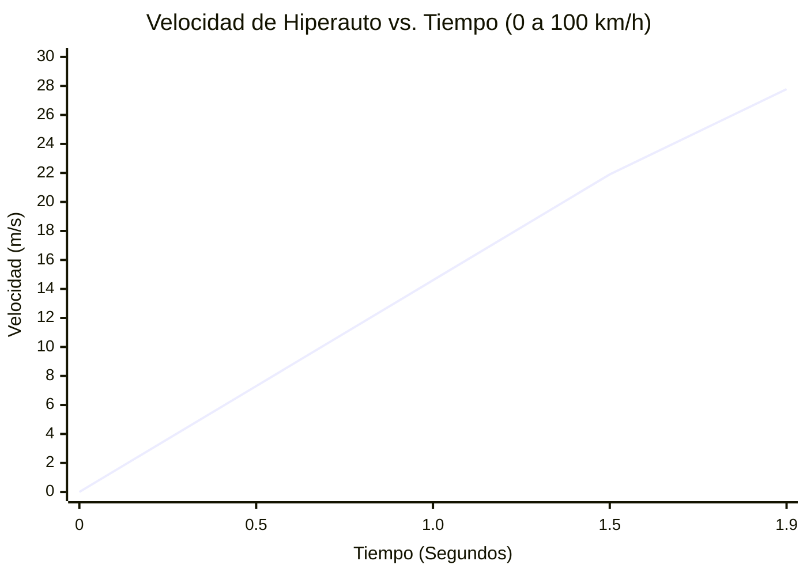
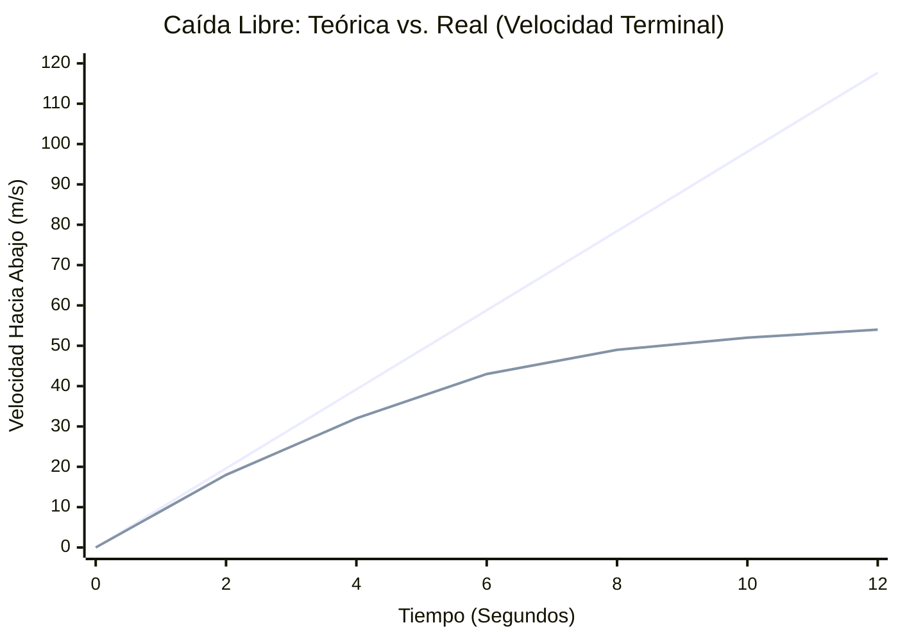
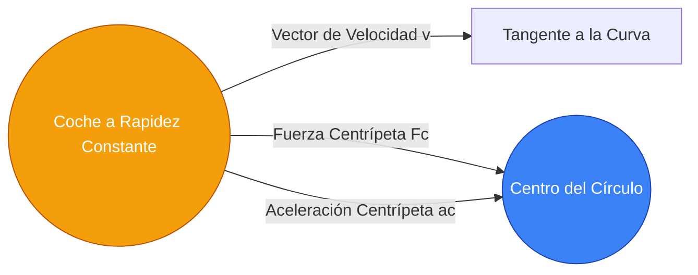

# La Calculadora Definitiva de Aceleración: Dominando la Fuerza G, el Cambio de Velocidad y la Cinemática

Bienvenido a la **Calculadora de Aceleración** definitiva y la guía completa de física. Ya seas un ingeniero automotriz tratando de calcular el sprint de 0-60 mph de un hiperauto, un estudiante preparándose para un examen de cinemática de Física AP, o un entusiasta de la aviación con curiosidad sobre las fuerzas G aplastantes experimentadas por los pilotos de combate, esta herramienta está diseñada para ti.

La aceleración es el motor del cambio en el mundo físico. Es el emocionante empuje que sientes en tu pecho durante el lanzamiento de una montaña rusa y la violenta fuerza de frenado que te salva la vida en un accidente automovilístico. En esta masiva guía de más de 4,000 palabras, desmitificaremos por completo la aceleración. Exploraremos los fundamentos matemáticos de la cinemática, diseccionaremos la diferencia entre la aceleración uniforme y variable, te guiaremos a través del uso de nuestra calculadora interactiva y analizaremos cinco ejemplos conceptuales del mundo real visualizados con diagramas detallados de Mermaid.js.

---

## 1. La Experiencia Humana de la Aceleración

Antes de sumergirnos en las matemáticas, es crucial entender cómo los humanos experimentan la aceleración. Como organismos biológicos, somos completamente ciegos a la velocidad constante. Si estás sentado en un tren bala viajando a unos perfectamente suaves 300 km/h con las ventanas cerradas, fácilmente podrías servir una taza de café. Tu cuerpo se siente como si estuviera completamente inmóvil.

Lo que los humanos *sí pueden* sentir es la **aceleración**—la tasa de cambio en esa velocidad. Cuando el tren bala sale de la estación, te sientes empujado hacia el asiento. Cuando frena, te inclinas hacia adelante. Nuestro oído interno (el sistema vestibular) es esencialmente un acelerómetro biológico tridimensional y altamente sensible.

### Por qué la Aceleración es Importante en la Ingeniería
En el mundo de la ingeniería, manejar la aceleración suele ser más importante que manejar la velocidad máxima.
- **Automoción:** Diseñar sistemas de frenos antibloqueo (ABS) es un ejercicio para maximizar la aceleración negativa (desaceleración) sin romper la fricción estática.
- **Aeroespacial:** Un transbordador espacial debe alcanzar los 28,000 km/h para orbitar la Tierra, pero si acelera demasiado rápido (por encima de 3g), los astronautas se desmayarán y la inmensa presión aerodinámica (Max Q) destrozará el vehículo.
- **Arquitectura:** Los rascacielos y puentes colgantes están diseñados no solo para soportar peso, sino también para resistir la aceleración lateral causada por vientos huracanados y terremotos.

---

## 2. Las Matemáticas Centrales: Escalares, Vectores y Ecuaciones

En física, la aceleración ($a$) se define como la tasa a la cual un objeto cambia su velocidad a lo largo del tiempo. Debido a que la velocidad es un **vector** (lo que significa que tiene tanto magnitud como dirección), la aceleración también es un vector.

Esto lleva a una conclusión crítica: **Puedes acelerar sin siquiera cambiar tu rapidez.**
Si conduces tu auto en un círculo perfecto a una rapidez constante de 30 mph, tu velocidad está cambiando constantemente porque tu *dirección* está cambiando constantemente. Por lo tanto, estás en un estado de aceleración continua (específicamente, aceleración centrípeta empujándote hacia el centro del círculo).

### La Ecuación Fundamental de la Aceleración Media
La definición algebraica más básica de aceleración media es el cambio en la velocidad ($\Delta v$) dividido por el cambio en el tiempo ($\Delta t$):

$$ a = \frac{v_f - v_i}{t} $$

Donde:
- **$a$** = Aceleración
- **$v_f$** = Velocidad Final
- **$v_i$** = Velocidad Inicial
- **$t$** = Duración del tiempo

### Las Cuatro Ecuaciones Cinemáticas (Para Aceleración Uniforme)
Cuando la aceleración es constante (uniforme), como un objeto en caída libre cerca de la superficie de la Tierra (ignorando la resistencia del aire), podemos usar las cuatro ecuaciones cinemáticas clásicas para resolver cualquier variable faltante:

1. **Resolviendo para la Velocidad Final:**
   $$ v_f = v_i + a \cdot t $$
2. **Resolviendo para el Desplazamiento (Distancia) sin la Velocidad Final:**
   $$ d = v_i \cdot t + \frac{1}{2} a \cdot t^2 $$
3. **La Ecuación Independiente del Tiempo (Resolviendo la Velocidad Final sin el Tiempo):**
   $$ v_f^2 = v_i^2 + 2 \cdot a \cdot d $$
4. **Resolviendo para el Desplazamiento sin Aceleración:**
   $$ d = \left(\frac{v_i + v_f}{2}\right) \cdot t $$

Nuestra calculadora avanzada utiliza todas estas ecuaciones dinámicamente. Simplemente ingresas las variables que conoces y el motor de fondo de la calculadora determina qué ecuación aplicar para encontrar los datos que faltan.

---

## 3. Guía de Uso Completa: Maximizando la Calculadora

Nuestra Calculadora de Aceleración interactiva está construida con una interfaz de doble modo para acomodar tanto los cálculos diarios rápidos como la tarea compleja de física. Así es como puedes usarla eficazmente.

### Paso 1: Selecciona tu Objetivo de Cálculo
En la parte superior del panel, elige qué deseas resolver:
- **Aceleración (a):** Selecciona esto si sabes qué tan rápido comenzó un objeto, qué tan rápido terminó y cuánto tiempo tomó.
- **Velocidad Final (vf):** Selecciona esto si conoces la rapidez inicial de un vehículo, su tasa de aceleración y el tiempo transcurrido.
- **Velocidad Inicial (vi):** Selecciona esto si conoces la rapidez final y quieres calcular hacia atrás para averiguar a qué rapidez iba originalmente.
- **Tiempo (t):** Selecciona esto si necesitas saber cuánto tiempo le tomará a un vehículo alcanzar una velocidad objetivo a una tasa de aceleración específica.

### Paso 2: Ingresa los Valores y Maneja las Unidades
A diferencia de las calculadoras tradicionales, no necesitas convertir tus unidades de antemano.
- Puedes ingresar la velocidad inicial en **mph**, la velocidad final en **km/h** y el tiempo en **minutos**.
- El motor de conversión de la calculadora normaliza instantáneamente todos los ingresos a unidades del SI (metros y segundos), realiza el cálculo de física y produce el resultado.
- Las unidades de salida para la aceleración incluyen $m/s^2$, $ft/s^2$, $km/h/s$ y **Fuerza G ($g$)**.

### Paso 3: Interpreta el Medidor de Arco de Fuerza G
Una vez que se completa un cálculo, el **Medidor de Arco de Fuerza G** se actualiza de inmediato.
- La gravedad estándar de la Tierra (1g) es aproximadamente $9.81\text{ m/s}^2$.
- El medidor de arco visual proporciona codificación por colores intuitiva: Verde para los límites seguros para los humanos (0 a 2g), Amarillo para los límites intensos (3g a 5g, como en un jet de combate) y Rojo para los límites peligrosos (6g+).
- Si tu aceleración es negativa (desaceleración), el medidor gira hacia la izquierda, indicando fuerza de frenado.

### Paso 4: Utiliza el Simulador de Movimiento y los Gráficos
Al alternar al **Modo Avanzado**, obtienes acceso a los gráficos interactivos de Recharts.
- El **Gráfico de Velocidad vs. Tiempo** traza la trayectoria de la rapidez. Para una aceleración constante, esta será una línea inclinada recta.
- El **Gráfico de Posición vs. Tiempo** mostrará una parábola curva, demostrando cómo el desplazamiento aumenta exponencialmente bajo la aceleración.

---

## 4. Cinco Ejemplos Conceptuales con Visualizaciones 2D

Para reducir la brecha entre la teoría matemática y la aplicación en el mundo real, exploremos cinco ejemplos detallados de aceleración, utilizando Mermaid.js para visualizar la física.

### Ejemplo 1: El Sprint de 0-100 km/h de un Hiperauto (Calculando la Aceleración Básica)

**El Escenario:**
Un hiperauto eléctrico de alto rendimiento presume que puede acelerar desde el reposo (0 km/h) a 100 km/h en solo 1.9 segundos. ¿Cuál es su aceleración media en $m/s^2$ y cuántas fuerzas G está experimentando el conductor?

**Las Matemáticas:**
- Velocidad Inicial ($v_i$) = 0 km/h = 0 m/s
- Velocidad Final ($v_f$) = 100 km/h. Para convertir a m/s, divide por 3.6: $100 / 3.6 = 27.78\text{ m/s}$.
- Tiempo ($t$) = 1.9 s

Usando la ecuación fundamental:
$$ a = \frac{v_f - v_i}{t} = \frac{27.78 - 0}{1.9} = 14.62\text{ m/s}^2 $$

Para encontrar la fuerza G, divide la aceleración entre la gravedad de la Tierra ($9.81\text{ m/s}^2$):
$$ \text{Fuerza G} = \frac{14.62}{9.81} = 1.49g $$

¡El conductor está experimentando casi 1.5 veces su propio peso corporal empujándolo hacia el asiento!

**Visualización 2D:**
El gráfico de velocidad vs. tiempo a continuación demuestra este aumento rápido y lineal de la velocidad.



---

### Ejemplo 2: La Parada de Emergencia (Desaceleración y Desplazamiento)

**El Escenario:**
Un conductor va por la autopista a 120 km/h (33.3 m/s). De repente, un ciervo salta a la carretera. El conductor pisa los frenos y el sistema de frenos antibloqueo del auto aplica una desaceleración constante de $-8.5\text{ m/s}^2$. ¿Cuánto tiempo le toma al auto detenerse por completo y cuál es la distancia de frenado?

**Las Matemáticas:**
- $v_i$ = 33.3 m/s
- $v_f$ = 0 m/s (parada completa)
- $a$ = -8.5 $m/s^2$

Primero, calcula el tiempo requerido para detenerse:
$$ t = \frac{v_f - v_i}{a} = \frac{0 - 33.3}{-8.5} = 3.92\text{ segundos} $$

A continuación, calcula la distancia de frenado ($d$) usando la ecuación de desplazamiento:
$$ d = v_i \cdot t + \frac{1}{2} a \cdot t^2 $$
$$ d = (33.3 \times 3.92) + 0.5 \times (-8.5) \times (3.92)^2 $$
$$ d = 130.54 - 65.31 = 65.23\text{ metros} $$

El auto viajará más de 65 metros (más de la mitad de un campo de fútbol) antes de detenerse por completo.

**Visualización 2D:**
Este diagrama de flujo visualiza la secuencia de cinemática utilizada por el motor interno de nuestra calculadora para resolver las variables faltantes cuando hay desaceleración de por medio.

```mermaid
flowchart TD
    A[Variables Ingresadas:<br/>vi = 33.3 m/s<br/>vf = 0 m/s<br/>a = -8.5 m/s²] --> B{Calcular Tiempo}
    B -->|t = (vf - vi) / a| C[Tiempo = 3.92 s]
    C --> D{Calcular Distancia}
    A --> D
    D -->|d = vi*t + 0.5*a*t²| E[Distancia = 65.23 m]
    style A fill:#3b82f6,stroke:#1e40af,color:#fff
    style C fill:#10b981,stroke:#047857,color:#fff
    style E fill:#ef4444,stroke:#b91c1c,color:#fff
```

---

### Ejemplo 3: El Objeto en Caída y la Velocidad Terminal

**El Escenario:**
Un paracaidista salta de un avión. Si ignoramos la resistencia del aire, la gravedad dicta que acelerará hacia abajo a $9.81\text{ m/s}^2$. ¿Cuál es su velocidad después de 5 segundos de caída libre?

**Las Matemáticas (Sin Resistencia del Aire):**
- $v_i$ = 0 m/s
- $a$ = 9.81 $m/s^2$
- $t$ = 5 s
$$ v_f = 0 + (9.81 \times 5) = 49.05\text{ m/s} \text{ (aprox 176 km/h)} $$

**La Realidad (Con Resistencia del Aire):**
En el mundo real, a medida que la velocidad del paracaidista aumenta, el arrastre aerodinámico que empuja hacia arriba también aumenta. Eventualmente, la fuerza de arrastre hacia arriba iguala perfectamente la fuerza gravitacional hacia abajo. La fuerza neta se vuelve cero ($F = 0$), lo que significa que la aceleración se vuelve cero ($a = 0$). El paracaidista deja de acelerar y continúa cayendo a una rapidez máxima constante conocida como **Velocidad Terminal** (aproximadamente 54 m/s para un humano).

**Visualización 2D:**
Este gráfico traza la velocidad teórica (una línea recta) frente a la velocidad real (una curva que se aplana a medida que se acerca a la velocidad terminal).


*(Línea 1: Vacío Teórico. Línea 2: Atmósfera real curvándose hasta aplanarse en la velocidad terminal).*

---

### Ejemplo 4: La Línea de Tiempo de Etapas del Cohete Espacial

**El Escenario:**
Un vehículo de lanzamiento orbital de múltiples etapas no experimenta una aceleración constante. A medida que el combustible se quema rápidamente, la masa del cohete disminuye drásticamente. De acuerdo con $a = F/m$, si la fuerza de empuje ($F$) se mantiene constante mientras que la masa ($m$) disminuye, la aceleración ($a$) debe aumentar continuamente.

Cuando el cohete suelta una etapa de combustible vacía (separación de etapas), la masa cambia al instante, creando una sacudida masiva en la aceleración.

**Visualización 2D:**
El diagrama de Gantt a continuación ilustra una línea de tiempo simplificada de lanzamiento de un cohete, mapeando los eventos de la misión con los entornos de aceleración rápidamente cambiantes experimentados por la tripulación.

```mermaid
gantt
    title Perfil de Aceleración en el Lanzamiento de Cohete Orbital
    dateFormat  m
    axisFormat %M
    section Etapa 1 (Impulso)
    Ignición (1.5g) :active, 0, 1m
    Aceleración Máxima Q (2.0g) : 1m, 2m
    Pico antes de MECO (3.5g) :crit, 2m, 3m
    section Etapa 2 (Orbital)
    Separación de Etapas (Sacudida 0g) :milestone, 3, 0m
    Quemado de Segunda Etapa (1.2g a 3g) :active, 3m, 7m
    section Inercia
    Apagado del Motor (Cero G) :milestone, 7, 0m
    Inercia Orbital (0g) : 7m, 10m
```

---

### Ejemplo 5: Aceleración Centrípeta (La Fuerza en las Curvas)

**El Escenario:**
Un coche de Fórmula 1 está recorriendo una curva larga y amplia con un radio de 50 metros. El conductor mantiene una rapidez perfectamente constante de 100 km/h (27.7 m/s) a lo largo de toda la curva. Ya que la rapidez es constante, ¿está acelerando el auto?

**Las Matemáticas:**
¡Sí! La velocidad es un vector. Al girar el volante, el conductor está cambiando constantemente la *dirección* del vector de velocidad. Cambiar un vector de velocidad requiere fuerza y resulta en aceleración. Este tipo específico se llama **Aceleración Centrípeta** ($a_c$) y apunta directamente hacia el centro del círculo.

La fórmula de la aceleración centrípeta es:
$$ a_c = \frac{v^2}{r} $$
Donde $v$ es la velocidad y $r$ es el radio de la curva.

- $v$ = 27.7 m/s
- $r$ = 50 m
$$ a_c = \frac{27.7^2}{50} = \frac{767.29}{50} = 15.34\text{ m/s}^2 $$

En términos de fuerza G:
$$ \text{Fuerza G} = \frac{15.34}{9.81} = 1.56g $$
El cuello del conductor debe soportar 1.56 veces el peso de su propia cabeza empujando hacia afuera (debido a la inercia, a menudo llamada equivocadamente fuerza centrífuga) contra la curva.

**Visualización 2D:**
El siguiente diagrama muestra la relación vectorial en un movimiento circular.



---

## 5. Profundización en Preguntas Frecuentes (FAQ)

**P: ¿Puedes tener una aceleración negativa pero ir más rápido?**
**R:** Sí, ¡absolutamente! Este es uno de los obstáculos más comunes en la cinemática. Un signo negativo en física simplemente indica dirección relativa a un eje elegido. Si defines "Derecha" como positivo e "Izquierda" como negativo, un automóvil que retrocede hacia la "Izquierda" y pisa el acelerador está aumentando su rapidez, pero su velocidad se está volviendo *más negativa* (por ejemplo, de -10 m/s a -20 m/s). Debido a que el cambio en la velocidad es negativo, la aceleración es negativa, ¡incluso si el automóvil está ganando rapidez en dirección inversa!

**P: ¿Qué es el "Jerk" (Tirón) en física?**
**R:** Si la velocidad es la tasa de cambio de la posición, y la aceleración es la tasa de cambio de la velocidad, entonces ¡el **Jerk** es la tasa de cambio de la aceleración! Matemáticamente, es la tercera derivada de la posición. Cuando subes a un ascensor mal diseñado y sientes un repentino e incómodo vuelco en tu estómago cuando empieza a moverse, estás sintiendo un alto *jerk*. Los ingenieros de ascensores controlan cuidadosamente el jerk para asegurarse de que la aceleración aumente suavemente, priorizando la comodidad humana.

**P: ¿Cómo afecta la masa a la aceleración?**
**R:** Según la Segunda Ley de Newton ($a = F / m$), la aceleración es inversamente proporcional a la masa. Si empujas un coche de 1,000 kg con 5,000 Newtons de fuerza, acelerará a $5\text{ m/s}^2$. Si aplicas esa misma fuerza de 5,000 Newtons a un camión enorme de 10,000 kg, solo acelerará a $0.5\text{ m/s}^2$. Es por eso que los vehículos pesados requieren motores inmensamente potentes solo para seguir el ritmo del tráfico en carretera, y por qué necesitan distancias de frenado drásticamente más largas para detenerse.

**P: ¿Es posible viajar a alta velocidad con aceleración cero?**
**R:** Sí. De hecho, si estás leyendo esto en la Tierra, actualmente estás viajando alrededor del Sol a aproximadamente 67,000 mph (107,000 km/h). Sin embargo, debido a que esa velocidad es relativamente constante y el radio de nuestra órbita es tan masivo, la aceleración centrípeta que sentimos es casi cero, así que no la notamos. Aceleración cero simplemente significa que tu rapidez actual y dirección son perfectamente estables.

**P: ¿Cuál es la mayor aceleración que puede sobrevivir un humano?**
**R:** La tolerancia humana a las fuerzas G depende completamente de la dirección de la fuerza y la duración. 
- **Fuerzas G Verticales (Cabeza a Pies):** La sangre drena del cerebro, causando un desmayo (G-LOC). Los pilotos de combate que usan trajes G de compresión especializados y practican maniobras de esfuerzo pueden sostener 9g durante unos segundos.
- **Fuerzas G Horizontales (Pecho a Espalda):** Los humanos son mucho más resistentes a la aceleración de "globos oculares hacia adentro". Los astronautas en el transbordador espacial experimentaban 3g durante minutos en el lanzamiento. En 1954, el Dr. John Stapp montó en un trineo propulsado por cohetes y desaceleró a 46.2g durante una fracción de segundo, probando que los humanos podían sobrevivir impactos instantáneos masivos, aunque sufrió hematomas severos y ceguera temporal.

---

## 6. Conclusión y Ejercicios Prácticos

Los conceptos de cinemática y aceleración proporcionan el marco matemático necesario para diseñar desde montañas rusas hasta cohetes interplanetarios. 

Para poner a prueba tu comprensión usando nuestra calculadora interactiva, intenta los siguientes ejercicios prácticos:
1. **La Caída del Cuarto de Milla:** Calcula cuánto tiempo le toma a un objeto en caída libre ($a = 9.81\text{ m/s}^2$) caer un cuarto de milla (402 metros) empezando desde el reposo ($v_i = 0$). 
2. **La Prueba de Frenado F1:** Un coche de Fórmula 1 desacelera de 300 km/h a 80 km/h en solo 1.5 segundos entrando en una chicana cerrada. Usa la calculadora para encontrar la desaceleración en $m/s^2$ y conviértela en fuerza G.
3. **El Módulo Lunar:** El Módulo Lunar Apolo utilizó un motor de descenso para aterrizar en la Luna, donde la gravedad es de solo $1.62\text{ m/s}^2$. Calcula la fuerza de frenado necesaria para contrarrestar la gravedad lunar.

Sigue explorando las visualizaciones, prueba los casos extremos y confía en esta calculadora para resolver tus problemas más complejos de cinemática en 1D con absoluta precisión.
