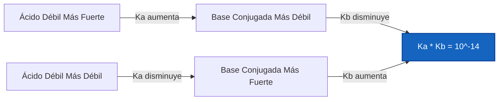

# Guía de Química Analítica y de Laboratorio para el Equilibrio y Análisis Ácido-Base

En la química analítica, física y biológica, el **equilibrio ácido-base** rige la concentración de iones de hidrógeno ($\text{pH}$), las constantes de disociación ($K_a, K_b$), las reacciones de neutralización y la distribución de especies:

$$\text{pH} = -\log_{10}[\text{H}^+] \quad \iff \quad [\text{H}^+] = 10^{-\text{pH}}$$

$$K_a \cdot K_b = K_w \quad \iff \quad \text{p}K_a + \text{p}K_b = \text{p}K_w \quad (14.00 \text{ a } 25^\circ\text{C})$$

$$x^2 + K_a x - K_a C = 0 \quad \implies \quad [\text{H}^+] = \frac{-K_a + \sqrt{K_a^2 + 4 K_a C}}{2}$$

---

## 1. Matriz de Referencia de Fuerza y Disociación Ácido-Base

| Especie Química | Fórmula | Tipo | $K_a$ / $K_b$ ($25^\circ\text{C}$) | $\text{p}K_a$ / $\text{p}K_b$ | Comportamiento de Disociación |
| :--- | :--- | :--- | :--- | :--- | :--- |
| **Ácido Clorhídrico** | $\text{HCl}$ | Ácido Monoprótico Fuerte | Completa ($> 10^6$) | $< -6$ | 100% ionizado en $\text{H}_2\text{O}$ |
| **Ácido Sulfúrico** | $\text{H}_2\text{SO}_4$ | Ácido Diprótico Fuerte | $K_{a1} \gg 1, K_{a2} = 1.2 \cdot 10^{-2}$ | $\text{p}K_{a2} = 1.92$ | Disociación gradual en 2 etapas |
| **Ácido Acético** | $\text{CH}_3\text{COOH}$ | Ácido Monoprótico Débil | $1.8 \cdot 10^{-5}$ | $4.76$ | Ionización parcial ($\sim 1.3\%$) |
| **Amoníaco** | $\text{NH}_3$ | Base Monoprótica Débil | $1.8 \cdot 10^{-5}$ | $\text{p}K_b = 4.75$ | Protonación parcial a $\text{NH}_4^+$ |
| **Ácido Fosfórico** | $\text{H}_3\text{PO}_4$ | Ácido Triprótico Débil | $K_{a1}=7.5\cdot 10^{-3}, K_{a2}=6.2\cdot 10^{-8}$ | $\text{p}K_{a1}=2.14, \text{p}K_{a2}=7.20$ | Equilibrios sucesivos en 3 etapas |

---

## 2. Protocolos de Cálculo Ácido-Base Estándar

```
1. Ácido Fuerte: [H+] = C (monoprótico) o 2*C (diprótico H2SO4)
2. Base Fuerte: [OH-] = C (monoprótica) o 2*C (diprótica Ca(OH)2)
3. Cuadrática de Ácido Débil: x^2 + Ka*x - Ka*C = 0 => [H+] = x
4. Cuadrática de Base Débil: x^2 + Kb*x - Kb*C = 0 => [OH-] = x
5. Relación de Par Conjugado: Ka * Kb = Kw, pKa + pKb = pKw
6. Neutralización Estequiométrica: Neutralice el exceso de H+ o OH- primero, luego resuelva el equilibrio
```

---

## 3. Descargo de Responsabilidad de Seguridad de Laboratorio y Educativo
*Esta calculadora ácido-base proporciona cálculos de equilibrio teóricos para aplicaciones educativas, de investigación de laboratorio, y química AP. Las soluciones concentradas no ideales a altas fuerzas iónicas deben tener en cuenta los coeficientes de actividad utilizando ecuaciones de Debye-Hückel o Pitzer.*

## 4. La Guía Completa de Química y Equilibrios Ácido-Base

Bienvenido a la guía definitiva para entender, analizar, y calcular equilibrios Ácido-Base. Desde la digestión altamente corrosiva de ácidos fuertes en la fabricación industrial hasta los delicados amortiguadores fisiológicos de la sangre microajustados que mantienen a los humanos con vida, la química ácido-base es el motor termodinámico fundamental del universo acuoso.

En su núcleo, la química ácido-base es simplemente el estudio de los protones (iones de hidrógeno, $\text{H}^+$). Los ácidos son moléculas construidas para desechar protones, y las bases son moléculas construidas para atraparlos. Las matemáticas que gobiernan este juego de pasar protones van desde logaritmos triviales para ácidos fuertes hasta ecuaciones cuadráticas complejas para electrolitos débiles parcialmente disociados.

En este exhaustivo manual técnico de más de 4000 palabras, desglosaremos completamente la mecánica termodinámica de la disociación de ácidos y bases débiles ($K_a$ y $K_b$), las reglas estequiométricas para neutralizar ácidos y bases entre sí, los límites matemáticos exactos de la aproximación de x pequeña, y analizaremos cinco rigurosos ejemplos químicos del mundo real completos con derivaciones matemáticas y diagramas visuales de Mermaid.

### 4.1 Las Definiciones Fundamentales de Ácidos y Bases

Históricamente, los químicos han definido los ácidos y las bases en tres olas sucesivas de abstracción creciente:

1.  **La Definición de Arrhenius (1884):** Un ácido es una sustancia que produce $\text{H}^+$ en agua, y una base produce $\text{OH}^-$ en agua. (Limitado estrictamente a soluciones acuosas).
2.  **La Definición de Brønsted-Lowry (1923):** Un ácido es un *donante de protones*, y una base es un *aceptor de protones*. (Esta es la definición más útil en la práctica para cálculos de equilibrio, ya que introduce el concepto de **Pares Conjugados**).
3.  **La Definición de Lewis (1923):** Un ácido es un aceptor de pares de electrones, y una base es un donante de pares de electrones. (Se usa extensamente en mecanismos de reacciones de química orgánica).

En química analítica y para los propósitos de esta Calculadora de Ácido-Base, nos basamos enteramente en la definición de Brønsted-Lowry. Cuando un Ácido Débil ($\text{HA}$) dona su protón, lo que queda es su Base Conjugada ($\text{A}^-$). 
$$ \text{HA} \rightleftharpoons \text{H}^+ + \text{A}^- $$

### 4.2 Electrolitos Fuertes vs. Débiles

La diferencia entre un ácido fuerte (como el ácido clorhídrico, $\text{HCl}$) y un ácido débil (como el ácido acético, $\text{CH}_3\text{COOH}$) no es su concentración, sino su **grado de disociación**.

Los **Ácidos Fuertes** ($\text{HCl}$, $\text{HNO}_3$, $\text{H}_2\text{SO}_4$) se disocian al 100% en agua. Si coloca 1.0 mol de $\text{HCl}$ en un litro de agua, obtendrá instantáneamente 1.0 mol de iones $\text{H}^+$. Las matemáticas son simples: $[\text{H}^+] = C_{\text{inicial}}$.

Los **Ácidos Débiles**, sin embargo, están atrapados en un equilibrio. Solo se separan parcialmente. Si coloca 1.0 mol de ácido acético en agua, solo alrededor del 0.4% se disocia realmente. El 99.6% de las moléculas permanecen perfectamente intactas como $\text{CH}_3\text{COOH}$. Para determinar exactamente cuánto se disocia, debemos resolver una expresión de equilibrio usando la **Constante de Disociación Ácida ($K_a$)**.

$$ K_a = \frac{[\text{H}^+][\text{A}^-]}{[\text{HA}]} $$

Cuanto mayor sea el $K_a$, más fuerte será el ácido. Debido a que los valores de $K_a$ suelen ser números extremadamente pequeños (como $1.8 \times 10^{-5}$), los químicos prefieren usar el logaritmo negativo en base 10, conocido como $\text{p}K_a$.

$$ \text{p}K_a = -\log_{10}(K_a) $$

**Regla Crucial:** Cuanto menor es el $\text{p}K_a$, más fuerte es el ácido débil.

### 4.3 El Solucionador Cuadrático de Equilibrio

Para encontrar el pH de un ácido débil, debemos resolver para $[\text{H}^+]$, al que llamaremos $x$. En el equilibrio, $[\text{H}^+] = x$, $[\text{A}^-] = x$, y el ácido intacto restante $[\text{HA}] = C_{\text{inicial}} - x$.

Sustituya esto en la expresión de $K_a$:
$$ K_a = \frac{x \cdot x}{C - x} = \frac{x^2}{C - x} $$

Reordenar esto nos da una ecuación cuadrática estándar:
$$ x^2 + K_a x - K_a C = 0 $$

Nuestra Calculadora de Ácido-Base utiliza la fórmula cuadrática exacta para garantizar la precisión analítica al resolver para $x$ ($[\text{H}^+]$):
$$ x = \frac{-K_a + \sqrt{K_a^2 - 4(1)(-K_a C)}}{2} $$

*Nota: Muchos libros de texto introductorios enseñan la "aproximación de x pequeña", asumiendo que $C - x \approx C$, lo que simplifica la matemática a $x = \sqrt{K_a \cdot C}$. Sin embargo, esta aproximación falla catastróficamente si el ácido es relativamente fuerte (un $K_a$ grande) o está muy diluido. Nuestra calculadora **nunca** usa la aproximación; siempre resuelve la cuadrática exacta.*

### 4.4 Neutralización Estequiométrica

¿Qué sucede cuando mezclas un ácido fuerte y una base fuerte? Se destruyen mutuamente para formar agua. Esto no es un equilibrio; es una destrucción estequiométrica unidireccional conocida como **Neutralización**.

$$ \text{H}^+ + \text{OH}^- \longrightarrow \text{H}_2\text{O} $$

Para calcular el pH final de una solución mixta, debe determinar qué reactivo es el **Reactivo Limitante**. El reactivo limitante se consume por completo, dejando que el reactivo en exceso dicte el pH final del volumen total recientemente expandido.

---

## 5. Guía de Uso: Dominando la Calculadora Ácido-Base

Nuestra Calculadora Ácido-Base está diseñada para resolver instantáneamente cuadráticas complejas, realizar estequiometría de neutralización, y convertir rápidamente constantes conjugadas.

### 5.1 Modo de Equilibrio de Ácido / Base Débil

1.  **Seleccione el Modo:** Elija "Equilibrio de Ácido Débil" o "Equilibrio de Base Débil".
2.  **Parámetros de Entrada:** Ingrese la Concentración Inicial ($C$) y la constante de equilibrio ($K_a$ para ácidos, $K_b$ para bases). También puede ingresar $\text{p}K_a$ o $\text{p}K_b$.
3.  **Leer la Salida:** La calculadora ejecuta de inmediato el solucionador cuadrático exacto para generar el pH final, el pOH, las molaridades exactas de $[\text{H}^+]$ y $[\text{OH}^-]$, y el Porcentaje de Ionización.

### 5.2 Modo Simulador de Neutralización

1.  **Seleccione el Modo:** Elija "Simulador de Neutralización".
2.  **Entrada del Reactivo A (Ácido):** Ingrese el Volumen (mL) y la Concentración (M) de su ácido fuerte.
3.  **Entrada del Reactivo B (Base):** Ingrese el Volumen (mL) y la Concentración (M) de su base fuerte.
4.  **Ejecutar:** La herramienta calcula los moles totales de cada uno, resta el reactivo limitante, calcula el nuevo volumen total, y deriva el pH final del reactivo en exceso.

### 5.3 Modo Convertidor de Conjugados Ka / Kb

1.  **Seleccione el Modo:** Elija "Convertidor de Conjugados Ka / Kb".
2.  **Ingresar Constante:** Ingrese su $K_a$, $K_b$, $\text{p}K_a$, o $\text{p}K_b$ conocido.
3.  **Ejecutar:** La herramienta calcula instantáneamente las otras tres variables faltantes utilizando la relación termodinámica fundamental: $K_a \times K_b = 1.0 \times 10^{-14}$.

---

## 6. Cinco Ejemplos Conceptuales del Mundo Real

Las matemáticas abstractas se convierten en herramientas poderosas cuando se aplican a la química física. A continuación, se presentan cinco ejemplos rigurosos que cubren equilibrios de ácidos débiles, disociación de bases fuertes, conversiones de pares conjugados y neutralización de reactivos limitantes.

### Ejemplo 1: El pH del Vinagre (Equilibrio de Ácido Débil)

**Escenario:** 
El vinagre blanco estándar para uso doméstico es una solución $0.80\text{ M}$ de Ácido Acético ($\text{CH}_3\text{COOH}$). El $\text{p}K_a$ del ácido acético es 4.76. ¿Cuál es el pH exacto del vinagre y qué porcentaje del ácido está realmente ionizado?

**Derivación Matemática:**

1.  **Identificar Componentes:**
    Concentración Inicial $C = 0.80\text{ M}$
    $\text{p}K_a$ del Ácido $= 4.76 \implies K_a = 10^{-4.76} = 1.74 \times 10^{-5}$
2.  **Configurar la Ecuación Cuadrática:**
    $$ x^2 + K_a x - K_a C = 0 $$
    $$ x^2 + (1.74 \times 10^{-5})x - (1.74 \times 10^{-5})(0.80) = 0 $$
    $$ x^2 + 1.74 \times 10^{-5}x - 1.39 \times 10^{-5} = 0 $$
3.  **Resolver para $x$ ($[\text{H}^+]$):**
    $$ x = 3.72 \times 10^{-3}\text{ M} $$
4.  **Calcular el pH:**
    $$ \text{pH} = -\log_{10}(3.72 \times 10^{-3}) = 2.43 $$
5.  **Calcular el Porcentaje de Ionización:**
    $$ \% \text{ Ionizado} = \left(\frac{x}{C}\right) \times 100 = \left(\frac{3.72 \times 10^{-3}}{0.80}\right) \times 100 = 0.465\% $$

**Conclusión:** El pH del vinagre es 2.43. Sorprendentemente, menos de la mitad del uno por ciento (0.465%) de las moléculas de ácido acético realmente se separaron. La gran mayoría permanecen intactas.

### Ejemplo 2: El pH del Hidróxido de Bario (Base Diprótica Fuerte)

**Escenario:**
Un técnico de laboratorio prepara una solución $0.015\text{ M}$ de Hidróxido de Bario ($\text{Ba(OH)}_2$). Dado que el hidróxido de bario es una base fuerte y soluble, se disocia al 100%. ¿Cuál es el pH?

**Derivación Matemática:**

1.  **Identificar la Estequiometría:**
    $\text{Ba(OH)}_2 \longrightarrow \text{Ba}^{2+} + 2\text{OH}^-$
    Un mol de hidróxido de bario produce **dos** moles de hidróxido.
2.  **Calcular $[\text{OH}^-]$:**
    $$ [\text{OH}^-] = 2 \times 0.015\text{ M} = 0.030\text{ M} $$
3.  **Calcular pOH:**
    $$ \text{pOH} = -\log_{10}(0.030) = 1.52 $$
4.  **Calcular pH:**
    $$ \text{pH} = 14.00 - \text{pOH} = 14.00 - 1.52 = 12.48 $$

**Conclusión:** El pH es 12.48, lo que lo convierte en una solución altamente alcalina. No tener en cuenta la naturaleza diprótica (el "2") habría dado como resultado un pH incorrecto de 12.18.

### Ejemplo 3: Encontrar el Kb del Acetato (Matemática de Pares Conjugados)

**Escenario:**
Sabemos que el $K_a$ del Ácido Acético ($\text{CH}_3\text{COOH}$) es $1.74 \times 10^{-5}$. Un estudiante disuelve Acetato de Sodio puro ($\text{CH}_3\text{COONa}$) en agua. El acetato es la base conjugada, y actuará como una base débil. ¿Cuál es su $K_b$?

**Derivación Matemática:**

1.  **Aplicar la Ley de Pares Conjugados ($25^\circ\text{C}$):**
    $$ K_a \times K_b = 1.0 \times 10^{-14} $$
2.  **Resolver para $K_b$:**
    $$ K_b = \frac{1.0 \times 10^{-14}}{1.74 \times 10^{-5}} $$
    $$ K_b = 5.75 \times 10^{-10} $$
3.  **Calcular $\text{p}K_b$:**
    $$ \text{p}K_b = -\log_{10}(5.75 \times 10^{-10}) = 9.24 $$
    *(Verificación: $\text{p}K_a (4.76) + \text{p}K_b (9.24) = 14.00$. Las matemáticas son perfectas).*

**Visualización: El Balancín de Pares Conjugados**



*Este diagrama de flujo visualiza el balancín termodinámico de pares conjugados: a medida que un ácido se vuelve más fuerte, su base conjugada se vuelve estrictamente más débil para mantener la constante $K_w$.*

### Ejemplo 4: Neutralización Estequiométrica Ácido-Base

**Escenario:**
Mezclamos $50.0\text{ mL}$ de $0.200\text{ M HCl}$ (Ácido Fuerte) con $150.0\text{ mL}$ de $0.100\text{ M NaOH}$ (Base Fuerte). ¿Cuál es el pH final de la mezcla resultante?

**Derivación Matemática:**

1.  **Calcular Moles Iniciales (Volumen $\times$ Molaridad):**
    $\text{Moles de H}^+ = 0.050\text{ L} \times 0.200\text{ M} = 0.010\text{ moles H}^+$
    $\text{Moles de OH}^- = 0.150\text{ L} \times 0.100\text{ M} = 0.015\text{ moles OH}^-$
2.  **Realizar Neutralización Estequiométrica:**
    Los $0.010\text{ moles}$ de $\text{H}^+$ destruirán por completo los $0.010\text{ moles}$ de $\text{OH}^-$.
    El $\text{H}^+$ es el reactivo limitante y se reduce a $0\text{ moles}$.
    $\text{Exceso de OH}^- = 0.015 - 0.010 = 0.005\text{ moles OH}^-$ restantes.
3.  **Calcular el Nuevo Volumen Total:**
    $\text{Volumen Total} = 50.0\text{ mL} + 150.0\text{ mL} = 200.0\text{ mL} = 0.200\text{ L}$
4.  **Calcular la Molaridad de Exceso Final:**
    $$ [\text{OH}^-] = \frac{0.005\text{ moles}}{0.200\text{ L}} = 0.025\text{ M} $$
5.  **Calcular pOH y pH:**
    $$ \text{pOH} = -\log_{10}(0.025) = 1.60 $$
    $$ \text{pH} = 14.00 - 1.60 = 12.40 $$

**Conclusión:** La mezcla final es altamente básica con un pH de 12.40. El exceso de base fuerte controla por completo el ambiente final.

**Visualización: Secuencia de Laboratorio de Neutralización**

```mermaid
gantt
    title Cronograma de Laboratorio: Neutralización Ácido-Base
    dateFormat  HH:mm:ss
    axisFormat  %H:%M
    section Reactivos
    Preparar 50mL 0.2M HCl :active, 00:00:00, 00:05:00
    Preparar 150mL 0.1M NaOH :active, 00:00:00, 00:05:00
    section Reacción
    Mezclar Reactivos (H+ + OH- => H2O) :crit, 00:05:00, 00:10:00
    section Análisis
    Medir Concentración Exceso OH- :milestone, 00:10:00, 00:15:00
    Registrar pH Final 12.40 :milestone, 00:15:00, 00:15:00
```



*Este cronograma de Gantt traza la secuencia crítica de la preparación de los reactivos, el inicio de la rápida neutralización estequiométrica, y el análisis del exceso de base.*

### Ejemplo 5: Cuando Falla la Aproximación de x pequeña

**Escenario:**
Calcule el pH de una solución altamente diluida de $0.0010\text{ M}$ de Ácido Cloroacético ($\text{p}K_a = 2.87 \implies K_a = 1.35 \times 10^{-3}$). Compare el solucionador cuadrático exacto con la "aproximación de x pequeña".

**Derivación Matemática (Aproximación de x pequeña):**

1.  **Asumir $C - x \approx C$:**
    $$ x = \sqrt{K_a \cdot C} $$
    $$ x = \sqrt{(1.35 \times 10^{-3})(0.0010)} $$
    $$ x = \sqrt{1.35 \times 10^{-6}} = 1.16 \times 10^{-3}\text{ M H}^+ $$
    ¡Espere! La concentración inicial fue de solo $1.0 \times 10^{-3}\text{ M}$. La aproximación afirma que generamos *más* $\text{H}^+$ que el ácido total con el que empezamos (116% de ionización). Esto es físicamente imposible. La aproximación ha fallado catastróficamente.

**Derivación Matemática (Cuadrática Exacta):**

1.  **Usar la Cuadrática completa:**
    $$ x^2 + K_a x - K_a C = 0 $$
    $$ x^2 + (1.35 \times 10^{-3})x - 1.35 \times 10^{-6} = 0 $$
2.  **Resolver a través de la Fórmula Cuadrática:**
    $$ x = \frac{-1.35 \times 10^{-3} + \sqrt{(1.35 \times 10^{-3})^2 - 4(1)(-1.35 \times 10^{-6})}}{2} $$
    $$ x = 6.45 \times 10^{-4}\text{ M H}^+ $$
3.  **Calcular pH Exacto:**
    $$ \text{pH} = -\log_{10}(6.45 \times 10^{-4}) = 3.19 $$

**Conclusión:** El pH exacto es 3.19 (con una ionización lógica del 64.5%). La aproximación de x pequeña falló porque el ácido es relativamente fuerte (bajo $\text{p}K_a$) y altamente diluido, empujando el porcentaje de ionización mucho más allá del límite seguro del 5%. Nuestra calculadora siempre usa la cuadrática exacta para evitar esta falla.

---

## 7. Preguntas Frecuentes Profundas y Solución de Problemas Avanzados

**P: ¿Puede un pH ser negativo?**
**R:** Sí, absolutamente. Si tiene una solución $2.0\text{ M}$ de Ácido Clorhídrico fuerte ($\text{HCl}$), el $[\text{H}^+]$ es $2.0\text{ M}$. El pH es $-\log_{10}(2.0) = -0.30$. La escala de pH de 0-14 es simplemente un rango conveniente para soluciones estándar; no es un límite físico.

**P: ¿Por qué el pH neutral del agua cambia con la temperatura?**
**R:** La autoionización del agua ($\text{H}_2\text{O} \rightleftharpoons \text{H}^+ + \text{OH}^-$) es una reacción endotérmica ($\Delta H > 0$). Según el principio de Le Chatelier, la aplicación de calor empuja el equilibrio hacia adelante. A $37^\circ\text{C}$ (temperatura del cuerpo humano), el $K_w$ aumenta a $2.4 \times 10^{-14}$. En consecuencia, el pH neutral (donde $[\text{H}^+] = [\text{OH}^-]$) cae de 7.00 a 6.81. ¡Este es un concepto crítico en el análisis médico de gases en sangre!

**P: ¿Qué es un Ácido Poliprótico?**
**R:** Un ácido poliprótico tiene múltiples protones para donar, como el Ácido Fosfórico ($\text{H}_3\text{PO}_4$) que tiene tres. Donan estos protones en pasos distintos y sucesivos, cada uno con su propio valor de $K_a$ ($K_{a1}$, $K_{a2}$, $K_{a3}$). Generalmente, $K_{a1}$ es significativamente mayor que $K_{a2}$, lo que significa que el primer protón se desprende mucho más fácil que el segundo.

**P: Si mezclo un Ácido Débil y una Base Fuerte, ¿es una neutralización o un equilibrio?**
**R:** Son ambos, ejecutados en secuencia. Primero, la base fuerte neutralizará estequiométricamente el ácido débil hasta que la base se agote. Esto crea una base conjugada en el proceso. Luego, el ácido débil restante y la base conjugada recién formada establecerán un equilibrio (una solución Búfer), que se resuelve a través de la ecuación de Henderson-Hasselbalch.

Al dominar tanto la destructividad estequiométrica de los ácidos fuertes como los delicados equilibrios cuadráticos de los ácidos débiles, usted desbloquea la capacidad de predecir y controlar el pH de cualquier sistema acuoso existente. ¡Confíe siempre en esta Calculadora de Ácido-Base para eludir las peligrosas aproximaciones de "x pequeña" y garantizar la perfección analítica!
