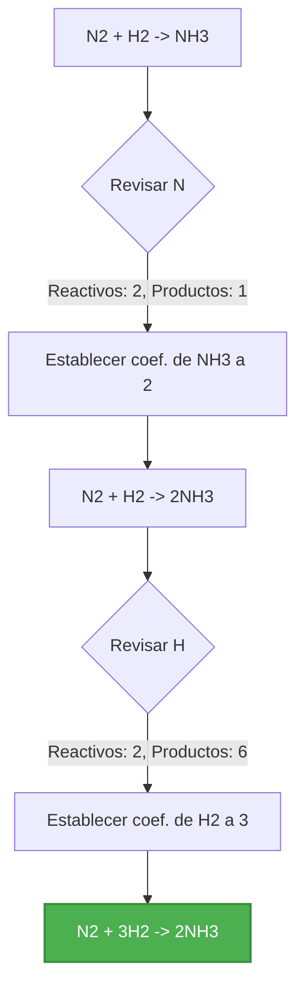

# Guía de Química Analítica y de Laboratorio para el Balanceo de Ecuaciones Químicas

En la estequiometría cuantitativa y la ingeniería química, el **Balanceo de Ecuaciones Químicas** hace cumplir la **Ley de Conservación de la Masa**:

$$\sum \text{Átomos de Reactivos} = \sum \text{Átomos de Productos} \quad \text{para cada elemento } E$$

$$\mathbf{A} \cdot \mathbf{x} = \mathbf{0} \implies \text{Solución del Espacio Nulo Reducida a los Enteros Más Pequeños}$$

---

## 1. Tipos de Reacciones Químicas Estándar y Ejemplos

| Tipo de Reacción | Ecuación No Balanceada | Ecuación Balanceada | Relación Estequiométrica |
| :--- | :--- | :--- | :--- |
| **Síntesis de Agua** | $\text{H}_2 + \text{O}_2 \to \text{H}_2\text{O}$ | $2\text{H}_2 + \text{O}_2 \to 2\text{H}_2\text{O}$ | $2 : 1 : 2$ |
| **Combustión de Metano** | $\text{CH}_4 + \text{O}_2 \to \text{CO}_2 + \text{H}_2\text{O}$ | $\text{CH}_4 + 2\text{O}_2 \to \text{CO}_2 + 2\text{H}_2\text{O}$ | $1 : 2 : 1 : 2$ |
| **Combustión de Propano** | $\text{C}_3\text{H}_8 + \text{O}_2 \to \text{CO}_2 + \text{H}_2\text{O}$ | $\text{C}_3\text{H}_8 + 5\text{O}_2 \to 3\text{CO}_2 + 4\text{H}_2\text{O}$ | $1 : 5 : 3 : 4$ |
| **Oxidación del Hierro (Herrumbre)** | $\text{Fe} + \text{O}_2 \to \text{Fe}_2\text{O}_3$ | $4\text{Fe} + 3\text{O}_2 \to 2\text{Fe}_2\text{O}_3$ | $4 : 3 : 2$ |
| **Sustitución Simple** | $\text{Al} + \text{HCl} \to \text{AlCl}_3 + \text{H}_2$ | $2\text{Al} + 6\text{HCl} \to 2\text{AlCl}_3 + 3\text{H}_2$ | $2 : 6 : 2 : 3$ |

---

## 2. Protocolo de Balanceo de Ecuaciones Estándar

```
   Paso 1: Escriba las fórmulas químicas correctas para todos los reactivos y productos.
   Paso 2: Cuente el número de átomos de cada elemento en ambos lados de la ecuación.
   Paso 3: Inserte coeficientes enteros delante de las fórmulas para balancear los elementos uno por uno.
   Paso 4: NUNCA cambie los subíndices de las fórmulas (ej. cambiar H2O a H2O2 está prohibido).
   Paso 5: Reduzca los coeficientes dividiéndolos por su Máximo Común Divisor (MCD).
   Paso 6: Verifique que el Total de Átomos de Reactivos = Total de Átomos de Productos para todos los elementos.
```

---

## 3. Descargo de Responsabilidad de Seguridad de Laboratorio y Educativa
*Este balanceador de ecuaciones químicas proporciona cálculos estequiométricos automatizados para aplicaciones educativas, de investigación de laboratorio y de química AP. Los mecanismos de reacción industrial complejos deben verificarse contra referencias científicas estándar.*

## 4. La Guía Completa para el Balanceo de Ecuaciones Químicas

Bienvenido al recurso definitivo sobre cómo comprender, dominar y resolver automáticamente ecuaciones químicas. Ya sea que usted sea un estudiante de secundaria que aprende la fundamental Ley de Conservación de la Masa, un académico de Química AP que aborda semirreacciones redox complejas o un ingeniero químico profesional que amplía una síntesis industrial, balancear ecuaciones es la base de las matemáticas químicas.

En el fondo, la química se trata de transformación. Los reactivos chocan, los enlaces se rompen, los átomos se reorganizan y se forman nuevos productos. Sin embargo, debido a que la materia no se puede crear ni destruir, cada uno de los átomos que entra en una reacción debe salir de ella. Este principio inmutable dicta que las ecuaciones químicas deben estar perfectamente balanceadas.

En esta guía exhaustiva, profundizaremos en la mecánica de la estequiometría, exploraremos los potentes algoritmos de álgebra lineal que utiliza nuestra calculadora para resolver cualquier reacción y analizaremos cinco ejemplos muy detallados del mundo real, completos con derivaciones matemáticas y diagramas de flujo visuales en 2D.

### 4.1 La Ley de Conservación de la Masa

En 1789, Antoine Lavoisier estableció la Ley de Conservación de la Masa, que establece que, en un sistema cerrado, la masa no se crea ni se destruye por reacciones químicas o transformaciones físicas. 

Cuando se aplica a ecuaciones químicas, esto significa que la masa de los reactivos debe ser igual a la masa de los productos. Más específicamente, el número exacto de átomos para cada elemento individual en el lado izquierdo de la flecha de reacción (reactivos) debe coincidir perfectamente con el número de átomos en el lado derecho (productos). 

Si escribe una ecuación esquelética como $\text{H}_2 + \text{O}_2 \to \text{H}_2\text{O}$, puede ver que hay dos átomos de oxígeno a la izquierda, pero solo uno a la derecha. Esto representa un escenario imposible en el que un átomo de oxígeno simplemente desapareció de la existencia. Para solucionar esto, debemos balancear la ecuación.

### 4.2 Coeficientes vs. Subíndices

La regla de oro al balancear ecuaciones es **nunca alterar los subíndices** de una fórmula química. 
*   **Subíndices** (los números pequeños en la parte inferior derecha del símbolo de un elemento) dictan la identidad química real de una sustancia. Por ejemplo, cambiar el subíndice en $\text{H}_2\text{O}$ a $\text{H}_2\text{O}_2$ cambia la sustancia de agua que da vida a peróxido de hidrógeno tóxico.
*   **Coeficientes** (los números grandes colocados directamente delante de las fórmulas químicas) dictan la cantidad o proporción molar de esa molécula específica en la reacción.

Para balancear $\text{H}_2 + \text{O}_2 \to \text{H}_2\text{O}$, colocamos un coeficiente de 2 delante del agua para balancear el oxígeno, y un 2 delante del gas hidrógeno para rebalancear el hidrógeno, lo que produce: $2\text{H}_2 + \text{O}_2 \to 2\text{H}_2\text{O}$.

### 4.3 El Método de Matriz de Álgebra Lineal

Si bien las ecuaciones simples se pueden balancear por inspección (prueba y error), las reacciones redox altamente complejas o las ecuaciones de combustión con hidrocarburos masivos pueden ser frustrantemente difíciles de resolver manualmente. 

Nuestra Calculadora de Balanceo de Ecuaciones Químicas utiliza matemáticas avanzadas de **álgebra lineal y matrices**. Trata cada elemento como una fila y cada molécula como una columna en una matriz. Luego, el algoritmo establece un sistema de ecuaciones lineales que representan la conservación de cada elemento y resuelve el espacio nulo de la matriz. 

Debido a que las moléculas fraccionarias no existen en la estequiometría estándar, el algoritmo luego calcula el mínimo común múltiplo para escalar la solución de la matriz en los números enteros positivos más pequeños posibles (el paso de reducción del Máximo Común Divisor). Esto garantiza una precisión matemática del 100% para cualquier ecuación química válida que ingrese.

---

## 5. Guía de Uso: Dominando el Balanceador de Ecuaciones

Nuestra Calculadora de Balanceo de Ecuaciones Químicas está diseñada con una "Cabina Interactiva" intuitiva que proporciona respuestas instantáneas y conocimientos pedagógicos profundos.

### 5.1 Funcionamiento Básico

1.  **Ingrese su Ecuación Esquelética:** Utilice la notación química estándar. Por ejemplo, escriba `C6H12O6 + O2 -> CO2 + H2O`. No tiene que preocuparse por formatear los subíndices; el analizador lo maneja automáticamente.
2.  **Use la Sintaxis Adecuada:** Siempre escriba con mayúscula la primera letra de un elemento (ej. `Na` para sodio, no `na` o `NA`). Use `->`, `=`, o `=>` para separar los reactivos de los productos.
3.  **Haga clic en "Balancear Ecuación":** El motor calculará los coeficientes al instante.

### 5.2 Funciones y Modos Avanzados

*   **Matriz de Conservación de Átomos:** Debajo de la salida balanceada, encontrará una matriz que cuenta el número exacto de átomos de cada elemento en ambos lados de la ecuación. Esto actúa como una prueba matemática de que la ecuación está balanceada.
*   **Balanceo de Redox y Cargas:** Si está ingresando ecuaciones iónicas (ej. `Cu + Ag+ -> Cu2+ + Ag`), la calculadora no solo balanceará los átomos sino que también asegurará que la carga eléctrica neta se conserve en ambos lados.
*   **Herramienta de Ecuación Iónica Neta:** Este modo le permite ingresar ecuaciones iónicas completas. La calculadora identificará los "iones espectadores" (iones que aparecen de manera idéntica en ambos lados) y los tachará automáticamente para proporcionar la ecuación iónica neta simplificada.

---

## 6. Cinco Ejemplos Conceptuales del Mundo Real

Para dominar verdaderamente la estequiometría química, debe ver estos principios aplicados a distintos tipos de reacciones químicas. A continuación se presentan cinco ejemplos detallados que representan diferentes clasificaciones de reacciones, con derivaciones visuales.

### Ejemplo 1: La Combustión de Propano

**Escenario:** 
El propano ($\text{C}_3\text{H}_8$) se utiliza comúnmente en parrillas al aire libre y en la calefacción del hogar. Cuando se quema en presencia de oxígeno ($\text{O}_2$), produce dióxido de carbono ($\text{CO}_2$) y vapor de agua ($\text{H}_2\text{O}$). Necesitamos balancear esta reacción de combustión.

**Ecuación No Balanceada:**
$\text{C}_3\text{H}_8 + \text{O}_2 \to \text{CO}_2 + \text{H}_2\text{O}$

**Derivación Paso a Paso:**

1.  **Balancear el Carbono (C):** Hay 3 carbonos a la izquierda, por lo que colocamos un 3 delante de $\text{CO}_2$.
    *   $\text{C}_3\text{H}_8 + \text{O}_2 \to 3\text{CO}_2 + \text{H}_2\text{O}$
2.  **Balancear el Hidrógeno (H):** Hay 8 hidrógenos a la izquierda, por lo que colocamos un 4 delante de $\text{H}_2\text{O}$.
    *   $\text{C}_3\text{H}_8 + \text{O}_2 \to 3\text{CO}_2 + 4\text{H}_2\text{O}$
3.  **Balancear el Oxígeno (O):** En la derecha, tenemos $(3 \times 2) = 6$ átomos de oxígeno del $\text{CO}_2$ y $(4 \times 1) = 4$ átomos de oxígeno del agua. Total = 10. Para obtener 10 oxígenos a la izquierda, colocamos un 5 delante de $\text{O}_2$.
    *   $\text{C}_3\text{H}_8 + 5\text{O}_2 \to 3\text{CO}_2 + 4\text{H}_2\text{O}$

**Visualización: Matriz de Recuento de Átomos**

| Elemento | Reactivos | Productos | Estado |
| :--- | :--- | :--- | :--- |
| **Carbono (C)** | $1 \times 3 = 3$ | $3 \times 1 = 3$ | Balanceado |
| **Hidrógeno (H)** | $1 \times 8 = 8$ | $4 \times 2 = 8$ | Balanceado |
| **Oxígeno (O)** | $5 \times 2 = 10$ | $6 + 4 = 10$ | Balanceado |

*Esta tabla confirma que la Ley de Conservación de la Masa se cumple estrictamente.*

### Ejemplo 2: El Proceso de Haber-Bosch (Síntesis)

**Escenario:**
El proceso de Haber-Bosch es una de las reacciones industriales más importantes de la historia, sintetizando amoníaco ($\text{NH}_3$) a partir de gases de nitrógeno ($\text{N}_2$) e hidrógeno ($\text{H}_2$) para producir fertilizantes agrícolas.

**Ecuación No Balanceada:**
$\text{N}_2 + \text{H}_2 \to \text{NH}_3$

**Derivación Paso a Paso:**

1.  **Balancear el Nitrógeno (N):** Hay 2 nitrógenos a la izquierda. Coloque un 2 delante de $\text{NH}_3$.
    *   $\text{N}_2 + \text{H}_2 \to 2\text{NH}_3$
2.  **Balancear el Hidrógeno (H):** Ahora hay $(2 \times 3) = 6$ hidrógenos a la derecha. Coloque un 3 delante de $\text{H}_2$ para balancearlo.
    *   $\text{N}_2 + 3\text{H}_2 \to 2\text{NH}_3$

**Visualización: Flujo Lógico Algorítmico**



*Este diagrama de flujo imita la lógica algorítmica de "inspección" utilizada para ecuaciones de síntesis más simples.*

### Ejemplo 3: Fotosíntesis (Reacción Biológica Compleja)

**Escenario:**
Las plantas capturan la energía solar para convertir el dióxido de carbono y el agua en glucosa y gas oxígeno. Este es un proceso bioquímico masivo de múltiples pasos, pero la ecuación química neta general aún debe estar balanceada.

**Ecuación No Balanceada:**
$\text{CO}_2 + \text{H}_2\text{O} \to \text{C}_6\text{H}_{12}\text{O}_6 + \text{O}_2$

**Derivación Paso a Paso:**

1.  **Balancear el Carbono:** Coloque un 6 delante de $\text{CO}_2$.
    *   $6\text{CO}_2 + \text{H}_2\text{O} \to \text{C}_6\text{H}_{12}\text{O}_6 + \text{O}_2$
2.  **Balancear el Hidrógeno:** Coloque un 6 delante de $\text{H}_2\text{O}$.
    *   $6\text{CO}_2 + 6\text{H}_2\text{O} \to \text{C}_6\text{H}_{12}\text{O}_6 + \text{O}_2$
3.  **Balancear el Oxígeno:** El lado izquierdo ahora tiene $(6 \times 2) = 12$ del $\text{CO}_2$ y $(6 \times 1) = 6$ del agua, sumando 18 átomos de oxígeno. El lado derecho tiene 6 en la glucosa. Necesitamos 12 más del gas $\text{O}_2$, por lo que colocamos un 6 delante de él.
    *   $6\text{CO}_2 + 6\text{H}_2\text{O} \to \text{C}_6\text{H}_{12}\text{O}_6 + 6\text{O}_2$

### Ejemplo 4: Sustitución Simple y Conservación de Carga

**Escenario:**
Una pieza sólida de metal de aluminio se deja caer en una solución de sulfato de cobre(II). El aluminio más reactivo reemplaza al cobre, precipitando cobre sólido de la solución.

**Ecuación No Balanceada:**
$\text{Al} + \text{CuSO}_4 \to \text{Al}_2(\text{SO}_4)_3 + \text{Cu}$

**Derivación Paso a Paso:**

1.  En lugar de balancear átomos de S y O individuales, trate el ion poliatómico sulfato ($\text{SO}_4$) como una sola unidad porque no se separa.
2.  **Balancear el Sulfato ($\text{SO}_4$):** Hay 3 sulfatos a la derecha. Coloque un 3 delante de $\text{CuSO}_4$.
    *   $\text{Al} + 3\text{CuSO}_4 \to \text{Al}_2(\text{SO}_4)_3 + \text{Cu}$
3.  **Balancear el Cobre (Cu):** Coloque un 3 delante del Cu a la derecha.
    *   $\text{Al} + 3\text{CuSO}_4 \to \text{Al}_2(\text{SO}_4)_3 + 3\text{Cu}$
4.  **Balancear el Aluminio (Al):** Coloque un 2 delante del Al a la izquierda.
    *   $2\text{Al} + 3\text{CuSO}_4 \to \text{Al}_2(\text{SO}_4)_3 + 3\text{Cu}$

### Ejemplo 5: Descomposición de la Azida de Sodio (Bolsas de Aire)

**Escenario:**
En las bolsas de aire de los automóviles, una rápida descomposición química debe inflar la bolsa en milisegundos. La azida de sodio ($\text{NaN}_3$) se enciende eléctricamente para descomponerse rápidamente en sodio sólido y gas nitrógeno.

**Ecuación No Balanceada:**
$\text{NaN}_3 \to \text{Na} + \text{N}_2$

**Derivación Paso a Paso:**

1.  **Balancear el Nitrógeno:** Tenemos 3 nitrógenos a la izquierda y 2 a la derecha. El mínimo común múltiplo es 6. Así que necesitamos 6 nitrógenos en ambos lados.
2.  Coloque un 2 delante de $\text{NaN}_3$ y un 3 delante de $\text{N}_2$.
    *   $2\text{NaN}_3 \to \text{Na} + 3\text{N}_2$
3.  **Balancear el Sodio:** Coloque un 2 delante del Na a la derecha.
    *   $2\text{NaN}_3 \to 2\text{Na} + 3\text{N}_2$

**Visualización: Cronograma de Despliegue de la Bolsa de Aire**

```mermaid
gantt
    title Cronograma de Reacción: Despliegue de la Bolsa de Aire
    dateFormat  HH:mm:ss
    axisFormat  %S.%L
    section Iniciación
    Sensor de Impacto Activado :active, 00:00:00, 00:00:01
    Ignición Eléctrica :crit, 00:00:01, 00:00:02
    section Descomposición
    Descomposición de 2NaN3 :active, 00:00:02, 00:00:04
    Expansión de Gas Nitrógeno (3N2) :done, 00:00:03, 00:00:05
    section Inflado
    Despliegue Completo de la Bolsa de Aire :milestone, 00:00:05, 00:00:05
```



*Este diagrama de Gantt muestra la aplicación física en tiempo real de la reacción balanceada. El gran coeficiente de 3 para el gas nitrógeno asegura una expansión de volumen masiva y rápida para proteger al pasajero.*

---

## 7. Preguntas Frecuentes Detalladas y Solución de Problemas Avanzados

**P: La calculadora dice "Ecuación Imposible". ¿Qué significa esto?**
**R:** Esto ocurre cuando su ecuación viola la Ley de Conservación de la Masa a un nivel fundamental. Por ejemplo, si ingresa $\text{Na} \to \text{Cl}_2$, la calculadora lo marcará como imposible porque la materia no puede transmutarse de sodio a cloro. Le falta una fuente de cloro en sus reactivos, o un producto de sodio.

**P: ¿Tengo que escribir los símbolos de estado (s, l, g, ac)?**
**R:** Nuestra calculadora ignora los símbolos de estado a los fines del balanceo estequiométrico. Puede incluirlos, pero el algoritmo de matriz solo analiza la composición elemental para generar los coeficientes.

**P: ¿Puedo usar coeficientes fraccionarios?**
**R:** Matemáticamente, sí (ej. $\text{H}_2 + 0.5\text{O}_2 \to \text{H}_2\text{O}$ está perfectamente balanceada). Esto es común en termodinámica para mostrar la formación de 1 mol de una sustancia. Sin embargo, nuestra calculadora tiene por defecto las convenciones estándar de la IUPAC, que exigen los números enteros más bajos. Si la matriz de álgebra lineal produce una fracción, la calculadora multiplica automáticamente toda la ecuación para eliminarla.

**P: ¿Cómo maneja esta calculadora los iones espectadores?**
**R:** Cuando se utiliza la herramienta Iónica Neta, el algoritmo separa todos los compuestos acuosos (solubles) en sus iones constituyentes. Luego compara los lados izquierdo y derecho. Cualquier ion que exista exactamente en el mismo estado y carga en ambos lados se cancela matemáticamente, dejando solo a los participantes activos de la reacción.

**P: ¿El balanceo de ecuaciones está relacionado con los moles?**
**R:** Absolutamente. Los coeficientes en una ecuación balanceada representan las proporciones molares de las sustancias involucradas. En la ecuación $2\text{H}_2 + \text{O}_2 \to \text{H}_2\text{O}$, le indica que 2 moles de gas hidrógeno reaccionan con 1 mol de gas oxígeno para producir 2 moles de agua. Esta es la base de todos los cálculos estequiométricos. (Para más detalles, visite nuestra [Calculadora de Moles](/mole-calculator) o [Calculadora de Estequiometría](/stoichiometry-calculator)).

Al comprender el rigor matemático detrás del balanceo de ecuaciones químicas, se está equipando con la herramienta analítica más importante en química. ¡Asegúrese de usar esta calculadora para verificar su tarea, sus pre-laboratorios y derivaciones redox complejas!
