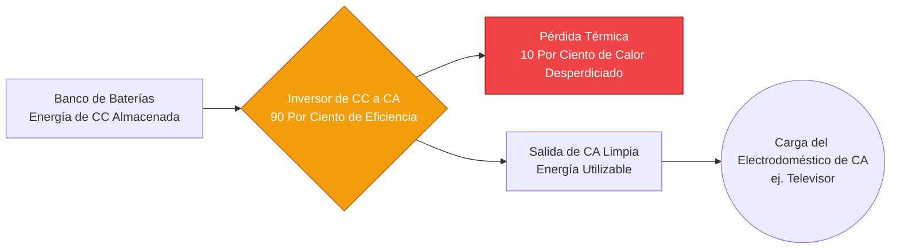
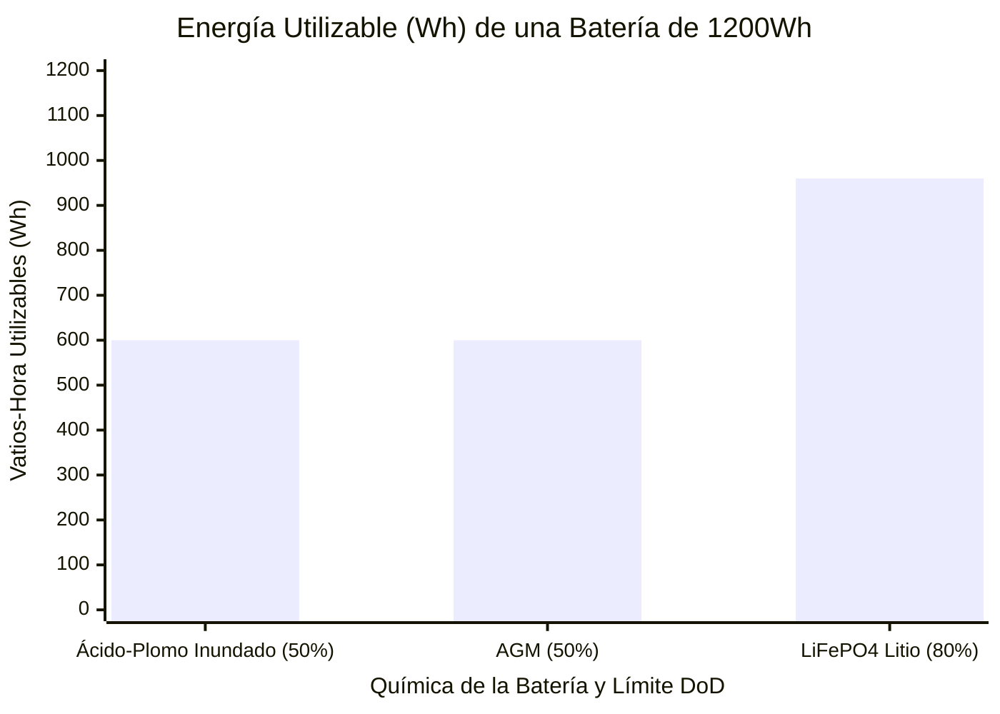
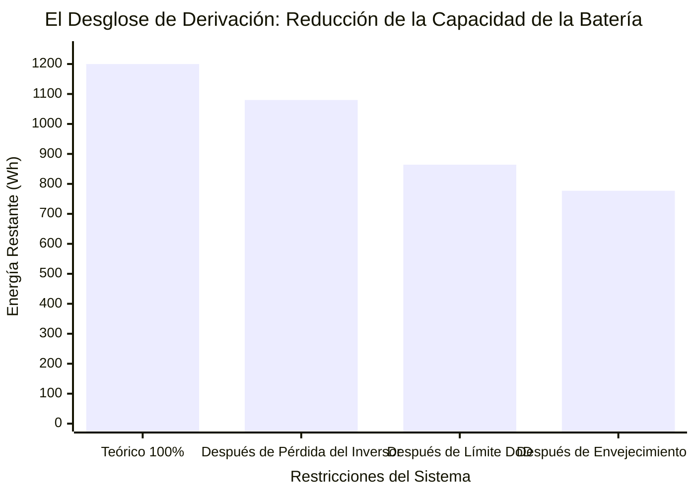
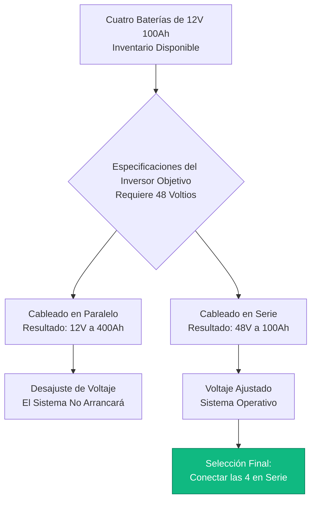

# La Calculadora de Tiempo de Ejecución de Batería Definitiva: Dimensionamiento de Capacidad, Pérdidas del Inversor y la Ley de Peukert

Bienvenido a la **Calculadora de Tiempo de Ejecución de Batería** definitiva y a la guía integral de ingeniería de almacenamiento de energía. Ya sea que sea un arquitecto solar fuera de la red que dimensiona un enorme banco de baterías LiFePO4 de $48\text{V}$ para una cabaña remota, un administrador de TI calculando la ventana de respaldo de UPS exacta requerida para apagar de manera segura un rack de servidores, o un entusiasta de la electrónica alimentando una Raspberry Pi con una celda de iones de litio $18650$, dominar la física de descarga de baterías es absolutamente esencial.

Las baterías son increíblemente engañosas. Una etiqueta que imprime claramente "$12\text{V}$ $100\text{Ah}$" no garantiza que realmente extraerá $1200\text{ vatios-hora}$ de energía. Si simplemente divide la capacidad por la potencia de la carga, su sistema colapsará prematuramente, sus inversores se activarán en Desconexión por Bajo Voltaje y destruirá permanentemente la química de su banco de baterías.

En esta exhaustiva clase magistral de SEO de más de 4,000 palabras, deconstruiremos la matemática fundamental de conversión de $Ah \to Wh$, expondremos la brutal realidad del Desglose de Derivación (Eficiencia del Inversor, Profundidad de Descarga y Estado de Salud), decodificaremos la aterradora física no lineal de la Ley de Peukert en baterías de ácido-plomo y demostraremos matemáticamente cómo cablear correctamente cadenas en serie y paralelo. Para asegurarnos de que comprenda completamente estos conceptos de ingeniería, hemos incluido cinco diagramas interactivos detallados y seguros para el analizador hechos en Mermaid.js.

---

## 1. La Física de la Energía Almacenada (Amperios-Hora vs Vatios-Hora)

El error más común que cometen los novatos al calcular el tiempo de ejecución de la batería es basarse en los Amperios-hora (Ah) sin tener en cuenta el voltaje del sistema. Un Amperio-hora es simplemente una medida de carga eléctrica. Para calcular el trabajo real (Energía), debe convertir los Amperios-hora a **Vatios-hora (Wh)**.

**La Ecuación Fundamental de la Energía:**
$$\text{Energía (Wh)} = \text{Voltaje (V)} \times \text{Capacidad (Ah)}$$

¿Por qué es esto crítico?
- Una batería de $12\text{V}$ $100\text{Ah}$ almacena $1200\text{ Wh}$ de energía.
- Una batería de $24\text{V}$ $50\text{Ah}$ almacena $1200\text{ Wh}$ de energía.
- A pesar de que la batería de $12\text{V}$ tiene el doble de "Amperios-hora", ambas baterías contienen exactamente la misma cantidad de energía eléctrica total y harán funcionar una carga de $100\text{W}$ exactamente durante la misma cantidad de tiempo.

Siempre normalice sus cálculos a Vatios-hora. Es la única métrica verdadera de la capacidad de almacenamiento de la batería.

---

## 2. El Desglose de Derivación: Por Qué el Tiempo de Ejecución Teórico es una Mentira

Si tiene una batería de $1200\text{Wh}$ y un televisor de $100\text{W}$, las matemáticas básicas sugieren que tiene $12\text{ horas}$ de tiempo de ejecución. **Esto es completamente incorrecto.**

En el mundo real, la energía debe abrirse camino a través de un aluvión de cuellos de botella físicos antes de llegar a su dispositivo. Llamamos a esto el **Desglose de Derivación**.

1. **Pérdida por Eficiencia del Inversor ($\eta$):** Las baterías suministran Corriente Continua (CC). Los televisores requieren Corriente Alterna (CA). Debe usar un inversor para invertir la corriente. Los inversores tienen típicamente entre un $85\%$ y un $90\%$ de eficiencia. El $10\%$ faltante se quema violentamente como calor térmico. Para hacer funcionar un televisor de CA de $100\text{W}$, el inversor realmente extraerá $111\text{W}$ de la batería.
2. **Profundidad de Descarga (DoD):** No puede agotar una batería al $0\%$. Hacerlo causa daño químico irreversible. Las baterías de ácido-plomo inundado solo se pueden agotar hasta el $50\%$ de DoD. Las modernas baterías LiFePO4 (Fosfato de Hierro y Litio) se pueden agotar hasta un $80\%$ o $90\%$ de DoD. Si tiene una batería de ácido-plomo de $1200\text{Wh}$, solo tiene $600\text{Wh}$ de energía utilizable.
3. **Estado de Salud (SOH):** A medida que una batería envejece, su capacidad interna se reduce. Una batería con una clasificación SOH del $80\%$ ha perdido permanentemente el $20\%$ de su capacidad de fábrica.

**La Ecuación del Tiempo de Ejecución en el Mundo Real:**
$$\text{Energía Utilizable (Wh)} = \text{Total Wh} \times \text{DoD \%} \times \text{SOH \%}$$
$$\text{Tiempo de Ejecución Real (Horas)} = \frac{\text{Energía Utilizable (Wh)}}{\text{Potencia de Carga (W)} / \text{Eficiencia del Inversor}}$$

---

## 3. La Pesadilla de la Ley de Peukert (Solo Ácido-Plomo)

Si utiliza baterías de Ácido-Plomo, AGM o Gel, debe lidiar con una de las reglas más frustrantes de la ingeniería eléctrica: **La Ley de Peukert**.

En 1897, el científico Wilhelm Peukert descubrió que la capacidad de una batería de ácido-plomo se reduce matemáticamente cuando se descarga rápidamente. 
Una batería de ácido-plomo de $100\text{Ah}$ se prueba a una velocidad de descarga muy lenta de $20\text{ horas}$ ($5\text{ Amperios}$).
- Si extrae $5\text{ Amperios}$, la batería proporciona los $100\text{Ah}$ completos.
- Si extrae $50\text{ Amperios}$ (una descarga de alta velocidad), las reacciones químicas internas no pueden seguir el ritmo. El voltaje colapsa y la batería puede proporcionar solo $60\text{Ah}$ antes de agotarse.

**La Ecuación de Peukert:**
$$T = H \times \left( \frac{C}{I \times H} \right)^n$$
Donde $n$ es el Exponente de Peukert (típicamente de $1.15$ a $1.30$ para el Ácido-Plomo).

*Nota de Ingeniería:* Esta es la razón por la que la industria solar ha migrado abrumadoramente al **Litio (LiFePO4)**. Las baterías de litio tienen un exponente de Peukert de aproximadamente $1.00$ a $1.05$. Ya sea que descargue una batería de litio en más de $20\text{ horas}$ o $1\text{ hora}$, extraerá casi el $100\%$ de su capacidad nominal.

---

## 4. Diseño de Bancos de Baterías en Serie y Paralelo

Cuando una sola batería no puede proporcionar suficiente Voltaje o suficientes Amperios-hora, debe conectar varias baterías juntas para crear un **Banco de Baterías**. 

**Regla 1: Cableado en Serie (Aumenta el Voltaje)**
Cuando conecta el terminal Positivo de la Batería A al terminal Negativo de la Batería B, está cableando en serie.
- **Voltaje:** Se suma ($12\text{V} + 12\text{V} = 24\text{V}$).
- **Capacidad:** Permanece exactamente igual ($100\text{Ah} + 100\text{Ah} = 100\text{Ah}$).
- *¿Por qué?* Un voltaje más alto le permite usar cables de cobre más delgados y controladores de carga solar más pequeños.

**Regla 2: Cableado en Paralelo (Aumenta la Capacidad)**
Cuando conecta Positivo a Positivo, y Negativo a Negativo, está cableando en paralelo.
- **Voltaje:** Permanece exactamente igual ($12\text{V} + 12\text{V} = 12\text{V}$).
- **Capacidad:** Se suma ($100\text{Ah} + 100\text{Ah} = 200\text{Ah}$).

**Regla 3: La Regla de Oro de los Bancos de Baterías**
**Nunca mezcle químicas de baterías, edades o capacidades.** Si cablea en paralelo una nueva batería LiFePO4 de $100\text{Ah}$ con una batería AGM de $80\text{Ah}$ de 5 años, lucharán violentamente entre sí. La batería de litio intentará cargar agresivamente la batería AGM hasta que una de ellas se sobrecaliente críticamente y se ventile.

---

## 5. Cinco Escenarios de Ingeniería Conceptual con Visualizaciones 2D

Para dominar completamente las relaciones físicas que rigen el Tiempo de Ejecución de la Batería, exploraremos cinco distintos escenarios de ingeniería desglosados visualmente usando diagramas personalizados de Mermaid.js.

### Ejemplo 1: La Tubería de Conversión de Energía

**El Escenario:**
El propietario de una cabaña aislada necesita entender exactamente cómo se convierte la energía de la batería de CC, cómo es gravada por la ineficiencia del inversor, y entregada a un televisor de CA estándar.

**Visualización 2D:**
Este diagrama de flujo lógico traza el flujo físico de la energía, demostrando claramente la inevitable pérdida de calor térmico que se produce durante el proceso de inversión de CC a CA.

---

### Ejemplo 2: La Brecha de la Profundidad de Descarga (DoD) de la Química

**El Escenario:**
Un contratista solar debe presentar un caso de negocio a un cliente probando por qué las baterías de Litio (LiFePO4) son significativamente más baratas a lo largo de una vida útil de 10 años que las baterías estándar de Ácido-Plomo, a pesar de un mayor costo inicial.

**Las Matemáticas:**
Una batería de Ácido-Plomo de $100\text{Ah}$ produce $50\text{Ah}$ de capacidad utilizable. Una batería LiFePO4 de $100\text{Ah}$ produce de $80\text{Ah}$ a $90\text{Ah}$ de capacidad utilizable. 

**Visualización 2D:**
Este gráfico de barras demuestra agresivamente la enorme ventaja de la energía utilizable de la química del Litio sobre la química heredada del Ácido-Plomo.

---

### Ejemplo 3: El Desglose de Derivación (Tiempo de Ejecución Real vs Falso)

**El Escenario:**
El propietario descontento de un RV se queja de que su batería de $1200\text{Wh}$ solo hace funcionar su carga de $100\text{W}$ durante $8\text{ horas}$ en lugar de las $12\text{ horas}$ que calculó matemáticamente. 

**Las Matemáticas:**
$1200\text{Wh} \times 0.90\text{ (Inversor)} \times 0.80\text{ (DoD)} = 864\text{Wh}$ realmente utilizables. $864 / 100\text{W} = 8.6\text{ horas}$.

**Visualización 2D:**
Este gráfico traza la brutal realidad del Desglose de Derivación, probando exactamente dónde se evaporaron las $4\text{ horas}$ de tiempo de ejecución que faltaban.

---

### Ejemplo 4: Lógica de Arquitectura en Serie vs Paralelo

**El Escenario:**
Un estudiante de ingeniería tiene cuatro baterías de $12\text{V}$ $100\text{Ah}$ y necesita configurarlas para hacer funcionar un masivo inversor solar de $48\text{V}$.

**Visualización 2D:**
Este diagrama de flujo de arriba hacia abajo mapea la lógica estricta requerida para evaluar cadenas en Serie (para multiplicación de voltaje) frente a cadenas en Paralelo (para multiplicación de capacidad) para alcanzar la arquitectura del sistema requerida.

---

### Ejemplo 5: La Línea de Tiempo del Efecto Peukert

**El Escenario:**
Un operador de montacargas nota que si conduce despacio, la batería dura todo el día, pero si pisa a fondo el acelerador y extrae picos masivos de corriente, la batería muere en unas pocas horas.

**Visualización 2D:**
Este diagrama de Gantt describe brutalmente la línea de tiempo microscópica de la Ley de Peukert, demostrando cómo una descarga de alta velocidad de $100\text{A}$ reduce matemáticamente la química interna de una batería de ácido-plomo, causando un colapso prematuro del voltaje.

---

## 7. Conclusión y Reto de Ingeniería

Dominar el Cálculo del Tiempo de Ejecución de la Batería es la base fundamental de todos los sistemas aislados de la red, marinos y de respaldo UPS. Entender la regla de conversión $Ah \to Wh$, respetar la brutal realidad del Desglose de Derivación (Eficiencia del Inversor y Profundidad de Descarga) y temer a la aterradora física de la Ley de Peukert garantizará que sus sistemas de respaldo sobrevivan la noche.

Si ignora estos principios matemáticos, sus inversores gritarán y se apagarán a las 2:00 AM, sus costosas baterías de ácido-plomo se sulfatarán permanentemente por descargas profundas extremas y sus bancos paralelos no coincidentes se destruirán silenciosamente entre sí.

Para garantizar que ha dominado estos conceptos críticos, inicie nuestro Simulador interactivo e intente resolver estos últimos desafíos:
1. **El Impuesto del Inversor:** Tiene una batería LiFePO4 de $24\text{V}$ $200\text{Ah}$ (límite del $80\%$ DoD). Está ejecutando una carga de CA de $500\text{W}$ a través de un inversor con un $85\%$ de eficiencia. Calcule el tiempo de ejecución exacto en el mundo real en horas y minutos.
2. **El Constructor del Banco:** Necesita construir un banco de baterías de $48\text{V}$ $400\text{Ah}$ utilizando baterías estándar de $12\text{V}$ $100\text{Ah}$. ¿Cuántas baterías necesita en total y cuál es la geometría exacta del cableado en Serie/Paralelo?
3. **La Muerte Térmica:** Una carga de $1000\text{W}$ es alimentada por un inversor con un $90\%$ de eficiencia. ¿Exactamente cuántos Vatios se están extrayendo de la batería y cuántos Vatios exactamente se están convirtiendo en calor térmico inútil?

Confíe en esta calculadora para auditar sus paneles solares, justificar matemáticamente las actualizaciones a baterías de Litio y eliminar permanentemente la ansiedad de la energía fuera de la red.
