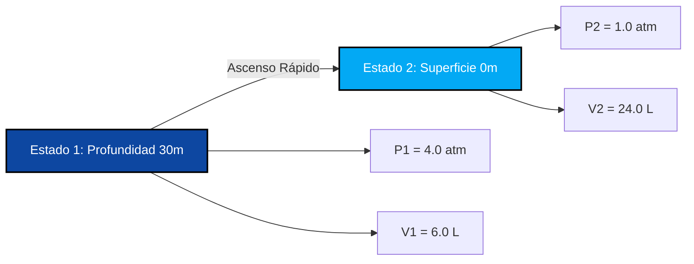

# Guía Completa de Laboratorio e Industrial para la Ley de Boyle y el Análisis Presión-Volumen

En fisicoquímica, dinámica de gases y termodinámica de procesos, la **Ley de Boyle** (también conocida como la **Ley de Boyle-Mariotte**) define la relación inversa entre la presión y el volumen para una cantidad fija de gas a temperatura constante:

$$P \cdot V = k \quad \left(\text{Ecuación de Estado Isotérmico}\right)$$

$$P_1 \cdot V_1 = P_2 \cdot V_2 \quad \left(\text{Ecuación de la Ley de Boyle}\right)$$

$$P_2 = \frac{P_1 \cdot V_1}{V_2} \quad \left(\text{Fórmula de la Presión Final}\right)$$

$$V_2 = \frac{P_1 \cdot V_1}{P_2} \quad \left(\text{Fórmula del Volumen Final}\right)$$

$$P \propto \frac{1}{V} \quad \left(\text{Proporcionalidad Inversa}\right)$$

---

## 1. Matriz de Clasificación de Procesos

| Cambio de Volumen | Cambio de Presión | Clasificación del Proceso | Interpretación Molecular |
| :--- | :--- | :--- | :--- |
| **El Volumen Disminuye ($V_2 < V_1$)** | **La Presión Aumenta ($P_2 > P_1$)** | **Compresión Isotérmica** | **Las moléculas ocupan un espacio menor ➔ Mayor tasa de colisión** |
| **El Volumen Aumenta ($V_2 > V_1$)** | **La Presión Disminuye ($P_2 < P_1$)** | **Expansión Isotérmica** | **Las moléculas ocupan un espacio mayor ➔ Menor tasa de colisión** |
| **Volumen Sin Cambios ($V_2 = V_1$)** | **Presión Sin Cambios ($P_2 = P_1$)** | **Estado Constante Isocórico** | **Sin transformación de volumen o presión** |

---

## 2. Matriz de Solucionadores de Variables Desconocidas

```
1. Presión Final: P2 = (P1 * V1) / V2
2. Volumen Final: V2 = (P1 * V1) / P2
3. Presión Inicial: P1 = (P2 * V2) / V1
4. Volumen Inicial: V1 = (P2 * V2) / P1
```

---

*Esta calculadora de la Ley de Boyle proporciona predicciones termodinámicas teóricas para aplicaciones educativas, de investigación fisicoquímica y de ingeniería de procesos de gases. Asume temperatura constante ($T_1 = T_2$) y moles de gas constantes ($n_1 = n_2$). Si cambia la temperatura o el recuento de moles, consulte las calculadoras de la Ley Combinada de los Gases o la Ley de los Gases Ideales.*

## 4. La Guía Completa de la Ley de Boyle y la Dinámica Isotérmica de Gases

Bienvenido al manual definitivo de fisicoquímica sobre la **Ley de Boyle**. ¿Alguna vez te has preguntado por qué se te tapan los oídos cuando despega un avión? ¿Por qué los buzos de aguas profundas nunca deben aguantar la respiración al salir a la superficie? ¿O por qué apretar un globo hace que sea exponencialmente más difícil seguir apretando antes de que estalle?

La respuesta matemática a todos estos fenómenos reside en la precisa proporcionalidad inversa de la Ley de Boyle: $P_1 V_1 = P_2 V_2$. 

En esta exhaustiva guía de más de 4000 palabras, desentrañaremos la teoría cinética microscópica detrás de la compresión isotérmica de gases, exploraremos rigurosamente la naturaleza hiperbólica de las curvas de presión-volumen y ejecutaremos cinco derivaciones algebraicas sólidas del mundo real que abarcan desde jeringas médicas hasta buceo en el océano profundo.

### 4.1 La Teoría Cinética Microscópica de la Ley de Boyle

Para comprender verdaderamente la Ley de Boyle, debemos observar a nivel atómico invisible. Un gas está compuesto por billones de moléculas diminutas que se mueven a altas velocidades. 

*   **Presión ($P$)** se crea cuando estas moléculas chocan violentamente contra las paredes interiores de su recipiente. A mayor cantidad de colisiones por segundo, mayor es la presión.
*   **Volumen ($V$)** es la cantidad de espacio físico en 3D que estas moléculas tienen para moverse.
*   **Temperatura ($T$)** representa la energía cinética (velocidad) de las moléculas. 

Si mantenemos la temperatura perfectamente **constante** (un proceso *isotérmico*), las moléculas continúan volando exactamente a la misma velocidad. Si luego aplastamos el contenedor a la mitad de su Volumen original, esas moléculas ahora tienen la mitad del espacio para volar. 
Debido a que el espacio se reduce a la mitad, las moléculas golpearán las paredes exactamente **el doble de veces**. Por lo tanto, la Presión exactamente **se duplica**. 
Esta es la esencia de la Proporcionalidad Inversa: $P \propto \frac{1}{V}$.

### 4.2 La Curva de la Isoterma Hiperbólica

Si graficamos la Ley de Boyle en un gráfico con la Presión en el eje Y y el Volumen en el eje X, *no* se crea una línea recta diagonal. Se crea una curva llamada **Hipérbola** ($P = \frac{k}{V}$). 
A medida que el Volumen se acerca a cero, la Presión se acerca al infinito (se vuelve infinitamente difícil comprimir gas en un espacio nulo). A medida que el Volumen se acerca al infinito, la Presión cae asintóticamente hacia cero (el gas se esparce en un vacío). 

---

## 5. Guía de Uso: Dominando la Calculadora Isotérmica

Nuestra calculadora actúa como un solucionador algebraico universal para cualquier transformación de gas a temperatura constante. 

### 5.1 Modo: Aislamiento de Variables del Estado Final (Estado 2)

1.  **Seleccionar Objetivo:** Elija si necesita encontrar la Presión Final ($P_2$) o el Volumen Final ($V_2$).
2.  **Ingresar Estado Inicial:** Ingrese las condiciones iniciales (Estado 1) para Presión y Volumen.
3.  **Ingresar Estado Final Conocido:** Ingrese el único parámetro conocido para el Estado 2 (ya sea la nueva presión o el nuevo volumen).
4.  **Ejecutar:** El motor reorganiza algebraicamente la proporción $P_1V_1 = P_2V_2$ para aislar y resolver perfectamente la variable desconocida.

### 5.2 Flexibilidad de Unidades y Cancelación

A diferencia de la Ley de los Gases Ideales, que requiere una coincidencia estricta de unidades con la constante universal de los gases $R$, la Ley de Boyle es altamente flexible porque es una proporción. **¡No necesita unidades de presión o volumen específicas** siempre y cuando sea consistente!
*   Si $P_1$ está en `torr`, $P_2$ saldrá en `torr`.
*   Si $V_1$ está en `galones`, $V_2$ saldrá en `galones`.
*   Si $P_1$ está en `psi` y $P_2$ está en `psi`, se cancelan perfectamente para encontrar el Volumen faltante.

---

## 6. Cinco Derivaciones Rigurosas de la Ley de Boyle

Dominemos el álgebra de las transformaciones isotérmicas de gases aislando variables en cinco escenarios fisiológicos y de ingeniería del mundo real.

### Ejemplo 1: Aislamiento de la Presión Final para una Jeringa Médica

**Escenario:** 
Una enfermera prepara una jeringa médica sellada que contiene $50.0\text{ mL}$ de aire a una presión estándar de $1.00\text{ atm}$. La enfermera empuja el émbolo lentamente (manteniendo la temperatura constante) hasta que el volumen se reduce a $15.0\text{ mL}$. ¿Cuál es la nueva presión interna dentro de la jeringa?

**Derivación Matemática:**

1.  **Definir Estado 1 (Inicial):**
    $P_1 = 1.00\text{ atm}$
    $V_1 = 50.0\text{ mL}$
2.  **Definir Estado 2 (Comprimido):**
    $P_2 = ?\text{ atm}$
    $V_2 = 15.0\text{ mL}$
3.  **Aislar $P_2$:**
    $$ P_1 \cdot V_1 = P_2 \cdot V_2 \implies P_2 = \frac{P_1 \cdot V_1}{V_2} $$
4.  **Calcular:**
    $$ P_2 = \frac{1.00 \times 50.0}{15.0} = 3.333\text{ atm} $$

**Conclusión:** La presión dentro de la jeringa salta a $3.33\text{ atm}$. Esto hace que el émbolo se sienta "elástico" y difícil de empujar, ya que el gas de alta presión lucha contra el pulgar de la enfermera.

### Ejemplo 2: El Ascenso Letal en Buceo (Aislamiento del Volumen Final)

**Escenario:**
Un buzo a una profundidad de 30 metros respira aire comprimido de su regulador. A esta profundidad, la presión del agua circundante es exactamente de $4.00\text{ atm}$. El buzo llena sus pulmones con $6.00\text{ Litros}$ de aire. Entrando en pánico, el buzo aguanta la respiración y se dispara a la superficie donde la presión es de solo $1.00\text{ atm}$. Suponiendo que la temperatura corporal permanezca constante, ¿a qué volumen intentará expandirse el aire de sus pulmones?

**Derivación Matemática:**

1.  **Definir Estado 1 (Aguas Profundas):**
    $P_1 = 4.00\text{ atm}$
    $V_1 = 6.00\text{ L}$
2.  **Definir Estado 2 (Superficie):**
    $P_2 = 1.00\text{ atm}$
    $V_2 = ?\text{ L}$
3.  **Aislar $V_2$:**
    $$ P_1 \cdot V_1 = P_2 \cdot V_2 \implies V_2 = \frac{P_1 \cdot V_1}{P_2} $$
4.  **Calcular:**
    $$ V_2 = \frac{4.00 \times 6.00}{1.00} = 24.0\text{ Litros} $$

**Conclusión:** El aire en los pulmones del buzo intentará expandirse a unos masivos $24.0\text{ Litros}$. Debido a que los pulmones humanos solo pueden contener alrededor de $6\text{ Litros}$, se romperían catastróficamente mucho antes de llegar a la superficie. Es por esto que la regla #1 del buceo es "Nunca aguantes la respiración".

**Visualización: Expansión Isotérmica (Ascenso de Buceo)**


*Este diagrama de flujo ilustra la severa expansión de volumen isotérmico a medida que disminuye la presión externa.*

### Ejemplo 3: Aislamiento del Volumen Inicial (Estado 1)

**Escenario:**
Un compresor de aire industrial bombea aire hacia una tubería de fábrica. Un técnico mide una cámara de expansión aguas abajo y encuentra $150.0\text{ Litros}$ de aire a una presión de $2.50\text{ atm}$. El gerente de la fábrica quiere saber cuánto volumen ocupaba originalmente este aire a presión atmosférica estándar ($1.00\text{ atm}$).

**Derivación Matemática:**

1.  **Definir Estado 2 (Final - Conocido):**
    $P_2 = 2.50\text{ atm}$
    $V_2 = 150.0\text{ L}$
2.  **Definir Estado 1 (Inicial - Desconocido $V_1$):**
    $P_1 = 1.00\text{ atm}$
    $V_1 = ?\text{ L}$
3.  **Aislar $V_1$:**
    $$ P_1 \cdot V_1 = P_2 \cdot V_2 \implies V_1 = \frac{P_2 \cdot V_2}{P_1} $$
4.  **Calcular:**
    $$ V_1 = \frac{2.50 \times 150.0}{1.00} = 375.0\text{ Litros} $$

**Conclusión:** El aire originalmente ocupaba $375.0\text{ Litros}$ de espacio antes de que el compresor lo redujera.

### Ejemplo 4: Una Bomba de Bicicleta (Cálculo de Altos PSI)

**Escenario:**
Una bomba de bicicleta contiene $300\text{ mL}$ de aire a $14.7\text{ psi}$ (presión atmosférica normal). El ciclista empuja rápidamente el mango de la bomba, aplastando el aire en un espacio minúsculo de $45.0\text{ mL}$ antes de que se abra la válvula de la llanta. ¿Cuál es la presión dentro de la bomba justo antes de que se abra la válvula?

**Derivación Matemática:**

1.  **Definir Estado 1:**
    $P_1 = 14.7\text{ psi}$
    $V_1 = 300\text{ mL}$
2.  **Definir Estado 2:**
    $P_2 = ?\text{ psi}$
    $V_2 = 45.0\text{ mL}$
3.  **Aplicar Fórmula de Boyle:**
    $$ P_2 = \frac{P_1 \cdot V_1}{V_2} $$
4.  **Calcular:**
    $$ P_2 = \frac{14.7 \times 300}{45.0} = \frac{4410}{45.0} = 98.0\text{ psi} $$

**Conclusión:** ¡La presión dentro de la bomba se dispara a $98.0\text{ psi}$, lo cual es más que suficiente para forzar el aire dentro de una llanta de bicicleta de ruta de alta presión! Observe que no necesitamos convertir a `atm` o `Litros`; la Ley de Boyle maneja `psi` y `mL` a la perfección.

### Ejemplo 5: Expansión de un Globo Meteorológico Estratosférico

**Escenario:**
Un globo meteorológico se llena con $10,000\text{ Litros}$ de helio en el suelo a $1.0\text{ atm}$. Flota hacia la estratosfera donde la presión es de solo $0.02\text{ atm}$. Suponiendo (por el bien de este ejemplo de la ley de Boyle) que la temperatura milagrosamente permanece constante, ¿cuál es el nuevo volumen del globo?

**Derivación Matemática:**

1.  **Definir Estado 1:**
    $P_1 = 1.0\text{ atm}$
    $V_1 = 10000\text{ L}$
2.  **Definir Estado 2:**
    $P_2 = 0.02\text{ atm}$
    $V_2 = ?\text{ L}$
3.  **Aplicar Fórmula de Boyle:**
    $$ V_2 = \frac{P_1 \cdot V_1}{P_2} $$
4.  **Calcular:**
    $$ V_2 = \frac{1.0 \times 10000}{0.02} = 500,000\text{ Litros} $$

**Conclusión:** ¡El globo se expande a medio millón de litros! La falta extrema de presión atmosférica externa permite que las moléculas de gas dentro del globo empujen la goma hacia afuera de forma masiva.

---

## 7. Preguntas Frecuentes Detalladas y Errores Comunes

**P: ¿Necesito convertir mi presión a Atmósferas (`atm`)?**
**R:** No. Puede usar `torr`, `mmHg`, `Pascal`, `bar` o `psi`. La única regla es que $P_1$ y $P_2$ deben estar exactamente en la misma unidad para que se cancelen en lados opuestos de la ecuación.

**P: ¿Cuándo falla la Ley de Boyle?**
**R:** La Ley de Boyle es una ley de gases *Ideales*. Comienza a fallar a presiones ultra altas (como cientos de atmósferas). A presiones extremas, las moléculas de gas en sí mismas comienzan a ocupar volumen físico, y comienzan a atraerse magnéticamente, rompiendo la curva matemática "ideal".

**P: ¿Qué pasa si la temperatura cambia durante la compresión?**
**R:** Si la temperatura cambia, **no puede** usar la Ley de Boyle ($P_1V_1 = P_2V_2$). La introducción de energía térmica cambia la velocidad cinética de las moléculas, lo que significa que debe usar la **Calculadora de la Ley Combinada de los Gases** ($\frac{P_1V_1}{T_1} = \frac{P_2V_2}{T_2}$).

Al dominar la elegancia matemática de $P_1V_1 = P_2V_2$, ¡puede resolver todo, desde cálculos de pistones neumáticos industriales hasta física respiratoria fisiológica! ¡Confíe en esta Calculadora de la Ley de Boyle para aislar y resolver instantáneamente cualquier variable de compresión o expansión isotérmica!
