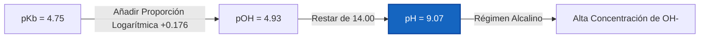

# Guía de Química Analítica y de Laboratorio sobre Soluciones Tampón y Análisis de Amortiguadores

En química analítica, física y biológica, las **soluciones tampón** mantienen estables las concentraciones de iones de hidrógeno ($\text{pH}$) cuando se someten a la adición de ácidos o bases, dilución o cambios ambientales:

$$\text{pH} = \text{p}K_a + \log_{10}\left(\frac{[\text{A}^-]}{[\text{HA}]}\right) \quad \iff \quad \frac{[\text{A}^-]}{[\text{HA}]} = 10^{\text{pH} - \text{p}K_a}$$

$$\beta = 2.303 \cdot C_{\text{total}} \cdot \frac{K_a [\text{H}^+]}{(K_a + [\text{H}^+])^2} \quad \text{donde } C_{\text{total}} = [\text{HA}] + [\text{A}^-]$$

---

## 1. Sistemas Comunes de Tampones de Laboratorio y Matriz de Referencia

| Sistema Tampón | Ácido / Base Débil | Forma Conjugada | $\text{p}K_a$ ($25^\circ\text{C}$) | Rango de pH Útil | Aplicaciones Principales |
| :--- | :--- | :--- | :--- | :--- | :--- |
| **Citrato** | Ácido Cítrico ($\text{H}_3\text{Cit}$) | Dihidrógeno Citrato ($\text{H}_2\text{Cit}^-$) | **$3.13$** | $2.13 - 4.13$ | Alimentos, Ensayos Farmacéuticos |
| **Acetato** | Ácido Acético ($\text{CH}_3\text{COOH}$) | Acetato ($\text{CH}_3\text{COO}^-$) | **$4.76$** | $3.76 - 5.76$ | Ensayos Enzimáticos, Bioquímica |
| **Fosfato ($\text{p}K_{a2}$)** | Dihidrógeno Fosfato ($\text{H}_2\text{PO}_4^-$) | Hidrógeno Fosfato ($\text{HPO}_4^{2-}$) | **$7.20$** | $6.20 - 8.20$ | Tampones Biológicos (PBS), Cultivo Celular |
| **Tris** | Tris(hidroximetil)aminometano | Tris-$\text{H}^+$ | **$8.07$** | $7.07 - 9.07$ | Biología Molecular, Electroforesis |
| **Carbonato** | Bicarbonato ($\text{HCO}_3^-$) | Carbonato ($\text{CO}_3^{2-}$) | **$10.33$** | $9.33 - 11.33$ | Diagnóstico Clínico |

---

## 2. Protocolos Estándar de Cálculo de Tampones

```
1. pH del Tampón: pH = pKa + log10([A-] / [HA])
2. pOH del Tampón Básico: pOH = pKb + log10([BH+] / [B]), pH = pKw - pOH
3. Capacidad Amortiguadora beta: beta = 2.303 * Ctotal * (Ka*[H+]) / (Ka + [H+])^2
4. Adición de Ácido Fuerte: Moles de A- restantes = Moles iniciales de A- - Moles de H+ añadidos
5. Adición de Base Fuerte: Moles de HA restantes = Moles iniciales de HA - Moles de OH- añadidos
```

---

## 3. Descargo de Responsabilidad de Seguridad de Laboratorio y Educativa
*Esta calculadora de soluciones tampón proporciona cálculos de tampones teóricos para aplicaciones educativas, de investigación de laboratorio y química AP. Las soluciones concentradas no ideales con fuerzas iónicas altas deben tener en cuenta los coeficientes de actividad utilizando las ecuaciones de Debye-Hückel o Pitzer.*

## 4. La Guía Completa de Soluciones Tampón y Resistencia al pH

Bienvenido a la guía definitiva para comprender, diseñar y analizar sistemas de tampones químicos. Mientras que el agua pura experimentará variaciones masivas y violentas en el pH si se añade incluso una gota de ácido, una **solución tampón** está diseñada químicamente para absorber estos choques. Ya sea que sea un biólogo que mantiene cultivos celulares, un ingeniero químico que escala una síntesis enzimática o un profesional médico que estudia la acidosis del plasma sanguíneo, dominar la química de los tampones no es negociable.

Un tampón logra esta "absorción de choque de pH" al contener dos componentes químicos opuestos simultáneamente: un **ácido débil** (listo para neutralizar cualquier base entrante) y su **base conjugada** (lista para neutralizar cualquier ácido entrante). Las matemáticas de equilibrio que dictan este tira y afloja se describen mediante la ecuación de Henderson-Hasselbalch y el concepto de Capacidad Amortiguadora ($\beta$).

En esta exhaustiva guía técnica de más de 4000 palabras, desempaquetaremos la termodinámica de la creación de tampones, analizaremos cómo se diseñan los tampones para valores de pH objetivo específicos, estableceremos las reglas para la degradación de la capacidad amortiguadora tras la dilución y repasaremos cinco ejemplos rigurosos del mundo real completos con derivaciones matemáticas y diagramas visuales estrictos de Mermaid.

### 4.1 ¿Qué es Exactamente una Solución Tampón?

Un tampón no es un fluido neutralizante mágico; es un equilibrio químico cuidadosamente calibrado. Para crear un tampón, debe combinar:
1.  **Un Ácido Débil ($\text{HA}$):** Este sirve como la reserva interna de protones ($\text{H}^+$). Si se añade una base fuerte ($\text{OH}^-$) al sistema, el ácido débil dona su protón para neutralizarla, convirtiéndose en agua y dejando atrás más base conjugada.
2.  **Su Base Conjugada ($\text{A}^-$):** Esta sirve como la esponja de protones interna. Si se añade un ácido fuerte ($\text{H}^+$) al sistema, la base conjugada absorbe el protón, convirtiéndose en más ácido débil.

La ecuación central gobernante de este equilibrio es la **Ecuación de Henderson-Hasselbalch**:
$$ \text{pH} = \text{p}K_a + \log_{10}\left(\frac{[\text{A}^-]}{[\text{HA}]}\right) $$

Esta ecuación dicta que el pH final de su tampón depende completamente de dos cosas: la fuerza intrínseca del ácido ($\text{p}K_a$) y la proporción física de moléculas de base conjugada a ácido débil que ha colocado en el vaso de precipitados.

### 4.2 Diseñando un Tampón: Elegir el pKa Correcto

Si necesita diseñar un tampón para mantener un pH específico, no puede simplemente elegir cualquier ácido del estante. **Debe elegir un ácido cuyo $\text{p}K_a$ sea lo más cercano posible a su pH objetivo.**

¿Por qué? Porque la capacidad amortiguadora (la capacidad de resistir los cambios de pH) se maximiza cuando la concentración del ácido y la base conjugada son exactamente iguales ($[\text{A}^-] = [\text{HA}]$). En este punto de equilibrio específico, la proporción $[\text{A}^-]/[\text{HA}]$ es exactamente 1.0. Debido a que el logaritmo de 1 es 0, la ecuación colapsa en:
$$ \text{pH} = \text{p}K_a $$

Por lo tanto, si necesita un tampón que se mantenga en un pH de 4.76, debe elegir el Ácido Acético ($\text{p}K_a = 4.76$). Si necesita un tampón que se mantenga en un pH de 7.20, debe elegir el sistema de Fosfato ($\text{p}K_a = 7.20$).

### 4.3 Capacidad Amortiguadora ($\beta$) y La Regla de Uno

La **Capacidad Amortiguadora ($\beta$)** mide la cantidad de ácido o base fuerte requerida para cambiar el pH de 1 Litro de solución tampón en exactamente 1 unidad.

$$ \beta = \frac{dC_b}{d(\text{pH})} = -\frac{dC_a}{d(\text{pH})} = 2.303 \times C_{\text{total}} \times \frac{K_a [\text{H}^+]}{(K_a + [\text{H}^+])^2} $$

Esta fórmula derivada del cálculo nos dice dos datos críticos sobre el diseño de tampones:
1.  **La Concentración es el Rey:** Un tampón de $1.0\text{ M}$ tiene diez veces la capacidad amortiguadora de un tampón de $0.1\text{ M}$, incluso si su pH es idéntico. Más moléculas en general ($C_{\text{total}}$) significa más capacidad física para neutralizar amenazas entrantes.
2.  **La Regla de Uno:** Un tampón se considera "roto" o inútil si su pH se desvía más de **1.0 unidad** de su $\text{p}K_a$. A $\text{pH} = \text{p}K_a \pm 1$, la proporción de ácido a base es $10:1$ o $1:10$. El tampón está completamente desequilibrado y fallará rápidamente si es atacado desde el lado más débil.

### 4.4 Dilución y Agotamiento del Tampón

¿Qué sucede si diluye un tampón perfecto de $0.5\text{ M}$ con un volumen igual de agua pura?
Las concentraciones tanto del ácido $[\text{HA}]$ como de la base $[\text{A}^-]$ caen a $0.25\text{ M}$. Sin embargo, debido a que ambas cayeron exactamente a la mitad, su **proporción permanece idéntica**. Por lo tanto, **diluir un tampón no cambia su pH**. 

Sin embargo, diluir un tampón reduce a la mitad su concentración total ($C_{\text{total}}$), lo que reduce su **Capacidad Amortiguadora ($\beta$) a la mitad**. Ahora es el doble de vulnerable a ser abrumado. Cuando un tampón se ve abrumado, alcanza el **Agotamiento del Tampón**, lo que significa que todo el $[\text{HA}]$ o todo el $[\text{A}^-]$ se ha consumido por completo.

---

## 5. Guía de Uso: Dominando la Calculadora de Amortiguadores

Nuestra Calculadora de Amortiguadores está diseñada para manejar tanto el análisis directo (¿Cuál es el pH?) como el diseño inverso (¿Cómo hago un tampón de pH 7.4?).

### 5.1 Cálculo Simple del pH de un Tampón

1.  **Seleccione Modo:** Elija "Buffer pH" (pH del Tampón).
2.  **Ingrese Parámetros:** Ingrese el $\text{p}K_a$ de su ácido, la concentración de la base conjugada $[\text{A}^-]$ y la concentración del ácido débil $[\text{HA}]$.
3.  **Lea el Resultado:** La calculadora proporciona el pH final de la mezcla, la proporción, y grafica la posición exacta en la curva de capacidad.

### 5.2 Diseño de Tampón de Laboratorio

1.  **Seleccione Modo:** Elija "Design Buffer" (Diseñar Tampón).
2.  **Ingrese Parámetros:** Ingrese su pH objetivo, el $\text{p}K_a$ de su ácido y su Concentración Total deseada ($C_{\text{total}}$).
3.  **Ejecutar:** La herramienta utiliza logaritmos inversos para calcular la molaridad exacta requerida de $[\text{HA}]$ y $[\text{A}^-]$. Básicamente, escribe su receta de laboratorio por usted.

### 5.3 Simulación de Adición de Ácido / Base

1.  **Seleccione Modo:** Elija "Add Strong Acid / Base" (Añadir Ácido / Base Fuerte).
2.  **Ingrese el Estado Inicial:** Ingrese las concentraciones iniciales de su tampón.
3.  **Ingrese el Ataque:** Ingrese los moles de ácido fuerte ($\text{HCl}$) o base fuerte ($\text{NaOH}$) añadidos.
4.  **Ejecutar:** La calculadora realiza una sustracción estequiométrica para encontrar las nuevas concentraciones, luego recalcula el nuevo pH, mostrando exactamente cuánto se desplazó el tampón.

---

## 6. Cinco Ejemplos Conceptuales del Mundo Real

Las matemáticas abstractas se convierten en herramientas poderosas cuando se aplican a la química física. A continuación se presentan cinco ejemplos rigurosos que cubren la creación de tampones, la amortiguación fisiológica de la sangre y el cálculo de la capacidad neutralizante.

### Ejemplo 1: El Tampón de Acetato Clásico

**Escenario:** 
Un bioquímico prepara una solución tampón que contiene $0.35\text{ M}$ de Ácido Acético ($\text{CH}_3\text{COOH}$, $\text{p}K_a = 4.76$) y $0.15\text{ M}$ de Acetato de Sodio ($\text{CH}_3\text{COONa}$). ¿Cuál es el pH de esta solución?

**Derivación Matemática:**

1.  **Identificar Componentes:**
    Ácido Débil $[\text{HA}] = 0.35\text{ M}$
    Base Conjugada $[\text{A}^-] = 0.15\text{ M}$
    $\text{p}K_a$ del Ácido $= 4.76$
2.  **Aplicar Henderson-Hasselbalch:**
    $$ \text{pH} = \text{p}K_a + \log_{10}\left(\frac{[\text{A}^-]}{[\text{HA}]}\right) $$
    $$ \text{pH} = 4.76 + \log_{10}\left(\frac{0.15}{0.35}\right) $$
    $$ \text{pH} = 4.76 + \log_{10}(0.428) $$
    $$ \text{pH} = 4.76 - 0.368 $$
    $$ \text{pH} = 4.392 \approx 4.39 $$

**Conclusión:** El pH es 4.39. Debido a que hay significativamente más ácido débil ($0.35\text{ M}$) que base conjugada ($0.15\text{ M}$), el pH se reduce mucho más abajo del $\text{p}K_a$ intrínseco (4.76).

### Ejemplo 2: Diseñando un Tampón Tris para Electroforesis de ADN

**Escenario:**
Un biólogo molecular necesita diseñar un tampón Tris exactamente a pH 8.30 para electroforesis en gel. El $\text{p}K_a$ del Tris-$\text{H}^+$ es 8.07. Si desean una concentración total de tampón ($C_{\text{total}}$) de $0.100\text{ M}$, ¿qué concentraciones de base Tris ($\text{A}^-$) y ácido Tris-$\text{H}^+$ ($\text{HA}$) se necesitan?

**Derivación Matemática:**

1.  **Calcular la Proporción Requerida:**
    $$ \text{pH} - \text{p}K_a = \log_{10}\left(\frac{[\text{A}^-]}{[\text{HA}]}\right) $$
    $$ 8.30 - 8.07 = 0.23 $$
    $$ \text{Proporción} = 10^{0.23} = 1.698 $$
    Esto significa que $[\text{A}^-] = 1.698 \times [\text{HA}]$
2.  **Aplicar la Restricción de Concentración Total:**
    $$ [\text{A}^-] + [\text{HA}] = 0.100\text{ M} $$
    $$ (1.698 \times [\text{HA}]) + [\text{HA}] = 0.100\text{ M} $$
    $$ 2.698 \times [\text{HA}] = 0.100\text{ M} $$
    $$ [\text{HA}] = 0.0371\text{ M} $$
3.  **Encontrar la Base Conjugada:**
    $$ [\text{A}^-] = 0.100 - 0.0371 = 0.0629\text{ M} $$

**Conclusión:** La receta requiere $0.037\text{ M}$ de ácido Tris y $0.063\text{ M}$ de base Tris.

### Ejemplo 3: El Tampón Básico de Amoníaco

**Escenario:**
Un estudiante prepara un tampón básico mezclando $0.20\text{ M}$ de Amoníaco ($\text{NH}_3$, base débil) y $0.30\text{ M}$ de Cloruro de Amonio ($\text{NH}_4\text{Cl}$, ácido conjugado). El $\text{p}K_b$ del amoníaco es 4.75. ¿Cuál es el pH a $25^\circ\text{C}$?

**Derivación Matemática:**

1.  **Calcular el pOH utilizando la forma base de Henderson-Hasselbalch:**
    $$ \text{pOH} = \text{p}K_b + \log_{10}\left(\frac{[\text{Ácido Conjugado}]}{[\text{Base Débil}]}\right) $$
    $$ \text{pOH} = 4.75 + \log_{10}\left(\frac{0.30}{0.20}\right) $$
    $$ \text{pOH} = 4.75 + \log_{10}(1.50) $$
    $$ \text{pOH} = 4.75 + 0.176 = 4.926 $$
2.  **Convertir pOH a pH:**
    $$ \text{pH} = 14.00 - \text{pOH} $$
    $$ \text{pH} = 14.00 - 4.926 = 9.074 \approx 9.07 $$

**Visualización: Derivación del Tampón Básico**



*Este diagrama de flujo visualiza el paso adicional requerido al diseñar tampones alcalinos utilizando $\text{p}K_b$.*

### Ejemplo 4: El Ataque Ácido (Simulando la Resistencia del Tampón)

**Escenario:**
Tomemos $1.0\text{ Litro}$ de un tampón genérico que contiene $0.50\text{ M HA}$ ($\text{p}K_a = 6.00$) y $0.50\text{ M A}^-$. El pH inicial es exactamente 6.00. Luego inyectamos $0.15\text{ Moles}$ de ácido Clorhídrico puro ($\text{HCl}$). ¿Cuál es el nuevo pH y cuánto cambió?

**Derivación Matemática:**

1.  **Estado Inicial:**
    $[\text{HA}] = 0.50\text{ mol}$
    $[\text{A}^-] = 0.50\text{ mol}$
2.  **Neutralización Estequiométrica:**
    Los $0.15\text{ mol}$ de $\text{H}^+$ fuerte destruyen completamente $0.15\text{ mol}$ de la base conjugada ($\text{A}^-$), convirtiéndola en ácido débil ($\text{HA}$).
    **Nuevo $[\text{A}^-]$:** $0.50 - 0.15 = 0.35\text{ mol}$
    **Nuevo $[\text{HA}]$:** $0.50 + 0.15 = 0.65\text{ mol}$
3.  **Calcular el Nuevo pH:**
    $$ \text{pH} = 6.00 + \log_{10}\left(\frac{0.35}{0.65}\right) $$
    $$ \text{pH} = 6.00 + \log_{10}(0.538) $$
    $$ \text{pH} = 6.00 - 0.269 = 5.73 $$

**Conclusión:** A pesar de absorber $0.15\text{ moles}$ de ácido fuerte puro, el pH solo cayó en **0.27 unidades** (de 6.00 a 5.73). Si se añadiera ese mismo ácido a agua sin tamponar, el pH se habría desplomado a 0.82.

**Visualización: Configuración de Laboratorio de Neutralización**

```mermaid
gantt
    title Cronograma de Laboratorio: Prueba de Neutralización de Tampón
    dateFormat  HH:mm:ss
    axisFormat  %H:%M
    section Preparación
    Mezclar 0.5M HA y 0.5M A- :active, 00:00:00, 00:10:00
    Registrar pH Inicial 6.00 :milestone, 00:10:00, 00:10:00
    section Fase de Ataque
    Inyectar 0.15M HCl :crit, 00:10:00, 00:15:00
    Agitar y Equilibrar :active, 00:15:00, 00:20:00
    section Análisis
    Registrar pH Final 5.73 :milestone, 00:20:00, 00:20:00
```



*Este diagrama de Gantt traza la secuencia crítica de la preparación del tampón, el registro de datos de referencia y la ejecución del ataque ácido estequiométrico.*

### Ejemplo 5: Agotamiento del Tampón (Rompiendo el Tampón)

**Escenario:**
Tomando exactamente el mismo tampón de 1.0 L del Ejemplo 4 ($0.50\text{ M HA}$, $0.50\text{ M A}^-$, $\text{p}K_a = 6.00$). Esta vez, inyectamos agresivamente $0.60\text{ Moles}$ de $\text{HCl}$ puro. ¿Qué sucede?

**Derivación Matemática:**

1.  **Estado Inicial:**
    $[\text{A}^-] = 0.50\text{ mol}$
2.  **Neutralización Estequiométrica:**
    Añadimos $0.60\text{ mol}$ de $\text{H}^+$.
    El $\text{H}^+$ comienza a atacar el $[\text{A}^-]$.
    Sin embargo, solo hay $0.50\text{ mol}$ de $[\text{A}^-]$ disponibles. 
    El tampón se destruye por completo. Todo el $[\text{A}^-]$ se convierte en $0\text{ M}$.
3.  **Exceso de Ácido Fuerte:**
    $0.60\text{ mol añadidos} - 0.50\text{ mol neutralizados} = 0.10\text{ mol}$ de $\text{H}^+$ en bruto sin neutralizar restantes en la solución de 1.0 L.
4.  **Calcular el pH Final:**
    El tampón está muerto. El pH ahora está dictado completamente por el exceso de ácido fuerte.
    $$ \text{pH} = -\log_{10}(0.10) = 1.00 $$

**Conclusión:** El tampón sufrió un agotamiento catastrófico. Al exceder su capacidad, el pH colapsó violentamente de 6.00 a 1.00.

---

## 7. Preguntas Frecuentes Detalladas y Resolución de Problemas Avanzada

**P: ¿Puedo hacer un tampón con Ácido Clorhídrico (HCl)?**
**R:** No. El ácido clorhídrico es un ácido fuerte; se disocia al 100% en agua. Un tampón requiere un ácido débil que exista en un estado de equilibrio, capaz de desplazarse hacia adelante y hacia atrás para absorber impactos.

**P: ¿Por qué cambia el pH de mi tampón cuando cambio la temperatura?**
**R:** El valor de $\text{p}K_a$ en sí depende en gran medida de la temperatura porque la disociación del ácido está regida por la termodinámica ($\Delta G^\circ = -RT \ln K_a$). Por ejemplo, el tampón Tris tiene un coeficiente de temperatura famosamente grande. Si ajusta el pH de un tampón Tris a temperatura ambiente y luego lo pone en un refrigerador a $4^\circ\text{C}$, su pH cambiará significativamente hacia arriba.

**P: ¿Qué sucede si hago un tampón donde [A-] es 1000 veces mayor que [HA]?**
**R:** Ha creado una solución que está completamente desequilibrada. Aunque su pH podría calcularse como $\text{p}K_a + 3$, no tiene absolutamente ninguna capacidad para neutralizar una base fuerte porque efectivamente no queda $[\text{HA}]$ para resistir. Está fuera del rango efectivo de $\text{p}K_a \pm 1$ y no es un tampón verdadero.

**P: ¿La Capacidad Amortiguadora ($\beta$) tiene unidades?**
**R:** Sí, generalmente se expresa en unidades de Molaridad por unidad de pH ($\text{M}/\text{pH}$). Representa los moles de ácido o base fuerte requeridos para cambiar el pH de un litro de tampón en exactamente una unidad de pH.

Al comprender profundamente los mecanismos termodinámicos detrás de las soluciones tampón, posee el poder teórico para diseñar tampones químicos impenetrables, escalar síntesis industriales sin cambios catastróficos de ácido y calcular el momento exacto del agotamiento del tampón. ¡Confíe siempre en esta Calculadora de Amortiguadores para verificar sus diseños estequiométricos y garantizar la perfección analítica!
