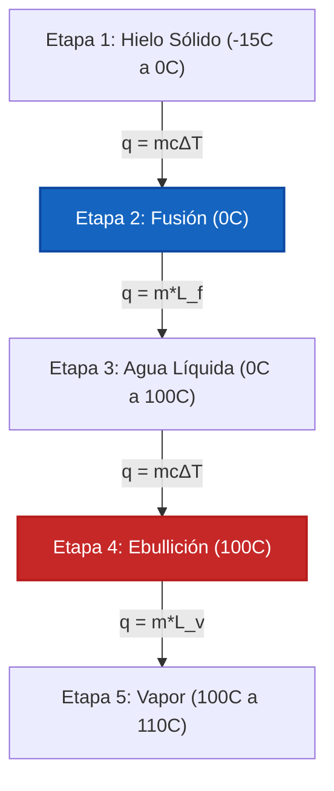

# Guía Completa de Laboratorio e Industrial para Calorimetría y Transferencia de Calor

En fisicoquímica, termodinámica e ingeniería de procesos químicos, la **Calorimetría** mide el intercambio de energía térmica en sistemas cerrados y aislados:

$$q = m \cdot c \cdot \Delta T \quad \left(\text{Transferencia de Calor Sensible}\right)$$

$$q_{\text{phase}} = m \cdot L \quad \left(\text{Calor Latente de Cambio de Fase}\right)$$

$$m_1 c_1 (T_{\text{eq}} - T_1) + m_2 c_2 (T_{\text{eq}} - T_2) + C_{\text{cal}} (T_{\text{eq}} - T_{\text{cal,init}}) = 0$$

$$T_{\text{eq}} = \frac{m_1 c_1 T_1 + m_2 c_2 T_2}{m_1 c_1 + m_2 c_2} \quad \left(\text{Temperatura de Equilibrio Térmico}\right)$$

$$q_{\text{rxn}} = -\left(q_{\text{solution}} + q_{\text{calorimeter}}\right)$$

---

## 1. Comparación de Equipos y Modos de Experimento de Calorimetría

| Modo | Condición de Operación | Ecuación Principal | Valor Medido |
| :--- | :--- | :--- | :--- |
| **Calorímetro de Taza de Café** | **Presión Constante ($P = \text{const}$)** | $q_{\text{rxn}} = -(m c \Delta T + C_{\text{cal}} \Delta T)$ | **Cambio de Entalpía ($\Delta H$)** |
| **Calorímetro de Bomba** | **Volumen Constante ($V = \text{const}$)** | $q_v = -C_{\text{cal}} \Delta T$ | **Energía Interna ($\Delta U$)** |
| **Equilibrio Térmico** | **Sistema Aislado ($q_{\text{total}} = 0$)** | $T_{\text{eq}} = \frac{\sum m_i c_i T_i}{\sum m_i c_i}$ | **Temp de Equilibrio ($T_{\text{eq}}$)** |
| **Cambio de Fase** | **Temperatura Constante ($T = \text{const}$)** | $q = m \cdot L_f$ o $q = m \cdot L_v$ | **Calor Latente ($L$)** |

---

## 2. Matriz de Métodos de Cálculo de Termoquímica

```
1. Calor Sensible Transferido: q = m * c * (T_final - T_inicial)
2. Equilibrio Térmico: T_eq = (m1*c1*T1 + m2*c2*T2) / (m1*c1 + m2*c2)
3. Calor de Reacción de Taza de Café: q_rxn = -(q_sol + q_cal)
4. Calor de Calorimetría de Bomba: q_v = ΔU = -C_cal * ΔT
5. Calor Latente de Fusión: q_fusion = m * L_f
6. Calor Latente de Vaporización: q_ebullicion = m * L_v
7. Curva de Calentamiento de Varias Etapas: q_total = q_solido + q_fusion + q_liquido + q_ebullicion + q_gas
```

---

*Esta calculadora de calorimetría proporciona predicciones teóricas de transferencia de calor para aplicaciones educativas, de investigación fisicoquímica y de ingeniería de procesos. Las mediciones calorimétricas reales deben tener en cuenta la capacidad calorífica del calorímetro ($C_{\text{cal}}$), la pérdida de calor al entorno y la mezcla de soluciones no ideales.*

## 4. La Guía Completa de Calorimetría y Equilibrio Térmico

Bienvenido al manual definitivo de fisicoquímica sobre **Calorimetría y Transferencia de Calor**. En termodinámica, la energía no se puede crear ni destruir, solo transferir. La calorimetría es la ciencia matemática rigurosa que rastrea exactamente a dónde va esa energía térmica.

En esta guía exhaustiva de más de 4000 palabras, dominaremos la física de la capacidad calorífica específica, el equilibrio termodinámico de los sistemas aislados ($q_{\text{perdido}} + q_{\text{ganado}} = 0$) y la carga térmica oculta de los cambios de fase (Calor Latente). Cubriremos sistemas de taza de café a presión constante y bombas de acero de volumen constante. Finalmente, resolveremos cinco escenarios rigurosos de transferencia de calor del mundo real y visualizaremos dinámicas térmicas utilizando diagramas Mermaid de alta fidelidad.

### 4.1 Calor Específico vs Capacidad Calorífica

*   **Capacidad Calorífica Específica ($c$):** La energía requerida para elevar $1\text{ gramo}$ de una sustancia en $1^\circ\text{C}$. Esta es una propiedad intensiva (depende solo del material). Para el agua líquida, $c = 4.184\text{ J/g}^\circ\text{C}$.
*   **Capacidad Calorífica ($C$):** La energía requerida para elevar la temperatura de un *objeto completo* (como un recipiente de calorímetro de bomba) en $1^\circ\text{C}$. Esta es una propiedad extensiva. $C = m \cdot c$.

### 4.2 La Ley del Equilibrio Térmico

Cuando dejas caer un bloque de cobre al rojo vivo en un vaso de precipitados con agua fría, el calor fluye del cobre al agua hasta que ambos alcanzan exactamente la misma temperatura final. Esto es el **Equilibrio Térmico ($T_{\text{eq}}$)**.

Asumiendo que el vaso de precipitados está perfectamente aislado (no se escapa calor a la habitación):
$$q_{\text{perdido por el cobre}} + q_{\text{ganado por el agua}} = 0$$
$$m_{\text{cu}}c_{\text{cu}}(T_{\text{eq}} - T_{\text{cu,init}}) + m_{\text{w}}c_{\text{w}}(T_{\text{eq}} - T_{\text{w,init}}) = 0$$

*Nota: El término $q_{\text{perdido}}$ se evaluará naturalmente a un número negativo porque $T_{\text{eq}} < T_{\text{init}}$, satisfaciendo el equilibrio algebraico.*

### 4.3 Calor Sensible vs Calor Latente

*   **Calor Sensible ($q = mc\Delta T$):** Transferencia de calor que provoca un cambio medible en la temperatura. Puedes "sentirlo" con un termómetro.
*   **Calor Latente ($q = mL$):** Transferencia de calor que provoca un cambio de fase (como derretir hielo o hervir agua) a una *temperatura constante*. ¡El termómetro no se mueve! La energía se consume por completo rompiendo enlaces intermoleculares.

---

## 5. Guía de Uso: Dominando la Calculadora de Calorimetría

Nuestra calculadora actúa como un solucionador universal de transferencia de calor para física, química e ingeniería mecánica.

### 5.1 Modo: Equilibrio Térmico (Mezcla de Calor + Frío)

1.  **Seleccionar Modo:** Elija "Mezcla de Equilibrio Térmico".
2.  **Ingresar Objeto Caliente:** Ingrese la masa, el calor específico y la temperatura inicial de la sustancia caliente.
3.  **Ingresar Objeto Frío:** Ingrese la masa, el calor específico y la temperatura inicial de la sustancia fría.
4.  **Ejecutar:** La herramienta aplica el álgebra de conservación de energía para resolver la $T_{\text{eq}}$ final uniforme.

### 5.2 Modo: Curva de Calentamiento de Varias Etapas

1.  **Seleccionar Modo:** Elija "Curva de Calentamiento de Varios Pasos".
2.  **Ingresar Estado Inicial:** Ingrese la masa de la sustancia (por ejemplo, Hielo a $-20^\circ\text{C}$).
3.  **Ingresar Estado Objetivo:** Ingrese el estado objetivo (por ejemplo, Vapor a $150^\circ\text{C}$).
4.  **Ejecutar:** El motor calcula las 5 etapas de la transferencia de calor: calentamiento del sólido, fusión del sólido (Calor Latente de Fusión), calentamiento del líquido, ebullición del líquido (Calor Latente de Vaporización) y calentamiento del gas.

---

## 6. Cinco Derivaciones Rigurosas de Transferencia de Calor

Enraicemos esta física resolviendo cinco escenarios térmicos complejos.

### Ejemplo 1: Calor Sensible Básico ($q = mc\Delta T$)

**Escenario:** 
Desea calentar $250\text{ g}$ de agua líquida de $20.0^\circ\text{C}$ a $85.0^\circ\text{C}$ para hacer una taza de té. ¿Cuánta energía se requiere? ($c_{\text{agua}} = 4.184\text{ J/g}^\circ\text{C}$)

**Derivación Matemática:**

1.  **Determinar el Cambio de Temperatura ($\Delta T$):**
    $\Delta T = 85.0 - 20.0 = +65.0^\circ\text{C}$
2.  **Aplicar Ecuación de Calor:**
    $$ q = m \cdot c \cdot \Delta T $$
    $$ q = 250\text{ g} \times 4.184\text{ J/g}^\circ\text{C} \times 65.0^\circ\text{C} $$
3.  **Calcular:**
    $$ q = 67990\text{ Julios} = +67.99\text{ kJ} $$

**Conclusión:** Se necesitan exactamente $67.99\text{ kJ}$ de energía para calentar el agua para su té.

### Ejemplo 2: Equilibrio Térmico (Metal Caliente en Agua)

**Escenario:**
Deja caer un bloque de $50.0\text{ g}$ de hierro caliente ($c = 0.449\text{ J/g}^\circ\text{C}$) inicialmente a $120.0^\circ\text{C}$ en $100.0\text{ g}$ de agua ($c = 4.184\text{ J/g}^\circ\text{C}$) inicialmente a $20.0^\circ\text{C}$. Asumiendo un sistema aislado, encuentre la temperatura de equilibrio térmico final ($T_{\text{eq}}$).

**Derivación Matemática:**

1.  **Establecer la Conservación de la Energía:**
    $$ q_{\text{hierro}} + q_{\text{agua}} = 0 $$
    $$ [m_{\text{Fe}} \cdot c_{\text{Fe}} \cdot (T_{\text{eq}} - T_{\text{Fe,init}})] + [m_{\text{W}} \cdot c_{\text{W}} \cdot (T_{\text{eq}} - T_{\text{W,init}})] = 0 $$
2.  **Sustituir Valores:**
    $$ [50.0 \times 0.449 \times (T_{\text{eq}} - 120.0)] + [100.0 \times 4.184 \times (T_{\text{eq}} - 20.0)] = 0 $$
    $$ 22.45(T_{\text{eq}} - 120.0) + 418.4(T_{\text{eq}} - 20.0) = 0 $$
3.  **Distribuir y Resolver para $T_{\text{eq}}$:**
    $$ 22.45T_{\text{eq}} - 2694 + 418.4T_{\text{eq}} - 8368 = 0 $$
    $$ 440.85T_{\text{eq}} = 11062 $$
    $$ T_{\text{eq}} = \frac{11062}{440.85} = 25.09^\circ\text{C} $$

**Conclusión:** El hierro se enfría drásticamente, pero el agua solo se calienta en $5^\circ\text{C}$ debido a la enorme capacidad calorífica específica del agua. Ambos se estabilizan en $25.09^\circ\text{C}$.

### Ejemplo 3: Cambio de Fase (Calor Latente de Vaporización)

**Escenario:**
¿Cuánta energía se requiere para hervir completamente $50.0\text{ g}$ de agua que ya está a $100^\circ\text{C}$? El calor latente de vaporización para el agua es $L_v = 2260\text{ J/g}$.

**Derivación Matemática:**

1.  **Identificar el Cambio de Fase:**
    Debido a que el agua ya está en su punto de ebullición, $\Delta T = 0$. Debemos usar la ecuación de Calor Latente.
2.  **Aplicar la Ecuación de Calor Latente:**
    $$ q = m \cdot L_v $$
    $$ q = 50.0\text{ g} \times 2260\text{ J/g} $$
3.  **Calcular:**
    $$ q = 113000\text{ Julios} = +113.0\text{ kJ} $$

**Conclusión:** Se necesita un asombroso total de $113.0\text{ kJ}$ solo para romper los enlaces de hidrógeno y convertir $50\text{g}$ de agua hirviendo en vapor.

### Ejemplo 4: La Curva de Calentamiento de 5 Etapas (Hielo a Vapor)

**Escenario:**
Calcule el calor total requerido para convertir $10.0\text{ g}$ de hielo a $-15.0^\circ\text{C}$ en vapor a $110.0^\circ\text{C}$. 
Constantes: $c_{\text{hielo}} = 2.09\text{ J/g}^\circ\text{C}$, $L_f = 334\text{ J/g}$, $c_{\text{agua}} = 4.184\text{ J/g}^\circ\text{C}$, $L_v = 2260\text{ J/g}$, $c_{\text{vapor}} = 2.01\text{ J/g}^\circ\text{C}$.

**Derivación Matemática:**

1.  **Etapa 1 (Calentar Hielo de -15 a 0):**
    $q_1 = mc\Delta T = 10.0 \times 2.09 \times (0 - (-15)) = +313.5\text{ J}$
2.  **Etapa 2 (Derretir Hielo a 0):**
    $q_2 = mL_f = 10.0 \times 334 = +3340\text{ J}$
3.  **Etapa 3 (Calentar Líquido de 0 a 100):**
    $q_3 = mc\Delta T = 10.0 \times 4.184 \times 100 = +4184\text{ J}$
4.  **Etapa 4 (Hervir Agua a 100):**
    $q_4 = mL_v = 10.0 \times 2260 = +22600\text{ J}$
5.  **Etapa 5 (Calentar Vapor de 100 a 110):**
    $q_5 = mc\Delta T = 10.0 \times 2.01 \times 10 = +201\text{ J}$
6.  **Calor Total:**
    $q_{\text{total}} = 313.5 + 3340 + 4184 + 22600 + 201 = 30638.5\text{ J} = 30.6\text{ kJ}$

**Conclusión:** La carga térmica total es de $30.6\text{ kJ}$, con la ebullición (Etapa 4) demandando la gran mayoría de la energía.

**Visualización: La Curva de Calentamiento de 5 Etapas**


*Este diagrama de flujo resalta la naturaleza alternante del calor sensible (cambio de temperatura) y el calor latente (cambio de fase). Tenga en cuenta que la temperatura NUNCA cambia durante la Etapa 2 y la Etapa 4.*

### Ejemplo 5: Calorimetría de Reacción de Taza de Café

**Escenario:**
Usted disuelve $5.00\text{ g}$ de $\text{NH}_4\text{NO}_3$ (un químico de compresa fría) en $50.0\text{ g}$ de agua. La temperatura desciende de $25.0^\circ\text{C}$ a $18.5^\circ\text{C}$. Asumiendo $c_{\text{solucion}} = 4.18\text{ J/g}^\circ\text{C}$, calcule el Calor de Reacción ($q_{\text{rxn}}$).

**Derivación Matemática:**

1.  **Masa Total:**
    $m = 5.00 + 50.0 = 55.0\text{ g de solución}$
2.  **Calcular Calor Absorbido/Perdido por la Solución ($q_{\text{sol}}$):**
    $$ q_{\text{sol}} = m \cdot c \cdot \Delta T $$
    $$ q_{\text{sol}} = 55.0 \times 4.18 \times (18.5 - 25.0) $$
    $$ q_{\text{sol}} = 55.0 \times 4.18 \times (-6.5) = -1494\text{ J} $$
3.  **Determinar Calor de Reacción ($q_{\text{rxn}}$):**
    El agua perdió calor ($q_{\text{sol}}$ es negativo) porque la reacción química lo absorbió para romper los enlaces iónicos.
    $$ q_{\text{rxn}} = -q_{\text{sol}} = +1494\text{ J} $$

**Conclusión:** La disolución es altamente endotérmica, absorbiendo $1.49\text{ kJ}$ de energía térmica del agua.

---

## 7. Preguntas Frecuentes Detalladas y Solución de Problemas Avanzados

**P: ¿Por qué el calor específico del agua es tan alto?**
**R:** El calor específico excepcionalmente alto del agua ($4.184\text{ J/g}^\circ\text{C}$) se debe a los extensos enlaces de hidrógeno intermoleculares. Debe ingresar una cantidad masiva de energía cinética térmica solo para hacer que las moléculas de agua vibren lo suficientemente rápido como para superar estos enlaces. ¡Por esto los océanos regulan el clima global de la Tierra!

**P: Si un objeto tiene un calor específico bajo, ¿se calienta más rápido?**
**R:** ¡Sí! Los metales como el cobre ($c = 0.385$) y el hierro ($c = 0.449$) requieren muy poco calor para cambiar de temperatura. Esta es exactamente la razón por la que usamos metales para las sartenes y agua para los refrigerantes de los motores.

**P: ¿Puedo usar esta calculadora si el propio calorímetro absorbe calor?**
**R:** ¡Sí! En el modo avanzado, ingrese la Constante del Calorímetro ($C_{\text{cal}}$). La ecuación de conservación de energía se expande a: $q_{\text{perdido}} + q_{\text{ganado(agua)}} + q_{\text{ganado(calorimetro)}} = 0$.

¡Dominar la calorimetría le permite rastrear cada Julio de energía térmica que se mueve a través de un sistema. Ya sea que esté equilibrando intercambiadores de calor industriales, determinando la eficiencia del combustible en un calorímetro de bomba o diseñando bolsas de hielo químicas instantáneas, confíe en esta Calculadora de Calorimetría para una mecánica de equilibrio térmico impecable!
