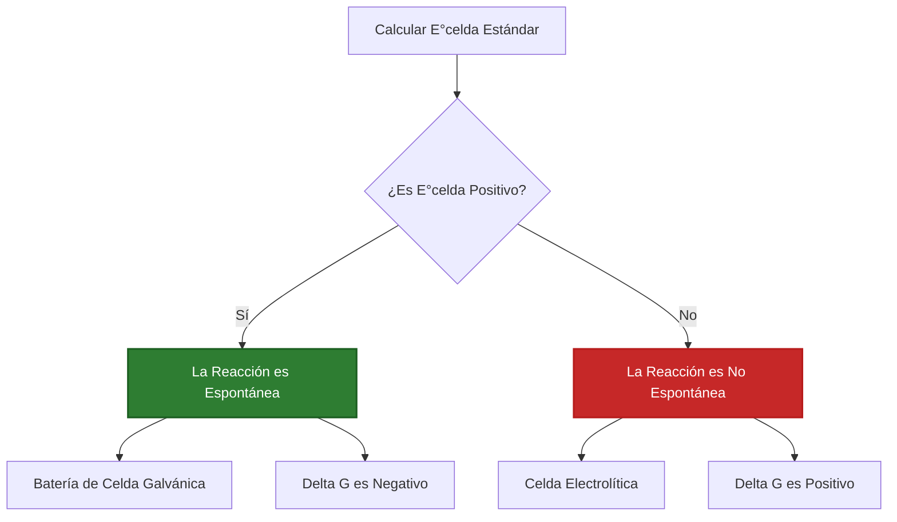

# Guía de Laboratorio y Analítica para el Potencial de Celda y Análisis Electroquímico

En la química física y la electroquímica analítica, el **potencial de celda** ($E_{\text{celda}}$) mide la fuerza electromotriz (FEM) generada por una reacción redox:

$$E_{\text{celda}}^\circ = E_{\text{cátodo}}^\circ - E_{\text{ánodo}}^\circ$$

$$E_{\text{celda}} = E_{\text{celda}}^\circ - \frac{R T}{n F} \ln Q \quad \left(\text{A } 25^\circ\text{C} \implies E_{\text{celda}} = E_{\text{celda}}^\circ - \frac{0.05916}{n} \log_{10} Q\right)$$

$$\Delta G = -n F E_{\text{celda}} \quad \text{y} \quad \Delta G^\circ = -n F E_{\text{celda}}^\circ = -R T \ln K \implies K = \exp\left(\frac{n F E_{\text{celda}}^\circ}{R T}\right)$$

---

## 1. Tabla de Referencia de Potencial de Reducción Estándar ($E^\circ$)

| Semirreacción | $E^\circ$ ($25^\circ\text{C}$) | Tendencia | Papel en la Celda Galvánica |
| :--- | :--- | :--- | :--- |
| $\text{F}_2(g) + 2e^- \rightleftharpoons 2\text{F}^-$ | **$+2.87 \text{ V}$** | **Agente Oxidante Más Fuerte** | Cátodo (Reducción) |
| $\text{Ag}^+ + e^- \rightleftharpoons \text{Ag}(s)$ | **$+0.80 \text{ V}$** | **Reducción Fuerte** | Cátodo |
| $\text{Cu}^{2+} + 2e^- \rightleftharpoons \text{Cu}(s)$ | **$+0.34 \text{ V}$** | **Reducción Moderada** | Cátodo / Ánodo frente a Ag |
| $2\text{H}^+ + 2e^- \rightleftharpoons \text{H}_2(g)$ | **$0.00 \text{ V}$** | **Estándar de Referencia (SHE)** | Referencia |
| $\text{Fe}^{2+} + 2e^- \rightleftharpoons \text{Fe}(s)$ | **$-0.44 \text{ V}$** | **Oxidación Moderada** | Ánodo |
| $\text{Zn}^{2+} + 2e^- \rightleftharpoons \text{Zn}(s)$ | **$-0.76 \text{ V}$** | **Oxidación Fuerte** | Ánodo |
| $\text{Li}^+ + e^- \rightleftharpoons \text{Li}(s)$ | **$-3.04 \text{ V}$** | **Agente Reductor Más Fuerte** | Ánodo (Oxidación) |

---

## 2. Protocolos de Cálculo de Potencial de Celda Estándar

```
1. Potencial de Celda Estándar: E0_celda = E0_cátodo - E0_ánodo
2. Potencial No Estándar: E_celda = E0_celda - (R * T / (n * F)) * ln(Q)
3. Energía Libre de Gibbs: deltaG = -n * F * E_celda (kJ/mol)
4. Constante de Equilibrio K: log10(K) = (n * E0_celda) / 0.05916
5. Verificación de Espontaneidad: E_celda > 0 V => Celda Galvánica Espontánea
```

---

## 3. Descargo de Responsabilidad de Seguridad de Laboratorio y Educativa
*Esta calculadora de potencial de celda proporciona cálculos termodinámicos teóricos para aplicaciones educativas, de investigación de laboratorio y de química AP. Los sistemas de baterías industriales reales deben tener en cuenta los coeficientes de actividad, los potenciales de unión líquida y los sobrepotenciales de activación.*

## 4. La Guía Definitiva sobre el Potencial de Celda y la FEM

Bienvenido al manual de laboratorio más exhaustivo y científicamente riguroso sobre el **Potencial de Celda ($E_{\text{celda}}$)**. Desde los microvoltajes que estabilizan las membranas celulares biológicas hasta las matrices de megavatios que alimentan los vehículos eléctricos modernos, la física de la Fuerza Electromotriz (FEM) es universal.

En este completo manual de más de 4000 palabras, definiremos rigurosamente los Potenciales de Reducción Estándar ($E^\circ$), demostraremos matemáticamente por qué los voltajes **nunca se multiplican por los coeficientes estequiométricos**, derivaremos la Ecuación de Nernst para baterías en decaimiento y conectaremos directamente el voltaje físico con la Energía Libre de Gibbs termodinámica ($\Delta G$). Además, recorreremos cinco ejemplos matemáticos muy detallados, utilizando diagramas de Mermaid de alta fidelidad para mapear la lógica de los potenciales de reducción.

### 4.1 ¿Qué es el Potencial de Celda ($E_{\text{celda}}$)?

El Potencial de Celda, a menudo llamado Fuerza Electromotriz (FEM), es la medida física del "tirón" o "fuerza motriz" sobre los electrones a medida que viajan a través de un circuito. Es la manifestación literal de la espontaneidad termodinámica.

*   Si $E_{\text{celda}}$ es **Positivo ($> 0\text{ V}$)**: La reacción es altamente espontánea. Los electrones son fuertemente atraídos hacia el cátodo, generando energía utilizable (Celda Galvánica / Batería).
*   Si $E_{\text{celda}}$ es **Negativo ($< 0\text{ V}$)**: La reacción no es espontánea. Debe enchufar el sistema a la pared y forzar un voltaje externo en dirección opuesta contra las sustancias químicas para que ocurra la reacción (Celda Electrolítica / Galvanoplastia).
*   Si $E_{\text{celda}}$ es **Exactamente $0\text{ V}$**: La batería está muerta. El sistema ha alcanzado el equilibrio termodinámico perfecto y no se produce un flujo neto de electrones.

### 4.2 La Naturaleza Intensiva del Voltaje (¡NO MULTIPLIQUE!)

Uno de los errores más catastróficos que cometen los estudiantes de química es tratar el voltaje como masa o energía.

Si quema $2\text{ moles}$ de madera, obtiene el doble de calor ($\Delta H$) que al quemar $1\text{ mol}$. El calor es una **propiedad extensiva**; escala con el tamaño.
El voltaje es una **propiedad intensiva**, al igual que la Temperatura o la Densidad. El voltaje de una reacción química es una medida de la *energía por cada electrón*.

Por lo tanto, al balancear semirreacciones redox:
*   $\text{Cu}^{2+} + 2e^- \to \text{Cu} \quad (E^\circ = +0.34\text{ V})$
*   Si multiplica la reacción por 3 para equilibrar los electrones: $3\text{Cu}^{2+} + 6e^- \to 3\text{Cu}$
*   **EL VOLTAJE SIGUE SIENDO EXACTAMENTE $+0.34\text{ V}$.** ¡No lo multiplique por 3! La energía por electrón no ha cambiado, simplemente tiene más electrones fluyendo exactamente al mismo potencial.

### 4.3 Condiciones Estándar vs. No Estándar

*   **Potencial de Celda Estándar ($E^\circ_{\text{celda}}$):** El voltaje medido en condiciones de laboratorio perfectas: $25^\circ\text{C}$ (298.15K), todas las soluciones acuosas exactamente a $1.0\text{ M}$ de concentración y todos los gases exactamente a $1.0\text{ atm}$ de presión parcial.
*   **Potencial No Estándar ($E_{\text{celda}}$):** El voltaje en el mundo real. A medida que una batería se agota, los reactivos se consumen (las concentraciones caen por debajo de $1.0\text{ M}$) y se forman productos. Esto obliga al voltaje en tiempo real a decaer lentamente de forma logarítmica de acuerdo con la Ecuación de Nernst, hasta llegar finalmente a $0\text{ V}$.

---

## 5. Guía de Uso: Dominando la Calculadora de Potencial de Celda

Nuestra calculadora actúa como un solucionador termodinámico universal para la FEM.

### 5.1 Modo: Cálculo del Potencial Estándar ($E^\circ_{\text{celda}}$)

1.  **Seleccionar Modo:** Elija "Potencial de Celda Estándar E°celda".
2.  **Parámetros de Entrada:** Seleccione sus dos semirreacciones de la tabla de potenciales de reducción estándar (o ingrese valores personalizados).
3.  **Ejecutar:** La herramienta identifica automáticamente al agente oxidante más fuerte como el Cátodo, aplica $E^\circ_{\text{celda}} = E^\circ_{\text{cátodo}} - E^\circ_{\text{ánodo}}$, y genera el voltaje estándar exacto.

### 5.2 Modo: Conversión de Energía Libre de Gibbs ($\Delta G$)

1.  **Seleccionar Modo:** Elija "Energía Libre de Gibbs y K".
2.  **Parámetros de Entrada:** Ingrese el Potencial de Celda calculado ($E$) y el número de electrones transferidos en la reacción balanceada ($n$).
3.  **Ejecutar:** La herramienta utiliza la constante de Faraday ($F = 96485\text{ C/mol}$) para multiplicar el voltaje, obteniendo el trabajo físico absoluto ($\Delta G$ en $\text{kJ/mol}$) que la batería puede realizar.

### 5.3 Modo: Voltaje No Estándar de Nernst

1.  **Seleccionar Modo:** Elija "Potencial de Celda No Estándar (Nernst)".
2.  **Parámetros de Entrada:** Ingrese el Potencial Estándar, el valor $n$ balanceado, la temperatura de operación y las molaridades específicas de los Reactivos y Productos.
3.  **Ejecutar:** La herramienta calcula el Cociente de Reacción ($Q$), aplica el decaimiento logarítmico de Nernst y emite el voltaje real y operativo en tiempo real de la batería en degradación.

---

## 6. Cinco Ejemplos Reales de Química Analítica

Solidifiquemos esta teoría resolviendo cinco escenarios de potencial rigurosos y prácticos.

### Ejemplo 1: Cálculo del Voltaje Estándar de una Celda de Aluminio-Cobre

**Escenario:** 
Usted construye una celda utilizando un ánodo de Aluminio y un cátodo de Cobre bajo condiciones estándar ($1.0\text{ M}$, $25^\circ\text{C}$).
Potenciales de Reducción Estándar:
*   $\text{Cu}^{2+} + 2e^- \rightleftharpoons \text{Cu} \quad (E^\circ = +0.34\text{ V})$
*   $\text{Al}^{3+} + 3e^- \rightleftharpoons \text{Al} \quad (E^\circ = -1.66\text{ V})$

Calcule el potencial de celda estándar ($E^\circ_{\text{celda}}$).

**Derivación Matemática:**

1.  **Identificar Cátodo y Ánodo:**
    La especie con el potencial de reducción más positivo es el Cátodo (desea desesperadamente ser reducida).
    Cátodo = Cobre ($+0.34\text{ V}$)
    Ánodo = Aluminio ($-1.66\text{ V}$)
2.  **Aplicar la Ecuación Estándar:**
    $$ E_{\text{celda}}^\circ = E_{\text{cátodo}}^\circ - E_{\text{ánodo}}^\circ $$
3.  **Calcular:**
    $$ E_{\text{celda}}^\circ = 0.34 - (-1.66) $$
    $$ E_{\text{celda}}^\circ = +2.00\text{ V} $$

**Conclusión:** La celda produce exactamente $2.00\text{ Voltios}$. Note que ignoramos por completo el hecho de que el Aluminio transfiere 3 electrones y el Cobre transfiere 2. NO multiplicamos los voltajes. El voltaje es intensivo.

### Ejemplo 2: Determinación del Trabajo Termodinámico Total (Energía Libre de Gibbs)

**Escenario:**
Usando la celda de Aluminio-Cobre de $+2.00\text{ V}$ del Ejemplo 1, calcule la Energía Libre de Gibbs total ($\Delta G^\circ$) liberada por mol de reacción.

**Derivación Matemática:**

1.  **Balancear los Electrones para encontrar $n$:**
    Al se oxida: $\text{Al} \to \text{Al}^{3+} + 3e^-$ (Multiplicar por 2 $\implies$ $6e^-$)
    Cu se reduce: $\text{Cu}^{2+} + 2e^- \to \text{Cu}$ (Multiplicar por 3 $\implies$ $6e^-$)
    Total de electrones transferidos: $n = 6$
2.  **Identificar Datos Conocidos:**
    $E^\circ = +2.00\text{ V}$
    $F = 96485\text{ C/mol}$
3.  **Aplicar la Ecuación de Gibbs:**
    $$ \Delta G^\circ = -nFE^\circ $$
4.  **Calcular:**
    $$ \Delta G^\circ = -(6)(96485)(2.00) $$
    $$ \Delta G^\circ = -1157820\text{ J/mol} $$
    $$ \Delta G^\circ = -1157.8\text{ kJ/mol} $$

**Conclusión:** Esta es una reacción violentamente espontánea, capaz de realizar más de $1.1\text{ MegaJoules}$ de trabajo físico por mol de Aluminio consumido.

### Ejemplo 3: Seguimiento del Decaimiento de Voltaje vía Nernst

**Escenario:**
Dejas funcionar una batería de Plata-Zinc durante horas. 
Reacción Estándar: $\text{Zn} + 2\text{Ag}^+ \to \text{Zn}^{2+} + 2\text{Ag}$
$E^\circ_{\text{celda}} = +1.56\text{ V}$, $n = 2$.
La batería está casi agotada. El reactivo $[\text{Ag}^+]$ cae a $0.01\text{ M}$, y el producto $[\text{Zn}^{2+}]$ sube a $1.99\text{ M}$. Calcule el voltaje en tiempo real a $25^\circ\text{C}$.

**Derivación Matemática:**

1.  **Calcular el Cociente de Reacción ($Q$):**
    $$ Q = \frac{[\text{Productos}]}{[\text{Reactivos}]} = \frac{[\text{Zn}^{2+}]}{[\text{Ag}^+]^2} $$
    *Note que la concentración de Ag+ está al cuadrado debido a que su coeficiente estequiométrico en la reacción balanceada es 2.*
    $$ Q = \frac{1.99}{(0.01)^2} = \frac{1.99}{0.0001} = 19900 $$
2.  **Aplicar la Ecuación de Nernst:**
    $$ E = E^\circ - \frac{0.05916}{n} \log_{10}(Q) $$
3.  **Calcular:**
    $$ E = 1.56 - \frac{0.05916}{2} \log_{10}(19900) $$
    $$ E = 1.56 - (0.02958 \times 4.298) $$
    $$ E = 1.56 - 0.127 = +1.433\text{ V} $$

**Conclusión:** A pesar de que el reactivo está severamente agotado, la naturaleza logarítmica de la ecuación de Nernst significa que el voltaje solo ha bajado de $1.56\text{ V}$ a $1.43\text{ V}$.

**Visualización: Mapa Lógico de Espontaneidad**


*Este diagrama de flujo mapea el acoplamiento termodinámico rígido entre la positividad del Potencial de Celda y la espontaneidad física.*

### Ejemplo 4: Cálculo de la Constante de Equilibrio ($K$) de una Batería Muerta

**Escenario:**
Una celda de Cobre-Plata ($E^\circ = +0.46\text{ V}$, $n = 2$) se deja funcionar hasta agotarse completamente de modo que $E_{\text{celda}} = 0\text{ V}$. ¿Cuál es la relación máxima absoluta de Productos a Reactivos ($K$) cuando esto ocurre a $25^\circ\text{C}$?

**Derivación Matemática:**

1.  **Identificar Datos Conocidos:**
    $E^\circ = +0.46\text{ V}$
    $n = 2$
2.  **Aplicar la Derivación de Equilibrio de Nernst:**
    Cuando $E = 0$, $Q$ se convierte en $K$.
    $$ 0 = E^\circ - \frac{0.05916}{n} \log_{10}(K) $$
    $$ \log_{10}(K) = \frac{n \times E^\circ}{0.05916} $$
3.  **Calcular:**
    $$ \log_{10}(K) = \frac{2 \times 0.46}{0.05916} = 15.55 $$
    $$ K = 10^{15.55} = 3.55 \times 10^{15} $$

**Conclusión:** La reacción avanzará implacablemente hacia adelante hasta que haya $3.55 \times 10^{15}$ veces más iones de producto que de reactivo antes de que finalmente alcance el equilibrio termodinámico y la batería muera.

### Ejemplo 5: Electrólisis del Agua (Potencial Negativo)

**Escenario:**
Desea separar el agua líquida en gas Hidrógeno y Oxígeno para combustible de cohetes. 
Oxidación del Agua: $2\text{H}_2\text{O} \to \text{O}_2 + 4\text{H}^+ + 4e^- \quad (E^\circ_{\text{ánodo}} = +1.23\text{ V})$
Reducción del Agua: $2\text{H}_2\text{O} + 2e^- \to \text{H}_2 + 2\text{OH}^- \quad (E^\circ_{\text{cátodo}} = -0.83\text{ V})$

Calcule el voltaje estándar teórico requerido.

**Derivación Matemática:**

1.  **Aplicar la Ecuación Estándar:**
    $$ E_{\text{celda}}^\circ = E_{\text{cátodo}}^\circ - E_{\text{ánodo}}^\circ $$
2.  **Calcular:**
    $$ E_{\text{celda}}^\circ = -0.83 - (+1.23) $$
    $$ E_{\text{celda}}^\circ = -2.06\text{ V} $$

**Conclusión:** El potencial de la celda es negativo $-2.06\text{ V}$. Esto confirma que el agua nunca se dividirá espontáneamente por sí sola. Debe conectar una fuente de alimentación y aplicarle *al menos* $+2.06\text{ V}$ para forzar la reacción en sentido inverso.

**Visualización: Línea de Tiempo del Decaimiento de Voltaje**

```mermaid
gantt
    title Decaimiento del Voltaje de la Batería y Cambio de Nernst
    dateFormat  HH:mm:ss
    axisFormat  %H:%M
    section Estado Estándar
    Potencial Estándar (1.0 M) :00:00:00, 00:30:00
    section Estado No Estándar
    Decaimiento Logarítmico Lento :active, 00:30:00, 04:00:00
    section Fin de Vida
    Caída Rápida de Voltaje :crit, 04:00:00, 04:30:00
    Equilibrio (0V Muerta) :04:30:00, 05:00:00
```


*Esta línea de tiempo ilustra la degradación no lineal del voltaje de la batería tal como es gobernada por el Cociente de Reacción ($Q$) logarítmico.*

---

## 7. Preguntas Frecuentes Detalladas y Solución de Problemas Avanzados

**P: ¿Se puede tener un potencial de reducción estándar negativo en el Cátodo?**
**R:** ¡Sí! El cátodo solo tiene que ser *más positivo* (o menos negativo) que el ánodo. Por ejemplo, si el Cátodo es $-0.2\text{ V}$ y el Ánodo es $-0.9\text{ V}$, el potencial de celda resultante es $-0.2 - (-0.9) = +0.7\text{ V}$ (Espontáneo).

**P: ¿Por qué no multiplicamos el Voltaje ($E^\circ$) por los coeficientes molares al balancear las ecuaciones?**
**R:** El voltaje es energía *por electrón* ($\text{Joules} / \text{Coulomb}$). Si se duplica la ecuación química, se duplica el número de electrones que fluyen y se duplica el total de Julios de trabajo ($\Delta G$). Pero la relación ($\text{Joules} / \text{Coulombs}$) permanece completamente idéntica. Es una propiedad intensiva.

**P: ¿Qué es el Electrodo Estándar de Hidrógeno (SHE)?**
**R:** No se puede medir el voltaje de una sola semirreacción; solo se puede medir la *diferencia* entre dos semirreacciones. Los químicos asignaron arbitrariamente a la reducción de $\text{H}^+$ a gas $\text{H}_2$ un voltaje de exactamente $0.000\text{ V}$. Todos los demás voltajes en la tabla se miden con relación a esta línea base.

Al dominar el cálculo de los Potenciales Estándar, sortear las trampas logarítmicas de la Ecuación de Nernst y comprender la naturaleza física intensiva del voltaje, puede diseñar sistemas de energía electroquímica impecables. ¡Confíe en esta Calculadora de Potencial de Celda para obtener una precisión FEM instantánea y termodinámicamente perfecta!
