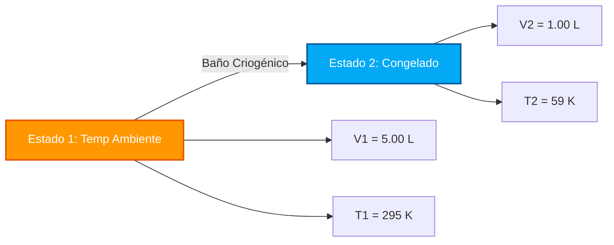

# Guía Completa de Laboratorio e Industrial para la Ley de Charles y el Análisis de Volumen-Temperatura

En fisicoquímica, dinámica de gases y termodinámica de procesos, la **Ley de Charles** define la proporcionalidad directa entre el volumen y la temperatura absoluta para una cantidad fija de gas a presión constante:

$$\frac{V}{T} = k \quad \left(\text{Ecuación de Estado Isobárico}\right)$$

$$\frac{V_1}{T_1} = \frac{V_2}{T_2} \quad \left(\text{Ecuación de la Ley de Charles}\right)$$

$$V_2 = \frac{V_1 \cdot T_2}{T_1} \quad \left(\text{Fórmula de Volumen Final}\right)$$

$$T_2 = \frac{V_2 \cdot T_1}{V_1} \quad \left(\text{Fórmula de Temperatura Final en Kelvin}\right)$$

$$V \propto T \quad \left(\text{Proporcionalidad Directa en Kelvin}\right)$$

---

## 1. Matriz de Clasificación de Procesos

| Cambio de Temperatura | Cambio de Volumen | Clasificación de Proceso | Interpretación Molecular |
| :--- | :--- | :--- | :--- |
| **Temp Aumenta ($T_2 > T_1$)** | **Volumen Aumenta ($V_2 > V_1$)** | **Expansión Térmica** | **Las moléculas se mueven más rápido ➔ Empujan el límite del recipiente hacia afuera** |
| **Temp Disminuye ($T_2 < T_1$)** | **Volumen Disminuye ($V_2 < V_1$)** | **Contracción Térmica** | **Las moléculas se mueven más lento ➔ El recipiente se contrae hacia adentro** |
| **Temp Sin Cambios ($T_2 = T_1$)** | **Volumen Sin Cambios ($V_2 = V_1$)** | **Estado Constante Isobárico** | **Sin volumen ni transformación térmica** |

---

## 2. Matriz de Calculadoras de Variables Desconocidas

```
1. Volumen Final: V2 = (V1 * T2) / T1
2. Temperatura Final: T2 = (V2 * T1) / V1
3. Volumen Inicial: V1 = (V2 * T1) / T2
4. Temperatura Inicial: T1 = (V1 * T2) / V2
```

---

*Esta calculadora de la Ley de Charles proporciona predicciones termodinámicas teóricas para aplicaciones educativas, de investigación fisicoquímica y de ingeniería de procesos de gases. Asume presión constante ($P_1 = P_2$) y moles de gas constantes ($n_1 = n_2$). Si la presión o la cantidad de moles cambian, consulte las calculadoras de la Ley Combinada de los Gases o la Ley de los Gases Ideales.*

## 4. La Guía Completa de la Ley de Charles y la Expansión Térmica Isobárica

Bienvenido al manual definitivo de fisicoquímica sobre la **Ley de Charles**. ¿Por qué un globo aerostático flota majestuosamente hacia arriba cuando se enciende el quemador? ¿Por qué una pelota de fútbol que se deja afuera en la nieve helada del invierno se desinfla? ¿Por qué las latas de aerosol vienen con severas advertencias de nunca dejarlas bajo la luz solar directa?

Las respuestas a estos misterios termodinámicos se encuentran en la elegante proporcionalidad directa descubierta por el científico francés Jacques Charles en 1787: $\frac{V_1}{T_1} = \frac{V_2}{T_2}$.

En esta exhaustiva guía de más de 4000 palabras, desentrañaremos la teoría cinética molecular detrás de la expansión isobárica (presión constante) de los gases, exploraremos rigurosamente la necesidad matemática de la Escala Absoluta Kelvin y ejecutaremos cinco derivaciones algebraicas muy detalladas, desde globos aerostáticos hasta congelamiento criogénico.

### 4.1 La Teoría Cinética Microscópica de la Ley de Charles

Para comprender verdaderamente la expansión térmica, debemos ver el gas a nivel atómico. Un gas ideal está compuesto por miles de millones de moléculas microscópicas que se acercan velozmente a su contenedor.

*   **Temperatura ($T$)** es una medida directa de la energía cinética promedio (velocidad) de estas moléculas. Calentar el gas hace que las moléculas vuelen más rápido.
*   **Volumen ($V$)** es el espacio físico 3D que ocupa el gas.
*   **Presión ($P$)** es la fuerza que ejercen las moléculas al chocar con las paredes del recipiente.

Si mantenemos la Presión perfectamente **constante** (un proceso *isobárico*), significa que queremos que las colisiones contra la pared sigan siendo exactamente las mismas. Sin embargo, si calentamos el gas, las moléculas comienzan a volar mucho más rápido y golpean las paredes con más fuerza. Para evitar que la presión se dispare, el recipiente *debe* expandirse. El volumen físico adicional les da a las moléculas en movimiento rápido más distancia para viajar, equilibrando la tasa de colisión.
Por lo tanto, si duplica la temperatura absoluta, el volumen exactamente **se duplica**. Ésta es la esencia de la Proporcionalidad Directa: $V \propto T$.

### 4.2 El Mandato del Cero Absoluto (Por Qué se Requiere Kelvin)

El error más común y devastador en los cálculos de la Ley de Charles es intentar usar Celsius o Fahrenheit. **Debe usar exclusivamente la escala Kelvin ($K$).**

¿Por qué? La ecuación $\frac{V_1}{T_1} = \frac{V_2}{T_2}$ es una proporción. Para que una proporción funcione matemáticamente, la escala debe tener un verdadero punto cero donde la propiedad que se mide deja de existir. $0^\circ\text{C}$ es simplemente el punto de congelación del agua; no significa "cero energía térmica".
Si usara Celsius, calcular el cambio de volumen cuando el gas cruza $0^\circ\text{C}$ daría como resultado un error de división por cero, rompiendo la matemática por completo. Además, las temperaturas Celsius negativas generarían *volúmenes negativos* físicamente imposibles.
**El Cero Absoluto ($0\text{ K}$)** es el estado teórico en el que todo movimiento cinético atómico se detiene por completo. Por lo tanto, la proporcionalidad del volumen y la temperatura sólo funciona en esta escala absoluta.
**Fórmula de Conversión:** $T_{\text{K}} = T_{^\circ\text{C}} + 273.15$

---

## 5. Guía de Uso: Dominando la Calculadora Isobárica

Nuestra calculadora actúa como un solucionador algebraico universal para cualquier transformación térmica de gas a presión constante.

### 5.1 Modo: Aislamiento de Variables de Estado Final (Estado 2)

1.  **Seleccione el Objetivo:** Elija si necesita aislar el Volumen Final ($V_2$) o la Temperatura Final ($T_2$).
2.  **Ingrese el Estado Inicial:** Ingrese las condiciones iniciales (Estado 1) para el Volumen y la Temperatura. (Nuestra calculadora maneja automáticamente la conversión a Kelvin si ingresa Celsius).
3.  **Ingrese el Estado Final Conocido:** Ingrese el único parámetro conocido para el Estado 2 (ya sea el nuevo volumen o la nueva temperatura).
4.  **Ejecute:** El motor reorganiza algebraicamente la proporción $\frac{V_1}{T_1} = \frac{V_2}{T_2}$ para aislar y resolver perfectamente la variable desconocida.

### 5.2 Flexibilidad de Unidades

Debido a que la Ley de Charles es una proporción proporcional, **las unidades de Volumen son completamente flexibles**.
*   Si $V_1$ está en `Litros`, $V_2$ se calculará en `Litros`.
*   Si $V_1$ está en `Metros Cúbicos` o `Galones`, la matemática se mantiene perfectamente.
*   **Excepción:** La temperatura *siempre* debe convertirse a Kelvin antes de multiplicar o dividir.

---

## 6. Cinco Derivaciones Rigurosas de la Ley de Charles

Dominemos el álgebra de las transformaciones isobáricas de gases aislando variables en cinco escenarios ambientales y de ingeniería del mundo real.

### Ejemplo 1: Aislar el Volumen Final (Globo Aerostático)

**Escenario:**
Un globo aerostático contiene $2,500\text{ m}^3$ de aire en el suelo en una mañana fría con una temperatura de $15.0^\circ\text{C}$. El piloto enciende el quemador de propano, calentando el aire dentro de la envoltura a $120.0^\circ\text{C}$. La presión dentro del globo iguala perfectamente la presión atmosférica exterior (Isobárica). ¿Cuál es el nuevo volumen del aire?

**Derivación Matemática:**

1.  **Definir el Estado 1 (Mañana):**
    $V_1 = 2500\text{ m}^3$
    $T_1 = 15.0 + 273.15 = 288.15\text{ K}$
2.  **Definir el Estado 2 (Calentado):**
    $V_2 = ?\text{ m}^3$
    $T_2 = 120.0 + 273.15 = 393.15\text{ K}$
3.  **Aislar $V_2$:**
    $$ \frac{V_1}{T_1} = \frac{V_2}{T_2} \implies V_2 = \frac{V_1 \cdot T_2}{T_1} $$
4.  **Calcular:**
    $$ V_2 = \frac{2500 \times 393.15}{288.15} = \frac{982875}{288.15} = 3410.98\text{ m}^3 $$

**Conclusión:** El aire se expandió de $2500\text{ m}^3$ a más de $3410\text{ m}^3$. Como la envoltura física del globo no puede contener todo este aire, el exceso de aire caliente se derrama por el orificio inferior. Esto significa que el globo ahora contiene *menos masa* para el mismo volumen, disminuyendo su densidad general y proporcionando la fuerza de sustentación necesaria para volar.

### Ejemplo 2: Aislar la Temperatura Final (Congelamiento Criogénico)

**Escenario:**
Un investigador atrapa exactamente $5.00\text{ Litros}$ de gas nitrógeno en un cilindro de pistón sin fricción a temperatura ambiente ($22.0^\circ\text{C}$). El cilindro se sumerge en un baño criogénico hasta que el pistón se desliza hacia abajo y el volumen se comprime a exactamente $1.00\text{ Litro}$ a presión constante. ¿Cuál es la temperatura del baño criogénico?

**Derivación Matemática:**

1.  **Definir el Estado 1 (Temperatura Ambiente):**
    $V_1 = 5.00\text{ L}$
    $T_1 = 22.0 + 273.15 = 295.15\text{ K}$
2.  **Definir el Estado 2 (Criogénico):**
    $V_2 = 1.00\text{ L}$
    $T_2 = ?\text{ K}$
3.  **Aislar $T_2$:**
    $$ \frac{V_1}{T_1} = \frac{V_2}{T_2} \implies T_2 = \frac{V_2 \cdot T_1}{V_1} $$
4.  **Calcular:**
    $$ T_2 = \frac{1.00 \times 295.15}{5.00} = 59.03\text{ K} $$
5.  **Convertir de nuevo a Celsius:**
    $T_{^\circ\text{C}} = 59.03 - 273.15 = -214.12^\circ\text{C}$

**Conclusión:** El volumen del gas se contrajo masivamente porque la temperatura del baño era de unos helados $-214.12^\circ\text{C}$. Esto demuestra perfectamente la contracción térmica.

**Visualización: Contracción Térmica Isobárica**



### Ejemplo 3: Resolver para el Volumen Inicial (Estado 1)

**Escenario:**
Un recipiente de plástico flexible quedó en un automóvil caliente durante el verano ($60.0^\circ\text{C}$). Un adolescente regresa al automóvil y descubre que el recipiente se ha inflado a un volumen hinchado de $3.50\text{ Litros}$. ¿Cuál era el volumen normal original de este recipiente cuando estaba dentro de la casa fresca y con aire acondicionado ($20.0^\circ\text{C}$)?

**Derivación Matemática:**

1.  **Definir el Estado 2 (Final - Conocido):**
    $V_2 = 3.50\text{ L}$
    $T_2 = 60.0 + 273.15 = 333.15\text{ K}$
2.  **Definir el Estado 1 (Inicial - $V_1$ Desconocido):**
    $V_1 = ?\text{ L}$
    $T_1 = 20.0 + 273.15 = 293.15\text{ K}$
3.  **Aislar $V_1$:**
    $$ \frac{V_1}{T_1} = \frac{V_2}{T_2} \implies V_1 = \frac{V_2 \cdot T_1}{T_2} $$
4.  **Calcular:**
    $$ V_1 = \frac{3.50 \times 293.15}{333.15} = \frac{1026.025}{333.15} = 3.08\text{ Litros} $$

**Conclusión:** Originalmente, el recipiente contenía $3.08\text{ Litros}$ de aire. El intenso calor del sol aumentó la energía cinética del gas, expandiendo su volumen a $3.50\text{ Litros}$ e inflando las paredes de plástico.

### Ejemplo 4: Resolver para la Temperatura Inicial (Estado 1)

**Escenario:**
Un globo meteorológico expandible está calibrado a exactamente $100\text{ Litros}$ a una temperatura de laboratorio interior específica. Luego se saca a una tormenta de nieve donde la temperatura es de $-15^\circ\text{C}$. El globo se encoge a $85.0\text{ Litros}$. ¿Cuál fue la temperatura exacta de calibración dentro del laboratorio?

**Derivación Matemática:**

1.  **Definir el Estado 2 (Tormenta de Nieve):**
    $V_2 = 85.0\text{ L}$
    $T_2 = -15 + 273.15 = 258.15\text{ K}$
2.  **Definir el Estado 1 (Laboratorio):**
    $V_1 = 100\text{ L}$
    $T_1 = ?\text{ K}$
3.  **Aislar $T_1$:**
    $$ \frac{V_1}{T_1} = \frac{V_2}{T_2} \implies T_1 = \frac{V_1 \cdot T_2}{V_2} $$
4.  **Calcular:**
    $$ T_1 = \frac{100 \times 258.15}{85.0} = 303.7\text{ K} $$
5.  **Convertir a Celsius:**
    $T_{^\circ\text{C}} = 303.7 - 273.15 = 30.5^\circ\text{C}$

**Conclusión:** El globo fue calibrado en un laboratorio muy cálido mantenido a exactamente $30.5^\circ\text{C}$.

### Ejemplo 5: Extrapolación del Cero Absoluto

**Escenario:**
Una muestra de gas ideal ocupa $1.0\text{ Litro}$ a $273.15\text{ K}$ ($0^\circ\text{C}$). Si enfriamos el gas a $136.575\text{ K}$ (exactamente la mitad de la energía térmica), ¿cuál es su nuevo volumen? Si lo enfriamos hasta el Cero Absoluto ($0\text{ K}$), ¿qué sucede?

**Derivación Matemática (Enfriamiento a 136.575 K):**
1.  **Definir variables:** $V_1 = 1.0\text{ L}$, $T_1 = 273.15\text{ K}$, $T_2 = 136.575\text{ K}$
2.  **Calcular:**
    $$ V_2 = \frac{1.0 \times 136.575}{273.15} = 0.5\text{ Litros} $$
    *(Reducir Kelvin a la mitad corta perfectamente el volumen a la mitad).*

**Extrapolación Teórica al Cero Absoluto (0 K):**
1.  **Calcular:**
    $$ V_2 = \frac{1.0 \times 0}{273.15} = 0\text{ Litros} $$
    
**Conclusión:** En el Cero Absoluto, la Ley de Charles predice que el gas ocupará exactamente **Cero Volumen**. En realidad, los gases reales se licuarán y solidificarán mucho antes de alcanzar los $0\text{ K}$, lo que significa que la ley de Charles es un modelo matemático *idealizado* que rige con precisión el estado gaseoso pero se descompone en las transiciones de fase.

---

## 7. Preguntas Frecuentes Detalladas y Errores Comunes

**P: ¿Por qué un frasco de vidrio no se expande cuando caliento el aire de su interior?**
**R:** La Ley de Charles requiere que la presión sea *constante* (Isobárica). Un frasco de vidrio sellado es completamente rígido, lo que significa que su volumen se ve obligado a ser constante. Cuando lo calientas, el volumen no puede expandirse, por lo que la presión interna se dispara. Este escenario requiere **la Ley de Gay-Lussac** ($\frac{P_1}{T_1} = \frac{P_2}{T_2}$), no la Ley de Charles.

**P: ¿Cómo se relaciona esto con la densidad?**
**R:** Dado que la densidad es masa dividida por volumen, y calentar un gas aumenta su volumen sin cambiar su masa, **calentar un gas disminuye su densidad**. Esta es la física fundamental de por qué el aire caliente se eleva y por qué existen corrientes de convección atmosféricas.

**P: ¿Puedo usar Fahrenheit si me apego a él?**
**R:** No. Fahrenheit es una escala relativa al igual que Celsius. Debe convertir Fahrenheit a Rankine, o convertir Fahrenheit a Celsius y luego a Kelvin.

¡Al dominar la proporcionalidad matemática de $\frac{V_1}{T_1} = \frac{V_2}{T_2}$, puede resolver problemas de expansión térmica que van desde la física atmosférica hasta el almacenamiento criogénico industrial. Confíe en esta Calculadora de la Ley de Charles para aislar y resolver instantáneamente cualquier variable térmica isobárica!
