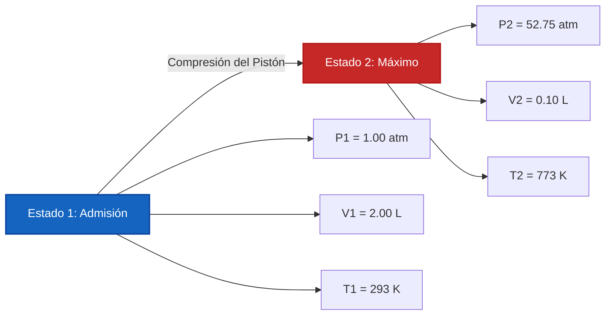

# Guía Completa de Laboratorio e Industrial para la Ley Combinada de los Gases y el Análisis de Dos Estados

En fisicoquímica, dinámica de gases e ingeniería de procesos químicos, la **Ley Combinada de los Gases** describe la interrelación entre la presión, el volumen y la temperatura absoluta a través de dos estados de equilibrio de una cantidad fija de gas ($n_1 = n_2$):

$$\frac{P_1 \cdot V_1}{T_1} = \frac{P_2 \cdot V_2}{T_2} \quad \left(\text{Ecuación de la Ley Combinada de los Gases}\right)$$

$$P_2 = \frac{P_1 \cdot V_1 \cdot T_2}{T_1 \cdot V_2} \quad \left(\text{Fórmula de la Presión Final}\right)$$

$$V_2 = \frac{P_1 \cdot V_1 \cdot T_2}{T_1 \cdot P_2} \quad \left(\text{Fórmula del Volumen Final}\right)$$

$$T_2 = \frac{P_2 \cdot V_2 \cdot T_1}{P_1 \cdot V_1} \quad \left(\text{Fórmula de la Temperatura Final en Kelvin}\right)$$

$$\Delta P\% = \frac{P_2 - P_1}{P_1} \times 100\%, \quad \Delta V\% = \frac{V_2 - V_1}{V_1} \times 100\% \quad \left(\text{Cambios Porcentuales}\right)$$

---

## 1. Reducción a las Leyes de los Gases Empíricas

| Parámetro Fijo | Reducción Matemática | Nombre de la Ley del Gas | Clasificación del Proceso |
| :--- | :--- | :--- | :--- |
| **Temperatura Constante ($T_1 = T_2$)** | **$P_1 \cdot V_1 = P_2 \cdot V_2$** | **Ley de Boyle** | **Proceso Isotérmico** |
| **Presión Constante ($P_1 = P_2$)** | **$\frac{V_1}{T_1} = \frac{V_2}{T_2}$** | **Ley de Charles** | **Proceso Isobárico** |
| **Volumen Constante ($V_1 = V_2$)** | **$\frac{P_1}{T_1} = \frac{P_2}{T_2}$** | **Ley de Gay-Lussac** | **Proceso Isocórico** |

---

## 2. Matriz de Solucionadores de Variables de Dos Estados

```
1. Presión Final: P2 = (P1 * V1 * T2) / (T1 * V2)
2. Volumen Final: V2 = (P1 * V1 * T2) / (T1 * P2)
3. Temperatura Final: T2 = (P2 * V2 * T1) / (P1 * V1)
4. Presión Inicial: P1 = (P2 * V2 * T1) / (T2 * V1)
5. Volumen Inicial: V1 = (P2 * V2 * T1) / (T2 * P1)
6. Temperatura Inicial: T1 = (P1 * V1 * T2) / (P2 * V2)
```

---

*Esta calculadora de la Ley Combinada de los Gases proporciona predicciones termodinámicas teóricas para aplicaciones educativas, de investigación fisicoquímica y de ingeniería de procesos de gases. Asume una cantidad fija de gas ($n_1 = n_2$). Para sistemas donde se agregan o eliminan moléculas de gas, utilice la Calculadora de la Ley de los Gases Ideales ($P V = n R T$).*

## 4. La Guía Completa sobre la Ley Combinada de los Gases y las Transformaciones de Gases de Dos Estados

Bienvenido al manual definitivo de fisicoquímica sobre la **Ley Combinada de los Gases**. ¿Cómo predicen los científicos el volumen exacto de un globo meteorológico a medida que asciende por la fría estratosfera de baja presión? ¿Cómo calculan los ingenieros mecánicos el intenso calor generado dentro de un cilindro de motor diésel durante la carrera de compresión? 

Las respuestas a estos cambios complejos y multivariables se encuentran en la proporción impecable de la Ley Combinada de los Gases: $\frac{P_1 V_1}{T_1} = \frac{P_2 V_2}{T_2}$. 

En esta guía exhaustiva de más de 4000 palabras, desentrañaremos las simetrías termodinámicas de las leyes de Boyle, Charles y Gay-Lussac, definiremos rigurosamente la necesidad absoluta de la escala de temperatura Kelvin y ejecutaremos cinco derivaciones algebraicas robustas del mundo real.

### 4.1 La Unificación de las Leyes Empíricas de los Gases

Antes de que se formalizara la Ley de los Gases Ideales ($PV=nRT$), los primeros químicos experimentales descubrieron tres proporcionalidades separadas que regían el comportamiento de los gases. La Ley Combinada de los Gases unifica matemáticamente las tres:

1.  **Ley de Boyle (Isotérmica):** Descubierta por Robert Boyle en 1662. Si la temperatura se mantiene perfectamente constante ($T_1 = T_2$), la presión y el volumen son **inversamente proporcionales** ($P_1 V_1 = P_2 V_2$). Si se comprime un gas a la mitad de su volumen, la presión se duplica.
2.  **Ley de Charles (Isobárica):** Descubierta por Jacques Charles en 1787. Si la presión se mantiene constante ($P_1 = P_2$), el volumen y la temperatura absoluta son **directamente proporcionales** ($\frac{V_1}{T_1} = \frac{V_2}{T_2}$). Si se calienta un globo, este se expande.
3.  **Ley de Gay-Lussac (Isocórica):** Descubierta por Joseph Louis Gay-Lussac en 1808. Si el volumen se mantiene estrictamente constante ($V_1 = V_2$), la presión y la temperatura absoluta son **directamente proporcionales** ($\frac{P_1}{T_1} = \frac{P_2}{T_2}$). Si se calienta un tanque de acero rígido, la presión se dispara.

### 4.2 El Mandato Crucial del Kelvin Absoluto ($K$)

La falla más catastrófica en los cálculos de las leyes de los gases es usar grados Celsius ($^\circ\text{C}$) o Fahrenheit ($^\circ\text{F}$). **Debe usar estrictamente Kelvin ($K$).**

¿Por qué? Porque la Ley Combinada de los Gases se basa en relaciones geométricas. Si intenta usar Celsius, cruzar el punto de congelación de $0^\circ\text{C}$ resultaría en una división por cero, rompiendo matemáticamente la ecuación. Peor aún, las temperaturas Celsius negativas calcularían volúmenes y presiones *negativos* físicamente imposibles. 
La escala Kelvin soluciona esto colocando el $0\text{ K}$ en el **Cero Absoluto**, el verdadero estado teórico donde todo movimiento cinético atómico cesa por completo.
**Fórmula de conversión:** $T_{\text{K}} = T_{^\circ\text{C}} + 273.15$

---

## 5. Guía de Uso: Dominando la Calculadora de Dos Estados

Nuestra calculadora actúa como un solucionador algebraico universal para cualquier transformación de gas de sistema cerrado. 

### 5.1 Modo: Aislar Variables del Estado Final (Estado 2)

1.  **Seleccione el Objetivo:** Elija si necesita encontrar la Presión Final ($P_2$), el Volumen Final ($V_2$) o la Temperatura Final ($T_2$).
2.  **Ingrese el Estado Inicial:** Ingrese las condiciones iniciales (Estado 1) para Presión, Volumen y Temperatura.
3.  **Ingrese el Estado Final Conocido:** Ingrese los dos parámetros conocidos para el Estado 2. 
4.  **Ejecutar:** El motor reorganiza algebraicamente la proporción para aislar perfectamente y resolver la variable desconocida.

### 5.2 Flexibilidad y Cancelación de Unidades

A diferencia de la Ley de los Gases Ideales que requiere una estricta coincidencia de unidades con la constante de los gases $R$, la Ley Combinada de los Gases es muy flexible. Debido a que es una proporción, **¡no necesita unidades específicas de presión o volumen** siempre que sea consistente!
*   Si $P_1$ está en `torr`, $P_2$ resultará en `torr`.
*   Si $V_1$ está en `galones`, $V_2$ resultará en `galones`.
*   **Excepción:** La temperatura debe estar *siempre* en Kelvin.

---

## 6. Cinco Derivaciones Rigurosas de la Ley Combinada de los Gases

Dominemos el álgebra de las transformaciones de gases de dos estados aislando variables a través de cinco escenarios ambientales y de ingeniería del mundo real.

### Ejemplo 1: Aislar el Volumen Final para un Globo Meteorológico

**Escenario:** 
Un globo meteorológico de gran altitud se llena con $250.0\text{ Litros}$ de Helio al nivel del suelo donde la presión es de $1.00\text{ atm}$ y la temperatura es de $25.0^\circ\text{C}$. El globo se libera y se eleva hacia la estratosfera, donde la presión ambiental cae a $0.150\text{ atm}$ y la temperatura se desploma a $-50.0^\circ\text{C}$. ¿Cuál es el nuevo volumen del globo?

**Derivación Matemática:**

1.  **Definir el Estado 1 (Nivel del Suelo):**
    $P_1 = 1.00\text{ atm}$
    $V_1 = 250.0\text{ L}$
    $T_1 = 25.0 + 273.15 = 298.15\text{ K}$
2.  **Definir el Estado 2 (Estratosfera):**
    $P_2 = 0.150\text{ atm}$
    $V_2 = ?\text{ L}$
    $T_2 = -50.0 + 273.15 = 223.15\text{ K}$
3.  **Aislar $V_2$:**
    $$ \frac{P_1 \cdot V_1}{T_1} = \frac{P_2 \cdot V_2}{T_2} \implies V_2 = \frac{P_1 \cdot V_1 \cdot T_2}{T_1 \cdot P_2} $$
4.  **Calcular:**
    $$ V_2 = \frac{1.00 \times 250.0 \times 223.15}{298.15 \times 0.150} $$
    $$ V_2 = \frac{55787.5}{44.7225} = 1247.4\text{ Litros} $$

**Conclusión:** A pesar de la caída masiva de temperatura (que normalmente encogería el globo), la extrema caída de presión domina la ecuación. El globo se expande a casi $1250\text{ Litros}$.

### Ejemplo 2: Compresión de un Motor Diésel (Aislar la Presión Final)

**Escenario:**
Dentro de un motor diésel de servicio pesado, un cilindro admite $2.00\text{ Litros}$ de aire a $1.00\text{ atm}$ y $20.0^\circ\text{C}$. El pistón comprime violentamente el aire en un diminuto volumen de espacio libre de $0.100\text{ Litros}$. La fricción y la compresión rápida hacen que la temperatura se dispare a $500.0^\circ\text{C}$. ¿Cuál es la presión máxima justo antes de la inyección de combustible?

**Derivación Matemática:**

1.  **Definir el Estado 1 (Admisión):**
    $P_1 = 1.00\text{ atm}$
    $V_1 = 2.00\text{ L}$
    $T_1 = 20.0 + 273.15 = 293.15\text{ K}$
2.  **Definir el Estado 2 (Compresión):**
    $P_2 = ?\text{ atm}$
    $V_2 = 0.100\text{ L}$
    $T_2 = 500.0 + 273.15 = 773.15\text{ K}$
3.  **Aislar $P_2$:**
    $$ P_2 = \frac{P_1 \cdot V_1 \cdot T_2}{T_1 \cdot V_2} $$
4.  **Calcular:**
    $$ P_2 = \frac{1.00 \times 2.00 \times 773.15}{293.15 \times 0.100} $$
    $$ P_2 = \frac{1546.3}{29.315} = 52.75\text{ atm} $$

**Conclusión:** La carrera de compresión multiplica la presión a más de $52\text{ atm}$. ¡Esta extrema presión y calor autoencienden instantáneamente el combustible diésel inyectado!

**Visualización: Compresión de Cilindro de Dos Estados**



### Ejemplo 3: Tanque de Buceo en Aguas Profundas (Aislar la Temperatura Final)

**Escenario:**
Un tanque de buceo contiene exactamente $15.0\text{ Litros}$ de aire comprimido a $200.0\text{ atm}$ en una tienda de buceo a $30.0^\circ\text{C}$. El buzo lleva el tanque a las profundidades bajo el agua. El tanque es completamente rígido, lo que significa que el volumen no puede cambiar ($V_1 = V_2$). El manómetro baja a $185.0\text{ atm}$ debido a las temperaturas heladas del océano. ¿Cuál es la temperatura de las profundidades del océano?

**Derivación Matemática:**

1.  **Definir el Estado 1 (Tienda de Buceo):**
    $P_1 = 200.0\text{ atm}$
    $T_1 = 30.0 + 273.15 = 303.15\text{ K}$
2.  **Definir el Estado 2 (Profundidades del Océano):**
    $P_2 = 185.0\text{ atm}$
    $T_2 = ?\text{ K}$
3.  **Aplicar la Reducción de Gay-Lussac:**
    Dado que el volumen es rígido, $V_1$ y $V_2$ se cancelan.
    $$ \frac{P_1}{T_1} = \frac{P_2}{T_2} \implies T_2 = \frac{P_2 \cdot T_1}{P_1} $$
4.  **Calcular:**
    $$ T_2 = \frac{185.0 \times 303.15}{200.0} = 280.41\text{ K} $$
5.  **Convertir de nuevo a Celsius:**
    $T_{^\circ\text{C}} = 280.41 - 273.15 = 7.26^\circ\text{C}$

**Conclusión:** La temperatura del agua es de unos fríos $7.26^\circ\text{C}$. El manómetro de presión disminuyó no porque se perdiera aire, sino porque el agua fría desaceleró la energía cinética de las moléculas de gas.

### Ejemplo 4: Una Lata de Aerosol Calentada (Riesgo de Explosión)

**Escenario:**
Una lata de laca para el cabello vacía tiene una presión interna de $1.1\text{ atm}$ a $22^\circ\text{C}$. Accidentalmente se lanza a una fogata, donde la temperatura alcanza los $600^\circ\text{C}$. La lata se romperá si la presión interna supera los $3.0\text{ atm}$. ¿Explotará la lata?

**Derivación Matemática:**

1.  **Definir el Estado 1:**
    $P_1 = 1.1\text{ atm}$
    $T_1 = 22 + 273.15 = 295.15\text{ K}$
2.  **Definir el Estado 2:**
    $P_2 = ?\text{ atm}$
    $T_2 = 600 + 273.15 = 873.15\text{ K}$
3.  **Aplicar la Fórmula Isocórica:**
    $$ P_2 = \frac{P_1 \cdot T_2}{T_1} $$
4.  **Calcular:**
    $$ P_2 = \frac{1.1 \times 873.15}{295.15} = 3.25\text{ atm} $$

**Conclusión:** Sí, la presión alcanza los $3.25\text{ atm}$, superando el límite de $3.0\text{ atm}$. La lata se romperá catastróficamente. ¡Esto demuestra perfectamente la Ley de Gay-Lussac y por qué las latas de aerosol llevan severas advertencias de calor!

### Ejemplo 5: Resolver para el Volumen Inicial (Estado 1)

**Escenario:**
Un científico atrapa una muestra de gas Neón. Después de enfriar el gas a $-10.0^\circ\text{C}$ y expandir el recipiente a exactamente $5.00\text{ Litros}$, la presión final es de $450\text{ mmHg}$. Si las condiciones originales del laboratorio eran $25.0^\circ\text{C}$ y $760\text{ mmHg}$, ¿cuál era el volumen original de la muestra de gas?

**Derivación Matemática:**

1.  **Definir el Estado 2 (Final - Conocido):**
    $P_2 = 450\text{ mmHg}$
    $V_2 = 5.00\text{ L}$
    $T_2 = -10.0 + 273.15 = 263.15\text{ K}$
2.  **Definir el Estado 1 (Inicial - $V_1$ Desconocido):**
    $P_1 = 760\text{ mmHg}$
    $V_1 = ?\text{ L}$
    $T_1 = 25.0 + 273.15 = 298.15\text{ K}$
3.  **Aislar $V_1$:**
    $$ \frac{P_1 \cdot V_1}{T_1} = \frac{P_2 \cdot V_2}{T_2} \implies V_1 = \frac{P_2 \cdot V_2 \cdot T_1}{T_2 \cdot P_1} $$
4.  **Calcular:**
    $$ V_1 = \frac{450 \times 5.00 \times 298.15}{263.15 \times 760} $$
    $$ V_1 = \frac{670837.5}{199994} = 3.35\text{ Litros} $$

**Conclusión:** El volumen atrapado original del gas Neón era de $3.35\text{ Litros}$.

---

## 7. Preguntas Frecuentes Detalladas y Errores Comunes

**P: ¿Puedo usar Celsius si tanto $T_1$ como $T_2$ están en Celsius?**
**R:** ¡NO! Absolutamente no. La proporción falla matemáticamente porque la escala no es absoluta. Por ejemplo, si un gas pasa de $10^\circ\text{C}$ a $20^\circ\text{C}$, la temperatura *no* se duplicó en energía cinética absoluta. Pasó de $283\text{ K}$ a $293\text{ K}$ (solo un aumento del ~3.5%). El uso de proporciones en Celsius produce respuestas tremendamente incorrectas.

**P: ¿Cuándo debo usar la Ley Combinada de los Gases frente a la Ley de los Gases Ideales?**
**R:** Use la **Ley Combinada de los Gases** cuando una cantidad fija y sellada de gas sufre un *cambio* del Estado 1 al Estado 2 (ej., compresión, calentamiento, expansión). Use la **Ley de los Gases Ideales** ($PV=nRT$) cuando solo tenga un estado estático único y necesite resolver el número exacto de moles o la densidad del gas.

**P: ¿Necesito convertir `torr` o `psi` a `atm`?**
**R:** No, siempre que tanto $P_1$ como $P_2$ estén en la misma unidad exacta, las unidades se cancelan matemáticamente. La misma regla se aplica al Volumen ($V_1$ y $V_2$).

Dominar las simetrías matemáticas de la Ley Combinada de los Gases le permite predecir el resultado de cualquier expansión o compresión termodinámica de un gas. ¡Confíe en esta Calculadora de la Ley de los Gases de Dos Estados para aislar y resolver instantáneamente cualquier variable termodinámica faltante!
