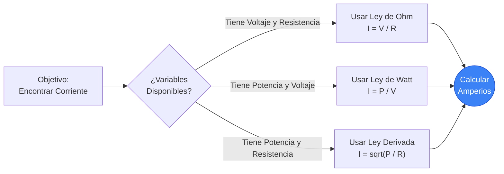
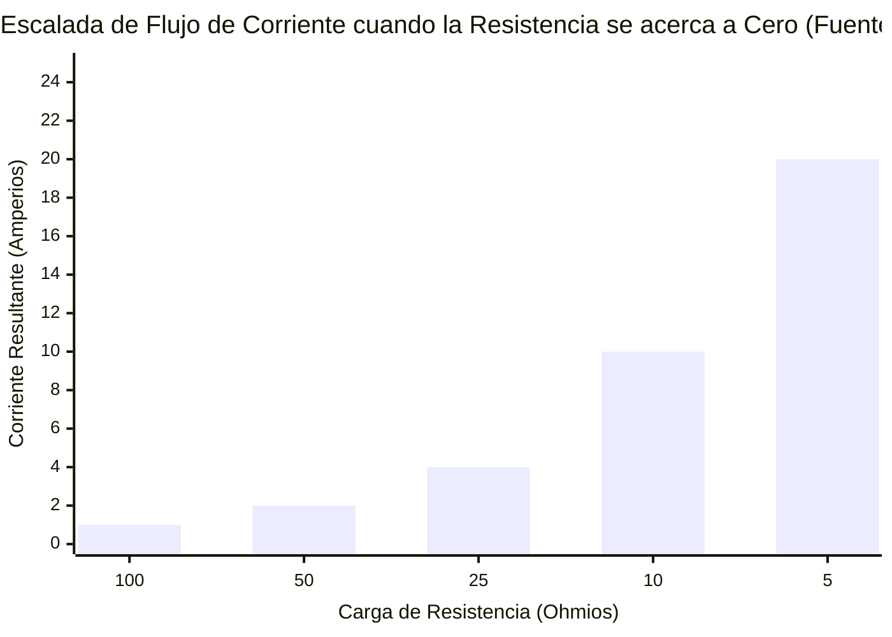
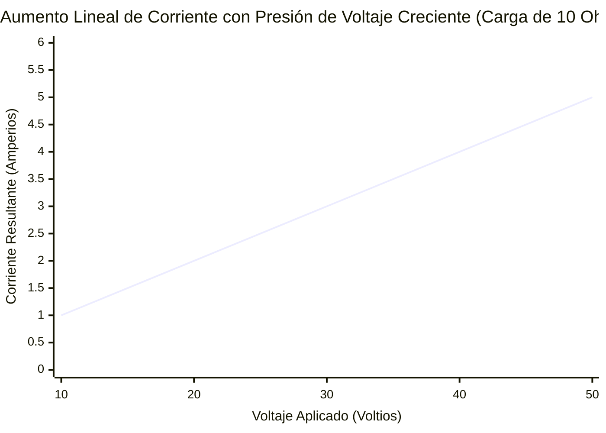
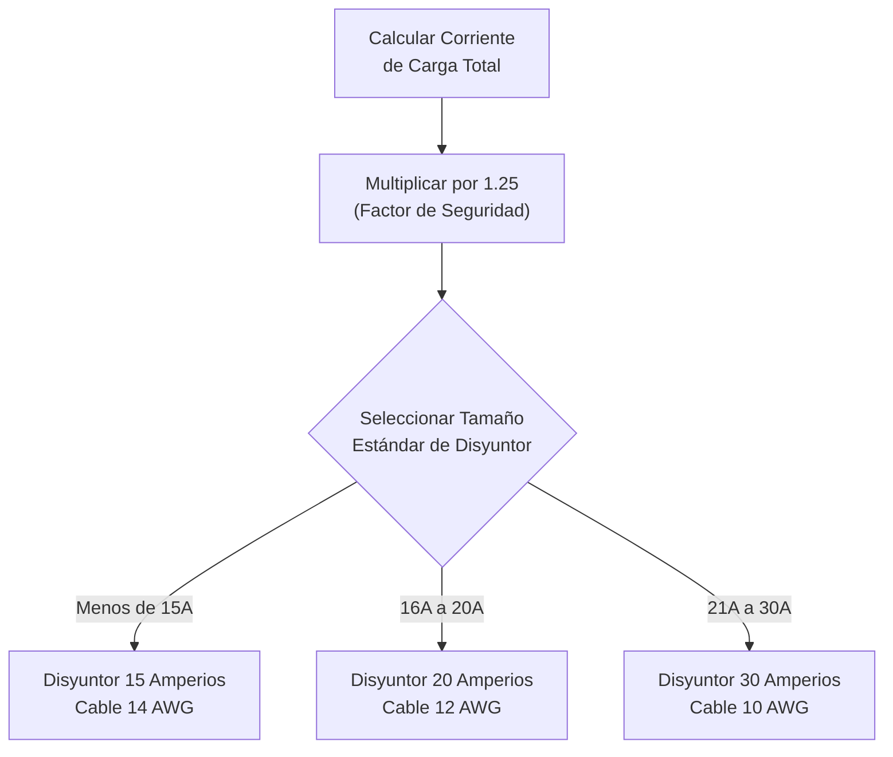

# La Calculadora Definitiva de Corriente: Dominando el Amperaje Eléctrico y el Flujo de Circuito

Bienvenido a la última **Calculadora de Corriente** y guía completa de física. Ya sea que esté dimensionando los calibres de los cables de cobre para un motor industrial de $100\text{A}$, calculando la clasificación precisa de fusibles para un delicado circuito USB, o averiguando exactamente cuántos Amperios consume el refrigerador de su hogar durante el arranque del compresor, este conjunto interactivo proporciona las derivaciones matemáticas exactas que usted necesita.

La Corriente Eléctrica es el elemento vital de todos los componentes electrónicos. Mientras que el Voltaje proporciona la "presión" y la Resistencia proporciona la "fricción", la Corriente representa el flujo físico real de electrones cargados realizando un trabajo termodinámico.

En esta exhaustiva guía de SEO de más de 4,000 palabras, analizaremos agresivamente la física de la Corriente Eléctrica, exploraremos los límites matemáticos de la Ley de Ohm ($I = V/R$) y la Ley de Watt ($I = P/V$), descodificaremos los estrictos estándares del Código Eléctrico Nacional (NEC) para el dimensionamiento de cables, y analizaremos cinco escenarios eléctricos detallados representados visualmente mediante diagramas interactivos y seguros de procesar en Mermaid.js.

---

## 1. ¿Qué es Exactamente la Corriente Eléctrica? (La Definición Física)

La **Corriente Eléctrica**, medida científicamente en **Amperios** (o "Amps"), es la tasa fundamental a la que la carga eléctrica fluye a través de un punto específico en un circuito cerrado. 

Para comprender la Corriente intuitivamente, los ingenieros eléctricos confían universalmente en la **Analogía de la Tubería de Agua**:
- Imagine un río que fluye a través de un cañón. El gran volumen de agua que pasa agresivamente por un punto de control cada segundo es la Corriente.
- **La Corriente es la Tasa de Flujo.** 
- Si tiene un circuito masivo de $100\text{A}$, tiene una inmensa y violenta inundación de electrones surgiendo a través del cable de cobre, generando cantidades masivas de campos magnéticos y calor térmico.
- Si tiene un pequeño circuito de un LED de $20\text{mA}$, tiene un suave y microscópico goteo de electrones.

La unidad oficial del SI para la Corriente es el **Amperio ($\text{A}$)**, nombrado así en honor al matemático francés André-Marie Ampère. En estrictos términos termodinámicos, $1\text{ Amperio}$ se define exactamente como $1\text{ Culombio}$ de carga eléctrica que fluye a través de un punto dado en exactamente $1\text{ Segundo}$. ($1\text{A} = 1\text{C} / 1\text{s}$).

Debido a que un solo electrón tiene una carga dolorosamente pequeña, se requiere que aproximadamente **6.242 trillones de electrones** ($6.242 \times 10^{18}$) pasen por un punto de control cada segundo simplemente para igualar ¡$1\text{ Amperio}$!

---

## 2. Derivando la Corriente con la Ley de Ohm ($I = V / R$)

Georg Simon Ohm demostró que la Corriente está matemáticamente bloqueada en una relación a tres bandas con el Voltaje ($V$) y la Resistencia ($R$). 

$$I = \frac{V}{R}$$

Esto significa que usted puede calcular fácilmente el Amperaje que fluye a través de cualquier componente si conoce la presión del voltaje que lo empuja y la resistencia que lo frena.
- **Si el Voltaje aumenta** pero la Resistencia sigue siendo la misma, el flujo de la Corriente aumentará agresivamente.
- **Si la Resistencia aumenta** pero el Voltaje sigue siendo el mismo, el flujo de la Corriente se sofocará y disminuirá.

Esta exacta relación matemática es la forma en que funcionan las "Resistencias Limitadoras de Corriente". Si conecta un pequeño LED directamente a una batería de $9\text{V}$, la resistencia es casi cero, causando que la corriente se dispare infinitamente y detone al instante el LED. Al colocar una resistencia de $470\ \Omega$ en serie, usted sofoca perfectamente la corriente hasta lograr un suave goteo de $20\text{mA}$.

---

## 3. Derivando la Corriente con la Ley de Watt ($I = P / V$)

Mientras que la Ley de Ohm dicta el flujo de electrones contra la fricción, la Ley de Watt dicta la salida de potencia termodinámica.

$$P = V \cdot I$$

Al aislar algebraicamente la Corriente ($I$), obtenemos dos fórmulas de ingeniería increíblemente poderosas:
1. **Corriente derivada de Potencia y Voltaje:** $I = \frac{P}{V}$
2. **Corriente derivada de Potencia y Resistencia:** $I = \sqrt{\frac{P}{R}}$

Estas fórmulas son absolutamente obligatorias para los electricistas. Si un propietario compra un calentador de espacio eléctrico masivo de $1,500\text{W}$ y lo conecta a un tomacorriente de pared estándar de $120\text{V}$, el electricista debe saber instantáneamente cuántos Amperios consumirá ese calentador para asegurarse de que no salte el disyuntor de la casa. 
Usando la fórmula: $I = 1500 / 120 = 12.5\text{A}$. Debido a que $12.5\text{A}$ está por debajo de forma segura del límite estándar de un disyuntor de $15\text{A}$, el calentador funcionará perfectamente.

---

## 4. Flujo de Electrones vs Corriente Convencional

Uno de los aspectos más confusos de la física eléctrica es la dirección en la que fluye realmente la Corriente. Existen dos modelos en competencia:

### Corriente Convencional (+ a -)
Cuando Benjamin Franklin fue pionero de la electricidad en la década de 1700, adivinó que las partículas con carga "positiva" fluían del terminal Positivo, a través del circuito, y hacia el terminal Negativo. Durante más de un siglo, todas las matemáticas eléctricas, símbolos esquemáticos y reglas de ingeniería (como la Regla de la Mano Derecha para campos magnéticos) se basaron en esta suposición.

### Flujo de Electrones (- a +)
En 1897, J.J. Thomson descubrió el electrón y demostró que Franklin estaba equivocado. Las partículas reales que se mueven físicamente a través de un cable de cobre son electrones con carga negativa. ¡Por lo tanto, en realidad se repelen desde el terminal Negativo y fluyen hacia el terminal Positivo!

A pesar de este enorme error histórico, los ingenieros eléctricos modernos todavía usan la **Corriente Convencional** para todos los cálculos matemáticos y diagramas esquemáticos, porque las matemáticas resultan perfectamente idénticas de cualquier manera.

---

## 5. Protección de Circuitos: Fusibles y Calibres de Cables

La corriente es lo que causa los incendios eléctricos. A medida que la corriente fluye a través del alambre de cobre, la resistencia interna del cobre genera calor ($P = I^2 R$). Si la corriente excede los límites térmicos físicos del cobre, el cable derretirá su aislamiento, encenderá el panel de yeso y quemará el edificio.

Para evitar esto, el Código Eléctrico Nacional (NEC) exige un estricto dimensionamiento del cable (AWG) y Dispositivos de Protección contra Sobrecorriente (Disyuntores/Fusibles):

1. **La Regla del 125%:** Un disyuntor de circuito debe estar dimensionado para manejar el 125% de la corriente de carga continua. Si una máquina consume continuamente $16\text{A}$, no puede usar un disyuntor de $16\text{A}$; debe subir a un disyuntor de $20\text{A}$ ($16 \cdot 1.25 = 20$).
2. **Dimensionamiento del Calibre de Cable (AWG):** El grosor del alambre de cobre debe coincidir con la clasificación del disyuntor. 
   - El disyuntor de $15\text{A}$ requiere cable 14 AWG.
   - El disyuntor de $20\text{A}$ requiere cable 12 AWG.
   - El disyuntor de $30\text{A}$ requiere cable 10 AWG.
3. **Cortocircuitos:** Si un cable bajo tensión toca un cable de tierra, la resistencia cae a cero. Según la Ley de Ohm ($I = V/0$), la corriente intentará saltar al infinito. Este aumento masivo disparará instantáneamente la bobina magnética dentro del disyuntor del circuito, cortando la energía en milisegundos.

---

## 6. Guía Integral de Uso: Maximizando la Calculadora

Nuestra Calculadora de Corriente interactiva funciona como un amperímetro digital avanzado, lo que le permite pivotar fluidamente entre las derivadas de la Ley de Ohm y la Ley de Watt.

### Paso 1: Seleccione sus Variables Conocidas
Use las pestañas de navegación superiores para seleccionar las variables que posee actualmente:
- **Dado el Voltaje y la Resistencia ($I = V / R$):** Perfecto para el diseño de placas de circuitos estándar.
- **Dada la Potencia y el Voltaje ($I = P / V$):** Perfecto para dimensionar disyuntores de circuitos residenciales.
- **Dada la Potencia y la Resistencia ($I = \sqrt{P / R}$):** Ideal para el análisis de elementos de calefacción.

### Paso 2: Utilice los Preajustes del Explorador de Dispositivos
Si está diseñando un circuito alrededor de un dispositivo estándar del mundo real, simplemente haga clic en uno de nuestros 10 preajustes. Seleccionar el **Refrigerador de $120\text{V}$** o el **Arduino de $5\text{V}$** precargará instantáneamente los parámetros exactos de Amperaje y mapeará automáticamente las curvas de salida dinámica para su referencia.

### Paso 3: Supervise el Sistema Inteligente de Clasificación de Fusibles
A medida que ajuste las entradas, observe cómo responde dinámicamente la pantalla del amperímetro LCD digital. Preste mucha atención al **Motor Inteligente de Fusibles**. La calculadora procesará automáticamente la regla de carga continua del 125% y recomendará la clasificación exacta del Fusible estándar y el tamaño AWG del Cable de Cobre requerido para operar su circuito de manera segura.

---

## 7. Cinco Escenarios de Ingeniería Conceptuales con Visualizaciones en 2D

Para dominar completamente las relaciones matemáticas de la Corriente, exploraremos cinco escenarios de física distintos, analizados visualmente utilizando diagramas personalizados en Mermaid.js.

### Ejemplo 1: Las Derivaciones Algebraicas de la Corriente

**El Escenario:**
Un estudiante de ingeniería necesita una visualización rápida de cómo la Corriente puede ser extraída matemáticamente del Voltaje ($V$), la Resistencia ($R$) y la Potencia ($P$) a través de diferentes conjuntos de problemas.

**Visualización en 2D:**
Este diagrama de flujo lógico traza las tres vías matemáticas distintas para calcular el Amperaje dependiendo de las variables conocidas provistas en un examen.

---

### Ejemplo 2: Corriente vs Resistencia (Voltaje Constante)

**El Escenario:**
Usted tiene una fuente de alimentación constante de $100\text{V}$. Está probando diferentes cargas de resistencias. ¿Cómo cambia dramáticamente la corriente a medida que la resistencia cae más y más cerca a cero?

**Las Matemáticas:**
Ya que $V = 100$, $I = 100 / R$.
- A $100\ \Omega$: $I = 100 / 100 = 1\text{A}$
- A $10\ \Omega$: $I = 100 / 10 = 10\text{A}$
- A $5\ \Omega$: $I = 100 / 5 = 20\text{A}$

**Visualización en 2D:**
Este gráfico traza la aterradora curva exponencial de la Corriente. A medida que la resistencia se acerca a cero, la corriente se acerca al infinito, demostrando exactamente por qué los cortocircuitos son tan destructivos.

---

### Ejemplo 3: Corriente Lineal vs Voltaje (Resistencia Constante)

**El Escenario:**
Tiene una bobina de calentamiento perfectamente estática de $10\ \Omega$. Está aumentando lentamente el voltaje en una fuente de alimentación variable de banco. ¿Cómo responde la corriente a la creciente presión del voltaje?

**Las Matemáticas:**
Ya que $R = 10$, $I = V / 10$.
- A $10\text{V}$: $I = 10 / 10 = 1\text{A}$
- A $50\text{V}$: $I = 50 / 10 = 5\text{A}$

**Visualización en 2D:**
A diferencia de la curva exponencial anterior, este gráfico de líneas demuestra la relación lineal y perfectamente predecible de la Ley de Ohm cuando la resistencia está bloqueada.

---

### Ejemplo 4: Lógica de Dimensionamiento del Disyuntor

**El Escenario:**
Un electricista está instalando un circuito dedicado para un rack de servidores industriales de uso continuo. Necesita calcular el tamaño exacto del disyuntor utilizando la regla del 125% del NEC.

**Visualización en 2D:**
Este diagrama de flujo de arriba hacia abajo clasifica estrictamente las matemáticas requeridas para dimensionar correctamente un disyuntor y el calibre del cable posterior.

---

### Ejemplo 5: Prueba de Descarga de Batería de Alto Amperaje

**El Escenario:**
Un ingeniero está probando la capacidad de descarga pico de una batería de polímero de litio de un dron. Necesita medir la corriente de ráfaga sobre un estricto intervalo de 3 minutos antes del apagado térmico.

**Visualización en 2D:**
Este diagrama de Gantt describe el riguroso programa de pruebas de campo para monitorear el flujo de amperaje extremo y las temperaturas de la batería.

```mermaid
gantt
    title Prueba de Descarga de Batería de Dron de Alto Amperaje
    dateFormat  HH:mm:ss
    axisFormat  %H:%M:%S
    
    section Configuración
    Conectar Resistor de Derivación 100A :done, 00:00:00, 30s
    Calibrar Telemetría :active, 00:00:30, 30s
    
    section Descarga
    Iniciar Consumo de Corriente Constante de 50A :crit, 00:01:00, 60s
    Registrar Pico de Temperatura de la Batería :active, 00:01:30, 30s
    
    section Apagado
    Activar Corte Térmico :milestone, 00:02:00, 10s
    Período de Enfriamiento :active, 00:02:10, 50s
```

---

## 8. Conclusión y Desafío de Ingeniería

Dominar la Corriente es la clave definitiva para la seguridad eléctrica y el diseño de circuitos. Cada cable que tiende, cada fusible que instala y cada LED que suelda depende de su capacidad para calcular con precisión el flujo de Amperaje usando $I = V/R$ y $I = P/V$.

Si usted respeta la Corriente y dimensiona sus cables con precisión, sus circuitos funcionarán perfectamente fríos y eficientes. Si subestima la Corriente, sus cables se sobrecalentarán violentamente y se derretirán.

Para garantizar que ha dominado estos conceptos, inicie nuestro Simulador interactivo e intente resolver estos desafíos finales:
1. **El Microondas:** Un microondas de cocina consume $1,200\text{W}$ de potencia desde un tomacorriente estándar de $120\text{V}$. Calcule la Corriente exacta ($I$) que consume. ¿Se disparará un disyuntor de $15\text{A}$ si una tostadora de $5\text{A}$ está funcionando en el mismo circuito simultáneamente?
2. **El Cortocircuito:** Una batería de automóvil de $12\text{V}$ sufre un cortocircuito accidental con una llave inglesa. La única resistencia que queda es la resistencia interna de $0.02\ \Omega$ de la batería. Calcule la masiva Corriente de Cortocircuito ($I = V/R$) que vaporizará instantáneamente la llave inglesa.
3. **La Matriz de LED:** Desea hacer funcionar una matriz masiva de $50$ LED indicadores en paralelo. Cada LED requiere exactamente $20\text{mA}$ ($0.02\text{A}$) para funcionar. Calcule el consumo de corriente total de la matriz.

Confíe en esta calculadora para verificar sus matemáticas, respetar los límites de cableado de NEC y recuerde siempre: la Corriente es el flujo agresivo que le da vida a sus circuitos.
