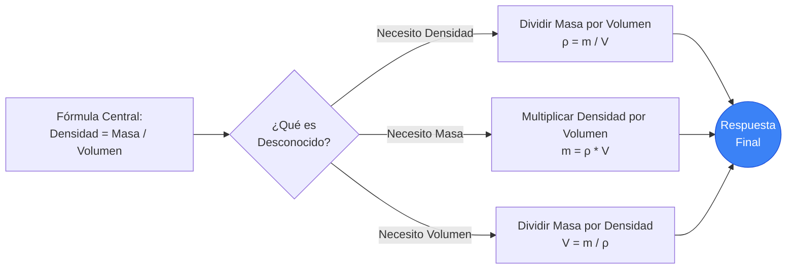
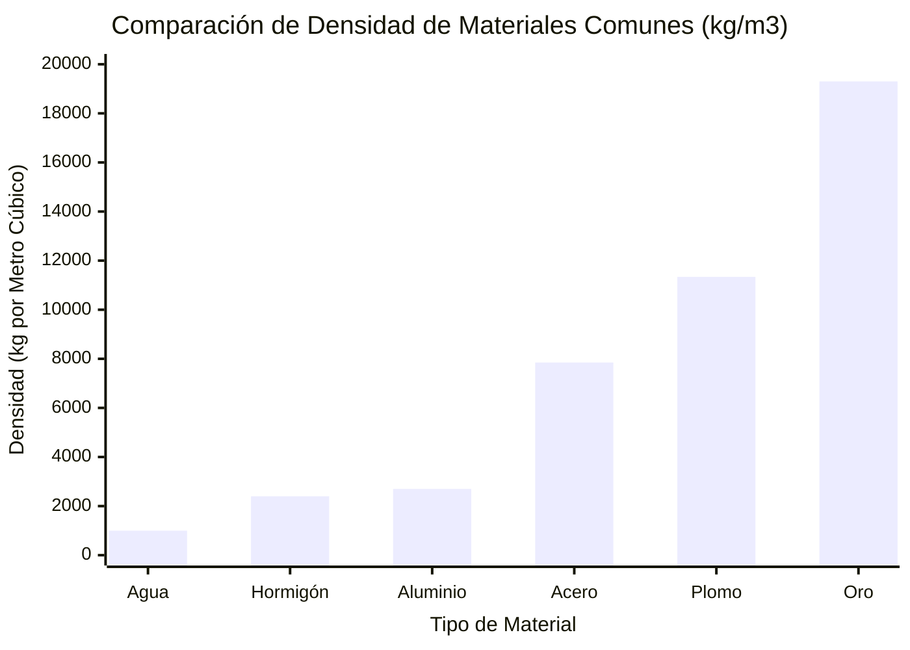
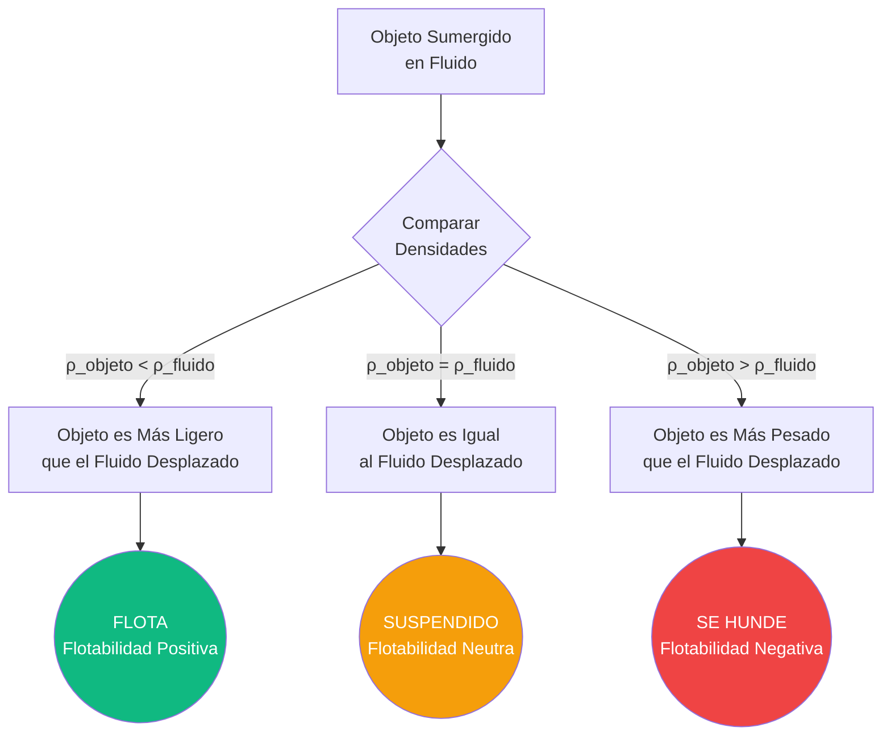
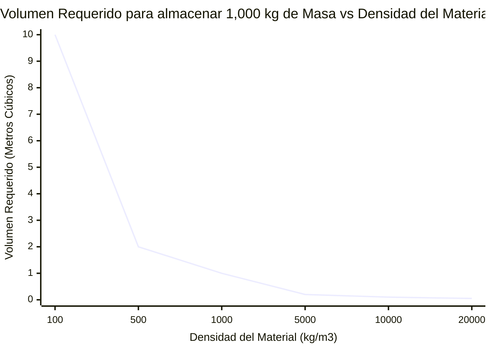

# La Calculadora de Densidad Definitiva: Dominando la Masa, el Volumen y el Principio de Arquímedes

Bienvenido a la **Calculadora de Densidad** definitiva y a la guía integral de física para ingeniería. Ya seas un estudiante de ciencia de materiales intentando verificar la pureza de un anillo de oro, un ingeniero estructural calculando la carga muerta de un pilar de hormigón armado, o un arquitecto naval diseñando el desplazamiento del casco de un crucero de $100,000\text{ toneladas}$, esta herramienta proporciona las conversiones exactas de física y los marcos conceptuales que necesitas.

La densidad ($\rho$) es una de las propiedades intensivas más fundamentales del universo. Describe la relación precisa entre cuánta materia (Masa) está empaquetada en una cantidad específica de espacio tridimensional (Volumen). Al dominar la densidad, desbloqueas las claves para entender la flotabilidad, la aerodinámica, la presión hidrostática y la integridad estructural central del mundo físico.

En esta exhaustiva guía SEO de más de 4,000 palabras, desglosaremos a fondo la fórmula de la densidad ($\rho = m/V$). Exploraremos los matices de la Gravedad Específica (GE), desentrañaremos el misterio de 2,000 años de antigüedad del Principio de Arquímedes, y analizaremos cinco escenarios conceptuales detallados de ingeniería representados visualmente mediante diagramas interactivos de Mermaid.js.

---

## 1. Definiendo la Densidad: La Anatomía de la Materia

En la física clásica, la **Densidad** (representada por la letra griega $\rho$, *rho*) se define como la masa de una sustancia por unidad de volumen. Es una propiedad *intensiva*, lo que significa que no cambia independientemente de la cantidad de sustancia que tengas. Una sola gota de agua pura tiene exactamente la misma densidad que toda una piscina olímpica llena de agua pura.

$$ \rho = \frac{m}{V} $$

### La Analogía de la Almohada vs. el Bloque de Plomo
Para comprender intuitivamente la densidad, imagina que sostienes una almohada de cama estándar en tu mano izquierda y un bloque sólido de plomo de exactamente las mismas dimensiones físicas (Volumen) en tu mano derecha.
- La almohada está llena en su mayor parte de espacio vacío y aire atrapado. Posee muy poca masa dentro de ese volumen. Tiene una **densidad extremadamente baja**.
- El bloque de plomo sólido tiene sus pesados núcleos atómicos densamente empaquetados en una apretada red cristalina. Contiene una inmensa cantidad de masa dentro del mismo volumen exacto. Tiene una **densidad increíblemente alta** (y probablemente te romperá la muñeca).

### Unidades Estándar del SI para la Densidad
Debido a que la Masa se mide en Kilogramos ($\text{kg}$) y el Volumen se mide en Metros Cúbicos ($\text{m}^3$), la unidad estándar del SI para la densidad es **Kilogramos por metro cúbico** ($\text{kg/m}^3$).
Sin embargo, en la química de laboratorio se utilizan con frecuencia unidades más pequeñas:
- **Gramos por centímetro cúbico** ($\text{g/cm}^3$)
- **Gramos por mililitro** ($\text{g/mL}$)

*Nota Crucial: $1\text{ cm}^3$ es físicamente idéntico a $1\text{ mL}$. Por lo tanto, $1\text{ g/cm}^3 = 1\text{ g/mL}$.*

Para convertir entre unidades de laboratorio y unidades de ingeniería del SI, simplemente multiplicas por $1,000$:
$$ 1\text{ g/cm}^3 = 1,000\text{ kg/m}^3 $$

---

## 2. Gravedad Específica: La Proporción Universal

La **Gravedad Específica (GE)** (también conocida como *Densidad Relativa*) es un atajo matemático brillante utilizado por los ingenieros para evitar lidiar con unidades complicadas. Es simplemente una proporción adimensional que compara la densidad del material elegido con la densidad de referencia del agua líquida pura a $4^\circ\text{C}$ ($1,000\text{ kg/m}^3$).

$$ \text{GE} = \frac{\rho_{\text{sustancia}}}{\rho_{\text{agua}}} $$

Debido a que es una proporción de densidades, las unidades se cancelan, dejando un número puro.
- Si un bloque de Aluminio sólido tiene una densidad de $2,700\text{ kg/m}^3$, su Gravedad Específica es precisamente **$2.70$**.
- Si un bloque de madera de Roble seca tiene una densidad de $700\text{ kg/m}^3$, su Gravedad Específica es precisamente **$0.70$**.

Esto nos dice inmediatamente cómo se comportará un material en el agua sin necesidad de hacer cálculos avanzados. Si la $\text{GE} < 1$, flota. Si la $\text{GE} > 1$, se hunde.

---

## 3. El Principio de Arquímedes: La Física de la Flotabilidad

La leyenda cuenta que en 250 a.C., el rey Hierón II de Siracusa encomendó al matemático griego Arquímedes determinar si un orfebre había robado oro puro y lo había reemplazado con plata más barata al forjar una corona real. Arquímedes no podía fundir la corona. Al entrar en una bañera, notó que el nivel del agua subía en proporción exacta al volumen sumergido de su cuerpo. Se dio cuenta de que podía medir el volumen de la corona sumergiéndola en agua, dividir su masa por ese volumen y encontrar su densidad para probar su pureza. Supuestamente corrió desnudo por las calles gritando "¡Eureka!" (¡Lo he encontrado!).

Esto condujo a la formulación del **Principio de Arquímedes**:
*"Todo objeto, total o parcialmente sumergido en un fluido, experimenta una fuerza de empuje hacia arriba igual al peso del fluido desplazado por el objeto."*

$$ F_{\text{Flotabilidad}} = \rho_{\text{fluido}} \cdot V_{\text{sumergido}} \cdot g $$

### Cómo Flotan los Barcos
Un bloque sólido de acero ($\text{GE} = 7.85$) se hundirá violentamente hasta el fondo del océano. ¿Cómo, entonces, puede flotar un enorme portaaviones de acero?
Al moldear el acero en una forma ancha y cóncava (un casco), el barco encierra un enorme volumen de aire ($\text{GE} = 0.001$). La densidad *promedio* de toda la estructura del barco (acero pesado + un enorme volumen de aire liviano) desciende significativamente por debajo de la densidad del agua de mar ($1,025\text{ kg/m}^3$).
El barco desplaza una cantidad de agua de mar igual a su propio inmenso peso mucho antes de que el agua sobrepase la cubierta superior, lo que le permite alcanzar un equilibrio de flotabilidad.

---

## 4. Guía de Uso Integral: Maximizando la Calculadora

Nuestra Calculadora de Densidad interactiva opera como un robusto banco de trabajo de termodinámica y ciencia de materiales.

### Paso 1: Selecciona Tu Objetivo de Cálculo
Usa la navegación superior para seleccionar tu variable desconocida:
- **Densidad ($\rho$):** Conoces la Masa y el Volumen. (Ideal para identificar materiales desconocidos).
- **Masa ($m$):** Conoces la Densidad y el Volumen. (Ideal para calcular cargas estructurales).
- **Volumen ($V$):** Conoces la Densidad y la Masa. (Ideal para dimensionar tanques de almacenamiento).

### Paso 2: Utiliza la Base de Datos de Materiales
Omite la entrada manual de datos seleccionando de nuestros más de 17 preajustes de materiales integrados. ¿Necesitas saber la masa exacta de $5\text{ m}^3$ de mercurio líquido? Selecciona 'Mercurio' del menú desplegable y la calculadora poblará instantáneamente $\rho = 13,540\text{ kg/m}^3$.

### Paso 3: Explora el Simulador de Flotabilidad de Flotación vs. Hundimiento
Una vez que hayas calculado tu densidad, verifica el panel del Simulador de Flotabilidad. Compara tu densidad calculada contra cinco fluidos comunes (Agua Dulce, Agua Salada, Aceite de Cocina, Etanol y Mercurio) para decirte instantáneamente si tu objeto flotará en la superficie, logrará una suspensión neutra o se hundirá hasta el fondo.

---

## 5. Cinco Escenarios Conceptuales de Ingeniería con Visualizaciones 2D

Para dominar completamente las relaciones entre Masa, Volumen, Densidad y Flotabilidad, exploraremos cinco escenarios de física distintos, desglosados visualmente usando diagramas personalizados de Mermaid.js.

### Ejemplo 1: La Lógica de la Fórmula de la Densidad (Resolviendo Variables)

**El Escenario:**
Un estudiante de química de secundaria necesita visualizar rápidamente las permutaciones algebraicas de la fórmula de la densidad ($\rho = m/V$) para resolver tres preguntas diferentes de un examen.

**Visualización 2D:**
Este diagrama de flujo lógico ilustra el clásico "Triángulo de Densidad" usado para aislar variables.



---

### Ejemplo 2: El Espectro de Densidad de los Elementos

**El Escenario:**
Un ingeniero está diseñando un pequeño contrapeso para un dron aeroespacial. Tiene exactamente $1,000\text{ cm}^3$ ($1\text{ Litro}$) de espacio disponible. Necesita visualizar cómo diferentes materiales alterarán radicalmente la masa del contrapeso.

**Visualización 2D:**
Este gráfico de barras traza las asombrosas diferencias en la densidad entre materiales comunes. ¡Nota cómo el oro es casi 20 veces más denso que el agua, y más de 7 veces más denso que el aluminio!



---

### Ejemplo 3: El Árbol de Decisión de Flotabilidad de Arquímedes

**El Escenario:**
Un biólogo marino está diseñando un sumergible de aguas profundas. Necesita calcular exactamente cómo se comportará el sumergible al colocarse en agua de mar ($1,025\text{ kg/m}^3$) según su densidad estructural promedio.

**Visualización 2D:**
Este diagrama de flujo visualiza los resultados lógicos estrictos del Principio de Arquímedes basados en la Gravedad Específica (densidad relativa).



---

### Ejemplo 4: La Curva Inversa de Volumen para Masa Fija

**El Escenario:**
Tienes exactamente $1,000\text{ kg}$ ($1\text{ Tonelada Métrica}$) de material. ¿Cuánto espacio físico (Volumen) ocupará? Debido a que Volumen = Masa / Densidad, a medida que aumenta la densidad del material, el volumen requerido colapsa exponencialmente hacia cero.

**Las Matemáticas:**
- $1,000\text{ kg}$ de Aire ($\rho = 1.225$) requieren $816\text{ m}^3$ de espacio.
- $1,000\text{ kg}$ de Agua ($\rho = 1,000$) requieren $1.0\text{ m}^3$ de espacio.
- $1,000\text{ kg}$ de Oro ($\rho = 19,300$) requieren tan solo $0.051\text{ m}^3$ de espacio.

**Visualización 2D:**
Este gráfico traza la caída hiperbólica del volumen requerido a medida que la densidad del material aumenta para una masa fija de $1,000\text{ kg}$.



---

### Ejemplo 5: El Proceso de Prueba de Oro Metalúrgico (Gantt)

**El Escenario:**
Un joyero recibe un supuesto ladrillo de "oro puro de 24 quilates". Debe usar el método de desplazamiento de agua de Arquímedes para calcular su densidad precisa y verificar su pureza sin tener que cortarlo.

**Visualización 2D:**
Este diagrama de Gantt describe el proceso cronológico de laboratorio para calcular la densidad de un sólido irregular.

```mermaid
gantt
    title Protocolo de Prueba de Densidad en Laboratorio (Desplazamiento de Agua)
    dateFormat m
    axisFormat %M
    section Medidas en Seco
    Calibrar Báscula a Cero :crit, active, 0, 2m
    Pesar Objeto en el Aire (Registrar Masa) :active, 2m, 5m
    section Medidas en Húmedo
    Llenar Cilindro Graduado con Agua :5m, 8m
    Registrar Volumen de Agua Inicial (V1) :8m, 10m
    Sumergir Objeto y Registrar Volumen Final (V2) :crit, 10m, 13m
    section Cálculos
    Calcular Volumen Desplazado (V2 - V1) :13m, 15m
    Calcular Densidad (Masa / Volumen) :milestone, 15m, 16m
```

---

## 6. Preguntas Frecuentes (FAQ) en Profundidad

**P: ¿Por qué el hielo flota en el agua si ambos son solo H₂O?**
**R:** Esta es una anomalía de la física rara y hermosa. Cuando el agua se congela en hielo, los enlaces de hidrógeno fuerzan a las moléculas a entrar en una red cristalina hexagonal rígida y abierta. Esta red ocupa aproximadamente un $9\%$ más de espacio físico (Volumen) que el movimiento caótico de las moléculas de agua líquida. Debido a que la masa sigue siendo la misma pero el volumen aumenta, la densidad disminuye. El hielo ($\rho = 917\text{ kg/m}^3$) es menos denso que el agua líquida ($\rho = 1,000\text{ kg/m}^3$), ¡así que flota! Si esto no ocurriera, los océanos se congelarían desde el fondo hacia arriba, matando toda la vida marina.

**P: ¿Cuál es la diferencia entre Masa y Peso?**
**R:** La masa es la cantidad absoluta de materia en un objeto (medida en $\text{kg}$), y nunca cambia a menos que cortes físicamente el objeto por la mitad. El peso es la fuerza local de la gravedad que atrae a esa masa (medido en Newtons, $W = m \cdot g$). Un astronauta tiene exactamente la misma masa y densidad en la Tierra que en la Luna, pero su *peso* es seis veces menor en la Luna.

**P: ¿Cómo afecta la temperatura a la densidad?**
**R:** Con muy pocas excepciones (como el agua líquida por debajo de $4^\circ\text{C}$), calentar una sustancia añade energía cinética térmica. Los átomos vibran violentamente y se separan unos de otros, causando que el material experimente *expansión térmica*. Como el volumen ($V$) aumenta mientras la masa ($m$) se mantiene constante, la densidad ($\rho$) disminuye. Es precisamente por eso que los globos aerostáticos suben: calentar el aire disminuye su densidad por debajo del aire ambiental circundante, ¡generando una flotabilidad ascendente!

**P: ¿Cuál es la sustancia más densa del universo?**
**R:** En la Tierra, el elemento natural más denso es el osmio ($\rho = 22,590\text{ kg/m}^3$). ¡Una jarra de leche estándar de $1$ galón llena de osmio pesaría casi $190\text{ libras}$! Sin embargo, en astrofísica, una estrella de neutrones posee densidades que se aproximan a $10^{17}\text{ kg/m}^3$. Una sola cucharadita de material de estrella de neutrones pesaría más de $5.5\text{ Billones de Toneladas Métricas}$.

**P: ¿Cómo se sumergen y emergen los submarinos?**
**R:** Los submarinos utilizan cámaras huecas masivas llamadas Tanques de Lastre. Cuando navegan en la superficie, los tanques están llenos de aire ($\text{GE} < 1$). Para sumergirse, abren las válvulas, inundando los tanques con agua de mar pesada. Esto aumenta la densidad promedio total del submarino hasta que excede la del agua de mar, causando que se hunda. Para salir a la superficie, disparan aire altamente comprimido a los tanques, expulsando el agua y restaurando la flotabilidad positiva.

---

## 7. Conclusión y Desafío de Ingeniería

La densidad es la variable maestra que conecta la macroingeniería de barcos y rascacielos con la microingeniería de las estructuras de redes atómicas. Al entender cómo manipular la masa y el volumen, los ingenieros pueden crear hormigón que flota, o metales que se hunden como piedras.

Para dominar verdaderamente estos conceptos de dinámica de fluidos y termodinámica, utiliza nuestra Calculadora de Densidad para resolver los siguientes desafíos de física conceptual:
1. **El Globo de Plomo:** Tienes una esfera hueca hecha de plomo sólido ($\rho = 11,340\text{ kg/m}^3$). Tiene un radio exterior de $1\text{ metro}$, pero la capa de plomo es increíblemente delgada, encerrando un vacío masivo en su interior. Si la masa total de la capa de plomo es de solo $500\text{ kg}$, ¿este globo de plomo flotará o se hundirá al colocarse en el océano? (Pista: calcula el volumen total de la esfera de $1\text{m}$, y encuentra la densidad *promedio*).
2. **El Fraude del Platino:** Un prospector te vende un pequeño cubo metálico que mide exactamente $5\text{ cm}$ en todos sus lados ($V = 125\text{ cm}^3$). Afirma que es platino sólido puro ($\rho = 21.45\text{ g/cm}^3$). Pesas el cubo, y la balanza marca $1,100\text{ gramos}$. ¿Acabas de ser estafado?
3. **El Derrame de Petróleo:** Un buque de carga filtra $10,000\text{ kg}$ de petróleo crudo ($\rho = 850\text{ kg/m}^3$) en un lago de agua dulce ($\rho = 1,000\text{ kg/m}^3$). ¿Cuántos metros cúbicos de mancha de petróleo se formarán en la superficie y por qué no se hunde?

Experimenta con el simulador, analiza la intrincada flotabilidad de diferentes combinaciones de materiales y confía en esta calculadora para revelar las distribuciones de masa ocultas que gobiernan nuestra realidad física.
