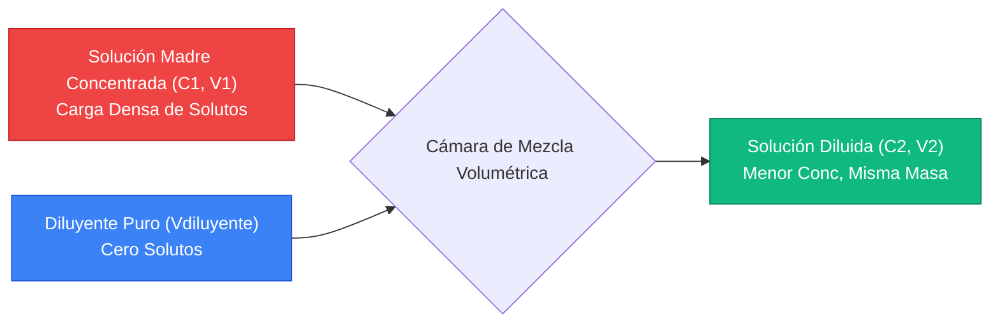
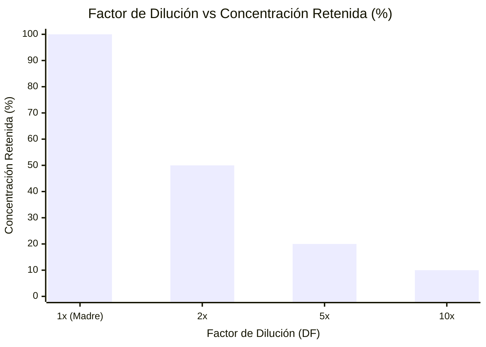
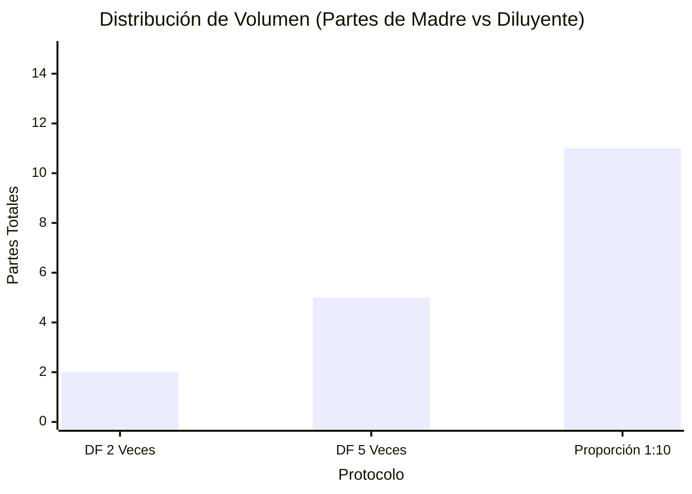
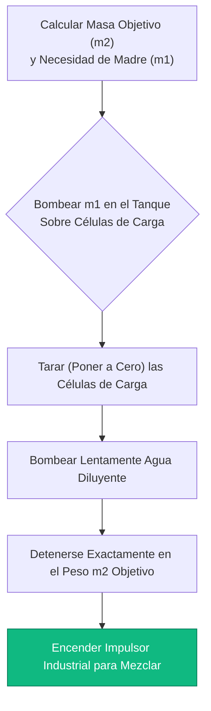
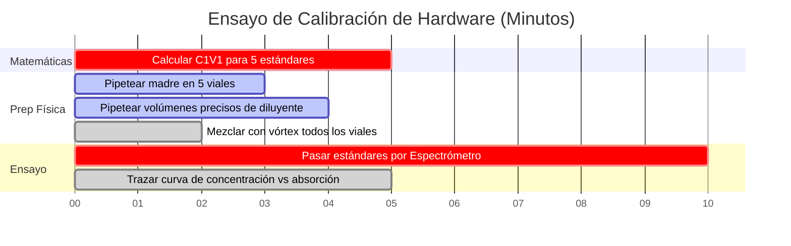

# La Calculadora Universal de Dilución: Proporciones, Factores y $C_1 V_1 = C_2 V_2$

Bienvenido a la **Calculadora Universal de Dilución** definitiva y al manual completo de soluciones de laboratorio. Ya sea que usted sea un microbiólogo clínico que prepara un ensayo seriado de 1:10.000 para cultivos celulares, un químico industrial que amplía un tanque de $500\text{ kg}$ de hipoclorito de sodio al $5\% \text{ w/w}$, o un científico ambiental que diluye estándares de metales pesados para espectroscopía de absorción atómica, dominar las matemáticas universales de la dilución es una necesidad absoluta.

Aunque "dilución" suena como un proceso simple —agregar agua a una sustancia química fuerte para hacerla más débil— el rigor matemático requerido para mantener las proporciones exactas de solutos a través de diversas unidades (molaridad, porcentajes de masa, proporciones volumétricas) es notoriamente propenso al error humano. Un solo punto decimal mal colocado en un cálculo de factor de dilución puede arruinar un lote industrial multimillonario o alterar fatalmente una dosis farmacéutica.

En esta exhaustiva clase magistral de SEO de más de 4.000 palabras, deconstruiremos por completo la física universal de la dilución, mapearemos matemáticamente las diferencias entre las Proporciones de Dilución y los Factores de Dilución, decodificaremos la termodinámica de las diluciones de porcentaje en masa ($\% \text{ w/w}$) y expondremos los errores de preparación de laboratorio más letales. Para garantizar una comprensión absoluta, hemos incluido cinco diagramas interactivos de Mermaid.js meticulosamente detallados y seguros para el analizador.

---

## 1. La Ecuación Universal de Dilución: $C_1 V_1 = C_2 V_2$

La base de todas las matemáticas de dilución volumétrica se basa en la inquebrantable ley de la **Conservación del Soluto**. Cuando usted diluye una solución madre concentrada, *solo* está agregando disolvente puro (el diluyente). Está agregando exactamente cero partículas de soluto. Por lo tanto, la cantidad física absoluta de la sustancia química disuelta permanece matemáticamente bloqueada.

**La Regla de Oro:**
$$(\text{Cantidad Total de Soluto Antes}) = (\text{Cantidad Total de Soluto Después})$$

Dado que la Concentración ($C$) se define como Cantidad por Volumen ($\text{Cantidad}/V$), podemos reorganizar la definición para demostrar que $\text{Cantidad} = C \times V$. 
Si la cantidad total nunca cambia durante la dilución, entonces:
$$C_{\text{inicial}} \times V_{\text{inicial}} = C_{\text{final}} \times V_{\text{final}}$$

Esto produce la ecuación universal de dilución:
$$C_1 V_1 = C_2 V_2$$

A diferencia de la ecuación específica de la Molaridad ($M_1 V_1 = M_2 V_2$), esta ecuación universal es independiente de las unidades. Siempre que sus unidades de concentración coincidan en ambos lados (por ejemplo, ambas en $\text{mg/L}$, ambas en $\% \text{ v/v}$) y sus unidades de volumen coincidan (por ejemplo, ambas en $\text{mL}$), la ecuación funciona sin problemas.

---

## 2. Factor de Dilución (DF) vs Proporción de Dilución (1:X)

Los errores más catastróficos en los laboratorios clínicos provienen de confundir los **Factores de Dilución** con las **Proporciones de Dilución**. Parecen matemáticamente similares, pero dictan preparaciones volumétricas completamente diferentes.

### ¿Qué es un Factor de Dilución (DF)?
Un factor de dilución representa la disminución múltiple de la concentración (veces que se reduce). Es la proporción del Volumen Final ($V_2$) dividido por el Volumen Inicial de la Solución Madre ($V_1$).

$$\text{DF} = \frac{V_2}{V_1} = \frac{C_1}{C_2}$$

* **Ejemplo:** Una dilución de $5\text{ veces}$ ($\text{DF} = 5$). Toma $1\text{ mL}$ de solución madre y agrega $4\text{ mL}$ de diluyente. El volumen final es de $5\text{ mL}$. La concentración se reduce exactamente a $1/5\text{ta parte}$ (se retiene el $20\%$).

### ¿Qué es una Proporción de Dilución ($1:X$)?
Una proporción de dilución define explícitamente la proporción del Volumen de Solución Madre frente al Volumen de Diluyente. 

* **Ejemplo:** Una Proporción de Dilución de $1:4$. Se mezcla $1\text{ parte de solución madre}$ con $4\text{ partes de diluyente}$. 
* Espere, ¿cuál es el volumen final? $1 + 4 = 5\text{ partes en total}$. 
* Por lo tanto, una Proporción de Dilución de $1:4$ es matemáticamente idéntica a un Factor de Dilución de $5\text{ veces}$. 

**La Trampa Letal:** Si un médico ordena una "dilución de $1:10$", ¿quiere decir un Factor de Dilución de $10$ (1 parte de solución madre + 9 partes de diluyente) o una Proporción de Dilución de $1:10$ (1 parte de solución madre + 10 partes de diluyente = 11 partes en total)? Aclare siempre el procedimiento operativo estándar (SOP) de su laboratorio específico, ya que las convenciones varían enormemente entre la química y la biología.

---

## 3. La Complejidad de las Diluciones de Porcentaje en Masa ($\% \text{ w/w}$)

Si bien $C_1 V_1 = C_2 V_2$ es universalmente perfecto para las concentraciones volumétricas (como la Molaridad o $\text{g/L}$), falla catastróficamente cuando se trata de porcentajes de masa ($\% \text{ w/w}$).

**¿Por qué falla?**
Porque $C_1 V_1 = C_2 V_2$ asume que el volumen es perfectamente aditivo. En realidad, al mezclar $50\text{ mL}$ de agua y $50\text{ mL}$ de etanol se obtienen unos $96\text{ mL}$ de solución debido al empaquetamiento molecular (la Paradoja de la Contracción Volumétrica).

Cuando los químicos industriales diluyen Peróxido de Hidrógeno al $30\% \text{ w/w}$ hasta el $3\% \text{ w/w}$, no pueden utilizar el volumen. Deben utilizar una masa física ($m$) estricta en una báscula industrial calibrada.

**La Ecuación de Dilución de Masa:**
$$C_1 m_1 = C_2 m_2$$

Si tiene $100\text{ kg}$ de peróxido al $30\% \text{ w/w}$ ($C_1 = 30$, $m_1 = 100$), y desea un $3\% \text{ w/w}$ ($C_2 = 3$):
$$30 \times 100 = 3 \times m_2 \implies m_2 = 1000\text{ kg}$$
Debe agregar $900\text{ kg}$ de agua para alcanzar la masa final de $1000\text{ kg}$. El volumen se ignora por completo.

---

## 4. Diluciones Seriadas de Múltiples Pasos

Cuando un científico necesita una concentración que es exponencialmente menor que la solución madre (por ejemplo, diluir un cultivo bacteriano de $1.000.000\text{ UFC/mL}$ hasta $10\text{ UFC/mL}$), un solo paso de dilución es imposible. El volumen de solución madre requerido sería menor que una gota microscópica.

La solución es una **Dilución Seriada**: una secuencia de diluciones idénticas paso a paso que desencadenan una rápida disminución exponencial de la concentración.

**Cálculo del Factor de Dilución Acumulativo:**
$$\text{DF}_{\text{acumulativo}} = \text{DF}_1 \times \text{DF}_2 \times \text{DF}_3 \dots$$

Si realiza tres diluciones consecutivas de $10\text{ veces}$ ($\text{DF} = 10$):
$$\text{DF}_{\text{acumulativo}} = 10 \times 10 \times 10 = 1.000$$
El tubo final está exactamente $1.000\text{ veces}$ más diluido que la solución madre original.

---

## 5. Cinco Escenarios de Ingeniería Conceptual con Visualizaciones en 2D

Para dominar por completo los algoritmos mecánicos que rigen la reducción de la concentración universal, el análisis de proporciones y las preparaciones industriales basadas en la masa, exploraremos cinco escenarios distintos de química analítica desglosados visualmente utilizando diagramas personalizados de Mermaid.js.

### Ejemplo 1: El Mecanismo Universal $C_1V_1 = C_2V_2$

**El Escenario:**
Un estudiante de química de primer año está mapeando el flujo físico de una dilución volumétrica estándar, observando cómo se fusionan la solución madre concentrada y el diluyente.

**Visualización 2D:**
Este diagrama de flujo mapea visualmente la colisión de la solución madre densa y el diluyente con cero solutos dentro de un matraz volumétrico para generar una solución de trabajo estable y homogénea.

---

### Ejemplo 2: Factor de Dilución vs Concentración Retenida

**El Escenario:**
Un técnico de laboratorio visualiza cuán rápido colapsa la concentración química retenida a medida que aumenta el Factor de Dilución.

**Visualización 2D:**
Este gráfico prueba gráficamente la relación inversa entre el Factor de Dilución y el porcentaje de concentración retenida. Observe cómo un $\text{DF de 10x}$ deja solo el $10\%$ de la fuerza química original.

---

### Ejemplo 3: La Paradoja de Proporción vs Factor

**El Escenario:**
Un biólogo clínico compara las distribuciones de volumen físico de tres protocolos de preparación comunes para evitar la trampa letal de Proporción vs Factor.

**Visualización 2D:**
Este gráfico comparativo mapea visualmente exactamente cuántas partes de solución madre frente a diluyente se requieren para diluciones geométricas específicas.

---

### Ejemplo 4: Protocolo Industrial de Dilución de Masa $\% \text{w/w}$

**El Escenario:**
Un ingeniero de una planta química mapea el rígido procedimiento operativo estándar (SOP) requerido para diluir legalmente un tanque de $500\text{ kg}$ de lejía industrial concentrada sin depender de mediciones volumétricas inestables.

**Visualización 2D:**
Este diagrama de flujo de arriba hacia abajo actúa como una receta industrial estricta, imponiendo la secuencia absoluta de acciones necesarias para realizar una dilución basada en masa ($m_1 w_1 = m_2 w_2$) en básculas de piso calibradas.

---

### Ejemplo 5: Cronograma de Ensayo de Pruebas Ambientales

**El Escenario:**
Un científico ambiental debe preparar un gradiente perfectamente espaciado de estándares de metales pesados diluidos para calibrar un espectrómetro de absorción atómica para pruebas de agua de río.

**Visualización 2D:**
Este diagrama de Gantt visualiza la secuencia cronológica de un ensayo de calibración de múltiples pasos, desde las matemáticas y la dilución física hasta la calibración definitiva del hardware.

---

## 6. Conclusión y Desafío de Estequiometría

Dominar los algoritmos universales de dilución es un requisito de entrada no negociable para ingresar a cualquier laboratorio industrial, biológico o químico. Comprender la rigidez matemática de la conservación del soluto, la diferencia semántica letal entre los Factores de Dilución y las Proporciones de Dilución, y la necesidad de protocolos basados en la masa para soluciones al $\% \text{ w/w}$ garantizará que sus preparaciones funcionen exactamente como se pretende.

Si no logra dominar estos algoritmos, sus ensayos microbiológicos estarán fundamentalmente corrompidos, sus lotes industriales no pasarán el control de calidad y sus datos experimentales serán destruidos por completo por el error humano.

Para garantizar que ha dominado estos conceptos críticos, inicie nuestro Simulador interactivo e intente resolver estos desafíos analíticos finales:
1. **El Desafío de la Proporción:** Un protocolo exige una Proporción de Dilución de $1:15$. Necesita un volumen final de exactamente $160\text{ mL}$. ¿Cuántos mL de solución madre y cuántos mL de diluyente debe mezclar?
2. **El Desafío de Masa Industrial:** Tiene $50\text{ kg}$ de una solución salina al $20\% \text{ w/w}$. Desea diluirla hasta el $2\% \text{ w/w}$. ¿Exactamente cuántos kilogramos de agua pura debe agregar al tanque?
3. **El Desafío Seriado:** Ejecuta una dilución de 10 veces. Luego toma ese tubo y ejecuta una dilución de 5 veces. ¿Cuál es el Factor de Dilución acumulativo total y qué porcentaje de la concentración inicial original se retiene?

Confíe en esta calculadora universal para auditar sus protocolos de laboratorio, convertir instantáneamente proporciones de dilución complejas y dominar de forma permanente la termodinámica de la preparación de soluciones.
