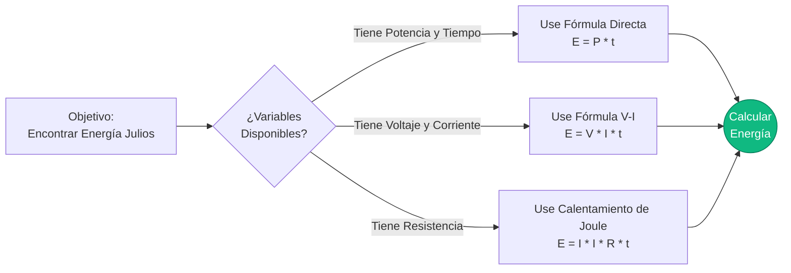
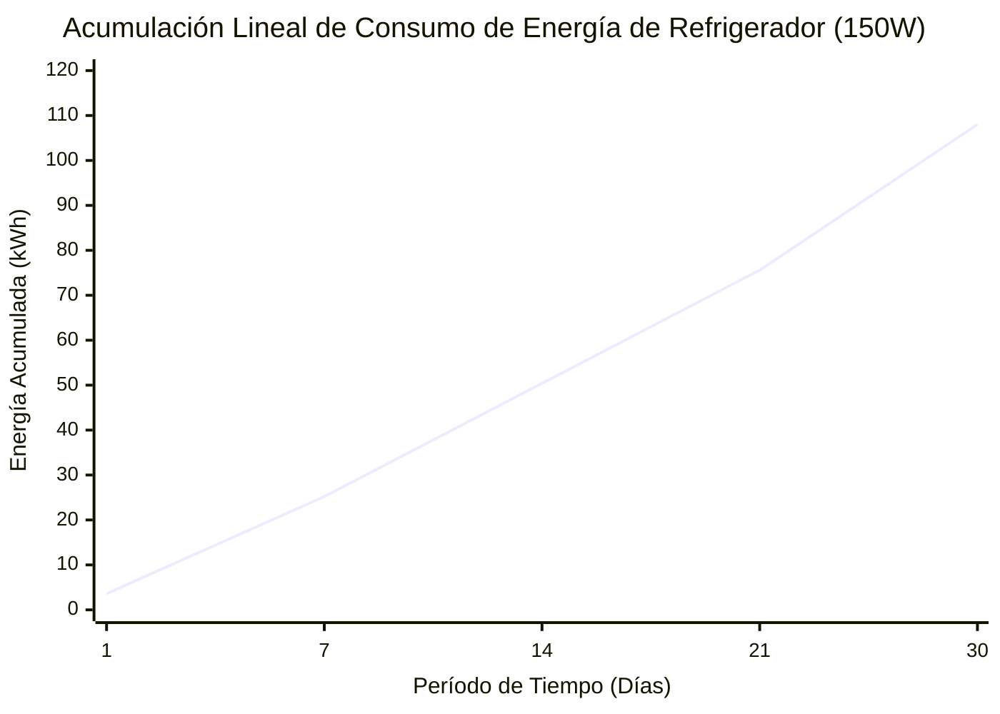
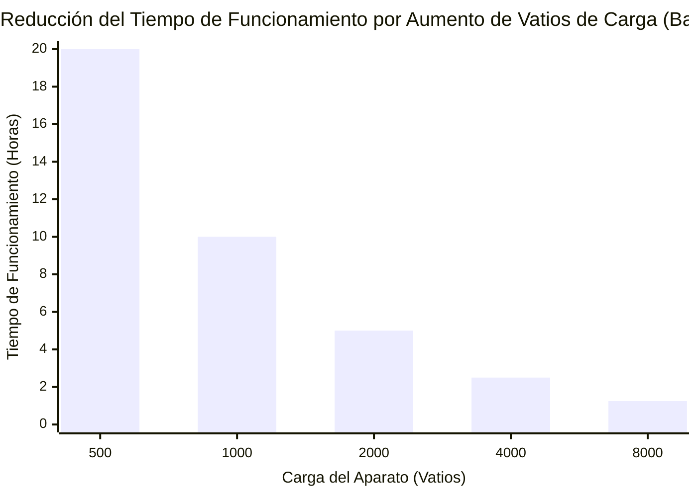
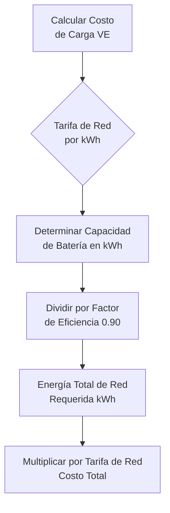
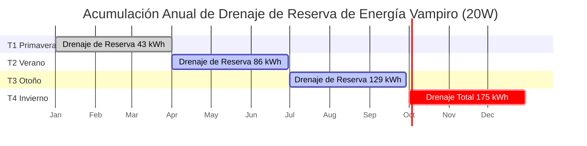

# La Calculadora de Energía Eléctrica Definitiva: kWh, Tiempos de Funcionamiento de Baterías y Carga de VE Desmitificados

Bienvenido a la **Calculadora de Energía Eléctrica** definitiva y la guía de física integral. Ya sea que esté realizando una auditoría rigurosa de energía de electrodomésticos residenciales para reducir drásticamente sus facturas mensuales de servicios públicos, dimensionando un banco de baterías solares fuera de la red para sobrevivir a una enorme tormenta de invierno, o calculando matemáticamente el costo exacto por milla de cargar su nuevo Vehículo Eléctrico, esta suite interactiva proporciona las derivaciones termodinámicas exactas que necesita.

La Energía Eléctrica es la comodidad fundamental del mundo moderno. Mientras que la Potencia (Vatios) es la tasa instantánea de músculo eléctrico, la Energía (Julios o Kilovatios-Hora) es el volumen acumulado de ese músculo haciendo trabajo con el tiempo. Es la métrica por la que le cobran las empresas de servicios públicos, la métrica que dicta qué tan lejos puede conducir su Tesla y la métrica que determina si la batería de su teléfono muere al mediodía.

En esta exhaustiva guía SEO de más de 4,000 palabras, deconstruiremos agresivamente la física de la Energía Eléctrica, exploraremos los límites matemáticos de $E = P \cdot t$, decodificaremos la pesadilla de las Tarifas de Servicios Públicos Escalonadas, analizaremos la Profundidad de Descarga (DoD) de las Baterías de Ciclo Profundo, y desglosaremos cinco escenarios eléctricos detallados representados visualmente mediante diagramas interactivos y seguros para el analizador de Mermaid.js.

---

## 1. ¿Qué es Exactamente la Energía Eléctrica? (La Definición Física)

La **Energía Eléctrica**, medida científicamente en **Julios ($J$)**, representa el trabajo total acumulado realizado o la energía transferida por un circuito eléctrico durante un período de tiempo específico.

Si la Potencia es la velocidad de su automóvil, la Energía es la distancia total que viajó.
- **Potencia** = Tasa Instantánea (Vatios)
- **Energía** = Volumen Acumulado (Julios o kWh)

En términos termodinámicos estrictos, $1\text{ Julio}$ se define como el trabajo realizado al transferir $1\text{ Vatio}$ de potencia durante exactamente $1\text{ segundo}$. 
Debido a que un Julio es una cantidad de energía microscópicamente pequeña, la industria eléctrica se basa universalmente en el **Kilovatio-Hora (kWh)**.

$$1\text{ Kilovatio-Hora (kWh)} = 3,600,000\text{ Julios}$$

Un kilovatio-hora es exactamente lo que parece: ejecutar $1,000\text{ Vatios}$ de equipo durante exactamente $1\text{ hora}$.

---

## 2. Derivación de Energía a partir de Potencia y Tiempo ($E = P \cdot t$)

La ecuación fundamental de todos los cálculos de energía eléctrica es asombrosamente simple:

$$E = P \cdot t$$

Donde:
- $E$ es Energía en Vatios-hora (Wh)
- $P$ es Potencia en Vatios (W)
- $t$ es Tiempo en Horas (h)

Para convertir al estándar de la empresa de servicios públicos de kWh, simplemente divida por 1,000:
$$\text{kWh} = \frac{\text{Vatios} \cdot \text{Horas}}{1000}$$

Al sustituir matemáticamente la Ley de Ohm ($P = V \cdot I$) en la ecuación de energía, desbloqueamos potentes derivaciones de ingeniería:
1. **Energía derivada del Voltaje y la Corriente:** $E = V \cdot I \cdot t$
2. **Energía derivada de la Resistencia (Calentamiento de Joule):** $E = I^2 \cdot R \cdot t$

---

## 3. La Amenaza Financiera de la Energía de Reserva Vampiro

Al auditar la energía del hogar, el culpable más peligroso rara vez es el microondas. Es la **Energía de Reserva** (también conocida como Consumo Vampiro).

Los aparatos electrónicos modernos (televisores, barras de sonido, relojes de microondas, cargadores de portátiles) no se apagan realmente. Entran en un modo de espera, consumiendo continuamente de $2\text{W}$ a $15\text{W}$ de potencia las $24\text{ horas}$ del día, los $365\text{ días}$ del año.

**Las Matemáticas de la Energía Vampiro:**
Supongamos que su centro de entretenimiento (TV, decodificador de cable, sistema de sonido) consume $20\text{W}$ en modo de espera.
- **Energía Diaria:** $20\text{W} \cdot 24\text{ horas} = 480\text{ Wh/día} = 0.48\text{ kWh/día}$
- **Energía Anual:** $0.48\text{ kWh/día} \cdot 365 = 175.2\text{ kWh/año}$
- **Costo Anual (a $\$0.20/\text{kWh}$):** $175.2 \cdot 0.20 = \$35.04$

Está pagando $\$35.00$ al año solo para mantener una luz roja LED brillando en su televisor. En toda una casa, la Energía Vampiro rutinariamente cuesta a las familias más de $\$150.00$ anualmente.

---

## 4. Cálculo de la Energía Utilizable de la Batería y Tiempo de Funcionamiento

Al dimensionar un banco de baterías de respaldo, no puede simplemente mirar la etiqueta. Una batería de "12V 100Ah" en realidad no le da $100\text{Ah}$ de energía utilizable.

### Profundidad de Descarga (DoD)
Diferentes químicas de baterías se destruirán físicamente a sí mismas si las agota al $0\%$.
- **Plomo-Ácido (AGM/Gel):** Solo puede drenarse de forma segura al $50\%$ de DoD.
- **Fosfato de Hierro y Litio (LiFePO4):** Puede drenarse de forma segura al $95\%$ de DoD.

### La Fórmula de Energía Utilizable
$$E_{\text{utilizable}} = V \cdot \text{Capacidad}_{\text{Ah}} \cdot \text{DoD} \cdot \eta_{\text{Inversor}}$$

**Ejemplo:**
Usted compra una batería de Plomo-Ácido de $12\text{V}$, $100\text{Ah}$ y la conecta a un inversor de CA con una eficiencia del $90\%$.
- $E_{\text{utilizable}} = 12 \cdot 100 \cdot 0.50 \cdot 0.90 = 540\text{ Vatios-hora (Wh)}$

Si intenta alimentar un cargador de portátil de $100\text{W}$ desde esta batería masiva, el tiempo de funcionamiento es simplemente:
$$\text{Tiempo de Funcionamiento} = \frac{540\text{Wh}}{100\text{W}} = 5.4\text{ horas}$$

---

## 5. Energía de Carga de Vehículos Eléctricos (VE) y Costo

Los Vehículos Eléctricos se miden en capacidad de batería en kWh, lo que hace que las matemáticas sean increíblemente sencillas.

**El Escenario:**
Usted conduce un Tesla Model Y con una batería de $75\text{kWh}$. Llega a su garaje con la batería completamente muerta ($0\%$). Lo conecta al cargador de su hogar. Su tarifa de electricidad es de $\$0.15/\text{kWh}$.

Debido a que la carga de CA a CC nunca es $100\%$ eficiente (el calor se pierde en los cables de carga y el rectificador interno del automóvil), debemos asumir una eficiencia de carga típica del $90\%$.

- **Energía Requerida de la Red:** $75\text{kWh} / 0.90 = 83.3\text{ kWh}$
- **Costo para cargar completamente:** $83.3\text{ kWh} \cdot \$0.15 = \$12.49$

Si el Tesla rinde $300\text{ millas}$ con una carga completa, su **Costo por Milla** es:
$\$12.49 / 300 = \$0.041\text{ por milla (4.1 centavos)}.$

---

## 6. Tarifas Escalonadas y Facturación por Tiempo de Uso (TOU)

Las empresas de servicios públicos no siempre cobran una tarifa plana. Manipulan su factura utilizando dos estrategias agresivas para forzar la conservación de energía:

1. **Tarifas Escalonadas:** Se le cobran $\$0.12/\text{kWh}$ por sus primeros $500\text{ kWh}$. Una vez que cruza los $501\text{ kWh}$, cada kWh restante cuesta la tarifa punitiva de $\$0.25/\text{kWh}$. Esto castiga agresivamente a los hogares de alta energía.
2. **Tiempo de Uso (TOU):** Se le cobran $\$0.10/\text{kWh}$ por la noche, pero durante las horas de "Demanda Máxima" de 4 PM a 9 PM, la tarifa se dispara a $\$0.40/\text{kWh}$.

---

## 7. Cinco Escenarios de Ingeniería Conceptuales con Visualizaciones 2D

Para dominar completamente las relaciones matemáticas de la Energía Eléctrica, exploraremos cinco escenarios de física distintos, desglosados visualmente utilizando diagramas de Mermaid.js personalizados.

### Ejemplo 1: Las Derivaciones de la Ecuación de Energía

**El Escenario:**
Un estudiante de ingeniería necesita una visualización rápida de cómo la Energía se puede extraer matemáticamente a partir de la Potencia, el Voltaje, la Corriente y la Resistencia.

**Visualización 2D:**
Este diagrama de flujo lógico traza las tres rutas matemáticas distintas para calcular Vatios-hora en función de las variables conocidas proporcionadas en un examen.

---

### Ejemplo 2: Acumulación de Energía del Refrigerador (Lineal)

**El Escenario:**
Un propietario está auditando su refrigerador de $150\text{W}$. Quiere ver cómo la energía se acumula desde totales Diarios, a Semanales, a Mensuales.

**Las Matemáticas:**
A $150\text{W}$ funcionando 24 horas al día, el refrigerador consume exactamente $3.6\text{ kWh}$ cada día.

**Visualización 2D:**
Este gráfico traza la línea perfectamente recta de consumo de energía que se acumula con el tiempo.

---

### Ejemplo 3: Tiempo de Funcionamiento de Batería vs Demanda de Carga (Curva Inversa)

**El Escenario:**
Una cabaña fuera de la red utiliza un banco de baterías de litio masivo de $10kWh$. El propietario quiere saber cuánto durará la batería en función de cuántos electrodomésticos encienda.

**Las Matemáticas:**
Dado que $\text{Tiempo} = \text{Energía} / \text{Potencia}$, el tiempo de funcionamiento es inversamente proporcional al consumo en vatios de la carga.

**Visualización 2D:**
Este gráfico de barras demuestra la curva inversa agresiva. Duplicar el consumo de energía reduce drásticamente el tiempo de funcionamiento a la mitad.

---

### Ejemplo 4: Lógica del Costo de Carga de VE

**El Escenario:**
El nuevo propietario de un VE necesita entender exactamente cómo se derivan matemáticamente sus costos de carga a partir de las tarifas de la red y la capacidad de la batería.

**Visualización 2D:**
Este diagrama de flujo descendente categoriza estrictamente las matemáticas requeridas para calcular el costo exacto de una carga completa de VE, teniendo en cuenta las pérdidas de eficiencia de carga.

---

### Ejemplo 5: Acumulación de Costo Anual de Energía Vampiro

**El Escenario:**
Un auditor de energía está rastreando el aterrador drenaje financiero de un centro de entretenimiento de $20\text{W}$ dejado en modo de espera durante todo un año.

**Visualización 2D:**
Este diagrama de Gantt describe la sombría realidad de la Energía Vampiro, registrando el consumo eléctrico constante e interminable cada estación.

---

## 8. Conclusión y Reto de Ingeniería

Dominar la Energía Eléctrica ($E = P \cdot t$) es la clave absoluta para la independencia energética y la eficiencia financiera. Comprender la estricta diferencia entre los Vatios (potencia instantánea) y los Vatios-Hora (energía acumulada) le permite dimensionar adecuadamente los paneles solares fuera de la red, auditar con precisión las facturas de servicios públicos del hogar y demostrar matemáticamente el ROI (retorno de inversión) de actualizar a iluminación LED.

Si respeta la física de la Energía, puede reducir drásticamente sus facturas de servicios públicos y garantizar que sus bancos de baterías sobrevivan a la noche. Si lo ignora, la Energía Vampiro y los electrodomésticos pesados drenarán silenciosamente su billetera.

Para garantizar que ha dominado estos conceptos, inicie nuestro Simulador interactivo e intente resolver estos últimos desafíos:
1. **La Actualización de Iluminación:** Usted reemplaza cinco focos incandescentes de $60\text{W}$ por cinco LEDs de $10\text{W}$. Funcionan durante $8\text{ horas}$ al día. Calcule la Energía Ahorrada exacta en kWh por mes.
2. **La Cabaña Fuera de la Red:** Necesita hacer funcionar un refrigerador de $200\text{W}$ durante $24\text{ horas}$ seguidas. Si tiene un sistema de batería de Plomo-Ácido de $12\text{V}$ ($50\%$ de DoD), calcule la capacidad mínima absoluta en Amperios-Hora (Ah) requerida para sobrevivir a la noche.
3. **El Supercargador:** Un Supercargador Tesla bombea $250\text{kW}$ de potencia en un automóvil durante exactamente $15\text{ minutos}$. Calcule la Energía total entregada en kWh.

Confíe en esta calculadora para verificar sus cálculos, auditar los electrodomésticos de su hogar y recordar siempre: la Energía es la verdad acumulada de la potencia eléctrica a lo largo del tiempo.
