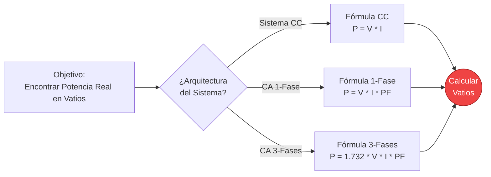
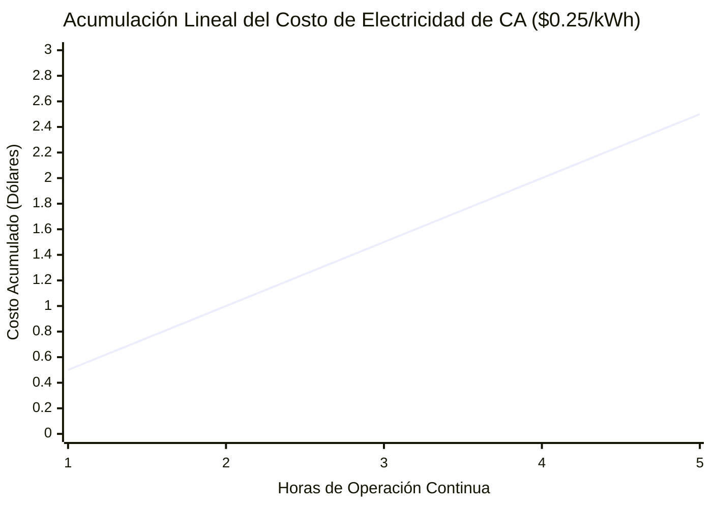
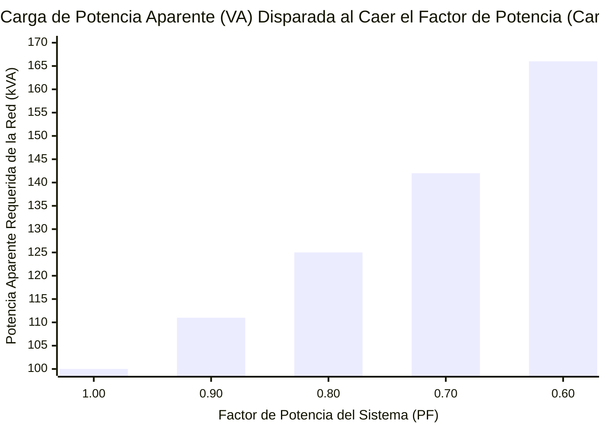
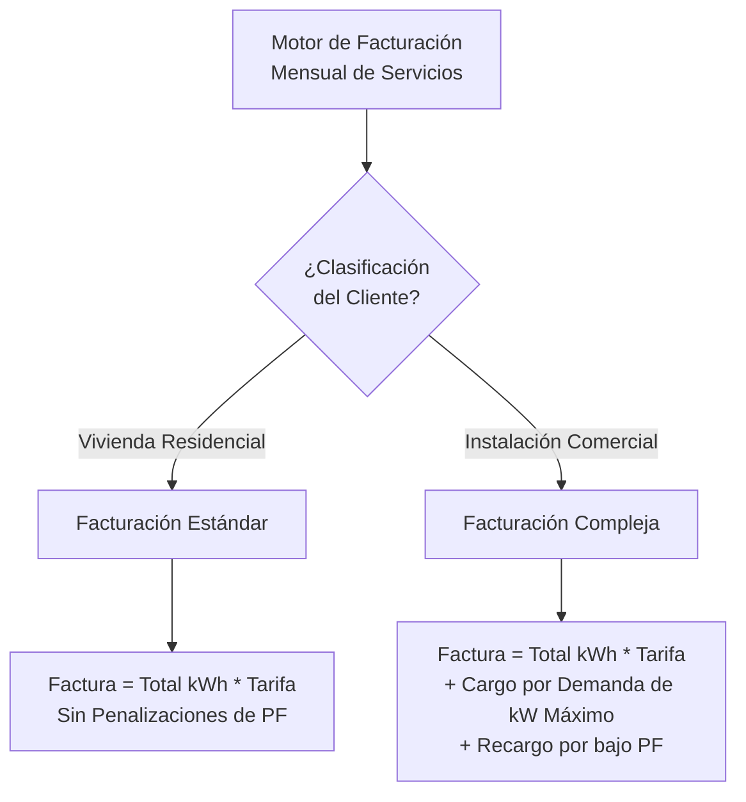

# La Calculadora de Potencia Eléctrica Definitiva: Potencia Real, Aparente y Reactiva Desmitificadas

Bienvenido a la **Calculadora de Potencia Eléctrica** definitiva y a la guía completa de física. Ya sea que esté dimensionando un enorme generador industrial trifásico, calculando la aterradora factura mensual de electricidad de una unidad de aire acondicionado vieja, o tratando de comprender por qué su instalación comercial está siendo penalizada por un Factor de Potencia deficiente, esta suite interactiva proporciona la claridad matemática exacta que necesita.

La Potencia Eléctrica es la velocidad absoluta a la que la energía eléctrica realiza un trabajo. Mientras que el Voltaje ($V$) es la presión y la Corriente ($I$) es el flujo, la Potencia ($P$, medida en Vatios) es el músculo resultante real. Es el calor que irradia su calentador, el par motor que hace girar su motor Tesla y la luz cegadora emitida por un LED.

En esta exhaustiva guía SEO de más de 4.000 palabras, analizaremos agresivamente la física del Vataje de CC, la compleja trigonometría de los Triángulos de Potencia de CA, la dura realidad de la Potencia Reactiva (VAR) y las matemáticas financieras de la facturación en kilovatios-hora (kWh), con cinco diagramas de Mermaid.js diseñados meticulosamente y seguros para el analizador.

---

## 1. ¿Qué es Exactamente la Potencia Eléctrica? (La Definición de la Física)

La **Potencia Eléctrica**, científicamente medida en **Vatios ($W$)**, es la tasa fundamental a la que la energía eléctrica se transfiere, consume o disipa por un circuito por segundo. 

En estrictos términos termodinámicos, $1\text{ Vatio}$ se define como la transferencia de exactamente $1\text{ Julio}$ de energía por segundo. 
- Si deja una bombilla de $100\text{W}$ encendida durante exactamente 1 segundo, consume $100\text{ Julios}$ de energía.
- Si la deja encendida durante una hora ($3,600\text{ segundos}$), consume $360,000\text{ Julios}$. (¡Es por eso que facturamos en kWh, porque los Julios se vuelven astronómicamente grandes muy rápidamente!)

Para encontrar la potencia bruta de cualquier componente eléctrico básico, simplemente multiplica la presión eléctrica a través de él por el volumen de electrones que fluyen a través de él:
$$P = V \cdot I$$

---

## 2. Derivando la Potencia utilizando la Ley de Ohm

La Ley de Ohm ($V = I \cdot R$) nos permite sustituir matemáticamente variables en la ecuación de potencia, dándonos dos atajos de ingeniería increíblemente útiles:

1. **Potencia derivada de la Corriente y la Resistencia:** $P = I^2 \cdot R$
   - Esta fórmula representa el **Efecto Joule** (o pérdidas de cobre $I^2R$). Esta es la fórmula que las empresas de servicios públicos utilizan para calcular cuánta potencia se desperdicia como calor bruto a lo largo de cientos de millas de líneas de transmisión.
2. **Potencia derivada del Voltaje y la Resistencia:** $P = \frac{V^2}{R}$
   - Esta fórmula es utilizada por los diseñadores de electrodomésticos. Como el voltaje de la pared siempre está fijo a $120\text{V}$, un ingeniero puede calcular exactamente cuántos Ohmios de bobina de calentamiento cortar para producir una tostadora de $1,500\text{W}$.

---

## 3. La Pesadilla de la Potencia de CA: El Triángulo de Potencia

En los circuitos de CC (Corriente Continua), la potencia es matemática simple. $P = V \cdot I$. Fin de la historia.

En los circuitos de CA (Corriente Alterna), el voltaje y la corriente oscilan constantemente en una onda sinusoidal. Si el circuito contiene Inductores (motores, transformadores) o Condensadores, la onda sinusoidal de corriente se retrasa o se adelanta físicamente, desincronizándose con la onda sinusoidal de voltaje. Esto crea un fenómeno de ingeniería aterrador conocido como **Desfase** (o Cambio de Fase), dando origen al Triángulo de Potencia de CA.

### Potencia Real ($P$, medida en Vatios)
Esta es la potencia física real que hace el trabajo útil. Es el calor en la tostadora y el torque en el motor. Se calcula tomando la potencia bruta y multiplicándola por el Factor de Potencia (el coseno del ángulo de desfase).
- **Fórmula:** $P = V \cdot I \cdot \cos\phi$

### Potencia Aparente ($S$, medida en Voltio-Amperios o VA)
Esta es la potencia bruta total que la empresa de servicios públicos debe generar y empujar por los cables para alimentar sus instalaciones. Ignora el desfase por completo.
- **Fórmula:** $S = V \cdot I$

### Potencia Reactiva ($Q$, medida en VARs)
Esta es la potencia "fantasma". Es la energía que oscila hacia adelante y hacia atrás entre los campos magnéticos de sus motores y la red eléctrica. Hace absolutamente CERO trabajo útil, pero obstruye completamente las líneas eléctricas, causando calor extremo e ineficiencia.
- **Fórmula:** $Q = V \cdot I \cdot \sin\phi$

---

## 4. Factor de Potencia ($\text{PF}$) y Penalizaciones de las Empresas de Servicios Públicos

El **Factor de Potencia ($\text{PF}$)** es la relación estricta entre la Potencia Real (trabajo útil) y la Potencia Aparente (carga total de la red).

$$\text{PF} = \frac{\text{Potencia Real (W)}}{\text{Potencia Aparente (VA)}}$$

- **$\text{PF} = 1.0$ (Perfecto):** Una carga resistiva pura como un calentador de espacio. El $100\%$ de la energía extraída de la red se convierte en calor.
- **$\text{PF} = 0.70$ (Terrible):** Una planta industrial masiva con motores. Solo el $70\%$ de la energía está haciendo trabajo físico. ¡El otro $30\%$ es Potencia Reactiva inútil que chapotea violentamente de un lado a otro sobre las líneas de servicios públicos.

Dado que la Potencia Reactiva obstruye la red e incendia transformadores, las empresas de servicios públicos monitorean activamente los Factores de Potencia comerciales. Si su fábrica cae por debajo de $\text{PF} 0.85$, la compañía eléctrica le impondrá **Recargos por Penalización de Factor de Potencia** devastadores en su factura mensual.

Para solucionar esto, las fábricas instalan bastidores masivos de **Condensadores de Corrección del Factor de Potencia** para inyectar potencia reactiva localmente, manteniéndola fuera de la red de servicios públicos.

---

## 5. Potencia de CA Trifásica ($1.732$)

Para cargas industriales masivas, la potencia monofásica es insuficiente. El mundo funciona con potencia de CA Trifásica, donde se transmiten simultáneamente tres ondas sinusoidales separadas, desfasadas por $120^\circ$. 

Debido a que las tres fases se superponen, proporcionan una potencia suave y matemáticamente constante con cero espacios. Para calcular la Potencia Real de un sistema trifásico balanceado, debemos multiplicar por la raíz cuadrada de 3 ($\sqrt{3} \approx 1.732$).

**Fórmula de Potencia Real Trifásica:**
$$P = \sqrt{3} \cdot V_{\text{línea}} \cdot I_{\text{línea}} \cdot \text{PF}$$

Si tienes un motor trifásico de $480\text{V}$ que consume $50\text{A}$ con un $\text{PF}$ de 0.85:
$P = 1.732 \cdot 480 \cdot 50 \cdot 0.85 = 35,332\text{ W}$ ($35.3\text{ kW}$).

---

## 6. Comprendiendo los Kilovatios-Hora (kWh) y la Facturación de Electricidad

Su compañía de servicios públicos no le factura por Vatios (Potencia). Le facturan por **Kilovatios-Hora (Energía)**.

Un kilovatio-hora (kWh) es simplemente hacer funcionar un equipo de $1,000\text{ Vatios}$ durante exactamente $1\text{ hora}$.

### La Fórmula de kWh:
$$\text{kWh} = \frac{\text{Vatios} \cdot \text{Horas}}{1000}$$

**Ejemplo:**
Si dejas un calentador de ambiente de $1,500\text{W}$ funcionando durante $12\text{ horas}$ al día, ¿cuánto cuesta en un mes de 30 días si su tarifa eléctrica es de $\$0.15$ por kWh?

1. **Calcular kWh Diarios:** $\frac{1500 \cdot 12}{1000} = 18\text{ kWh/día}$
2. **Calcular kWh Mensuales:** $18 \cdot 30 = 540\text{ kWh/mes}$
3. **Calcular Costo:** $540 \cdot \$0.15 = \$81.00$

¡Ese solo calentador te está costando **$\$81.00$ todos los meses!**

---

## 7. Cinco Escenarios Conceptuales de Ingeniería con Visualizaciones 2D

Para dominar completamente las relaciones matemáticas de la Potencia Eléctrica, exploraremos cinco distintos escenarios físicos, desglosados visualmente usando diagramas personalizados de Mermaid.js.

### Ejemplo 1: La Topología de la Ecuación de Potencia

**El Escenario:**
Un estudiante de ingeniería necesita una visualización rápida de cómo calcular el Vataje a través de sistemas de CC, Monofásicos y Trifásicos.

**Visualización 2D:**
Este diagrama de flujo lógico traza las tres vías matemáticas distintas para calcular los Vatios dependiendo de la arquitectura eléctrica.

---

### Ejemplo 2: Acumulación de Costos de Energía de Electrodomésticos Residenciales

**El Escenario:**
Un propietario de vivienda quiere ver exactamente qué tan rápido una unidad de aire acondicionado de $2000\text{W}$ vacía su billetera en un período de 5 horas a una tarifa exorbitante de $\$0.25$ por kWh.

**Las Matemáticas:**
A $2000\text{W}$, la unidad de CA consume exactamente $2\text{ kWh}$ cada hora. A $\$0.25/\text{kWh}$, eso es $\$0.50$ por hora, escalando de manera perfectamente lineal.

**Visualización 2D:**
Este gráfico traza la línea perfectamente recta del costo financiero acumulado hora a hora.

---

### Ejemplo 3: La Amenaza de un Factor de Potencia Deficiente

**El Escenario:**
El gerente de una fábrica está consumiendo $100\text{kW}$ de Potencia Real. Quiere ver cómo la carga de la red en Potencia Aparente (VA) se dispara a medida que su Factor de Potencia (eficiencia) empeora.

**Las Matemáticas:**
Dado que $\text{PF} = P / S$, a medida que el $\text{PF}$ cae, la Potencia Aparente ($S$) requerida para hacer exactamente la misma cantidad de trabajo aumenta drásticamente.

**Visualización 2D:**
Este gráfico de barras demuestra la relación inversa agresiva. Aunque la fábrica sólo esté realizando $100\text{kW}$ de trabajo real, a un $\text{PF}$ de 0.60, ¡la red debe proporcionar peligrosamente $166\text{kVA}$ de corriente para soportar los campos magnéticos!

---

### Ejemplo 4: Lógica de Facturación de Servicios Públicos Residencial vs Comercial

**El Escenario:**
El dueño de un negocio no entiende por qué su factura de electricidad del almacén es matemáticamente diferente a la factura de su casa, a pesar de que consumieron los mismos kWh totales.

**Visualización 2D:**
Este diagrama de flujo de arriba hacia abajo categoriza la dura realidad de la facturación Comercial, que introduce Cargos por Demanda (kW Máximo) y Recargos de PF a los que las viviendas Residenciales son completamente inmunes.

---

### Ejemplo 5: Arranque del Inversor Solar y Sincronización con la Red

**El Escenario:**
Una matriz solar residencial de 10kW se despierta por la mañana. La energía de CC debe convertirse de manera segura a CA, sincronizarse con la caótica red de servicios de 60Hz y exportarse perfectamente sin causar un cortocircuito.

**Visualización 2D:**
Este diagrama de Gantt describe la rigurosa secuencia de sincronización altamente automatizada que un Inversor Conectado a la Red moderno debe ejecutar antes de permitir que los vatios solares fluyan hacia el hogar.

```mermaid
gantt
    title Secuencia de Arranque del Inversor Solar y Sincronización a la Red
    dateFormat  HH:mm:ss
    axisFormat  %H:%M:%S
    
    section Arranque CC
    Detectar Voltaje MPPT Solar Suficiente :done, 00:00:00, 15s
    Arrancar CPU Interna y Diagnósticos :active, 00:00:15, 15s
    
    section Sinc. CA
    Muestrear Voltaje y Frecuencia de Red :active, 00:00:30, 10s
    Bucle de Enganche de Fase a 60Hz :crit, 00:00:40, 10s
    
    section Exportación
    Cerrar Relés de CA :active, 00:00:50, 05s
    Acelerar Exportación de Vatios de CA :milestone, 00:00:55, 0s
```

---

## 8. Conclusión y Reto de Ingeniería

Dominar la Potencia Eléctrica separa a los aficionados de los verdaderos ingenieros eléctricos. Comprender que los Vatios hacen el trabajo, los VARs construyen los campos magnéticos y los VA son lo que derriten los cables es la clave absoluta para diseñar una infraestructura eléctrica segura y altamente eficiente.

Si respeta el Triángulo de Potencia y corrige activamente su Factor de Potencia, sus instalaciones industriales funcionarán perfectamente frías y sus facturas de servicios públicos caerán en picada. Si subestima la Potencia Reactiva, sus transformadores se sobrecalentarán violentamente, sus disyuntores se dispararán y será penalizado financieramente por la red de servicios públicos.

Para garantizar que ha dominado estos conceptos, inicie nuestro Simulador interactivo e intente resolver estos desafíos finales:
1. **El Rack de Servidores:** Una plataforma minera criptográfica masiva atrae $30\text{A}$ continuamente a $240\text{V}$ CC. Calcule la Potencia de CC exacta ($P = V \cdot I$) en kW.
2. **La Zona de Penalización:** Un motor comercial consume $50\text{kW}$ de Potencia Real pero el Factor de Potencia es un miserable 0.65. Calcule la aterradora Potencia Aparente ($S = P / \text{PF}$) en kVA que la red se ve obligada a suministrar.
3. **El Drenaje Vampiro:** Su enorme televisor de 85 pulgadas utiliza $15\text{W}$ de potencia *mientras está apagado* en modo de espera. Si la electricidad cuesta $\$0.20/\text{kWh}$, calcule exactamente cuánto dinero quema por año (8,760 horas) solo dejándolo enchufado.

Confíe en esta calculadora para verificar dos veces sus cálculos, mapear instantáneamente sus Triángulos de Potencia y recuerde siempre: La potencia es la medida definitiva de la verdad termodinámica en el mundo eléctrico.
