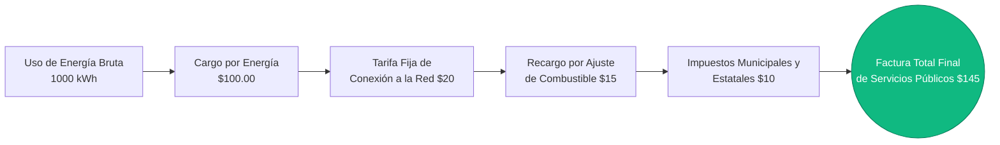
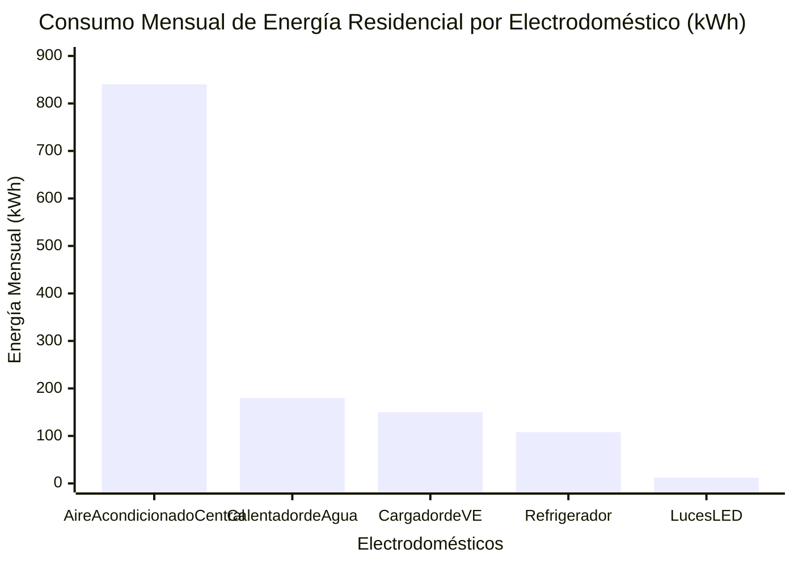
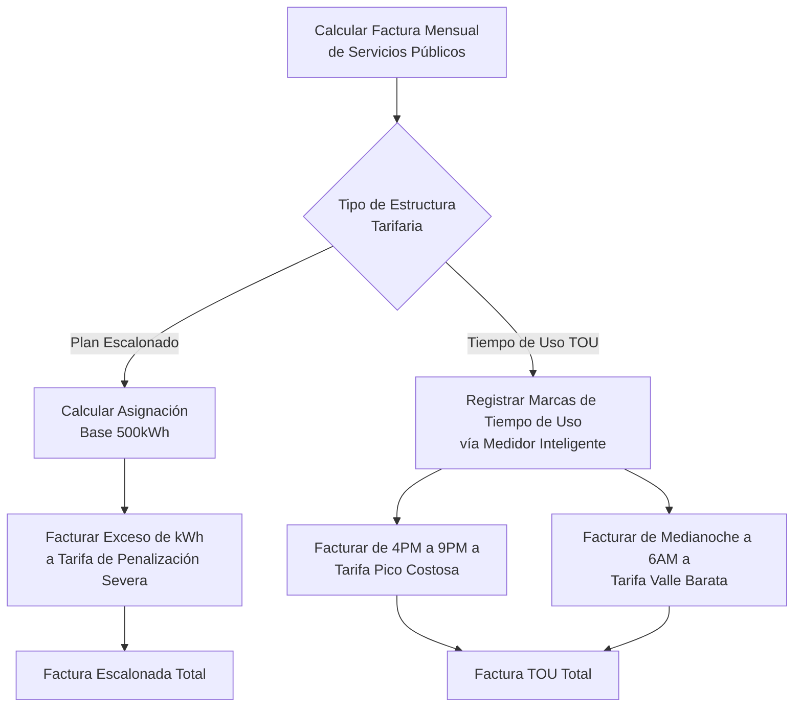
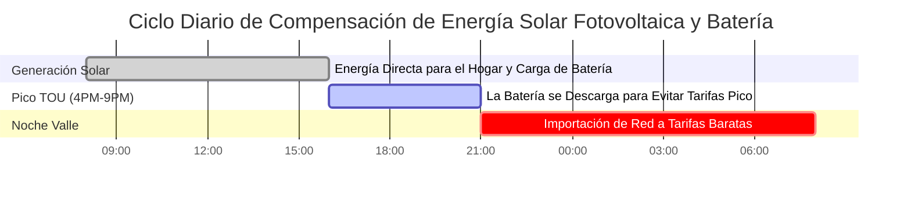

# La Calculadora Definitiva de Costos de Electricidad: Facturas de Servicios Públicos, Tarifas y Auditorías de Energía de Electrodomésticos

Bienvenido a la **Calculadora de Costos de Electricidad** definitiva y la guía integral de gestión de facturas de servicios públicos. Ya sea usted un propietario de vivienda desesperado por descubrir por qué su factura de aire acondicionado de verano se disparó a $\$400$, un gerente de instalaciones comerciales que intenta esquivar matemáticamente los cargos punitivos por Demanda ($/kW), o un futuro propietario de Vehículo Eléctrico (VE) que calcula exactamente cuánto de su presupuesto de gasolina compensará la carga en casa, dominar la termodinámica y los algoritmos financieros de los costos de electricidad es obligatorio.

Su factura eléctrica mensual no es un número único y simple. Es un algoritmo complejo y estructurado agresivamente, diseñado por las compañías de servicios públicos para maximizar los ingresos mientras obligan a los consumidores a conservar energía durante las horas pico de demanda. Combina el consumo de energía bruta (Kilovatios-Hora), severos multiplicadores de Tiempo de Uso (TOU), tarifas de servicio fijo ineludibles y brutales recargos por ajuste de combustible.

En esta exhaustiva clase magistral de SEO de más de 4,000 palabras, deconstruiremos la ecuación fundamental $kWh \times \text{Tarifa}$, decodificaremos matemáticamente la aterradora realidad de las estructuras de Facturación Escalonada, expondremos la sangría financiera causada por la Energía Vampiro en Espera y proyectaremos los costos de servicios públicos a 10 años utilizando tasas de inflación realistas. Para asegurar que comprenda completamente estos conceptos financieros, hemos diseñado cinco diagramas interactivos de Mermaid.js meticulosamente detallados y seguros para el analizador.

---

## 1. Deconstruyendo la Fórmula de la Factura de Servicios Públicos

La base absoluta del costo de la electricidad es el **Kilovatio-Hora (kWh)**. Las compañías de servicios públicos no le cobran por la energía instantánea (Vatios); le cobran por la *acumulación* de esa energía con el tiempo (Energía).

**La Fórmula Fundamental:**
$$\text{Costo} = \text{Energía Total (kWh)} \times \text{Tarifa (\$/kWh)}$$

Para calcular el costo de un solo electrodoméstico, primero debe calcular su consumo de energía:
$$\text{Energía (kWh)} = \frac{\text{Potencia (Vatios)} \times \text{Tiempo (Horas)}}{1000}$$

Sin embargo, la factura final que recibe por correo es sustancialmente más compleja.

**La Verdadera Ecuación de la Factura Total:**
$$\text{Factura Total} = (\text{Energía kWh} \times \text{Tarifa}) + \text{Tarifa de Servicio Fijo} + \text{Cargo por Demanda} + \text{Impuestos}$$

Si consume $1000\text{ kWh}$ a $\$0.15/\text{kWh}$, su cargo por energía es $\$150.00$. Pero una vez que la compañía de servicios públicos agrega una tarifa de conexión a la red de $\$20.00$, un recargo de combustible de $\$15.00$ y $8\%$ de impuestos municipales, su factura total se eleva a $\$199.80$. Esto crea una **Tarifa Efectiva** de $\$0.20/\text{kWh}$—que es el verdadero número que debe usar al calcular los costos de los electrodomésticos.

---

## 2. Los Tres Grandes: Entendiendo las Estructuras de Tarifas de Servicios Públicos

Los monopolios de servicios públicos utilizan tres estructuras de facturación principales para cobrar a los clientes residenciales y comerciales.

### A. Facturación de Tarifa Plana
La estructura tarifaria más simple, pero cada vez más rara. Cada kilovatio-hora que consume, de día o de noche, cuesta exactamente la misma cantidad. 
*Ejemplo: $\$0.16$ por kWh, 24/7.*

### B. Tarifas Escalonadas (Bloques)
Una estructura punitiva diseñada para castigar brutalmente a los hogares de alta energía. El servicio público le otorga una "asignación base" a una tarifa barata. Una vez que cruza ese umbral, la tarifa se dispara.
*Ejemplo:* 
- Nivel 1: $0 \to 500\text{ kWh}$ cuesta $\$0.12/\text{kWh}$.
- Nivel 2: $501 \to 1000\text{ kWh}$ cuesta $\$0.22/\text{kWh}$.
- Nivel 3: $1001+\text{ kWh}$ cuesta $\$0.35/\text{kWh}$.

Si enciende un aire acondicionado potente y empuja su hogar al Nivel 3, cada hora adicional de AC cuesta casi el triple de la tarifa base.

### C. Precios por Tiempo de Uso (TOU)
El estándar moderno para redes de medidores inteligentes. El servicio público le cobra según *cuándo* usa la energía, no solo cuánto.
- **Valle (Medianoche a 6 AM):** $\$0.08/\text{kWh}$ (Perfecto para cargar VE).
- **Medio Pico (Mañana):** $\$0.15/\text{kWh}$.
- **Pico (4 PM a 9 PM):** $\$0.45/\text{kWh}$ (La red está estresada por el regreso de los viajeros).

Bajo un plan TOU, encender su secadora eléctrica a las 6 PM es un suicidio financiero.

---

## 3. La Auditoría de Energía de Electrodomésticos: Encontrando a los Derrochadores

Para reducir su factura eléctrica, debe auditar implacablemente los electrodomésticos de su hogar. No todos los electrodomésticos son iguales. 

### Los Grandes Derrochadores (Calefacción y Refrigeración)
Cualquier electrodoméstico que cambie la temperatura (aires acondicionados, calentadores de espacio, hornos eléctricos, calentadores de agua, secadoras de ropa) consume cantidades masivas de energía. 
- Un aire acondicionado central consume aproximadamente $3500\text{ Vatios}$. Funcionar durante $8\text{ horas}$ consume $28\text{ kWh}$ al día. A $\$0.15/\text{kWh}$, eso es $\$4.20$ cada día, o $\$126.00$ al mes.

### La Sangría Silenciosa (Energía Vampiro)
Los aparatos electrónicos modernos (televisores, barras de sonido, consolas de juegos) nunca se apagan realmente. Entran en "modo de espera", consumiendo de $10\text{W}$ a $20\text{W}$ constantemente.
- Un centro de entretenimiento de $20\text{W}$ dejado en espera 24/7 consume $14.4\text{ kWh}$ al mes. En un año, esto le cuesta $\$26.00$ solo para mantener una luz LED roja encendida.

### Los Héroes de la Eficiencia (Iluminación LED)
Un foco incandescente tradicional consume $60\text{ Vatios}$. Un foco LED equivalente consume $9\text{ Vatios}$. Al actualizar 10 focos que funcionan 6 horas al día, ahorra aproximadamente $90\text{ kWh}$ al mes, recortando inmediatamente $\$13.50$ de su factura.

---

## 4. Costos de Carga en Casa de Vehículos Eléctricos (VE)

La gasolina es cara; los electrones son baratos. ¿Pero qué tan baratos?

Para calcular el costo de una carga completa de VE, necesita la capacidad de la batería y la eficiencia de la red (ya que la conversión de CA a CC pierde aproximadamente un 10% como calor).
$$\text{Costo de Carga} = \frac{\text{kWh de Batería}}{\text{Eficiencia 0.90}} \times \text{Tarifa}$$

Para un Tesla Model Y (batería de $75\text{kWh}$) cargando a una tarifa plana de $\$0.15/\text{kWh}$:
- Energía de red requerida: $75 / 0.90 = 83.3\text{ kWh}$
- Costo Total: $83.3 \times 0.15 = \$12.49$ por un "tanque" lleno.

Si ese Tesla conduce $300\text{ millas}$ con una carga completa, su **Costo Por Milla** es unos microscópicos $\$0.04$ (4 centavos). Compare eso con un auto de gasolina de $25\text{ MPG}$ a $\$3.50/\text{galón}$, que cuesta $\$0.14$ por milla.

---

## 5. Proyecciones a Diez Años e Inflación de Servicios Públicos

Las tarifas de electricidad nunca bajan. Históricamente se inflan a un promedio del $3\%$ al $4\%$ anual debido al mantenimiento de la red, costos de combustible y la inflación.

Si su factura eléctrica mensual actual es de $\$200$ ( $\$2,400$/año ), y su servicio público infla las tarifas un $4\%$ anualmente:
- Año 1: $\$2,400$
- Año 5: $\$2,807$
- Año 10: $\$3,415$

En un período de 10 años, usted pagará a la compañía de servicios públicos la asombrosa cantidad de **$\$28,814$**. Esta aterradora matemática es exactamente la razón por la cual los propietarios invierten $\$15,000$ en sistemas solares fotovoltaicos para congelar sus costos de energía y eliminar la curva de inflación.

---

## 6. Cinco Escenarios de Ingeniería Conceptual con Visualizaciones 2D

Para dominar por completo los algoritmos financieros de la facturación de electricidad, exploraremos visualmente cinco escenarios distintos divididos utilizando diagramas personalizados de Mermaid.js.

### Ejemplo 1: La Anatomía de una Factura de Servicios Públicos

**El Escenario:**
Un propietario está confundido acerca de por qué su cálculo de energía ($1000\text{ kWh} \times \$0.10$) es igual a $\$100$, pero su factura real es $\$145$. 

**Visualización 2D:**
Este diagrama de flujo lógico deconstruye las tarifas e impuestos ocultos que las compañías de servicios públicos acumulan sobre el uso de energía bruta para generar la factura final.



---

### Ejemplo 2: Electrodomésticos Derrochadores de Energía

**El Escenario:**
Un auditor de energía está desglosando la enorme factura mensual de $\$300$ de una casa para mostrarles a los propietarios exactamente qué electrodomésticos están drenando su billetera.

**Las Matemáticas:**
Los sistemas HVAC y los calentadores de agua dominan universalmente el consumo de energía residencial, mientras que la electrónica moderna apenas se registra.

**Visualización 2D:**
Este gráfico de barras clasifica agresivamente a los 5 electrodomésticos principales por su consumo mensual de kWh, exponiendo a los verdaderos culpables de las facturas altas.



---

### Ejemplo 3: Costo Acumulativo a 10 Años (Con Inflación del 4%)

**El Escenario:**
Un vendedor de energía solar está demostrando la brutal realidad de una factura eléctrica de $\$200$/mes compuesta a lo largo de una década con una inflación anual de servicios públicos del $4\%$.

**Las Matemáticas:**
El interés compuesto trabaja en contra del consumidor. $2400 \times (1.04)^n$ da como resultado una curva de gasto exponencial e inevitable.

**Visualización 2D:**
Este gráfico traza los dólares acumulativos aterradores entregados a la compañía de servicios públicos a través de una línea de tiempo de 10 años.

```mermaid
xychart-beta
    title "Gasto Acumulativo de Factura de Servicios Públicos a 10 Años (Inflación Anual del 4%)"
    x-axis "Línea de Tiempo (Años)" [Año 1, Año 3, Año 5, Año 7, Año 10]
    y-axis "Costo Acumulativo ($)" 0 --> 30000
    line [2400, 7552, 13240, 19592, 28814]
```

---

### Ejemplo 4: Lógica de Facturación Escalonada vs Tiempo de Uso (TOU)

**El Escenario:**
Un cliente está decidiendo si permanecer en su plan Escalonado estándar o cambiar a un plan moderno de Tiempo de Uso para cargar su VE por la noche.

**Visualización 2D:**
Este diagrama de flujo de arriba hacia abajo mapea la estricta lógica algorítmica que la compañía de servicios públicos usa para facturar al cliente bajo ambas estructuras tarifarias en competencia.



---

### Ejemplo 5: Ciclo de Compensación de Red de Energía Solar Fotovoltaica y Batería

**El Escenario:**
Un propietario instala un arreglo solar de $10\text{kW}$ y un Tesla Powerwall. Necesitan visualizar cómo el sistema evita los precios Pico de TOU y compensa las importaciones de la red.

**Visualización 2D:**
Este diagrama de Gantt describe el ciclo diario de 24 horas de generación de energía, descarga de batería durante las horas Pico y dependencia de la red solo durante las horas Valle nocturnas baratas.



---

## 7. Conclusión y Reto Financiero

Dominar el cálculo de los Costos de Electricidad es la clave absoluta para la eficiencia financiera y el presupuesto del hogar. Comprender la diferencia entre las tarifas brutas de kWh y la Tarifa Efectiva, evitar las penalizaciones pico del Tiempo de Uso, cazar la energía vampiro en espera y reconocer la amenaza compuesta de la inflación de los servicios públicos le ahorrará decenas de miles de dólares durante una década.

Si paga ciegamente su factura cada mes sin comprender las matemáticas detrás de ella, la compañía de servicios públicos maximizará agresivamente sus ingresos a expensas suyas.

Para garantizar que ha dominado estos conceptos financieros, inicie nuestro Simulador interactivo e intente resolver estos desafíos finales:
1. **La Penalización por Nivel:** Consume $1200\text{ kWh}$ este mes. El Nivel 1 ($0-500\text{ kWh}$) es $\$0.10$. El Nivel 2 ($501-1000\text{ kWh}$) es $\$0.20$. El Nivel 3 ($1001+\text{ kWh}$) es $\$0.35$. Calcule el cargo de energía total exacto.
2. **La Tarifa Efectiva:** Su cargo de energía es $\$120.00$ por $800\text{ kWh}$. El servicio público agrega una tarifa de conexión de $\$25.00$ y $\$15.00$ en impuestos. Calcule su verdadera Tarifa Efectiva por kWh.
3. **El ROI de los LED:** Usted reemplaza veinte focos incandescentes de $60\text{W}$ por veinte focos LED de $10\text{W}$. Funcionan $5\text{ horas}$ al día. A $\$0.15/\text{kWh}$, exactamente ¿cuántos dólares ahorrará en un mes de 30 días?

Confíe en esta calculadora para auditar sus electrodomésticos, modelar sus costos de carga de VE y siempre ser matemáticamente más astuto que los algoritmos de facturación de su compañía de servicios públicos.
