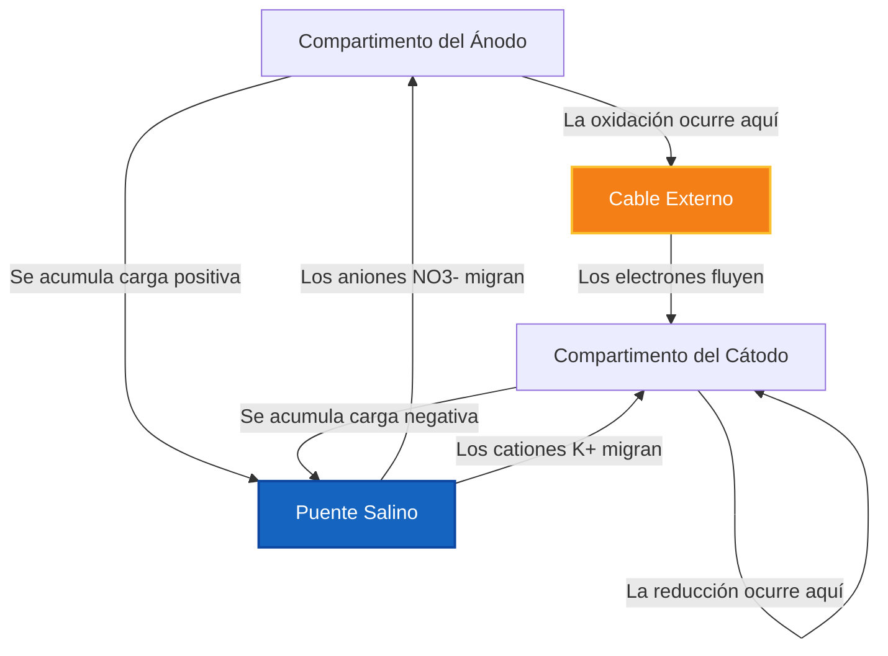

# Guía de Electroquímica Analítica y de Laboratorio para Celdas Electroquímicas

En la química física y la ingeniería electroquímica, una **celda electroquímica** acopla una semirreacción de oxidación en el **ánodo** con una semirreacción de reducción en el **cátodo**:

$$E_{\text{cell}}^\circ = E_{\text{cátodo}}^\circ - E_{\text{ánodo}}^\circ$$

$$E_{\text{cell}} = E_{\text{cell}}^\circ - \frac{R T}{n F} \ln Q \quad \left(\text{A } 25^\circ\text{C} \implies E_{\text{cell}} = E_{\text{cell}}^\circ - \frac{0.05916}{n} \log_{10} Q\right)$$

$$\text{Notación de Celda IUPAC: } \text{Ánodo}(s) \mid \text{Ánodo}^{n+}(aq, c_1) \parallel \text{Cátodo}^{m+}(aq, c_2) \mid \text{Cátodo}(s)$$

$$\Delta G = -n F E_{\text{cell}} \quad \text{y} \quad \Delta G^\circ = -n F E_{\text{cell}}^\circ = -R T \ln K$$

---

## 1. Matriz Clásica de Comparación de Celdas Electroquímicas

| Propiedad | Celda Galvánica / Voltaica | Celda Electrolítica | Celda de Concentración |
| :--- | :--- | :--- | :--- |
| **Espontaneidad** | **Espontánea ($E > 0$, $\Delta G < 0$)** | **No Espontánea ($E < 0$, $\Delta G > 0$)** | **Espontánea ($E > 0$, impulsada por $\Delta C$)** |
| **Conversión de Energía** | **Química $\to$ Eléctrica** | **Eléctrica $\to$ Química** | **Gradiente de Concentración $\to$ Eléctrica** |
| **Carga del Ánodo** | **Negativa ($-$)** | **Positiva ($+$)** | **Negativa ($-$) (Diluido)** |
| **Carga del Cátodo** | **Positiva ($+$)** | **Negativa ($-$)** | **Positiva ($+$) (Concentrado)** |
| **Proceso en el Ánodo** | **Oxidación (Pérdida de $e^-$)** | **Oxidación (Pérdida de $e^-$)** | **Oxidación ($\text{Ag} \to \text{Ag}^+ + e^-$)** |
| **Proceso en el Cátodo**| **Reducción (Ganancia de $e^-$)** | **Reducción (Ganancia de $e^-$)** | **Reducción ($\text{Ag}^+ + e^- \to \text{Ag}$)** |
| **Flujo de Electrones** | **Ánodo $\to$ Cátodo** | **Ánodo $\to$ Cátodo (vía Fuente de Poder)** | **Ánodo $\to$ Cátodo** |

---

## 2. Protocolos Estándar de Cálculo de Celdas Electroquímicas

```
1. Potencial de Celda Estándar: E0_cell = E0_cátodo - E0_ánodo
2. Potencial de Nernst No Estándar: E_cell = E0_cell - (R*T / (n*F)) * ln(Q)
3. Energía Libre de Gibbs: deltaG = -n * F * E_cell (kJ/mol)
4. Voltaje de Celda de Concentración: E_cell = (R*T / (n*F)) * ln(C_alto / C_bajo)
5. Constante de Equilibrio K: log10(K) = (n * E0_cell) / 0.05916
```

---

## 3. Descargo de Responsabilidad de Seguridad Educativa y de Laboratorio
*Esta calculadora de celda electroquímica proporciona cálculos termodinámicos teóricos para aplicaciones educativas, de investigación de laboratorio y química AP. Los sistemas industriales reales de baterías o celdas de galvanoplastia deben tener en cuenta los sobrepotenciales, la resistencia interna óhmica y las limitaciones de transporte de masa.*

## 4. La Guía Completa de las Celdas Electroquímicas

Bienvenido al manual de laboratorio definitivo sobre **Celdas Electroquímicas**. Desde las mitocondrias microscópicas que impulsan sus células hasta los colosales arreglos de iones de litio que estabilizan las redes de energía global, la física fundamental de la electroquímica espacial dicta la existencia moderna.

En esta guía exhaustiva, analizaremos la arquitectura de las celdas tanto Galvánicas (espontáneas) como Electrolíticas (forzadas). Definiremos exactamente cómo calcular los potenciales de reducción estándar ($E^\circ_{\text{cell}}$), demostraremos matemáticamente la necesidad del Puente Salino, y repasaremos cinco derivaciones electroquímicas rigurosas paso a paso. En el camino, visualizaremos estos procesos utilizando diagramas de alta fidelidad de Mermaid.

### 4.1 Anatomía de una Celda Electroquímica

Una celda electroquímica segrega estrictamente una reacción redox en dos compartimentos aislados, forzando a los electrones transferidos a viajar a través de un cable externo. Esto nos permite aprovechar su energía cinética como electricidad.

Cada celda contiene cuatro componentes obligatorios:
1.  **El Ánodo (-/+):** El electrodo donde ocurre la **Oxidación**. Los electrones son despojados del reactivo y empujados hacia el cable. En una batería (celda Galvánica), el ánodo se designa con un signo negativo ($-$) porque es la fuente de electrones.
2.  **El Cátodo (+/-):** El electrodo donde ocurre la **Reducción**. Los electrones emergen del cable y son forzados hacia el reactivo. En una batería, el cátodo se designa con un signo positivo ($+$) porque atrae electrones.
3.  **El Cable Conductor:** Conecta los dos electrodos, permitiendo el flujo de electrones.
4.  **El Puente Salino:** Una necesidad termodinámica absoluta. A medida que los electrones abandonan el ánodo, el compartimento del ánodo acumula una carga positiva masiva y letal. Sin un puente salino, la reacción se detendría instantáneamente después de un microsegundo debido a la repulsión electrostática. El puente salino bombea aniones inertes (como $\text{NO}_3^-$) al ánodo y cationes inertes (como $\text{K}^+$) al cátodo, neutralizando la carga y completando el circuito.

### 4.2 Celdas Galvánicas vs Electrolíticas

Hay dos estados termodinámicos principales para una celda electroquímica:

*   **Celdas Galvánicas (Voltaicas):** Estas son sus baterías estándar. La reacción química es **espontánea** ($\Delta G < 0$). Usted conecta el cable y los químicos empujan naturalmente un voltaje a través de él ($E_{\text{cell}} > 0$).
*   **Celdas Electrolíticas:** Estos son sistemas forzados, como la galvanoplastia de oro o la división del agua en combustible de hidrógeno. La reacción química es **no espontánea** ($\Delta G > 0$). Debe conectar físicamente una fuente de alimentación externa para forzar violentamente a los electrones hacia atrás en contra de su voluntad natural, requiriendo un voltaje de entrada ($E_{\text{cell}} < 0$).

### 4.3 Notación de Celda Estándar IUPAC

Los químicos desarrollaron una taquigrafía llamada Notación de Celda para describir un aparato físico completo en una sola línea de texto. Las reglas son estrictas:
*   El **Ánodo** (Oxidación) SIEMPRE se escribe en el extremo izquierdo.
*   El **Cátodo** (Reducción) SIEMPRE se escribe en el extremo derecho.
*   Una sola barra vertical (`|`) representa un límite de fase físico (por ejemplo, metal sólido tocando agua líquida).
*   Una doble barra vertical (`||`) representa el puente salino físico que separa los dos vasos de precipitados.

Ejemplo: $\text{Zn}(s) \mid \text{Zn}^{2+}(aq) \parallel \text{Cu}^{2+}(aq) \mid \text{Cu}(s)$

---

## 5. Guía de Uso: Dominando la Calculadora de Celdas

Nuestra calculadora actúa como un constructor de celdas termodinámicas universal.

### 5.1 Modo: Constructor de Celdas Galvánicas

1.  **Seleccione el Modo:** Elija "Celda Galvánica/Voltaica".
2.  **Parámetros de Entrada:** Seleccione sus dos semirreacciones de la tabla de potenciales de reducción estándar. La calculadora asignará automáticamente el potencial más positivo al Cátodo (Reducción).
3.  **Leer Salida:** La herramienta muestra instantáneamente $E^\circ_{\text{cell}}$, confirma la espontaneidad y genera la Notación de Celda IUPAC perfecta.

### 5.2 Modo: Reacciones Forzadas Electrolíticas

1.  **Seleccione el Modo:** Elija "Celda Electrolítica".
2.  **Parámetros de Entrada:** Seleccione la reacción que *desea* forzar hacia atrás (por ejemplo, dividir $\text{NaCl}$ en metal de Sodio y gas Cloro).
3.  **Ejecutar:** La herramienta calcula el voltaje negativo masivo que debe superar con una fuente de alimentación externa para desencadenar la reacción.

### 5.3 Modo: Celda de Concentración

1.  **Seleccione el Modo:** Elija "Celda de Concentración".
2.  **Parámetros de Entrada:** Seleccione un solo metal (por ejemplo, Plata) para ambos electrodos. Ingrese una concentración diluida para el ánodo y una molaridad altamente concentrada para el cátodo.
3.  **Ejecutar:** La herramienta calcula el voltaje derivado de Nernst generado puramente por la entropía de difusión, a pesar de que el potencial estándar es matemáticamente cero.

---

## 6. Cinco Ejemplos Reales de Química Analítica

Fundamentemos esta teoría resolviendo cinco escenarios electroquímicos prácticos y rigurosos.

### Ejemplo 1: Construcción de una Celda de Daniell Estándar

**Escenario:** 
Usted construye una celda usando un ánodo de Zinc sólido en $1.0\text{ M } \text{ZnSO}_4$ y un cátodo de Cobre sólido en $1.0\text{ M } \text{CuSO}_4$. 
Potenciales de Reducción Estándar:
*   $\text{Cu}^{2+} + 2e^- \rightleftharpoons \text{Cu} \quad (E^\circ = +0.34\text{ V})$
*   $\text{Zn}^{2+} + 2e^- \rightleftharpoons \text{Zn} \quad (E^\circ = -0.76\text{ V})$

Calcule el potencial de celda estándar ($E^\circ_{\text{cell}}$).

**Derivación Matemática:**

1.  **Identificar Cátodo y Ánodo:**
    La especie con el potencial de reducción más positivo actúa como el Cátodo.
    Cátodo = Cobre ($+0.34\text{ V}$)
    Ánodo = Zinc ($-0.76\text{ V}$)
2.  **Aplicar la Ecuación Estándar:**
    $$ E_{\text{cell}}^\circ = E_{\text{cátodo}}^\circ - E_{\text{ánodo}}^\circ $$
3.  **Calcular:**
    $$ E_{\text{cell}}^\circ = 0.34 - (-0.76) $$
    $$ E_{\text{cell}}^\circ = +1.10\text{ V} $$

**Conclusión:** La celda produce exactamente $1.10\text{ Voltios}$. Debido a que el voltaje es positivo, la reacción es espontánea y este dispositivo funciona como una batería Galvánica.

### Ejemplo 2: Voltaje No Estándar a través de Nernst

**Escenario:**
Deja que la celda de Daniell funcione durante horas. El electrodo de zinc se disuelve, elevando la concentración del ánodo a $[\text{Zn}^{2+}] = 1.90\text{ M}$. El electrodo de cobre se deposita, bajando la concentración del cátodo a $[\text{Cu}^{2+}] = 0.10\text{ M}$. Calcule el nuevo voltaje en tiempo real.

**Derivación Matemática:**

1.  **Identificar los Datos Conocidos:**
    $E^\circ = 1.10\text{ V}$
    $n = 2$ electrones
    $Q = \frac{[\text{Zn}^{2+}]}{[\text{Cu}^{2+}]} = \frac{1.90}{0.10} = 19$
2.  **Aplicar la Ecuación de Nernst (a 25°C):**
    $$ E = E^\circ - \frac{0.05916}{n} \log_{10}(Q) $$
3.  **Calcular:**
    $$ E = 1.10 - \frac{0.05916}{2} \log_{10}(19) $$
    $$ E = 1.10 - (0.02958 \times 1.279) $$
    $$ E = 1.10 - 0.038 = +1.062\text{ V} $$

**Conclusión:** El voltaje ha decaído de $1.10\text{ V}$ a $1.062\text{ V}$. La dependencia logarítmica asegura que el voltaje baje lentamente hasta el final.

### Ejemplo 3: Cálculo de la Energía Libre de Gibbs ($\Delta G$)

**Escenario:**
Una batería de plomo-ácido para automóviles funciona a aproximadamente $+2.05\text{ V}$ por celda con una transferencia de electrones de $n = 2$. Calcule el trabajo termodinámico total (en $\text{kJ}$) que esta celda puede realizar por mol de reactivo.

**Derivación Matemática:**

1.  **Identificar los Datos Conocidos:**
    $E^\circ = 2.05\text{ V}$
    $n = 2\text{ mol } e^-$
    $F = 96485\text{ C/mol}$
2.  **Aplicar la Ecuación de Gibbs:**
    $$ \Delta G^\circ = -nFE^\circ $$
3.  **Calcular:**
    $$ \Delta G^\circ = -(2)(96485)(2.05) $$
    $$ \Delta G^\circ = -395588\text{ J/mol} $$
    $$ \Delta G^\circ = -395.6\text{ kJ/mol} $$

**Conclusión:** La reacción es masivamente espontánea, liberando violentamente $395.6\text{ kJ}$ de energía por mol, proporcionando suficiente par para arrancar un pesado motor de combustión interna.

**Visualización: Lógica de Flujo de Electrones e Iones**


*Este diagrama de flujo prueba que una celda electroquímica requiere dos circuitos completos y simultáneos: el cable para los electrones y el puente salino para los iones espectadores.*

### Ejemplo 4: La Celda de Concentración Impulsada por la Entropía

**Escenario:**
Usted crea una celda usando electrodos de Plata ($\text{Ag}$) en ambos vasos de precipitados. Debido a que ambos metales son idénticos, $E^\circ_{\text{cátodo}} - E^\circ_{\text{ánodo}} = 0.00\text{ V}$. Sin embargo, el Ánodo tiene $[\text{Ag}^+] = 0.001\text{ M}$ y el Cátodo tiene $[\text{Ag}^+] = 2.0\text{ M}$. Calcule el voltaje no estándar.

**Derivación Matemática:**

1.  **Identificar los Datos Conocidos:**
    $E^\circ = 0.00\text{ V}$
    $n = 1$
    $Q = \frac{[\text{Ag}^+]_{\text{ánodo}}}{[\text{Ag}^+]_{\text{cátodo}}} = \frac{0.001}{2.0} = 0.0005$
2.  **Aplicar la Ecuación de Nernst de Concentración:**
    $$ E = 0.00 - \frac{0.05916}{1} \log_{10}(0.0005) $$
3.  **Calcular:**
    $$ E = -0.05916 \times (-3.301) $$
    $$ E = +0.195\text{ V} $$

**Conclusión:** A pesar de tener metales idénticos, ¡la fuerza termodinámica de la difusión (el lado concentrado tratando de diluirse a sí mismo) genera casi $0.2\text{ Voltios}$ de electricidad!

### Ejemplo 5: Electrólisis y Sobrepotencial

**Escenario:**
Desea galvanizar un parachoques de acero con Cromo sólido de un baño de $\text{Cr}^{3+}$. Esto es altamente no espontáneo. El potencial de reducción estándar del Cromo es $-0.74\text{ V}$. Para superar las barreras termodinámicas (y los sobrepotenciales cinéticos), ¿cuánto voltaje debe entregar su fuente de alimentación?

**Derivación Matemática:**

1.  **Identificar el Objetivo:**
    $E^\circ_{\text{reducción}} = -0.74\text{ V}$
2.  **Analizar la Termodinámica:**
    La reacción natural es $\text{Cr} \to \text{Cr}^{3+} + 3e^-$. Queremos forzar la inversa. Por lo tanto, el voltaje de la celda es $-0.74\text{ V}$.
3.  **Aplicar las Reglas de Sobrevoltaje:**
    Para simplemente evitar que el metal se disuelva, debe aplicar exactamente $+0.74\text{ V}$. Para forzar realmente la galvanoplastia a una velocidad utilizable, los ingenieros industriales deben aplicar un "sobrepotencial" de $1$ a $2\text{ Voltios}$ adicionales para superar la energía de activación cinética.

**Conclusión:** La fuente de alimentación debe estar ajustada a por lo menos $2.0\text{ V}$ para forzar agresivamente la reducción no espontánea de los iones de $\text{Cr}^{3+}$ en un hermoso y sólido acabado de cromo.

**Visualización: El Ciclo de Vida de una Celda Voltaica**

```mermaid
gantt
    title Cronograma de Operación de la Batería Galvánica
    dateFormat  HH:mm:ss
    axisFormat  %H:%M
    section Preparación
    Activación del Puente Salino :00:00:00, 00:05:00
    section Descarga Constante
    Agotamiento de Masa del Ánodo :active, 00:05:00, 03:00:00
    Galvanoplastia del Cátodo :active, 00:05:00, 03:00:00
    section Agotamiento Crítico
    Caída Logarítmica de Voltaje :crit, 03:00:00, 03:30:00
    section Muerte
    Equilibrio Termodinámico (E=0V) :03:30:00, 04:00:00
```


*Este cronograma ilustra la degradación física de una batería: el ánodo se disuelve lentamente en iones acuosos mientras el cátodo acumula gruesas capas de metal depositado hasta que el equilibrio detiene el proceso.*

---

## 7. Preguntas Frecuentes Detalladas y Solución de Problemas Avanzados

**P: ¿Se puede construir una celda con dos concentraciones diferentes de la misma sustancia química exacta?**
**R:** ¡Absolutamente! A esto se le llama una Celda de Concentración. Si bien el potencial estándar ($E^\circ$) es $0\text{ V}$, la entropía del universo quiere desesperadamente que ambos vasos de precipitados alcancen exactamente la misma concentración. La ecuación de Nernst prueba que este gradiente de difusión genera electricidad utilizable.

**P: ¿Por qué algunas celdas usan electrodos de Platino?**
**R:** Si su semirreacción involucra solo gases e iones acuosos (como $\text{Fe}^{3+}$ convirtiéndose en $\text{Fe}^{2+}$, o burbujas de gas Hidrógeno), ¡no hay metal sólido para conectar un cable! Usamos un metal inerte como el Platino ($\text{Pt}$) como una superficie física para que los electrones aterricen, sin que el Platino reaccione químicamente en sí mismo.

**P: ¿Qué sucede si el Puente Salino se seca?**
**R:** La celda electroquímica morirá en menos de un milisegundo. Sin el puente salino neutralizando la acumulación masiva de carga positiva en el vaso de precipitados del ánodo, la repulsión electrostática impedirá físicamente que los electrones salgan.

¡Al dominar el cálculo de los Potenciales Estándar, generar con precisión la Notación de Celda IUPAC y comprender la necesidad devastadora del Puente Salino, puede diseñar sistemas de energía electroquímica perfectos! Ya sea que evalúe la corrosión galvánica en un acorazado o diseñe la próxima generación de baterías de estado sólido, ¡confíe en esta Calculadora de Celdas Electroquímicas para obtener precisión termodinámica instantánea!
