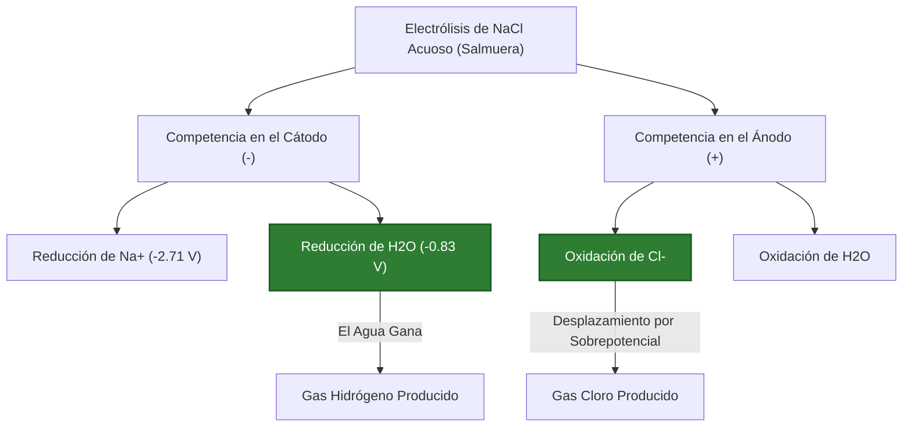

# Guía Completa sobre Electrólisis y Análisis de Celdas Electrolíticas

En electroquímica analítica, metalurgia industrial y tecnología de combustibles de hidrógeno, la **Electrólisis** utiliza energía eléctrica externa para forzar transformaciones químicas no espontáneas:

$$2\text{H}_2\text{O}(l) \xrightarrow{\text{Energía Eléctrica}} 2\text{H}_2(g) + \text{O}_2(g)$$

$$m = \frac{M \cdot I \cdot t}{n \cdot F}$$

$$V_{\text{gas}} = \frac{n_{\text{gas}} \cdot R \cdot T}{P}$$

$$E_{\text{energía}} = V_{\text{aplicado}} \cdot I \cdot t \quad \left(\text{Julios o kWh}\right)$$

---

## 1. Convención de Signos: Celdas Electrolíticas vs. Galvánicas

| Característica | Celda Galvánica (Voltaica) | Celda Electrolítica |
| :--- | :--- | :--- |
| **Conversión de Energía** | Energía Química $\to$ Energía Eléctrica | Energía Eléctrica $\to$ Energía Química |
| **Espontaneidad** | Espontánea ($\Delta G < 0, E^\circ_{\text{celda}} > 0$) | No espontánea ($\Delta G > 0, E^\circ_{\text{celda}} < 0$) |
| **Signo y Reacción del Ánodo** | **Negativo (-)**, Oxidación | **Positivo (+)**, Oxidación |
| **Signo y Reacción del Cátodo** | **Positivo (+)**, Reducción | **Negativo (-)**, Reducción |
| **Flujo de Electrones** | Ánodo $\to$ Cátodo (Circuito Externo) | Fuente de Alimentación $\to$ Cátodo $\to$ Solución $\to$ Ánodo |

---

## 2. Serie Estándar de Descarga Preferencial en Agua

```
Facilidad de Reducción Catódica (Cátodo -):
Ag+ > Cu2+ > H+ (Agua) > Pb2+ > Fe2+ > Zn2+ > Al3+ > Mg2+ > Na+ > K+
(Nota: Los metales debajo del H+ NO se reducen en solución acuosa; en su lugar, se forma gas H2).

Facilidad de Oxidación Anódica (Ánodo +):
I- > Br- > Cl- > OH- (Agua) > SO4(2-) > NO3-
(Nota: Los haluros se oxidan a gas halógeno; el sulfato y nitrato permanecen en solución mientras se forma gas oxígeno).
```

---

## 3. Descargo de Responsabilidad de Seguridad Educativa y de Laboratorio
*Esta calculadora de electrólisis proporciona predicciones termodinámicas y estequiométricas teóricas para aplicaciones educativas, de investigación en laboratorios químicos y de modelado de procesos industriales. Las celdas de electrólisis industriales reales deben considerar las pérdidas por sobrepotencial, la resistencia de las burbujas y la polarización por concentración.*

## 4. La Guía Completa de Electrólisis Aplicada

Bienvenido a la guía industrial y de laboratorio definitiva sobre **Electrólisis**. Desde la generación del combustible de hidrógeno limpio del futuro hasta la extracción de aluminio puro a partir de mineral de bauxita crudo, la electrólisis es la columna vertebral industrial de la civilización moderna.

En este exhaustivo manual de más de 4000 palabras, definiremos rigurosamente las diferencias físicas entre la electrólisis Acuosa y Fundida, desglosaremos las complejas reglas de la **Descarga Preferencial** y detallaremos exactamente cómo convertir Amperios eléctricos en Litros de gas explosivo. Analizaremos cinco derivaciones industriales hiperdetalladas y visualizaremos las vías de los electrones utilizando diagramas de Mermaid de alta fidelidad.

### 4.1 ¿Qué es la Electrólisis?

La electrólisis es el proceso de forzar que ocurra una reacción química no espontánea ($\Delta G > 0$) atacándola violentamente con corriente eléctrica continua (CC). Usted conecta una máquina a una fuente de alimentación y usa el voltaje puro para arrancar electrones de un químico y aplastarlos en otro.

*   **El Cátodo (Negativo):** Conectado al terminal negativo de la batería. Actúa como un cañón de electrones, disparando electrones hacia la solución. La **Reducción** (ganancia de electrones) ocurre aquí. Los Cationes positivos son atraídos hacia el cátodo negativo.
*   **El Ánodo (Positivo):** Conectado al terminal positivo de la batería. Actúa como una aspiradora de electrones. La **Oxidación** (pérdida de electrones) ocurre aquí. Los Aniones negativos son atraídos hacia el ánodo positivo.

### 4.2 Electrólisis Fundida vs. Acuosa

**Electrólisis Fundida:** Usted toma una sal sólida (como $\text{NaCl}$) y la derrite en lava líquida a $800^\circ\text{C}$. No hay agua. Las únicas cosas en el recipiente son $\text{Na}^+$ y $\text{Cl}^-$.
*   Producto del cátodo: Metal de Sodio puro ($\text{Na}^+ + e^- \to \text{Na}$).
*   Producto del ánodo: Gas Cloro tóxico ($2\text{Cl}^- \to \text{Cl}_2 + 2e^-$).

**Electrólisis Acuosa:** Usted disuelve la sal en agua. Ahora tiene una gran competencia. En una solución acuosa de $\text{NaCl}$, los iones de $\text{Na}^+$ y $\text{Cl}^-$ compiten directamente contra las moléculas de $\text{H}_2\text{O}$ por los electrones.
*   Cátodo: El agua es *más fácil* de reducir que el Sodio. El cátodo ignora el Sodio y divide el agua en gas Hidrógeno ($2\text{H}_2\text{O} + 2e^- \to \text{H}_2 + 2\text{OH}^-$).
*   Ánodo: Dependiendo de la concentración, el ánodo oxidará el Cloro en gas $\text{Cl}_2$ u oxidará el agua en gas Oxígeno.

### 4.3 Las Reglas de la Descarga Preferencial

Cuando múltiples iones nadan alrededor del electrodo, ¿cuál gana el electrón? El que requiere la *menor cantidad de energía*.
*   **En el Cátodo:** Gana la especie con el potencial de reducción estándar **más positivo**. Metales como el Cobre y la Plata ganan fácilmente. Los metales activos como el Sodio y el Potasio pierden ante el agua, generando gas Hidrógeno.
*   **En el Ánodo:** Gana la especie con el potencial de reducción **más negativo** (lo que significa que se oxida fácilmente). Los halógenos (Yodo, Bromo, Cloro) generalmente ganan. Los oxianiones poliatómicos (Sulfato $\text{SO}_4^{2-}$, Nitrato $\text{NO}_3^-$) son imposibles de oxidar; el agua se oxidará en su lugar, generando gas Oxígeno.

---

## 5. Guía de Uso: Dominando la Calculadora de Electrólisis

Nuestra calculadora actúa como un solucionador estequiométrico universal para celdas electrolíticas complejas.

### 5.1 Modo: Predecir Productos Acuosos

1.  **Seleccione Objetivo:** Elija "Predecir Productos Acuosos".
2.  **Parámetros de Entrada:** Ingrese su sal disuelta (ej., $\text{CuSO}_4$).
3.  **Ejecutar:** La herramienta evalúa los potenciales estándar. Predice que se forma metal de Cobre en el cátodo (venciendo al agua) y se forma gas Oxígeno en el ánodo (venciendo al sulfato).

### 5.2 Modo: Calcular Volumen de Gas

1.  **Seleccione Objetivo:** Elija "Calcular Volumen de Gas (V)".
2.  **Parámetros de Entrada:** Ingrese la Corriente ($I$), Tiempo ($t$), Temperatura ($T$) y Presión ($P$).
3.  **Ejecutar:** La herramienta calcula la carga eléctrica total, convierte Culombios en Moles de gas a través de la Ley de Faraday y luego usa la Ley de los Gases Ideales para dar como resultado los Litros físicos exactos de gas producido.

### 5.3 Modo: Consumo de Energía

1.  **Seleccione Objetivo:** Elija "Calcular Energía Eléctrica".
2.  **Parámetros de Entrada:** Ingrese el Voltaje de operación ($V$), Corriente ($I$) y Tiempo ($t$).
3.  **Ejecutar:** La herramienta calcula los Julios totales ($E = VIt$) y lo convierte en kilovatios-hora industriales ($\text{kWh}$), que dictan la factura de electricidad de la fábrica.

---

## 6. Cinco Ejemplos Industriales del Mundo Real de Electrólisis

Pongamos en práctica esta teoría resolviendo cinco escenarios de electrólisis rigurosos y prácticos.

### Ejemplo 1: Electrólisis de Cloruro de Sodio Fundido (Celda de Downs)

**Escenario:**
Usted derrite $\text{NaCl}$ sólido puro hasta obtener un líquido a $800^\circ\text{C}$. Pasa $30,000\text{ Amperios}$ de corriente continua a través de la sal fundida por exactamente $2.0\text{ horas}$. Calcule la masa de metal de Sodio puro producida en el cátodo.

**Derivación Matemática:**

1.  **Identificar la Reacción:**
    $\text{Na}^+ + e^- \to \text{Na}(s)$ (por lo tanto, $n = 1$).
    Masa Molar del Na = $22.99\text{ g/mol}$.
2.  **Estandarizar Tiempo:**
    $t = 2.0\text{ horas} \times 3600\text{ s/hr} = 7200\text{ segundos}$.
3.  **Aplicar Ley de Faraday:**
    $$ m = \frac{M \cdot I \cdot t}{n \cdot F} $$
4.  **Calcular:**
    $$ m = \frac{22.99 \times 30000 \times 7200}{1 \times 96485} $$
    $$ m = \frac{4965840000}{96485} = 51467\text{ gramos} $$

**Conclusión:** La masiva corriente de $30\text{ kA}$ produce $51.47\text{ kg}$ de metal de sodio puro elemental en solo dos horas.

### Ejemplo 2: Electrólisis de Cloruro de Sodio Acuoso (Proceso Cloro-Álcali)

**Escenario:**
Usted disuelve $\text{NaCl}$ en agua (Salmuera) y pasa una corriente a través de ella. Prediga los productos en el Ánodo y en el Cátodo, y explique por qué NO se produce metal de Sodio.

**Derivación Lógica (Descarga Preferencial):**

1.  **Analizar el Cátodo (-):**
    Competidores: $\text{Na}^+$ vs $\text{H}_2\text{O}$
    El potencial de reducción del agua es $-0.83\text{ V}$.
    El potencial de reducción del sodio es $-2.71\text{ V}$.
    El agua requiere mucha menos energía. El agua gana.
    **Producto del Cátodo:** Gas Hidrógeno ($\text{H}_2$) y $\text{NaOH}$ (base alcalina).
2.  **Analizar el Ánodo (+):**
    Competidores: $\text{Cl}^-$ vs $\text{H}_2\text{O}$
    Debido a un complejo fenómeno llamado "sobrepotencial", el gas Cloro es un poco más fácil de oxidar en un electrodo industrial que el agua.
    **Producto del Ánodo:** Gas Cloro ($\text{Cl}_2$).

**Conclusión:** La electrólisis de $\text{NaCl}$ acuoso produce gas Hidrógeno, gas Cloro y Lejía líquida ($\text{NaOH}$). ¡Este es el famoso proceso industrial Cloro-Álcali!

### Ejemplo 3: División del Agua para Combustible de Hidrógeno

**Escenario:**
Desea generar gas Hidrógeno para alimentar una celda de combustible. Pasa $15.0\text{ Amperios}$ a través de ácido sulfúrico diluido durante $45.0\text{ minutos}$ a $25^\circ\text{C}$ y $1.0\text{ atm}$. Calcule los Litros físicos totales de gas Hidrógeno producidos.

**Derivación Matemática:**

1.  **Estandarizar Tiempo:**
    $t = 45.0 \times 60 = 2700\text{ segundos}$.
2.  **Identificar Reacción del Cátodo:**
    $2\text{H}^+ + 2e^- \to \text{H}_2(g)$ (por lo tanto, $n=2$ electrones por mol de gas).
3.  **Calcular Moles de Gas ($n_{\text{gas}}$):**
    $$ n_{\text{gas}} = \frac{I \cdot t}{n \cdot F} = \frac{15.0 \times 2700}{2 \times 96485} = 0.2099\text{ moles de }\text{H}_2 $$
4.  **Aplicar Ley de Gases Ideales ($V = nRT/P$):**
    $R = 0.08206\text{ L-atm/mol-K}$
    $T = 298.15\text{ K}$
    $$ V = \frac{0.2099 \times 0.08206 \times 298.15}{1.0} = 5.14\text{ Litros} $$

**Conclusión:** Su máquina de electrólisis de mesa generó exitosamente $5.14\text{ Litros}$ de combustible de hidrógeno de combustión limpia y altamente explosivo.

**Visualización: Lógica de Competencia en Celdas Acuosas**


*Este diagrama de flujo mapea las "batallas" termodinámicas que ocurren en cada electrodo en una solución acuosa, donde el agua lucha activamente contra la sal disuelta.*

### Ejemplo 4: Cálculo del Consumo Industrial de Energía ($\text{kWh}$)

**Escenario:**
Una planta industrial de electrorrefinación de cobre aplica una corriente masiva de $40,000\text{ A}$ a un voltaje de celda de $0.35\text{ V}$ continuamente durante $24.0\text{ horas}$. Calcule el consumo diario de electricidad de la fábrica en kilovatios-hora ($\text{kWh}$).

**Derivación Matemática:**

1.  **Identificar Datos Conocidos:**
    $V = 0.35\text{ Voltios}$
    $I = 40,000\text{ Amperios}$
    $t = 24.0\text{ horas}$
2.  **Calcular Potencia Total en Kilovatios ($\text{kW}$):**
    $\text{Potencia (Vatios)} = V \times I$
    $$ P = 0.35 \times 40000 = 14000\text{ Vatios} = 14.0\text{ kW} $$
3.  **Calcular Energía Total en Kilovatios-Hora ($\text{kWh}$):**
    $$ \text{Energía} = P \times t $$
    $$ \text{Energía} = 14.0\text{ kW} \times 24.0\text{ h} = 336\text{ kWh} $$

**Conclusión:** La fábrica consume $336\text{ kWh}$ de electricidad por día por cada celda. Dado que la purificación de cobre requiere un voltaje muy bajo ($0.35\text{ V}$), el costo de la energía es altamente económico a pesar del enorme amperaje.

### Ejemplo 5: Extracción de Aluminio (Proceso Hall-Héroult)

**Escenario:**
El aluminio no puede ser extraído del agua; debe ser fundido en un baño de criolita fundida. Se pasan $100,000\text{ A}$ durante $1.0\text{ hora}$ a través de $\text{Al}_2\text{O}_3$ fundido.
Dado: Al $M = 26.98\text{ g/mol}$, $n = 3$. Calcule la masa de aluminio producida.

**Derivación Matemática:**

1.  **Estandarizar Unidades:**
    $t = 3600\text{ s}$
2.  **Aplicar Ley de Faraday:**
    $$ m = \frac{M \cdot I \cdot t}{n \cdot F} $$
3.  **Calcular:**
    $$ m = \frac{26.98 \times 100000 \times 3600}{3 \times 96485} $$
    $$ m = \frac{9712800000}{289455} = 33555\text{ g} = 33.5\text{ kg} $$

**Conclusión:** La celda genera $33.5\text{ kg}$ de aluminio fundido puro por hora. ¡Este inmenso requerimiento de energía es el motivo por el cual reciclar latas de aluminio ahorra el $95\%$ de la energía en comparación con fundir mineral nuevo!

**Visualización: Cronograma de Evolución Industrial de Gases**

```mermaid
gantt
    title Operaciones Comerciales de Electrólisis del Agua
    dateFormat  HH:mm:ss
    axisFormat  %H:%M
    section Inicio
    Presurización y Calentamiento de Celda :00:00:00, 00:30:00
    section Estado Estacionario
    Evolución Continua H2 a 15kA :active, 00:30:00, 08:00:00
    Evolución Continua O2 a 15kA :active, 00:30:00, 08:00:00
    section Purga
    Ventilación de Seguridad y Apagado :crit, 08:00:00, 09:00:00
```


*Este diagrama de Gantt visualiza el cronograma estricto de una planta comercial de división de agua, generando corrientes continuas de Hidrógeno y Oxígeno bajo una pesada carga eléctrica.*

---

## 7. Preguntas Frecuentes Detalladas y Resolución Avanzada de Problemas

**P: Si uso una solución acuosa de Sulfato de Cobre(II) ($\text{CuSO}_4$), ¿obtendré gas Hidrógeno en el cátodo?**
**R:** No. El Cobre ($+0.34\text{ V}$) es mucho más fácil de reducir que el agua ($-0.83\text{ V}$). El cátodo recubrirá perfectamente metal de Cobre sólido y hermoso, mientras que el agua se oxidará en el ánodo para producir gas Oxígeno.

**P: ¿Por qué usamos electrodos de Platino o Grafito?**
**R:** Estos son electrodos "inertes". Conducen la electricidad perfectamente, pero se niegan a participar en la reacción química. Si utilizara un ánodo de Cobre en agua, el metal de Cobre mismo se disolvería en el agua en lugar de dividir el agua en gas Oxígeno.

**P: ¿Qué es el Sobrepotencial?**
**R:** Un cálculo teórico podría indicar que solo se necesita $1.23\text{ V}$ para dividir el agua. En realidad, a los gases como el Oxígeno no les gusta formar burbujas sobre superficies sólidas (energía de activación cinética). Es posible que deba subir la fuente de alimentación hasta $2.00\text{ V}$ para forzar que las burbujas se formen realmente. Esta penalización de voltaje adicional se llama sobrepotencial.

¡Al dominar las reglas de la Descarga Preferencial, rastrear a los competidores fundidos vs. acuosos y calcular volúmenes físicos de gas a través de la Ley de los Gases Ideales, usted puede diseñar sistemas perfectos de extracción electroquímica. Confíe en esta Calculadora de Electrólisis para el modelado de procesos instantáneo y termodinámicamente perfecto!
