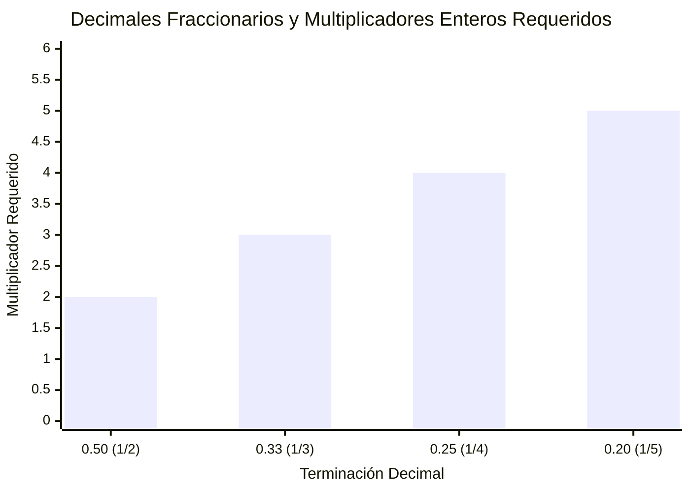
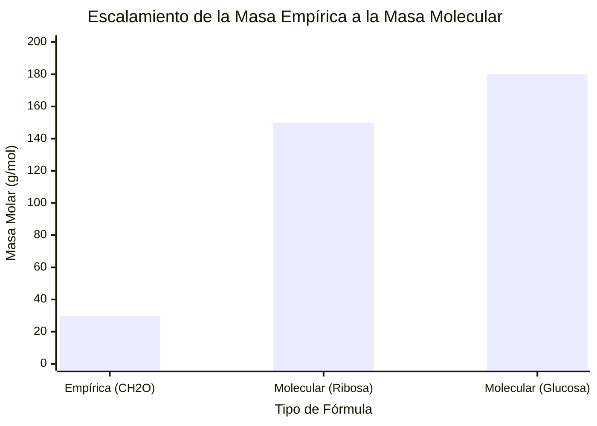
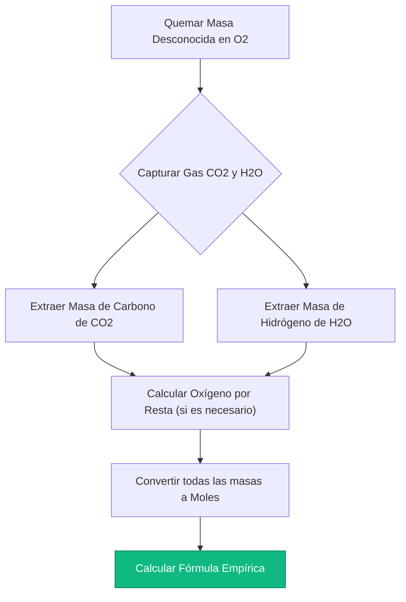
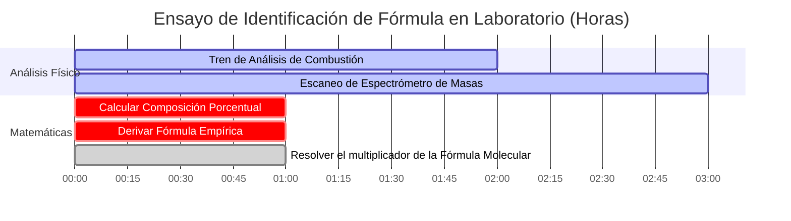

# La Calculadora Definitiva de Fórmula Empírica: Composición y Escalamiento Molecular

Bienvenido a la **Calculadora de Fórmula Empírica** definitiva y a la guía completa de composición elemental. Ya sea que sea un estudiante de Química AP que analiza datos de composición porcentual por primera vez, un químico orgánico que interpreta los resultados de la espectrometría de masas para sintetizar un nuevo fármaco, o un técnico de laboratorio que realiza un análisis de combustión en un hidrocarburo desconocido, dominar la derivación de fórmulas empíricas y moleculares es la piedra angular absoluta de la identificación molecular.

En el análisis químico, nunca se le entrega una fórmula ordenada. En cambio, instrumentos como los espectrómetros de masas y los analizadores elementales escupen datos brutos y caóticos: porcentajes en masa, pesos elementales brutos o picos espectrales. Depende completamente del químico reconstruir matemáticamente el plano molecular exacto del compuesto utilizando proporciones estequiométricas rígidas.

En esta exhaustiva clase magistral de SEO de más de 4,000 palabras, deconstruiremos completamente las matemáticas detrás de la conversión de porcentajes a moles, explicaremos la importancia crítica de los multiplicadores fraccionarios (como exactamente cuándo multiplicar por $2$ o $3$) y decodificaremos el puente algorítmico entre una Fórmula Empírica simple y la Fórmula Molecular física. Para garantizar una comprensión absoluta, hemos incluido cinco diagramas interactivos de Mermaid.js meticulosamente detallados y seguros para analizadores.

---

## 1. Fórmula Empírica vs Fórmula Molecular

Antes de ejecutar cálculos, debe comprender la distinción física crítica entre estos dos conceptos.

**La Fórmula Empírica:** 
La proporción de números enteros más simple y reducida de átomos en un compuesto. 
- *Ejemplo:* La fórmula empírica de la glucosa es $\text{CH}_2\text{O}$. Esto significa que por cada $1\text{ átomo de Carbono}$, hay exactamente $2\text{ átomos de Hidrógeno}$ y $1\text{ átomo de Oxígeno}$.

**La Fórmula Molecular:**
La realidad física real. Le dice exactamente cuántos átomos construyen una molécula única y física del compuesto.
- *Ejemplo:* La fórmula molecular real de la glucosa es $\text{C}_6\text{H}_{12}\text{O}_6$. Está construida físicamente a partir de $24\text{ átomos en total}$.

¿Nota la relación matemática? La Fórmula Molecular es simplemente una versión ampliada (un múltiplo) de la Fórmula Empírica. En el caso de la glucosa, el multiplicador ($n$) es exactamente $6$.
$$(\text{CH}_2\text{O}) \times 6 \rightarrow \text{C}_6\text{H}_{12}\text{O}_6$$

*Nota: A veces, las fórmulas empíricas y moleculares son idénticas. Por ejemplo, el agua ($\text{H}_2\text{O}$) no se puede reducir matemáticamente más. Por lo tanto, $\text{H}_2\text{O}$ es tanto la fórmula empírica como la molecular.*

---

## 2. El Algoritmo Universal: De Porcentajes a Fórmulas

El viaje desde los porcentajes brutos de laboratorio hasta una fórmula química limpia requiere una secuencia algorítmica estricta e inquebrantable de 4 pasos.

**El Escenario:** 
Un laboratorio analiza un misterioso polvo blanco y descubre que contiene $40.00\%\text{ de Carbono}$, $6.71\%\text{ de Hidrógeno}$ y $53.28\%\text{ de Oxígeno}$ en masa. ¿Cuál es la fórmula empírica?

### Paso 1: La Suposición de los 100 Gramos
Debido a que los porcentajes son relativos, simplemente asumimos que poseemos exactamente $100.0\text{ g}$ de la sustancia. Esto transforma mágicamente los porcentajes directamente en gramos físicos.
- $\text{Carbono} = 40.00\text{ g}$
- $\text{Hidrógeno} = 6.71\text{ g}$
- $\text{Oxígeno} = 53.28\text{ g}$

### Paso 2: Convertir Masa a Moles
Las fórmulas químicas son proporciones de *átomos*, no proporciones de *masas*. Debemos dividir la masa de cada elemento por su peso atómico específico de la tabla periódica.
- $\text{Moles C} = \frac{40.00\text{ g}}{12.011\text{ g/mol}} = \mathbf{3.33\text{ mol C}}$
- $\text{Moles H} = \frac{6.71\text{ g}}{1.008\text{ g/mol}} = \mathbf{6.66\text{ mol H}}$
- $\text{Moles O} = \frac{53.28\text{ g}}{15.999\text{ g/mol}} = \mathbf{3.33\text{ mol O}}$

### Paso 3: Dividir por el Más Pequeño
Para encontrar las proporciones relativas, divida cada valor molar por el valor molar *más pequeño* calculado en el Paso 2. (El valor más pequeño aquí es $3.33$).
- $\text{C Relativo} = \frac{3.33}{3.33} = \mathbf{1.00}$
- $\text{H Relativo} = \frac{6.66}{3.33} = \mathbf{2.00}$
- $\text{O Relativo} = \frac{3.33}{3.33} = \mathbf{1.00}$

### Paso 4: Escribir la Fórmula (Sistema de Hill)
¡Las proporciones relativas son números enteros perfectos! La fórmula empírica es $\text{CH}_2\text{O}$. (Nota: Por convención química estándar, el Carbono se escribe primero, el Hidrógeno en segundo lugar y todos los demás elementos alfabéticamente).

---

## 3. La Trampa del Multiplicador Fraccionario

En el mundo real, el Paso 3 rara vez arroja enteros perfectos. ¿Qué sucede si sus proporciones relativas terminan en decimales como $1.5$ o $1.33$? 

**Absolutamente no puede redondearlos.** Redondear una proporción de $1.5$ a $2$ destruye fundamentalmente la identidad química del compuesto. En cambio, debe encontrar un multiplicador de número entero para eliminar la fracción en *todos* los elementos del compuesto.

### Escenarios Comunes de Multiplicadores:
1. **Termina en $.50$ (por ejemplo, $1.5, 2.5$):** Multiplique todos los elementos por **$2$**. 
   - *Ejemplo:* $\text{Fe}_{1}\text{O}_{1.5} \times 2 = \text{Fe}_2\text{O}_3$ (Óxido)
2. **Termina en $.33$ o $.67$ (por ejemplo, $1.33, 1.66$):** Multiplique todos los elementos por **$3$**.
   - *Ejemplo:* $\text{C}_{1}\text{H}_{1.33}\text{O}_1 \times 3 = \text{C}_3\text{H}_4\text{O}_3$ (Ácido pirúvico)
3. **Termina en $.25$ o $.75$ (por ejemplo, $1.25, 2.75$):** Multiplique todos los elementos por **$4$**.
   - *Ejemplo:* $\text{P}_1\text{O}_{2.5} \rightarrow$ espere, en realidad $2.5$ es una fracción de $.5$, multiplique por $2$ para obtener $\text{P}_2\text{O}_5$. Pero, ¿y si fuera $\text{P}_1\text{O}_{1.25}$? Entonces multiplique por $4$ para obtener $\text{P}_4\text{O}_5$.

---

## 4. Puente hacia la Fórmula Molecular

Para pasar de una Fórmula Empírica a una verdadera Fórmula Molecular, el laboratorio debe proporcionarle un dato adicional: la **Masa Molar** real de todo el compuesto (generalmente derivada de un espectrómetro de masas).

**El Cálculo:**
1. Calcule la masa de su Fórmula Empírica.
2. Divida la Masa Molecular real por la Masa Empírica. Esto le da el multiplicador escalar ($n$).
3. Multiplique todos los subíndices en la fórmula empírica por $n$.

**Ejemplo:**
Descubrimos que nuestra fórmula empírica es $\text{CH}_2\text{O}$. Su masa empírica es $(12) + (2) + (16) = \mathbf{30.0\text{ g/mol}}$.
El espectrómetro de masas nos dice que el producto químico real pesa exactamente $\mathbf{180.0\text{ g/mol}}$.
$$n = \frac{180.0}{30.0} = \mathbf{6}$$
Nuestra fórmula molecular es por lo tanto $(\text{CH}_2\text{O}) \times 6 = \mathbf{\text{C}_6\text{H}_{12}\text{O}_6}$ (Glucosa).

---

## 5. Cinco Escenarios de Ingeniería Conceptual con Visualizaciones 2D

Para dominar completamente los algoritmos mecánicos que rigen los multiplicadores fraccionarios, las vías de conversión elemental y el protocolo de laboratorio de análisis de combustión, exploraremos cinco escenarios distintos de química analítica desglosados visualmente utilizando diagramas personalizados de Mermaid.js.

### Ejemplo 1: El Algoritmo de Porcentaje a Fórmula

**El Escenario:**
Un estudiante de Química AP está mapeando la rígida secuencia matemática de 4 pasos requerida para convertir porcentajes brutos de masa de laboratorio en una fórmula empírica limpia y reducida.

**Visualización 2D:**
Este diagrama de flujo mapea visualmente el requisito estricto de pasar por el "Portal de Proporción Molar" antes de intentar escribir subíndices químicos.

---

### Ejemplo 2: La Matriz del Multiplicador Fraccionario

**El Escenario:**
Un químico analítico encuentra proporciones decimales complejas (1.5, 1.33, 1.25) y mapea exactamente qué multiplicador entero se requiere para rescatar la fórmula sin un redondeo destructivo.

**Visualización 2D:**
Este gráfico demuestra gráficamente los multiplicadores exactos requeridos para transformar decimales fraccionarios comunes en enteros químicos perfectos.

---

### Ejemplo 3: Masa Empírica vs Masa Molecular Objetivo

**El Escenario:**
Un bioquímico analiza una molécula de azúcar. La masa empírica es de $30\text{ g/mol}$, pero el espectrómetro de masas detecta múltiples isómeros pesados. Deben escalar la fórmula.

**Visualización 2D:**
Este cuadro comparativo mapea visualmente cómo la masa molecular es simplemente un múltiplo escalar geométrico de la masa empírica base.

---

### Ejemplo 4: Protocolo de Laboratorio de Análisis de Combustión

**El Escenario:**
Un químico orgánico quema un hidrocarburo desconocido en un tren de combustión sellado. Deben calcular hacia atrás la cantidad de Carbono e Hidrógeno a partir de los gases $\text{CO}_2$ y $\text{H}_2\text{O}$ capturados.

**Visualización 2D:**
Este diagrama de flujo de arriba hacia abajo actúa como una receta química estricta, haciendo cumplir la secuencia absoluta de acciones matemáticas requeridas para decodificar un ensayo de análisis de combustión.

---

### Ejemplo 5: Cronograma de Espectrometría de Masas y Análisis

**El Escenario:**
Un laboratorio forense aísla un polvo blanco desconocido. Deben ejecutar una batería completa de pruebas físicas y computacionales para verificar legalmente la identidad molecular exacta del compuesto.

**Visualización 2D:**
Este diagrama de Gantt visualiza la secuencia cronológica de un ensayo físico, demostrando que los cálculos de fórmulas no pueden ocurrir hasta que el espectrómetro de masas termine de escanear la muestra.

---

## 6. Conclusión y Reto de Fórmulas

Dominar la derivación de fórmulas empíricas y moleculares es el requisito de entrada no negociable para ingresar a cualquier laboratorio analítico, biológico o químico. Comprender la rigidez matemática de las proporciones molares, la prohibición absoluta de redondear fracciones como $1.5$ o $1.33$ y la relación escalar entre las masas empíricas y moleculares garantizará que sus identificaciones químicas sean perfectamente precisas.

Si no domina estos algoritmos, su laboratorio identificará erróneamente compuestos críticos, arruinará ampliaciones de síntesis de un millón de dólares y corromperá datos experimentales por puro error humano.

Para garantizar que ha dominado estos conceptos críticos, inicie nuestro Simulador interactivo e intente resolver estos últimos desafíos analíticos:
1. **El Reto del Multiplicador:** Un compuesto contiene $43.64\%\text{ de Fósforo}$ y $56.36\%\text{ de Oxígeno}$. Calcule los moles, divida por el más pequeño y averigüe el multiplicador entero para encontrar la fórmula empírica.
2. **El Reto Molecular:** Un ácido orgánico tiene una fórmula empírica de $\text{CHO}_2$ y una masa empírica de $45.0\text{ g/mol}$. Un espectrómetro de masas determina que la molécula real pesa $90.0\text{ g/mol}$. ¿Cuál es la verdadera fórmula molecular?
3. **El Reto de la Combustión:** Usted quema un hidrocarburo y recolecta $4.40\text{ g}$ de $\text{CO}_2$ y $2.70\text{ g}$ de $\text{H}_2\text{O}$. Primero, extraiga los gramos de Carbono puro e Hidrógeno puro. Luego determine la fórmula empírica de la sustancia quemada.

Confíe en esta calculadora de fórmulas universal para auditar sus protocolos de laboratorio, identificar instantáneamente multiplicadores fraccionarios y dominar permanentemente la termodinámica del análisis de composición química cuantitativa.
